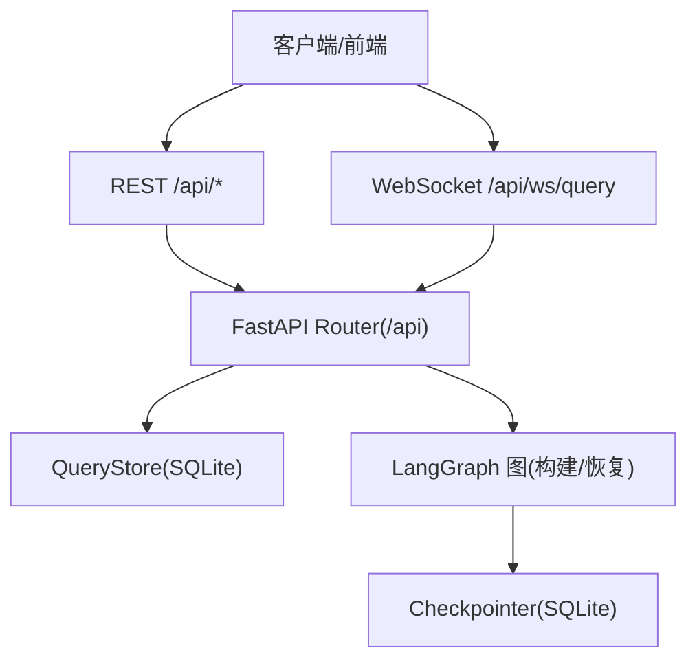
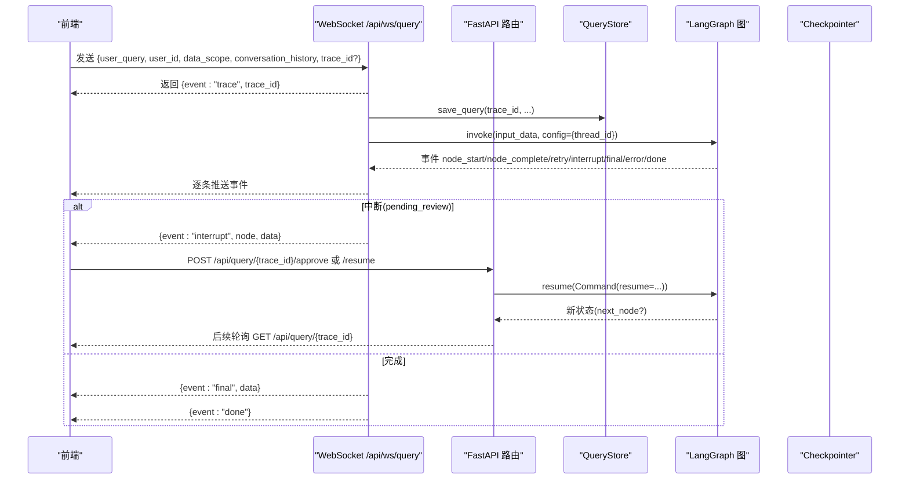
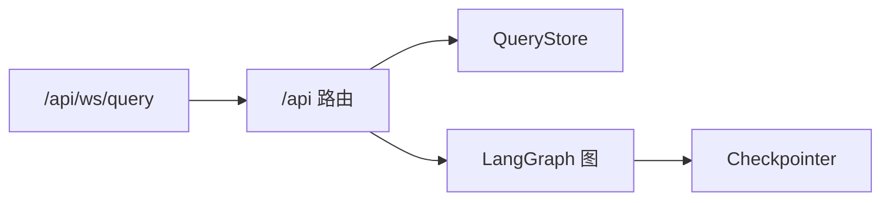
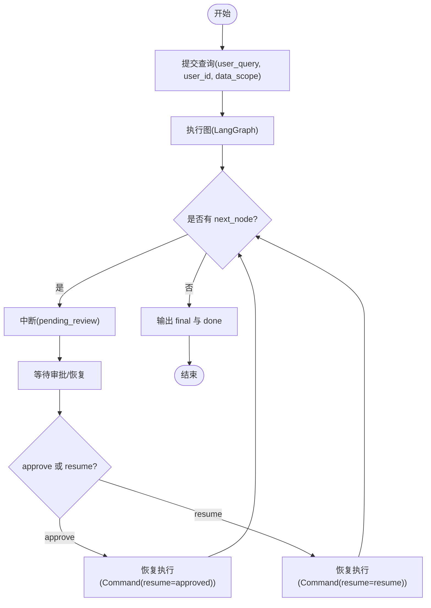
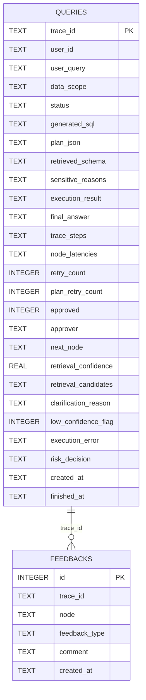

# API接口参考

<cite>
**本文引用的文件**   
- [nl2sql_agent/api.py](file://nl2sql_agent/api.py)
- [nl2sql_agent/main.py](file://nl2sql_agent/main.py)
- [nl2sql_agent/state.py](file://nl2sql_agent/state.py)
- [nl2sql_agent/services/query_store.py](file://nl2sql_agent/services/query_store.py)
- [web/src/api.ts](file://web/src/api.ts)
- [web/src/types.ts](file://web/src/types.ts)
- [NL2SQL.md](file://NL2SQL.md)
</cite>

## 目录
1. [简介](#简介)
2. [项目结构](#项目结构)
3. [核心组件](#核心组件)
4. [架构总览](#架构总览)
5. [详细组件分析](#详细组件分析)
6. [依赖关系分析](#依赖关系分析)
7. [性能考虑](#性能考虑)
8. [故障排查指南](#故障排查指南)
9. [结论](#结论)
10. [附录](#附录)

## 简介
本参考文档面向 NL2SQL 的 RESTful 与 WebSocket API，覆盖查询提交、审批与恢复、状态与历史查询、审计与反馈、配置管理（术语映射/规则）、表结构与注释审核等能力。文档同时给出 WebSocket 流式事件模型、线程状态查询接口说明、请求/响应模式、错误码、客户端集成示例与最佳实践，以及版本管理与迁移建议。

## 项目结构
- FastAPI 应用入口挂载路由，统一暴露 /api/* 前缀的 REST 与 WebSocket 端点。
- 查询执行基于 LangGraph 图，事件通过 EventStream 桥接至 WebSocket。
- 持久化使用 SQLite，存储查询记录、反馈与审核队列。
- 前端 TypeScript SDK 封装了 HTTP 与 WebSocket 调用。

**图示来源** 
- [nl2sql_agent/main.py:46-57](file://nl2sql_agent/main.py#L46-L57)
- [nl2sql_agent/api.py:31-41](file://nl2sql_agent/api.py#L31-L41)
- [nl2sql_agent/services/query_store.py:31-95](file://nl2sql_agent/services/query_store.py#L31-L95)

**章节来源**
- [nl2sql_agent/main.py:46-57](file://nl2sql_agent/main.py#L46-L57)
- [nl2sql_agent/api.py:31-41](file://nl2sql_agent/api.py#L31-L41)

## 核心组件
- REST 路由：/api/query、/api/query/{trace_id}、/api/query/{trace_id}/approve、/api/query/{trace_id}/resume、/api/history、/api/approvals、/api/audit/{trace_id}、/api/feedback、/api/config/*、/api/schema/*
- WebSocket：/api/ws/query 流式推送 pipeline 事件
- 状态与持久化：state 定义、QueryStore 存储查询与反馈
- 前端 SDK：HTTP 与 WebSocket 封装

**章节来源**
- [nl2sql_agent/api.py:224-448](file://nl2sql_agent/api.py#L224-L448)
- [nl2sql_agent/api.py:159-222](file://nl2sql_agent/api.py#L159-L222)
- [nl2sql_agent/state.py:83-146](file://nl2sql_agent/state.py#L83-L146)
- [nl2sql_agent/services/query_store.py:31-214](file://nl2sql_agent/services/query_store.py#L31-L214)
- [web/src/api.ts:1-50](file://web/src/api.ts#L1-L50)

## 架构总览
下图展示一次查询从前端到后端执行的完整流程，包括断线重连与中断恢复。

**图示来源** 
- [nl2sql_agent/api.py:159-222](file://nl2sql_agent/api.py#L159-L222)
- [nl2sql_agent/api.py:234-264](file://nl2sql_agent/api.py#L234-L264)
- [nl2sql_agent/api.py:280-315](file://nl2sql_agent/api.py#L280-L315)
- [nl2sql_agent/api.py:322-354](file://nl2sql_agent/api.py#L322-L354)
- [nl2sql_agent/services/query_store.py:99-144](file://nl2sql_agent/services/query_store.py#L99-L144)

## 详细组件分析

### REST API 规范

#### 通用说明
- 基础路径：/api
- 内容类型：application/json
- 认证方式：部分接口需要管理员令牌 Header X-Admin-Token；其余接口无鉴权（生产环境建议前置网关鉴权）
- 错误格式：HTTP 异常由 FastAPI 返回 JSON，包含 detail 字段

**章节来源**
- [nl2sql_agent/api.py:396-433](file://nl2sql_agent/api.py#L396-L433)

#### 查询提交（非流式）
- 方法：POST
- URL：/api/query
- 请求体：
  - user_query: string
  - user_id: string
  - data_scope: string[]
  - conversation_history: object[]（可选）
  - trace_id: string（可选）
- 响应：
  - 若执行未完成：{ trace_id, status: "running" }
  - 若完成：包含 trace_id 及最终状态与结果字段（如 final_answer、execution_result、generated_sql、trace_steps 等）

**章节来源**
- [nl2sql_agent/api.py:224-264](file://nl2sql_agent/api.py#L224-L264)

#### 查询状态
- 方法：GET
- URL：/api/query/{trace_id}
- 响应：查询记录对象（含 status、user_query、data_scope、generated_sql、plan_json、retrieved_schema、sensitive_reasons、execution_result、final_answer、trace_steps、node_latencies、retry_count、plan_retry_count、approved、approver、next_node、retrieval_confidence、retrieval_candidates、clarification_reason、created_at、finished_at、feedbacks 等）

**章节来源**
- [nl2sql_agent/api.py:266-272](file://nl2sql_agent/api.py#L266-L272)
- [nl2sql_agent/services/query_store.py:141-193](file://nl2sql_agent/services/query_store.py#L141-L193)

#### 审批（敏感/人工确认）
- 方法：POST
- URL：/api/query/{trace_id}/approve
- 请求体：
  - approved: boolean
  - reason: string（可选）
  - approver: string（可选）
- 响应：{ trace_id, status: "resumed" }
- 行为：将流程从 pending_review 继续执行，可能再次进入 pending_review 或直接结束（done/rejected/blocked）

**章节来源**
- [nl2sql_agent/api.py:274-315](file://nl2sql_agent/api.py#L274-L315)

#### 通用恢复（澄清/候选/低置信度等）
- 方法：POST
- URL：/api/query/{trace_id}/resume
- 请求体：
  - resume: object（例如 {"table":"..."} 或 {"continue":true/false}）
  - approver: string（可选）
- 响应：{ trace_id, status: "resumed" }
- 行为：对任意 interrupt 节点进行恢复，可能再次暂停或结束

**章节来源**
- [nl2sql_agent/api.py:317-354](file://nl2sql_agent/api.py#L317-L354)

#### 历史记录
- 方法：GET
- URL：/api/history
- 查询参数：
  - user_id: string（可选）
  - business_line: string（可选）
  - start_date: string（可选）
  - end_date: string（可选）
  - limit: int（默认 200）
- 响应：查询记录列表

**章节来源**
- [nl2sql_agent/api.py:356-365](file://nl2sql_agent/api.py#L356-L365)
- [nl2sql_agent/services/query_store.py:146-172](file://nl2sql_agent/services/query_store.py#L146-L172)

#### 待审批队列
- 方法：GET
- URL：/api/approvals
- 响应：pending_review 状态的记录列表

**章节来源**
- [nl2sql_agent/api.py:367-370](file://nl2sql_agent/api.py#L367-L370)
- [nl2sql_agent/services/query_store.py:174-180](file://nl2sql_agent/services/query_store.py#L174-L180)

#### 审计详情（含反馈）
- 方法：GET
- URL：/api/audit/{trace_id}
- 响应：查询记录 + feedbacks 列表

**章节来源**
- [nl2sql_agent/api.py:372-379](file://nl2sql_agent/api.py#L372-L379)
- [nl2sql_agent/services/query_store.py:195-214](file://nl2sql_agent/services/query_store.py#L195-L214)

#### 反馈
- 方法：POST
- URL：/api/feedback
- 请求体：
  - trace_id: string
  - node: string（可选）
  - feedback_type: string（plan_wrong/sql_wrong/other）
  - comment: string（可选）
- 响应：{ status: "ok" }

**章节来源**
- [nl2sql_agent/api.py:381-392](file://nl2sql_agent/api.py#L381-L392)

#### 配置管理（术语映射）
- 获取术语映射
  - 方法：GET
  - URL：/api/config/term-mapping
  - 查询参数：business_line（默认 "_global"）
  - 响应：{ business_line, mapping }
- 更新术语映射
  - 方法：PUT
  - URL：/api/config/term-mapping
  - 请求体：object（映射字典）
  - 头部：X-Admin-Token（必需）
  - 响应：{ status: "ok", business_line }

**章节来源**
- [nl2sql_agent/api.py:401-433](file://nl2sql_agent/api.py#L401-L433)

#### 配置管理（规则读取）
- 方法：GET
- URL：/api/config/rules
- 响应：{ clarification_rules, complexity_rules, sensitive_rules, settings }（存在则返回）

**章节来源**
- [nl2sql_agent/api.py:436-448](file://nl2sql_agent/api.py#L436-L448)

#### 表结构与注释审核
- 获取某业务线表结构
  - 方法：GET
  - URL：/api/schema
  - 查询参数：business_line（默认 "risk_mart"）
  - 响应：表数组，每表含 columns（name/type/comment/sensitive/overridden）
- 待审核注释队列
  - 方法：GET
  - URL：/api/schema/review
  - 查询参数：datasource（默认 "risk_mart"）、status（默认 "pending"）
  - 响应：审核条目列表
- 通过审核
  - 方法：POST
  - URL：/api/schema/review/{review_id}/approve
  - 请求体：{ edited_comment, reviewer }
  - 响应：{ status: "ok" }
- 驳回审核
  - 方法：POST
  - URL：/api/schema/review/{review_id}/reject
  - 请求体：{ reason, reviewer }
  - 响应：{ status: "ok" }
- 设置表注释
  - 方法：POST
  - URL：/api/schema/{table_name}/comment
  - 请求体：{ comment, reviewer }
  - 查询参数：business_line（默认 "risk_mart"）
  - 响应：{ status: "ok", table_name, comment }
- 设置字段注释
  - 方法：POST
  - URL：/api/schema/{table_name}/{column_name}/comment
  - 请求体：{ comment, reviewer }
  - 查询参数：business_line（默认 "risk_mart"）
  - 响应：{ status: "ok", table_name, column_name, comment }
- 重新入库（增量同步）
  - 方法：POST
  - URL：/api/schema/reingest
  - 查询参数：datasource（默认 "risk_mart"）、business_line（默认 "risk_mart"）
  - 响应：{ status: "ok", ingested, queued, skipped, removed }
- 审核页触发重新入库
  - 方法：POST
  - URL：/api/schema/review/reingest
  - 响应：同 reingest

**章节来源**
- [nl2sql_agent/api.py:458-573](file://nl2sql_agent/api.py#L458-L573)

### WebSocket API 规范

#### 连接与消息
- URL：/api/ws/query
- 连接后首帧：客户端发送 { user_query, user_id, data_scope, conversation_history, trace_id? }
- 服务端回推事件（JSON）：
  - event: "trace" | "node_start" | "node_complete" | "retry" | "interrupt" | "final" | "error" | "done" | "ping" | "restore"
  - 字段：node（可选）、trace_id（必选）、data（可选）、message（可选）

#### 事件语义
- trace：分配 trace_id
- node_start/node_complete：节点开始/完成
- retry：节点重试
- interrupt：流程暂停（pending_review），需通过 /approve 或 /resume 恢复
- final：最终结果（数据/答案）
- error：执行错误
- done：会话结束
- ping：心跳保活（超时未收到会持续 ping）
- restore：断线重连时恢复当前状态（不重复执行）

#### 断线重连
- 携带相同 trace_id 重连：
  - 若 pending_review：推送 interrupt 并关闭连接，等待审批/恢复
  - 若 done/blocked/rejected：推送 final 并关闭连接
  - 其他：推送 restore 并关闭连接

**章节来源**
- [nl2sql_agent/api.py:159-222](file://nl2sql_agent/api.py#L159-L222)
- [web/src/api.ts:30-49](file://web/src/api.ts#L30-L49)
- [web/src/types.ts:37-54](file://web/src/types.ts#L37-L54)

### 线程状态查询接口
- 方法：GET
- URL：/api/query/{trace_id}
- 用途：获取查询的完整状态与中间产物（SQL、计划、Schema 命中、执行结果、错误信息、追踪步骤、延迟等）
- 返回值：见“查询状态”一节

**章节来源**
- [nl2sql_agent/api.py:266-272](file://nl2sql_agent/api.py#L266-L272)
- [nl2sql_agent/services/query_store.py:141-193](file://nl2sql_agent/services/query_store.py#L141-L193)

### 请求/响应模式与字段说明
- QueryRequest（REST 查询）：user_query、user_id、data_scope、conversation_history、trace_id
- ApproveRequest（审批）：approved、reason、approver
- ResumeRequest（恢复）：resume、approver
- FeedbackRequest（反馈）：trace_id、node、feedback_type、comment
- QueryRecord（查询记录）：trace_id、user_id、user_query、data_scope、status、generated_sql、plan_json、retrieved_schema、sensitive_reasons、execution_result、final_answer、trace_steps、node_latencies、retry_count、plan_retry_count、approved、approver、next_node、retrieval_confidence、retrieval_candidates、clarification_reason、created_at、finished_at、feedbacks
- PipelineEvent（WebSocket 事件）：event、node、trace_id、data、message

**章节来源**
- [nl2sql_agent/api.py:224-232](file://nl2sql_agent/api.py#L224-L232)
- [nl2sql_agent/api.py:274-278](file://nl2sql_agent/api.py#L274-L278)
- [nl2sql_agent/api.py:317-321](file://nl2sql_agent/api.py#L317-L321)
- [nl2sql_agent/api.py:381-386](file://nl2sql_agent/api.py#L381-L386)
- [web/src/types.ts:9-35](file://web/src/types.ts#L9-L35)
- [web/src/types.ts:37-54](file://web/src/types.ts#L37-L54)

### 错误码与异常处理
- 404：trace 不存在
- 400：状态不可操作（如非 pending_review 进行审批/恢复）
- 403：缺少管理权限（修改术语映射需 X-Admin-Token）
- 5xx：服务端内部错误（执行异常、数据库错误等）
- WebSocket：onerror/onclose 处理断线，结合 trace_id 重连

**章节来源**
- [nl2sql_agent/api.py:266-272](file://nl2sql_agent/api.py#L266-L272)
- [nl2sql_agent/api.py:280-315](file://nl2sql_agent/api.py#L280-L315)
- [nl2sql_agent/api.py:322-354](file://nl2sql_agent/api.py#L322-L354)
- [nl2sql_agent/api.py:396-433](file://nl2sql_agent/api.py#L396-L433)

### 客户端集成指南与 SDK 使用
- HTTP 封装：提供 apiGet 与 apiPost，自动设置 Content-Type 与错误解析
- WebSocket 封装：submitQuery 建立连接、发送输入、接收事件、支持 onClose
- 前端页面：QueryPage、ApprovalsPage 演示了查询、审批、历史、配置等用法

**章节来源**
- [web/src/api.ts:1-50](file://web/src/api.ts#L1-L50)
- [web/src/pages/QueryPage.tsx:1-200](file://web/src/pages/QueryPage.tsx#L1-L200)
- [web/src/pages/ApprovalsPage.tsx:1-200](file://web/src/pages/ApprovalsPage.tsx#L1-L200)

### 最佳实践
- 使用 trace_id 关联一次查询的全生命周期（WS 事件、REST 状态、审计）
- 对 pending_review 状态及时轮询或监听 WS 事件，避免 UI 卡死
- 在 WS 中实现心跳与断线重连，确保用户体验
- 对敏感查询务必走审批流程，记录 approver 与原因
- 使用 /history 分页与过滤条件限制数据量，提升性能
- 修改术语映射后，前端应刷新缓存或等待热更新生效

[无需来源：本节为通用实践建议]

### 版本管理与兼容性
- 应用版本：0.1.0（FastAPI title/version）
- 向后兼容策略：
  - 新增字段采用可选字段与默认值
  - 旧库迁移：自动补齐列，保证历史数据可用
  - 事件模型扩展：新增 event 类型不影响现有消费者
- 迁移建议：
  - 升级客户端时优先兼容未知 event 类型
  - 对必填字段增加校验，避免破坏性变更

**章节来源**
- [nl2sql_agent/main.py:46](file://nl2sql_agent/main.py#L46-L46)
- [nl2sql_agent/services/query_store.py:77-91](file://nl2sql_agent/services/query_store.py#L77-L91)

### 测试工具与调试方法
- 本地运行：uvicorn nl2sql_agent.main:app
- 前端开发：Vite 默认端口 5173，CORS 已配置
- 调试建议：
  - 使用浏览器开发者工具观察 WS 事件
  - 通过 /api/query/{trace_id} 查看中间状态
  - 使用 /api/audit/{trace_id} 获取反馈与完整链路
- 性能监控：
  - 关注 node_latencies 与 trace_steps
  - 对长耗时节点进行优化（LLM 调用、向量检索、SQL 执行）

**章节来源**
- [nl2sql_agent/main.py:148-152](file://nl2sql_agent/main.py#L148-L152)
- [nl2sql_agent/api.py:266-272](file://nl2sql_agent/api.py#L266-L272)
- [nl2sql_agent/api.py:372-379](file://nl2sql_agent/api.py#L372-L379)

## 依赖关系分析
- FastAPI 路由聚合于 /api
- QueryStore 提供持久化能力
- LangGraph 图负责编排节点与状态流转
- Checkpointer 用于断点续跑与恢复

**图示来源** 
- [nl2sql_agent/main.py:46-57](file://nl2sql_agent/main.py#L46-L57)
- [nl2sql_agent/api.py:31-41](file://nl2sql_agent/api.py#L31-L41)
- [nl2sql_agent/services/query_store.py:31-95](file://nl2sql_agent/services/query_store.py#L31-L95)

**章节来源**
- [nl2sql_agent/main.py:46-57](file://nl2sql_agent/main.py#L46-L57)
- [nl2sql_agent/api.py:31-41](file://nl2sql_agent/api.py#L31-L41)

## 性能考虑
- 异步与并发：WS 事件通过 asyncio 队列与线程桥接，避免阻塞主循环
- 超时控制：REST 查询线程 join 超时返回 running，避免长时间占用
- 心跳保活：WS 定期 ping，防止空闲断开
- 数据量控制：/history 支持 limit 与时间范围过滤
- 索引与存储：SQLite 单文件存储，适合中小规模；大规模可替换为关系型数据库

[无需来源：本节为通用性能建议]

## 故障排查指南
- 常见问题：
  - 404：trace_id 不存在，检查是否传错或过期
  - 400：状态不正确，确认当前状态是否为 pending_review
  - 403：缺少 X-Admin-Token，检查头部是否正确
- 定位方法：
  - 查看 /api/query/{trace_id} 的 execution_error 与 validation_errors
  - 查看 /api/audit/{trace_id} 的 feedbacks 与 trace_steps
  - 前端控制台打印 WS 事件，核对 event 类型与顺序

**章节来源**
- [nl2sql_agent/api.py:266-272](file://nl2sql_agent/api.py#L266-L272)
- [nl2sql_agent/api.py:280-315](file://nl2sql_agent/api.py#L280-L315)
- [nl2sql_agent/api.py:372-379](file://nl2sql_agent/api.py#L372-L379)

## 结论
本参考文档系统化梳理了 NL2SQL 的 REST 与 WebSocket API，涵盖查询、审批、恢复、状态、历史、审计、反馈、配置与审核等能力，并提供客户端集成与最佳实践。通过 trace_id 贯穿全链路，结合 WS 实时事件与 REST 状态查询，可实现稳定、可观测、可恢复的自然语言转 SQL 服务。

[无需来源：本节为总结性内容]

## 附录

### 流程图：查询执行与中断恢复

**图示来源** 
- [nl2sql_agent/api.py:134-157](file://nl2sql_agent/api.py#L134-L157)
- [nl2sql_agent/api.py:280-315](file://nl2sql_agent/api.py#L280-L315)
- [nl2sql_agent/api.py:322-354](file://nl2sql_agent/api.py#L322-L354)

### 数据模型概览

**图示来源** 
- [nl2sql_agent/services/query_store.py:31-95](file://nl2sql_agent/services/query_store.py#L31-L95)