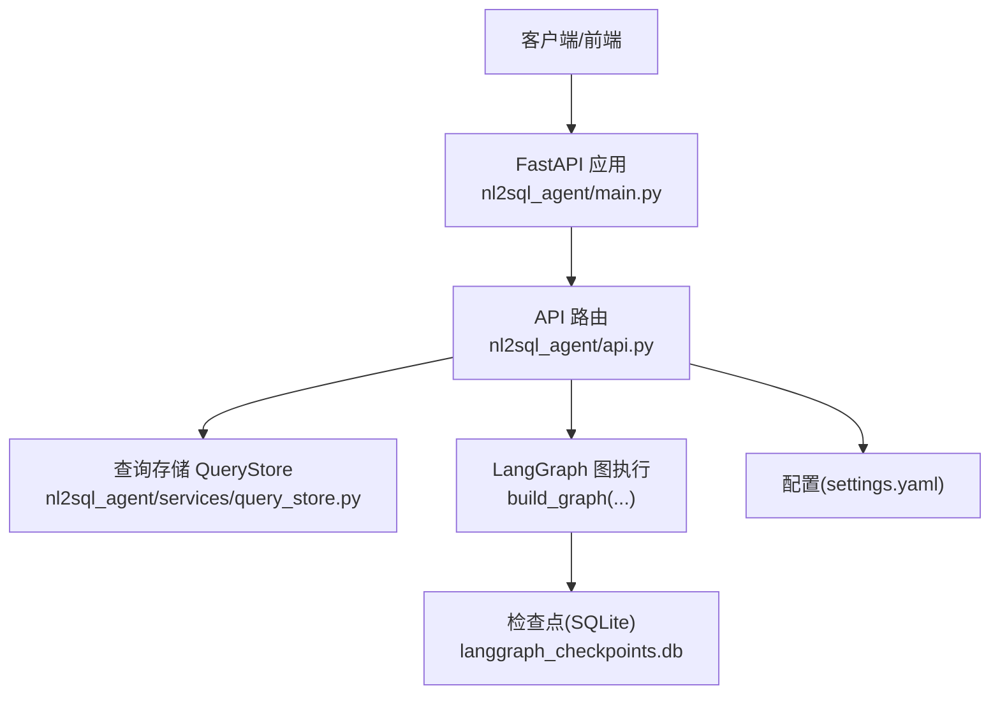
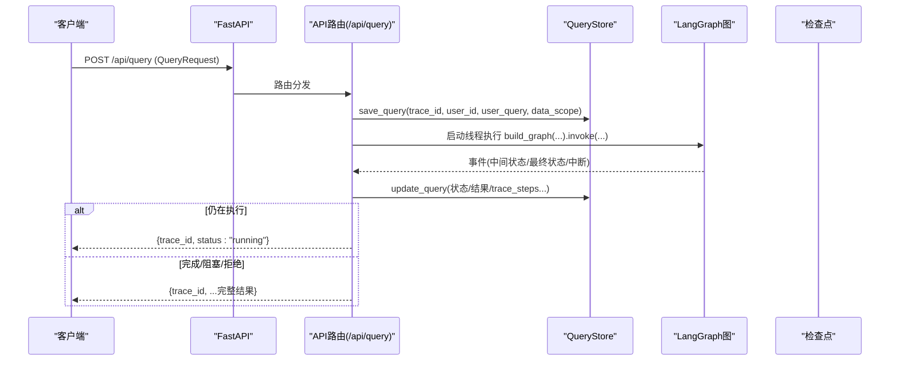

# REST API接口

<cite>
**本文引用的文件**   
- [nl2sql_agent/api.py](file://nl2sql_agent/api.py)
- [nl2sql_agent/services/query_store.py](file://nl2sql_agent/services/query_store.py)
- [nl2sql_agent/main.py](file://nl2sql_agent/main.py)
- [web/src/api.ts](file://web/src/api.ts)
- [nl2sql_agent/config/settings.yaml](file://nl2sql_agent/config/settings.yaml)
</cite>

## 目录
1. [简介](#简介)
2. [项目结构](#项目结构)
3. [核心组件](#核心组件)
4. [架构总览](#架构总览)
5. [详细接口说明](#详细接口说明)
6. [依赖关系分析](#依赖关系分析)
7. [性能与可用性建议](#性能与可用性建议)
8. [故障排查指南](#故障排查指南)
9. [结论](#结论)
10. [附录：数据模型与状态码](#附录数据模型与状态码)

## 简介
本文件为 NL2SQL Agent 的 REST API 接口文档，覆盖查询提交、状态查询、审批、恢复、历史记录、审批列表、审计与反馈等端点。文档面向开发者与集成方，提供 HTTP 方法、URL 模式、请求/响应模型、错误码与状态码、认证与权限控制以及最佳实践说明。

## 项目结构
后端服务基于 FastAPI，REST 路由集中在 nl2sql_agent/api.py；持久化存储使用 SQLite（QueryStore）；前端通过 web/src/api.ts 发起请求与 WebSocket 连接。



**图表来源** 
- [nl2sql_agent/main.py:46-57](file://nl2sql_agent/main.py#L46-L57)
- [nl2sql_agent/api.py:31-42](file://nl2sql_agent/api.py#L31-L42)
- [nl2sql_agent/services/query_store.py:31-76](file://nl2sql_agent/services/query_store.py#L31-L76)
- [nl2sql_agent/config/settings.yaml:1-30](file://nl2sql_agent/config/settings.yaml#L1-L30)

**章节来源**
- [nl2sql_agent/main.py:46-57](file://nl2sql_agent/main.py#L46-L57)
- [nl2sql_agent/api.py:31-42](file://nl2sql_agent/api.py#L31-L42)

## 核心组件
- API 路由层：定义所有 /api/* 端点，处理请求校验、状态流转与持久化。
- 查询存储层：SQLite 存储查询记录、反馈与待审批队列。
- 图执行层：LangGraph 驱动节点执行，支持中断与恢复。
- 配置层：settings.yaml 控制执行策略与安全限制。

**章节来源**
- [nl2sql_agent/api.py:224-392](file://nl2sql_agent/api.py#L224-L392)
- [nl2sql_agent/services/query_store.py:31-96](file://nl2sql_agent/services/query_store.py#L31-L96)
- [nl2sql_agent/config/settings.yaml:18-30](file://nl2sql_agent/config/settings.yaml#L18-L30)

## 架构总览
下图展示一次“非流式查询提交”的端到端流程，包括线程内执行、事件落库与返回结果或“运行中”状态。



**图表来源** 
- [nl2sql_agent/api.py:234-264](file://nl2sql_agent/api.py#L234-L264)
- [nl2sql_agent/api.py:134-157](file://nl2sql_agent/api.py#L134-L157)
- [nl2sql_agent/services/query_store.py:99-134](file://nl2sql_agent/services/query_store.py#L99-L134)

## 详细接口说明

### 通用约定
- 基础路径：/api
- 内容类型：application/json
- 认证方式：部分管理接口需 Header X-Admin-Token，值来自环境变量 ADMIN_TOKEN
- 跨域：开发环境允许 localhost:5173

**章节来源**
- [nl2sql_agent/api.py:396-420](file://nl2sql_agent/api.py#L396-L420)
- [nl2sql_agent/main.py:49-55](file://nl2sql_agent/main.py#L49-L55)

---

### 查询提交
- 方法：POST
- URL：/api/query
- 请求体：QueryRequest
  - user_query: string（必填）
  - user_id: string（必填）
  - data_scope: string[]（可选）
  - conversation_history: dict[]（可选）
  - trace_id: string（可选，未传则服务端生成）
- 成功响应：
  - 若仍在执行：{ trace_id, status: "running" }
  - 若已完成：包含 trace_id 及查询结果字段（如 final_answer、execution_result、generated_sql、trace_steps 等）
- 失败场景：
  - 参数缺失：由框架返回 422
  - 执行异常：status 可能为 error/blocked/rejected，具体取决于图执行结果

示例请求
- POST /api/query
- Body:
  - user_query: "近30天逾期率"
  - user_id: "user_001"
  - data_scope: ["risk_mart"]
  - conversation_history: []
  - trace_id: ""

示例响应（运行中）
- { "trace_id": "t...", "status": "running" }

示例响应（已完成）
- { "trace_id": "t...", "final_answer": "...", "execution_result": [...], "generated_sql": "SELECT ...", "trace_steps": [...] }

**章节来源**
- [nl2sql_agent/api.py:226-264](file://nl2sql_agent/api.py#L226-L264)
- [nl2sql_agent/api.py:134-157](file://nl2sql_agent/api.py#L134-L157)

---

### 状态查询
- 方法：GET
- URL：/api/query/{trace_id}
- 路径参数：
  - trace_id: string（必填）
- 成功响应：返回该 trace_id 对应的查询记录（含 status、final_answer、execution_result、generated_sql、trace_steps 等）
- 失败场景：
  - 404：trace_id 不存在

示例请求
- GET /api/query/t_abc123

示例响应
- { "trace_id": "t_abc123", "status": "done", "final_answer": "...", "execution_result": [...], "generated_sql": "SELECT ...", "trace_steps": [...] }

**章节来源**
- [nl2sql_agent/api.py:266-272](file://nl2sql_agent/api.py#L266-L272)

---

### 审批
- 方法：POST
- URL：/api/query/{trace_id}/approve
- 路径参数：
  - trace_id: string（必填）
- 请求体：ApproveRequest
  - approved: boolean（必填）
  - reason: string（可选）
  - approver: string（可选）
- 成功响应：{ trace_id, status: "resumed" }
- 失败场景：
  - 404：trace_id 不存在
  - 400：当前状态不是 pending_review（不可审批）

示例请求
- POST /api/query/t_abc123/approve
- Body:
  - approved: true
  - reason: "业务确认"
  - approver: "admin_01"

示例响应
- { "trace_id": "t_abc123", "status": "resumed" }

**章节来源**
- [nl2sql_agent/api.py:274-315](file://nl2sql_agent/api.py#L274-L315)

---

### 恢复（通用澄清/中断恢复）
- 方法：POST
- URL：/api/query/{trace_id}/resume
- 路径参数：
  - trace_id: string（必填）
- 请求体：ResumeRequest
  - resume: dict（必填，不同中断节点的恢复值，例如 {"table":"..."} 或 {"continue":true}）
  - approver: string（可选）
- 成功响应：{ trace_id, status: "resumed" }
- 失败场景：
  - 404：trace_id 不存在
  - 400：当前状态不是 pending_review（不可恢复）

示例请求
- POST /api/query/t_abc123/resume
- Body:
  - resume: {"table":"dwd_ar_loan_info"}
  - approver: "admin_01"

示例响应
- { "trace_id": "t_abc123", "status": "resumed" }

**章节来源**
- [nl2sql_agent/api.py:317-354](file://nl2sql_agent/api.py#L317-L354)

---

### 历史记录
- 方法：GET
- URL：/api/history
- 查询参数：
  - user_id: string（可选）
  - business_line: string（可选，按 data_scope 模糊匹配）
  - start_date: string（可选，ISO 时间）
  - end_date: string（可选，ISO 时间）
  - limit: int（默认 200）
- 成功响应：查询记录数组（每条包含 trace_id、status、created_at、user_query 等）
- 失败场景：无特殊错误码

示例请求
- GET /api/history?user_id=user_001&business_line=risk_mart&limit=50

示例响应
- [ { "trace_id":"t_...","status":"done","user_query":"...","created_at":"..." }, ... ]

**章节来源**
- [nl2sql_agent/api.py:356-365](file://nl2sql_agent/api.py#L356-L365)
- [nl2sql_agent/services/query_store.py:146-173](file://nl2sql_agent/services/query_store.py#L146-L173)

---

### 审批列表
- 方法：GET
- URL：/api/approvals
- 成功响应：pending_review 状态的查询记录数组（按创建时间升序）
- 失败场景：无特殊错误码

示例请求
- GET /api/approvals

示例响应
- [ { "trace_id":"t_...","status":"pending_review","user_query":"...","created_at":"..." }, ... ]

**章节来源**
- [nl2sql_agent/api.py:367-370](file://nl2sql_agent/api.py#L367-L370)
- [nl2sql_agent/services/query_store.py:174-181](file://nl2sql_agent/services/query_store.py#L174-L181)

---

### 审计
- 方法：GET
- URL：/api/audit/{trace_id}
- 路径参数：
  - trace_id: string（必填）
- 成功响应：查询记录 + feedbacks 数组（该 trace_id 下的所有反馈）
- 失败场景：
  - 404：trace_id 不存在

示例请求
- GET /api/audit/t_abc123

示例响应
- { "trace_id":"t_abc123","status":"done","final_answer":"...","feedbacks":[{...},...] }

**章节来源**
- [nl2sql_agent/api.py:372-379](file://nl2sql_agent/api.py#L372-L379)
- [nl2sql_agent/services/query_store.py:205-214](file://nl2sql_agent/services/query_store.py#L205-L214)

---

### 反馈
- 方法：POST
- URL：/api/feedback
- 请求体：FeedbackRequest
  - trace_id: string（必填）
  - node: string（可选）
  - feedback_type: string（必填，枚举：plan_wrong / sql_wrong / other）
  - comment: string（可选）
- 成功响应：{ status: "ok" }
- 失败场景：
  - 参数缺失：422

示例请求
- POST /api/feedback
- Body:
  - trace_id: "t_abc123"
  - node: "m7_sql_generation"
  - feedback_type: "sql_wrong"
  - comment: "字段名不匹配"

示例响应
- { "status": "ok" }

**章节来源**
- [nl2sql_agent/api.py:381-392](file://nl2sql_agent/api.py#L381-L392)
- [nl2sql_agent/services/query_store.py:197-204](file://nl2sql_agent/services/query_store.py#L197-L204)

---

### 其他相关接口（配置与审核）
- 术语映射读取：GET /api/config/term-mapping?business_line=_global
- 术语映射写入：PUT /api/config/term-mapping（Header X-Admin-Token）
- 规则读取：GET /api/config/rules
- 表结构与注释审核：GET /api/schema、/api/schema/review、/api/schema/{table}/{column}/comment 等

这些接口用于系统管理与数据治理，不在本次核心目标范围内，但可参考实现。

**章节来源**
- [nl2sql_agent/api.py:396-448](file://nl2sql_agent/api.py#L396-L448)
- [nl2sql_agent/api.py:458-573](file://nl2sql_agent/api.py#L458-L573)

## 依赖关系分析
- API 路由依赖 QueryStore 进行持久化，依赖 LangGraph 构建并执行图。
- 审批与恢复通过 Command(resume=...) 恢复中断的图执行。
- 配置项 settings.yaml 影响执行行为（只读事务、超时、EXPLAIN 阈值等）。

```mermaid
classDiagram
class APIRouter {
+"/api/query"
+"/api/query/{trace_id}"
+"/api/query/{trace_id}/approve"
+"/api/query/{trace_id}/resume"
+"/api/history"
+"/api/approvals"
+"/api/audit/{trace_id}"
+"/api/feedback"
}
class QueryStore {
+save_query()
+update_query()
+get_query()
+list_queries()
+list_pending_approvals()
+add_feedback()
+list_feedbacks()
}
class LangGraph {
+build_graph(deps, checkpointer, event_sink)
+invoke(input, config)
+get_state(config)
}
APIRouter --> QueryStore : "读写查询/反馈"
APIRouter --> LangGraph : "执行/恢复"
```

**图表来源** 
- [nl2sql_agent/api.py:224-392](file://nl2sql_agent/api.py#L224-L392)
- [nl2sql_agent/services/query_store.py:31-214](file://nl2sql_agent/services/query_store.py#L31-L214)

**章节来源**
- [nl2sql_agent/api.py:224-392](file://nl2sql_agent/api.py#L224-L392)
- [nl2sql_agent/services/query_store.py:31-214](file://nl2sql_agent/services/query_store.py#L31-L214)

## 性能与可用性建议
- 查询提交采用线程异步执行，避免阻塞请求；长时间任务建议轮询 GET /api/query/{trace_id} 获取最终状态。
- 设置合理的 execution.timeout_seconds 与 explain_row_threshold，防止慢查询与全表扫描。
- 使用 data_scope 限定检索范围，提升召回质量与执行效率。
- 对高频查询可复用 trace_id 以利用断线重连与恢复能力（WebSocket 已支持，REST 可通过状态查询恢复）。

[本节为通用建议，不直接分析具体文件]

## 故障排查指南
- 404 不存在：检查 trace_id 是否正确，或是否已被清理。
- 400 状态不可操作：仅在 pending_review 状态下调用 approve/resume。
- 422 参数校验失败：检查请求体字段是否符合模型定义。
- 403 权限不足：管理接口需正确设置 X-Admin-Token。
- 执行错误：查看 audit/{trace_id} 中的 execution_error 与 trace_steps。

**章节来源**
- [nl2sql_agent/api.py:266-379](file://nl2sql_agent/api.py#L266-L379)
- [nl2sql_agent/api.py:396-420](file://nl2sql_agent/api.py#L396-L420)

## 结论
本 API 提供了完整的 NL2SQL 查询生命周期管理能力，涵盖提交、状态跟踪、人工审批与恢复、历史与审计、反馈收集等。结合 LangGraph 的检查点机制与 SQLite 持久化，系统具备良好的可恢复性与可观测性。建议在集成时遵循认证与权限控制规范，合理设置执行策略，以提升稳定性与安全性。

[本节为总结性内容，不直接分析具体文件]

## 附录：数据模型与状态码

### 数据模型
- QueryRequest
  - user_query: string
  - user_id: string
  - data_scope: string[]
  - conversation_history: dict[]
  - trace_id: string（可选）
- ApproveRequest
  - approved: boolean
  - reason: string（可选）
  - approver: string（可选）
- ResumeRequest
  - resume: dict（必填，按中断节点语义传递恢复值）
  - approver: string（可选）
- FeedbackRequest
  - trace_id: string
  - node: string（可选）
  - feedback_type: string（plan_wrong/sql_wrong/other）
  - comment: string（可选）

**章节来源**
- [nl2sql_agent/api.py:226-232](file://nl2sql_agent/api.py#L226-L232)
- [nl2sql_agent/api.py:274-278](file://nl2sql_agent/api.py#L274-L278)
- [nl2sql_agent/api.py:317-321](file://nl2sql_agent/api.py#L317-L321)
- [nl2sql_agent/api.py:381-387](file://nl2sql_agent/api.py#L381-L387)

### 常见状态码
- 200：成功
- 400：请求参数或状态不正确（如非 pending_review 调用 approve/resume）
- 403：权限不足（缺少或错误的 X-Admin-Token）
- 404：资源不存在（trace_id 不存在）
- 422：请求体验证失败

**章节来源**
- [nl2sql_agent/api.py:266-379](file://nl2sql_agent/api.py#L266-L379)
- [nl2sql_agent/api.py:396-420](file://nl2sql_agent/api.py#L396-L420)

### 执行与配置要点
- 只读事务：execution.read_only=true（MySQL START TRANSACTION READ ONLY）
- 查询限制：execution.limit=1000（未聚合强制 LIMIT）
- 超时控制：execution.timeout_seconds=30
- EXPLAIN 阈值：execution.explain_row_threshold=1000000

**章节来源**
- [nl2sql_agent/config/settings.yaml:18-23](file://nl2sql_agent/config/settings.yaml#L18-L23)