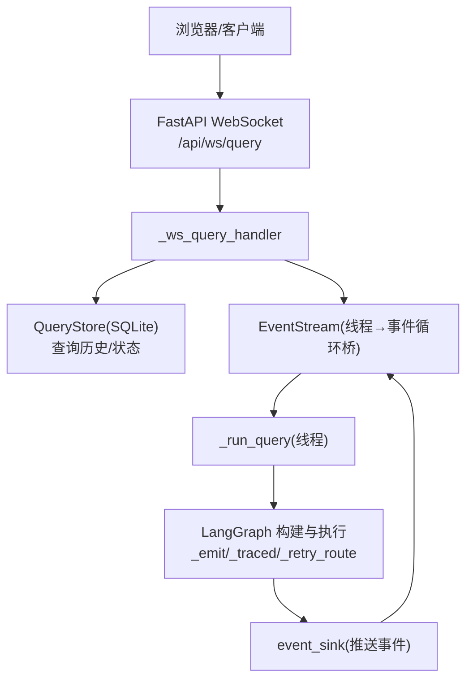
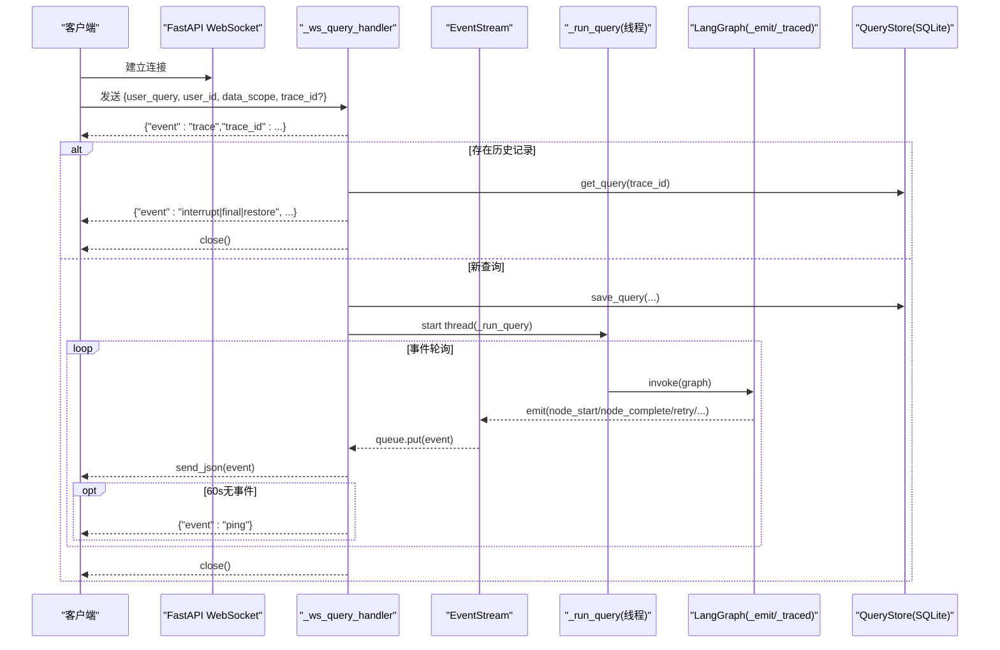
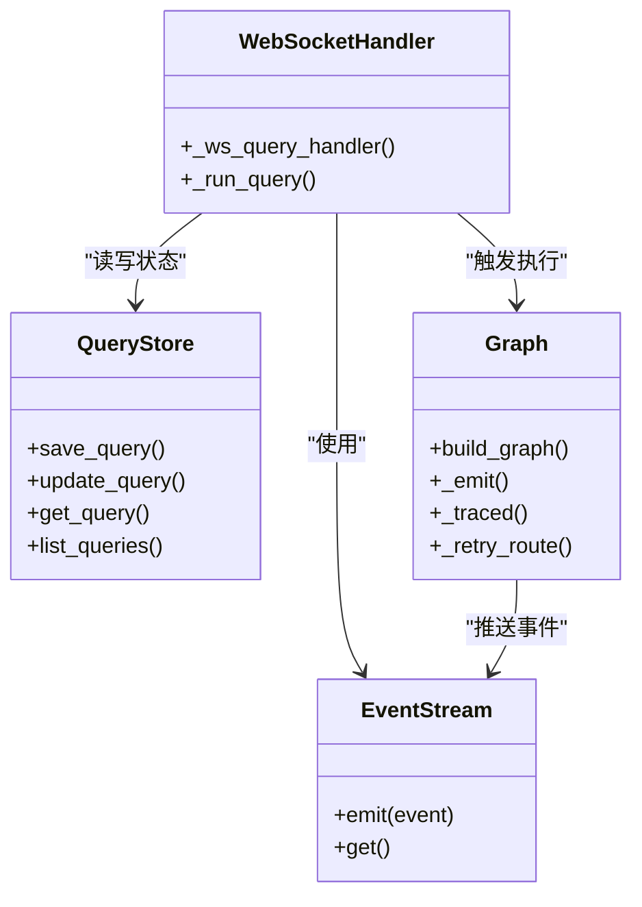

# WebSocket接口

<cite>
**本文引用的文件**   
- [nl2sql_agent/api.py](file://nl2sql_agent/api.py)
- [nl2sql_agent/graph.py](file://nl2sql_agent/graph.py)
- [nl2sql_agent/services/query_store.py](file://nl2sql_agent/services/query_store.py)
- [web/src/types.ts](file://web/src/types.ts)
- [web/src/api.ts](file://web/src/api.ts)
- [web/src/pages/QueryPage.tsx](file://web/src/pages/QueryPage.tsx)
</cite>

## 目录
1. [简介](#简介)
2. [项目结构](#项目结构)
3. [核心组件](#核心组件)
4. [架构总览](#架构总览)
5. [详细组件分析](#详细组件分析)
6. [依赖关系分析](#依赖关系分析)
7. [性能考量](#性能考量)
8. [故障排查指南](#故障排查指南)
9. [结论](#结论)
10. [附录：客户端实现与调试建议](#附录客户端实现与调试建议)

## 简介
本文件为 NL2SQL 的 WebSocket 流式查询接口 WS /ws/query 提供完整接口文档。内容涵盖连接建立、消息格式、事件类型与实时交互模式，并说明客户端连接管理、断线重连机制、消息序列化与错误处理策略。同时给出完整的客户端实现示例（基于前端代码），以及性能优化与调试工具使用建议。

## 项目结构
- 后端 FastAPI 路由与 WebSocket 处理器位于 nl2sql_agent/api.py
- 图执行与事件发射逻辑位于 nl2sql_agent/graph.py
- 查询历史与持久化存储位于 nl2sql_agent/services/query_store.py
- 前端类型定义位于 web/src/types.ts
- 前端 WebSocket 封装位于 web/src/api.ts
- 前端页面与事件处理位于 web/src/pages/QueryPage.tsx

图表来源 
- [nl2sql_agent/api.py:161-210](file://nl2sql_agent/api.py#L161-L210)
- [nl2sql_agent/graph.py:72-126](file://nl2sql_agent/graph.py#L72-L126)
- [nl2sql_agent/services/query_store.py:31-124](file://nl2sql_agent/services/query_store.py#L31-L124)

章节来源
- [nl2sql_agent/api.py:1-573](file://nl2sql_agent/api.py#L1-L573)
- [nl2sql_agent/graph.py:70-269](file://nl2sql_agent/graph.py#L70-L269)
- [nl2sql_agent/services/query_store.py:1-214](file://nl2sql_agent/services/query_store.py#L1-L214)
- [web/src/types.ts:1-72](file://web/src/types.ts#L1-L72)
- [web/src/api.ts:1-49](file://web/src/api.ts#L1-L49)
- [web/src/pages/QueryPage.tsx:291-333](file://web/src/pages/QueryPage.tsx#L291-L333)

## 核心组件
- EventStream：同步线程到 asyncio 事件循环的桥接器，用于将 LangGraph 执行线程产生的事件安全地投递到 WebSocket 协程队列中。
- _ws_query_handler：WebSocket 请求处理器，负责分配 trace_id、断线重连恢复、启动查询线程、轮询事件并推送给客户端。
- _run_query：在独立线程中执行 LangGraph 图，按结果推送 final/interrupt/error/done 等事件，并落库持久化。
- QueryStore：SQLite 存储层，维护查询记录、状态、审批与反馈信息，支持断线重连时的状态恢复。
- graph._emit/_traced/_retry_route：统一的事件发射与节点追踪包装，向 event_sink 推送 node_start/node_complete/retry 等事件。

章节来源
- [nl2sql_agent/api.py:54-66](file://nl2sql_agent/api.py#L54-L66)
- [nl2sql_agent/api.py:134-210](file://nl2sql_agent/api.py#L134-L210)
- [nl2sql_agent/services/query_store.py:31-124](file://nl2sql_agent/services/query_store.py#L31-L124)
- [nl2sql_agent/graph.py:72-126](file://nl2sql_agent/graph.py#L72-L126)

## 架构总览
WS /ws/query 的交互流程如下：
- 客户端建立 WebSocket 连接，发送包含 user_query、user_id、data_scope、trace_id（可选）的消息。
- 服务端立即返回 trace 事件，分配或确认 trace_id。
- 若 trace_id 已存在，根据状态进行断线重连恢复：
  - pending_review：推送 interrupt 事件后关闭连接，等待人工审批。
  - done/blocked/rejected：推送 final 事件后关闭连接。
  - 其他运行中状态：推送 restore 事件后关闭连接。
- 否则新建查询：保存初始记录，启动线程执行图，通过 EventStream 推送事件。
- 服务端每 60 秒无事件时发送 ping 心跳；收到 final/interrupt/error/done 后关闭连接。

图表来源 
- [nl2sql_agent/api.py:161-210](file://nl2sql_agent/api.py#L161-L210)
- [nl2sql_agent/graph.py:72-126](file://nl2sql_agent/graph.py#L72-L126)
- [nl2sql_agent/services/query_store.py:99-124](file://nl2sql_agent/services/query_store.py#L99-L124)

## 详细组件分析

### WebSocket 连接与消息格式
- 端点：/api/ws/query
- 连接建立：客户端通过 ws/wss 协议连接该端点。
- 首条消息：客户端需发送 JSON，字段包括：
  - user_query：自然语言查询文本
  - user_id：用户标识
  - data_scope：业务线列表
  - conversation_history：对话历史（可选）
  - trace_id：会话追踪ID（可选，服务端会生成或复用）
- 响应事件：服务端以 JSON 帧推送事件，每个事件包含 event、trace_id，部分事件包含 node、data、message。

章节来源
- [web/src/api.ts:31-49](file://web/src/api.ts#L31-L49)
- [nl2sql_agent/api.py:161-180](file://nl2sql_agent/api.py#L161-L180)

### 支持的 WebSocket 事件类型
- trace：连接建立后首个事件，包含分配的 trace_id。
- node_start：节点开始执行，包含 node 名称。
- node_complete：节点完成执行，包含 node 名称与数据。
- retry：节点重试，包含 node 名称与重试原因/次数。
- interrupt：流程暂停等待人工处理（如 human_review、clarify_candidates、clarify_low_confidence），包含 node 名称与数据。
- final：最终结果，包含完整 state 数据。
- error：错误事件，包含 message。
- done：连接结束标志。
- ping：心跳检测，每 60 秒无事件时发送。
- restore：断线重连恢复，包含当前状态数据。

章节来源
- [web/src/types.ts:37-54](file://web/src/types.ts#L37-L54)
- [nl2sql_agent/api.py:145-156](file://nl2sql_agent/api.py#L145-L156)
- [nl2sql_agent/api.py:163-180](file://nl2sql_agent/api.py#L163-L180)
- [nl2sql_agent/api.py:205-210](file://nl2sql_agent/api.py#L205-L210)
- [nl2sql_agent/graph.py:106-126](file://nl2sql_agent/graph.py#L106-L126)

### 实时交互模式
- 客户端发送查询后，服务端持续推送节点事件，前端可实时更新 UI。
- 当流程进入需要人工处理的节点（如敏感检查命中、候选表不确定、低置信度），服务端推送 interrupt 事件，前端展示交互界面。
- 完成后推送 final 事件，表示查询结束。
- 连接结束时推送 done 事件。

章节来源
- [web/src/pages/QueryPage.tsx:291-333](file://web/src/pages/QueryPage.tsx#L291-L333)
- [nl2sql_agent/api.py:145-156](file://nl2sql_agent/api.py#L145-L156)

### 断线重连机制
- 客户端断开后重新连接同一 trace_id：
  - 若状态为 pending_review：推送 interrupt 事件后关闭连接，等待人工审批。
  - 若状态为 done/blocked/rejected：推送 final 事件后关闭连接。
  - 其他运行中状态：推送 restore 事件后关闭连接。
- 前端可通过 REST API 查询状态并轮询等待完成。

章节来源
- [nl2sql_agent/api.py:165-180](file://nl2sql_agent/api.py#L165-L180)
- [web/src/pages/QueryPage.tsx:359-392](file://web/src/pages/QueryPage.tsx#L359-L392)

### 消息序列化与错误处理
- 所有事件均为 JSON 格式，包含标准字段。
- 错误处理：异常时推送 error 事件，并更新数据库状态为 error。
- 事件推送失败不影响流程执行，确保健壮性。

章节来源
- [nl2sql_agent/api.py:152-156](file://nl2sql_agent/api.py#L152-L156)
- [nl2sql_agent/graph.py:72-85](file://nl2sql_agent/graph.py#L72-L85)

## 依赖关系分析
- WebSocket 处理器依赖 EventStream 进行线程间通信。
- 图执行依赖 _emit/_traced/_retry_route 进行事件发射和节点追踪。
- 持久化依赖 QueryStore 进行状态管理和历史记录。
- 前端依赖 types.ts 定义事件类型，api.ts 封装 WebSocket 连接。

图表来源 
- [nl2sql_agent/api.py:54-66](file://nl2sql_agent/api.py#L54-L66)
- [nl2sql_agent/graph.py:72-126](file://nl2sql_agent/graph.py#L72-L126)
- [nl2sql_agent/services/query_store.py:31-124](file://nl2sql_agent/services/query_store.py#L31-L124)

章节来源
- [nl2sql_agent/api.py:161-210](file://nl2sql_agent/api.py#L161-L210)
- [nl2sql_agent/graph.py:72-126](file://nl2sql_agent/graph.py#L72-L126)
- [nl2sql_agent/services/query_store.py:31-124](file://nl2sql_agent/services/query_store.py#L31-L124)

## 性能考量
- 事件推送采用异步队列，避免阻塞 WebSocket 协程。
- 图执行在独立线程中进行，不阻塞主事件循环。
- 心跳机制每 60 秒发送一次，保持连接活跃。
- SQLite 使用 WAL 模式和 busy_timeout 提高并发性能。
- 事件推送失败不影响流程执行，确保系统稳定性。

章节来源
- [nl2sql_agent/api.py:54-66](file://nl2sql_agent/api.py#L54-L66)
- [nl2sql_agent/api.py:197-210](file://nl2sql_agent/api.py#L197-L210)
- [nl2sql_agent/services/query_store.py:92-95](file://nl2sql_agent/services/query_store.py#L92-L95)

## 故障排查指南
- 连接问题：检查 WebSocket 连接是否成功建立，网络是否正常。
- 事件缺失：检查 EventStream 队列是否有事件，确认线程间通信是否正常。
- 状态不一致：检查 QueryStore 中的记录状态是否与前端显示一致。
- 错误处理：查看 error 事件中的 message 字段，定位具体错误原因。
- 断线重连：确认 trace_id 是否正确传递，状态恢复逻辑是否正常。

章节来源
- [nl2sql_agent/api.py:152-156](file://nl2sql_agent/api.py#L152-L156)
- [nl2sql_agent/api.py:165-180](file://nl2sql_agent/api.py#L165-L180)
- [web/src/pages/QueryPage.tsx:359-392](file://web/src/pages/QueryPage.tsx#L359-L392)

## 结论
NL2SQL 的 WebSocket 接口提供了完整的流式查询能力，支持丰富的节点事件和断线重连机制。通过 EventStream 和 QueryStore 的配合，实现了高性能、高可靠性的实时交互体验。前端实现简洁明了，便于扩展和维护。

## 附录：客户端实现与调试建议

### 客户端实现示例
基于前端代码的 WebSocket 客户端实现：
- 连接建立：使用 ws/wss 协议连接 /api/ws/query
- 消息发送：发送包含 user_query、user_id、data_scope、trace_id 的 JSON
- 事件处理：接收并处理各种事件类型，更新 UI 状态
- 错误处理：捕获连接错误和解析错误，进行适当处理

章节来源
- [web/src/api.ts:31-49](file://web/src/api.ts#L31-L49)
- [web/src/pages/QueryPage.tsx:291-333](file://web/src/pages/QueryPage.tsx#L291-L333)

### 调试工具使用方法
- 浏览器开发者工具：监控 WebSocket 连接和消息收发
- 日志输出：查看服务端的 print 语句和异常堆栈
- 数据库查询：直接查询 SQLite 数据库验证状态
- 网络抓包：使用 Wireshark 或浏览器 Network 面板分析协议细节

章节来源
- [nl2sql_agent/api.py:291-314](file://nl2sql_agent/api.py#L291-L314)
- [nl2sql_agent/services/query_store.py:141-193](file://nl2sql_agent/services/query_store.py#L141-L193)