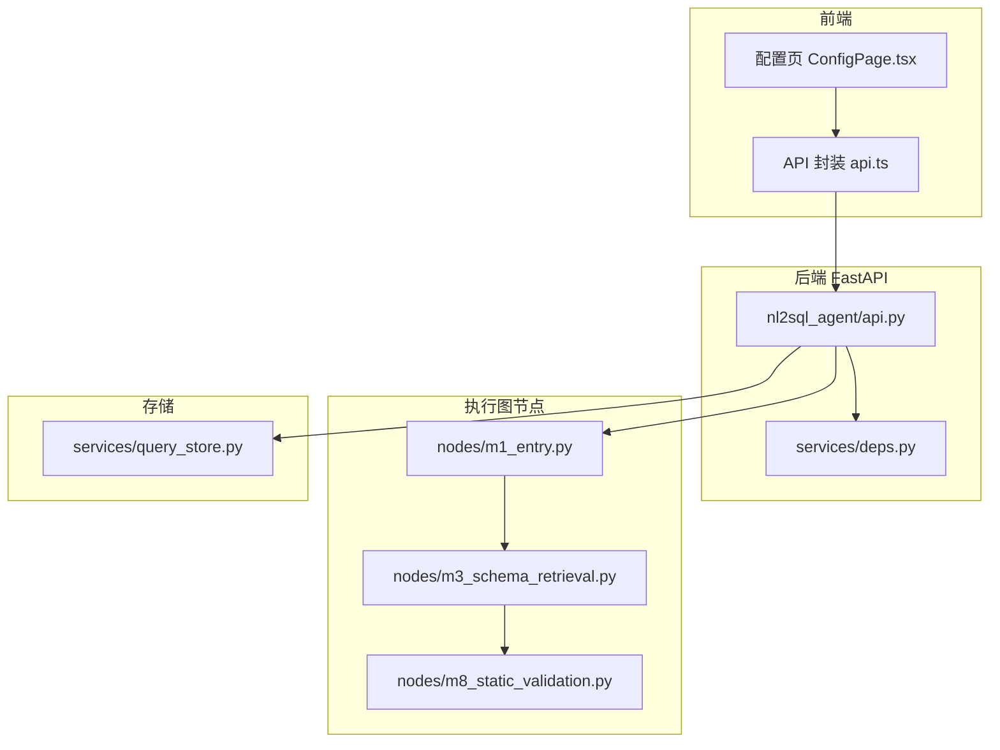
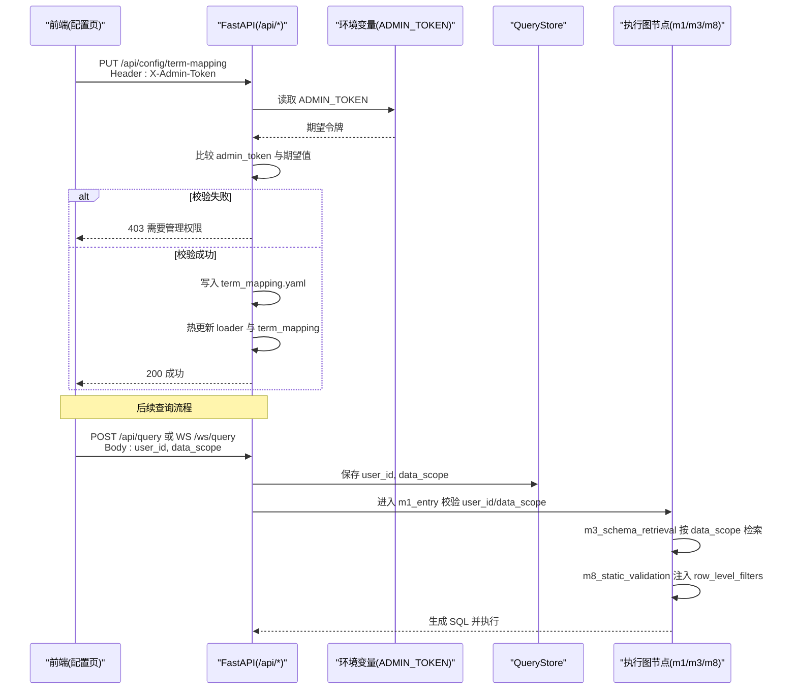
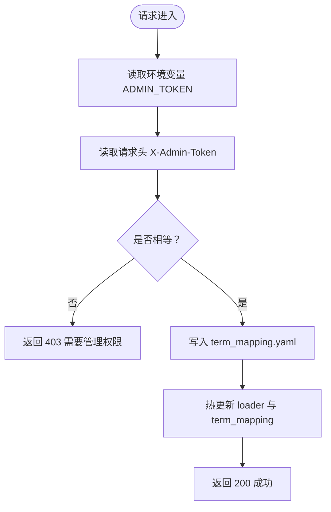
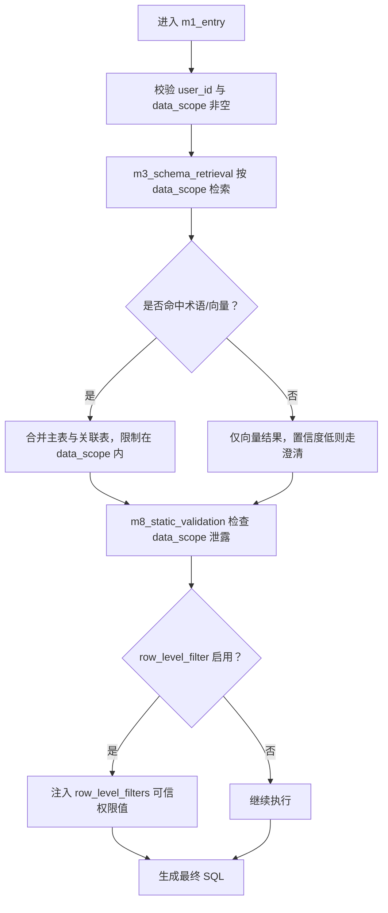
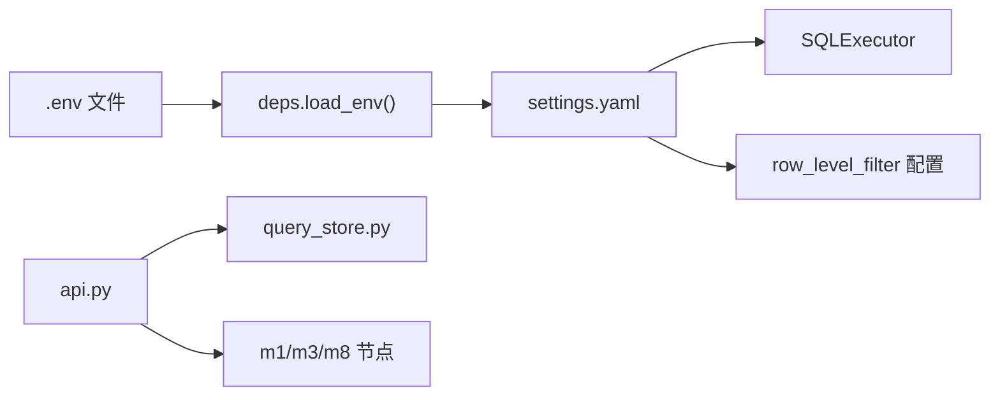

# 认证授权

<cite>
**本文引用的文件**
- [nl2sql_agent/api.py](file://nl2sql_agent/api.py)
- [nl2sql_agent/services/deps.py](file://nl2sql_agent/services/deps.py)
- [nl2sql_agent/nodes/m1_entry.py](file://nl2sql_agent/nodes/m1_entry.py)
- [nl2sql_agent/nodes/m3_schema_retrieval.py](file://nl2sql_agent/nodes/m3_schema_retrieval.py)
- [nl2sql_agent/nodes/m8_static_validation.py](file://nl2sql_agent/nodes/m8_static_validation.py)
- [nl2sql_agent/services/query_store.py](file://nl2sql_agent/services/query_store.py)
- [web/src/pages/ConfigPage.tsx](file://web/src/pages/ConfigPage.tsx)
- [web/src/api.ts](file://web/src/api.ts)
</cite>

## 目录
1. [简介](#简介)
2. [项目结构](#项目结构)
3. [核心组件](#核心组件)
4. [架构总览](#架构总览)
5. [详细组件分析](#详细组件分析)
6. [依赖关系分析](#依赖关系分析)
7. [性能与安全考量](#性能与安全考量)
8. [故障排除指南](#故障排除指南)
9. [结论](#结论)

## 简介
本文件面向 NL2SQL 的认证与授权机制，重点说明：
- 管理员权限验证机制：通过环境变量 ADMIN_TOKEN 与请求头 X-Admin-Token 实现。
- 需要管理权限的接口：如 PUT /api/config/term-mapping。
- 用户身份与数据范围控制：user_id 的作用、data_scope 的实现原理与使用方式。
- 安全最佳实践：令牌管理、最小权限原则、配置建议。
- 常见错误处理与排障。

## 项目结构
认证授权相关代码主要分布在后端 API 层、服务依赖装配、节点权限校验以及前端配置页面中。整体流程如下：
- 前端在调用受保护接口时，需携带 X-Admin-Token 请求头。
- 后端通过读取环境变量 ADMIN_TOKEN 进行比对，决定是否放行。
- 查询执行链路中，user_id 与 data_scope 由调用方注入，贯穿状态机并在检索与静态校验阶段强制生效。

图表来源
- [nl2sql_agent/api.py:396-433](file://nl2sql_agent/api.py#L396-L433)
- [nl2sql_agent/services/deps.py:32-38](file://nl2sql_agent/services/deps.py#L32-L38)
- [nl2sql_agent/nodes/m1_entry.py:14-27](file://nl2sql_agent/nodes/m1_entry.py#L14-L27)
- [nl2sql_agent/nodes/m3_schema_retrieval.py:230-240](file://nl2sql_agent/nodes/m3_schema_retrieval.py#L230-L240)
- [nl2sql_agent/nodes/m8_static_validation.py:119-143](file://nl2sql_agent/nodes/m8_static_validation.py#L119-L143)
- [nl2sql_agent/services/query_store.py:99-124](file://nl2sql_agent/services/query_store.py#L99-L124)
- [web/src/pages/ConfigPage.tsx:38-55](file://web/src/pages/ConfigPage.tsx#L38-L55)
- [web/src/api.ts:1-13](file://web/src/api.ts#L1-L13)

章节来源
- [nl2sql_agent/api.py:396-433](file://nl2sql_agent/api.py#L396-L433)
- [nl2sql_agent/services/deps.py:32-38](file://nl2sql_agent/services/deps.py#L32-L38)
- [web/src/pages/ConfigPage.tsx:38-55](file://web/src/pages/ConfigPage.tsx#L38-L55)

## 核心组件
- 管理员令牌校验函数：从环境变量读取期望值并与请求头对比。
- 受保护接口：PUT /api/config/term-mapping，要求 X-Admin-Token。
- 用户身份与数据范围：user_id 与 data_scope 在入口节点强制校验，贯穿检索与静态校验。
- 行级过滤：通过 row_level_filter 配置注入可信权限值，防止 data_scope 被误用为字段值。
- 持久化记录：QueryStore 保存 user_id、data_scope 等审计信息。

章节来源
- [nl2sql_agent/api.py:396-433](file://nl2sql_agent/api.py#L396-L433)
- [nl2sql_agent/nodes/m1_entry.py:14-27](file://nl2sql_agent/nodes/m1_entry.py#L14-L27)
- [nl2sql_agent/nodes/m3_schema_retrieval.py:230-240](file://nl2sql_agent/nodes/m3_schema_retrieval.py#L230-L240)
- [nl2sql_agent/nodes/m8_static_validation.py:119-143](file://nl2sql_agent/nodes/m8_static_validation.py#L119-L143)
- [nl2sql_agent/services/query_store.py:99-124](file://nl2sql_agent/services/query_store.py#L99-L124)

## 架构总览
下图展示了管理员权限校验与查询执行的数据流，包括请求头传递、环境变量校验、状态注入与权限拦截点。

图表来源
- [nl2sql_agent/api.py:396-433](file://nl2sql_agent/api.py#L396-L433)
- [nl2sql_agent/services/deps.py:32-38](file://nl2sql_agent/services/deps.py#L32-L38)
- [nl2sql_agent/nodes/m1_entry.py:14-27](file://nl2sql_agent/nodes/m1_entry.py#L14-L27)
- [nl2sql_agent/nodes/m3_schema_retrieval.py:230-240](file://nl2sql_agent/nodes/m3_schema_retrieval.py#L230-L240)
- [nl2sql_agent/nodes/m8_static_validation.py:119-143](file://nl2sql_agent/nodes/m8_static_validation.py#L119-L143)
- [nl2sql_agent/services/query_store.py:99-124](file://nl2sql_agent/services/query_store.py#L99-L124)

## 详细组件分析

### 管理员权限验证（X-Admin-Token 与 ADMIN_TOKEN）
- 校验逻辑：
  - 从环境变量读取期望的管理员令牌。
  - 从请求头获取 X-Admin-Token。
  - 若缺失或不匹配，返回 403 错误。
- 受保护接口：
  - PUT /api/config/term-mapping：用于更新术语映射配置，支持业务线维度。
- 前端交互：
  - 配置页提供密码输入框，保存时将 X-Admin-Token 放入请求头。
  - 成功后触发热更新，无需重启服务。

图表来源
- [nl2sql_agent/api.py:396-433](file://nl2sql_agent/api.py#L396-L433)
- [web/src/pages/ConfigPage.tsx:38-55](file://web/src/pages/ConfigPage.tsx#L38-L55)

章节来源
- [nl2sql_agent/api.py:396-433](file://nl2sql_agent/api.py#L396-L433)
- [web/src/pages/ConfigPage.tsx:38-55](file://web/src/pages/ConfigPage.tsx#L38-L55)

### 用户身份管理（user_id）
- 作用与用途：
  - 作为审计与历史查询的关键标识，便于按用户维度统计与追踪。
  - 在入口节点强制校验，确保每个查询都具备可追溯的用户身份。
- 使用位置：
  - REST 与 WebSocket 提交均接收 user_id，并持久化到 QueryStore。
  - 历史接口支持按 user_id 筛选。

章节来源
- [nl2sql_agent/api.py:224-263](file://nl2sql_agent/api.py#L224-L263)
- [nl2sql_agent/nodes/m1_entry.py:14-27](file://nl2sql_agent/nodes/m1_entry.py#L14-L27)
- [nl2sql_agent/services/query_store.py:99-124](file://nl2sql_agent/services/query_store.py#L99-L124)

### 数据范围控制（data_scope）
- 设计原则：
  - data_scope 表示用户可访问的业务线列表，属于系统命名空间，严禁直接作为表字段值出现在 SQL 中。
  - 检索阶段必须按 data_scope 过滤，无权限的表绝不进入候选结果。
- 实现要点：
  - 入口节点强制校验 data_scope 非空。
  - 检索节点按 data_scope 分别检索并按文档 id 去重保留最高分。
  - 静态校验节点检测 data_scope 泄露风险，命中即阻断并要求重新生成。
  - 行级过滤通过 row_level_filter 注入可信权限值，避免复用 data_scope。

图表来源
- [nl2sql_agent/nodes/m1_entry.py:14-27](file://nl2sql_agent/nodes/m1_entry.py#L14-L27)
- [nl2sql_agent/nodes/m3_schema_retrieval.py:230-240](file://nl2sql_agent/nodes/m3_schema_retrieval.py#L230-L240)
- [nl2sql_agent/nodes/m8_static_validation.py:119-143](file://nl2sql_agent/nodes/m8_static_validation.py#L119-L143)

章节来源
- [nl2sql_agent/nodes/m1_entry.py:14-27](file://nl2sql_agent/nodes/m1_entry.py#L14-L27)
- [nl2sql_agent/nodes/m3_schema_retrieval.py:230-240](file://nl2sql_agent/nodes/m3_schema_retrieval.py#L230-L240)
- [nl2sql_agent/nodes/m8_static_validation.py:119-143](file://nl2sql_agent/nodes/m8_static_validation.py#L119-L143)

### 配置管理接口（PUT /api/config/term-mapping）
- 功能：更新指定业务线的术语映射 YAML 文件，并触发热更新。
- 权限：需要有效的 X-Admin-Token。
- 响应：成功返回业务线与状态；失败返回 403 或 404。

章节来源
- [nl2sql_agent/api.py:413-433](file://nl2sql_agent/api.py#L413-L433)
- [web/src/pages/ConfigPage.tsx:38-55](file://web/src/pages/ConfigPage.tsx#L38-L55)

## 依赖关系分析
- 环境变量加载：
  - 依赖装配模块在启动时加载 .env 文件，设置 PROJECT_ROOT 等基础变量。
- 配置读取：
  - settings.yaml 决定数据库方言、执行限制、行级过滤列名等。
- 存储与审计：
  - QueryStore 负责持久化 user_id、data_scope、审批与反馈等信息。

图表来源
- [nl2sql_agent/services/deps.py:32-38](file://nl2sql_agent/services/deps.py#L32-L38)
- [nl2sql_agent/services/query_store.py:99-124](file://nl2sql_agent/services/query_store.py#L99-L124)

章节来源
- [nl2sql_agent/services/deps.py:32-38](file://nl2sql_agent/services/deps.py#L32-L38)
- [nl2sql_agent/services/query_store.py:99-124](file://nl2sql_agent/services/query_store.py#L99-L124)

## 性能与安全考量
- 性能：
  - 术语映射热更新避免重启服务，提升运维效率。
  - 检索阶段按 data_scope 过滤减少无效候选，提高准确率与性能。
- 安全：
  - 管理员令牌通过环境变量集中管理，避免硬编码。
  - 行级过滤注入可信权限值，防止 data_scope 被滥用。
  - 严格校验 user_id 与 data_scope，确保审计与权限可控。

[本节为通用指导，不直接分析具体文件]

## 故障排除指南
- 403 需要管理权限：
  - 检查请求头 X-Admin-Token 是否正确传递。
  - 确认环境变量 ADMIN_TOKEN 已正确设置且与请求头一致。
- 404 术语映射不存在：
  - 确认业务线名称与文件名一致（如 _global.yaml）。
- data_scope 泄露导致阻断：
  - 检查生成的 SQL 是否将 data_scope 值直接用作 WHERE 条件。
  - 确保 row_level_filter 已启用并提供可信权限值。
- user_id 缺失：
  - 检查请求体是否包含 user_id 字段。

章节来源
- [nl2sql_agent/api.py:396-433](file://nl2sql_agent/api.py#L396-L433)
- [nl2sql_agent/nodes/m8_static_validation.py:119-143](file://nl2sql_agent/nodes/m8_static_validation.py#L119-L143)
- [nl2sql_agent/nodes/m1_entry.py:14-27](file://nl2sql_agent/nodes/m1_entry.py#L14-L27)

## 结论
NL2SQL 的认证授权体系以环境变量与请求头为核心，结合严格的节点校验与行级过滤，实现了管理员权限控制与用户数据范围隔离。通过热更新与审计持久化，系统在安全性与可运维性之间取得平衡。建议在生产环境中遵循最小权限原则，定期轮换令牌，并确保配置与网络传输的安全。

[本节为总结，不直接分析具体文件]