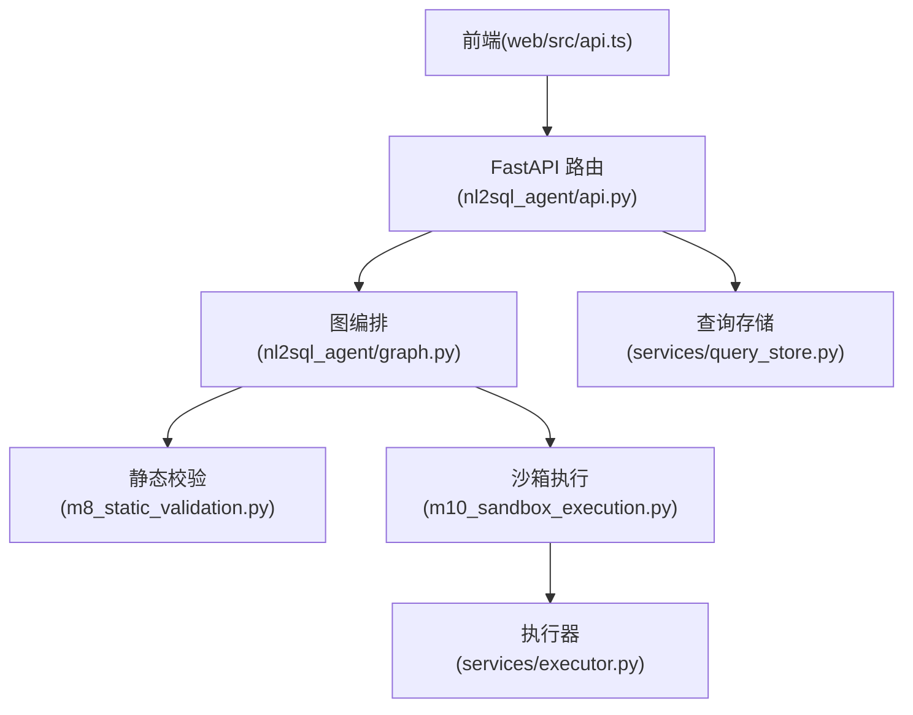
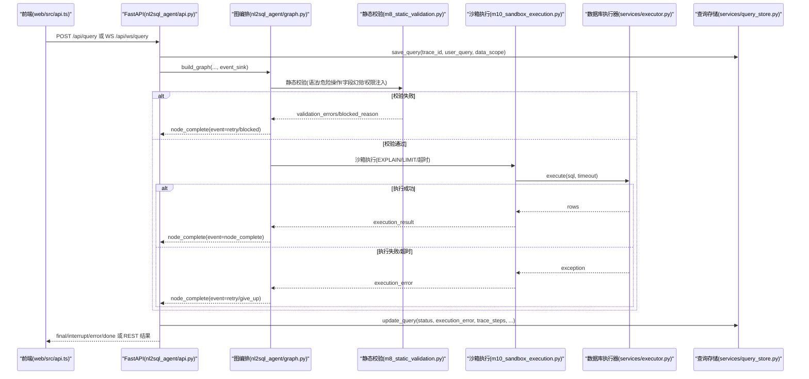
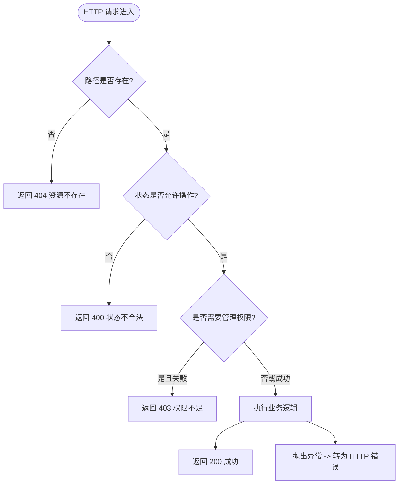
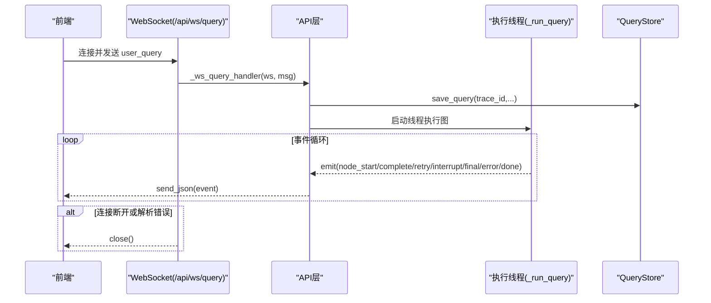
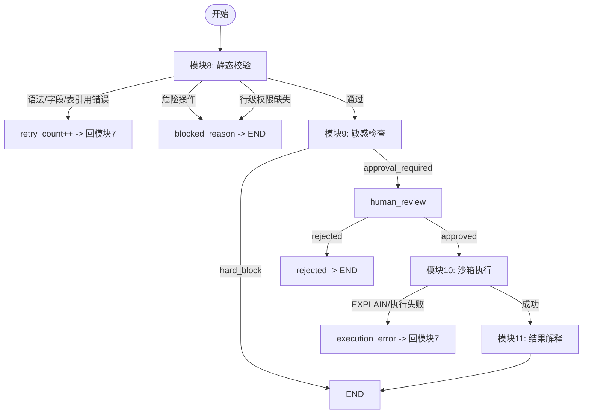
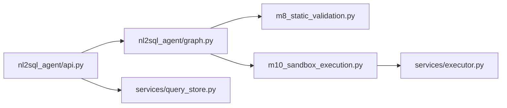

# 错误处理

<cite>
**本文引用的文件**
- [nl2sql_agent/api.py](file://nl2sql_agent/api.py)
- [nl2sql_agent/main.py](file://nl2sql_agent/main.py)
- [nl2sql_agent/graph.py](file://nl2sql_agent/graph.py)
- [nl2sql_agent/state.py](file://nl2sql_agent/state.py)
- [nl2sql_agent/nodes/m8_static_validation.py](file://nl2sql_agent/nodes/m8_static_validation.py)
- [nl2sql_agent/nodes/m10_sandbox_execution.py](file://nl2sql_agent/nodes/m10_sandbox_execution.py)
- [nl2sql_agent/services/executor.py](file://nl2sql_agent/services/executor.py)
- [nl2sql_agent/services/query_store.py](file://nl2sql_agent/services/query_store.py)
- [web/src/api.ts](file://web/src/api.ts)
</cite>

## 目录
1. [简介](#简介)
2. [项目结构](#项目结构)
3. [核心组件](#核心组件)
4. [架构总览](#架构总览)
5. [详细组件分析](#详细组件分析)
6. [依赖关系分析](#依赖关系分析)
7. [性能考虑](#性能考虑)
8. [故障排除指南](#故障排除指南)
9. [结论](#结论)
10. [附录](#附录)

## 简介
本文件系统化梳理 NL2SQL 的错误处理机制，覆盖 HTTP API、WebSocket、查询执行链路中的异常分类与处理策略，并给出错误响应格式、日志记录与调试方法，以及常见错误的解决方案。目标是帮助开发者快速定位问题、完善前端容错体验，并确保系统在生产环境具备可观测性与稳定性。

## 项目结构
- FastAPI 服务入口与路由挂载在 nl2sql_agent/main.py，统一包含 /api 前缀的 REST 与 WebSocket 路由。
- 业务 API（REST + WebSocket）集中在 nl2sql_agent/api.py，负责请求校验、状态持久化、事件桥接与流程编排调用。
- 图编排与重试路由在 nl2sql_agent/graph.py，定义节点间流转与错误分支（如 blocked/retry/give_up）。
- 状态模型在 nl2sql_agent/state.py，定义了 execution_error、blocked_reason、validation_errors 等关键字段。
- 静态校验与沙箱执行分别在 m8_static_validation.py 与 m10_sandbox_execution.py，集中处理 SQL 生成错误与数据库连接/超时等异常。
- 执行器抽象在 services/executor.py，提供 PostgresExecutor、MySQLExecutor、InMemoryExecutor 的统一接口与错误语义。
- 查询历史与审计通过 services/query_store.py 落库，保存 status、execution_error、trace_steps 等用于排障。
- 前端错误处理在 web/src/api.ts，对 HTTP 非 2xx 进行解析与抛错，WS 层忽略非法帧并关闭连接。

**图表来源**
- [nl2sql_agent/api.py:159-221](file://nl2sql_agent/api.py#L159-L221)
- [nl2sql_agent/graph.py:174-312](file://nl2sql_agent/graph.py#L174-L312)
- [nl2sql_agent/nodes/m8_static_validation.py:33-152](file://nl2sql_agent/nodes/m8_static_validation.py#L33-L152)
- [nl2sql_agent/nodes/m10_sandbox_execution.py:31-64](file://nl2sql_agent/nodes/m10_sandbox_execution.py#L31-L64)
- [nl2sql_agent/services/executor.py:53-158](file://nl2sql_agent/services/executor.py#L53-L158)
- [nl2sql_agent/services/query_store.py:31-96](file://nl2sql_agent/services/query_store.py#L31-L96)
- [web/src/api.ts:1-49](file://web/src/api.ts#L1-L49)

**章节来源**
- [nl2sql_agent/main.py:46-57](file://nl2sql_agent/main.py#L46-L57)
- [nl2sql_agent/api.py:1-10](file://nl2sql_agent/api.py#L1-L10)

## 核心组件
- HTTP 错误码使用
  - 404：资源不存在（如 trace_id 不存在、术语映射文件不存在、审核条目不存在）。
  - 400：请求参数或状态不合法（如当前状态不可审批/恢复、缺少必要字段）。
  - 403：权限不足（管理操作需 X-Admin-Token 匹配 ADMIN_TOKEN）。
- WebSocket 错误处理
  - 连接断开：捕获 WebSocketDisconnect，直接关闭连接。
  - 消息解析错误：ValueError 时关闭连接；前端忽略非法帧。
  - 超时处理：每 60s 发送 ping，避免空闲断连；后端线程内执行失败推送 error 事件。
- 查询执行错误分类
  - SQL 生成错误：语法错误、危险操作拦截、字段幻觉、表引用不一致、行级权限缺失等。
  - 数据库连接/超时错误：EXPLAIN 失败、执行报错、超时（statement_timeout/MAX_EXECUTION_TIME）。
  - 权限验证错误：敏感判定 hard_block、未通过人工审批被拒绝。
- 错误响应与状态字段
  - execution_error：执行阶段错误文本。
  - validation_errors：静态校验错误列表。
  - blocked_reason：危险操作或配置不完整导致的硬阻断。
  - final_answer：最终提示（含“请人工介入”等降级文案）。
  - status：running/done/pending_review/error/blocked/rejected 等。
- 日志与追踪
  - trace_steps/node_latencies：节点顺序与耗时。
  - retry_count/plan_retry_count：重试次数。
  - 持久化：queries 表保存 status、execution_error、trace_steps、node_latencies 等。

**章节来源**
- [nl2sql_agent/api.py:266-271](file://nl2sql_agent/api.py#L266-L271)
- [nl2sql_agent/api.py:280-314](file://nl2sql_agent/api.py#L280-L314)
- [nl2sql_agent/api.py:322-353](file://nl2sql_agent/api.py#L322-L353)
- [nl2sql_agent/api.py:401-433](file://nl2sql_agent/api.py#L401-L433)
- [nl2sql_agent/api.py:489-518](file://nl2sql_agent/api.py#L489-L518)
- [nl2sql_agent/state.py:114-146](file://nl2sql_agent/state.py#L114-L146)
- [nl2sql_agent/services/query_store.py:31-96](file://nl2sql_agent/services/query_store.py#L31-L96)

## 架构总览
下图展示从前端到后端、再到数据库执行的完整错误处理路径，包括 WS 流式事件、REST 状态查询、图编排重试与持久化。

**图表来源**
- [nl2sql_agent/api.py:159-221](file://nl2sql_agent/api.py#L159-L221)
- [nl2sql_agent/graph.py:174-312](file://nl2sql_agent/graph.py#L174-L312)
- [nl2sql_agent/nodes/m8_static_validation.py:33-152](file://nl2sql_agent/nodes/m8_static_validation.py#L33-L152)
- [nl2sql_agent/nodes/m10_sandbox_execution.py:31-64](file://nl2sql_agent/nodes/m10_sandbox_execution.py#L31-L64)
- [nl2sql_agent/services/executor.py:53-158](file://nl2sql_agent/services/executor.py#L53-L158)
- [nl2sql_agent/services/query_store.py:97-144](file://nl2sql_agent/services/query_store.py#L97-L144)

## 详细组件分析

### HTTP API 错误码与响应
- 404 资源不存在
  - 场景：查询状态/审计/术语映射/审核条目不存在。
  - 触发点：get_query_status、audit、term-mapping、review approve/reject。
- 400 请求参数或状态不合法
  - 场景：当前状态不可审批/恢复（需 pending_review）、缺少必填字段。
  - 触发点：approve、resume。
- 403 权限不足
  - 场景：修改术语映射需要 X-Admin-Token 与 ADMIN_TOKEN 一致。
  - 触发点：PUT term-mapping。
- 错误响应格式
  - FastAPI 默认返回 {detail: "..."}，前端 api.ts 会将其转换为 Error(detail)。
  - 自定义业务错误通过 HTTPException 抛出，携带人类可读信息。

**图表来源**
- [nl2sql_agent/api.py:266-271](file://nl2sql_agent/api.py#L266-L271)
- [nl2sql_agent/api.py:280-314](file://nl2sql_agent/api.py#L280-L314)
- [nl2sql_agent/api.py:322-353](file://nl2sql_agent/api.py#L322-L353)
- [nl2sql_agent/api.py:401-433](file://nl2sql_agent/api.py#L401-L433)
- [nl2sql_agent/api.py:489-518](file://nl2sql_agent/api.py#L489-L518)
- [web/src/api.ts:1-13](file://web/src/api.ts#L1-L13)

**章节来源**
- [nl2sql_agent/api.py:266-271](file://nl2sql_agent/api.py#L266-L271)
- [nl2sql_agent/api.py:280-314](file://nl2sql_agent/api.py#L280-L314)
- [nl2sql_agent/api.py:322-353](file://nl2sql_agent/api.py#L322-L353)
- [nl2sql_agent/api.py:401-433](file://nl2sql_agent/api.py#L401-L433)
- [nl2sql_agent/api.py:489-518](file://nl2sql_agent/api.py#L489-L518)
- [web/src/api.ts:1-13](file://web/src/api.ts#L1-L13)

### WebSocket 错误处理
- 连接生命周期
  - 建立连接后发送 trace_id，支持断线重连恢复（pending_review/done/blocked/rejected）。
  - 每 60s 发送 ping，防止空闲断连。
- 异常处理
  - WebSocketDisconnect/ValueError：捕获后关闭连接。
  - 执行线程异常：推送 error 事件，更新 status=error，最后发送 done。
- 前端处理
  - onmessage 解析 JSON，非法帧忽略；onclose/onerror 关闭连接。

**图表来源**
- [nl2sql_agent/api.py:159-221](file://nl2sql_agent/api.py#L159-L221)
- [nl2sql_agent/api.py:134-157](file://nl2sql_agent/api.py#L134-L157)
- [web/src/api.ts:31-49](file://web/src/api.ts#L31-L49)

**章节来源**
- [nl2sql_agent/api.py:159-221](file://nl2sql_agent/api.py#L159-L221)
- [nl2sql_agent/api.py:134-157](file://nl2sql_agent/api.py#L134-L157)
- [web/src/api.ts:31-49](file://web/src/api.ts#L31-L49)

### 查询执行错误分类与处理策略
- SQL 生成错误（模块 8 静态校验）
  - 语法错误：解析失败，返回 validation_errors，进入 retry。
  - 危险操作：DROP/DELETE/UPDATE/TRUNCATE 等，设置 blocked_reason，直接结束。
  - 字段幻觉/表引用不一致：返回 validation_errors，进入 retry。
  - 行级权限缺失：blocked_reason 阻断，提示配置不完整。
- 数据库连接/超时错误（模块 10 沙箱执行）
  - EXPLAIN 失败：execution_error，进入 retry。
  - 执行报错/超时：execution_error，进入 retry；打满 max_retries 后 give_up。
  - 空结果：视为合法业务结果，继续解释。
- 权限验证错误（模块 9 敏感检查）
  - risk_decision=hard_block：直接结束。
  - approval_required：进入 human_review，拒绝则 rejected。

**图表来源**
- [nl2sql_agent/nodes/m8_static_validation.py:33-152](file://nl2sql_agent/nodes/m8_static_validation.py#L33-L152)
- [nl2sql_agent/nodes/m10_sandbox_execution.py:31-64](file://nl2sql_agent/nodes/m10_sandbox_execution.py#L31-L64)
- [nl2sql_agent/graph.py:146-170](file://nl2sql_agent/graph.py#L146-L170)

**章节来源**
- [nl2sql_agent/nodes/m8_static_validation.py:33-152](file://nl2sql_agent/nodes/m8_static_validation.py#L33-L152)
- [nl2sql_agent/nodes/m10_sandbox_execution.py:31-64](file://nl2sql_agent/nodes/m10_sandbox_execution.py#L31-L64)
- [nl2sql_agent/graph.py:146-170](file://nl2sql_agent/graph.py#L146-L170)

### 错误响应格式与数据结构
- 通用字段
  - trace_id：唯一追踪标识。
  - status：running/done/pending_review/error/blocked/rejected。
  - execution_error：执行阶段错误文本。
  - validation_errors：静态校验错误列表。
  - blocked_reason：危险操作或配置不完整导致的硬阻断。
  - final_answer：最终提示（含“请人工介入”等降级文案）。
  - trace_steps/node_latencies：节点顺序与耗时。
  - retry_count/plan_retry_count：重试次数。
- 持久化字段（queries 表）
  - generated_sql、plan_json、retrieved_schema、sensitive_reasons、execution_result、trace_steps、node_latencies、risk_decision、created_at、finished_at 等。

**章节来源**
- [nl2sql_agent/state.py:114-146](file://nl2sql_agent/state.py#L114-L146)
- [nl2sql_agent/services/query_store.py:31-96](file://nl2sql_agent/services/query_store.py#L31-L96)

### 错误日志记录机制与调试方法
- 日志记录
  - 节点事件：node_start/node_complete/retry/interrupt/final/error/done 通过 event_sink 推送。
  - 状态持久化：update_query 写入 status、execution_error、trace_steps、node_latencies 等。
- 调试方法
  - 查看历史：GET /api/history，过滤 user_id/business_line/date。
  - 查看审计：GET /api/audit/{trace_id}，附带 feedbacks。
  - 查看审批队列：GET /api/approvals。
  - 前端控制台：观察 WS 事件序列与错误帧；HTTP 错误 detail 字段。
  - 服务端输出：approve/resume 线程中 print 与 traceback.print_exc。

**章节来源**
- [nl2sql_agent/graph.py:72-103](file://nl2sql_agent/graph.py#L72-L103)
- [nl2sql_agent/api.py:356-378](file://nl2sql_agent/api.py#L356-L378)
- [nl2sql_agent/api.py:280-314](file://nl2sql_agent/api.py#L280-L314)
- [nl2sql_agent/services/query_store.py:146-193](file://nl2sql_agent/services/query_store.py#L146-L193)

## 依赖关系分析
- API 层依赖图编排（build_graph），并通过 event_sink 接收节点事件。
- 图编排依赖各节点（m1~m11），其中 m8/m10 是关键错误处理节点。
- 执行器抽象为 SQLExecutor，Postgres/MySQL/InMemory 实现统一接口。
- QueryStore 提供持久化能力，供 API 层读写查询历史与反馈。

**图表来源**
- [nl2sql_agent/api.py:1-10](file://nl2sql_agent/api.py#L1-L10)
- [nl2sql_agent/graph.py:174-312](file://nl2sql_agent/graph.py#L174-L312)
- [nl2sql_agent/nodes/m8_static_validation.py:33-152](file://nl2sql_agent/nodes/m8_static_validation.py#L33-L152)
- [nl2sql_agent/nodes/m10_sandbox_execution.py:31-64](file://nl2sql_agent/nodes/m10_sandbox_execution.py#L31-L64)
- [nl2sql_agent/services/executor.py:53-158](file://nl2sql_agent/services/executor.py#L53-L158)
- [nl2sql_agent/services/query_store.py:31-96](file://nl2sql_agent/services/query_store.py#L31-L96)

**章节来源**
- [nl2sql_agent/api.py:1-10](file://nl2sql_agent/api.py#L1-L10)
- [nl2sql_agent/graph.py:174-312](file://nl2sql_agent/graph.py#L174-L312)

## 性能考虑
- 事件推送失败不影响流程执行（_emit 捕获异常），确保高可用。
- 执行超时控制：Postgres statement_timeout、MySQL MAX_EXECUTION_TIME，避免长尾查询。
- EXPLAIN 预估行数阈值拦截，减少大扫描风险。
- 前端限制 execution_result 展示行数（最多 20 行），避免刷屏。

[本节为通用指导，无需特定文件来源]

## 故障排除指南
- 常见问题与解决
  - 404 资源不存在：检查 trace_id 是否正确；确认术语映射/审核条目存在。
  - 400 状态不合法：确保处于 pending_review 才能审批/恢复；检查必填字段。
  - 403 权限不足：设置正确的 X-Admin-Token 环境变量。
  - WS 连接频繁断开：检查网络与代理；确认前端 onclose/onerror 处理。
  - SQL 生成失败：查看 validation_errors，修正字段幻觉/表引用不一致；检查 dialect 配置。
  - 执行超时/失败：检查数据库连接与权限；调整 execution_timeout_seconds/explain_row_threshold。
  - 行级权限缺失：确保 row_level_filter.enabled=true 且提供可信值。
- 排查步骤
  - 通过 GET /api/audit/{trace_id} 获取完整 trace_steps 与 execution_error。
  - 查看 WS 事件序列，定位失败节点与重试原因。
  - 检查 QueryStore 中 queries 表的 status/execution_error/trace_steps。
  - 前端控制台打印错误 detail 与 WS 事件。

**章节来源**
- [nl2sql_agent/api.py:266-271](file://nl2sql_agent/api.py#L266-L271)
- [nl2sql_agent/api.py:280-314](file://nl2sql_agent/api.py#L280-L314)
- [nl2sql_agent/api.py:322-353](file://nl2sql_agent/api.py#L322-L353)
- [nl2sql_agent/api.py:401-433](file://nl2sql_agent/api.py#L401-L433)
- [nl2sql_agent/api.py:489-518](file://nl2sql_agent/api.py#L489-L518)
- [nl2sql_agent/services/query_store.py:146-193](file://nl2sql_agent/services/query_store.py#L146-L193)
- [web/src/api.ts:1-13](file://web/src/api.ts#L1-L13)

## 结论
本项目的错误处理机制围绕“就近消化、最小影响”的原则设计：HTTP 层明确状态码与错误体，WS 层保证事件流稳定与断线恢复，图编排层通过路由与重试将错误控制在最近节点，执行层通过只读事务与超时保护数据库安全。配合完善的持久化与前端容错，开发者可快速定位问题并优化用户体验。

[本节为总结性内容，无需特定文件来源]

## 附录
- 关键状态字段说明
  - status：running/done/pending_review/error/blocked/rejected
  - execution_error：执行阶段错误文本
  - validation_errors：静态校验错误列表
  - blocked_reason：危险操作或配置不完整导致的硬阻断
  - final_answer：最终提示（含“请人工介入”等降级文案）
  - trace_steps/node_latencies：节点顺序与耗时
  - retry_count/plan_retry_count：重试次数

**章节来源**
- [nl2sql_agent/state.py:114-146](file://nl2sql_agent/state.py#L114-L146)
- [nl2sql_agent/services/query_store.py:31-96](file://nl2sql_agent/services/query_store.py#L31-L96)