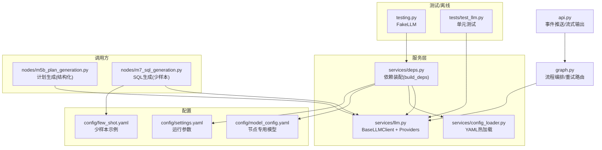
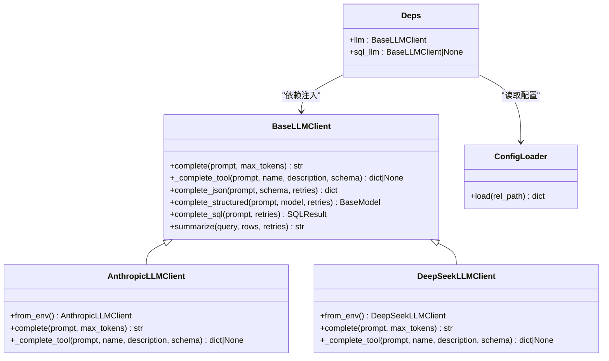
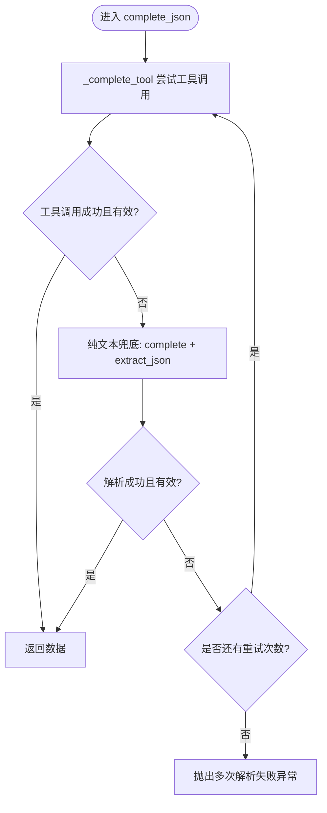
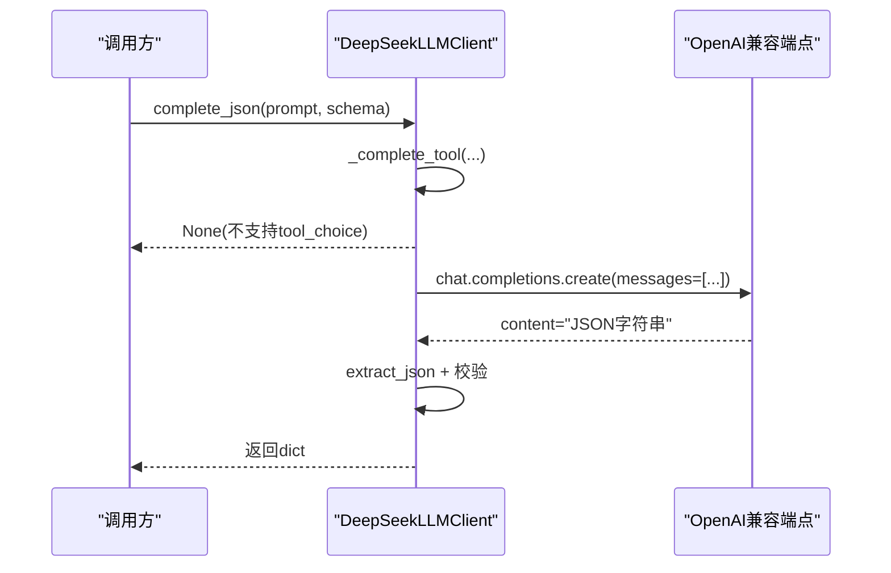
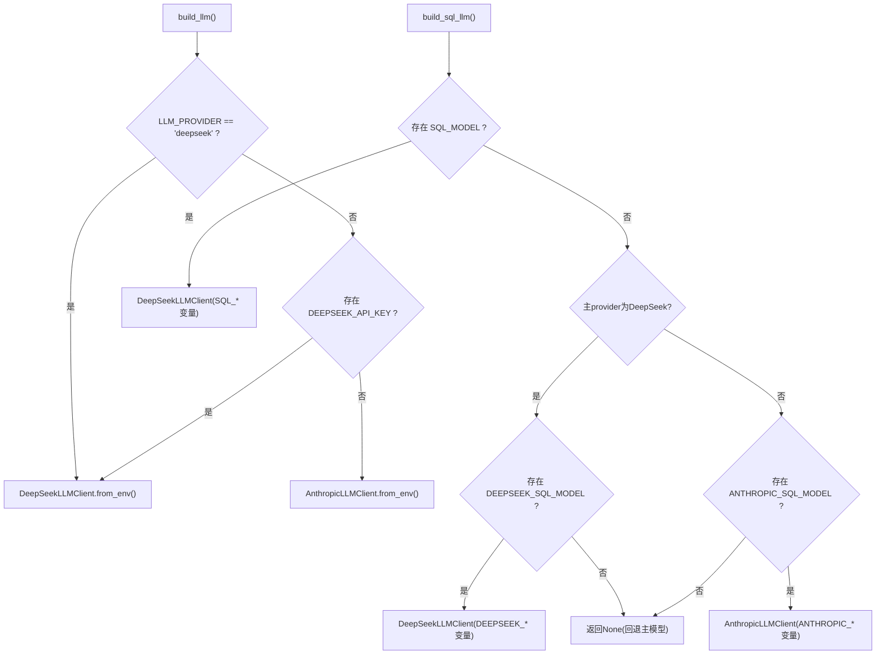
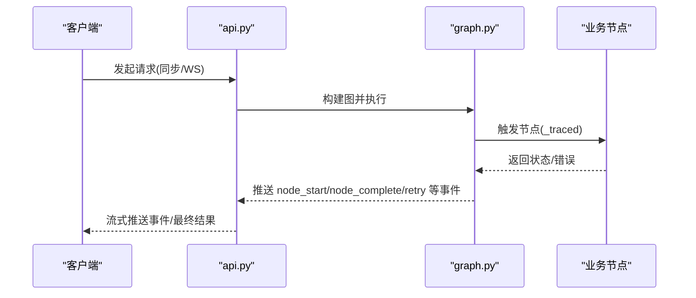
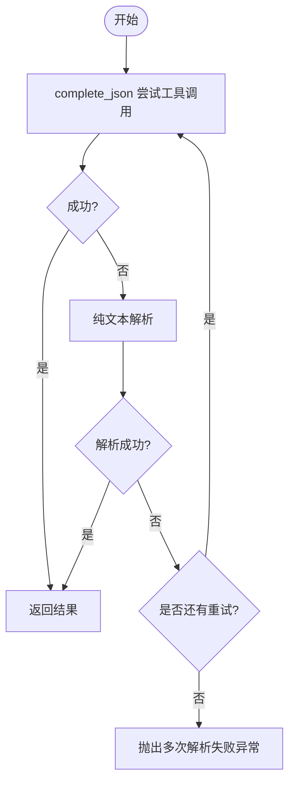
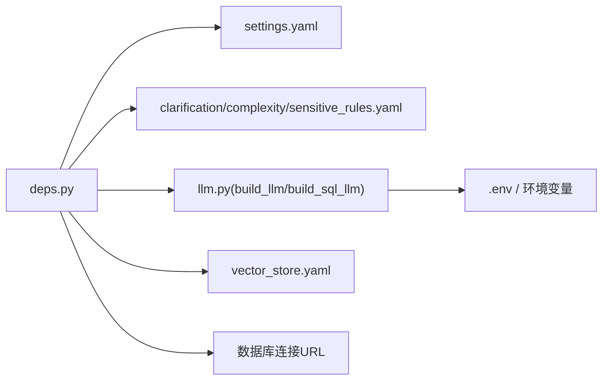

# LLM集成

<cite>
**本文引用的文件**   
- [nl2sql_agent/services/llm.py](file://nl2sql_agent/services/llm.py)
- [nl2sql_agent/config/model_config.yaml](file://nl2sql_agent/config/model_config.yaml)
- [nl2sql_agent/config/settings.yaml](file://nl2sql_agent/config/settings.yaml)
- [nl2sql_agent/services/deps.py](file://nl2sql_agent/services/deps.py)
- [nl2sql_agent/services/config_loader.py](file://nl2sql_agent/services/config_loader.py)
- [nl2sql_agent/testing.py](file://nl2sql_agent/testing.py)
- [nl2sql_agent/tests/test_llm.py](file://nl2sql_agent/tests/test_llm.py)
- [nl2sql_agent/nodes/m5b_plan_generation.py](file://nl2sql_agent/nodes/m5b_plan_generation.py)
- [nl2sql_agent/nodes/m7_sql_generation.py](file://nl2sql_agent/nodes/m7_sql_generation.py)
- [nl2sql_agent/services/few_shot_store.py](file://nl2sql_agent/services/few_shot_store.py)
- [nl2sql_agent/config/few_shot.yaml](file://nl2sql_agent/config/few_shot.yaml)
- [nl2sql_agent/graph.py](file://nl2sql_agent/graph.py)
- [nl2sql_agent/api.py](file://nl2sql_agent/api.py)
</cite>

## 目录
1. [简介](#简介)
2. [项目结构](#项目结构)
3. [核心组件](#核心组件)
4. [架构总览](#架构总览)
5. [详细组件分析](#详细组件分析)
6. [依赖关系分析](#依赖关系分析)
7. [性能与成本优化](#性能与成本优化)
8. [故障排查指南](#故障排查指南)
9. [结论](#结论)
10. [附录](#附录)

## 简介
本文件面向 LLM 集成模块，系统性阐述 BaseLLMClient 抽象设计与多 Provider 支持机制（Anthropic Claude、DeepSeek），统一接口规范、模型配置管理（环境变量、动态切换、故障转移）、提示工程最佳实践、结构化输出与流式响应处理、错误重试机制、成本优化策略、模型选择决策树、适用场景分析与自定义 Provider 开发指南。文档同时覆盖监控指标收集、使用统计分析与成本控制方法，兼顾基础集成概念与高级配置优化技巧。

## 项目结构
LLM 集成位于 nl2sql_agent/services/llm.py，通过 deps.py 装配到整体依赖图；模型与运行参数由 config/*.yaml 与 .env 环境变量驱动；测试与离线脚本通过 testing.py 的 FakeLLM 替代真实 LLM。

图表来源
- [nl2sql_agent/services/llm.py:1-34](file://nl2sql_agent/services/llm.py#L1-L34)
- [nl2sql_agent/services/deps.py:107-178](file://nl2sql_agent/services/deps.py#L107-L178)
- [nl2sql_agent/services/config_loader.py:14-36](file://nl2sql_agent/services/config_loader.py#L14-L36)
- [nl2sql_agent/config/model_config.yaml:1-16](file://nl2sql_agent/config/model_config.yaml#L1-L16)
- [nl2sql_agent/config/settings.yaml:1-30](file://nl2sql_agent/config/settings.yaml#L1-L30)
- [nl2sql_agent/nodes/m5b_plan_generation.py:75](file://nl2sql_agent/nodes/m5b_plan_generation.py#L75)
- [nl2sql_agent/nodes/m7_sql_generation.py:70-85](file://nl2sql_agent/nodes/m7_sql_generation.py#L70-L85)
- [nl2sql_agent/services/few_shot_store.py:13-34](file://nl2sql_agent/services/few_shot_store.py#L13-L34)
- [nl2sql_agent/config/few_shot.yaml:1-32](file://nl2sql_agent/config/few_shot.yaml#L1-L32)
- [nl2sql_agent/api.py:1-120](file://nl2sql_agent/api.py#L1-L120)
- [nl2sql_agent/graph.py:72-116](file://nl2sql_agent/graph.py#L72-L116)

章节来源
- [nl2sql_agent/services/llm.py:1-34](file://nl2sql_agent/services/llm.py#L1-L34)
- [nl2sql_agent/services/deps.py:107-178](file://nl2sql_agent/services/deps.py#L107-L178)
- [nl2sql_agent/services/config_loader.py:14-36](file://nl2sql_agent/services/config_loader.py#L14-L36)
- [nl2sql_agent/config/model_config.yaml:1-16](file://nl2sql_agent/config/model_config.yaml#L1-L16)
- [nl2sql_agent/config/settings.yaml:1-30](file://nl2sql_agent/config/settings.yaml#L1-L30)

## 核心组件
- BaseLLMClient：统一抽象接口，提供 complete、_complete_tool、complete_json、complete_structured、complete_sql、summarize 等方法，屏蔽不同 Provider 差异。
- AnthropicLLMClient：基于 Anthropic Messages API，支持 tool_use 强制结构化输出。
- DeepSeekLLMClient：基于 OpenAI 兼容接口，默认 base_url=https://api.deepseek.com，thinking/reasoning 模式不支持 tool_choice，回退纯文本解析。
- build_llm/build_sql_llm：按环境变量与配置选择主模型或 SQL 专用模型。
- get_model_for_node：按 model_config.yaml 的 nodes.<node_key> 为特定节点选择更便宜的模型。
- extract_json：鲁棒提取 JSON（容忍 markdown 代码块与前后废话）。
- SQLResult：结构化返回 SQL 与 used_tables，便于后续校验。

章节来源
- [nl2sql_agent/services/llm.py:70-160](file://nl2sql_agent/services/llm.py#L70-L160)
- [nl2sql_agent/services/llm.py:162-243](file://nl2sql_agent/services/llm.py#L162-L243)
- [nl2sql_agent/services/llm.py:254-328](file://nl2sql_agent/services/llm.py#L254-L328)
- [nl2sql_agent/services/llm.py:37-68](file://nl2sql_agent/services/llm.py#L37-L68)

## 架构总览
下图展示 LLM 客户端抽象、Provider 实现与上层调用方的交互关系，以及配置与环境变量的装配路径。

图表来源
- [nl2sql_agent/services/llm.py:70-160](file://nl2sql_agent/services/llm.py#L70-L160)
- [nl2sql_agent/services/llm.py:162-243](file://nl2sql_agent/services/llm.py#L162-L243)
- [nl2sql_agent/services/deps.py:52-70](file://nl2sql_agent/services/deps.py#L52-L70)
- [nl2sql_agent/services/config_loader.py:14-36](file://nl2sql_agent/services/config_loader.py#L14-L36)

## 详细组件分析

### BaseLLMClient 抽象与结构化输出
- complete：纯文本补全，各 Provider 自行实现。
- _complete_tool：工具调用（function calling）强制结构化输出；若模型未走工具调用则返回 None。
- complete_json：优先尝试 _complete_tool，失败回退到 complete + extract_json；内置“回显 schema”检测与必填字段校验，支持 retries 重试。
- complete_structured：将 Pydantic model 转为 JSON Schema 后复用 complete_json，再 model_validate。
- complete_sql：固定 schema 要求返回 sql 与 used_tables，便于模块 8 交叉比对。
- summarize：对查询结果进行中文摘要。

图表来源
- [nl2sql_agent/services/llm.py:82-128](file://nl2sql_agent/services/llm.py#L82-L128)
- [nl2sql_agent/services/llm.py:37-68](file://nl2sql_agent/services/llm.py#L37-L68)

章节来源
- [nl2sql_agent/services/llm.py:70-160](file://nl2sql_agent/services/llm.py#L70-L160)

### AnthropicLLMClient 与 DeepSeekLLMClient
- AnthropicLLMClient：
  - from_env：从 ANTHROPIC_API_KEY、ANTHROPIC_MODEL 初始化。
  - complete：messages.create 取 text block 拼接。
  - _complete_tool：通过 tools/tool_choice 强制工具调用，解析 tool_use 块。
- DeepSeekLLMClient：
  - from_env：从 DEEPSEEK_API_KEY、DEEPSEEK_MODEL、DEEPSEEK_BASE_URL 初始化。
  - complete：chat.completions.create 取 message.content。
  - _complete_tool：thinking/reasoning 模式不支持 tool_choice，直接返回 None，交由 complete_json 纯文本路径处理。

图表来源
- [nl2sql_agent/services/llm.py:205-243](file://nl2sql_agent/services/llm.py#L205-L243)
- [nl2sql_agent/services/llm.py:37-68](file://nl2sql_agent/services/llm.py#L37-L68)

章节来源
- [nl2sql_agent/services/llm.py:162-243](file://nl2sql_agent/services/llm.py#L162-L243)

### 模型配置管理与动态切换
- 环境变量优先级与选择规则：
  - LLM_PROVIDER=deepseek → DeepSeek；LLM_PROVIDER=anthropic → Anthropic。
  - 未设置时，存在 DEEPSEEK_API_KEY 则用 DeepSeek，否则 Anthropic。
- 独立 SQL 模型：
  - 完全独立：SQL_MODEL + SQL_API_KEY + SQL_BASE_URL。
  - 同主 provider：DEEPSEEK_SQL_MODEL / ANTHROPIC_SQL_MODEL。
- 节点级模型：
  - model_config.yaml.nodes.<node_key>.model 指定更便宜模型，未配置回退主模型。
- 配置热加载：
  - ConfigLoader 基于 mtime 缓存与自动重载。

图表来源
- [nl2sql_agent/services/llm.py:275-328](file://nl2sql_agent/services/llm.py#L275-L328)
- [nl2sql_agent/services/llm.py:254-273](file://nl2sql_agent/services/llm.py#L254-L273)
- [nl2sql_agent/services/config_loader.py:14-36](file://nl2sql_agent/services/config_loader.py#L14-L36)

章节来源
- [nl2sql_agent/services/llm.py:254-328](file://nl2sql_agent/services/llm.py#L254-L328)
- [nl2sql_agent/config/model_config.yaml:11-16](file://nl2sql_agent/config/model_config.yaml#L11-L16)
- [nl2sql_agent/services/config_loader.py:14-36](file://nl2sql_agent/services/config_loader.py#L14-L36)

### 提示工程最佳实践
- 模板设计：
  - 明确指令“只输出一个 JSON 对象，不要输出其它文字、不要用 markdown 代码块、不要解释”，并列出必填字段。
  - 针对 SQL 生成，结合 few-shot 示例提升稳定性。
- 参数调优：
  - max_tokens 控制输出长度；retries 控制结构化解析重试次数。
  - 复杂任务可拆分 prompt，减少单次上下文压力。
- 输出格式化：
  - 使用 complete_structured 配合 Pydantic 模型确保类型与约束。
  - 使用 complete_sql 获取 used_tables 以辅助校验。

章节来源
- [nl2sql_agent/services/llm.py:82-128](file://nl2sql_agent/services/llm.py#L82-L128)
- [nl2sql_agent/nodes/m7_sql_generation.py:70-85](file://nl2sql_agent/nodes/m7_sql_generation.py#L70-L85)
- [nl2sql_agent/services/few_shot_store.py:13-34](file://nl2sql_agent/services/few_shot_store.py#L13-L34)
- [nl2sql_agent/config/few_shot.yaml:1-32](file://nl2sql_agent/config/few_shot.yaml#L1-L32)

### 流式响应处理与事件上报
- graph.py 中的 _traced/_retry_route/_emit 负责节点开始/完成事件、延迟记录与重试事件推送。
- api.py 暴露 WebSocket 流式推送 pipeline 事件（node_start/complete/retry/interrupt/final/error），并在同步执行中按结果推送 final/interrupt/error 并落库。

图表来源
- [nl2sql_agent/graph.py:72-116](file://nl2sql_agent/graph.py#L72-L116)
- [nl2sql_agent/api.py:1-120](file://nl2sql_agent/api.py#L1-L120)

章节来源
- [nl2sql_agent/graph.py:72-116](file://nl2sql_agent/graph.py#L72-L116)
- [nl2sql_agent/api.py:1-120](file://nl2sql_agent/api.py#L1-L120)

### 错误重试机制与故障转移
- 结构化输出重试：complete_json 内部对工具调用失败与纯文本解析失败进行重试，直至成功或耗尽 retries。
- 流程级重试：graph.py 的 _retry_route 包装重试路由，记录 attempt 与 reason，避免死循环。
- 执行失败降级：当执行器持续报错达到最大重试次数，回退人工介入提示。

图表来源
- [nl2sql_agent/services/llm.py:82-128](file://nl2sql_agent/services/llm.py#L82-L128)
- [nl2sql_agent/graph.py:106-116](file://nl2sql_agent/graph.py#L106-L116)

章节来源
- [nl2sql_agent/services/llm.py:82-128](file://nl2sql_agent/services/llm.py#L82-L128)
- [nl2sql_agent/graph.py:106-116](file://nl2sql_agent/graph.py#L106-L116)

### 模型选择的决策树与适用场景
- 决策树：
  - 优先 LLM_PROVIDER 显式指定；其次根据 DEEPSEEK_API_KEY 是否存在自动选择；默认 Anthropic。
  - SQL 专用模型优先独立配置（SQL_*），其次同主 provider 的 SQL_MODEL。
- 适用场景：
  - 思考类任务（计划生成、结果解释）使用主模型；离线/专用任务（如 schema_comment_generation）可使用更便宜模型。
  - DeepSeek 在 thinking/reasoning 模式下不支持 tool_choice，需依赖纯文本解析与校验。

章节来源
- [nl2sql_agent/services/llm.py:275-328](file://nl2sql_agent/services/llm.py#L275-L328)
- [nl2sql_agent/config/model_config.yaml:11-16](file://nl2sql_agent/config/model_config.yaml#L11-L16)

### 自定义 LLM Provider 开发指南
- 继承 BaseLLMClient，实现 complete 与 _complete_tool。
- 遵循统一接口：
  - complete(prompt, max_tokens) -> str
  - _complete_tool(prompt, name, description, schema) -> dict|None
- 在 build_llm 或 build_sql_llm 中注册新 Provider（按环境变量或配置选择）。
- 测试建议：
  - 使用 testing.py 的 FakeLLM 或类似 mock 验证 complete_json/complete_structured/complete_sql 行为。
  - 参考 tests/test_llm.py 的断言方式覆盖工具调用与纯文本路径。

章节来源
- [nl2sql_agent/services/llm.py:70-160](file://nl2sql_agent/services/llm.py#L70-L160)
- [nl2sql_agent/testing.py:27-66](file://nl2sql_agent/testing.py#L27-L66)
- [nl2sql_agent/tests/test_llm.py:1-166](file://nl2sql_agent/tests/test_llm.py#L1-L166)

## 依赖关系分析
- deps.py 负责装配 AppConfig、Deps，加载 settings.yaml 与各类规则，注入 llm/sql_llm、vector_store、executor、few_shot、sql_dialect。
- llm.py 通过 build_llm/build_sql_llm 依据环境变量与配置选择 Provider。
- config_loader.py 提供 YAML 热加载能力，避免重启服务。

图表来源
- [nl2sql_agent/services/deps.py:107-178](file://nl2sql_agent/services/deps.py#L107-L178)
- [nl2sql_agent/services/llm.py:275-328](file://nl2sql_agent/services/llm.py#L275-L328)
- [nl2sql_agent/services/config_loader.py:14-36](file://nl2sql_agent/services/config_loader.py#L14-L36)

章节来源
- [nl2sql_agent/services/deps.py:107-178](file://nl2sql_agent/services/deps.py#L107-L178)
- [nl2sql_agent/services/llm.py:275-328](file://nl2sql_agent/services/llm.py#L275-L328)
- [nl2sql_agent/services/config_loader.py:14-36](file://nl2sql_agent/services/config_loader.py#L14-L36)

## 性能与成本优化
- 模型选择：
  - 离线/专用任务使用更便宜模型（model_config.yaml.nodes.*.model）。
  - SQL 专用模型可指向低成本 OpenAI 兼容端点（SQL_* 配置）。
- 结构化输出：
  - 优先工具调用减少解析失败率；必要时启用 retries。
- 上下文与 Token：
  - 合理设置 max_tokens；精简 prompt，避免冗余信息。
- 执行保护：
  - settings.yaml.execution.limit/timeout_seconds/explain_row_threshold 限制资源消耗。
- 评估与度量：
  - eval/schema_metrics.py 可统计 table_recall、column_recall、join_path_accuracy、sql_execution_accuracy、avg_llm_cost_per_table 等指标。

章节来源
- [nl2sql_agent/config/model_config.yaml:11-16](file://nl2sql_agent/config/model_config.yaml#L11-L16)
- [nl2sql_agent/config/settings.yaml:18-23](file://nl2sql_agent/config/settings.yaml#L18-L23)
- [nl2sql_agent/tests/test_schema_metrics.py:1-25](file://nl2sql_agent/tests/test_schema_metrics.py#L1-L25)

## 故障排查指南
- 常见错误：
  - EnvConfigError：缺少必要环境变量（如 ANTHROPIC_MODEL、DEEPSEEK_API_KEY/MODEL）。
  - 结构化输出解析失败：检查 extract_json 与必填字段校验；确认模型未回显 schema。
  - 执行失败：检查数据库连接 URL、只读事务、超时与 EXPLAIN 阈值。
- 定位手段：
  - 查看 graph.py 的事件 sink 与 state.trace_steps/node_latencies。
  - 使用 FakeLLM 与单元测试复现问题。
- 恢复策略：
  - 调整 retries；更换更稳定模型；增加少样本示例；降低复杂度。

章节来源
- [nl2sql_agent/services/llm.py:27-28](file://nl2sql_agent/services/llm.py#L27-L28)
- [nl2sql_agent/services/llm.py:82-128](file://nl2sql_agent/services/llm.py#L82-L128)
- [nl2sql_agent/graph.py:72-116](file://nl2sql_agent/graph.py#L72-L116)
- [nl2sql_agent/testing.py:27-66](file://nl2sql_agent/testing.py#L27-L66)

## 结论
本 LLM 集成模块通过 BaseLLMClient 抽象与多 Provider 实现，提供了统一的调用接口与健壮的结构化输出能力。借助环境变量与 YAML 配置，实现了灵活的模型选择与动态切换，并通过 graph.py 的事件系统与重试路由保障流程稳定性。结合少样本示例、提示工程与执行保护策略，可在保证质量的同时优化成本与性能。未来可扩展更多 Provider、增强监控指标与语义缓存，进一步提升系统可靠性与可观测性。

## 附录
- 关键环境变量清单：
  - LLM_PROVIDER、ANTHROPIC_API_KEY、ANTHROPIC_MODEL、ANTHROPIC_SQL_MODEL
  - DEEPSEEK_API_KEY、DEEPSEEK_MODEL、DEEPSEEK_BASE_URL、DEEPSEEK_SQL_MODEL
  - SQL_MODEL、SQL_API_KEY、SQL_BASE_URL
  - DATABASE_URL、PG_DATABASE_URL、pg_database_url
- 配置文件清单：
  - settings.yaml（运行参数）
  - model_config.yaml（节点专用模型）
  - vector_store.yaml（向量存储后端）
  - few_shot.yaml（少样本示例）

章节来源
- [nl2sql_agent/services/llm.py:275-328](file://nl2sql_agent/services/llm.py#L275-L328)
- [nl2sql_agent/config/settings.yaml:1-30](file://nl2sql_agent/config/settings.yaml#L1-L30)
- [nl2sql_agent/config/model_config.yaml:1-16](file://nl2sql_agent/config/model_config.yaml#L1-L16)
- [nl2sql_agent/config/few_shot.yaml:1-32](file://nl2sql_agent/config/few_shot.yaml#L1-L32)