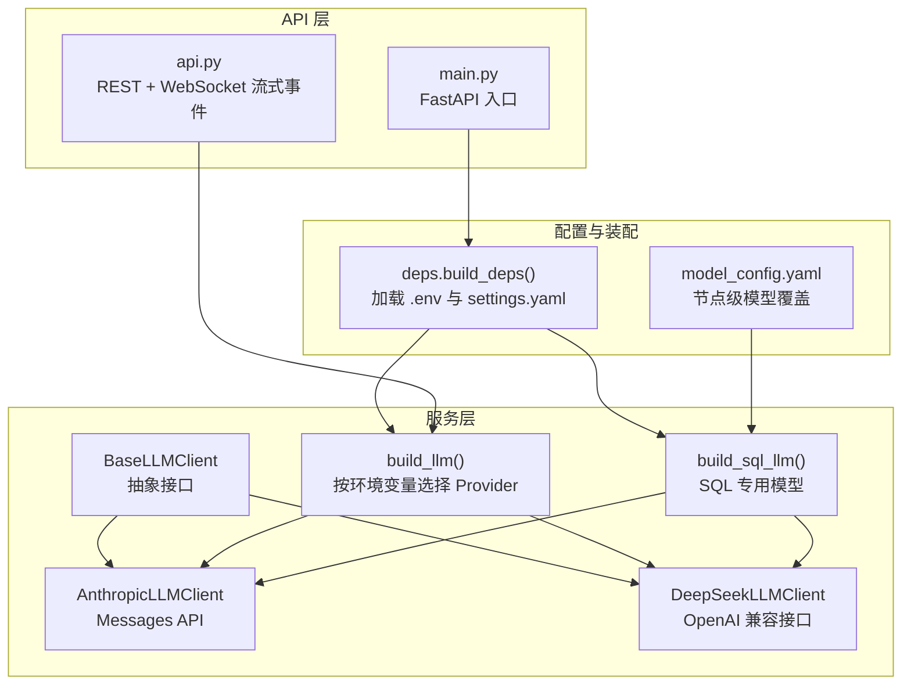
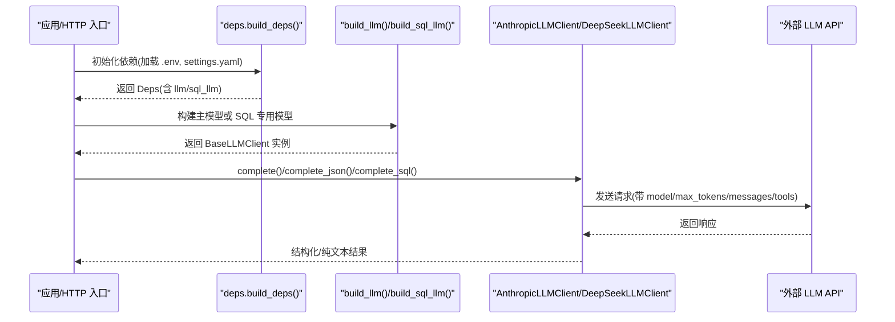
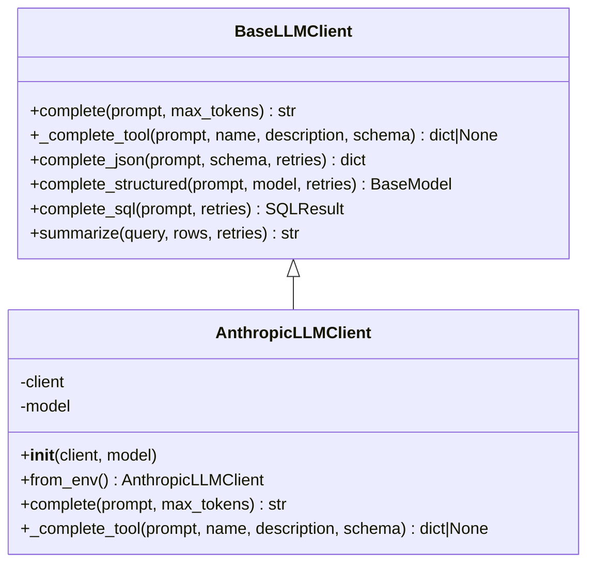
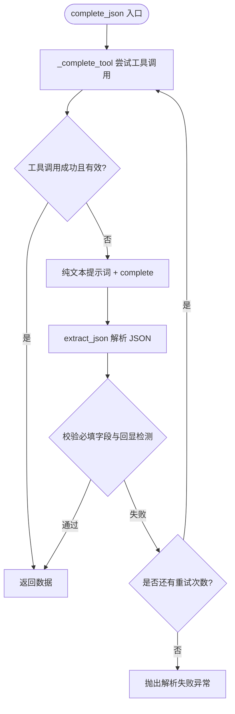
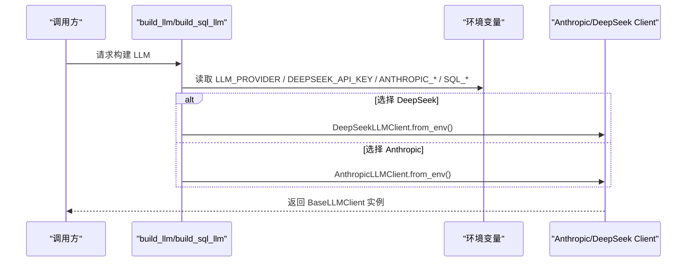
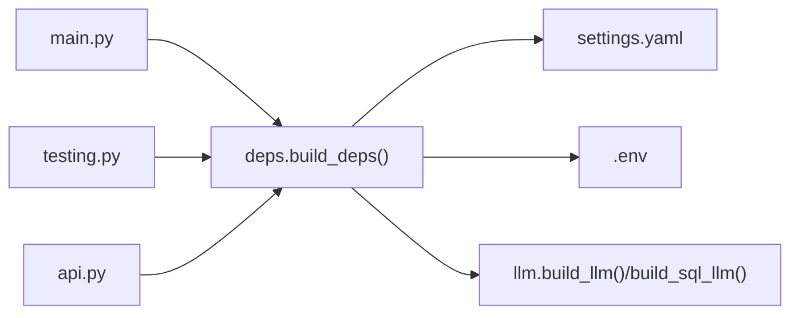

# Provider 实现

<cite>
**本文引用的文件**
- [nl2sql_agent/services/llm.py](file://nl2sql_agent/services/llm.py)
- [nl2sql_agent/services/deps.py](file://nl2sql_agent/services/deps.py)
- [nl2sql_agent/config/model_config.yaml](file://nl2sql_agent/config/model_config.yaml)
- [nl2sql_agent/config/settings.yaml](file://nl2sql_agent/config/settings.yaml)
- [nl2sql_agent/api.py](file://nl2sql_agent/api.py)
- [nl2sql_agent/main.py](file://nl2sql_agent/main.py)
- [nl2sql_agent/testing.py](file://nl2sql_agent/testing.py)
</cite>

## 目录
1. [简介](#简介)
2. [项目结构](#项目结构)
3. [核心组件](#核心组件)
4. [架构总览](#架构总览)
5. [详细组件分析](#详细组件分析)
6. [依赖关系分析](#依赖关系分析)
7. [性能考量](#性能考量)
8. [故障排除指南](#故障排除指南)
9. [结论](#结论)
10. [附录：配置示例与环境变量清单](#附录配置示例与环境变量清单)

## 简介
本文件面向 LLM Provider 的实现与使用，重点覆盖以下方面：
- AnthropicLLMClient 与 DeepSeekLLMClient 的具体实现差异与特点
- _env 工厂方法（from_env）的设计模式与环境变量配置方式
- 两种 Provider 在工具调用支持上的差异（DeepSeek 的 thinking/reasoning 模式限制）
- 流式响应处理与错误恢复机制
- 完整的配置示例（API Key、模型名称、基础 URL）
- 性能对比与适用场景分析
- 常见连接问题、认证失败与超时的故障排除

## 项目结构
本项目将 LLM 调用抽象为可插拔 Provider，统一通过 BaseLLMClient 暴露接口。Anthropic 与 DeepSeek 分别提供具体实现，并通过环境变量动态选择。



图表来源
- [nl2sql_agent/services/llm.py:162-243](file://nl2sql_agent/services/llm.py#L162-L243)
- [nl2sql_agent/services/llm.py:280-327](file://nl2sql_agent/services/llm.py#L280-L327)
- [nl2sql_agent/services/deps.py:110-134](file://nl2sql_agent/services/deps.py#L110-L134)
- [nl2sql_agent/config/model_config.yaml:12-16](file://nl2sql_agent/config/model_config.yaml#L12-L16)
- [nl2sql_agent/api.py:161-210](file://nl2sql_agent/api.py#L161-L210)
- [nl2sql_agent/main.py:63-80](file://nl2sql_agent/main.py#L63-L80)

章节来源
- [nl2sql_agent/services/llm.py:1-14](file://nl2sql_agent/services/llm.py#L1-L14)
- [nl2sql_agent/services/deps.py:1-6](file://nl2sql_agent/services/deps.py#L1-L6)
- [nl2sql_agent/config/model_config.yaml:1-16](file://nl2sql_agent/config/model_config.yaml#L1-L16)
- [nl2sql_agent/config/settings.yaml:1-30](file://nl2sql_agent/config/settings.yaml#L1-L30)

## 核心组件
- BaseLLMClient：定义统一接口 complete、_complete_tool，以及结构化输出 complete_json、complete_structured、complete_sql 等能力。
- AnthropicLLMClient：基于 Anthropic Messages API，支持 tool_use（function calling）。
- DeepSeekLLMClient：基于 OpenAI 兼容接口（默认 base_url=https://api.deepseek.com），thinking/reasoning 模式下不支持 tool_choice，因此 _complete_tool 返回 None，走纯文本解析兜底。
- build_llm / build_sql_llm：根据环境变量选择 Provider 或 SQL 专用模型。
- get_model_for_node：按 model_config.yaml 中 nodes.<node_key> 覆盖模型（离线任务可用更便宜模型）。

章节来源
- [nl2sql_agent/services/llm.py:70-160](file://nl2sql_agent/services/llm.py#L70-L160)
- [nl2sql_agent/services/llm.py:162-243](file://nl2sql_agent/services/llm.py#L162-L243)
- [nl2sql_agent/services/llm.py:254-283](file://nl2sql_agent/services/llm.py#L254-L283)
- [nl2sql_agent/services/llm.py:285-327](file://nl2sql_agent/services/llm.py#L285-L327)

## 架构总览
Provider 选择与调用流程如下：



图表来源
- [nl2sql_agent/services/deps.py:110-134](file://nl2sql_agent/services/deps.py#L110-L134)
- [nl2sql_agent/services/llm.py:280-327](file://nl2sql_agent/services/llm.py#L280-L327)
- [nl2sql_agent/services/llm.py:181-202](file://nl2sql_agent/services/llm.py#L181-L202)
- [nl2sql_agent/services/llm.py:230-242](file://nl2sql_agent/services/llm.py#L230-L242)

## 详细组件分析

### AnthropicLLMClient
- 接口实现
  - complete：调用 messages.create，拼接 user 消息，提取 text 块。
  - _complete_tool：传入 tools 与 tool_choice，强制模型走 tool_use；若未命中则返回 None。
- 结构化输出策略
  - 优先 function calling（可靠），失败回退到纯文本 + extract_json 解析，并校验必填字段与“回显 schema”的情况，支持重试。
- 环境变量
  - ANTHROPIC_API_KEY、ANTHROPIC_MODEL 必须设置；模型名不允许硬编码。



图表来源
- [nl2sql_agent/services/llm.py:70-160](file://nl2sql_agent/services/llm.py#L70-L160)
- [nl2sql_agent/services/llm.py:162-203](file://nl2sql_agent/services/llm.py#L162-L203)

章节来源
- [nl2sql_agent/services/llm.py:162-203](file://nl2sql_agent/services/llm.py#L162-L203)

### DeepSeekLLMClient
- 接口实现
  - complete：调用 OpenAI 兼容 chat.completions.create，读取 content。
  - _complete_tool：由于 DeepSeek 的 thinking/reasoning 模式不支持 tool_choice（会 400），直接返回 None，交由上层纯文本路径处理。
- 环境变量
  - DEEPSEEK_API_KEY、DEEPSEEK_MODEL 必须设置；可选 DEEPSEEK_BASE_URL 覆盖默认端点。
- 结构化输出策略
  - 因 _complete_tool 返回 None，始终走纯文本 + extract_json 解析与校验，支持重试。



图表来源
- [nl2sql_agent/services/llm.py:82-129](file://nl2sql_agent/services/llm.py#L82-L129)
- [nl2sql_agent/services/llm.py:239-242](file://nl2sql_agent/services/llm.py#L239-L242)

章节来源
- [nl2sql_agent/services/llm.py:205-243](file://nl2sql_agent/services/llm.py#L205-L243)

### from_env 工厂方法与 Provider 选择
- AnthropicLLMClient.from_env：从环境变量构造 anthropic.Anthropic 客户端与模型名。
- DeepSeekLLMClient.from_env：从环境变量构造 openai.OpenAI 客户端（支持 base_url 覆盖）与模型名。
- build_llm：按 LLM_PROVIDER 或是否存在 DEEPSEEK_API_KEY 决定 Provider。
- build_sql_llm：支持独立 SQL 模型（任意 OpenAI 兼容端点）或同主 provider 的 SQL 模型名。



图表来源
- [nl2sql_agent/services/llm.py:275-283](file://nl2sql_agent/services/llm.py#L275-L283)
- [nl2sql_agent/services/llm.py:285-327](file://nl2sql_agent/services/llm.py#L285-L327)
- [nl2sql_agent/services/llm.py:169-179](file://nl2sql_agent/services/llm.py#L169-L179)
- [nl2sql_agent/services/llm.py:215-228](file://nl2sql_agent/services/llm.py#L215-L228)

章节来源
- [nl2sql_agent/services/llm.py:275-327](file://nl2sql_agent/services/llm.py#L275-L327)

### 节点级模型覆盖（get_model_for_node）
- 读取 model_config.yaml 中 nodes.<node_key> 的 model、api_key、base_url，用于离线/专用任务（如 schema_comment_generation）。
- 未配置时回退主模型。

章节来源
- [nl2sql_agent/services/llm.py:245-273](file://nl2sql_agent/services/llm.py#L245-L273)
- [nl2sql_agent/config/model_config.yaml:12-16](file://nl2sql_agent/config/model_config.yaml#L12-L16)

### 流式响应与错误恢复
- API 层通过 WebSocket 推送 pipeline 事件（node_start/complete/retry/interrupt/final/error/done），并在 60 秒无事件时发送 ping 保持连接。
- 执行线程通过 EventStream 桥接同步线程与异步事件循环，确保事件安全传递。
- 错误处理：捕获异常后推送 error 事件并落库状态为 error；最终 always 推送 done 事件。
- 断线重连：前端携带 trace_id 重连，服务端根据存储的状态恢复当前阶段（pending_review/done/blocked/rejected）。

```mermaid
sequenceDiagram
participant WS as "WebSocket 客户端"
participant API as "api._ws_query_handler"
participant Thread as "_run_query 线程"
participant Stream as "EventStream"
participant Store as "QueryStore"
WS->>API : 发送查询消息(user_query/trace_id)
API->>Thread : 启动线程执行图
Thread->>Stream : emit(event)
Stream-->>API : get() 获取事件
API-->>WS : 推送事件(node_start/complete/retry/interrupt/final/error/done)
API->>Store : 持久化状态(含 retry_count/plan_retry_count/node_latencies)
Note over API,WS : 60s 超时发 ping; 断线重连按 trace_id 恢复
```

图表来源
- [nl2sql_agent/api.py:54-66](file://nl2sql_agent/api.py#L54-L66)
- [nl2sql_agent/api.py:134-157](file://nl2sql_agent/api.py#L134-L157)
- [nl2sql_agent/api.py:161-210](file://nl2sql_agent/api.py#L161-L210)

章节来源
- [nl2sql_agent/api.py:54-66](file://nl2sql_agent/api.py#L54-L66)
- [nl2sql_agent/api.py:134-157](file://nl2sql_agent/api.py#L134-L157)
- [nl2sql_agent/api.py:161-210](file://nl2sql_agent/api.py#L161-L210)

## 依赖关系分析
- deps.build_deps：加载 .env 与 settings.yaml，构建 Deps（包含 llm/sql_llm、executor、vector_store、catalog 等）。
- main.py：FastAPI 入口，根据 NL2SQL_DEMO 切换测试依赖（FakeLLM + InMemoryExecutor）。
- testing.py：提供 FakeLLM 与测试依赖装配，便于单元测试与回归测试。



图表来源
- [nl2sql_agent/main.py:63-80](file://nl2sql_agent/main.py#L63-L80)
- [nl2sql_agent/services/deps.py:110-134](file://nl2sql_agent/services/deps.py#L110-L134)
- [nl2sql_agent/testing.py:148-187](file://nl2sql_agent/testing.py#L148-L187)

章节来源
- [nl2sql_agent/main.py:63-80](file://nl2sql_agent/main.py#L63-L80)
- [nl2sql_agent/services/deps.py:110-134](file://nl2sql_agent/services/deps.py#L110-L134)
- [nl2sql_agent/testing.py:148-187](file://nl2sql_agent/testing.py#L148-L187)

## 性能考量
- 工具调用 vs 纯文本解析
  - Anthropic：支持 tool_use，结构化输出更稳定，减少解析失败与重试开销。
  - DeepSeek：thinking/reasoning 模式不支持 tool_choice，只能走纯文本解析，可能增加解析失败与重试概率。
- 重试策略
  - complete_json 默认最多重试 2 次（retries=2），结合 extract_json 与必填字段校验，降低“回显 schema”导致的无效输出。
- 流式事件与延迟
  - API 层通过事件推送提升用户体验；WebSocket 心跳（ping）避免长连接超时。
- 节点级模型优化
  - 通过 model_config.yaml 为离线/专用任务分配更便宜的模型，降低成本与延迟。

[本节为通用指导，不直接分析具体文件]

## 故障排除指南
- 连接问题
  - 检查 DEEPSEEK_BASE_URL 或默认端点可达性；确认网络代理与防火墙设置。
  - 对于 Anthropic，确认 ANTHROPIC_API_KEY 正确且未被禁用。
- 认证失败
  - 环境变量缺失或未生效：确认 .env 已加载（main.py 与 api.py 均调用 load_env()）。
  - 模型名不正确：ANTHROPIC_MODEL / DEEPSEEK_MODEL 需与实际可用模型一致。
- 超时处理
  - API 层 WebSocket 心跳 60 秒；HTTP REST 调用最长等待 180 秒（见 api.py 中的 join timeout）。
  - 数据库执行超时由 settings.yaml 的 execution.timeout_seconds 控制。
- 结构化输出失败
  - 观察 complete_json 的重试日志；若多次失败，检查 prompt 是否清晰、schema 是否合理。
  - DeepSeek 下 _complete_tool 返回 None，需依赖纯文本解析；必要时调整提示词以减少“回显 schema”。

章节来源
- [nl2sql_agent/api.py:161-210](file://nl2sql_agent/api.py#L161-L210)
- [nl2sql_agent/api.py:234-263](file://nl2sql_agent/api.py#L234-L263)
- [nl2sql_agent/config/settings.yaml:18-22](file://nl2sql_agent/config/settings.yaml#L18-L22)
- [nl2sql_agent/services/llm.py:82-129](file://nl2sql_agent/services/llm.py#L82-L129)

## 结论
- AnthropicLLMClient 更适合需要强结构化输出的场景（tool_use 稳定）。
- DeepSeekLLMClient 适合成本敏感或特定推理模式的场景，但需注意 thinking/reasoning 模式对工具调用的限制。
- 通过环境变量与 from_env 工厂方法，实现灵活、可配置的 Provider 选择与切换。
- 流式事件与错误恢复机制提升了系统的可观测性与鲁棒性。

[本节为总结性内容，不直接分析具体文件]

## 附录：配置示例与环境变量清单

### 环境变量清单
- 主模型
  - LLM_PROVIDER：deepseek 或 anthropic（显式指定 Provider）
  - ANTHROPIC_API_KEY、ANTHROPIC_MODEL：Anthropic 必需
  - DEEPSEEK_API_KEY、DEEPSEEK_MODEL：DeepSeek 必需
  - DEEPSEEK_BASE_URL：可选，覆盖默认端点
- SQL 专用模型
  - SQL_MODEL、SQL_API_KEY、SQL_BASE_URL：独立 SQL 模型（任意 OpenAI 兼容端点）
  - DEEPSEEK_SQL_MODEL / ANTHROPIC_SQL_MODEL：同主 provider 的 SQL 模型名
- 其他
  - DATABASE_URL / PG_DATABASE_URL：数据库连接
  - ADMIN_TOKEN：管理权限令牌

章节来源
- [nl2sql_agent/services/llm.py:275-327](file://nl2sql_agent/services/llm.py#L275-L327)
- [nl2sql_agent/services/deps.py:110-134](file://nl2sql_agent/services/deps.py#L110-L134)
- [nl2sql_agent/config/settings.yaml:10-16](file://nl2sql_agent/config/settings.yaml#L10-L16)

### 配置示例（.env）
- 使用 Anthropic
  - ANTHROPIC_API_KEY=your_api_key
  - ANTHROPIC_MODEL=claude-sonnet-4-20250514
  - LLM_PROVIDER=anthropic
- 使用 DeepSeek
  - DEEPSEEK_API_KEY=your_api_key
  - DEEPSEEK_MODEL=deepseek-chat
  - DEEPSEEK_BASE_URL=https://api.deepseek.com
  - LLM_PROVIDER=deepseek
- 独立 SQL 模型（例如千问/DashScope）
  - SQL_MODEL=qwen-turbo
  - SQL_API_KEY=your_api_key
  - SQL_BASE_URL=https://dashscope.aliyuncs.com/compatible-mode/v1

章节来源
- [nl2sql_agent/main.py:29](file://nl2sql_agent/main.py#L29)
- [nl2sql_agent/services/llm.py:297-307](file://nl2sql_agent/services/llm.py#L297-L307)

### 节点级模型覆盖（model_config.yaml）
- nodes.schema_comment_generation.model=deepseek-chat
- 可为各节点指定 api_key/base_url，以低成本模型完成离线任务

章节来源
- [nl2sql_agent/config/model_config.yaml:12-16](file://nl2sql_agent/config/model_config.yaml#L12-L16)
- [nl2sql_agent/services/llm.py:254-273](file://nl2sql_agent/services/llm.py#L254-L273)