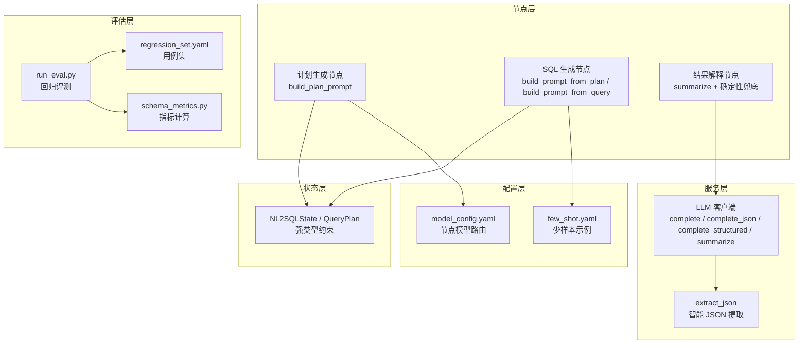
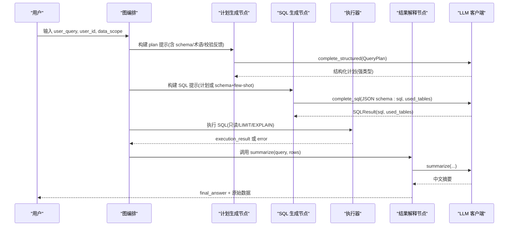
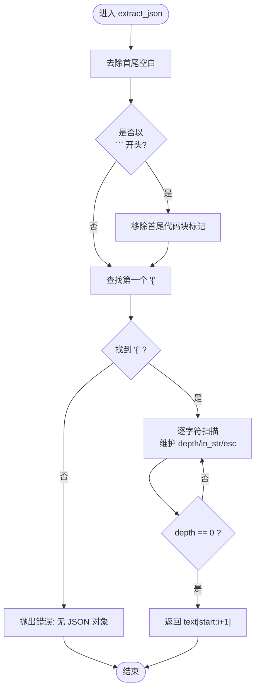
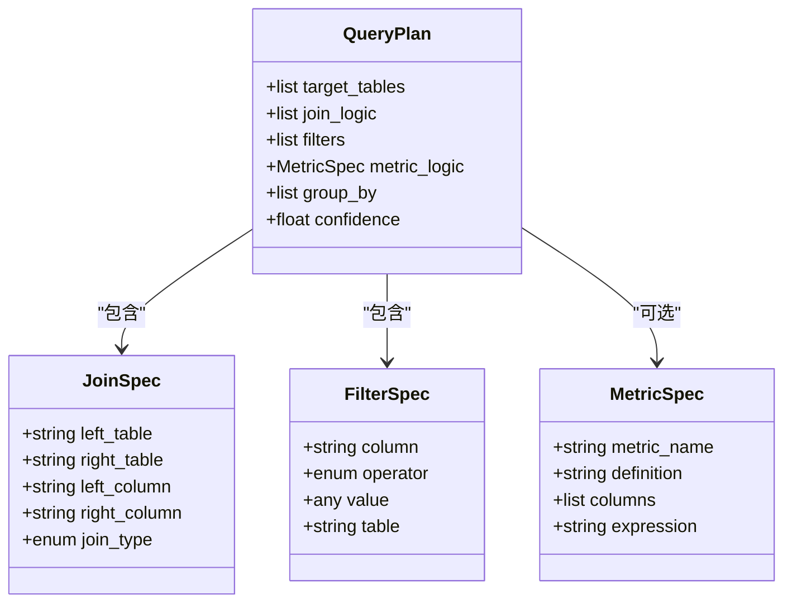
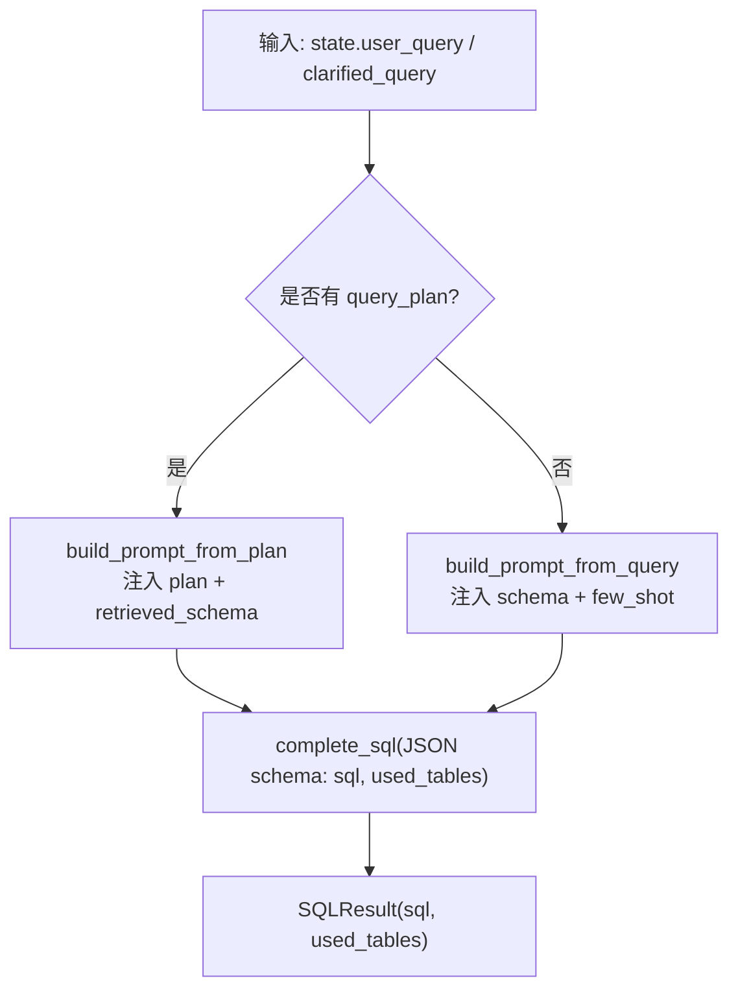
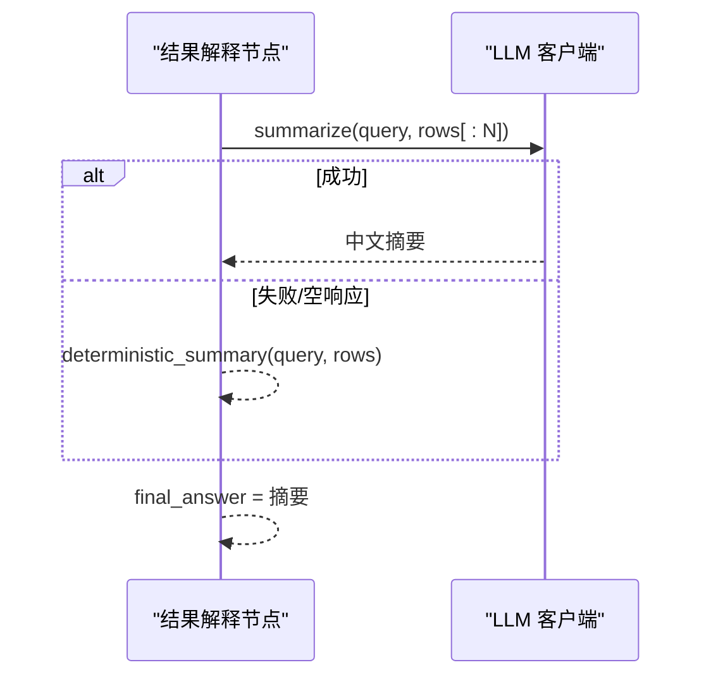
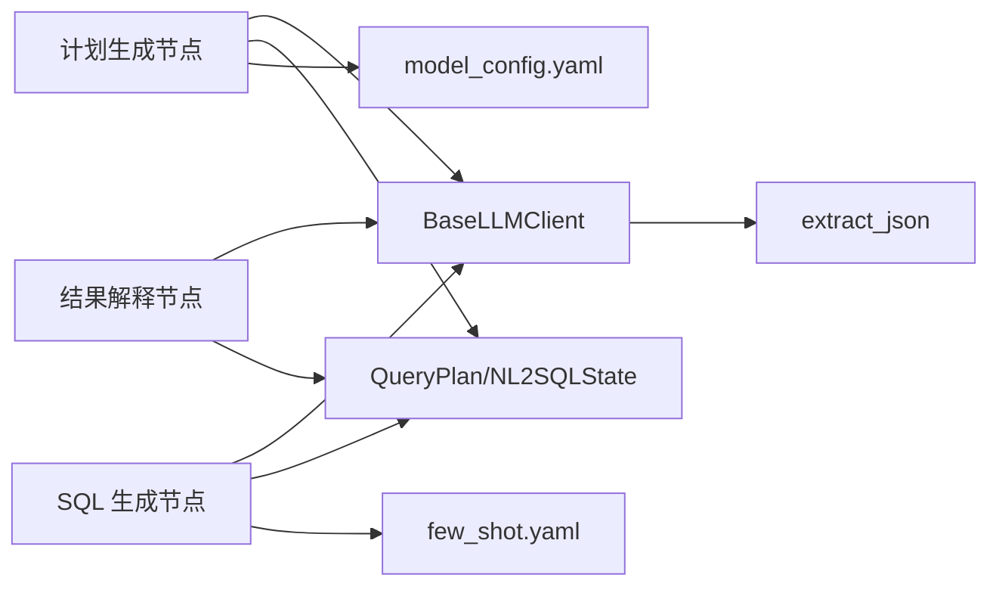

# 提示工程

<cite>
**本文引用的文件**   
- [llm.py](file://nl2sql_agent/services/llm.py)
- [m7_sql_generation.py](file://nl2sql_agent/nodes/m7_sql_generation.py)
- [m5b_plan_generation.py](file://nl2sql_agent/nodes/m5b_plan_generation.py)
- [m11_result_interpretation.py](file://nl2sql_agent/nodes/m11_result_interpretation.py)
- [state.py](file://nl2sql_agent/state.py)
- [few_shot.yaml](file://nl2sql_agent/config/few_shot.yaml)
- [model_config.yaml](file://nl2sql_agent/config/model_config.yaml)
- [run_eval.py](file://nl2sql_agent/eval/run_eval.py)
- [regression_set.yaml](file://nl2sql_agent/eval/regression_set.yaml)
- [schema_metrics.py](file://nl2sql_agent/eval/schema_metrics.py)
- [testing.py](file://nl2sql_agent/testing.py)
- [test_llm.py](file://nl2sql_agent/tests/test_llm.py)
- [NL2SQL.md](file://NL2SQL.md)
</cite>

## 目录
1. [简介](#简介)
2. [项目结构](#项目结构)
3. [核心组件](#核心组件)
4. [架构总览](#架构总览)
5. [详细组件分析](#详细组件分析)
6. [依赖关系分析](#依赖关系分析)
7. [性能考量](#性能考量)
8. [故障排查指南](#故障排查指南)
9. [结论](#结论)
10. [附录](#附录)

## 简介
本文件面向 LLM 提示工程，系统化阐述结构化输出提示设计原则、JSON Schema 定义与字段约束、类型验证机制；详解 extract_json 的智能解析流程（Markdown 代码块处理、JSON 对象提取、嵌套结构支持）；文档化 summarize 方法的摘要生成模板与优化技巧；总结 SQL 生成、计划制定、结果解释等任务类型的提示模式与最佳实践；并提供提示词版本管理、A/B 测试方法、评估指标与调优策略，以及实际用例与效果对比。

## 项目结构
本项目围绕“自然语言→查询计划→SQL→执行→结果解释”的链路组织，关键提示工程相关模块如下：
- 服务层：LLM 抽象与客户端实现、结构化输出封装、摘要生成
- 节点层：计划生成、SQL 生成、结果解释等节点提示构建
- 状态层：强类型 QueryPlan 与 NL2SQLState，确保提示产物可校验
- 配置层：Few-shot 示例库、模型路由配置
- 评估层：回归用例集、指标计算、自动化评测入口

**图表来源** 
- [llm.py:70-160](file://nl2sql_agent/services/llm.py#L70-L160)
- [m5b_plan_generation.py:16-68](file://nl2sql_agent/nodes/m5b_plan_generation.py#L16-L68)
- [m7_sql_generation.py:31-91](file://nl2sql_agent/nodes/m7_sql_generation.py#L31-L91)
- [m11_result_interpretation.py:14-36](file://nl2sql_agent/nodes/m11_result_interpretation.py#L14-L36)
- [state.py:66-81](file://nl2sql_agent/state.py#L66-L81)
- [few_shot.yaml:1-32](file://nl2sql_agent/config/few_shot.yaml#L1-L32)
- [model_config.yaml:1-18](file://nl2sql_agent/config/model_config.yaml#L1-L18)
- [run_eval.py:18-86](file://nl2sql_agent/eval/run_eval.py#L18-L86)
- [schema_metrics.py:15-60](file://nl2sql_agent/eval/schema_metrics.py#L15-L60)

**章节来源**
- [llm.py:70-160](file://nl2sql_agent/services/llm.py#L70-L160)
- [m5b_plan_generation.py:16-68](file://nl2sql_agent/nodes/m5b_plan_generation.py#L16-L68)
- [m7_sql_generation.py:31-91](file://nl2sql_agent/nodes/m7_sql_generation.py#L31-L91)
- [m11_result_interpretation.py:14-36](file://nl2sql_agent/nodes/m11_result_interpretation.py#L14-L36)
- [state.py:66-81](file://nl2sql_agent/state.py#L66-L81)
- [few_shot.yaml:1-32](file://nl2sql_agent/config/few_shot.yaml#L1-L32)
- [model_config.yaml:1-18](file://nl2sql_agent/config/model_config.yaml#L1-L18)
- [run_eval.py:18-86](file://nl2sql_agent/eval/run_eval.py#L18-L86)
- [schema_metrics.py:15-60](file://nl2sql_agent/eval/schema_metrics.py#L15-L60)

## 核心组件
- 结构化输出基类与客户端
  - BaseLLMClient 提供 complete、_complete_tool、complete_json、complete_structured、complete_sql、summarize 的统一接口
  - AnthropicLLMClient 与 DeepSeekLLMClient 分别实现消息 API 与 OpenAI 兼容接口
- extract_json 智能解析
  - 容忍 Markdown 代码块、前后废话、转义字符与嵌套对象，返回首个完整 JSON 字符串
- 提示构建器
  - 计划生成：build_plan_prompt 将用户问题、检索 schema、术语口径与校验反馈组装为强类型 JSON 输出提示
  - SQL 生成：build_prompt_from_plan/build_prompt_from_query 基于计划或 schema+few-shot 生成 SQL 并附带 used_tables
  - 结果解释：summarize 模板将查询与结果前若干行转为中文摘要，失败回退确定性摘要
- 状态与强类型
  - QueryPlan 通过 Pydantic 严格约束 join_type、operator、confidence 等，避免自由文本导致的歧义

**章节来源**
- [llm.py:70-160](file://nl2sql_agent/services/llm.py#L70-L160)
- [llm.py:37-68](file://nl2sql_agent/services/llm.py#L37-L68)
- [m5b_plan_generation.py:16-68](file://nl2sql_agent/nodes/m5b_plan_generation.py#L16-L68)
- [m7_sql_generation.py:31-91](file://nl2sql_agent/nodes/m7_sql_generation.py#L31-L91)
- [m11_result_interpretation.py:14-36](file://nl2sql_agent/nodes/m11_result_interpretation.py#L14-L36)
- [state.py:66-81](file://nl2sql_agent/state.py#L66-L81)

## 架构总览
下图展示从用户提问到结果解释的关键调用链路与提示工程要点。

**图表来源** 
- [m5b_plan_generation.py:71-89](file://nl2sql_agent/nodes/m5b_plan_generation.py#L71-L89)
- [m7_sql_generation.py:94-112](file://nl2sql_agent/nodes/m7_sql_generation.py#L94-L112)
- [m11_result_interpretation.py:25-38](file://nl2sql_agent/nodes/m11_result_interpretation.py#L25-L38)
- [llm.py:130-159](file://nl2sql_agent/services/llm.py#L130-L159)

## 详细组件分析

### 结构化输出与 JSON 提取
- complete_json 工作流
  - 优先尝试 function calling（Anthropic 支持 tool_choice），DeepSeek thinking 模式不支持则回退纯文本
  - 纯文本路径使用 extract_json 抽取首个完整 JSON，并进行“回显 schema 定义”检测与必填字段校验
  - 重试策略：对解析失败与无效输出进行有限次重试，最终抛错
- extract_json 算法
  - 去除 Markdown 代码块标记，定位第一个 {，逐字符扫描维护深度与字符串转义状态，遇到闭合 } 且深度归零即返回子串
  - 支持嵌套对象、数组、转义引号与花括号值

**图表来源** 
- [llm.py:37-68](file://nl2sql_agent/services/llm.py#L37-L68)

**章节来源**
- [llm.py:82-128](file://nl2sql_agent/services/llm.py#L82-L128)
- [llm.py:37-68](file://nl2sql_agent/services/llm.py#L37-L68)
- [test_llm.py:155-166](file://nl2sql_agent/tests/test_llm.py#L155-L166)

### 计划生成提示与强类型约束
- 提示内容要素
  - 用户问题、权限说明、检索到的表结构（含列注释）、术语口径（definition/composite_metric）、上一轮校验错误反馈
  - 明确要求只做 SELECT 规划，target_tables 必须来自检索结果，join_type/filter operator 限定取值
  - 输出强类型 QueryPlan 结构，禁止自由文本
- 强类型保障
  - QueryPlan 使用 Pydantic 模型，extra="forbid"，字段类型与范围受控（如 confidence 0~1）
  - JoinSpec/FilterSpec/MetricSpec 规范化枚举与操作符，降低歧义

**图表来源** 
- [state.py:31-81](file://nl2sql_agent/state.py#L31-L81)

**章节来源**
- [m5b_plan_generation.py:16-68](file://nl2sql_agent/nodes/m5b_plan_generation.py#L16-L68)
- [state.py:66-81](file://nl2sql_agent/state.py#L66-L81)

### SQL 生成提示与 Few-shot
- 两种提示构建路径
  - 有计划：按 QueryPlan 构造 prompt，强调只使用计划声明的表与字段，同时输出 used_tables
  - 无计划：基于检索 schema + few-shot 示例生成 SQL，限制只读与字段白名单
- Few-shot 示例库
  - 基于真实借据表 dwd_ar_loan_info，覆盖 count/sum/where 等常见模式，便于模型迁移学习

**图表来源** 
- [m7_sql_generation.py:31-91](file://nl2sql_agent/nodes/m7_sql_generation.py#L31-L91)
- [m7_sql_generation.py:94-112](file://nl2sql_agent/nodes/m7_sql_generation.py#L94-L112)
- [few_shot.yaml:1-32](file://nl2sql_agent/config/few_shot.yaml#L1-L32)

**章节来源**
- [m7_sql_generation.py:31-91](file://nl2sql_agent/nodes/m7_sql_generation.py#L31-L91)
- [m7_sql_generation.py:94-112](file://nl2sql_agent/nodes/m7_sql_generation.py#L94-L112)
- [few_shot.yaml:1-32](file://nl2sql_agent/config/few_shot.yaml#L1-L32)

### 结果解释与摘要模板
- summarize 模板
  - 要求用中文简洁摘要，保留关键数字与单位，禁止编造未出现的数据
  - 仅传入前若干行结果，控制 token 与上下文长度
- 确定性兜底
  - LLM 不可用时，返回固定格式摘要（行数+示例行），保证可用性

**图表来源** 
- [m11_result_interpretation.py:14-36](file://nl2sql_agent/nodes/m11_result_interpretation.py#L14-L36)
- [llm.py:151-159](file://nl2sql_agent/services/llm.py#L151-L159)

**章节来源**
- [m11_result_interpretation.py:14-36](file://nl2sql_agent/nodes/m11_result_interpretation.py#L14-L36)
- [llm.py:151-159](file://nl2sql_agent/services/llm.py#L151-L159)

## 依赖关系分析
- 组件耦合
  - 节点层依赖 LLM 客户端完成结构化输出与摘要
  - 状态层通过强类型约束上游提示产物，降低下游校验成本
  - 配置层提供 Few-shot 与节点模型路由，影响提示质量与成本
- 外部依赖
  - Anthropic/OpenAI 兼容端点、向量存储、执行器等
- 潜在循环依赖
  - 当前设计为单向依赖（节点→LLM→状态/配置），未发现循环

**图表来源** 
- [m5b_plan_generation.py:71-89](file://nl2sql_agent/nodes/m5b_plan_generation.py#L71-L89)
- [m7_sql_generation.py:94-112](file://nl2sql_agent/nodes/m7_sql_generation.py#L94-L112)
- [m11_result_interpretation.py:25-38](file://nl2sql_agent/nodes/m11_result_interpretation.py#L25-L38)
- [llm.py:70-160](file://nl2sql_agent/services/llm.py#L70-L160)
- [state.py:66-81](file://nl2sql_agent/state.py#L66-L81)
- [model_config.yaml:1-18](file://nl2sql_agent/config/model_config.yaml#L1-L18)
- [few_shot.yaml:1-32](file://nl2sql_agent/config/few_shot.yaml#L1-L32)

**章节来源**
- [m5b_plan_generation.py:71-89](file://nl2sql_agent/nodes/m5b_plan_generation.py#L71-L89)
- [m7_sql_generation.py:94-112](file://nl2sql_agent/nodes/m7_sql_generation.py#L94-L112)
- [m11_result_interpretation.py:25-38](file://nl2sql_agent/nodes/m11_result_interpretation.py#L25-L38)
- [llm.py:70-160](file://nl2sql_agent/services/llm.py#L70-L160)
- [state.py:66-81](file://nl2sql_agent/state.py#L66-L81)
- [model_config.yaml:1-18](file://nl2sql_agent/config/model_config.yaml#L1-L18)
- [few_shot.yaml:1-32](file://nl2sql_agent/config/few_shot.yaml#L1-L32)

## 性能考量
- 结构化输出优先走 function calling，减少解析失败与重试次数
- 摘要生成限制输入行数，控制 token 消耗
- 简单查询跳过计划阶段，降低延迟与成本
- 节点级模型路由允许离线/专用任务使用更便宜模型

[本节为通用指导，不直接分析具体文件]

## 故障排查指南
- 结构化输出多次失败
  - 检查是否出现“回显 schema 定义”或缺失必填字段，确认 _valid 判定逻辑与 instruction 是否足够明确
  - 参考测试用例验证 extract_json 对 Markdown 与转义的鲁棒性
- 计划校验失败
  - 核对 target_tables 是否在检索范围内，join/filter 引用字段是否存在且唯一归属
  - 复合口径 definition 是否与术语映射一致
- SQL 执行报错
  - 查看 execution_error，结合 validation_errors 定位语义或语法问题
- 结果解释为空
  - LLM 不可用或返回空时，自动降级为确定性摘要

**章节来源**
- [llm.py:82-128](file://nl2sql_agent/services/llm.py#L82-L128)
- [test_llm.py:115-151](file://nl2sql_agent/tests/test_llm.py#L115-L151)
- [m6_plan_validation.py:51-97](file://nl2sql_agent/nodes/m6_plan_validation.py#L51-L97)
- [m11_result_interpretation.py:25-38](file://nl2sql_agent/nodes/m11_result_interpretation.py#L25-L38)

## 结论
本项目通过强类型状态、函数式结构化输出与智能 JSON 提取，构建了稳健的提示工程体系。计划与 SQL 生成分离、Few-shot 辅助、节点级模型路由与回归评测共同保障了准确率与成本可控。建议在业务演进中持续完善术语映射、Few-shot 库与评估指标，形成闭环优化。

[本节为总结性内容，不直接分析具体文件]

## 附录

### 提示词版本管理与 A/B 测试方法
- 版本管理
  - 将提示模板与参数纳入配置或代码分支，配合 regression_set.yaml 用例集进行回归验证
  - 在 model_config.yaml 中为不同节点指定模型与端点，便于灰度切换
- A/B 测试
  - 通过 run_eval.py 并行跑两套提示/模型组合，比较 path/plan_passed/sensitive/execution_result_nonempty 等断言
  - 结合 schema_metrics.py 统计 table_recall/column_recall/join_path_accuracy/sql_execution_accuracy/human_modification_rate/cost 等指标

**章节来源**
- [run_eval.py:18-86](file://nl2sql_agent/eval/run_eval.py#L18-L86)
- [regression_set.yaml:1-31](file://nl2sql_agent/eval/regression_set.yaml#L1-L31)
- [schema_metrics.py:15-60](file://nl2sql_agent/eval/schema_metrics.py#L15-L60)
- [model_config.yaml:1-18](file://nl2sql_agent/config/model_config.yaml#L1-L18)

### 实际项目中的提示词示例与效果对比
- 计划生成示例
  - 目标：将“逾期率”等业务指标映射为结构化 QueryPlan，确保 definition 与术语映射一致
  - 效果：通过 m6 校验拦截业务逻辑错误，减少 SQL 生成阶段的试错
- SQL 生成示例
  - 目标：基于 schema 与 few-shot 生成只读 SELECT，附带 used_tables 供交叉校验
  - 效果：few_shot.yaml 覆盖常见模式，提升简单查询一次成功率
- 结果解释示例
  - 目标：将结构化结果转为中文摘要，保留原始数据供核验
  - 效果：LLM 不可用时自动降级，保证可用性

**章节来源**
- [m5b_plan_generation.py:16-68](file://nl2sql_agent/nodes/m5b_plan_generation.py#L16-L68)
- [m7_sql_generation.py:31-91](file://nl2sql_agent/nodes/m7_sql_generation.py#L31-L91)
- [few_shot.yaml:1-32](file://nl2sql_agent/config/few_shot.yaml#L1-L32)
- [m11_result_interpretation.py:14-36](file://nl2sql_agent/nodes/m11_result_interpretation.py#L14-L36)

### 评估指标与调优策略
- 指标
  - 表召回率@K、列召回率、连接路径准确率、SQL 执行准确率、澄清率、人工修改率、每表平均耗时与成本
- 调优策略
  - 强化术语映射与 schema 注释，提高检索命中率
  - 扩充 few-shot 案例，覆盖长尾场景
  - 调整复杂度规则阈值，平衡计划路径与简单路径
  - 针对敏感规则与执行限制做精细化配置

**章节来源**
- [schema_metrics.py:15-60](file://nl2sql_agent/eval/schema_metrics.py#L15-L60)
- [NL2SQL.md:36-66](file://NL2SQL.md#L36-L66)