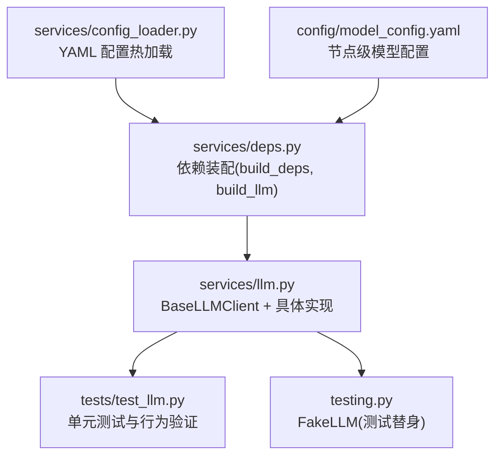
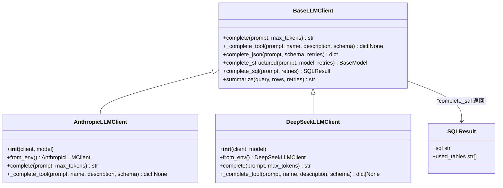
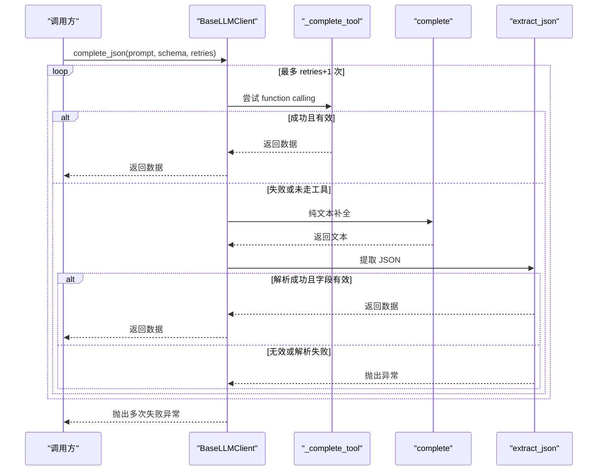
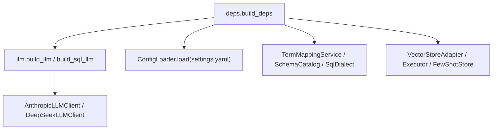

# 模型抽象设计

<cite>
**本文引用的文件**
- [llm.py](file://nl2sql_agent/services/llm.py)
- [test_llm.py](file://nl2sql_agent/tests/test_llm.py)
- [testing.py](file://nl2sql_agent/testing.py)
- [deps.py](file://nl2sql_agent/services/deps.py)
- [config_loader.py](file://nl2sql_agent/services/config_loader.py)
- [model_config.yaml](file://nl2sql_agent/config/model_config.yaml)
</cite>

## 目录
1. [简介](#简介)
2. [项目结构](#项目结构)
3. [核心组件](#核心组件)
4. [架构总览](#架构总览)
5. [详细组件分析](#详细组件分析)
6. [依赖关系分析](#依赖关系分析)
7. [性能考虑](#性能考虑)
8. [故障排查指南](#故障排查指南)
9. [结论](#结论)
10. [附录：自定义 LLM Provider 开发指南与示例](#附录自定义-llm-provider-开发指南与示例)

## 简介
本文件围绕 LLM 抽象基类的设计与实现进行系统化文档化，重点解释 BaseLLMClient 抽象接口的设计理念、职责划分与扩展点；详细说明结构化输出机制（complete_json、complete_structured、complete_sql）的工作原理与重试策略；文档化 SQLResult 数据模型；阐述函数调用（function calling）机制的实现细节（工具定义、参数校验与结果解析）；总结错误处理策略（EnvConfigError 与环境变量校验）；并提供自定义 LLM Provider 的开发指南与最小实现示例。

## 项目结构
与 LLM 抽象相关的关键代码集中在 nl2sql_agent/services/llm.py，测试与 Mock 在 tests/test_llm.py 与 testing.py，依赖装配在 services/deps.py，配置加载在 services/config_loader.py，节点级模型选择配置在 config/model_config.yaml。

图表来源
- [llm.py:70-160](file://nl2sql_agent/services/llm.py#L70-L160)
- [test_llm.py:1-166](file://nl2sql_agent/tests/test_llm.py#L1-L166)
- [testing.py:26-66](file://nl2sql_agent/testing.py#L26-L66)
- [deps.py:107-178](file://nl2sql_agent/services/deps.py#L107-L178)
- [config_loader.py:14-36](file://nl2sql_agent/services/config_loader.py#L14-L36)
- [model_config.yaml:12-16](file://nl2sql_agent/config/model_config.yaml#L12-L16)

章节来源
- [llm.py:1-328](file://nl2sql_agent/services/llm.py#L1-L328)
- [test_llm.py:1-166](file://nl2sql_agent/tests/test_llm.py#L1-L166)
- [testing.py:1-187](file://nl2sql_agent/testing.py#L1-L187)
- [deps.py:1-178](file://nl2sql_agent/services/deps.py#L1-L178)
- [config_loader.py:1-36](file://nl2sql_agent/services/config_loader.py#L1-L36)
- [model_config.yaml:1-16](file://nl2sql_agent/config/model_config.yaml#L1-L16)

## 核心组件
- BaseLLMClient：统一抽象接口，定义纯文本补全 complete 与函数调用 _complete_tool，并基于二者提供结构化输出能力 complete_json、complete_structured、complete_sql，以及 summarize。
- AnthropicLLMClient：基于 Anthropic Messages API 的具体实现，支持 tool_use。
- DeepSeekLLMClient：基于 OpenAI 兼容接口的具体实现，默认不支持 tool_choice（thinking/reasoning 模式），走纯文本兜底路径。
- SQLResult：SQL 生成结果的数据模型，包含 sql 字符串与 used_tables 列表。
- EnvConfigError：环境变量缺失或非法时的异常类型。
- extract_json：从 LLM 输出中稳健提取 JSON 对象（容忍 markdown 代码块与前后废话）。

章节来源
- [llm.py:27-35](file://nl2sql_agent/services/llm.py#L27-L35)
- [llm.py:37-68](file://nl2sql_agent/services/llm.py#L37-L68)
- [llm.py:70-160](file://nl2sql_agent/services/llm.py#L70-L160)
- [llm.py:162-203](file://nl2sql_agent/services/llm.py#L162-L203)
- [llm.py:205-243](file://nl2sql_agent/services/llm.py#L205-L243)

## 架构总览
下图展示了 BaseLLMClient 抽象与其两个具体实现的交互关系，以及结构化输出方法如何组合 pure text 与 function calling 两种路径。

图表来源
- [llm.py:70-160](file://nl2sql_agent/services/llm.py#L70-L160)
- [llm.py:162-203](file://nl2sql_agent/services/llm.py#L162-L203)
- [llm.py:205-243](file://nl2sql_agent/services/llm.py#L205-L243)
- [llm.py:31-35](file://nl2sql_agent/services/llm.py#L31-L35)

## 详细组件分析

### BaseLLMClient 抽象接口与方法职责
- complete(prompt, max_tokens)：纯文本补全，由子类实现不同 provider 的调用方式。
- _complete_tool(prompt, name, description, schema)：通过 function calling 强制结构化输出；若模型未走工具调用则返回 None。
- complete_json(prompt, schema, retries)：优先尝试 _complete_tool（可靠），失败回退到 complete + extract_json，并进行“是否回显 schema 定义”等有效性校验；支持多次重试。
- complete_structured(prompt, model, retries)：将 Pydantic 模型的 JSON Schema 传入 complete_json，再用 model_validate 构造实例。
- complete_sql(prompt, retries)：固定 schema（sql、used_tables），调用 complete_json 后封装为 SQLResult。
- summarize(query, rows, retries)：对查询结果做中文摘要。

章节来源
- [llm.py:70-160](file://nl2sql_agent/services/llm.py#L70-L160)

#### 结构化输出流程（complete_json）时序图

图表来源
- [llm.py:82-128](file://nl2sql_agent/services/llm.py#L82-L128)
- [llm.py:37-68](file://nl2sql_agent/services/llm.py#L37-L68)

### AnthropicLLMClient 与 DeepSeekLLMClient 的差异
- AnthropicLLMClient：
  - complete：调用 messages.create，拼接文本内容。
  - _complete_tool：使用 tools 与 tool_choice 强制工具调用，返回 block.input。
- DeepSeekLLMClient：
  - complete：调用 chat.completions.create，取 message.content。
  - _complete_tool：因 thinking/reasoning 模式不支持 tool_choice，直接返回 None，交由上层纯文本路径处理。

章节来源
- [llm.py:162-203](file://nl2sql_agent/services/llm.py#L162-L203)
- [llm.py:205-243](file://nl2sql_agent/services/llm.py#L205-L243)

### SQLResult 数据模型
- 字段：
  - sql：生成的 SQL 语句字符串。
  - used_tables：该 SQL 使用的表名列表（供后续模块交叉比对）。
- 用途：作为 complete_sql 的统一返回类型，便于下游模块直接使用。

章节来源
- [llm.py:31-35](file://nl2sql_agent/services/llm.py#L31-L35)
- [llm.py:135-149](file://nl2sql_agent/services/llm.py#L135-L149)

### 函数调用（function calling）机制
- 工具定义：
  - 名称：emit_json（用于 JSON 输出）。
  - 描述：输出符合给定 JSON 结构的实际数据。
  - 输入 schema：由调用方传入的 JSON Schema。
- 参数校验：
  - Anthropic 通过 tool_choice 强制工具调用。
  - DeepSeek 不支持 tool_choice，回退到纯文本路径，由 extract_json 与有效性检查保证健壮性。
- 结果解析：
  - Anthropic：从 tool_use 块中提取 input。
  - DeepSeek：从纯文本中用 extract_json 提取首个完整 JSON 对象。

章节来源
- [llm.py:82-128](file://nl2sql_agent/services/llm.py#L82-L128)
- [llm.py:191-202](file://nl2sql_agent/services/llm.py#L191-L202)
- [llm.py:239-242](file://nl2sql_agent/services/llm.py#L239-L242)

### 错误处理策略与配置验证
- EnvConfigError：当关键环境变量缺失或不合法时抛出（如 ANTHROPIC_MODEL、DEEPSEEK_API_KEY、DEEPSEEK_MODEL、SQL_* 相关变量）。
- 结构化输出失败：complete_json 在多次重试后仍无法得到有效数据时抛出 ValueError，提示“多次解析失败”。
- JSON 提取失败：extract_json 找不到或解析不完整时抛出 ValueError。
- 配置加载失败：ConfigLoader 在配置文件不存在时抛出 FileNotFoundError。

章节来源
- [llm.py:27-28](file://nl2sql_agent/services/llm.py#L27-L28)
- [llm.py:175-179](file://nl2sql_agent/services/llm.py#L175-L179)
- [llm.py:222-228](file://nl2sql_agent/services/llm.py#L222-L228)
- [llm.py:302-307](file://nl2sql_agent/services/llm.py#L302-L307)
- [llm.py:45-67](file://nl2sql_agent/services/llm.py#L45-L67)
- [config_loader.py:24-25](file://nl2sql_agent/services/config_loader.py#L24-L25)

## 依赖关系分析
- deps.build_deps：负责整体依赖装配，包括加载 .env、读取 settings.yaml、构建 AppConfig、TermMappingService、SchemaCatalog、SqlDialect、VectorStore、Executor、FewShotStore，以及 LLM（主模型与可选 SQL 专用模型）。
- llm.build_llm / build_sql_llm：根据环境变量选择 Anthropic 或 DeepSeek 客户端，支持独立 SQL 模型配置。
- config.ConfigLoader：提供 YAML 配置的热加载能力，按 mtime 判断是否需要重新加载。

图表来源
- [deps.py:107-178](file://nl2sql_agent/services/deps.py#L107-L178)
- [llm.py:280-327](file://nl2sql_agent/services/llm.py#L280-L327)
- [config_loader.py:14-36](file://nl2sql_agent/services/config_loader.py#L14-L36)

章节来源
- [deps.py:1-178](file://nl2sql_agent/services/deps.py#L1-L178)
- [llm.py:245-327](file://nl2sql_agent/services/llm.py#L245-L327)
- [config_loader.py:1-36](file://nl2sql_agent/services/config_loader.py#L1-L36)

## 性能考虑
- 结构化输出优先走 function calling（Anthropic），减少解析开销与错误率；DeepSeek 走纯文本路径，需依赖 extract_json 与有效性校验。
- 重试策略：complete_json 默认允许 retries=2（即最多 3 轮），避免单次失败导致整体失败。
- 配置热加载：ConfigLoader 基于 mtime 缓存，避免频繁 IO，提升启动与运行效率。
- 模型选择：build_sql_llm 可为 SQL 生成任务单独配置更便宜或更合适的模型，降低总体成本。

[本节为通用指导，不直接分析具体文件]

## 故障排查指南
- 环境变量缺失：
  - 现象：初始化客户端时报 EnvConfigError。
  - 排查：确认 ANTHROPIC_MODEL、ANTHROPIC_API_KEY、DEEPSEEK_API_KEY、DEEPSEEK_MODEL、SQL_* 等必要变量已设置。
- 结构化输出失败：
  - 现象：complete_json/complete_structured 抛出“多次解析失败”。
  - 排查：检查 prompt 是否明确要求只输出 JSON；观察 extract_json 是否能正确提取；必要时增加 retries。
- JSON 提取问题：
  - 现象：extract_json 抛错“没有 JSON 对象”或“不完整”。
  - 排查：确保模型输出包含完整 JSON；若使用 markdown 代码块，确保格式规范。
- 配置加载失败：
  - 现象：ConfigLoader 抛 FileNotFoundError。
  - 排查：确认配置文件路径存在且可读。

章节来源
- [llm.py:175-179](file://nl2sql_agent/services/llm.py#L175-L179)
- [llm.py:222-228](file://nl2sql_agent/services/llm.py#L222-L228)
- [llm.py:302-307](file://nl2sql_agent/services/llm.py#L302-L307)
- [llm.py:45-67](file://nl2sql_agent/services/llm.py#L45-L67)
- [config_loader.py:24-25](file://nl2sql_agent/services/config_loader.py#L24-L25)

## 结论
BaseLLMClient 以清晰的抽象边界与可扩展的函数调用机制，统一了多 provider 的结构化输出能力。complete_json/complete_structured/complete_sql 形成稳定的三层抽象，兼顾可靠性与易用性；SQLResult 为 SQL 生成提供强类型返回；EnvConfigError 与环境变量校验保障配置安全；测试与 Mock 体系完善，便于快速迭代与回归验证。

[本节为总结，不直接分析具体文件]

## 附录：自定义 LLM Provider 开发指南与示例

### 必须实现的接口
- 继承 BaseLLMClient，实现以下方法：
  - complete(prompt, max_tokens) -> str
  - _complete_tool(prompt, name, description, schema) -> dict | None
- 建议提供 from_env() 工厂方法，集中处理环境变量校验与客户端初始化。

章节来源
- [llm.py:70-80](file://nl2sql_agent/services/llm.py#L70-L80)
- [llm.py:169-179](file://nl2sql_agent/services/llm.py#L169-L179)
- [llm.py:215-228](file://nl2sql_agent/services/llm.py#L215-L228)

### 最佳实践
- 环境变量校验：所有关键配置（API Key、Model、Base URL）均应从环境变量读取，缺失时抛出 EnvConfigError。
- 函数调用支持：若 provider 支持 tool_choice，优先使用 _complete_tool 返回结构化数据；否则返回 None，让上层走纯文本路径。
- 错误处理：对网络异常、解析失败等进行捕获与重试控制，避免上层感知过多细节。
- 可测试性：提供 FakeLLM 或 Mock 替换，便于单元测试与集成测试。

章节来源
- [llm.py:162-203](file://nl2sql_agent/services/llm.py#L162-L203)
- [llm.py:205-243](file://nl2sql_agent/services/llm.py#L205-L243)
- [testing.py:26-66](file://nl2sql_agent/testing.py#L26-L66)

### 最小实现示例（伪代码说明）
- 步骤：
  - 定义 MyProviderLLMClient(BaseLLMClient)。
  - 实现 complete：调用对应 SDK 的聊天接口，返回文本。
  - 实现 _complete_tool：若支持 tool_choice，则构造工具定义并强制调用；否则返回 None。
  - 实现 from_env：读取环境变量，校验必填项，创建客户端实例。
- 使用：
  - 通过 build_llm 或自行实例化 MyProviderLLMClient。
  - 调用 complete_json/complete_structured/complete_sql 获取结构化结果。

章节来源
- [llm.py:70-160](file://nl2sql_agent/services/llm.py#L70-L160)
- [llm.py:280-327](file://nl2sql_agent/services/llm.py#L280-L327)

### 测试与验证
- 使用 test_llm.py 中的 FakeClient 思路，构造本地模拟响应，验证 complete_json 的重试与有效性校验逻辑。
- 使用 testing.py 中的 FakeLLM，注入 Deps，完成端到端测试。

章节来源
- [test_llm.py:55-125](file://nl2sql_agent/tests/test_llm.py#L55-L125)
- [testing.py:26-66](file://nl2sql_agent/testing.py#L26-L66)