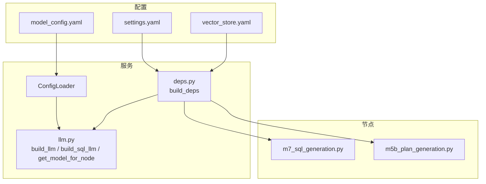
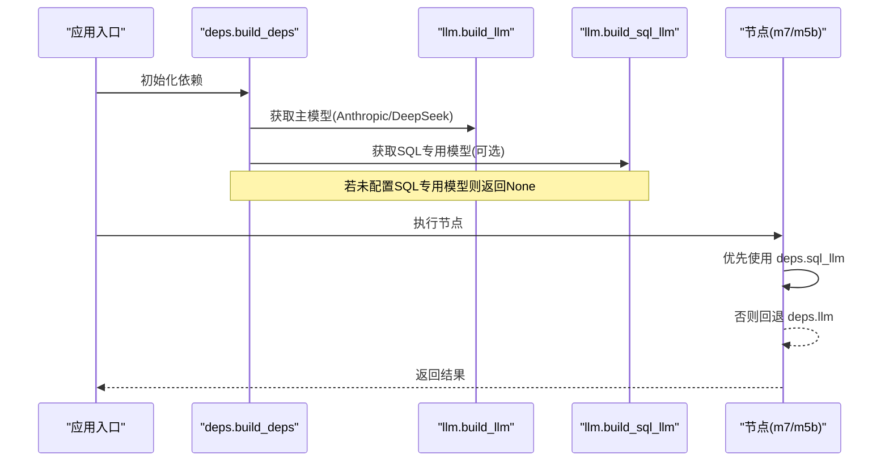
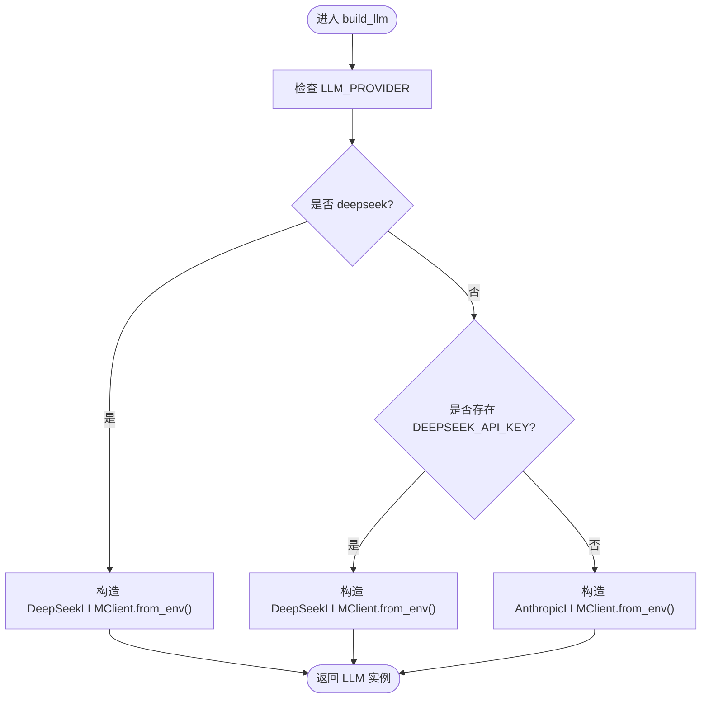
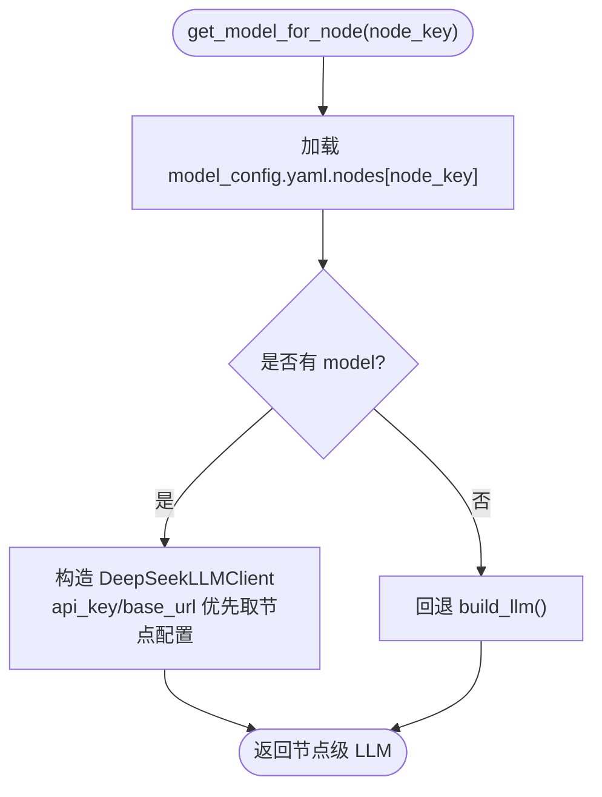
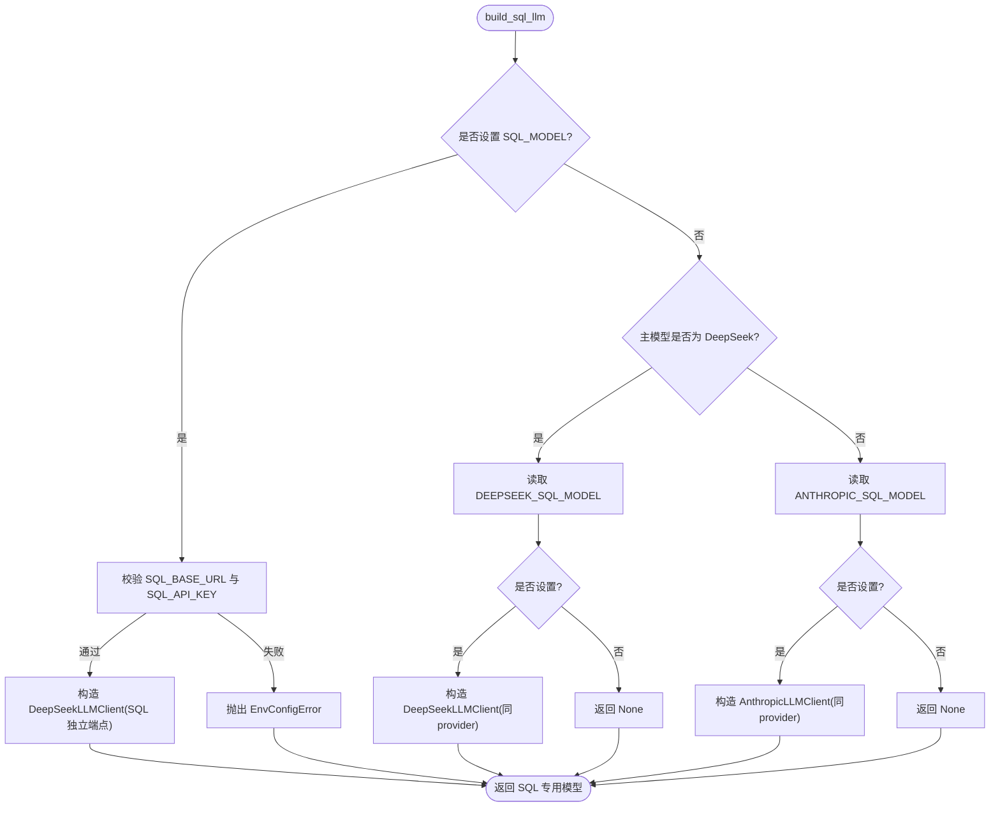
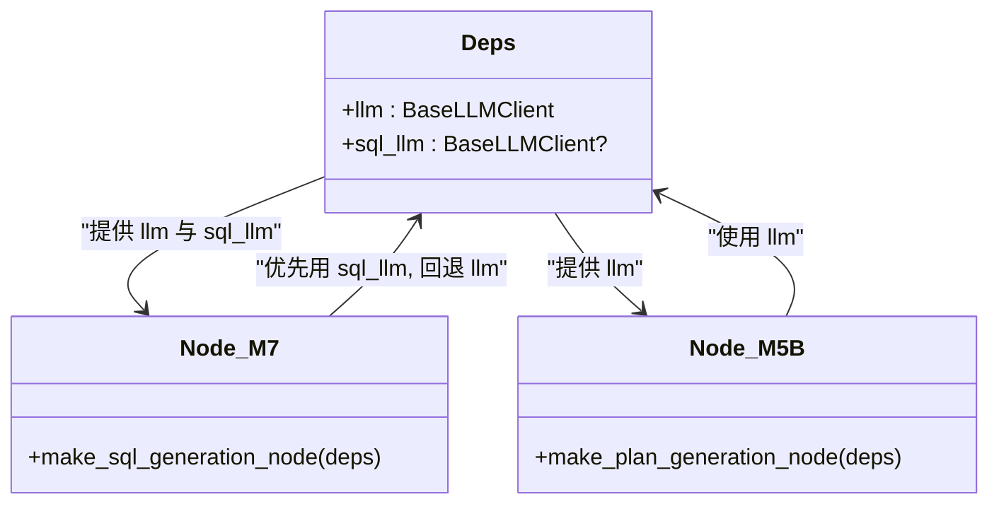
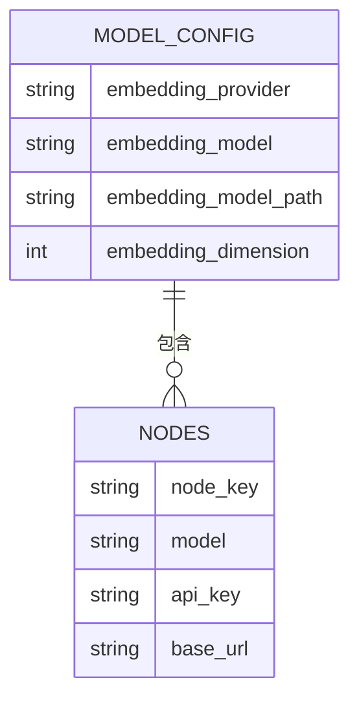
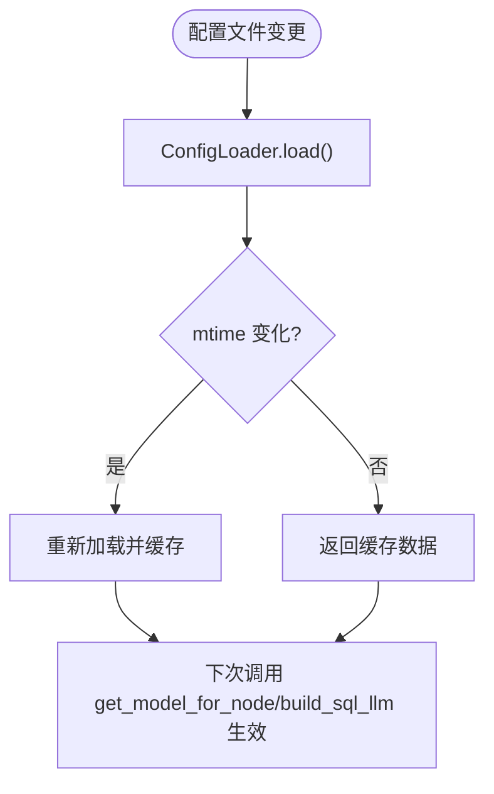
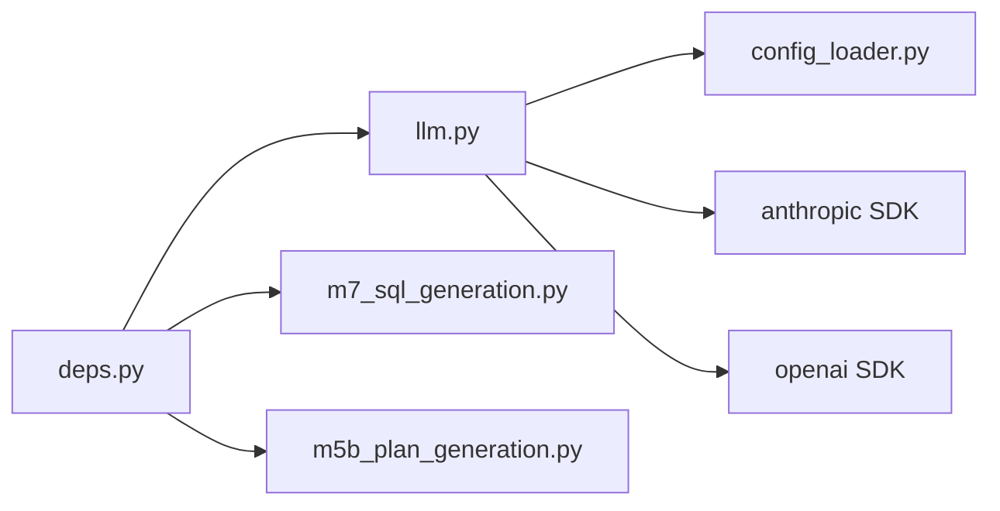

# 模型配置管理

<cite>
**本文引用的文件**   
- [llm.py](file://nl2sql_agent/services/llm.py)
- [model_config.yaml](file://nl2sql_agent/config/model_config.yaml)
- [config_loader.py](file://nl2sql_agent/services/config_loader.py)
- [deps.py](file://nl2sql_agent/services/deps.py)
- [settings.yaml](file://nl2sql_agent/config/settings.yaml)
- [vector_store.yaml](file://nl2sql_agent/config/vector_store.yaml)
- [m7_sql_generation.py](file://nl2sql_agent/nodes/m7_sql_generation.py)
- [m5b_plan_generation.py](file://nl2sql_agent/nodes/m5b_plan_generation.py)
- [test_llm.py](file://nl2sql_agent/tests/test_llm.py)
</cite>

## 目录
1. [简介](#简介)
2. [项目结构](#项目结构)
3. [核心组件](#核心组件)
4. [架构总览](#架构总览)
5. [详细组件分析](#详细组件分析)
6. [依赖关系分析](#依赖关系分析)
7. [性能考虑](#性能考虑)
8. [故障诊断指南](#故障诊断指南)
9. [结论](#结论)
10. [附录](#附录)

## 简介
本文件面向 LLM 模型配置管理系统，系统性说明以下主题：
- build_llm() 与 get_model_for_node() 的选择逻辑与优先级规则
- 环境变量配置体系（LLM_PROVIDER、ANTHROPIC_*、DEEPSEEK_*、SQL_* 等）
- model_config.yaml 的配置结构与节点级覆盖机制
- 主模型与 SQL 专用模型的分离设计与 build_sql_llm() 工作流
- 配置热更新机制与运行时动态切换能力
- 完整配置示例与最佳实践
- 故障诊断工具与方法

## 项目结构
- 服务层
  - nl2sql_agent/services/llm.py：LLM 客户端抽象与 Provider 选择、SQL 专用模型构建
  - nl2sql_agent/services/config_loader.py：YAML 配置加载器（本地缓存 + mtime 热更新）
  - nl2sql_agent/services/deps.py：依赖装配，统一注入 llm 与 sql_llm
- 配置层
  - nl2sql_agent/config/model_config.yaml：嵌入模型与 nodes 节点级模型覆盖
  - nl2sql_agent/config/settings.yaml：运行参数（方言、执行限制、数据库连接等）
  - nl2sql_agent/config/vector_store.yaml：向量存储后端选择
- 节点层
  - nl2sql_agent/nodes/m7_sql_generation.py：SQL 生成节点，优先使用 sql_llm，回退 llm
  - nl2sql_agent/nodes/m5b_plan_generation.py：计划生成节点，使用 llm 的结构化输出
- 测试层
  - nl2sql_agent/tests/test_llm.py：Provider 选择、结构化输出、JSON 提取等用例

**图表来源** 
- [llm.py:245-328](file://nl2sql_agent/services/llm.py#L245-L328)
- [config_loader.py:14-36](file://nl2sql_agent/services/config_loader.py#L14-L36)
- [deps.py:113-184](file://nl2sql_agent/services/deps.py#L113-L184)
- [m7_sql_generation.py:94-113](file://nl2sql_agent/nodes/m7_sql_generation.py#L94-L113)
- [m5b_plan_generation.py:71-90](file://nl2sql_agent/nodes/m5b_plan_generation.py#L71-L90)

**章节来源**
- [llm.py:1-328](file://nl2sql_agent/services/llm.py#L1-L328)
- [config_loader.py:1-36](file://nl2sql_agent/services/config_loader.py#L1-L36)
- [deps.py:1-184](file://nl2sql_agent/services/deps.py#L1-L184)
- [model_config.yaml:1-18](file://nl2sql_agent/config/model_config.yaml#L1-L18)
- [settings.yaml:1-30](file://nl2sql_agent/config/settings.yaml#L1-L30)
- [vector_store.yaml:1-6](file://nl2sql_agent/config/vector_store.yaml#L1-L6)
- [m7_sql_generation.py:1-113](file://nl2sql_agent/nodes/m7_sql_generation.py#L1-L113)
- [m5b_plan_generation.py:1-90](file://nl2sql_agent/nodes/m5b_plan_generation.py#L1-L90)

## 核心组件
- BaseLLMClient：统一抽象接口，提供 complete_json、complete_structured、complete_sql、summarize 等方法
- AnthropicLLMClient：基于 Anthropic Messages API 的实现
- DeepSeekLLMClient：基于 OpenAI 兼容接口的实现（DeepSeek 或任意 OpenAI 兼容端点）
- build_llm()：按环境变量选择主模型 Provider
- build_sql_llm()：可选的 SQL 专用模型，未配置则返回 None（调用方回退到主模型）
- get_model_for_node(node_key)：按 model_config.yaml 的 nodes.<node_key> 选择节点级模型，未配置回退主模型
- ConfigLoader：YAML 配置加载器，支持 mtime 热更新

**章节来源**
- [llm.py:70-160](file://nl2sql_agent/services/llm.py#L70-L160)
- [llm.py:162-243](file://nl2sql_agent/services/llm.py#L162-L243)
- [llm.py:280-328](file://nl2sql_agent/services/llm.py#L280-L328)
- [llm.py:254-273](file://nl2sql_agent/services/llm.py#L254-L273)
- [config_loader.py:14-36](file://nl2sql_agent/services/config_loader.py#L14-L36)

## 架构总览
下图展示主模型与 SQL 专用模型的装配与调用路径，以及节点级模型覆盖流程。

**图表来源** 
- [deps.py:113-184](file://nl2sql_agent/services/deps.py#L113-L184)
- [llm.py:280-328](file://nl2sql_agent/services/llm.py#L280-L328)
- [m7_sql_generation.py:94-113](file://nl2sql_agent/nodes/m7_sql_generation.py#L94-L113)
- [m5b_plan_generation.py:71-90](file://nl2sql_agent/nodes/m5b_plan_generation.py#L71-L90)

## 详细组件分析

### build_llm() 选择逻辑与优先级
- 决策依据
  - 显式设置 LLM_PROVIDER=deepseek → 选择 DeepSeek
  - 未显式设置时，若存在 DEEPSEEK_API_KEY → 选择 DeepSeek
  - 其他情况 → 选择 Anthropic
- 模型名读取
  - DeepSeek：从 DEEPSEEK_MODEL 读取
  - Anthropic：从 ANTHROPIC_MODEL 读取
- 错误处理
  - DeepSeek 缺少 DEEPSEEK_API_KEY 或 DEEPSEEK_MODEL → 抛出 EnvConfigError
  - Anthropic 缺少 ANTHROPIC_MODEL → 抛出 EnvConfigError

**图表来源** 
- [llm.py:275-283](file://nl2sql_agent/services/llm.py#L275-L283)
- [llm.py:215-228](file://nl2sql_agent/services/llm.py#L215-L228)
- [llm.py:169-179](file://nl2sql_agent/services/llm.py#L169-L179)

**章节来源**
- [llm.py:275-283](file://nl2sql_agent/services/llm.py#L275-L283)
- [llm.py:215-228](file://nl2sql_agent/services/llm.py#L215-L228)
- [llm.py:169-179](file://nl2sql_agent/services/llm.py#L169-L179)
- [test_llm.py:19-40](file://nl2sql_agent/tests/test_llm.py#L19-L40)

### get_model_for_node() 节点级模型覆盖
- 数据来源：读取 model_config.yaml 的 nodes.<node_key>
- 覆盖规则
  - 若节点配置了 model → 使用 DeepSeekLLMClient，api_key/base_url 可被节点配置覆盖，否则回退到全局 DEEPSEEK_* 环境变量
  - 若节点未配置 model → 回退到主模型 build_llm()
- 适用场景：离线任务或专用任务可使用更便宜的模型

**图表来源** 
- [llm.py:245-273](file://nl2sql_agent/services/llm.py#L245-L273)
- [model_config.yaml:13-18](file://nl2sql_agent/config/model_config.yaml#L13-L18)

**章节来源**
- [llm.py:245-273](file://nl2sql_agent/services/llm.py#L245-L273)
- [model_config.yaml:13-18](file://nl2sql_agent/config/model_config.yaml#L13-L18)

### build_sql_llm() 工作流与优先级
- 目标：为模块 7（SQL 生成）提供专用模型，未配置则返回 None（调用方回退主模型）
- 优先级
  1) 完全独立的 SQL 模型：需要 SQL_MODEL + SQL_BASE_URL + SQL_API_KEY
     - 使用 DeepSeekLLMClient（OpenAI 兼容端点），便于接入千问/DashScope 等
  2) 同主 provider 的 SQL 模型名：
     - 若主模型为 DeepSeek：读取 DEEPSEEK_SQL_MODEL
     - 若主模型为 Anthropic：读取 ANTHROPIC_SQL_MODEL
- 校验
  - 独立模型模式缺少 SQL_BASE_URL 或 SQL_API_KEY → 抛出 EnvConfigError
  - 同 provider 模式未设置对应 SQL_MODEL → 返回 None

**图表来源** 
- [llm.py:285-328](file://nl2sql_agent/services/llm.py#L285-L328)

**章节来源**
- [llm.py:285-328](file://nl2sql_agent/services/llm.py#L285-L328)

### 主模型与 SQL 专用模型的分离设计
- 主模型（llm）：用于计划生成、结果解释等“思考类”任务，强调推理与结构化输出能力
- SQL 专用模型（sql_llm）：专注 SQL 生成，可指向任意 OpenAI 兼容端点，便于成本优化与能力解耦
- 调用策略
  - 模块 7（SQL 生成）优先使用 deps.sql_llm；未配置则回退 deps.llm
  - 模块 5b（计划生成）始终使用 deps.llm 的结构化输出能力

**图表来源** 
- [deps.py:54-67](file://nl2sql_agent/services/deps.py#L54-L67)
- [m7_sql_generation.py:94-113](file://nl2sql_agent/nodes/m7_sql_generation.py#L94-L113)
- [m5b_plan_generation.py:71-90](file://nl2sql_agent/nodes/m5b_plan_generation.py#L71-L90)

**章节来源**
- [deps.py:54-67](file://nl2sql_agent/services/deps.py#L54-L67)
- [m7_sql_generation.py:94-113](file://nl2sql_agent/nodes/m7_sql_generation.py#L94-L113)
- [m5b_plan_generation.py:71-90](file://nl2sql_agent/nodes/m5b_plan_generation.py#L71-L90)

### 环境变量配置体系与作用关系
- LLM_PROVIDER：显式指定主模型 Provider（deepseek 或 anthropic）
- ANTHROPIC_*：ANTHROPIC_API_KEY、ANTHROPIC_MODEL、ANTHROPIC_SQL_MODEL
- DEEPSEEK_*：DEEPSEEK_API_KEY、DEEPSEEK_MODEL、DEEPSEEK_BASE_URL、DEEPSEEK_SQL_MODEL
- SQL_*：SQL_MODEL、SQL_BASE_URL、SQL_API_KEY（独立 SQL 模型）
- settings.yaml 中的 database_url/pg_database_url/pgvector_url 影响执行器与向量存储后端选择（非 LLM 直接相关，但影响整体运行）

优先级总结
- 主模型：LLM_PROVIDER 显式 > 存在 DEEPSEEK_API_KEY > 默认 Anthropic
- SQL 模型：独立 SQL_* > 同 provider 的 SQL_MODEL > 无则回退主模型
- 节点级模型：model_config.yaml.nodes.<node>.model > 回退主模型

**章节来源**
- [llm.py:275-328](file://nl2sql_agent/services/llm.py#L275-L328)
- [settings.yaml:1-30](file://nl2sql_agent/config/settings.yaml#L1-L30)

### model_config.yaml 配置结构与节点覆盖
- embedding：嵌入模型配置（provider、model、model_path、dimension）
- nodes：节点级模型覆盖，例如 schema_comment_generation 指定 model
- 节点覆盖生效方式：get_model_for_node(node_key) 读取并构造 DeepSeekLLMClient

**图表来源** 
- [model_config.yaml:1-18](file://nl2sql_agent/config/model_config.yaml#L1-L18)
- [llm.py:245-273](file://nl2sql_agent/services/llm.py#L245-L273)

**章节来源**
- [model_config.yaml:1-18](file://nl2sql_agent/config/model_config.yaml#L1-L18)
- [llm.py:245-273](file://nl2sql_agent/services/llm.py#L245-L273)

### 配置热更新机制与运行时动态切换
- ConfigLoader.load(rel_path) 基于文件 mtime 进行缓存与自动重载
- 修改 YAML 后无需重启服务，下一次读取即生效
- 可通过 ConfigLoader.reload() 清空缓存强制刷新
- 对 LLM 的影响
  - nodes 配置热更新：下次 get_model_for_node() 调用将读取新配置
  - 环境变量变更：需在进程内重新调用 build_llm()/build_sql_llm() 以生效

**图表来源** 
- [config_loader.py:14-36](file://nl2sql_agent/services/config_loader.py#L14-L36)
- [llm.py:245-273](file://nl2sql_agent/services/llm.py#L245-L273)

**章节来源**
- [config_loader.py:14-36](file://nl2sql_agent/services/config_loader.py#L14-L36)
- [llm.py:245-273](file://nl2sql_agent/services/llm.py#L245-L273)

## 依赖关系分析
- 组件耦合
  - deps.py 负责装配 llm 与 sql_llm，并注入到各节点
  - llm.py 依赖 config_loader.py 读取 model_config.yaml
  - 节点层通过 deps 访问 llm/sql_llm，避免硬编码 Provider
- 外部依赖
  - anthropic SDK（AnthropicLLMClient）
  - openai SDK（DeepSeekLLMClient 与任意 OpenAI 兼容端点）

**图表来源** 
- [deps.py:113-184](file://nl2sql_agent/services/deps.py#L113-L184)
- [llm.py:1-328](file://nl2sql_agent/services/llm.py#L1-L328)
- [config_loader.py:14-36](file://nl2sql_agent/services/config_loader.py#L14-L36)

**章节来源**
- [deps.py:113-184](file://nl2sql_agent/services/deps.py#L113-L184)
- [llm.py:1-328](file://nl2sql_agent/services/llm.py#L1-L328)
- [config_loader.py:14-36](file://nl2sql_agent/services/config_loader.py#L14-L36)

## 性能考虑
- 结构化输出重试策略
  - complete_json/complete_structured 支持 retries，优先 function calling，失败回退纯文本解析与校验
  - DeepSeek thinking/reasoning 模式不支持 tool_choice，统一走纯文本路径，由 extract_json 容错
- 节点级模型覆盖
  - 为离线/专用任务配置更便宜模型，降低总体成本
- 配置热更新
  - 基于 mtime 的轻量缓存，避免频繁 IO 与重启开销

[本节为通用指导，不直接分析具体文件]

## 故障诊断指南
- 常见错误与定位
  - EnvConfigError：缺少必要环境变量（如 DEEPSEEK_API_KEY、DEEPSEEK_MODEL、ANTHROPIC_MODEL、SQL_BASE_URL、SQL_API_KEY）
  - JSON 解析失败：extract_json 无法找到完整 JSON 对象或检测到“回显 schema 定义”，触发重试
  - 结构化输出校验失败：complete_structured 多次重试仍无法通过 Pydantic 校验
- 排查步骤
  - 检查环境变量是否齐全且正确
  - 确认 LLM_PROVIDER 与实际 Provider 一致
  - 验证 model_config.yaml 的 nodes 配置是否生效
  - 查看日志中结构化输出重试次数与错误信息
- 测试参考
  - test_llm.py 覆盖了 Provider 选择、JSON 提取、结构化输出重试等关键路径

**章节来源**
- [llm.py:27-28](file://nl2sql_agent/services/llm.py#L27-L28)
- [llm.py:37-68](file://nl2sql_agent/services/llm.py#L37-L68)
- [llm.py:110-128](file://nl2sql_agent/services/llm.py#L110-L128)
- [test_llm.py:19-51](file://nl2sql_agent/tests/test_llm.py#L19-L51)
- [test_llm.py:92-151](file://nl2sql_agent/tests/test_llm.py#L92-L151)

## 结论
本系统通过清晰的环境变量与 YAML 配置体系，实现了主模型与 SQL 专用模型的解耦与灵活切换，同时支持节点级模型覆盖与配置热更新。结合健壮的结构化输出与 JSON 提取机制，能够在不同 Provider 与模式下稳定运行。建议在生产环境中：
- 明确设置 LLM_PROVIDER 与对应 Provider 的密钥与模型名
- 为 SQL 生成配置独立模型以降低成本与提升稳定性
- 利用 nodes 覆盖为离线任务选择更经济模型
- 通过 ConfigLoader 的热更新能力实现零停机配置调整

[本节为总结性内容，不直接分析具体文件]

## 附录

### 完整配置示例与最佳实践
- 环境变量
  - 主模型
    - LLM_PROVIDER=deepseek 或 anthropic
    - DEEPSEEK_API_KEY、DEEPSEEK_MODEL、DEEPSEEK_BASE_URL（可选）
    - ANTHROPIC_API_KEY、ANTHROPIC_MODEL
  - SQL 专用模型
    - 独立模式：SQL_MODEL、SQL_BASE_URL、SQL_API_KEY
    - 同 provider 模式：DEEPSEEK_SQL_MODEL 或 ANTHROPIC_SQL_MODEL
- model_config.yaml
  - embedding：选择合适的中文金融领域模型，确保 dimension 与实际模型一致
  - nodes：为 schema_comment_generation 等离线任务配置更便宜模型
- settings.yaml
  - dialect：根据实际数据库类型设置 mysql/postgres
  - execution：合理设置 limit、timeout_seconds、explain_row_threshold
  - row_level_filter：按需启用行级过滤
- vector_store.yaml
  - backend：memory 或 pgvector；pgvector 需配置 PGVECTOR_URL

**章节来源**
- [model_config.yaml:1-18](file://nl2sql_agent/config/model_config.yaml#L1-L18)
- [settings.yaml:1-30](file://nl2sql_agent/config/settings.yaml#L1-L30)
- [vector_store.yaml:1-6](file://nl2sql_agent/config/vector_store.yaml#L1-L6)
- [llm.py:275-328](file://nl2sql_agent/services/llm.py#L275-L328)