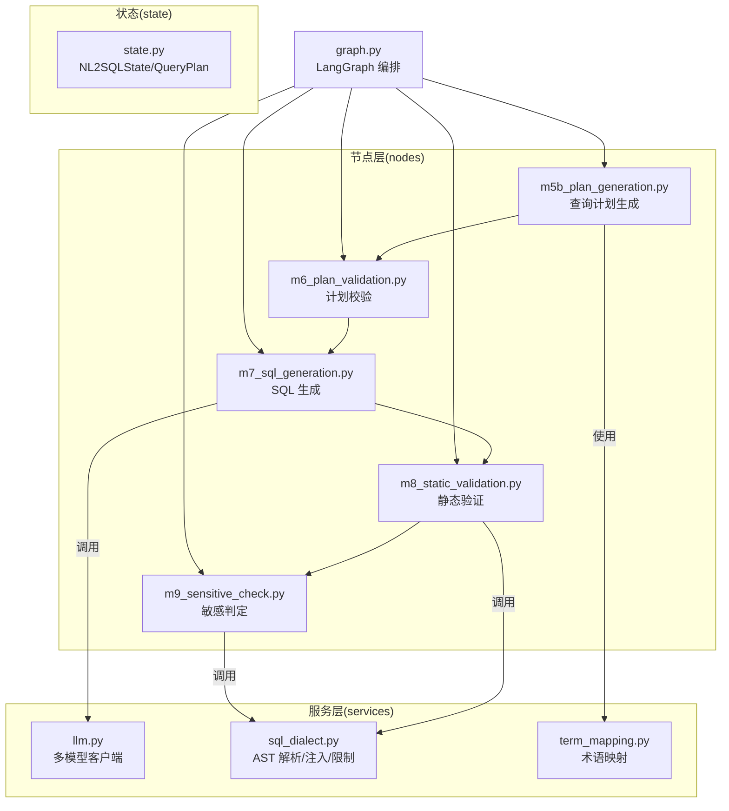
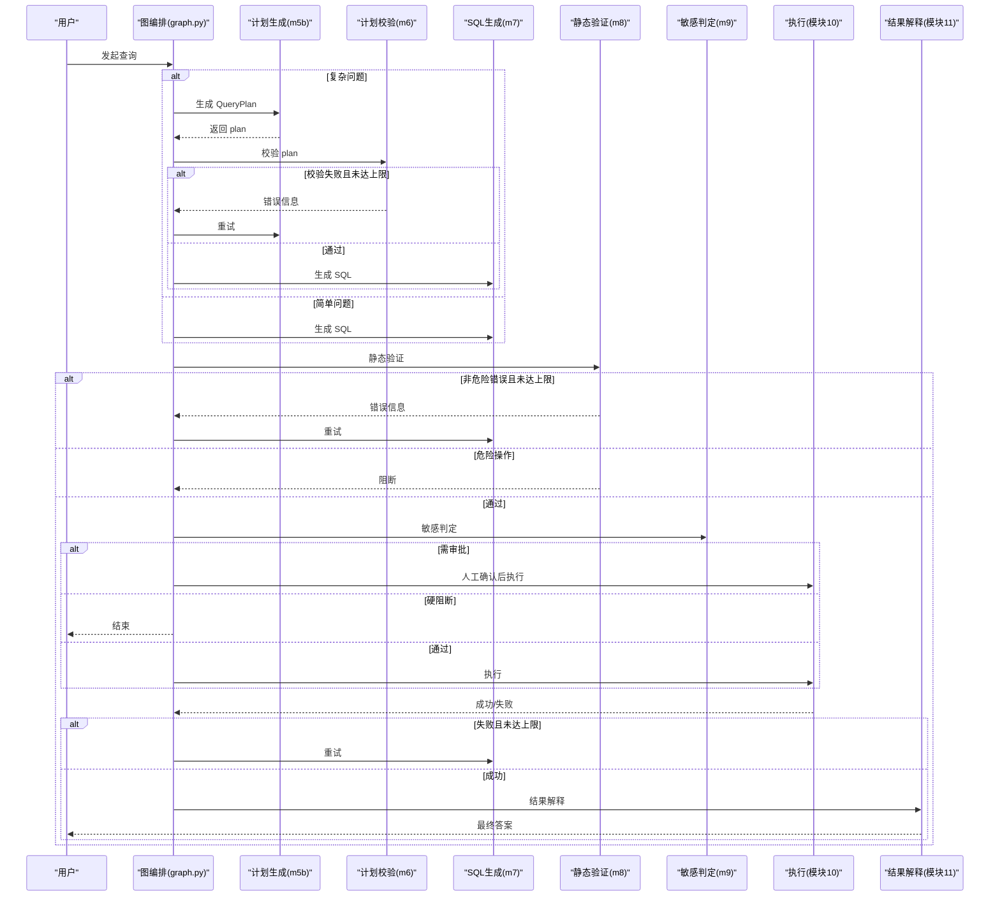
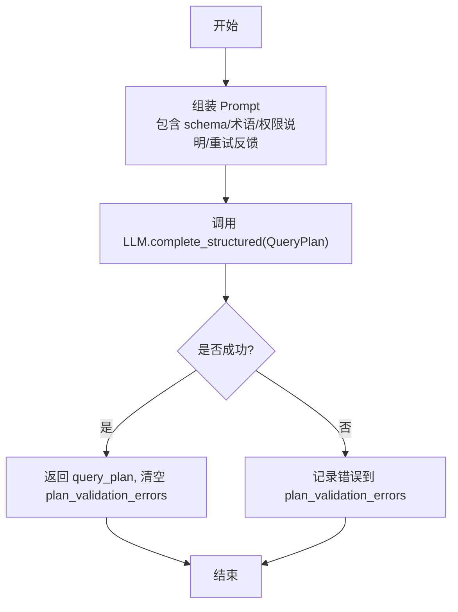
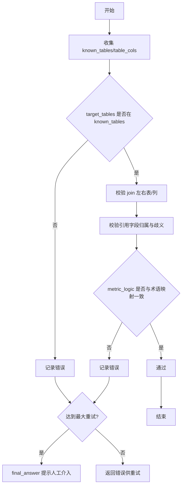
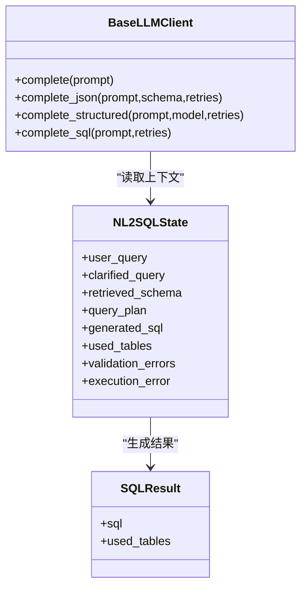
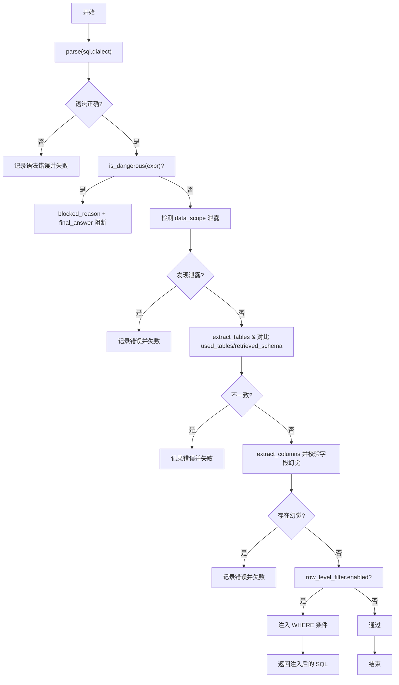
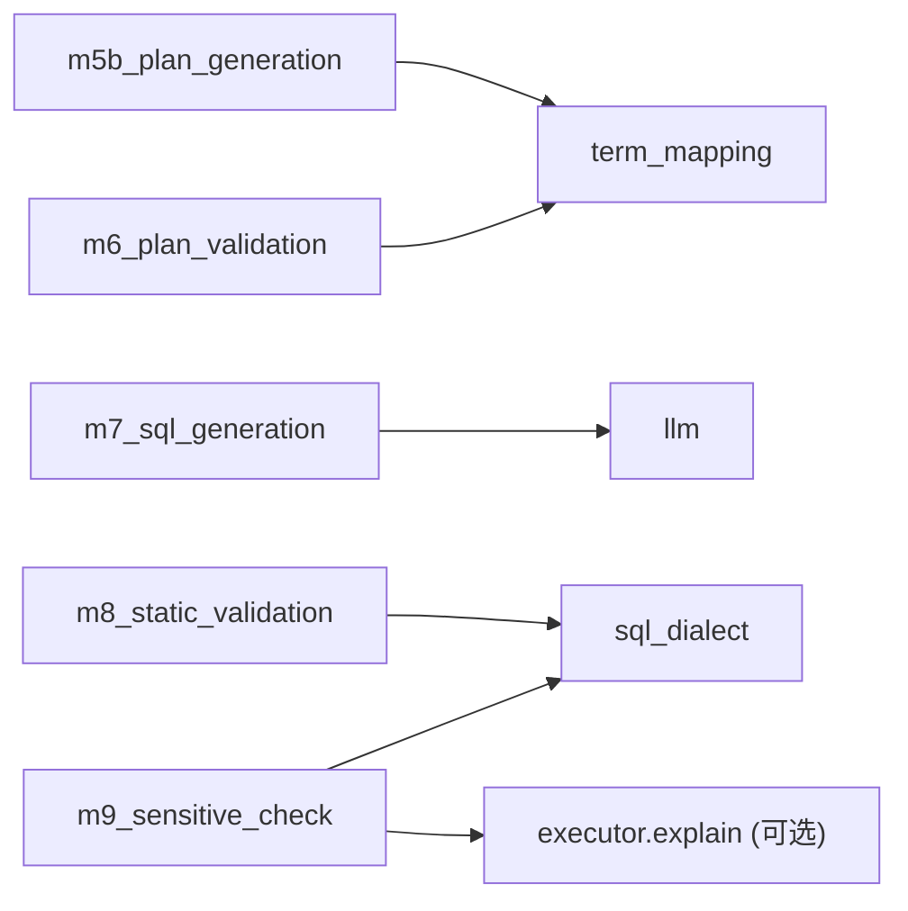

# SQL生成与验证

<cite>
**本文引用的文件**   
- [nl2sql_agent/nodes/m5b_plan_generation.py](file://nl2sql_agent/nodes/m5b_plan_generation.py)
- [nl2sql_agent/nodes/m6_plan_validation.py](file://nl2sql_agent/nodes/m6_plan_validation.py)
- [nl2sql_agent/nodes/m7_sql_generation.py](file://nl2sql_agent/nodes/m7_sql_generation.py)
- [nl2sql_agent/nodes/m8_static_validation.py](file://nl2sql_agent/nodes/m8_static_validation.py)
- [nl2sql_agent/nodes/m9_sensitive_check.py](file://nl2sql_agent/nodes/m9_sensitive_check.py)
- [nl2sql_agent/state.py](file://nl2sql_agent/state.py)
- [nl2sql_agent/services/sql_dialect.py](file://nl2sql_agent/services/sql_dialect.py)
- [nl2sql_agent/services/llm.py](file://nl2sql_agent/services/llm.py)
- [nl2sql_agent/services/term_mapping.py](file://nl2sql_agent/services/term_mapping.py)
- [nl2sql_agent/graph.py](file://nl2sql_agent/graph.py)
- [nl2sql_agent/config/settings.yaml](file://nl2sql_agent/config/settings.yaml)
- [nl2sql_agent/config/sensitive_rules.yaml](file://nl2sql_agent/config/sensitive_rules.yaml)
</cite>

## 目录
1. [简介](#简介)
2. [项目结构](#项目结构)
3. [核心组件](#核心组件)
4. [架构总览](#架构总览)
5. [详细组件分析](#详细组件分析)
6. [依赖关系分析](#依赖关系分析)
7. [性能考量](#性能考量)
8. [故障排查指南](#故障排查指南)
9. [结论](#结论)
10. [附录：配置、参数与返回值](#附录配置参数与返回值)

## 简介
本文件面向“SQL 生成与验证”模块，系统性说明查询计划生成算法、结构化 JSON 计划的强类型设计、SQL 生成的提示工程策略（含多模型支持与质量优化）、静态验证机制（基于 sqlglot 的 AST 解析、语法检查、语义校验与危险关键字检测）、权限过滤条件的自动注入与字段幻觉防护，并给出配置项、参数与返回值的详细说明。文档兼顾初学者理解与高级用户实现细节。

## 项目结构
围绕 SQL 生成与验证的关键代码分布在 nodes 层（节点实现）、services 层（LLM、SQL 方言封装、术语映射）以及 state 层（状态与强类型定义）。graph.py 负责编排 11 个节点的执行流与重试回路。

图表来源
- [nl2sql_agent/graph.py:174-313](file://nl2sql_agent/graph.py#L174-L313)
- [nl2sql_agent/nodes/m5b_plan_generation.py:1-90](file://nl2sql_agent/nodes/m5b_plan_generation.py#L1-L90)
- [nl2sql_agent/nodes/m6_plan_validation.py:1-127](file://nl2sql_agent/nodes/m6_plan_validation.py#L1-L127)
- [nl2sql_agent/nodes/m7_sql_generation.py:1-113](file://nl2sql_agent/nodes/m7_sql_generation.py#L1-L113)
- [nl2sql_agent/nodes/m8_static_validation.py:1-153](file://nl2sql_agent/nodes/m8_static_validation.py#L1-L153)
- [nl2sql_agent/nodes/m9_sensitive_check.py:1-106](file://nl2sql_agent/nodes/m9_sensitive_check.py#L1-L106)
- [nl2sql_agent/services/llm.py:1-328](file://nl2sql_agent/services/llm.py#L1-L328)
- [nl2sql_agent/services/sql_dialect.py:1-111](file://nl2sql_agent/services/sql_dialect.py#L1-L111)
- [nl2sql_agent/services/term_mapping.py:1-144](file://nl2sql_agent/services/term_mapping.py#L1-L144)
- [nl2sql_agent/state.py:1-146](file://nl2sql_agent/state.py#L1-L146)

章节来源
- [nl2sql_agent/graph.py:174-313](file://nl2sql_agent/graph.py#L174-L313)

## 核心组件
- 查询计划生成（m5b_plan_generation.py）：将业务理解与语法生成解耦，强制输出结构化 QueryPlan（Pydantic 强类型），避免自由文本导致的歧义。
- 计划校验（m6_plan_validation.py）：对照检索到的 schema 与术语映射，校验目标表、join、filter、metric_logic 的一致性，防止业务逻辑错误进入 SQL 阶段。
- SQL 生成（m7_sql_generation.py）：根据 QueryPlan 或自然语言 + few-shot 构建 prompt，支持专用 SQL 模型回退主模型，输出 SQL 与 used_tables。
- 静态验证（m8_static_validation.py）：基于 sqlglot AST 进行语法/方言校验、危险操作拦截、字段幻觉防护、系统命名空间泄露检测、行级权限条件注入。
- 敏感判定（m9_sensitive_check.py）：依据规则对敏感字段、扫描行数、金额类字段聚合/导出进行风险决策（pass/approval_required/hard_block）。
- 状态与强类型（state.py）：NL2SQLState 承载全流程状态；QueryPlan/JoinSpec/FilterSpec/MetricSpec 提供严格类型约束。
- LLM 客户端（llm.py）：统一抽象 BaseLLMClient，支持 Anthropic/DeepSeek，complete_structured/complete_json/complete_sql 等能力，支持按节点选择模型。
- SQL 方言封装（sql_dialect.py）：基于 sqlglot 的 parse/to_sql、危险操作检测、AST 抽取、行级权限注入、未聚合 LIMIT 强制。
- 术语映射（term_mapping.py）：按 data_scope 命名空间加载术语，支持别名、复合指标定义一致性校验。

章节来源
- [nl2sql_agent/nodes/m5b_plan_generation.py:1-90](file://nl2sql_agent/nodes/m5b_plan_generation.py#L1-L90)
- [nl2sql_agent/nodes/m6_plan_validation.py:1-127](file://nl2sql_agent/nodes/m6_plan_validation.py#L1-L127)
- [nl2sql_agent/nodes/m7_sql_generation.py:1-113](file://nl2sql_agent/nodes/m7_sql_generation.py#L1-L113)
- [nl2sql_agent/nodes/m8_static_validation.py:1-153](file://nl2sql_agent/nodes/m8_static_validation.py#L1-L153)
- [nl2sql_agent/nodes/m9_sensitive_check.py:1-106](file://nl2sql_agent/nodes/m9_sensitive_check.py#L1-L106)
- [nl2sql_agent/state.py:1-146](file://nl2sql_agent/state.py#L1-L146)
- [nl2sql_agent/services/llm.py:1-328](file://nl2sql_agent/services/llm.py#L1-L328)
- [nl2sql_agent/services/sql_dialect.py:1-111](file://nl2sql_agent/services/sql_dialect.py#L1-L111)
- [nl2sql_agent/services/term_mapping.py:1-144](file://nl2sql_agent/services/term_mapping.py#L1-L144)

## 架构总览
整体流程由 LangGraph 编排，关键路径如下：
- 简单问题：直接到 SQL 生成 → 静态验证 → 敏感判定 → 执行 → 结果解释
- 复杂问题：先计划生成 → 计划校验（不过则回计划生成，最多 max_plan_retries）→ SQL 生成 → 静态验证（不过则回 SQL 生成，最多 max_retries）→ 敏感判定 → 执行 → 结果解释

图表来源
- [nl2sql_agent/graph.py:174-313](file://nl2sql_agent/graph.py#L174-L313)
- [nl2sql_agent/nodes/m5b_plan_generation.py:1-90](file://nl2sql_agent/nodes/m5b_plan_generation.py#L1-L90)
- [nl2sql_agent/nodes/m6_plan_validation.py:1-127](file://nl2sql_agent/nodes/m6_plan_validation.py#L1-L127)
- [nl2sql_agent/nodes/m7_sql_generation.py:1-113](file://nl2sql_agent/nodes/m7_sql_generation.py#L1-L113)
- [nl2sql_agent/nodes/m8_static_validation.py:1-153](file://nl2sql_agent/nodes/m8_static_validation.py#L1-L153)
- [nl2sql_agent/nodes/m9_sensitive_check.py:1-106](file://nl2sql_agent/nodes/m9_sensitive_check.py#L1-L106)

## 详细组件分析

### 查询计划生成（m5b_plan_generation.py）
- 目标：把“业务理解”和“语法生成”解耦，仅做 SELECT 类查询规划，禁止写操作/DDL。
- 输入：用户问题、已检索 schema、术语口径、data_scope（用于权限过滤但不作为字段值）。
- 输出：结构化 QueryPlan（target_tables、join_logic[]、filters[]、metric_logic、group_by[]、confidence）。
- 重试反馈：若上一轮计划校验失败，附带历史计划与错误，要求修正而非原样重试。
- 结构化输出：通过 LLM 的 complete_structured 强制 Pydantic 校验，失败记入 plan_validation_errors。

图表来源
- [nl2sql_agent/nodes/m5b_plan_generation.py:16-89](file://nl2sql_agent/nodes/m5b_plan_generation.py#L16-L89)

章节来源
- [nl2sql_agent/nodes/m5b_plan_generation.py:1-90](file://nl2sql_agent/nodes/m5b_plan_generation.py#L1-L90)

### 计划校验（m6_plan_validation.py）
- 校验要点：
  - target_tables 必须在检索到的 schema 内
  - join 左右表与列必须存在且属于 target_tables
  - 引用字段必须存在于某张检索表，跨表同名字段需显式限定
  - metric_logic 的 definition 必须与术语映射一致（复合指标）
- 失败处理：写入 plan_validation_errors，达到 max_plan_retries 后终止并提示人工介入。

图表来源
- [nl2sql_agent/nodes/m6_plan_validation.py:19-97](file://nl2sql_agent/nodes/m6_plan_validation.py#L19-L97)

章节来源
- [nl2sql_agent/nodes/m6_plan_validation.py:1-127](file://nl2sql_agent/nodes/m6_plan_validation.py#L1-L127)

### SQL 生成（m7_sql_generation.py）
- 双模式：
  - 有 QueryPlan：按计划生成 SQL，强调只使用计划声明的表与字段，同时输出 used_tables。
  - 无 QueryPlan：自然语言 + few-shot 示例，限制只能引用提供的 schema。
- 多模型支持：优先使用 SQL 专用模型（如 DEEPSEEK_SQL_MODEL/ANTHROPIC_SQL_MODEL），未配置则回退主模型。
- 重试反馈：携带上一次 SQL 与失败原因，要求保持语义不变修复错误。

图表来源
- [nl2sql_agent/state.py:83-146](file://nl2sql_agent/state.py#L83-L146)
- [nl2sql_agent/services/llm.py:31-149](file://nl2sql_agent/services/llm.py#L31-L149)

章节来源
- [nl2sql_agent/nodes/m7_sql_generation.py:1-113](file://nl2sql_agent/nodes/m7_sql_generation.py#L1-L113)
- [nl2sql_agent/services/llm.py:285-328](file://nl2sql_agent/services/llm.py#L285-L328)

### 静态验证（m8_static_validation.py）
- 校验步骤：
  1) 语法与方言合法性（sqlglot.parse）
  2) 危险操作检测（AST 顶层类型判断，命中即硬阻断）
  3) 系统命名空间泄露检测（data_scope 值不得出现在 WHERE 字面量中）
  4) 表引用一致性（AST 表 ⊆ used_tables 且 ⊆ retrieved_schema）
  5) 字段幻觉防护（字段必须存在于检索 schema，允许 SELECT 别名在 ORDER BY/GROUP BY 合法引用）
  6) 行级权限注入（从 row_level_filters 注入 IN(values)，不依赖 LLM）
- 失败处理：累积 validation_errors，达到 max_retries 后 final_answer 提示人工介入。

图表来源
- [nl2sql_agent/nodes/m8_static_validation.py:33-150](file://nl2sql_agent/nodes/m8_static_validation.py#L33-L150)
- [nl2sql_agent/services/sql_dialect.py:22-93](file://nl2sql_agent/services/sql_dialect.py#L22-L93)

章节来源
- [nl2sql_agent/nodes/m8_static_validation.py:1-153](file://nl2sql_agent/nodes/m8_static_validation.py#L1-L153)
- [nl2sql_agent/services/sql_dialect.py:1-111](file://nl2sql_agent/services/sql_dialect.py#L1-L111)

### 敏感判定（m9_sensitive_check.py）
- 规则来源：config/sensitive_rules.yaml
- 触发条件：
  - 命中敏感字段列表（字段名或关键词）
  - EXPLAIN 预估行数超过阈值（可配置 action=hard_block 或 approval_required）
  - 金额类字段参与聚合或导出
  - 低置信度查询强制人工确认
- 决策三态：pass / approval_required / hard_block

章节来源
- [nl2sql_agent/nodes/m9_sensitive_check.py:1-106](file://nl2sql_agent/nodes/m9_sensitive_check.py#L1-L106)
- [nl2sql_agent/config/sensitive_rules.yaml:1-24](file://nl2sql_agent/config/sensitive_rules.yaml#L1-L24)

### 状态与强类型（state.py）
- NL2SQLState：贯穿全链路的状态载体，包含用户提问、schema 检索、计划、SQL、校验、敏感、执行、权限等字段。
- QueryPlan/JoinSpec/FilterSpec/MetricSpec：强类型约束，禁止额外字段，规范化 join_type/operator，确保计划不可表达写操作。

章节来源
- [nl2sql_agent/state.py:1-146](file://nl2sql_agent/state.py#L1-L146)

### LLM 客户端（llm.py）
- 抽象接口：BaseLLMClient 提供 complete、_complete_tool、complete_json、complete_structured、complete_sql。
- Provider：AnthropicLLMClient、DeepSeekLLMClient，按环境变量选择。
- 多模型支持：build_llm() 为主模型；build_sql_llm() 为 SQL 专用模型（可选），未配置回退主模型。
- 结构化输出：complete_structured 基于 Pydantic model_json_schema，complete_sql 返回 SQLResult(sql, used_tables)。

章节来源
- [nl2sql_agent/services/llm.py:1-328](file://nl2sql_agent/services/llm.py#L1-L328)

### SQL 方言封装（sql_dialect.py）
- 功能：parse/to_sql、is_dangerous、extract_tables/extract_columns、inject_row_level_filter、has_aggregate_or_limit/enforce_limit。
- 安全：以 AST 结构判定危险操作，避免正则误判；注入行级权限时采用 where(cond, append=...) 保证表达式更新。

章节来源
- [nl2sql_agent/services/sql_dialect.py:1-111](file://nl2sql_agent/services/sql_dialect.py#L1-L111)

### 术语映射（term_mapping.py）
- 行为：按 data_scope 命名空间加载 term_mapping/*.yaml + _global.yaml，支持热更新；resolve 返回 FOUND/AMBIGUOUS/NOT_FOUND；extract_terms 支持别名匹配。

章节来源
- [nl2sql_agent/services/term_mapping.py:1-144](file://nl2sql_agent/services/term_mapping.py#L1-L144)

## 依赖关系分析
- 节点间耦合：
  - m5b_plan_generation → term_mapping（术语口径）
  - m6_plan_validation → term_mapping（复合指标一致性）
  - m7_sql_generation → llm（SQL 生成）
  - m8_static_validation → sql_dialect（AST 校验/注入）
  - m9_sensitive_check → sql_dialect（列引用/聚合检测）+ executor.explain（可选）
- 外部依赖：
  - sqlglot（AST 解析与转换）
  - anthropic/openai（LLM 客户端）
  - langgraph（图编排与检查点序列化）

图表来源
- [nl2sql_agent/nodes/m5b_plan_generation.py:1-90](file://nl2sql_agent/nodes/m5b_plan_generation.py#L1-L90)
- [nl2sql_agent/nodes/m6_plan_validation.py:1-127](file://nl2sql_agent/nodes/m6_plan_validation.py#L1-L127)
- [nl2sql_agent/nodes/m7_sql_generation.py:1-113](file://nl2sql_agent/nodes/m7_sql_generation.py#L1-L113)
- [nl2sql_agent/nodes/m8_static_validation.py:1-153](file://nl2sql_agent/nodes/m8_static_validation.py#L1-L153)
- [nl2sql_agent/nodes/m9_sensitive_check.py:1-106](file://nl2sql_agent/nodes/m9_sensitive_check.py#L1-L106)

章节来源
- [nl2sql_agent/graph.py:174-313](file://nl2sql_agent/graph.py#L174-L313)

## 性能考量
- 计划生成与 SQL 生成均支持 retries，建议合理设置 max_plan_retries 与 max_retries，避免过多重试导致延迟。
- 静态验证使用 AST 解析，开销可控；但频繁 parse/to_sql 可能成为瓶颈，建议在重试前缓存中间结果。
- 敏感判定中的 EXPLAIN 调用依赖执行环境，若无数据库连接会静默跳过，避免阻塞流程。
- 向量检索 Top-K 可通过 settings.schema_search_top_k 调整，影响后续计划与 SQL 生成质量。
- 未聚合查询强制 LIMIT（settings.execution.limit），避免大结果集拖慢响应。

[本节为通用指导，不直接分析具体文件]

## 故障排查指南
- 计划生成失败：
  - 检查 QueryPlan 结构化输出是否被模型回显 schema 定义；查看 complete_structured 的重试日志。
  - 关注 plan_validation_errors 的具体错误，修正后再重试。
- SQL 生成失败：
  - 检查 validation_errors 与 execution_error；确保 used_tables 与实际 SQL 引用一致。
  - 若出现字段幻觉，核对 retrieved_schema 与术语映射是否正确加载。
- 静态验证失败：
  - 语法错误：确认 dialect 配置与 SQL 兼容性。
  - 危险操作：检查 is_dangerous 返回类型，避免 DDL/写操作。
  - 字段幻觉：核对 extract_columns 与 table_cols 的匹配。
  - 权限泄露：检查 data_scope 值是否出现在字面量中。
- 敏感判定阻断：
  - 查看 sensitive_rules 配置，调整 threshold/action 或移除敏感字段命中。
- 执行失败：
  - 检查 database_url 与执行器配置；必要时提高 timeout_seconds 或降低 limit。

章节来源
- [nl2sql_agent/nodes/m8_static_validation.py:22-31](file://nl2sql_agent/nodes/m8_static_validation.py#L22-L31)
- [nl2sql_agent/nodes/m9_sensitive_check.py:19-106](file://nl2sql_agent/nodes/m9_sensitive_check.py#L19-L106)
- [nl2sql_agent/services/llm.py:82-149](file://nl2sql_agent/services/llm.py#L82-L149)

## 结论
该模块通过“计划生成—计划校验—SQL 生成—静态验证—敏感判定—执行—结果解释”的分层流水线，将业务理解与语法生成解耦，并以强类型与 AST 校验保障安全性与正确性。多模型支持与结构化输出提升了稳定性，行级权限注入与字段幻觉防护增强了企业级可用性。配合合理的配置与调优，可在保证安全的前提下提升 NL2SQL 的准确率与鲁棒性。

[本节为总结，不直接分析具体文件]

## 附录：配置、参数与返回值
- settings.yaml
  - dialect: 数据库方言（mysql/postgres/duckdb）
  - schema_search_top_k: 向量检索 Top-K
  - execution.read_only: 事务级只读
  - execution.limit: 未聚合查询强制 LIMIT
  - execution.timeout_seconds: 查询超时
  - execution.explain_row_threshold: EXPLAIN 预估行数阈值
  - row_level_filter.enabled/column: 行级权限开关与列名
- sensitive_rules.yaml
  - sensitive_fields: 敏感字段及关键词
  - explain_scan.threshold/action: 扫描阈值与动作（hard_block/approval_required）
  - amount_field_keywords: 金额类字段关键词
  - aggregation_trigger/export_trigger: 聚合/导出触发开关
- LLM 环境变量
  - LLM_PROVIDER: deepseek/anthropic
  - DEEPSEEK_API_KEY/MODEL/BASE_URL
  - ANTHROPIC_API_KEY/MODEL
  - SQL_MODEL/SQL_API_KEY/SQL_BASE_URL（独立 SQL 模型）
  - DEEPSEEK_SQL_MODEL/ANTHROPIC_SQL_MODEL（同 provider 的 SQL 模型）
- 状态字段（NL2SQLState）
  - user_query/clarified_query：用户问题与澄清后问题
  - retrieved_schema/main_table_count/retrieval_confidence：Schema 检索结果与置信度
  - query_plan/plan_validation_errors/plan_retry_count/max_plan_retries：计划相关
  - generated_sql/used_tables/validation_errors/retry_count/max_retries/blocked_reason：SQL 生成与校验
  - risk_decision/is_sensitive/sensitive_reasons/human_approved：敏感判定与人工确认
  - execution_result/execution_error/final_answer：执行与最终答案
  - user_id/data_scope/row_level_filters：身份与权限
- 返回值定义
  - QueryPlan：target_tables、join_logic[]、filters[]、metric_logic、group_by[]、confidence
  - SQLResult：sql、used_tables[]
  - 节点返回：各节点返回 dict，包含相应错误与状态字段；graph 包装追踪 node_latencies/trace_steps

章节来源
- [nl2sql_agent/config/settings.yaml:1-30](file://nl2sql_agent/config/settings.yaml#L1-L30)
- [nl2sql_agent/config/sensitive_rules.yaml:1-24](file://nl2sql_agent/config/sensitive_rules.yaml#L1-L24)
- [nl2sql_agent/state.py:14-81](file://nl2sql_agent/state.py#L14-L81)
- [nl2sql_agent/state.py:83-146](file://nl2sql_agent/state.py#L83-L146)
- [nl2sql_agent/services/llm.py:31-149](file://nl2sql_agent/services/llm.py#L31-L149)