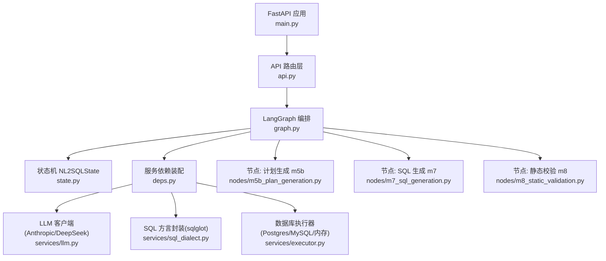
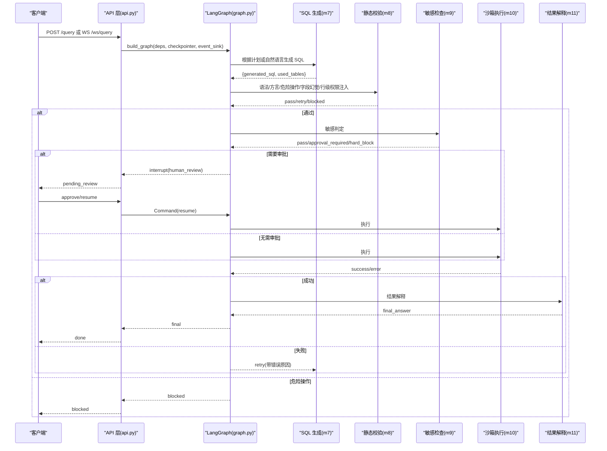
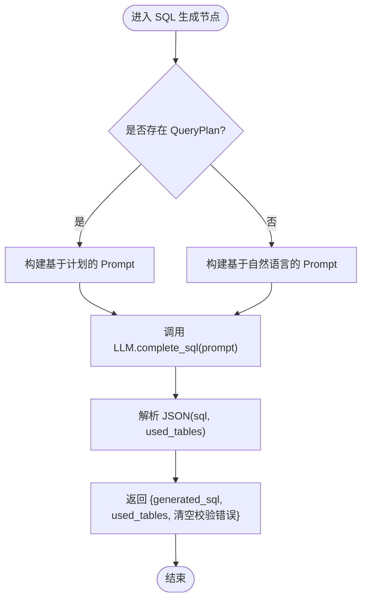
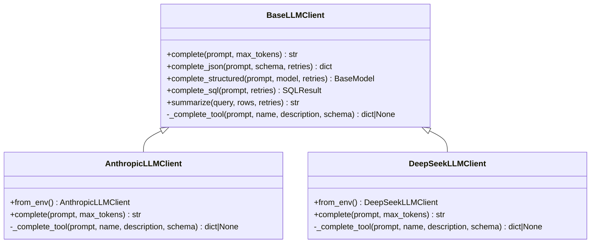
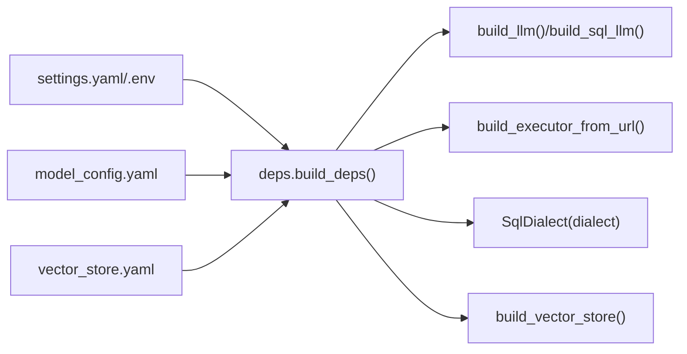

# SQL生成引擎

<cite>
**本文引用的文件**   
- [nl2sql_agent/main.py](file://nl2sql_agent/main.py)
- [nl2sql_agent/api.py](file://nl2sql_agent/api.py)
- [nl2sql_agent/graph.py](file://nl2sql_agent/graph.py)
- [nl2sql_agent/state.py](file://nl2sql_agent/state.py)
- [nl2sql_agent/services/llm.py](file://nl2sql_agent/services/llm.py)
- [nl2sql_agent/services/deps.py](file://nl2sql_agent/services/deps.py)
- [nl2sql_agent/services/sql_dialect.py](file://nl2sql_agent/services/sql_dialect.py)
- [nl2sql_agent/services/executor.py](file://nl2sql_agent/services/executor.py)
- [nl2sql_agent/nodes/m5b_plan_generation.py](file://nl2sql_agent/nodes/m5b_plan_generation.py)
- [nl2sql_agent/nodes/m7_sql_generation.py](file://nl2sql_agent/nodes/m7_sql_generation.py)
- [nl2sql_agent/nodes/m8_static_validation.py](file://nl2sql_agent/nodes/m8_static_validation.py)
- [nl2sql_agent/config/settings.yaml](file://nl2sql_agent/config/settings.yaml)
- [NL2SQL.md](file://NL2SQL.md)
</cite>

## 目录
1. [简介](#简介)
2. [项目结构](#项目结构)
3. [核心组件](#核心组件)
4. [架构总览](#架构总览)
5. [详细组件分析](#详细组件分析)
6. [依赖关系分析](#依赖关系分析)
7. [性能与质量优化](#性能与质量优化)
8. [故障排查指南](#故障排查指南)
9. [结论](#结论)
10. [附录：配置与示例](#附录：配置与示例)

## 简介
本技术文档面向“基于查询计划的 SQL 生成引擎”，系统性阐述如何将结构化 QueryPlan 转换为可执行 SQL，并覆盖多模型（Anthropic Claude、DeepSeek）统一接口与动态切换机制、提示工程策略、SQL 方言适配、以及温度/最大令牌数/重试等生成质量优化。文档同时给出具体模型配置示例与性能调优建议，帮助读者快速理解与落地。

## 项目结构
系统采用 FastAPI + LangGraph 的编排模式，将自然语言到 SQL 的完整流程拆分为多个节点（模块），通过有向图组织控制流，并在关键节点支持人工确认与中断恢复。核心目录说明：
- nl2sql_agent/main.py：HTTP 入口（REST 与 WebSocket）、线程状态查看、审批恢复
- nl2sql_agent/api.py：WebSocket 流式事件桥接、REST API（查询、历史、审计、反馈、配置、审核）
- nl2sql_agent/graph.py：LangGraph 图构建与路由、重试回路、事件追踪
- nl2sql_agent/state.py：全局状态 NL2SQLState、QueryPlan 及子结构定义
- nl2sql_agent/services/*：LLM 抽象与实现、依赖装配、SQL 方言封装、执行器、向量存储、术语映射等
- nl2sql_agent/nodes/*：各模块节点实现（计划生成、SQL 生成、静态校验、敏感检查、执行、结果解释等）
- nl2sql_agent/config/*：运行参数、模型配置、规则与术语映射
- NL2SQL.md：需求与设计要点说明

图表来源
- [nl2sql_agent/main.py:1-152](file://nl2sql_agent/main.py#L1-L152)
- [nl2sql_agent/api.py:1-573](file://nl2sql_agent/api.py#L1-L573)
- [nl2sql_agent/graph.py:1-313](file://nl2sql_agent/graph.py#L1-L313)
- [nl2sql_agent/state.py:1-146](file://nl2sql_agent/state.py#L1-L146)
- [nl2sql_agent/services/deps.py:1-184](file://nl2sql_agent/services/deps.py#L1-L184)
- [nl2sql_agent/services/llm.py:1-328](file://nl2sql_agent/services/llm.py#L1-L328)
- [nl2sql_agent/services/sql_dialect.py:1-111](file://nl2sql_agent/services/sql_dialect.py#L1-L111)
- [nl2sql_agent/services/executor.py:1-205](file://nl2sql_agent/services/executor.py#L1-L205)
- [nl2sql_agent/nodes/m5b_plan_generation.py:1-90](file://nl2sql_agent/nodes/m5b_plan_generation.py#L1-L90)
- [nl2sql_agent/nodes/m7_sql_generation.py:1-113](file://nl2sql_agent/nodes/m7_sql_generation.py#L1-L113)
- [nl2sql_agent/nodes/m8_static_validation.py:1-153](file://nl2sql_agent/nodes/m8_static_validation.py#L1-L153)

章节来源
- [nl2sql_agent/main.py:1-152](file://nl2sql_agent/main.py#L1-L152)
- [nl2sql_agent/api.py:1-573](file://nl2sql_agent/api.py#L1-L573)
- [nl2sql_agent/graph.py:1-313](file://nl2sql_agent/graph.py#L1-L313)
- [NL2SQL.md:1-76](file://NL2SQL.md#L1-L76)

## 核心组件
- 状态机 NL2SQLState：承载用户问题、澄清信息、检索到的 Schema、复杂度判断、查询计划、生成的 SQL、校验错误、风险判定、执行结果、权限信息等。
- 查询计划 QueryPlan：强类型结构，包含目标表、连接逻辑、过滤条件、指标口径、分组维度与置信度；在类型层面禁止表达非 SELECT 操作，从结构上杜绝危险语句。
- LLM 抽象 BaseLLMClient：提供 complete、complete_json、complete_structured、complete_sql、summarize 等方法；子类实现 Anthropic 与 DeepSeek。
- SQL 方言 SqlDialect：基于 sqlglot 的 AST 解析、危险操作检测、字段抽取、行级权限注入、强制 LIMIT。
- 执行器 SQLExecutor：Postgres/MySQL/内存三种实现，均只读事务、超时保护、EXPLAIN 预估行数。
- 依赖装配 Deps：集中加载配置、初始化 LLM、SQL 方言、执行器、向量存储、术语映射、few-shot 存储等。

章节来源
- [nl2sql_agent/state.py:1-146](file://nl2sql_agent/state.py#L1-L146)
- [nl2sql_agent/services/llm.py:1-328](file://nl2sql_agent/services/llm.py#L1-L328)
- [nl2sql_agent/services/sql_dialect.py:1-111](file://nl2sql_agent/services/sql_dialect.py#L1-L111)
- [nl2sql_agent/services/executor.py:1-205](file://nl2sql_agent/services/executor.py#L1-L205)
- [nl2sql_agent/services/deps.py:1-184](file://nl2sql_agent/services/deps.py#L1-L184)

## 架构总览
整体流程由 LangGraph 编排，节点间通过确定性路由与重试回路协作，确保错误就近消化、不污染上游链路。关键路径如下：
- 入口 → 时间范围澄清 → Schema 检索 → 置信度路由 → 复杂度判断
- 简单路径：直接 SQL 生成 → 静态校验 → 敏感检查 → 沙箱执行 → 结果解释
- 复杂路径：计划生成 → 计划校验（失败回退至计划生成，上限 max_plan_retries）→ SQL 生成 → 静态校验 → 敏感检查 → 沙箱执行 → 结果解释
- 执行报错或结果为空：回退至 SQL 生成（上限 max_retries）
- 敏感检查：可能进入人工确认（human_review），通过后继续执行

图表来源
- [nl2sql_agent/api.py:134-157](file://nl2sql_agent/api.py#L134-L157)
- [nl2sql_agent/graph.py:174-313](file://nl2sql_agent/graph.py#L174-L313)
- [nl2sql_agent/nodes/m7_sql_generation.py:94-113](file://nl2sql_agent/nodes/m7_sql_generation.py#L94-L113)
- [nl2sql_agent/nodes/m8_static_validation.py:33-153](file://nl2sql_agent/nodes/m8_static_validation.py#L33-L153)

## 详细组件分析

### 基于 QueryPlan 的 SQL 生成算法
- 输入：NL2SQLState.query_plan（目标表、连接、过滤、指标口径、分组、置信度）与检索到的 Schema 视图
- Prompt 构建：按 plan 生成结构化 prompt，明确仅允许 SELECT、禁止把 data_scope 当作字段值、要求输出 used_tables
- 调用 LLM.complete_sql：优先 function calling，失败回退纯文本解析；返回 SQL 与 used_tables
- 后续校验：静态校验阶段用 AST 比对 SQL 实际引用与 used_tables、retrieved_schema，防止字段幻觉与越权

图表来源
- [nl2sql_agent/nodes/m7_sql_generation.py:31-91](file://nl2sql_agent/nodes/m7_sql_generation.py#L31-L91)
- [nl2sql_agent/nodes/m7_sql_generation.py:94-113](file://nl2sql_agent/nodes/m7_sql_generation.py#L94-L113)
- [nl2sql_agent/services/llm.py:135-149](file://nl2sql_agent/services/llm.py#L135-L149)

章节来源
- [nl2sql_agent/nodes/m7_sql_generation.py:1-113](file://nl2sql_agent/nodes/m7_sql_generation.py#L1-L113)
- [nl2sql_agent/services/llm.py:1-328](file://nl2sql_agent/services/llm.py#L1-L328)

### 多模型支持与统一接口设计
- BaseLLMClient：统一接口 complete、complete_json、complete_structured、complete_sql、summarize
- AnthropicLLMClient：Messages API，支持 tool_use（function calling）
- DeepSeekLLMClient：OpenAI 兼容接口，thinking 模式不支持 tool_choice，走纯文本路径
- 选择策略：build_llm() 按环境变量 LLM_PROVIDER 或 DEEPSEEK_API_KEY 存在性决定 provider；build_sql_llm() 支持独立 SQL 专用模型或同 provider 的不同 model 名
- 节点级模型：get_model_for_node(node_key) 可从 model_config.yaml 指定节点专用模型

图表来源
- [nl2sql_agent/services/llm.py:70-160](file://nl2sql_agent/services/llm.py#L70-L160)
- [nl2sql_agent/services/llm.py:162-243](file://nl2sql_agent/services/llm.py#L162-L243)
- [nl2sql_agent/services/llm.py:254-328](file://nl2sql_agent/services/llm.py#L254-L328)

章节来源
- [nl2sql_agent/services/llm.py:1-328](file://nl2sql_agent/services/llm.py#L1-L328)

### 提示工程策略
- 计划生成 Prompt：强调只做 SELECT 规划、严格使用检索到的表与字段、复合口径必须与术语库一致、输出强类型 QueryPlan
- SQL 生成 Prompt：区分“基于计划”和“基于自然语言”两种路径；明确权限约束（data_scope 不可作为字段值）、要求输出 used_tables；失败时附带上一次错误进行修复
- Few-shot：无计划时引入 few-shot 示例提升翻译准确率
- 结构化输出：complete_json/complete_structured 优先 function calling，失败回退纯文本解析并校验必填字段，避免“回显 schema”的问题

章节来源
- [nl2sql_agent/nodes/m5b_plan_generation.py:16-68](file://nl2sql_agent/nodes/m5b_plan_generation.py#L16-L68)
- [nl2sql_agent/nodes/m7_sql_generation.py:31-91](file://nl2sql_agent/nodes/m7_sql_generation.py#L31-L91)
- [nl2sql_agent/services/llm.py:82-128](file://nl2sql_agent/services/llm.py#L82-L128)

### SQL 方言适配机制
- SqlDialect：基于 sqlglot 的 parse/to_sql，支持 mysql/postgres 等方言
- 危险操作检测：AST 顶层节点类型判定（SELECT/Subquery/Union/Except/Intersect 为安全），否则视为危险
- 字段抽取：extract_columns 用于字段幻觉校验与敏感识别
- 行级权限注入：inject_row_level_filter 在 WHERE 追加 IN(values)，不交给 LLM
- 强制 LIMIT：enforce_limit 对未聚合查询加 LIMIT 保护

章节来源
- [nl2sql_agent/services/sql_dialect.py:1-111](file://nl2sql_agent/services/sql_dialect.py#L1-L111)

### 执行与校验闭环
- 静态校验（m8）：语法+方言合法性、危险操作拦截、used_tables 一致性、字段幻觉、行级权限注入
- 沙箱执行（m10）：Postgres/MySQL 只读事务、超时熔断、EXPLAIN 预估行数过大拒绝；InMemoryExecutor 用于测试
- 重试回路：执行失败或结果为空退回 SQL 生成（max_retries）；计划校验失败退回计划生成（max_plan_retries）

章节来源
- [nl2sql_agent/nodes/m8_static_validation.py:1-153](file://nl2sql_agent/nodes/m8_static_validation.py#L1-L153)
- [nl2sql_agent/services/executor.py:1-205](file://nl2sql_agent/services/executor.py#L1-L205)
- [nl2sql_agent/graph.py:106-170](file://nl2sql_agent/graph.py#L106-L170)

## 依赖关系分析
- 依赖装配（deps.py）：集中读取 settings.yaml/.env，初始化 AppConfig、ConfigLoader、TermMappingService、SchemaCatalog、VectorStore、SQLExecutor、FewShotStore、SqlDialect、LLM
- 向量存储后端：vector_store.yaml 指定 backend=memory/pgvector；pgvector 需 URL；内存后端默认
- 执行器选择：database_url scheme 自动选择 MySQL/Postgres；InMemoryExecutor 用于演示/测试
- LLM 选择：build_llm()/build_sql_llm() 按环境变量与 model_config.yaml 节点配置动态切换

图表来源
- [nl2sql_agent/services/deps.py:113-184](file://nl2sql_agent/services/deps.py#L113-L184)
- [nl2sql_agent/config/settings.yaml:1-30](file://nl2sql_agent/config/settings.yaml#L1-L30)
- [nl2sql_agent/config/model_config.yaml:1-18](file://nl2sql_agent/config/model_config.yaml#L1-L18)

章节来源
- [nl2sql_agent/services/deps.py:1-184](file://nl2sql_agent/services/deps.py#L1-L184)

## 性能与质量优化
- 温度与最大令牌数：BaseLLMClient.complete(max_tokens) 控制输出长度；不同节点可通过 get_model_for_node 选择更便宜/更快的模型以降低延迟与成本
- 重试策略：
  - 计划校验失败：plan_validation 内部循环，上限 max_plan_retries（默认 2）
  - SQL 生成/执行失败：static_validation/sandbox_execution 回退至 SQL 生成，上限 max_retries（默认 3）
- EXPLAIN 预估行数：执行前评估扫描行数，超过 explain_row_threshold 直接拒绝，避免大表全扫
- 只读事务与超时：Postgres statement_timeout、MySQL MAX_EXECUTION_TIME，保障稳定性
- 结果截断：execution_result 最多返回前 20 行，避免前端刷屏
- 语义缓存与反馈闭环：预留扩展点（semantic_cache、feedback_sink），可在下游接入以提升命中率与迭代效率

章节来源
- [nl2sql_agent/graph.py:106-170](file://nl2sql_agent/graph.py#L106-L170)
- [nl2sql_agent/services/executor.py:53-81](file://nl2sql_agent/services/executor.py#L53-L81)
- [nl2sql_agent/services/executor.py:137-159](file://nl2sql_agent/services/executor.py#L137-L159)
- [nl2sql_agent/api.py:68-99](file://nl2sql_agent/api.py#L68-L99)

## 故障排查指南
- SQL 为空：静态校验直接失败，需检查 SQL 生成节点是否被正确触发
- 语法错误：记录 dialect 与错误信息，检查方言配置与模型输出
- 危险操作：blocked_reason 标记，立即终止，不进入重试；检查 Prompt 与模型行为
- 字段幻觉：AST 提取列不在 retrieved_schema 内，需增强 Schema 检索或修正 Prompt
- 命名空间泄露：data_scope 值出现在 Literal 中，需强化 Prompt 约束
- 行级权限缺失：启用 row_level_filter.enabled 但未提供可信值，导致 blocked
- 执行失败：记录 execution_error，检查数据库连接、超时、权限与 SQL 语义
- 结果为空：可能命中业务过滤过严或数据不存在，结合业务口径调整

章节来源
- [nl2sql_agent/nodes/m8_static_validation.py:33-153](file://nl2sql_agent/nodes/m8_static_validation.py#L33-L153)
- [nl2sql_agent/services/executor.py:148-159](file://nl2sql_agent/services/executor.py#L148-L159)

## 结论
该 SQL 生成引擎以“计划先行、校验兜底、执行隔离”为核心思想，通过强类型 QueryPlan 与 AST 校验有效降低字段幻觉与危险操作风险；多模型统一接口与动态切换机制提升了灵活性与可维护性；完善的重试与限流策略保障了稳定性与性能。建议在生产环境结合真实标注集持续优化术语映射与 Prompt，并逐步引入语义缓存与反馈闭环以提升准确率与效率。

## 附录：配置与示例
- 模型与环境变量
  - 主模型：ANTHROPIC_MODEL/ANTHROPIC_API_KEY 或 DEEPSEEK_MODEL/DEEPSEEK_API_KEY/DEEPSEEK_BASE_URL
  - SQL 专用模型：SQL_MODEL + SQL_API_KEY + SQL_BASE_URL，或 DEEPSEEK_SQL_MODEL/ANTHROPIC_SQL_MODEL
  - 节点级模型：model_config.yaml.nodes.<node_key>.model
- 运行参数
  - dialect：mysql/postgres
  - schema_search_top_k：向量兜底 Top-K
  - execution.limit/timeout_seconds/explain_row_threshold：执行保护阈值
  - row_level_filter.enabled/column：行级权限开关与列名
- 向量存储
  - vector_store.yaml.backend=memory/pgvector；pgvector 需 url

章节来源
- [nl2sql_agent/services/llm.py:280-328](file://nl2sql_agent/services/llm.py#L280-L328)
- [nl2sql_agent/config/settings.yaml:1-30](file://nl2sql_agent/config/settings.yaml#L1-L30)
- [nl2sql_agent/config/model_config.yaml:1-18](file://nl2sql_agent/config/model_config.yaml#L1-L18)