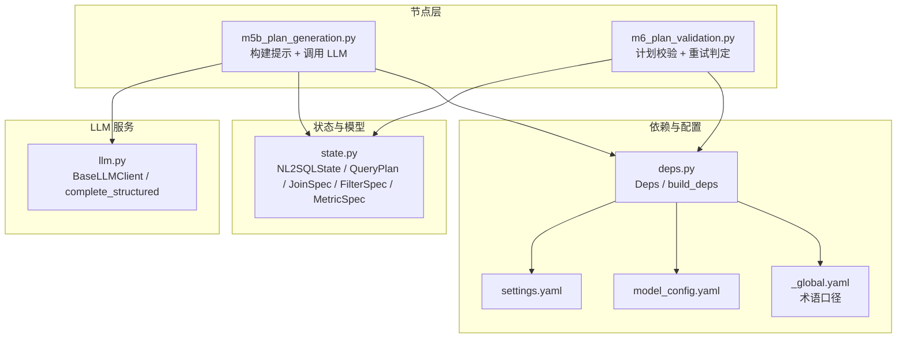
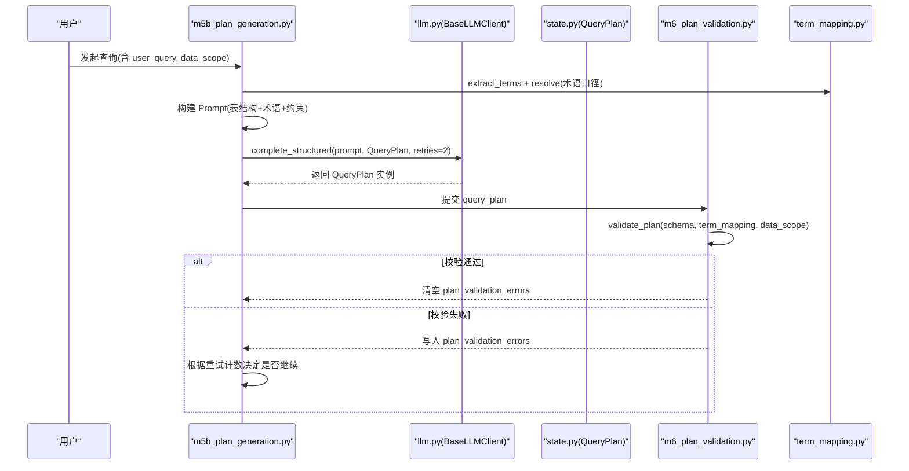
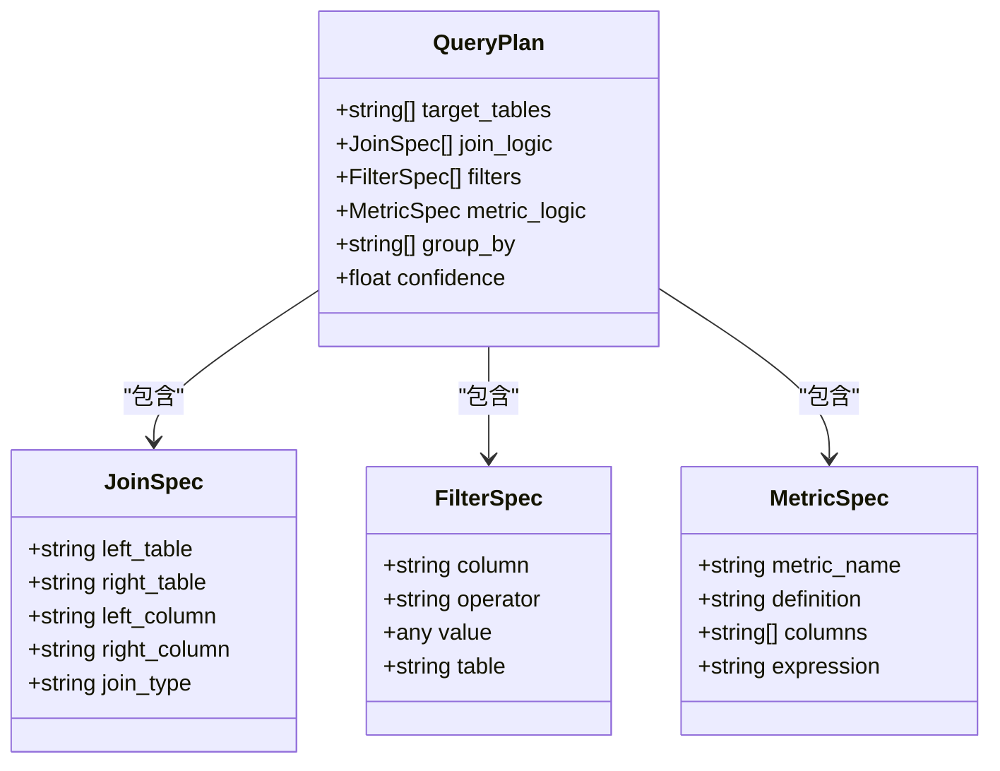
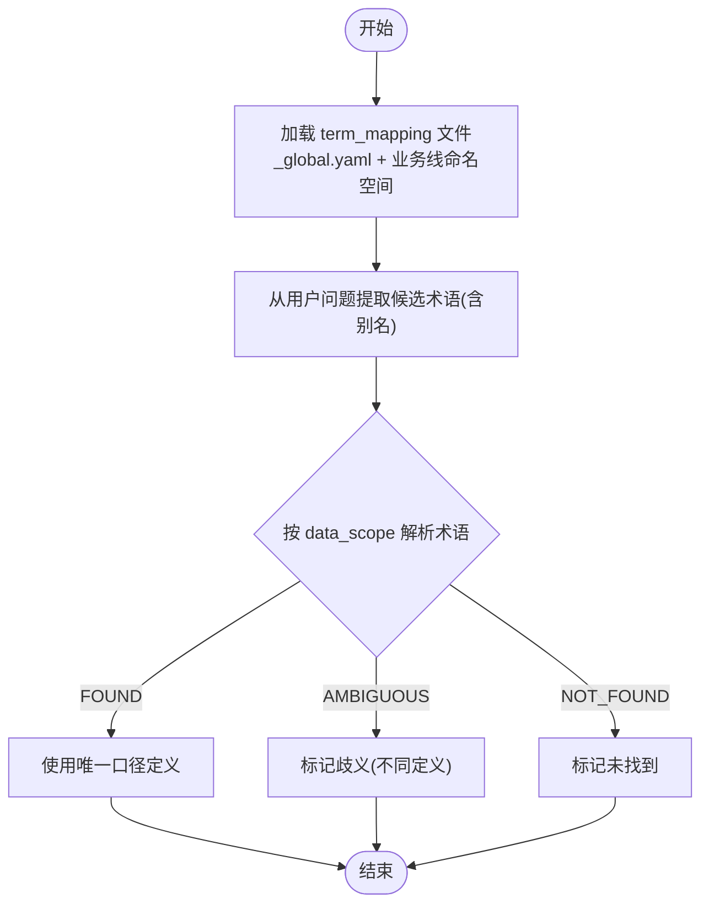
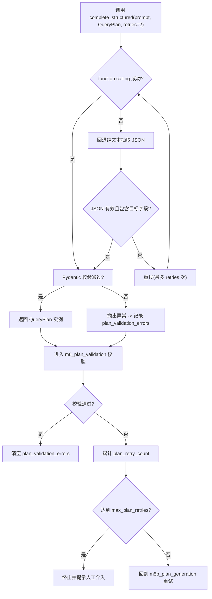
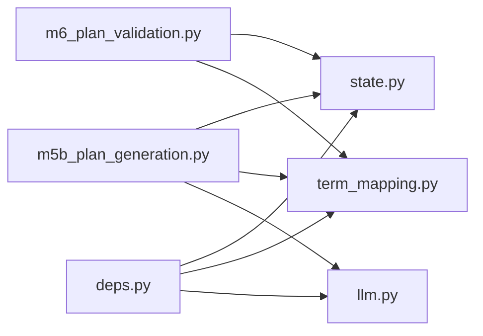

# 查询计划生成

<cite>
**本文引用的文件**   
- [m5b_plan_generation.py](file://nl2sql_agent/nodes/m5b_plan_generation.py)
- [llm.py](file://nl2sql_agent/services/llm.py)
- [state.py](file://nl2sql_agent/state.py)
- [deps.py](file://nl2sql_agent/services/deps.py)
- [term_mapping.py](file://nl2sql_agent/services/term_mapping.py)
- [m6_plan_validation.py](file://nl2sql_agent/nodes/m6_plan_validation.py)
- [settings.yaml](file://nl2sql_agent/config/settings.yaml)
- [model_config.yaml](file://nl2sql_agent/config/model_config.yaml)
- [_global.yaml](file://nl2sql_agent/config/term_mapping/_global.yaml)
- [test_nodes.py](file://nl2sql_agent/tests/test_nodes.py)
</cite>

## 目录
1. [简介](#简介)
2. [项目结构](#项目结构)
3. [核心组件](#核心组件)
4. [架构总览](#架构总览)
5. [详细组件分析](#详细组件分析)
6. [依赖关系分析](#依赖关系分析)
7. [性能考量](#性能考量)
8. [故障排查指南](#故障排查指南)
9. [结论](#结论)
10. [附录：配置与使用示例](#附录配置与使用示例)

## 简介
本文件面向“查询计划生成”能力，系统性阐述如何将“业务理解”与“语法生成”解耦，并通过强类型结构化 JSON（QueryPlan）约束 LLM 输出，确保可校验、可重试、可追溯。文档覆盖字段语义、提示工程策略、术语口径解析机制、错误处理与重试流程、配置项说明以及基于 deps.llm.complete_structured() 的使用方式。

## 项目结构
围绕查询计划生成的关键代码分布在以下模块：
- 节点层：m5b_plan_generation.py（计划生成）、m6_plan_validation.py（计划校验）
- 状态与模型：state.py（NL2SQLState、QueryPlan、JoinSpec、FilterSpec、MetricSpec）
- LLM 调用层：llm.py（BaseLLMClient、complete_json、complete_structured、provider 选择）
- 依赖装配：deps.py（Deps、build_deps、配置加载）
- 术语映射：term_mapping.py（TermMappingService）
- 配置：settings.yaml、model_config.yaml、term_mapping/_global.yaml

图表来源
- [m5b_plan_generation.py:16-68](file://nl2sql_agent/nodes/m5b_plan_generation.py#L16-L68)
- [m6_plan_validation.py:51-97](file://nl2sql_agent/nodes/m6_plan_validation.py#L51-L97)
- [state.py:66-81](file://nl2sql_agent/state.py#L66-L81)
- [llm.py:130-133](file://nl2sql_agent/services/llm.py#L130-L133)
- [deps.py:107-177](file://nl2sql_agent/services/deps.py#L107-L177)
- [settings.yaml:1-30](file://nl2sql_agent/config/settings.yaml#L1-L30)
- [model_config.yaml:1-16](file://nl2sql_agent/config/model_config.yaml#L1-L16)
- [_global.yaml:1-43](file://nl2sql_agent/config/term_mapping/_global.yaml#L1-L43)

章节来源
- [m5b_plan_generation.py:16-68](file://nl2sql_agent/nodes/m5b_plan_generation.py#L16-L68)
- [m6_plan_validation.py:51-97](file://nl2sql_agent/nodes/m6_plan_validation.py#L51-L97)
- [state.py:66-81](file://nl2sql_agent/state.py#L66-L81)
- [llm.py:130-133](file://nl2sql_agent/services/llm.py#L130-L133)
- [deps.py:107-177](file://nl2sql_agent/services/deps.py#L107-L177)
- [settings.yaml:1-30](file://nl2sql_agent/config/settings.yaml#L1-L30)
- [model_config.yaml:1-16](file://nl2sql_agent/config/model_config.yaml#L1-L16)
- [_global.yaml:1-43](file://nl2sql_agent/config/term_mapping/_global.yaml#L1-L43)

## 核心组件
- QueryPlan 强类型模型：通过 Pydantic 定义 target_tables、join_logic、filters、metric_logic、group_by、confidence，禁止额外字段，从类型层面杜绝非 SELECT 操作。
- 子结构：
  - JoinSpec：left_table、right_table、left_column、right_column、join_type（inner/left/right/full/cross），并规范化 join_type。
  - FilterSpec：column、operator（标准比较运算符集合）、value、可选 table；对 operator 进行标准化。
  - MetricSpec：metric_name、definition、columns、expression（可选）。
- NL2SQLState：承载用户问题、检索到的 schema、查询计划、校验错误、重试计数等运行时上下文。
- LLM 客户端：BaseLLMClient 提供 complete_json 与 complete_structured，优先 function calling，失败回退纯文本抽取与校验，支持 retries。
- 术语映射：TermMappingService 按 data_scope 命名空间与全局映射解析术语，支持别名、复合指标与热更新。
- 依赖装配：Deps 聚合配置、LLM、术语映射、SchemaCatalog、向量存储、执行器、SQL 方言等。

章节来源
- [state.py:22-81](file://nl2sql_agent/state.py#L22-L81)
- [state.py:83-146](file://nl2sql_agent/state.py#L83-L146)
- [llm.py:70-133](file://nl2sql_agent/services/llm.py#L70-L133)
- [term_mapping.py:39-98](file://nl2sql_agent/services/term_mapping.py#L39-L98)
- [deps.py:52-70](file://nl2sql_agent/services/deps.py#L52-L70)

## 架构总览
查询计划生成采用“业务理解与语法生成分离”的设计：
- 业务理解：由 m5b_plan_generation.py 构建 prompt，注入检索到的表结构与术语口径，明确只做 SELECT 类规划，限制目标表范围与操作符集合。
- 语法生成：由 LLM 以 structured output 返回符合 QueryPlan schema 的 JSON，再由 Pydantic 强类型校验，确保结构安全。
- 校验与重试：m6_plan_validation.py 对照 retrieved_schema 与 term_mapping 做交叉校验，失败则回填 plan_validation_errors，驱动上游重试或终止。

图表来源
- [m5b_plan_generation.py:16-68](file://nl2sql_agent/nodes/m5b_plan_generation.py#L16-L68)
- [llm.py:130-133](file://nl2sql_agent/services/llm.py#L130-L133)
- [m6_plan_validation.py:51-97](file://nl2sql_agent/nodes/m6_plan_validation.py#L51-L97)
- [term_mapping.py:83-98](file://nl2sql_agent/services/term_mapping.py#L83-L98)

## 详细组件分析

### QueryPlan 强类型设计
- target_tables: 必须为至少一个表的名称列表，且只能来自检索到的 schema。
- join_logic: 连接规范数组，限定 join_type 为 inner/left/right/full/cross，左右列需存在且归属正确。
- filters: 过滤条件数组，operator 限定为标准比较运算符集合，支持 table 前缀消歧。
- metric_logic: 可选的复合指标口径，包含 metric_name、definition、columns，必要时 expression。
- group_by: 分组字段列表。
- confidence: 置信度浮点，取值范围 [0.0, 1.0]。

图表来源
- [state.py:31-63](file://nl2sql_agent/state.py#L31-L63)
- [state.py:66-81](file://nl2sql_agent/state.py#L66-L81)

章节来源
- [state.py:31-81](file://nl2sql_agent/state.py#L31-L81)

### 提示工程策略（Prompt 构建）
- 输入信息：
  - 用户问题 user_query
  - 权限说明：仅允许使用已检索的表结构，禁止将系统命名空间当作字段值生成 WHERE 条件
  - 检索到的表结构：table_name、columns、column_comments
  - 术语口径：extract_terms + resolve 得到的术语定义与是否复合指标
  - 上一轮失败反馈：plan_validation_errors 与上一次计划（用于修正而非原样重试）
- 约束要求：
  - 只做 SELECT 类查询规划，不写 DDL/写操作
  - target_tables 仅限检索到的表
  - 复合口径指标必须与术语口径一致
  - join_type 与 filter operator 限定在合法集合内
  - 输出严格为 QueryPlan 结构的 JSON

章节来源
- [m5b_plan_generation.py:16-68](file://nl2sql_agent/nodes/m5b_plan_generation.py#L16-L68)

### 术语口径解析机制
- 命名空间优先级：先按 data_scope 中的业务线命名空间查找，未命中再查全局 _global.yaml。
- 匹配规则：支持别名映射，最长优先匹配，避免重复命中。
- 结果状态：FOUND（唯一映射）、AMBIGUOUS（多口径不一致）、NOT_FOUND（未找到）。
- 热更新：基于文件 mtime 缓存，修改后自动刷新。

图表来源
- [term_mapping.py:39-98](file://nl2sql_agent/services/term_mapping.py#L39-L98)
- [_global.yaml:1-43](file://nl2sql_agent/config/term_mapping/_global.yaml#L1-L43)

章节来源
- [term_mapping.py:39-98](file://nl2sql_agent/services/term_mapping.py#L39-L98)
- [_global.yaml:1-43](file://nl2sql_agent/config/term_mapping/_global.yaml#L1-L43)

### 结构化输出与重试机制
- complete_structured：
  - 优先 function calling 强制结构化输出，失败回退到纯文本抽取 JSON。
  - 内置 _valid 校验，防止“回显 schema 定义”或缺少目标字段。
  - 支持 retries 参数（默认 2），多次失败抛出异常。
- 计划生成节点：
  - 成功：返回 query_plan 并清空 plan_validation_errors。
  - 失败：捕获异常，记录 plan_validation_errors，交由 m6_plan_validation.py 判定是否重试或终止。
- 计划校验节点：
  - 校验 target_tables、join 引用、字段归属、复合口径一致性。
  - 失败写入 plan_validation_errors，累计 plan_retry_count，超过 max_plan_retries（默认 2）则终止并提示人工介入。

图表来源
- [llm.py:82-133](file://nl2sql_agent/services/llm.py#L82-L133)
- [m5b_plan_generation.py:71-89](file://nl2sql_agent/nodes/m5b_plan_generation.py#L71-L89)
- [m6_plan_validation.py:100-127](file://nl2sql_agent/nodes/m6_plan_validation.py#L100-L127)

章节来源
- [llm.py:82-133](file://nl2sql_agent/services/llm.py#L82-L133)
- [m5b_plan_generation.py:71-89](file://nl2sql_agent/nodes/m5b_plan_generation.py#L71-L89)
- [m6_plan_validation.py:100-127](file://nl2sql_agent/nodes/m6_plan_validation.py#L100-L127)

### 使用示例：deps.llm.complete_structured()
- 典型用法：
  - 构造 prompt（包含表结构、术语口径、约束）
  - 调用 deps.llm.complete_structured(prompt, QueryPlan, retries=2)
  - 获取 QueryPlan 实例，进入校验与后续 SQL 生成阶段
- 测试用例参考：
  - test_nodes.py 中构造 QueryPlan 并验证 validate_plan 的行为，展示字段与约束的正确使用方式。

章节来源
- [m5b_plan_generation.py:71-89](file://nl2sql_agent/nodes/m5b_plan_generation.py#L71-L89)
- [test_nodes.py:176-200](file://nl2sql_agent/tests/test_nodes.py#L176-L200)

## 依赖关系分析
- m5b_plan_generation 依赖：
  - state.QueryPlan、NL2SQLState
  - deps.term_mapping（术语解析）
  - deps.llm（结构化输出）
- m6_plan_validation 依赖：
  - state.QueryPlan、NL2SQLState
  - deps.term_mapping（术语口径一致性校验）
- deps.build_deps 负责装配：
  - AppConfig（settings.yaml）
  - TermMappingService（term_mapping/*.yaml）
  - SchemaCatalog、VectorStore、Executor、SqlDialect
  - LLM 主模型与可选 SQL 专用模型

图表来源
- [m5b_plan_generation.py:16-68](file://nl2sql_agent/nodes/m5b_plan_generation.py#L16-L68)
- [m6_plan_validation.py:51-97](file://nl2sql_agent/nodes/m6_plan_validation.py#L51-L97)
- [deps.py:107-177](file://nl2sql_agent/services/deps.py#L107-L177)

章节来源
- [m5b_plan_generation.py:16-68](file://nl2sql_agent/nodes/m5b_plan_generation.py#L16-L68)
- [m6_plan_validation.py:51-97](file://nl2sql_agent/nodes/m6_plan_validation.py#L51-L97)
- [deps.py:107-177](file://nl2sql_agent/services/deps.py#L107-L177)

## 性能考量
- 结构化输出优先走 function calling，减少纯文本解析开销与失败率。
- 校验前置（m6_plan_validation）避免无效 SQL 生成，降低下游成本。
- 术语映射热更新避免频繁 IO，提升解析效率。
- 重试次数受限（计划生成 retries=2，max_plan_retries=2），控制整体延迟。

[本节为通用指导，无需特定文件引用]

## 故障排查指南
- 结构化输出解析失败：
  - 检查 complete_structured 的 retries 设置与 provider 兼容性（DeepSeek thinking 模式不支持 tool_choice，会回退纯文本路径）。
  - 查看 plan_validation_errors 的具体错误信息，定位字段缺失或类型不符。
- 计划校验失败：
  - target_tables 不在检索 schema 内：确认检索逻辑与权限隔离。
  - join 引用未声明表或字段不存在：检查 join_logic 的表名与列名。
  - 复合口径不一致：核对 metric_logic.definition 与术语映射定义。
- 重试终止：
  - 当 plan_retry_count 达到 max_plan_retries，系统将终止并提示人工介入，需检查用户问题是否存在歧义或口径冲突。

章节来源
- [llm.py:239-242](file://nl2sql_agent/services/llm.py#L239-L242)
- [m6_plan_validation.py:51-97](file://nl2sql_agent/nodes/m6_plan_validation.py#L51-L97)
- [m6_plan_validation.py:100-127](file://nl2sql_agent/nodes/m6_plan_validation.py#L100-L127)

## 结论
通过强类型 QueryPlan、严格的提示工程与术语口径解析，系统在“业务理解”和“语法生成”之间建立了清晰边界，结合前置校验与可控重试，显著提升了查询计划生成的稳定性与可维护性。该设计既保证了安全性（仅 SELECT 操作），又提高了可解释性与可调试性。

[本节为总结性内容，无需特定文件引用]

## 附录：配置与使用示例

### 配置选项与参数说明
- settings.yaml：
  - dialect：SQL 方言（mysql/postgres）
  - schema_search_top_k：Schema 检索 Top-K
  - execution：只读、limit、timeout_seconds、explain_row_threshold
  - row_level_filter：行级过滤开关与列名
- model_config.yaml：
  - embedding.provider 与 model（本地/测试）
  - nodes.<node_key>.model：各节点专用模型
- .env：
  - LLM_PROVIDER、DEEPSEEK_API_KEY、DEEPSEEK_MODEL、ANTHROPIC_API_KEY、ANTHROPIC_MODEL 等环境变量
- term_mapping/_global.yaml：
  - 术语定义、别名、是否复合指标、resolved_fields

章节来源
- [settings.yaml:1-30](file://nl2sql_agent/config/settings.yaml#L1-L30)
- [model_config.yaml:1-16](file://nl2sql_agent/config/model_config.yaml#L1-L16)
- [_global.yaml:1-43](file://nl2sql_agent/config/term_mapping/_global.yaml#L1-L43)

### 返回值定义
- QueryPlan：
  - target_tables: list[str]
  - join_logic: list[JoinSpec]
  - filters: list[FilterSpec]
  - metric_logic: Optional[MetricSpec]
  - group_by: list[str]
  - confidence: float
- NL2SQLState（相关字段）：
  - query_plan: Optional[QueryPlan]
  - plan_validation_errors: list[str]
  - plan_retry_count: int
  - max_plan_retries: int

章节来源
- [state.py:66-81](file://nl2sql_agent/state.py#L66-L81)
- [state.py:108-113](file://nl2sql_agent/state.py#L108-L113)

### 使用步骤（基于 deps.llm.complete_structured）
- 准备 Deps：通过 build_deps() 装配配置、LLM、术语映射等。
- 构建 Prompt：注入检索到的表结构与术语口径，强调只做 SELECT 规划与字段约束。
- 调用 LLM：deps.llm.complete_structured(prompt, QueryPlan, retries=2)。
- 校验与重试：m6_plan_validation 校验，失败回填 plan_validation_errors，驱动重试或终止。
- 后续流程：进入 SQL 生成与执行阶段。

章节来源
- [deps.py:107-177](file://nl2sql_agent/services/deps.py#L107-L177)
- [m5b_plan_generation.py:71-89](file://nl2sql_agent/nodes/m5b_plan_generation.py#L71-L89)
- [m6_plan_validation.py:100-127](file://nl2sql_agent/nodes/m6_plan_validation.py#L100-L127)