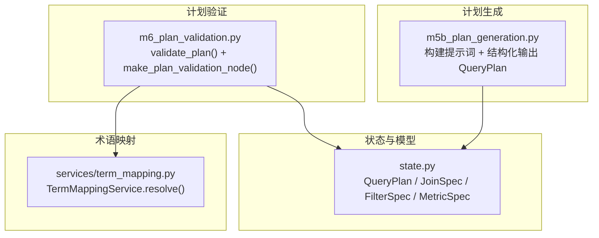
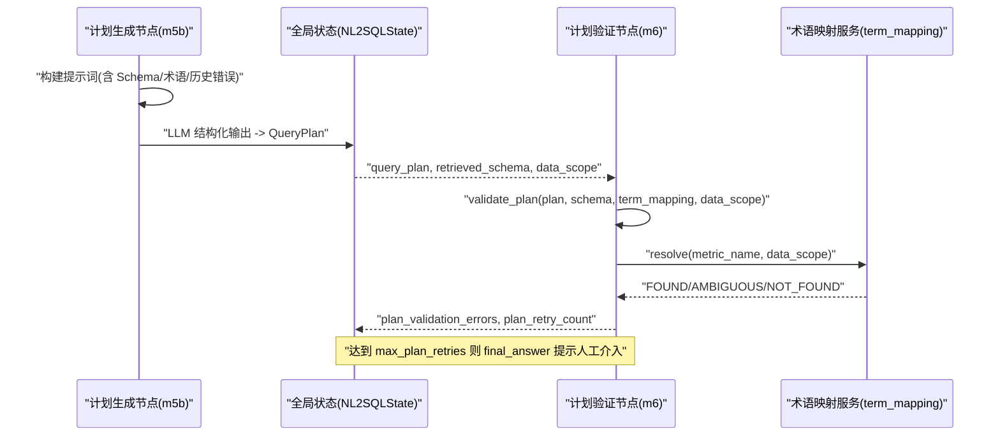
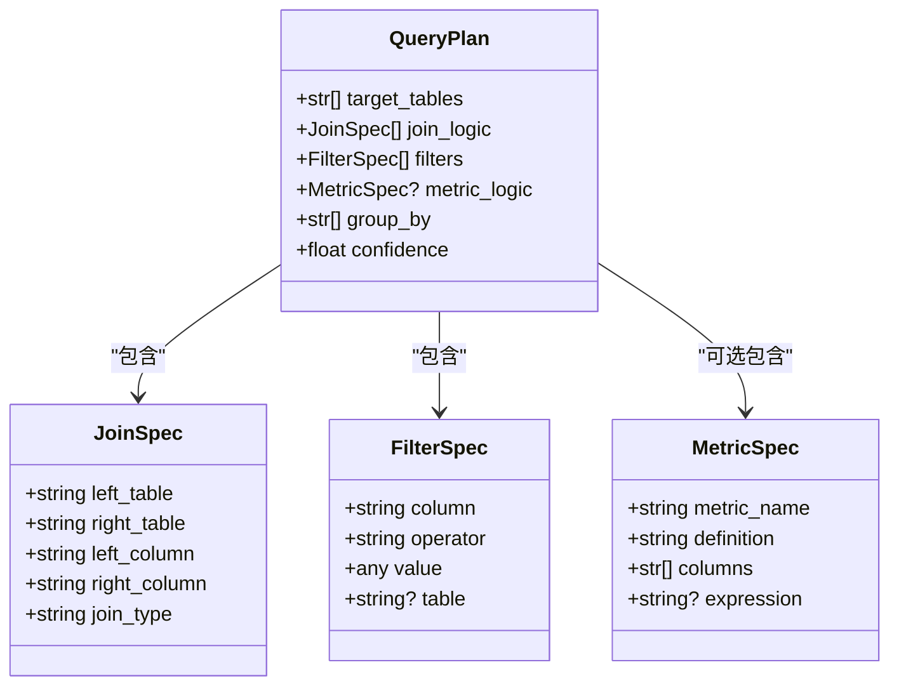
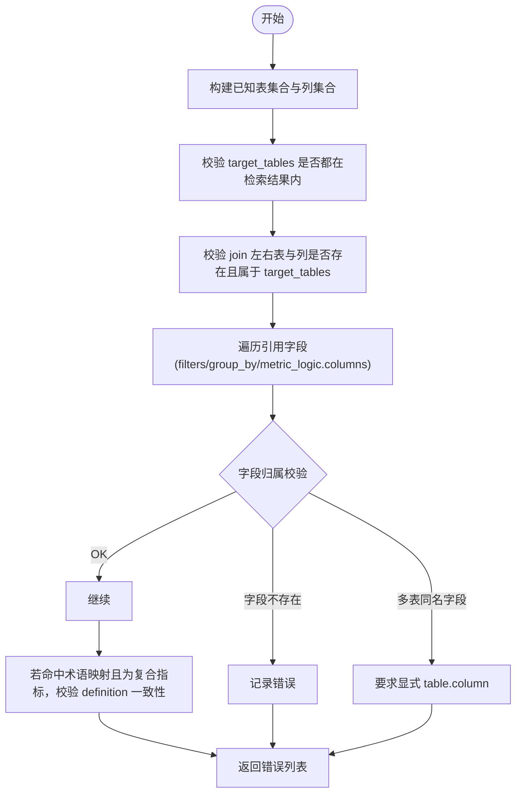
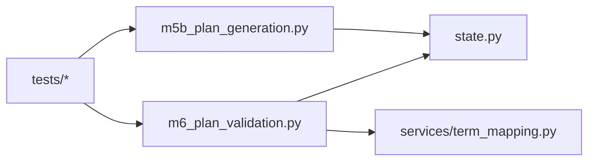

# 查询计划验证

<cite>
**本文引用的文件**   
- [nl2sql_agent/nodes/m6_plan_validation.py](file://nl2sql_agent/nodes/m6_plan_validation.py)
- [nl2sql_agent/state.py](file://nl2sql_agent/state.py)
- [nl2sql_agent/services/term_mapping.py](file://nl2sql_agent/services/term_mapping.py)
- [nl2sql_agent/nodes/m5b_plan_generation.py](file://nl2sql_agent/nodes/m5b_plan_generation.py)
- [nl2sql_agent/tests/test_architecture_hardening.py](file://nl2sql_agent/tests/test_architecture_hardening.py)
- [nl2sql_agent/tests/test_routing.py](file://nl2sql_agent/tests/test_routing.py)
- [nl2sql_agent/tests/test_nodes.py](file://nl2sql_agent/tests/test_nodes.py)
</cite>

## 目录
1. [简介](#简介)
2. [项目结构](#项目结构)
3. [核心组件](#核心组件)
4. [架构总览](#架构总览)
5. [详细组件分析](#详细组件分析)
6. [依赖关系分析](#依赖关系分析)
7. [性能考量](#性能考量)
8. [故障排查指南](#故障排查指南)
9. [结论](#结论)
10. [附录](#附录)

## 简介
本文件面向“查询计划验证”能力，系统性说明基于 Pydantic 的严格类型与约束校验、业务规则校验（如 target_tables 必须在检索结果中、join_type 限定标准连接类型、filter operator 仅允许标准比较运算符等）、置信度评估与 plan_validation_errors 维护机制。同时给出扩展自定义规则的方法与性能优化建议，并列举常见失败场景及修复指导。

## 项目结构
与查询计划验证直接相关的代码集中在以下位置：
- 状态与模型定义：state.py
- 计划生成节点：m5b_plan_generation.py
- 计划验证节点：m6_plan_validation.py
- 术语映射服务：services/term_mapping.py
- 相关测试用例：tests/*

图表来源
- [nl2sql_agent/state.py:66-80](file://nl2sql_agent/state.py#L66-L80)
- [nl2sql_agent/nodes/m5b_plan_generation.py:71-89](file://nl2sql_agent/nodes/m5b_plan_generation.py#L71-L89)
- [nl2sql_agent/nodes/m6_plan_validation.py:51-97](file://nl2sql_agent/nodes/m6_plan_validation.py#L51-L97)
- [nl2sql_agent/services/term_mapping.py:83-98](file://nl2sql_agent/services/term_mapping.py#L83-L98)

章节来源
- [nl2sql_agent/state.py:1-146](file://nl2sql_agent/state.py#L1-L146)
- [nl2sql_agent/nodes/m5b_plan_generation.py:1-89](file://nl2sql_agent/nodes/m5b_plan_generation.py#L1-L89)
- [nl2sql_agent/nodes/m6_plan_validation.py:1-127](file://nl2sql_agent/nodes/m6_plan_validation.py#L1-L127)
- [nl2sql_agent/services/term_mapping.py:1-107](file://nl2sql_agent/services/term_mapping.py#L1-L107)

## 核心组件
- QueryPlan 及其子结构（JoinSpec、FilterSpec、MetricSpec）通过 Pydantic 提供强类型与约束校验，确保计划结构合法。
- validate_plan() 负责业务规则校验：目标表存在性、字段归属、连接合法性、指标口径一致性等。
- make_plan_validation_node() 将校验错误写入 plan_validation_errors，控制重试与人工介入。
- TermMappingService.resolve() 用于复合指标口径一致性校验。

章节来源
- [nl2sql_agent/state.py:31-80](file://nl2sql_agent/state.py#L31-L80)
- [nl2sql_agent/nodes/m6_plan_validation.py:51-97](file://nl2sql_agent/nodes/m6_plan_validation.py#L51-L97)
- [nl2sql_agent/services/term_mapping.py:83-98](file://nl2sql_agent/services/term_mapping.py#L83-L98)

## 架构总览
下图展示了从计划生成到计划验证的关键调用链与数据流。

图表来源
- [nl2sql_agent/nodes/m5b_plan_generation.py:71-89](file://nl2sql_agent/nodes/m5b_plan_generation.py#L71-L89)
- [nl2sql_agent/nodes/m6_plan_validation.py:100-126](file://nl2sql_agent/nodes/m6_plan_validation.py#L100-L126)
- [nl2sql_agent/services/term_mapping.py:83-98](file://nl2sql_agent/services/term_mapping.py#L83-L98)

## 详细组件分析

### Pydantic 模型与严格类型验证
- QueryPlan
  - target_tables: 非空列表，至少包含一个表名
  - join_logic: JoinSpec 列表
  - filters: FilterSpec 列表
  - metric_logic: 可选 MetricSpec
  - group_by: 字符串列表
  - confidence: 浮点，范围 [0.0, 1.0]
- JoinSpec
  - left_table/right_table/left_column/right_column: 必填字符串
  - join_type: 字面量枚举，标准化为 inner/left/right/full/cross
- FilterSpec
  - column/operator/value/table: 字段与操作符；operator 限制为标准比较/集合/模糊/空值判断
  - operator 在解析前进行规范化（去多余空格、小写化）
- MetricSpec
  - metric_name/definition/columns/expression: 指标口径描述

这些约束由 Pydantic 在构造时强制检查，任何非法类型或越界值都会抛出 ValidationError。

章节来源
- [nl2sql_agent/state.py:31-80](file://nl2sql_agent/state.py#L31-L80)

### 业务规则验证逻辑（validate_plan）
validate_plan() 执行以下关键校验：
1) 目标表存在性
- 所有 plan.target_tables 必须出现在 retrieved_schema 的表集合中
2) 连接合法性
- join 左右表必须在 known_tables 内且属于 target_tables
- join 左右列必须分别存在于对应表的列集合
3) 引用字段归属
- filters.group_by.metric_logic.columns 中的字段必须属于目标表
- 若字段在多张目标表中同名，必须显式使用 table.column 形式限定
4) 指标口径一致性
- 若 metric_logic 命中术语映射且为复合指标，其 definition 必须与映射一致

错误收集策略：
- 每次发现违规即追加一条人类可读的错误信息到 errors 列表
- 最终返回 errors，供上层写入 state.plan_validation_errors

章节来源
- [nl2sql_agent/nodes/m6_plan_validation.py:51-97](file://nl2sql_agent/nodes/m6_plan_validation.py#L51-L97)

### 置信度评估与 confidence 字段
- confidence 是 QueryPlan 的一个数值字段，取值范围受 Pydantic 约束为 [0.0, 1.0]
- 当前实现未内置自动计算算法；confidence 通常由上游计划生成阶段根据计划质量主观赋值
- 低置信度流程会触发澄清与强制走计划路径，并在敏感判定后进入人工确认环节
- 注意：confidence 主要用于展示与路由决策参考，不直接参与 validate_plan() 的业务规则校验

章节来源
- [nl2sql_agent/state.py:66-80](file://nl2sql_agent/state.py#L66-L80)
- [nl2sql_agent/tests/test_routing.py:92-121](file://nl2sql_agent/tests/test_routing.py#L92-L121)

### plan_validation_errors 维护机制
- 当计划生成失败（结构化解析异常）时，m5b_plan_generation.py 捕获异常并写入 plan_validation_errors
- m6_plan_validation.py 的 make_plan_validation_node() 对 query_plan 是否为 None 做兜底处理，补充“计划未生成,重新生成”错误
- 每次验证后更新 plan_retry_count；若 errors 非空且达到 max_plan_retries，则设置 final_answer 提示人工介入
- 成功生成新计划时会清空 plan_validation_errors，避免历史错误污染下一轮

章节来源
- [nl2sql_agent/nodes/m5b_plan_generation.py:71-89](file://nl2sql_agent/nodes/m5b_plan_generation.py#L71-L89)
- [nl2sql_agent/nodes/m6_plan_validation.py:100-126](file://nl2sql_agent/nodes/m6_plan_validation.py#L100-L126)

### 术语映射与复合指标校验
- TermMappingService.resolve(term, data_scope) 按业务线命名空间优先查找，再回退到全局映射
- 返回状态包括 FOUND/AMBIGUOUS/NOT_FOUND
- 当 metric_logic 命中 FOUND 且 composite_metric 为真时，validate_plan() 要求 definition 与映射一致，否则报错

章节来源
- [nl2sql_agent/services/term_mapping.py:83-98](file://nl2sql_agent/services/term_mapping.py#L83-L98)
- [nl2sql_agent/nodes/m6_plan_validation.py:85-96](file://nl2sql_agent/nodes/m6_plan_validation.py#L85-L96)

### 类图（Pydantic 模型关系）

图表来源
- [nl2sql_agent/state.py:31-80](file://nl2sql_agent/state.py#L31-L80)

### 流程图（validate_plan 主流程）

图表来源
- [nl2sql_agent/nodes/m6_plan_validation.py:51-97](file://nl2sql_agent/nodes/m6_plan_validation.py#L51-L97)

## 依赖关系分析
- m6_plan_validation.py 依赖 state.py 的 QueryPlan/NL2SQLState 以及 services/term_mapping.py 的术语解析
- m5b_plan_generation.py 依赖 state.py 的 QueryPlan，并通过 deps.llm.complete_structured 生成计划
- 测试用例覆盖未知操作符拒绝、join 字段归属校验、低置信度路由、计划重试边界等

图表来源
- [nl2sql_agent/nodes/m6_plan_validation.py:1-127](file://nl2sql_agent/nodes/m6_plan_validation.py#L1-L127)
- [nl2sql_agent/nodes/m5b_plan_generation.py:1-89](file://nl2sql_agent/nodes/m5b_plan_generation.py#L1-L89)
- [nl2sql_agent/state.py:1-146](file://nl2sql_agent/state.py#L1-L146)
- [nl2sql_agent/services/term_mapping.py:1-107](file://nl2sql_agent/services/term_mapping.py#L1-L107)

章节来源
- [nl2sql_agent/tests/test_architecture_hardening.py:116-139](file://nl2sql_agent/tests/test_architecture_hardening.py#L116-L139)
- [nl2sql_agent/tests/test_routing.py:165-189](file://nl2sql_agent/tests/test_routing.py#L165-L189)

## 性能考量
- 字段归属校验采用 O(n) 遍历引用字段，配合哈希集合（表名→列集合）实现 O(1) 成员检查，整体复杂度线性于引用字段数量
- 术语映射 resolve() 按 data_scope 顺序查找，命中即止；支持热更新但仅在必要时刷新
- 建议在大规模 schema 下预构建表列索引（已在 validate_plan 中完成），避免重复计算
- 谨慎增加额外校验步骤，以免显著拉长计划验证耗时

[本节为通用性能建议，不直接分析具体文件]

## 故障排查指南
常见失败场景与修复建议：
- target_tables 不在检索结果内
  - 现象：errors 包含“target_tables 中的表 X 不在检索到的 schema 内”
  - 修复：修正 target_tables 为实际检索到的表名
- join 引用了未检索或未声明的表
  - 现象：errors 包含“join 引用了未检索到的表 X”或“join 引用了 target_tables 未声明的表 X”
  - 修复：确保 join 左右表均在 known_tables 且属于 target_tables
- join 左右列不存在
  - 现象：errors 包含“join 左/右表 X 不存在字段 Y”
  - 修复：修正列名为实际存在的列
- 字段未限定表名导致歧义
  - 现象：errors 包含“字段 X 同时存在于多张目标表...必须限定表名”
  - 修复：使用 table.column 明确限定
- 字段不存在
  - 现象：errors 包含“引用了不存在的字段 X”
  - 修复：修正字段名或将其纳入目标表
- 指标 definition 与术语映射不一致
  - 现象：errors 包含“指标 X 的 definition 与术语映射不一致...”
  - 修复：使 metric_logic.definition 与术语映射保持一致
- 计划生成失败（结构化输出解析异常）
  - 现象：plan_validation_errors 包含“计划生成失败(结构化输出解析): ...”
  - 修复：调整提示词或 LLM 配置，确保能输出合法的 QueryPlan
- 多次重试仍失败
  - 现象：plan_retry_count 达到 max_plan_retries，final_answer 提示人工介入
  - 修复：人工审查问题歧义或数据源可用性

章节来源
- [nl2sql_agent/nodes/m6_plan_validation.py:51-97](file://nl2sql_agent/nodes/m6_plan_validation.py#L51-L97)
- [nl2sql_agent/nodes/m5b_plan_generation.py:71-89](file://nl2sql_agent/nodes/m5b_plan_generation.py#L71-L89)
- [nl2sql_agent/tests/test_nodes.py:233-257](file://nl2sql_agent/tests/test_nodes.py#L233-L257)
- [nl2sql_agent/tests/test_architecture_hardening.py:116-139](file://nl2sql_agent/tests/test_architecture_hardening.py#L116-L139)

## 结论
查询计划验证通过 Pydantic 强类型约束与 validate_plan() 业务规则双重保障，确保目标表、连接、过滤与指标口径的正确性与一致性。plan_validation_errors 集中维护校验错误，配合重试上限与人工介入机制，形成稳健的闭环。confidence 字段目前作为展示与路由参考，未来可扩展为可计算的置信度评分以辅助更精细的路由与质量控制。

[本节为总结性内容，不直接分析具体文件]

## 附录

### 自定义扩展方法
- 新增业务规则
  - 在 validate_plan() 中追加校验逻辑，向 errors 追加人类可读错误信息
  - 示例思路：校验 group_by 字段是否在目标表、校验 metric_logic.expression 语法等
- 扩展 FilterSpec 操作符
  - 在 state.py 的 FilterSpec.operator 字面量中添加新操作符，并在 normalize_operator 中保持规范化行为
- 扩展 JoinSpec 连接类型
  - 在 state.py 的 JoinSpec.join_type 字面量中添加新类型，并在 normalize_join_type 中保持规范化行为
- 扩展术语映射
  - 在 services/term_mapping.py 的 resolve() 中增加新的命名空间优先级或冲突处理策略

章节来源
- [nl2sql_agent/nodes/m6_plan_validation.py:51-97](file://nl2sql_agent/nodes/m6_plan_validation.py#L51-L97)
- [nl2sql_agent/state.py:31-57](file://nl2sql_agent/state.py#L31-L57)
- [nl2sql_agent/services/term_mapping.py:83-98](file://nl2sql_agent/services/term_mapping.py#L83-L98)

### 验证失败的典型场景与修复对照
- 场景：target_tables 包含 ghost_table
  - 错误：表不在检索结果内
  - 修复：替换为真实表名
- 场景：filters 中使用 execute 操作符
  - 错误：Pydantic 抛出 ValidationError（未知操作符）
  - 修复：使用标准操作符（如 =、!=、in、like 等）
- 场景：join 左列不属于左表
  - 错误：join 左表不存在字段
  - 修复：修正列名或调整 join 定义
- 场景：metric_logic.definition 与术语映射不一致
  - 错误：definition 不一致
  - 修复：对齐术语映射定义

章节来源
- [nl2sql_agent/tests/test_architecture_hardening.py:116-139](file://nl2sql_agent/tests/test_architecture_hardening.py#L116-L139)
- [nl2sql_agent/nodes/m6_plan_validation.py:51-97](file://nl2sql_agent/nodes/m6_plan_validation.py#L51-L97)