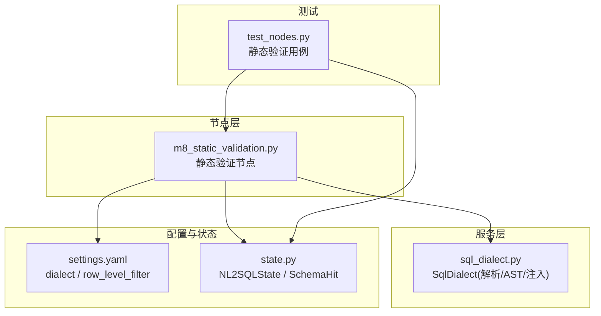
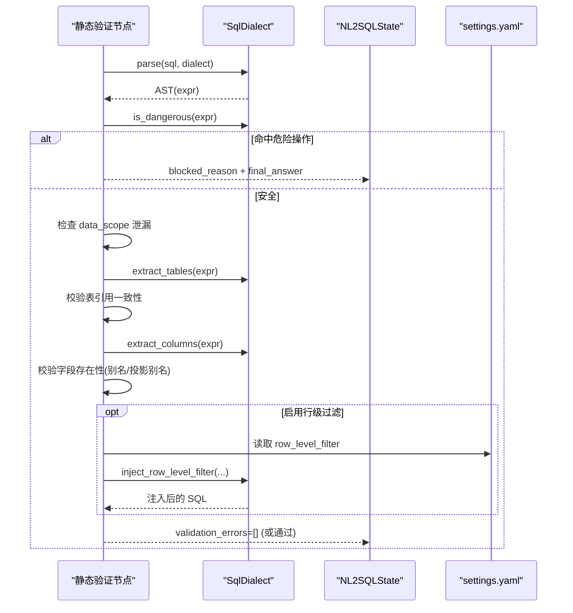
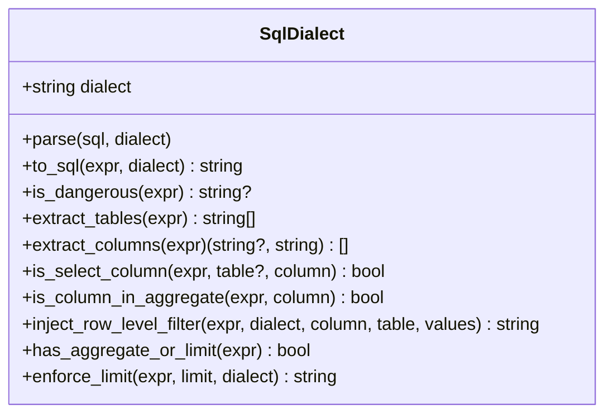
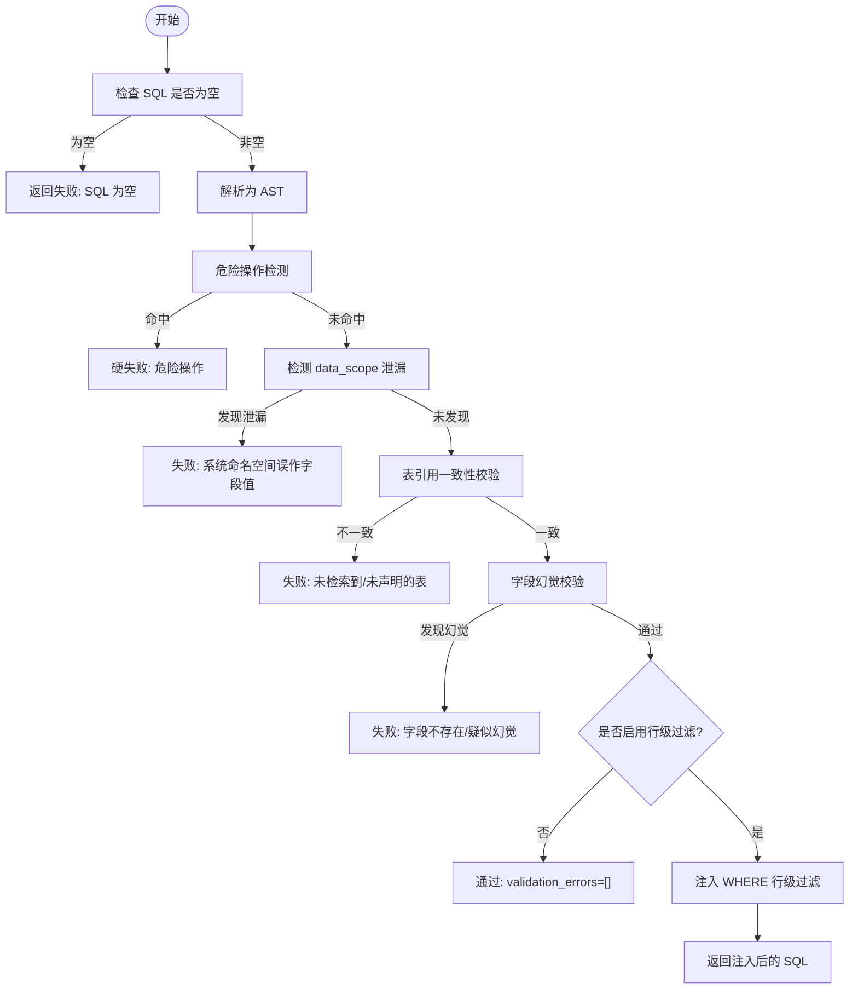
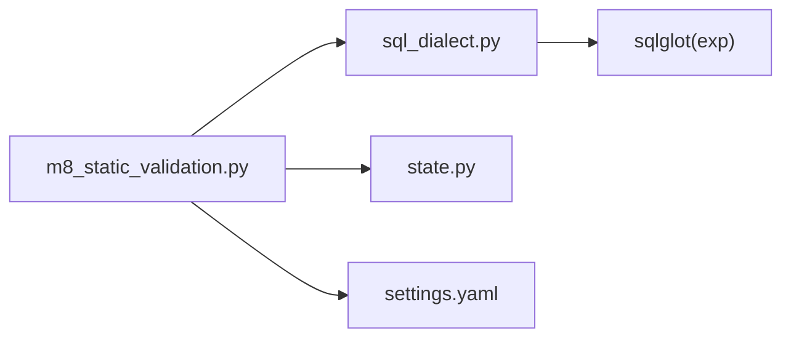

# 静态验证器

<cite>
**本文引用的文件**
- [m8_static_validation.py](file://nl2sql_agent/nodes/m8_static_validation.py)
- [sql_dialect.py](file://nl2sql_agent/services/sql_dialect.py)
- [state.py](file://nl2sql_agent/state.py)
- [settings.yaml](file://nl2sql_agent/config/settings.yaml)
- [test_nodes.py](file://nl2sql_agent/tests/test_nodes.py)
</cite>

## 目录
1. [简介](#简介)
2. [项目结构](#项目结构)
3. [核心组件](#核心组件)
4. [架构总览](#架构总览)
5. [详细组件分析](#详细组件分析)
6. [依赖关系分析](#依赖关系分析)
7. [性能考量](#性能考量)
8. [故障排查指南](#故障排查指南)
9. [结论](#结论)
10. [附录](#附录)

## 简介
本技术文档面向“静态验证器”，聚焦基于 sqlglot 的 AST 解析与校验机制，覆盖 SQL 语法树的结构分析与节点遍历、语法检查流程（SELECT 完整性、JOIN 条件、聚合函数规范）、语义验证规则（表字段存在性、数据类型兼容性、函数参数有效性）、危险关键字检测（DROP/DELETE/UPDATE/TRUNCATE 等写操作识别与阻断）、权限过滤条件的自动注入（WHERE 子句数据范围限制），以及字段幻觉防护与自定义扩展、调试方法。

该模块在生成 SQL 后、执行前进行确定性校验，确保仅允许安全的只读查询通过，并在必要时自动注入行级权限条件，从而降低 LLM 输出风险并提升系统安全性与可维护性。

## 项目结构
静态验证相关代码主要分布在以下位置：
- 节点实现：nl2sql_agent/nodes/m8_static_validation.py
- SQL 方言封装与 AST 工具：nl2sql_agent/services/sql_dialect.py
- 状态模型与运行时上下文：nl2sql_agent/state.py
- 配置项（方言、行级过滤开关等）：nl2sql_agent/config/settings.yaml
- 单元测试（覆盖字段幻觉、别名处理、行级过滤注入等）：nl2sql_agent/tests/test_nodes.py

图表来源
- [m8_static_validation.py:1-152](file://nl2sql_agent/nodes/m8_static_validation.py#L1-L152)
- [sql_dialect.py:1-111](file://nl2sql_agent/services/sql_dialect.py#L1-L111)
- [state.py:1-146](file://nl2sql_agent/state.py#L1-L146)
- [settings.yaml:1-30](file://nl2sql_agent/config/settings.yaml#L1-L30)
- [test_nodes.py:281-359](file://nl2sql_agent/tests/test_nodes.py#L281-L359)

章节来源
- [m8_static_validation.py:1-152](file://nl2sql_agent/nodes/m8_static_validation.py#L1-L152)
- [sql_dialect.py:1-111](file://nl2sql_agent/services/sql_dialect.py#L1-L111)
- [state.py:1-146](file://nl2sql_agent/state.py#L1-L146)
- [settings.yaml:1-30](file://nl2sql_agent/config/settings.yaml#L1-L30)
- [test_nodes.py:281-359](file://nl2sql_agent/tests/test_nodes.py#L281-L359)

## 核心组件
- SqlDialect：封装 sqlglot 的解析、AST 信息抽取、危险操作检测、行级权限注入、聚合/限制判断等能力。
- 静态验证节点：读取 state 中的 generated_sql、used_tables、retrieved_schema、data_scope、row_level_filters 等，按步骤完成语法、危险操作、表/字段一致性、字段幻觉、行级权限注入等校验。
- 状态模型 NL2SQLState：承载用户输入、检索到的 schema、计划、生成的 SQL、校验错误、重试计数、权限信息等。
- 配置 settings.yaml：控制 dialect、执行策略、行级过滤开关与列名等。

章节来源
- [sql_dialect.py:1-111](file://nl2sql_agent/services/sql_dialect.py#L1-L111)
- [m8_static_validation.py:1-152](file://nl2sql_agent/nodes/m8_static_validation.py#L1-L152)
- [state.py:83-146](file://nl2sql_agent/state.py#L83-L146)
- [settings.yaml:1-30](file://nl2sql_agent/config/settings.yaml#L1-L30)

## 架构总览
静态验证器以 AST 为核心，避免正则带来的误判。整体流程如下：
- 解析 SQL 为 AST
- 检测危险操作（非 SELECT 类或包含 DDL/Command）
- 校验 data_scope 未被误用为字段值
- 校验表引用一致性与字段存在性（防字段幻觉）
- 根据配置注入行级过滤条件到 WHERE
- 返回通过或失败（含错误信息与重试计数）

图表来源
- [m8_static_validation.py:33-152](file://nl2sql_agent/nodes/m8_static_validation.py#L33-L152)
- [sql_dialect.py:16-93](file://nl2sql_agent/services/sql_dialect.py#L16-L93)
- [settings.yaml:24-30](file://nl2sql_agent/config/settings.yaml#L24-L30)

## 详细组件分析

### 组件一：SqlDialect（AST 解析与校验）
- 解析与序列化
  - parse：使用 sqlglot.parse_one 将 SQL 字符串解析为 AST。
  - to_sql：将 AST 序列化为 SQL 字符串。
- 危险操作检测
  - is_dangerous：顶层节点类型不在安全集合（Select/Subquery/Union/Except/Intersect）即视为危险；若顶层是 SELECT，但内部存在 Command/DDL 且非安全类型，同样拦截。
- AST 信息抽取
  - extract_tables：提取去重表名（排除 CTE 别名）。
  - extract_columns：提取所有 Column 节点（跳过 *），返回 (table|None, column)。
  - is_select_column：判断某列是否出现在 SELECT 投影中。
  - is_column_in_aggregate：判断某列是否出现在聚合函数参数内。
- 行级权限注入
  - inject_row_level_filter：在 WHERE 追加 <table>.<column> IN (values...)，支持已有 WHERE 的合并。
- 限制与聚合判断
  - has_aggregate_or_limit：检测是否存在 limit/group/distinct/AggFunc。
  - enforce_limit：强制添加 LIMIT。

图表来源
- [sql_dialect.py:12-111](file://nl2sql_agent/services/sql_dialect.py#L12-L111)

章节来源
- [sql_dialect.py:16-111](file://nl2sql_agent/services/sql_dialect.py#L16-L111)

### 组件二：静态验证节点（m8_static_validation）
职责与流程：
- 空 SQL 快速失败
- 解析 SQL 为 AST（方言从配置读取）
- 危险操作检测（硬失败，不进入重试）
- data_scope 泄漏检测（禁止将系统命名空间作为字段值）
- 表引用一致性校验（AST 表 ⊆ used_tables 且 ⊆ retrieved_schema）
- 字段幻觉防护（字段必须存在于检索到的 schema；允许 SELECT 别名在 ORDER BY/GROUP BY 引用）
- 行级权限注入（按配置启用时，对实际引用且包含权限列的表分别注入，使用别名限定）

图表来源
- [m8_static_validation.py:33-152](file://nl2sql_agent/nodes/m8_static_validation.py#L33-L152)

章节来源
- [m8_static_validation.py:22-152](file://nl2sql_agent/nodes/m8_static_validation.py#L22-L152)

### 组件三：状态与配置（NL2SQLState 与 settings.yaml）
- NL2SQLState 关键字段
  - generated_sql：生成的 SQL
  - used_tables：上游声明的使用表
  - retrieved_schema：检索到的表及列定义
  - data_scope：系统/表权限命名空间（不可作为字段值）
  - row_level_filters：服务端鉴权注入的可信行级过滤值
  - validation_errors/retry_count/blocked_reason：校验结果与重试控制
- settings.yaml 关键配置
  - dialect：SQL 方言（mysql/postgres/duckdb 等）
  - execution.read_only/limit/timeout_seconds/explain_row_threshold：执行策略
  - row_level_filter.enabled/column：行级过滤开关与列名

章节来源
- [state.py:83-146](file://nl2sql_agent/state.py#L83-L146)
- [settings.yaml:1-30](file://nl2sql_agent/config/settings.yaml#L1-L30)

## 依赖关系分析
- 静态验证节点依赖：
  - deps.config.dialect：方言设置
  - deps.sql：SqlDialect 实例
  - state：NL2SQLState 上下文
- SqlDialect 依赖：
  - sqlglot：AST 解析与遍历
- 配置依赖：
  - settings.yaml：dialect、row_level_filter 等

图表来源
- [m8_static_validation.py:33-152](file://nl2sql_agent/nodes/m8_static_validation.py#L33-L152)
- [sql_dialect.py:1-111](file://nl2sql_agent/services/sql_dialect.py#L1-L111)
- [state.py:83-146](file://nl2sql_agent/state.py#L83-L146)
- [settings.yaml:1-30](file://nl2sql_agent/config/settings.yaml#L1-L30)

章节来源
- [m8_static_validation.py:33-152](file://nl2sql_agent/nodes/m8_static_validation.py#L33-L152)
- [sql_dialect.py:1-111](file://nl2sql_agent/services/sql_dialect.py#L1-L111)
- [state.py:83-146](file://nl2sql_agent/state.py#L83-L146)
- [settings.yaml:1-30](file://nl2sql_agent/config/settings.yaml#L1-L30)

## 性能考量
- AST 遍历开销：extract_tables/extract_columns/find_all 会全量扫描 AST，建议保持 SQL 复杂度可控。
- 行级过滤注入：每次注入需重新解析与序列化，尽量仅在需要时启用。
- 重复解析优化：当前实现会在注入过程中多次 parse/to_sql，可在上层缓存中间结果以降低开销。
- 错误快速失败：空 SQL、危险操作、data_scope 泄漏等早期短路，减少后续计算。

[本节为通用指导，无需源码引用]

## 故障排查指南
常见问题与定位要点：
- SQL 语法错误
  - 现象：解析抛出异常，返回“SQL 语法错误”
  - 排查：确认 dialect 与实际 SQL 匹配，检查语句合法性
- 危险操作被拦截
  - 现象：blocked_reason 非空，final_answer 提示危险操作
  - 排查：确认是否为 DROP/DELETE/UPDATE/TRUNCATE 等写操作
- data_scope 泄漏
  - 现象：提示“系统命名空间误作表字段值”
  - 排查：检查 WHERE 字面量是否包含 data_scope 的值
- 表引用不一致
  - 现象：提示“引用了未检索到/未声明的表”
  - 排查：核对 used_tables 与 AST 提取的表名是否一致
- 字段幻觉
  - 现象：提示“字段不存在/疑似字段幻觉”
  - 排查：确认字段是否在 retrieved_schema 对应表中存在；ORDER BY/GROUP BY 引用 SELECT 别名应合法
- 行级过滤缺失
  - 现象：已启用但未提供可信权限值，导致阻断
  - 排查：确保 state.row_level_filters 注入正确值

章节来源
- [m8_static_validation.py:33-152](file://nl2sql_agent/nodes/m8_static_validation.py#L33-L152)
- [sql_dialect.py:25-93](file://nl2sql_agent/services/sql_dialect.py#L25-L93)
- [test_nodes.py:281-359](file://nl2sql_agent/tests/test_nodes.py#L281-L359)

## 结论
静态验证器通过 AST 驱动的严格校验与自动注入，有效防止危险操作、字段幻觉与权限泄露，保障 SQL 生成的安全性与正确性。其模块化设计便于扩展新规则与调试，配合单元测试可快速回归验证。

[本节为总结，无需源码引用]

## 附录

### 语法检查流程（SELECT 完整性、JOIN 条件、聚合函数）
- SELECT 完整性：AST 解析通过后，确保至少引用一张表；若未引用任何表则失败。
- JOIN 条件：字段幻觉校验阶段会检查 JOIN 条件中的列是否存在于对应表；别名映射确保按真实表名校验。
- 聚合函数：通过 is_column_in_aggregate 与 has_aggregate_or_limit 辅助判定，结合 enforce_limit 在未聚合时强制 LIMIT。

章节来源
- [m8_static_validation.py:74-117](file://nl2sql_agent/nodes/m8_static_validation.py#L74-L117)
- [sql_dialect.py:71-111](file://nl2sql_agent/services/sql_dialect.py#L71-L111)

### 语义验证规则（字段存在性、数据类型兼容性、函数参数有效性）
- 字段存在性：extract_columns 提取所有列引用，对照 retrieved_schema 的列集合进行校验。
- 数据类型兼容性：当前实现未做显式类型检查；如需扩展，可在 extract_columns 后增加类型比对逻辑。
- 函数参数有效性：可通过 is_column_in_aggregate 与自定义函数参数校验扩展。

章节来源
- [m8_static_validation.py:104-117](file://nl2sql_agent/nodes/m8_static_validation.py#L104-L117)
- [sql_dialect.py:51-77](file://nl2sql_agent/services/sql_dialect.py#L51-L77)

### 危险关键字检测机制（DROP/DELETE/UPDATE/TRUNCATE）
- 基于 AST 顶层节点类型判断，非 SELECT 类即危险；若顶层为 SELECT 但内部存在 Command/DDL 且非安全类型，同样拦截。
- 命中危险操作直接返回 blocked_reason 与 final_answer，不进入重试。

章节来源
- [sql_dialect.py:25-38](file://nl2sql_agent/services/sql_dialect.py#L25-L38)
- [m8_static_validation.py:48-55](file://nl2sql_agent/nodes/m8_static_validation.py#L48-L55)

### 权限过滤条件的自动注入（WHERE 子句数据范围限制）
- 读取 row_level_filter.enabled/column，若启用且 SQL 实际引用包含权限列的表，则按表别名注入 <table>.<column> IN (values...)。
- 若启用但未提供可信权限值，直接阻断并返回 blocked_reason。

章节来源
- [m8_static_validation.py:119-148](file://nl2sql_agent/nodes/m8_static_validation.py#L119-L148)
- [sql_dialect.py:80-93](file://nl2sql_agent/services/sql_dialect.py#L80-L93)
- [settings.yaml:24-30](file://nl2sql_agent/config/settings.yaml#L24-L30)

### 字段幻觉防护技术
- 收集 SELECT 定义的别名，允许 ORDER BY/GROUP BY 引用这些别名而不误判。
- 解析表别名映射，按真实表名校验列存在性。
- 若列不在任何检索表的列集合中，标记为“疑似字段幻觉”。

章节来源
- [m8_static_validation.py:88-117](file://nl2sql_agent/nodes/m8_static_validation.py#L88-L117)

### 验证规则的自定义扩展方法与调试工具使用方法
- 扩展点
  - 在 SqlDialect 新增 AST 检查方法（如函数参数校验、类型兼容检查）。
  - 在静态验证节点中调用新方法，并将错误加入 validation_errors。
- 调试建议
  - 打印 AST 结构（expr.sql()）观察解析结果。
  - 使用 extract_tables/extract_columns 输出中间结果定位问题。
  - 通过单元测试覆盖边界场景（别名、JOIN、聚合、行级过滤）。

章节来源
- [sql_dialect.py:51-111](file://nl2sql_agent/services/sql_dialect.py#L51-L111)
- [m8_static_validation.py:33-152](file://nl2sql_agent/nodes/m8_static_validation.py#L33-L152)
- [test_nodes.py:281-359](file://nl2sql_agent/tests/test_nodes.py#L281-L359)