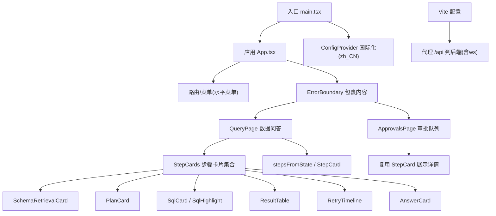
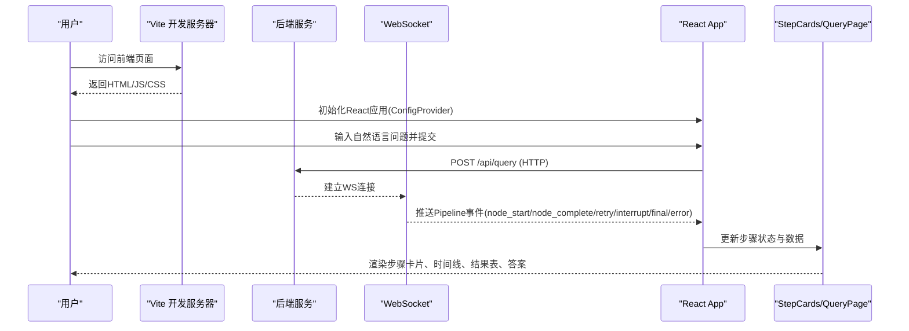
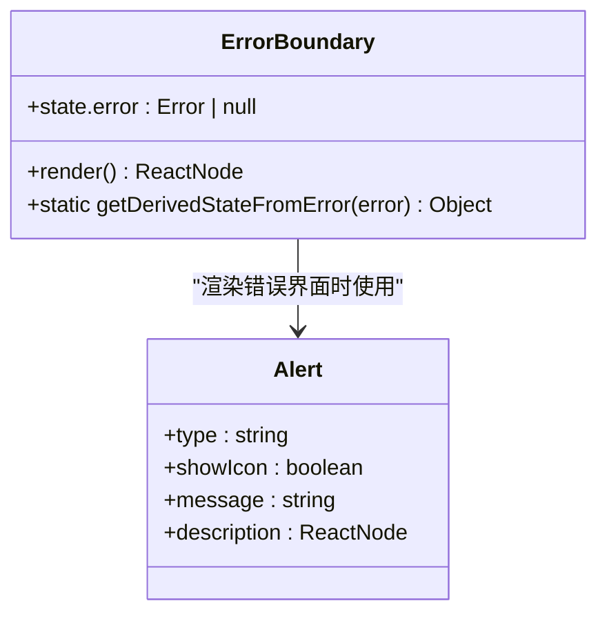
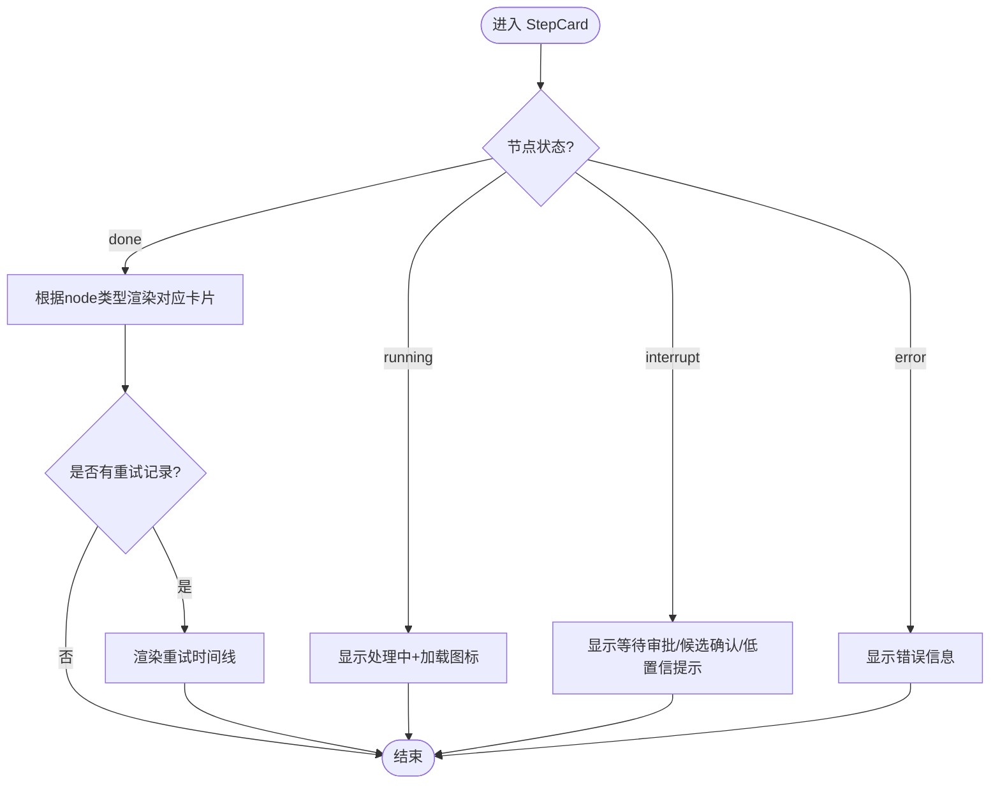
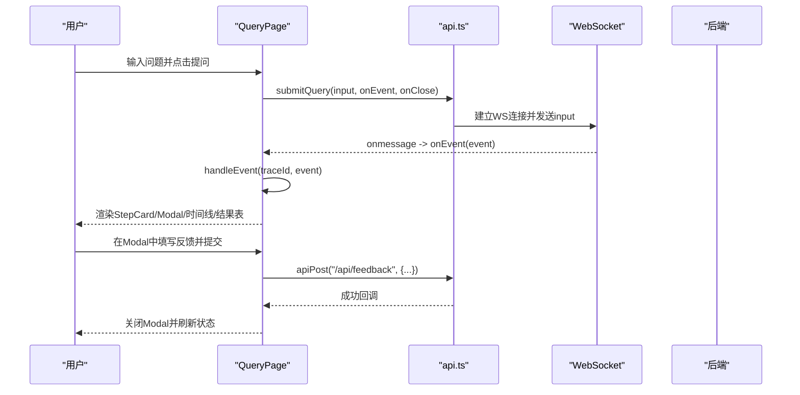
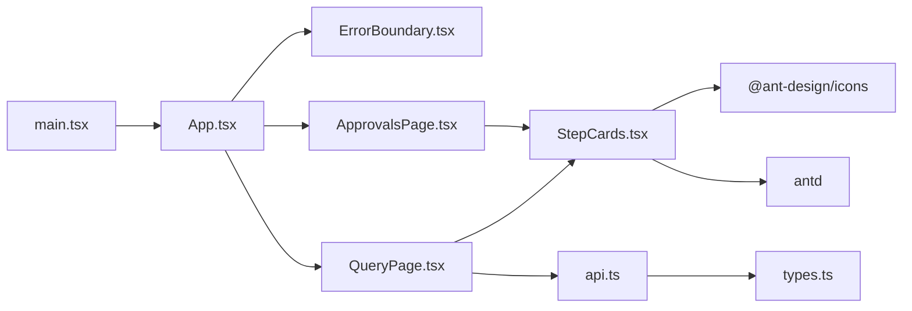

# UI组件库

<cite>
**本文引用的文件**   
- [ErrorBoundary.tsx](file://web/src/components/ErrorBoundary.tsx)
- [StepCards.tsx](file://web/src/components/StepCards.tsx)
- [QueryPage.tsx](file://web/src/pages/QueryPage.tsx)
- [ApprovalsPage.tsx](file://web/src/pages/ApprovalsPage.tsx)
- [App.tsx](file://web/src/App.tsx)
- [main.tsx](file://web/src/main.tsx)
- [api.ts](file://web/src/api.ts)
- [types.ts](file://web/src/types.ts)
- [vite.config.ts](file://web/vite.config.ts)
- [package.json](file://web/package.json)
</cite>

## 目录
1. [简介](#简介)
2. [项目结构](#项目结构)
3. [核心组件](#核心组件)
4. [架构总览](#架构总览)
5. [详细组件分析](#详细组件分析)
6. [依赖关系分析](#依赖关系分析)
7. [性能与优化](#性能与优化)
8. [故障排查指南](#故障排查指南)
9. [结论](#结论)
10. [附录：使用示例与最佳实践](#附录使用示例与最佳实践)

## 简介
本UI组件库围绕NL2SQL智能体的前端交互，提供两类关键能力：
- 错误边界与降级展示：通过 ErrorBoundary 捕获渲染期异常，避免整页白屏，并以友好的错误提示替代。
- 步骤化流程可视化：通过 StepCards 及其子组件，将多阶段查询管线（意图澄清、Schema检索、计划生成、SQL生成、静态校验、敏感判定、人工确认、沙箱执行、结果解释）以卡片+时间线的方式呈现，支持状态切换、反馈提交与重试过程展示。

同时，本项目基于 Ant Design 构建，统一了主题语言与样式基线，并通过 Vite 进行开发与构建。

## 项目结构
前端采用 React + TypeScript + Vite + Ant Design 的技术栈，页面按功能模块拆分，组件集中在 components 目录，类型定义与API封装在 src 根目录。

图表来源
- [main.tsx:1-15](file://web/src/main.tsx#L1-L15)
- [App.tsx:1-58](file://web/src/App.tsx#L1-L58)
- [vite.config.ts:1-21](file://web/vite.config.ts#L1-L21)

章节来源
- [main.tsx:1-15](file://web/src/main.tsx#L1-L15)
- [App.tsx:1-58](file://web/src/App.tsx#L1-L58)
- [vite.config.ts:1-21](file://web/vite.config.ts#L1-L21)

## 核心组件
- ErrorBoundary：类组件，利用 React 错误边界机制捕获子树渲染错误，并显示 Alert 提示与堆栈信息。
- StepCards：一组用于展示查询管线各阶段的卡片组件，包括状态徽标、SQL高亮、计划摘要、SQL预览、结果表格、重试时间线与答案卡片等。

章节来源
- [ErrorBoundary.tsx:1-37](file://web/src/components/ErrorBoundary.tsx#L1-L37)
- [StepCards.tsx:1-347](file://web/src/components/StepCards.tsx#L1-L347)

## 架构总览
整体前端架构遵循“入口 -> 应用壳 -> 页面 -> 组件”的分层模式，结合 Ant Design 的 ConfigProvider 提供全局语言与主题能力；Vite 开发服务器对 /api 路径进行反向代理，屏蔽跨域与WebSocket差异。

图表来源
- [main.tsx:1-15](file://web/src/main.tsx#L1-L15)
- [api.ts:1-50](file://web/src/api.ts#L1-L50)
- [QueryPage.tsx:1-574](file://web/src/pages/QueryPage.tsx#L1-L574)
- [vite.config.ts:1-21](file://web/vite.config.ts#L1-L21)

## 详细组件分析

### ErrorBoundary 组件
- 设计目标：在渲染阶段发生异常时，阻止崩溃扩散，展示友好错误信息，保留堆栈便于调试。
- 实现要点：
  - 使用 getDerivedStateFromError 捕获错误并更新 state.error。
  - 渲染分支：当存在 error 时，使用 Antd 的 Alert 展示错误消息与堆栈；否则渲染 children。
  - 集成位置：在 App.tsx 中包裹所有页面内容，确保任意页面渲染异常均被捕获。
- 降级处理：不阻断应用其他部分，仅替换出错子树为错误提示。
- 用户体验：清晰提示“页面渲染出错”，并提供可复制的堆栈信息，便于定位问题。

图表来源
- [ErrorBoundary.tsx:1-37](file://web/src/components/ErrorBoundary.tsx#L1-L37)
- [App.tsx:47-53](file://web/src/App.tsx#L47-L53)

章节来源
- [ErrorBoundary.tsx:1-37](file://web/src/components/ErrorBoundary.tsx#L1-L37)
- [App.tsx:47-53](file://web/src/App.tsx#L47-L53)

### StepCards 组件族
StepCards 提供一系列与查询管线相关的展示组件，配合 QueryPage 的状态机驱动渲染。

- StepStatusTag：根据节点状态（running/done/interrupt/error）显示不同颜色与图标徽标。
- SchemaRetrievalCard：折叠面板展示命中表及字段注释，辅助理解检索结果。
- PlanCard：展示查询计划（目标表、过滤条件、关联逻辑、指标口径、分组、置信度），并提供“这个理解不对”的反馈弹窗，提交至后端。
- SqlCard：轻量SQL高亮（正则匹配关键字着色）、一键复制、反馈弹窗。
- ResultTable：动态列生成、分页与横向滚动，适配宽表。
- RetryTimeline：以时间线形式展示某节点的重试次数与原因。
- AnswerCard：最终答案的简洁卡片展示。

图表来源
- [StepCards.tsx:30-58](file://web/src/components/StepCards.tsx#L30-L58)
- [StepCards.tsx:84-116](file://web/src/components/StepCards.tsx#L84-L116)
- [StepCards.tsx:120-211](file://web/src/components/StepCards.tsx#L120-L211)
- [StepCards.tsx:215-274](file://web/src/components/StepCards.tsx#L215-L274)
- [StepCards.tsx:278-296](file://web/src/components/StepCards.tsx#L278-L296)
- [StepCards.tsx:300-333](file://web/src/components/StepCards.tsx#L300-L333)
- [StepCards.tsx:337-344](file://web/src/components/StepCards.tsx#L337-L344)
- [QueryPage.tsx:96-263](file://web/src/pages/QueryPage.tsx#L96-L263)

章节来源
- [StepCards.tsx:1-347](file://web/src/components/StepCards.tsx#L1-L347)
- [QueryPage.tsx:96-263](file://web/src/pages/QueryPage.tsx#L96-L263)

### QueryPage 中的步骤导航与状态管理
- 状态模型：Session 包含 trace_id、query、data_scope、status、steps、trace_steps、node_latencies、created_at。
- 步骤映射：stepsFromState 将后端最终状态还原为各步骤的 StepState（status/data/retries）。
- 事件处理：handleEvent 响应 node_start/node_complete/retry/interrupt/final/error 等事件，更新 steps 与整体状态。
- 轮询恢复：pending_review 状态下定时拉取最新状态，直到 done/error 或出现新的中断节点。
- 交互流程：用户提交问题 -> WebSocket 推送事件 -> 逐步渲染 StepCard -> 必要时弹出 Modal 收集反馈 -> 提交至后端。

图表来源
- [QueryPage.tsx:267-408](file://web/src/pages/QueryPage.tsx#L267-L408)
- [api.ts:31-49](file://web/src/api.ts#L31-L49)

章节来源
- [QueryPage.tsx:1-574](file://web/src/pages/QueryPage.tsx#L1-L574)
- [api.ts:1-50](file://web/src/api.ts#L1-L50)

### ApprovalsPage 审批队列
- 列表展示：待审批记录，包含用户、问题、敏感规则、系统、时间与等待时长。
- 操作：通过/驳回（驳回必填原因），调用后端接口并刷新列表。
- 详情抽屉：复用 StepCard 展示完整 pipeline 过程，便于审批人理解上下文。

章节来源
- [ApprovalsPage.tsx:1-200](file://web/src/pages/ApprovalsPage.tsx#L1-L200)

## 依赖关系分析
- 组件耦合：
  - QueryPage 强依赖 StepCards 提供的展示组件与 stepsFromState。
  - StepCards 依赖 Ant Design 组件与 @ant-design/icons。
  - api.ts 提供统一的 fetch 与 WebSocket 封装，供 QueryPage 与 StepCards 的反馈提交使用。
  - types.ts 定义前后端共享的数据结构，保证类型一致性。
- 外部依赖：
  - React 18、Ant Design 5、Vite 5、TypeScript 5。
  - dayjs 用于时间格式化。
- 潜在循环依赖：无直接循环引用，QueryPage 与 StepCards 之间通过导出函数与类型解耦。

图表来源
- [main.tsx:1-15](file://web/src/main.tsx#L1-L15)
- [App.tsx:1-58](file://web/src/App.tsx#L1-L58)
- [QueryPage.tsx:1-574](file://web/src/pages/QueryPage.tsx#L1-L574)
- [StepCards.tsx:1-347](file://web/src/components/StepCards.tsx#L1-L347)
- [api.ts:1-50](file://web/src/api.ts#L1-L50)
- [types.ts:1-72](file://web/src/types.ts#L1-L72)

章节来源
- [package.json:1-26](file://web/package.json#L1-L26)
- [types.ts:1-72](file://web/src/types.ts#L1-L72)

## 性能与优化
- 渲染优化：
  - 步骤卡片按需渲染：仅在步骤状态非 idle 时渲染对应 StepCard，减少无用DOM。
  - SQL高亮轻量实现：使用正则分词与简单着色，避免引入重型语法高亮库。
  - 表格分页与滚动：ResultTable 设置 pageSize=20 与横向滚动，避免大数据量卡顿。
- 网络优化：
  - WebSocket 实时推送：避免频繁轮询，降低请求开销。
  - Vite 代理：开发环境统一 /api 代理，避免跨域与CORS问题。
- 缓存策略：
  - 历史会话本地维护：sessions 数组缓存最近会话，提升打开速度。
  - 断线重连：从后端拉取最新状态恢复，避免重复计算。
- 懒加载建议：
  - 可将大组件（如复杂表格、图可视化）按需 import() 延迟加载。
  - 对长列表使用虚拟滚动（如 react-window）进一步优化。
- 渲染优化建议：
  - 对频繁更新的步骤状态使用 useMemo/useCallback 减少重渲染。
  - 将反馈弹窗与表单状态局部化，避免影响父组件。

[本节为通用指导，不直接分析具体文件]

## 故障排查指南
- 页面白屏：检查 ErrorBoundary 是否包裹了页面内容；查看 Alert 中的堆栈信息定位错误源。
- WebSocket 连接失败：确认 vite.config.ts 的代理配置与后端端口一致；检查浏览器控制台网络面板。
- 步骤状态不更新：检查 handleEvent 的事件分支是否正确处理 node_start/node_complete/retry/interrupt/final/error。
- 反馈提交失败：确认 apiPost 的请求体结构与后端接口一致；查看 message 提示的错误信息。
- 审批队列未刷新：确认 ApprovalsPage 的轮询定时器是否清理；检查 /api/approvals 接口可用性。

章节来源
- [ErrorBoundary.tsx:1-37](file://web/src/components/ErrorBoundary.tsx#L1-L37)
- [api.ts:1-50](file://web/src/api.ts#L1-L50)
- [QueryPage.tsx:291-333](file://web/src/pages/QueryPage.tsx#L291-L333)
- [ApprovalsPage.tsx:42-51](file://web/src/pages/ApprovalsPage.tsx#L42-L51)

## 结论
本UI组件库以 ErrorBoundary 保障稳定性，以 StepCards 系列组件实现复杂的查询管线可视化，结合 Ant Design 与 Vite 提供了良好的开发体验与一致的UI风格。通过清晰的组件职责划分与类型定义，既适合初学者学习组件开发，也为有经验开发者提供了扩展与定制的空间。

[本节为总结性内容，不直接分析具体文件]

## 附录：使用示例与最佳实践

### 组件使用示例
- 错误边界包裹：
  - 在 App.tsx 中使用 <ErrorBoundary> 包裹所有页面，确保异常隔离。
- 步骤卡片展示：
  - 在 QueryPage 中通过 StepCard 渲染每个节点，传入 node/title/step/traceId/onResume。
  - 使用 SchemaRetrievalCard/PlanCard/SqlCard/ResultTable/RetryTimeline/AnswerCard 组合展示。
- 反馈提交：
  - 在 PlanCard/SqlCard 中通过 Modal 收集用户反馈，调用 apiPost("/api/feedback") 提交。

章节来源
- [App.tsx:47-53](file://web/src/App.tsx#L47-L53)
- [QueryPage.tsx:481-494](file://web/src/pages/QueryPage.tsx#L481-L494)
- [StepCards.tsx:130-139](file://web/src/components/StepCards.tsx#L130-L139)
- [StepCards.tsx:229-238](file://web/src/components/StepCards.tsx#L229-L238)

### 属性配置与事件处理
- StepCard 属性：
  - node: 节点标识（如 schema_retrieval/sql_generation）
  - title: 节点标题
  - step: StepState（status/data/retries）
  - traceId: 追踪ID
  - onResume: 恢复回调（用于中断节点的用户决策）
- 事件处理：
  - handleEvent 统一处理 PipelineEvent，更新状态与步骤。
  - doResume 触发后端 resume 接口并轮询结果。

章节来源
- [QueryPage.tsx:96-108](file://web/src/pages/QueryPage.tsx#L96-L108)
- [QueryPage.tsx:291-333](file://web/src/pages/QueryPage.tsx#L291-L333)
- [QueryPage.tsx:394-402](file://web/src/pages/QueryPage.tsx#L394-L402)

### 响应式设计与移动端适配
- 布局：使用 Ant Design Layout 的 Sider/Content 实现左右侧边栏与主内容区。
- 表格：启用横向滚动与分页，适配小屏幕。
- 输入框：使用 AutoSize 自适应高度，提升移动端输入体验。
- 建议：在移动端隐藏次要信息（如元信息面板），优先展示核心步骤与结果。

章节来源
- [QueryPage.tsx:414-440](file://web/src/pages/QueryPage.tsx#L414-L440)
- [QueryPage.tsx:505-524](file://web/src/pages/QueryPage.tsx#L505-L524)

### 浏览器兼容性处理
- 使用标准 Fetch API 与 WebSocket，兼容现代浏览器。
- Vite 开发服务器监听 0.0.0.0，避免 IPv6 导致的访问问题。
- 建议使用 polyfill 或降级方案以支持旧版浏览器（如需）。

章节来源
- [vite.config.ts:8-18](file://web/vite.config.ts#L8-L18)
- [api.ts:36-48](file://web/src/api.ts#L36-L48)

### 组件复用模式与组合使用
- 组合模式：StepCard 作为容器，根据 node 类型组合不同的展示组件（SchemaRetrievalCard/PlanCard/SqlCard 等）。
- 状态提升：QueryPage 集中管理 Session 状态，向下传递 step 数据。
- 事件驱动：通过 WebSocket 事件驱动状态更新，保持UI与后端同步。

章节来源
- [QueryPage.tsx:481-494](file://web/src/pages/QueryPage.tsx#L481-L494)
- [StepCards.tsx:84-116](file://web/src/components/StepCards.tsx#L84-L116)

### 最佳实践指南
- 错误处理：始终使用 ErrorBoundary 包裹可能出错的组件树。
- 状态管理：将复杂状态拆分为局部状态与全局状态，避免不必要的重渲染。
- 网络请求：统一封装 apiGet/apiPost/submitQuery，集中处理错误与日志。
- 用户体验：提供明确的加载指示、错误提示与操作反馈。
- 代码组织：按功能模块拆分文件，保持组件职责单一。

[本节为通用指导，不直接分析具体文件]