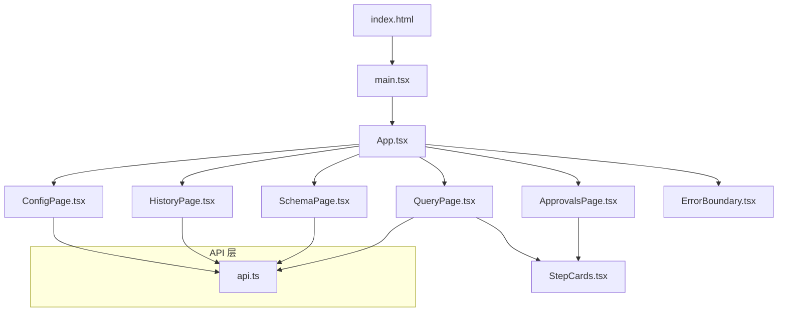
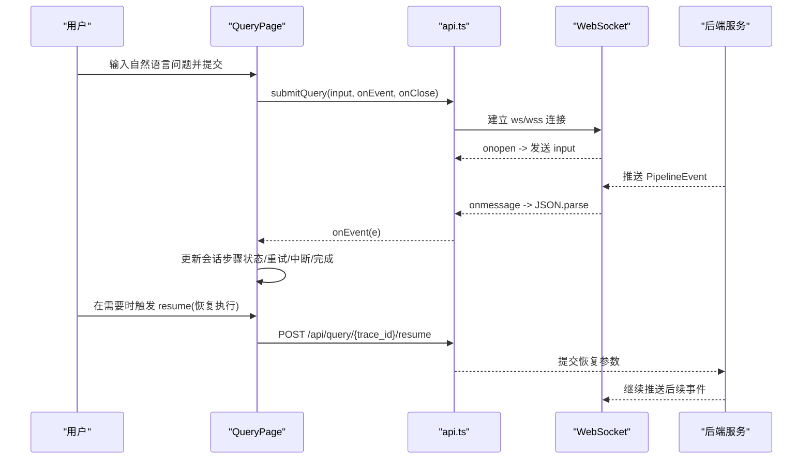
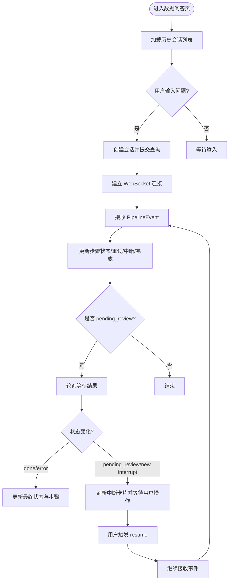
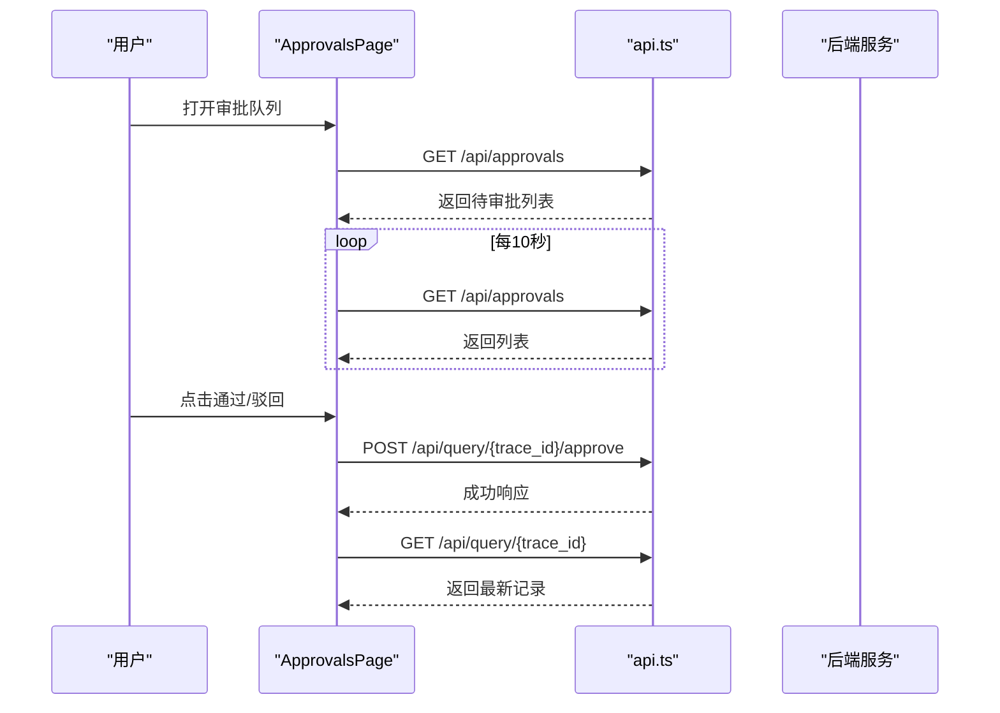
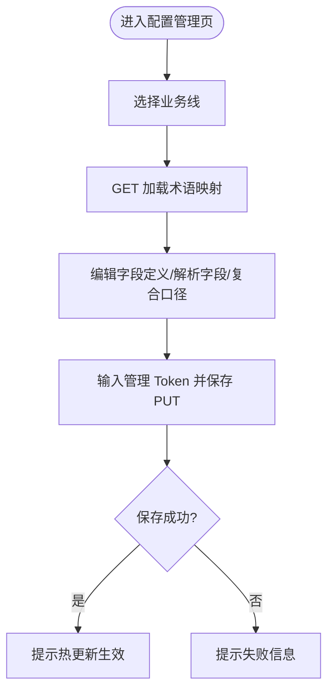
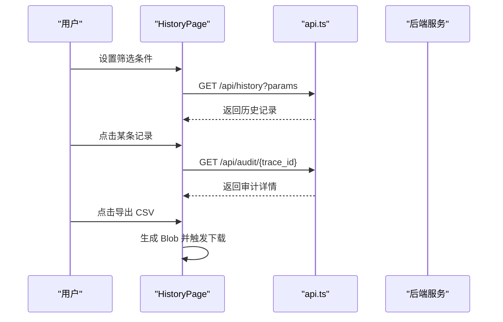
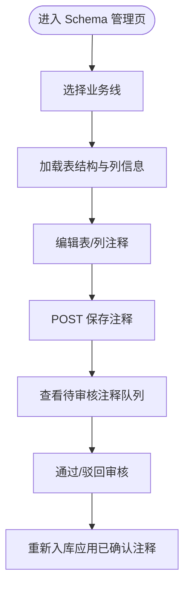
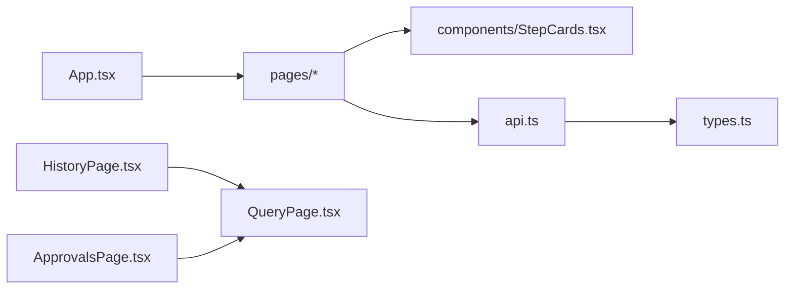

# 前端应用

<cite>
**本文引用的文件**   
- [web/src/main.tsx](file://web/src/main.tsx)
- [web/src/App.tsx](file://web/src/App.tsx)
- [web/src/api.ts](file://web/src/api.ts)
- [web/src/types.ts](file://web/src/types.ts)
- [web/src/pages/QueryPage.tsx](file://web/src/pages/QueryPage.tsx)
- [web/src/pages/ApprovalsPage.tsx](file://web/src/pages/ApprovalsPage.tsx)
- [web/src/pages/ConfigPage.tsx](file://web/src/pages/ConfigPage.tsx)
- [web/src/pages/HistoryPage.tsx](file://web/src/pages/HistoryPage.tsx)
- [web/src/pages/SchemaPage.tsx](file://web/src/pages/SchemaPage.tsx)
- [web/src/components/ErrorBoundary.tsx](file://web/src/components/ErrorBoundary.tsx)
- [web/src/components/StepCards.tsx](file://web/src/components/StepCards.tsx)
- [web/package.json](file://web/package.json)
- [web/vite.config.ts](file://web/vite.config.ts)
- [web/index.html](file://web/index.html)
</cite>

## 目录
1. [简介](#简介)
2. [项目结构](#项目结构)
3. [核心组件与架构](#核心组件与架构)
4. [架构总览](#架构总览)
5. [详细组件分析](#详细组件分析)
6. [依赖关系分析](#依赖关系分析)
7. [性能与可维护性](#性能与可维护性)
8. [故障排查指南](#故障排查指南)
9. [结论](#结论)
10. [附录：开发、构建与部署](#附录开发构建与部署)

## 简介
本前端应用基于 React + TypeScript，使用 Ant Design 作为 UI 框架，Vite 作为开发与构建工具。应用围绕 NL2SQL 智能体提供五大页面：数据问答、审批管理、配置管理、历史审计、Schema 管理。通过 WebSocket 实时推送 Pipeline 节点事件，结合 REST API 完成查询提交、状态轮询、审批操作与配置热更新。整体采用“轻量状态管理 + 组件复用”的架构，适合初学者快速上手，也为有经验的开发者提供了清晰的扩展点。

## 项目结构
- 入口与全局配置
  - 应用根入口渲染与国际化配置位于入口文件；HTML 模板定义挂载点与模块脚本。
  - Vite 配置启用 React 插件，并设置开发代理将 /api 转发到后端（含 WebSocket）。
- 路由与布局
  - 应用根组件使用 Ant Design Layout + Menu 实现水平导航切换，无第三方路由库，通过本地 state 控制页面显示。
- 页面与组件
  - pages 下为各业务页面；components 下为通用 UI 与错误边界；api.ts 封装 HTTP 与 WebSocket 调用；types.ts 定义前后端共享类型。
- 包管理与脚本
  - package.json 声明依赖与脚本命令；dev/build/preview 覆盖开发、构建与预览流程。

图表来源
- [web/index.html:1-13](file://web/index.html#L1-L13)
- [web/src/main.tsx:1-15](file://web/src/main.tsx#L1-L15)
- [web/src/App.tsx:1-58](file://web/src/App.tsx#L1-L58)
- [web/src/pages/QueryPage.tsx:1-574](file://web/src/pages/QueryPage.tsx#L1-L574)
- [web/src/pages/ApprovalsPage.tsx:1-223](file://web/src/pages/ApprovalsPage.tsx#L1-L223)
- [web/src/pages/ConfigPage.tsx:1-136](file://web/src/pages/ConfigPage.tsx#L1-L136)
- [web/src/pages/HistoryPage.tsx:1-179](file://web/src/pages/HistoryPage.tsx#L1-L179)
- [web/src/pages/SchemaPage.tsx:1-355](file://web/src/pages/SchemaPage.tsx#L1-L355)
- [web/src/components/ErrorBoundary.tsx:1-37](file://web/src/components/ErrorBoundary.tsx#L1-L37)
- [web/src/components/StepCards.tsx:1-347](file://web/src/components/StepCards.tsx#L1-L347)
- [web/src/api.ts:1-50](file://web/src/api.ts#L1-L50)

章节来源
- [web/index.html:1-13](file://web/index.html#L1-L13)
- [web/src/main.tsx:1-15](file://web/src/main.tsx#L1-L15)
- [web/src/App.tsx:1-58](file://web/src/App.tsx#L1-L58)
- [web/package.json:1-26](file://web/package.json#L1-L26)
- [web/vite.config.ts:1-21](file://web/vite.config.ts#L1-L21)

## 核心组件与架构
- 应用壳与导航
  - App 组件使用 antd Layout + Menu 实现顶部导航，根据选中 key 切换页面内容，所有页面被 ErrorBoundary 包裹以捕获渲染异常。
- 页面级状态
  - QueryPage 维护多会话列表与当前活跃会话，内部步骤状态由 Pipeline 事件驱动更新；其他页面多为独立状态（表格、筛选、抽屉等）。
- API 与 WebSocket
  - api.ts 统一封装 fetch 请求与 WebSocket 连接，提供 GET/POST 方法与 submitQuery 方法用于建立查询通道并处理事件流。
- 类型系统
  - types.ts 定义 QueryRecord、PipelineEvent、SchemaHit 等核心类型，以及 PIPELINE_NODES 展示顺序与标题映射，保证前后端一致性。
- 组件复用
  - StepCards.tsx 提供 StepStatusTag、SqlHighlight、SchemaRetrievalCard、PlanCard、SqlCard、ResultTable、RetryTimeline、AnswerCard 等通用卡片，被多个页面复用。

章节来源
- [web/src/App.tsx:1-58](file://web/src/App.tsx#L1-L58)
- [web/src/pages/QueryPage.tsx:1-574](file://web/src/pages/QueryPage.tsx#L1-L574)
- [web/src/api.ts:1-50](file://web/src/api.ts#L1-L50)
- [web/src/types.ts:1-72](file://web/src/types.ts#L1-L72)
- [web/src/components/StepCards.tsx:1-347](file://web/src/components/StepCards.tsx#L1-L347)

## 架构总览
前端采用“页面组件 + 通用卡片 + API 封装”的分层模式。WebSocket 负责实时事件推送，REST API 负责一次性数据获取与写操作。页面间通过 App 的 state 进行切换，不引入路由库，简化了依赖。

图表来源
- [web/src/pages/QueryPage.tsx:267-408](file://web/src/pages/QueryPage.tsx#L267-L408)
- [web/src/api.ts:31-49](file://web/src/api.ts#L31-L49)

## 详细组件分析

### 数据问答主页（QueryPage）
- 功能要点
  - 左侧历史会话列表，点击加载完整记录并渲染步骤；中间主区域展示当前会话的步骤卡片、运行指示与交互按钮；右侧元信息与耗时面板。
  - 支持 data_scope 多选标签，提交后通过 WebSocket 接收 Pipeline 事件，实时更新步骤状态（running/done/interrupt/error）。
  - 对 pending_review 状态自动轮询，直到 done/error 或新的 interrupt 出现。
- 关键数据结构
  - Session：包含 trace_id、query、data_scope、status、steps、trace_steps、node_latencies、created_at。
  - StepState：status、data、retries。
- 交互流程
  - 提交查询：创建会话并建立 WebSocket；onEvent 中处理 trace/node_start/node_complete/retry/interrupt/final/error。
  - 恢复执行：当处于 interrupt 状态时，用户选择候选表/确认低置信度/人工审批后，调用 resume 接口并继续轮询。
  - 历史恢复：打开历史条目时拉取完整记录，转换为 Session 并渲染；若仍 pending_review，启动轮询。
- 可视化

章节来源
- [web/src/pages/QueryPage.tsx:1-574](file://web/src/pages/QueryPage.tsx#L1-L574)
- [web/src/types.ts:1-72](file://web/src/types.ts#L1-L72)
- [web/src/api.ts:31-49](file://web/src/api.ts#L31-L49)

### 审批管理页（ApprovalsPage）
- 功能要点
  - 定时刷新待审批列表，展示用户、问题、敏感规则命中、系统、时间与等待时长；支持通过/驳回操作，驳回需填写原因。
  - 详情抽屉复用 QueryPage 的 stepsFromState 与 StepCard，展示完整 Pipeline 过程。
- 交互流程
  - 列表轮询：每 10 秒刷新一次。
  - 审批操作：POST 审批接口，成功后提示并刷新列表；若当前查看详情相同，延迟拉取最新记录更新详情。
- 可视化

图表来源
- [web/src/pages/ApprovalsPage.tsx:1-223](file://web/src/pages/ApprovalsPage.tsx#L1-L223)
- [web/src/api.ts:1-50](file://web/src/api.ts#L1-L50)

章节来源
- [web/src/pages/ApprovalsPage.tsx:1-223](file://web/src/pages/ApprovalsPage.tsx#L1-L223)

### 配置管理页（ConfigPage）
- 功能要点
  - 术语映射编辑：按业务线选择，加载 term-mapping 配置，支持在线修改 definition/resolved_fields/composite_metric。
  - 保存时需输入管理 Token（X-Admin-Token），保存成功后提示热更新生效。
- 交互流程
  - 加载：GET /api/config/term-mapping?business_line=...
  - 保存：PUT /api/config/term-mapping?business_line=...，携带 X-Admin-Token 与 mapping 数据。
- 可视化

章节来源
- [web/src/pages/ConfigPage.tsx:1-136](file://web/src/pages/ConfigPage.tsx#L1-L136)

### 历史审计页（HistoryPage）
- 功能要点
  - 支持按用户 ID、系统、时间范围筛选；导出 CSV；详情抽屉展示元信息、节点耗时、Pipeline 过程与用户反馈。
- 交互流程
  - 列表加载：GET /api/history?user_id=&business_line=&start_date=&end_date=
  - 详情加载：GET /api/audit/{trace_id}
  - 导出：前端生成 CSV Blob 并触发下载。
- 可视化

图表来源
- [web/src/pages/HistoryPage.tsx:1-179](file://web/src/pages/HistoryPage.tsx#L1-L179)
- [web/src/api.ts:1-50](file://web/src/api.ts#L1-L50)

章节来源
- [web/src/pages/HistoryPage.tsx:1-179](file://web/src/pages/HistoryPage.tsx#L1-L179)

### Schema 管理页（SchemaPage）
- 功能要点
  - 表结构与注释浏览：按业务线加载表与列信息，支持补充/修改注释（写入系统覆盖层，不改数据库 DDL）。
  - 待审核注释队列：LLM 生成的草稿注释，支持通过/驳回，通过后写入覆盖层；支持重新入库应用已确认注释。
- 交互流程
  - 浏览：GET /api/schema?business_line=...
  - 保存注释：POST /api/schema/{table}/{column}/comment?business_line=...
  - 审核队列：GET /api/schema/review?datasource=...&status=pending
  - 审核操作：POST /api/schema/review/{id}/approve 或 /reject
  - 重新入库：POST /api/schema/review/reingest
- 可视化

章节来源
- [web/src/pages/SchemaPage.tsx:1-355](file://web/src/pages/SchemaPage.tsx#L1-L355)

### 通用组件（StepCards.tsx）
- 组件清单
  - StepStatusTag：节点状态徽标（执行中/完成/等待审批/失败/等待）。
  - SqlHighlight：轻量 SQL 关键字高亮。
  - SchemaRetrievalCard：Schema 检索摘要（表名、业务术语、列信息）。
  - PlanCard：查询计划展示与反馈（目标表、过滤、关联、指标口径、分组、置信度）。
  - SqlCard：SQL 预览、复制与反馈。
  - ResultTable：动态列的结果表格。
  - RetryTimeline：重试时间线。
  - AnswerCard：最终答案摘要。
- 设计模式
  - 纯展示组件为主，少量交互（复制、反馈弹窗）通过回调或 API 调用完成。
  - 与页面解耦，便于在多个页面复用。

章节来源
- [web/src/components/StepCards.tsx:1-347](file://web/src/components/StepCards.tsx#L1-L347)

### 错误边界（ErrorBoundary.tsx）
- 作用
  - 捕获子树渲染异常，避免整页白屏，显示错误信息与堆栈。
- 使用方式
  - 在 App 中包裹所有页面内容，确保任一页面崩溃不影响整体可用性。

章节来源
- [web/src/components/ErrorBoundary.tsx:1-37](file://web/src/components/ErrorBoundary.tsx#L1-L37)

## 依赖关系分析
- 组件依赖
  - App 依赖页面组件与 ErrorBoundary。
  - QueryPage 依赖 StepCards 与 api.ts；ApprovalsPage/HistoryPage 复用 QueryPage 的 stepsFromState 与 StepCard。
  - ConfigPage/SchemaPage 直接依赖 api.ts。
- API 依赖
  - 所有页面通过 api.ts 统一访问后端，避免分散 fetch 逻辑。
- 类型依赖
  - types.ts 被 api.ts 与多个页面引用，保证数据结构一致。

图表来源
- [web/src/App.tsx:1-58](file://web/src/App.tsx#L1-L58)
- [web/src/pages/QueryPage.tsx:1-574](file://web/src/pages/QueryPage.tsx#L1-L574)
- [web/src/pages/ApprovalsPage.tsx:1-223](file://web/src/pages/ApprovalsPage.tsx#L1-L223)
- [web/src/pages/HistoryPage.tsx:1-179](file://web/src/pages/HistoryPage.tsx#L1-L179)
- [web/src/pages/ConfigPage.tsx:1-136](file://web/src/pages/ConfigPage.tsx#L1-L136)
- [web/src/pages/SchemaPage.tsx:1-355](file://web/src/pages/SchemaPage.tsx#L1-L355)
- [web/src/components/StepCards.tsx:1-347](file://web/src/components/StepCards.tsx#L1-L347)
- [web/src/api.ts:1-50](file://web/src/api.ts#L1-L50)
- [web/src/types.ts:1-72](file://web/src/types.ts#L1-L72)

章节来源
- [web/src/App.tsx:1-58](file://web/src/App.tsx#L1-L58)
- [web/src/api.ts:1-50](file://web/src/api.ts#L1-L50)
- [web/src/types.ts:1-72](file://web/src/types.ts#L1-L72)

## 性能与可维护性
- 渲染优化
  - 使用 antd 的 List/Table/Collapse 等组件内置分页与虚拟化能力，减少大列表渲染压力。
  - 步骤卡片按需渲染，仅显示非 idle 状态步骤。
- 网络优化
  - WebSocket 事件驱动更新，避免频繁轮询；仅在 pending_review 场景使用短轮询。
  - 开发环境通过 Vite 代理解决跨域与 WebSocket 升级问题。
- 可维护性
  - 类型集中定义，前后端对齐；API 封装统一错误处理与响应解析。
  - 组件职责单一，展示与交互分离，便于测试与替换。

[本节为通用指导，不直接分析具体文件]

## 故障排查指南
- WebSocket 连接失败
  - 检查浏览器控制台网络面板，确认 ws/wss 协议与路径正确；确认 Vite 代理配置与后端端口。
  - 若连接后立即关闭，检查 onerror/onclose 逻辑与后端握手响应。
- 事件未更新
  - 确认 onmessage 是否正确解析 JSON；检查 event 类型分支是否覆盖所有情况。
  - 对于 pending_review 状态，确认轮询定时器是否被正确清理。
- 审批与配置保存失败
  - 检查请求头（如 X-Admin-Token）、请求体格式与后端返回 detail 字段。
  - 使用浏览器开发者工具查看响应体与状态码。
- 页面崩溃
  - ErrorBoundary 会捕获并显示错误堆栈；定位到具体组件与行号修复。

章节来源
- [web/src/api.ts:1-50](file://web/src/api.ts#L1-L50)
- [web/src/components/ErrorBoundary.tsx:1-37](file://web/src/components/ErrorBoundary.tsx#L1-L37)
- [web/vite.config.ts:1-21](file://web/vite.config.ts#L1-L21)

## 结论
该前端应用以简洁的架构实现了 NL2SQL 智能体的核心交互：自然语言提问、实时 Pipeline 推进、人工审批与配置管理。通过统一的 API 封装与类型定义，保证了前后端协作的一致性；通过组件复用与错误边界，提升了可维护性与稳定性。对于初学者，可作为学习 React + TypeScript + Ant Design 的入门案例；对于有经验开发者，可作为扩展与重构的参考基线。

[本节为总结，不直接分析具体文件]

## 附录：开发、构建与部署
- 开发环境搭建
  - 安装 Node.js 与包管理器（npm/yarn/pnpm）。
  - 进入 web 目录，执行 npm install 安装依赖。
  - 启动开发服务器：npm run dev。默认监听 0.0.0.0:5173，可通过环境变量 VITE_PROXY_TARGET 指定后端地址（默认 http://localhost:8000）。
- 构建与预览
  - 构建生产资源：npm run build（先 tsc -b 再 vite build）。
  - 预览构建产物：npm run preview。
- 部署建议
  - 将 dist 静态资源部署至 Web 服务器（Nginx/Apache/CDN），并确保 /api 路径反向代理到后端服务。
  - 生产环境建议使用 HTTPS，以便 WebSocket 使用 wss 协议。
  - 如需自定义代理目标，可在部署时注入环境变量或通过 Nginx 配置重写 /api 请求。

章节来源
- [web/package.json:1-26](file://web/package.json#L1-L26)
- [web/vite.config.ts:1-21](file://web/vite.config.ts#L1-L21)
- [web/index.html:1-13](file://web/index.html#L1-L13)