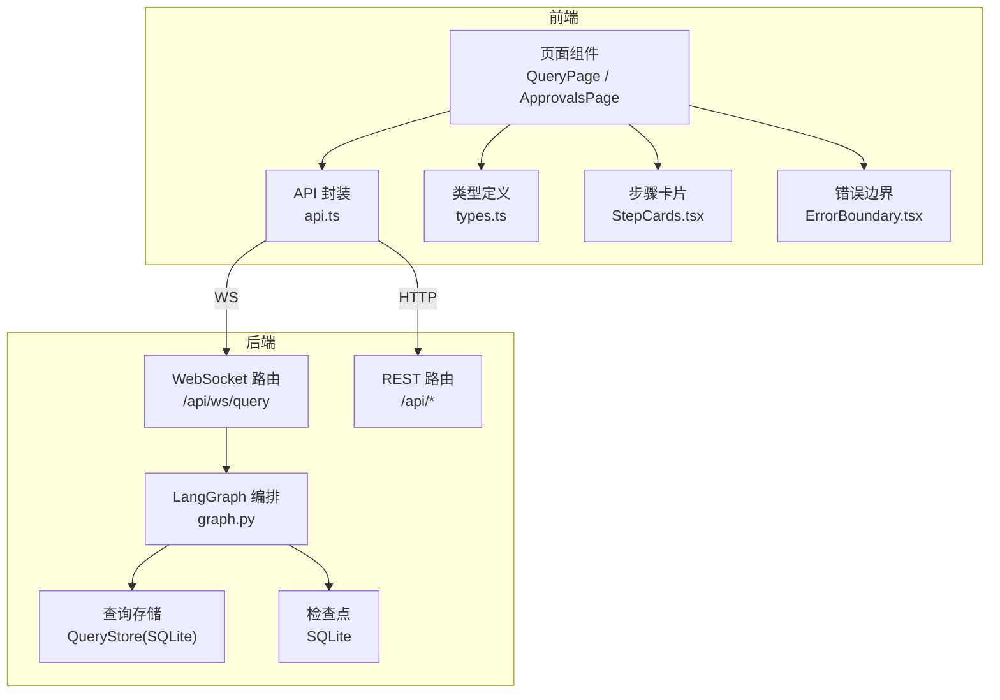
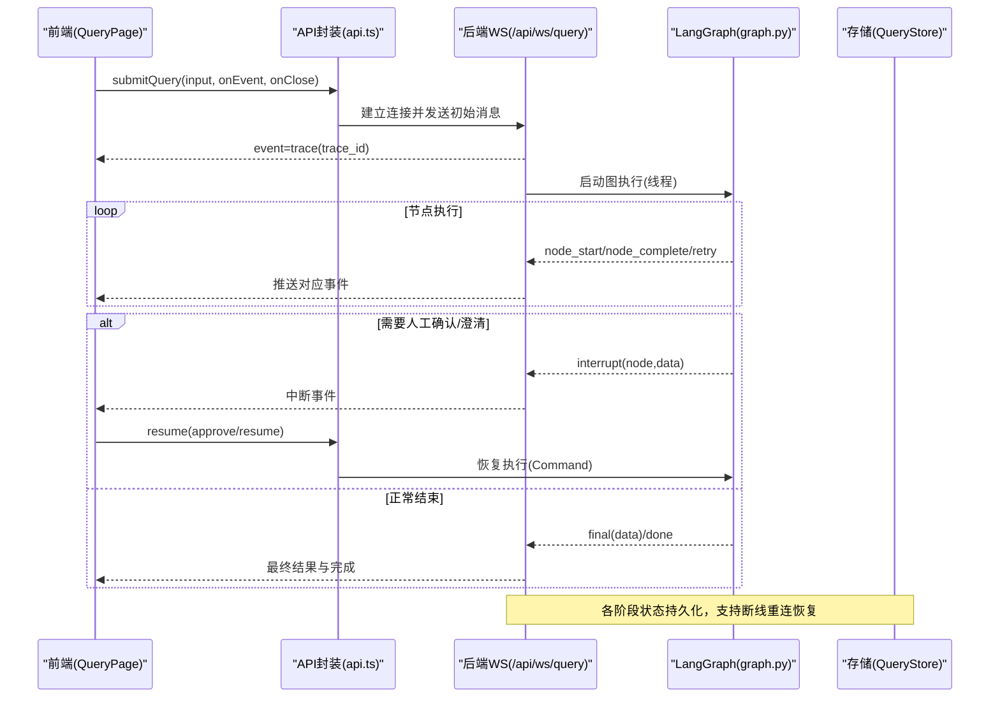
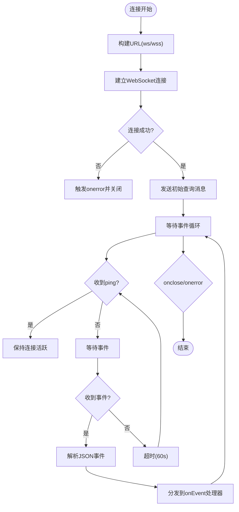
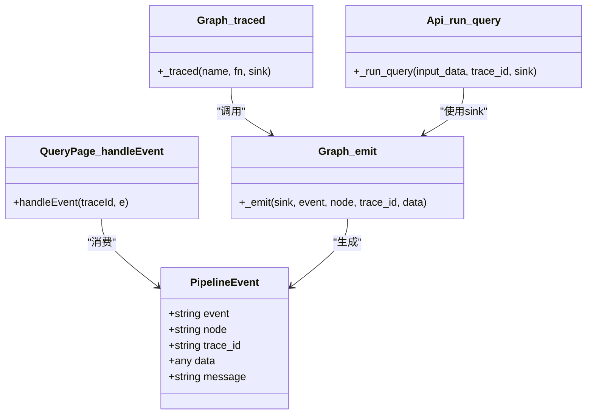
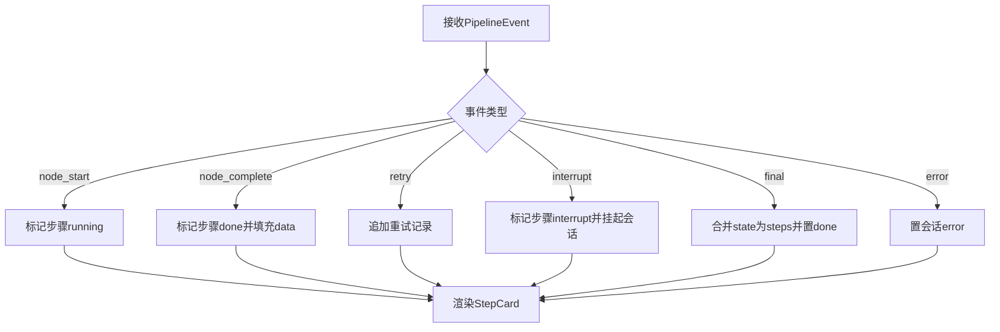
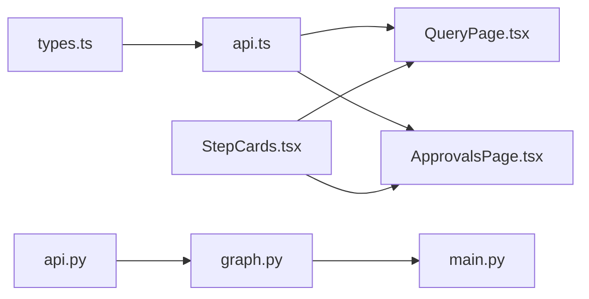

# 实时通信

<cite>
**本文引用的文件**   
- [api.ts](file://web/src/api.ts)
- [types.ts](file://web/src/types.ts)
- [QueryPage.tsx](file://web/src/pages/QueryPage.tsx)
- [ApprovalsPage.tsx](file://web/src/pages/ApprovalsPage.tsx)
- [StepCards.tsx](file://web/src/components/StepCards.tsx)
- [ErrorBoundary.tsx](file://web/src/components/ErrorBoundary.tsx)
- [App.tsx](file://web/src/App.tsx)
- [api.py](file://nl2sql_agent/api.py)
- [graph.py](file://nl2sql_agent/graph.py)
- [main.py](file://nl2sql_agent/main.py)
</cite>

## 目录
1. [简介](#简介)
2. [项目结构](#项目结构)
3. [核心组件](#核心组件)
4. [架构总览](#架构总览)
5. [详细组件分析](#详细组件分析)
6. [依赖关系分析](#依赖关系分析)
7. [性能考量](#性能考量)
8. [故障排查指南](#故障排查指南)
9. [结论](#结论)
10. [附录](#附录)

## 简介
本文件面向 NL2SQL 项目的“实时通信机制”，系统性阐述 WebSocket 连接管理、事件处理协议、REST API 封装层、StepCards 步骤可视化与 ErrorBoundary 错误边界，并给出调试、监控与排障建议。目标是帮助读者快速理解从前端到后端的端到端实时交互实现与最佳实践。

## 项目结构
本项目采用前后端分离：
- 前端（React + Vite）提供查询页面、审批队列、历史审计等界面，通过 REST 和 WebSocket 与后端交互。
- 后端（FastAPI）暴露 REST 接口与 WebSocket 流式推送，基于 LangGraph 编排多节点执行流程，并通过 SQLite 持久化状态与检查点。

图表来源 
- [api.ts:1-50](file://web/src/api.ts#L1-L50)
- [types.ts:1-72](file://web/src/types.ts#L1-L72)
- [QueryPage.tsx:1-574](file://web/src/pages/QueryPage.tsx#L1-L574)
- [ApprovalsPage.tsx:1-223](file://web/src/pages/ApprovalsPage.tsx#L1-L223)
- [StepCards.tsx:1-347](file://web/src/components/StepCards.tsx#L1-L347)
- [ErrorBoundary.tsx:1-37](file://web/src/components/ErrorBoundary.tsx#L1-L37)
- [api.py:1-573](file://nl2sql_agent/api.py#L1-L573)
- [graph.py:1-313](file://nl2sql_agent/graph.py#L1-L313)

章节来源
- [api.ts:1-50](file://web/src/api.ts#L1-L50)
- [types.ts:1-72](file://web/src/types.ts#L1-L72)
- [api.py:1-573](file://nl2sql_agent/api.py#L1-L573)
- [graph.py:1-313](file://nl2sql_agent/graph.py#L1-L313)

## 核心组件
- WebSocket 客户端封装：建立连接、发送初始请求、解析事件、关闭控制。
- 事件协议：统一的事件类型与字段规范，覆盖节点生命周期、重试、中断、最终结果与心跳。
- REST 封装：统一的请求函数、错误抛出、类型安全。
- 步骤可视化：将后端节点事件映射为前端步骤卡片，支持重试时间线、SQL 高亮、计划展示、结果表格等。
- 错误边界：捕获渲染异常，避免整页白屏。

章节来源
- [api.ts:1-50](file://web/src/api.ts#L1-L50)
- [types.ts:1-72](file://web/src/types.ts#L1-L72)
- [StepCards.tsx:1-347](file://web/src/components/StepCards.tsx#L1-L347)
- [ErrorBoundary.tsx:1-37](file://web/src/components/ErrorBoundary.tsx#L1-L37)

## 架构总览
整体数据流：
- 前端发起查询：REST 或 WebSocket。
- 后端通过 LangGraph 编排执行，按节点推送事件；必要时进入人工确认或澄清环节。
- 前端根据事件更新步骤状态，并在需要时调用恢复接口继续执行。
- 所有中间状态与结果落库，支持断线重连与历史恢复。

图表来源 
- [api.ts:30-49](file://web/src/api.ts#L30-L49)
- [api.py:161-221](file://nl2sql_agent/api.py#L161-L221)
- [graph.py:72-107](file://nl2sql_agent/graph.py#L72-L107)
- [QueryPage.tsx:291-333](file://web/src/pages/QueryPage.tsx#L291-L333)

## 详细组件分析

### WebSocket 连接管理
- 连接建立：前端根据当前协议选择 ws/wss，连接后端 /api/ws/query，打开后立即发送初始查询消息。
- 心跳检测：后端在 60 秒无事件时发送 ping，前端可据此判断连接存活。
- 自动重连与断线处理：
  - 前端未内置重连逻辑，但支持通过 REST 拉取 trace_id 对应的最新状态进行恢复。
  - 后端收到带 trace_id 的 WS 连接时，若存在记录则直接推送当前状态（final/interrupt/restore），便于前端做恢复。
- 关闭策略：onerror 主动关闭；onclose 触发回调，由上层决定是否需要重连。

图表来源 
- [api.ts:30-49](file://web/src/api.ts#L30-L49)
- [api.py:201-210](file://nl2sql_agent/api.py#L201-L210)

章节来源
- [api.ts:30-49](file://web/src/api.ts#L30-L49)
- [api.py:161-221](file://nl2sql_agent/api.py#L161-L221)

### 事件处理机制
- 事件类型：trace、node_start、node_complete、retry、interrupt、final、error、done、ping、restore。
- 字段规范：event、node、trace_id、data/message。
- 前端处理：
  - QueryPage 中 handleEvent 根据事件类型更新步骤状态、重试时间线、整体状态与元信息。
  - stepsFromState 将最终 state 还原为步骤集合，用于历史恢复与详情展示。
- 后端推送：
  - graph.py 在每个节点执行前后推送 node_start/node_complete，并记录耗时与顺序。
  - 路由包装器 _retry_route 在重试分支推送 retry 事件。
  - _run_query 在结束时推送 final/interrupt/error/done，并持久化状态。

图表来源 
- [types.ts:37-54](file://web/src/types.ts#L37-L54)
- [graph.py:72-107](file://nl2sql_agent/graph.py#L72-L107)
- [api.py:134-157](file://nl2sql_agent/api.py#L134-L157)
- [QueryPage.tsx:291-333](file://web/src/pages/QueryPage.tsx#L291-L333)

章节来源
- [types.ts:37-54](file://web/src/types.ts#L37-L54)
- [graph.py:72-107](file://nl2sql_agent/graph.py#L72-L107)
- [api.py:134-157](file://nl2sql_agent/api.py#L134-L157)
- [QueryPage.tsx:291-333](file://web/src/pages/QueryPage.tsx#L291-L333)

### REST API 调用封装层
- 请求封装：request 统一设置 Content-Type，非 ok 响应抛出包含 detail 的错误。
- 方法导出：apiGet、apiPost 泛型返回，便于类型推断。
- 错误处理：前端 try/catch 捕获错误，UI 提示用户；后端对非法状态返回 HTTP 异常。
- 加载状态：前端在各页面维护 loading 与状态标签，结合轮询获取 pending_review 的进度。
- 响应拦截：当前为简单封装，可在 request 中扩展鉴权、重试、日志等。

章节来源
- [api.ts:1-28](file://web/src/api.ts#L1-L28)
- [ApprovalsPage.tsx:42-87](file://web/src/pages/ApprovalsPage.tsx#L42-L87)
- [api.py:234-264](file://nl2sql_agent/api.py#L234-L264)

### StepCards 组件实现原理
- 步骤指示器：StepStatusTag 根据 status 显示不同徽标（执行中、完成、等待审批、失败）。
- 进度跟踪：RetryTimeline 展示每次重试的尝试次数与原因；Node 级别的耗时与顺序由 trace_steps 与 node_latencies 提供。
- 状态同步：stepsFromState 将后端 state 映射为步骤集合，确保历史恢复与详情一致。
- 内容展示：
  - SchemaRetrievalCard：检索到的表与字段摘要。
  - PlanCard：查询计划展示与反馈入口。
  - SqlCard：SQL 预览、复制与反馈。
  - ResultTable：结果表格展示。
  - AnswerCard：自然语言答案摘要。

图表来源 
- [StepCards.tsx:30-58](file://web/src/components/StepCards.tsx#L30-L58)
- [StepCards.tsx:298-333](file://web/src/components/StepCards.tsx#L298-L333)
- [QueryPage.tsx:58-77](file://web/src/pages/QueryPage.tsx#L58-L77)
- [QueryPage.tsx:291-333](file://web/src/pages/QueryPage.tsx#L291-L333)

章节来源
- [StepCards.tsx:1-347](file://web/src/components/StepCards.tsx#L1-L347)
- [QueryPage.tsx:58-77](file://web/src/pages/QueryPage.tsx#L58-L77)

### ErrorBoundary 错误捕获与恢复
- 捕获范围：包裹 App 的内容区域，当子树渲染出错时阻止崩溃。
- 展示方式：以 Alert 形式显示错误信息与堆栈，便于定位问题。
- 恢复策略：当前为展示错误，不自动恢复；可通过刷新页面或重置状态恢复。

章节来源
- [ErrorBoundary.tsx:1-37](file://web/src/components/ErrorBoundary.tsx#L1-L37)
- [App.tsx:47-53](file://web/src/App.tsx#L47-L53)

## 依赖关系分析
- 前端依赖：
  - types.ts 定义前后端共享类型，保证事件与记录结构一致性。
  - api.ts 提供 HTTP 与 WS 能力，被 QueryPage、ApprovalsPage 等页面引用。
  - StepCards.tsx 被 QueryPage 与 ApprovalsPage 复用，统一步骤展示。
- 后端依赖：
  - api.py 提供 WS 与 REST 路由，内部使用 graph.py 编排执行。
  - graph.py 定义节点与路由，注入 event_sink 推送事件，并使用 checkpointer 持久化状态。
  - main.py 作为 FastAPI 入口，注册路由与跨域配置。

图表来源 
- [types.ts:1-72](file://web/src/types.ts#L1-L72)
- [api.ts:1-50](file://web/src/api.ts#L1-L50)
- [QueryPage.tsx:1-574](file://web/src/pages/QueryPage.tsx#L1-L574)
- [ApprovalsPage.tsx:1-223](file://web/src/pages/ApprovalsPage.tsx#L1-L223)
- [StepCards.tsx:1-347](file://web/src/components/StepCards.tsx#L1-L347)
- [api.py:1-573](file://nl2sql_agent/api.py#L1-L573)
- [graph.py:1-313](file://nl2sql_agent/graph.py#L1-L313)
- [main.py:1-152](file://nl2sql_agent/main.py#L1-L152)

章节来源
- [types.ts:1-72](file://web/src/types.ts#L1-L72)
- [api.ts:1-50](file://web/src/api.ts#L1-L50)
- [api.py:1-573](file://nl2sql_agent/api.py#L1-L573)
- [graph.py:1-313](file://nl2sql_agent/graph.py#L1-L313)
- [main.py:1-152](file://nl2sql_agent/main.py#L1-L152)

## 性能考量
- 事件节流与裁剪：graph.py 对 execution_result 进行截断，避免大结果刷屏。
- 节点耗时统计：每个节点记录耗时，前端右侧面板展示，便于瓶颈定位。
- 心跳保活：后端每 60 秒发送 ping，降低空闲连接被网关回收的概率。
- 异步执行：后端在独立线程执行图，WS 协程仅负责事件转发，提升吞吐。
- 建议优化：
  - 前端增加 WS 重连与指数退避策略，提高网络抖动下的稳定性。
  - 在 request 中增加重试与幂等控制，增强健壮性。
  - 对长列表与大数据集分页/虚拟滚动，减少渲染压力。

[本节为通用指导，无需源码引用]

## 故障排查指南
- 常见问题
  - WS 连接失败：检查浏览器控制台网络面板，确认 ws/wss 协议与主机名正确。
  - 事件缺失：查看后端日志与 store 记录，确认是否因异常导致中断。
  - 状态不一致：通过 /api/query/{trace_id} 拉取最新状态，对比前端本地状态。
  - 审批卡住：确认 next_node 是否为 human_review/clarify_candidates/clarify_low_confidence，并调用 resume 接口恢复。
- 调试工具
  - 浏览器开发者工具：Network 面板观察 WS 帧与 HTTP 请求。
  - 后端日志：关注 approve/resume 执行输出与异常堆栈。
  - 存储查询：直接查看 SQLite 数据库中的 nl2sql.db 与 langgraph_checkpoints.db。
- 错误处理流程
  - 前端：catch 捕获错误并提示用户，必要时刷新历史会话。
  - 后端：异常路径写入 error 状态并推送 error 事件，finally 推送 done 结束连接。

章节来源
- [api.py:134-157](file://nl2sql_agent/api.py#L134-L157)
- [api.py:234-272](file://nl2sql_agent/api.py#L234-L272)
- [QueryPage.tsx:359-392](file://web/src/pages/QueryPage.tsx#L359-L392)
- [ApprovalsPage.tsx:59-87](file://web/src/pages/ApprovalsPage.tsx#L59-L87)

## 结论
本项目实现了稳定可靠的实时通信机制：前端通过简洁的 WS 封装与事件驱动的状态机，配合后端基于 LangGraph 的节点编排与持久化，形成完整的端到端流程。StepCards 提供了清晰的步骤可视化与反馈闭环，ErrorBoundary 提升了容错能力。建议在现有基础上进一步完善前端重连与请求重试策略，以提升鲁棒性与用户体验。

[本节为总结，无需源码引用]

## 附录
- API 参考
  - WebSocket：/api/ws/query（事件流）
  - REST：/api/query、/api/query/{trace_id}、/api/query/{trace_id}/approve、/api/query/{trace_id}/resume、/api/history、/api/approvals、/api/audit/{trace_id}、/api/feedback、/api/config/*、/api/schema/*
- 事件类型清单
  - trace、node_start、node_complete、retry、interrupt、final、error、done、ping、restore
- 关键类型
  - PipelineEvent、QueryRecord、SchemaHit、PIPELINE_NODES

[本节为补充信息，无需源码引用]