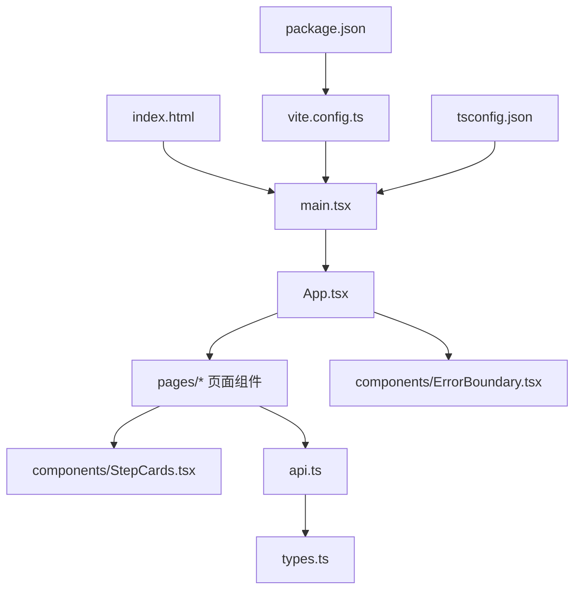
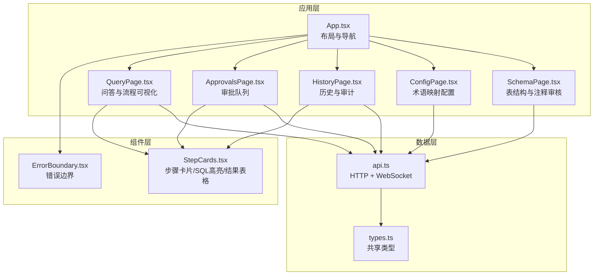
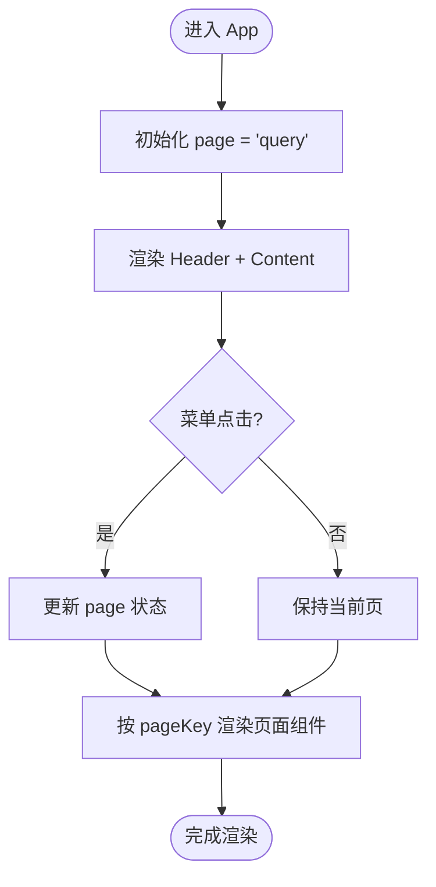
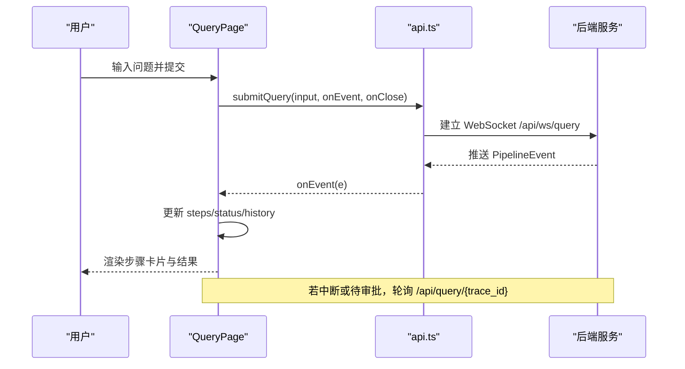
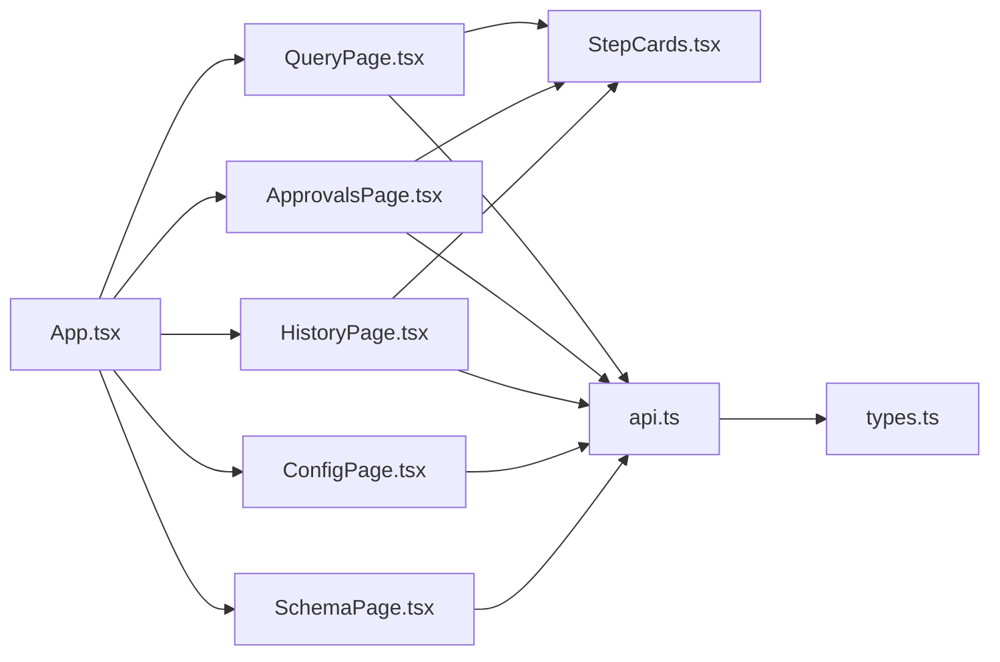

# 应用架构

<cite>
**本文引用的文件**   
- [web/src/main.tsx](file://web/src/main.tsx)
- [web/index.html](file://web/index.html)
- [web/vite.config.ts](file://web/vite.config.ts)
- [web/package.json](file://web/package.json)
- [web/tsconfig.json](file://web/tsconfig.json)
- [web/src/App.tsx](file://web/src/App.tsx)
- [web/src/types.ts](file://web/src/types.ts)
- [web/src/api.ts](file://web/src/api.ts)
- [web/src/components/ErrorBoundary.tsx](file://web/src/components/ErrorBoundary.tsx)
- [web/src/components/StepCards.tsx](file://web/src/components/StepCards.tsx)
- [web/src/pages/QueryPage.tsx](file://web/src/pages/QueryPage.tsx)
- [web/src/pages/ApprovalsPage.tsx](file://web/src/pages/ApprovalsPage.tsx)
- [web/src/pages/HistoryPage.tsx](file://web/src/pages/HistoryPage.tsx)
- [web/src/pages/ConfigPage.tsx](file://web/src/pages/ConfigPage.tsx)
- [web/src/pages/SchemaPage.tsx](file://web/src/pages/SchemaPage.tsx)
</cite>

## 目录
1. [简介](#简介)
2. [项目结构](#项目结构)
3. [核心组件](#核心组件)
4. [架构总览](#架构总览)
5. [详细组件分析](#详细组件分析)
6. [依赖关系分析](#依赖关系分析)
7. [性能与构建优化](#性能与构建优化)
8. [故障排查指南](#故障排查指南)
9. [结论](#结论)
10. [附录：扩展指南](#附录扩展指南)

## 简介
本文件面向前端 React + TypeScript 应用，系统化阐述整体架构、入口点、页面与路由（基于状态切换）、状态管理、组件层次、类型系统、Vite 构建配置、错误边界、性能优化与代码分割策略，并提供扩展新页面与功能模块的实践指南。文档兼顾初学者理解与资深开发者最佳实践参考。

## 项目结构
前端工程位于 web 目录，采用 Vite + React + TypeScript 技术栈，UI 使用 Ant Design 5，通过 WebSocket 与后端进行实时交互，REST API 用于历史查询、审批、配置与 Schema 管理等。

图表来源
- [web/index.html:1-13](file://web/index.html#L1-L13)
- [web/src/main.tsx:1-15](file://web/src/main.tsx#L1-L15)
- [web/src/App.tsx:1-58](file://web/src/App.tsx#L1-L58)
- [web/src/api.ts:1-50](file://web/src/api.ts#L1-L50)
- [web/src/types.ts:1-72](file://web/src/types.ts#L1-L72)
- [web/vite.config.ts:1-21](file://web/vite.config.ts#L1-L21)
- [web/package.json:1-26](file://web/package.json#L1-L26)
- [web/tsconfig.json:1-21](file://web/tsconfig.json#L1-L21)

章节来源
- [web/index.html:1-13](file://web/index.html#L1-L13)
- [web/src/main.tsx:1-15](file://web/src/main.tsx#L1-L15)
- [web/vite.config.ts:1-21](file://web/vite.config.ts#L1-L21)
- [web/package.json:1-26](file://web/package.json#L1-L26)
- [web/tsconfig.json:1-21](file://web/tsconfig.json#L1-L21)

## 核心组件
- 应用入口与国际化配置：main.tsx 初始化 React 根节点并注入 Ant Design 中文本地化。
- 主应用布局与导航：App.tsx 使用 Ant Design Layout + Menu 实现顶部导航与内容区渲染，通过内部 state 切换页面。
- 错误边界：ErrorBoundary 捕获子树渲染异常，避免白屏。
- 通用步骤卡片：StepCards.tsx 提供步骤状态徽标、SQL 高亮、计划展示、结果表格、重试时间线等复用组件。
- 类型定义：types.ts 统一前后端共享的 QueryRecord、PipelineEvent、SchemaHit 等类型及 Pipeline 节点顺序。
- API 层：api.ts 封装 fetch 请求与 WebSocket 提交查询，提供 apiGet、apiPost、submitQuery。

章节来源
- [web/src/main.tsx:1-15](file://web/src/main.tsx#L1-L15)
- [web/src/App.tsx:1-58](file://web/src/App.tsx#L1-L58)
- [web/src/components/ErrorBoundary.tsx:1-37](file://web/src/components/ErrorBoundary.tsx#L1-L37)
- [web/src/components/StepCards.tsx:1-347](file://web/src/components/StepCards.tsx#L1-L347)
- [web/src/types.ts:1-72](file://web/src/types.ts#L1-L72)
- [web/src/api.ts:1-50](file://web/src/api.ts#L1-L50)

## 架构总览
前端以 App 为根容器，通过内部状态驱动页面切换；各页面组件负责具体业务逻辑与 UI 呈现；API 层统一处理 HTTP 与 WebSocket 通信；类型系统贯穿数据模型与接口契约。

图表来源
- [web/src/App.tsx:1-58](file://web/src/App.tsx#L1-L58)
- [web/src/components/ErrorBoundary.tsx:1-37](file://web/src/components/ErrorBoundary.tsx#L1-L37)
- [web/src/components/StepCards.tsx:1-347](file://web/src/components/StepCards.tsx#L1-L347)
- [web/src/api.ts:1-50](file://web/src/api.ts#L1-L50)
- [web/src/types.ts:1-72](file://web/src/types.ts#L1-L72)
- [web/src/pages/QueryPage.tsx:1-574](file://web/src/pages/QueryPage.tsx#L1-L574)
- [web/src/pages/ApprovalsPage.tsx:1-223](file://web/src/pages/ApprovalsPage.tsx#L1-L223)
- [web/src/pages/HistoryPage.tsx:1-179](file://web/src/pages/HistoryPage.tsx#L1-L179)
- [web/src/pages/ConfigPage.tsx:1-136](file://web/src/pages/ConfigPage.tsx#L1-L136)
- [web/src/pages/SchemaPage.tsx:1-355](file://web/src/pages/SchemaPage.tsx#L1-L355)

## 详细组件分析

### App.tsx 主应用组件
- 设计模式：单页应用内状态驱动的路由切换，使用 Ant Design Layout + Menu 实现顶部导航与内容区。
- 页面切换机制：useState 维护当前 pageKey，根据 key 条件渲染对应页面组件。
- 菜单导航实现：Menu 的 selectedKeys 绑定当前页，点击更新 state。
- 布局结构设计：Header 包含标题与水平菜单，Content 区域包裹 ErrorBoundary 确保局部错误不影响全局。

图表来源
- [web/src/App.tsx:1-58](file://web/src/App.tsx#L1-L58)

章节来源
- [web/src/App.tsx:1-58](file://web/src/App.tsx#L1-L58)

### QueryPage.tsx 问答与流程可视化
- 会话与步骤状态：维护 sessions、activeTrace、history、dataScope、input 等状态；将后端事件转换为 StepState 并渲染 StepCard。
- WebSocket 事件处理：submitQuery 建立 WS 连接，onmessage 解析 PipelineEvent，更新步骤状态与整体状态。
- 历史恢复与轮询：打开历史时拉取完整记录，若 pending_review 则定时轮询直至 done/error。
- 用户交互：输入自然语言提问，选择 data_scope，提交后实时更新步骤进度与结果。

图表来源
- [web/src/pages/QueryPage.tsx:1-574](file://web/src/pages/QueryPage.tsx#L1-L574)
- [web/src/api.ts:1-50](file://web/src/api.ts#L1-L50)

章节来源
- [web/src/pages/QueryPage.tsx:1-574](file://web/src/pages/QueryPage.tsx#L1-L574)

### ApprovalsPage.tsx 审批队列
- 列表与详情：定时刷新待审批列表，点击查看详情 Drawer，复用 StepCard 展示 pipeline 过程。
- 审批操作：支持通过/驳回，驳回需填写原因；通过后自动继续执行并刷新状态。
- 紧急提示：等待超过阈值标记为紧急，提升关注。

章节来源
- [web/src/pages/ApprovalsPage.tsx:1-223](file://web/src/pages/ApprovalsPage.tsx#L1-L223)

### HistoryPage.tsx 历史与审计
- 过滤与导出：支持按用户、业务线、时间范围过滤，导出 CSV 审计记录。
- 审计详情：拉取审计详情，展示各节点耗时、pipeline 过程与用户反馈。

章节来源
- [web/src/pages/HistoryPage.tsx:1-179](file://web/src/pages/HistoryPage.tsx#L1-L179)

### ConfigPage.tsx 术语映射配置
- 配置项编辑：按业务线加载术语映射，支持在线编辑 definition、resolved_fields、composite_metric。
- 安全控制：需要管理 Token（X-Admin-Token），保存后热更新无需重启服务。

章节来源
- [web/src/pages/ConfigPage.tsx:1-136](file://web/src/pages/ConfigPage.tsx#L1-L136)

### SchemaPage.tsx 表结构与注释审核
- 表结构浏览：查看表与字段信息，补充/修改注释写入覆盖层。
- 审核队列：LLM 生成候选注释，人工通过/驳回；支持重新入库应用已确认注释。

章节来源
- [web/src/pages/SchemaPage.tsx:1-355](file://web/src/pages/SchemaPage.tsx#L1-L355)

### components/StepCards.tsx 通用步骤卡片
- 步骤状态徽标：running/done/interrupt/error 等状态标签。
- SQL 高亮：轻量关键字着色，便于阅读。
- 计划与结果：PlanCard 展示查询计划与置信度；ResultTable 动态列展示结果集。
- 重试时间线：展示系统重试次数与原因。
- 答案摘要：AnswerCard 展示最终解释文本。

章节来源
- [web/src/components/StepCards.tsx:1-347](file://web/src/components/StepCards.tsx#L1-L347)

### types.ts 类型定义系统
- 共享模型：SchemaHit、QueryRecord、PipelineEvent 等与后端对齐。
- 节点顺序：PIPELINE_NODES 定义各阶段标题与顺序，供页面渲染一致。
- 类型安全：严格 TS 配置，跨模块引用保证数据结构一致性。

章节来源
- [web/src/types.ts:1-72](file://web/src/types.ts#L1-L72)

### api.ts API 层
- HTTP 封装：apiGet、apiPost 统一请求头与错误处理。
- WebSocket：submitQuery 建立连接、发送输入、接收事件流、关闭与错误处理。
- 控制器：返回 QueryController 以便主动关闭连接。

章节来源
- [web/src/api.ts:1-50](file://web/src/api.ts#L1-L50)

### ErrorBoundary.tsx 错误边界
- 捕获渲染异常：getDerivedStateFromError 捕获错误并显示 Alert 与堆栈。
- 隔离影响：仅影响被包裹的子树，避免整页崩溃。

章节来源
- [web/src/components/ErrorBoundary.tsx:1-37](file://web/src/components/ErrorBoundary.tsx#L1-L37)

## 依赖关系分析
- 组件耦合：App 与页面组件低耦合，通过 props/state 传递；页面组件复用 StepCards 减少重复。
- API 依赖：所有页面通过 api.ts 访问后端，集中处理错误与类型。
- 类型依赖：types.ts 作为单一事实源，避免类型漂移。

图表来源
- [web/src/App.tsx:1-58](file://web/src/App.tsx#L1-L58)
- [web/src/pages/QueryPage.tsx:1-574](file://web/src/pages/QueryPage.tsx#L1-L574)
- [web/src/pages/ApprovalsPage.tsx:1-223](file://web/src/pages/ApprovalsPage.tsx#L1-L223)
- [web/src/pages/HistoryPage.tsx:1-179](file://web/src/pages/HistoryPage.tsx#L1-L179)
- [web/src/pages/ConfigPage.tsx:1-136](file://web/src/pages/ConfigPage.tsx#L1-L136)
- [web/src/pages/SchemaPage.tsx:1-355](file://web/src/pages/SchemaPage.tsx#L1-L355)
- [web/src/components/StepCards.tsx:1-347](file://web/src/components/StepCards.tsx#L1-L347)
- [web/src/api.ts:1-50](file://web/src/api.ts#L1-L50)
- [web/src/types.ts:1-72](file://web/src/types.ts#L1-L72)

章节来源
- [web/src/App.tsx:1-58](file://web/src/App.tsx#L1-L58)
- [web/src/api.ts:1-50](file://web/src/api.ts#L1-L50)
- [web/src/types.ts:1-72](file://web/src/types.ts#L1-L72)

## 性能与构建优化
- 构建工具：Vite 插件 react，开发服务器监听 0.0.0.0:5173，代理 /api 到后端并启用 ws。
- 类型检查：TypeScript 严格模式，isolatedModules、noEmit 配合 vite build 编译。
- 包管理：React 18、Ant Design 5、dayjs 等依赖明确，脚本 dev/build/preview。
- 代码分割建议：对大组件（如 QueryPage）使用 React.lazy + Suspense 按需加载；对 StepCards 中重型部分可进一步拆分。
- 运行时优化：避免不必要的重渲染，合理使用 useMemo/useCallback；WebSocket 事件处理去抖与节流；长列表分页与虚拟滚动。

章节来源
- [web/vite.config.ts:1-21](file://web/vite.config.ts#L1-L21)
- [web/package.json:1-26](file://web/package.json#L1-L26)
- [web/tsconfig.json:1-21](file://web/tsconfig.json#L1-L21)

## 故障排查指南
- 错误边界：页面渲染异常会显示错误信息与堆栈，便于定位问题。
- API 错误：统一抛出 detail 或 HTTP 状态码，页面应捕获并提示用户。
- WebSocket 断线：onclose/onerror 触发关闭，必要时重连或回退轮询。
- 审批与历史：pending_review 状态需轮询，注意定时器清理。

章节来源
- [web/src/components/ErrorBoundary.tsx:1-37](file://web/src/components/ErrorBoundary.tsx#L1-L37)
- [web/src/api.ts:1-50](file://web/src/api.ts#L1-L50)
- [web/src/pages/QueryPage.tsx:1-574](file://web/src/pages/QueryPage.tsx#L1-L574)
- [web/src/pages/ApprovalsPage.tsx:1-223](file://web/src/pages/ApprovalsPage.tsx#L1-L223)

## 结论
该前端应用采用清晰的模块化与类型化设计，通过状态驱动的路由切换与统一的 API 层，实现了问答、审批、历史审计、配置管理与 Schema 审核等功能。错误边界保障稳定性，Vite 与 TypeScript 提升开发与构建效率。建议在后续迭代中引入懒加载与更细粒度的组件拆分，进一步优化性能与可维护性。

## 附录：扩展指南
- 添加新页面
  - 在 pages 下新建页面组件，遵循现有页面结构与状态管理模式。
  - 在 App.tsx 的 PageKey 联合类型中添加新键，并在 Menu items 中注册导航项。
  - 在 Content 区域按 key 条件渲染新页面组件。
- 新增 API 能力
  - 在 api.ts 中封装新的请求方法，统一错误处理与类型约束。
  - 在 types.ts 中定义相关数据结构，确保前后端一致。
- 复用通用组件
  - 优先使用 StepCards.tsx 中的组件，减少重复代码。
  - 如需新增步骤卡片，遵循 StepState 与 PIPELINE_NODES 约定。
- 类型安全实践
  - 所有外部数据必须经过类型校验，避免 any。
  - 使用泛型与接口约束 API 返回值与事件结构。
- 性能优化
  - 对大数据量列表使用分页与虚拟滚动。
  - 对频繁计算的状态使用 useMemo/useCallback。
  - 对大型组件使用 React.lazy + Suspense 进行代码分割。