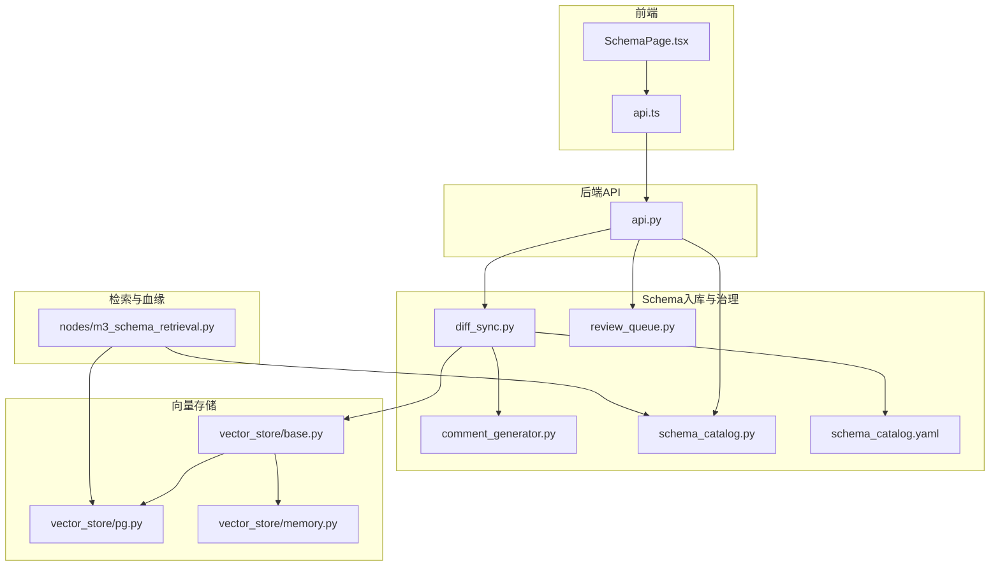
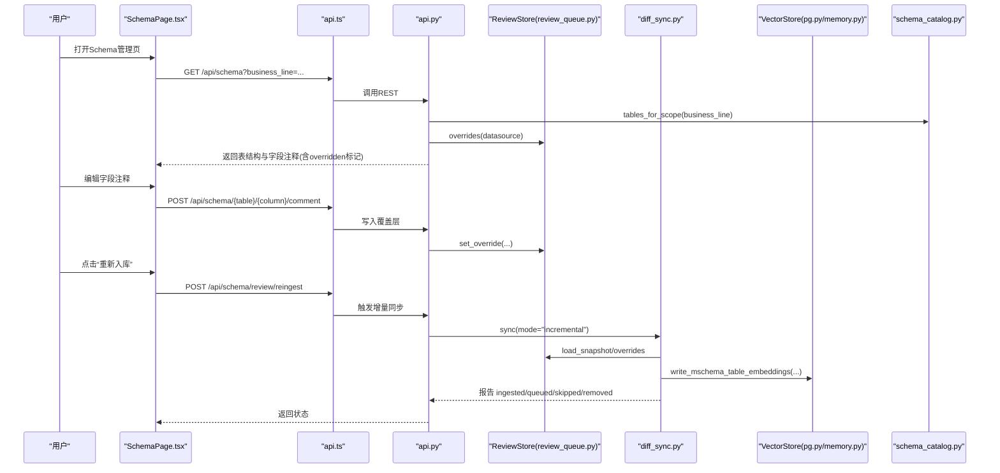
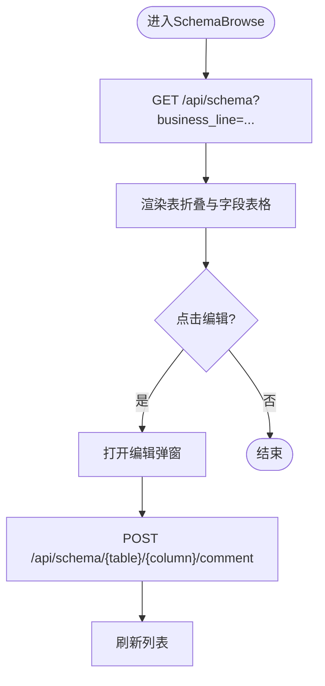
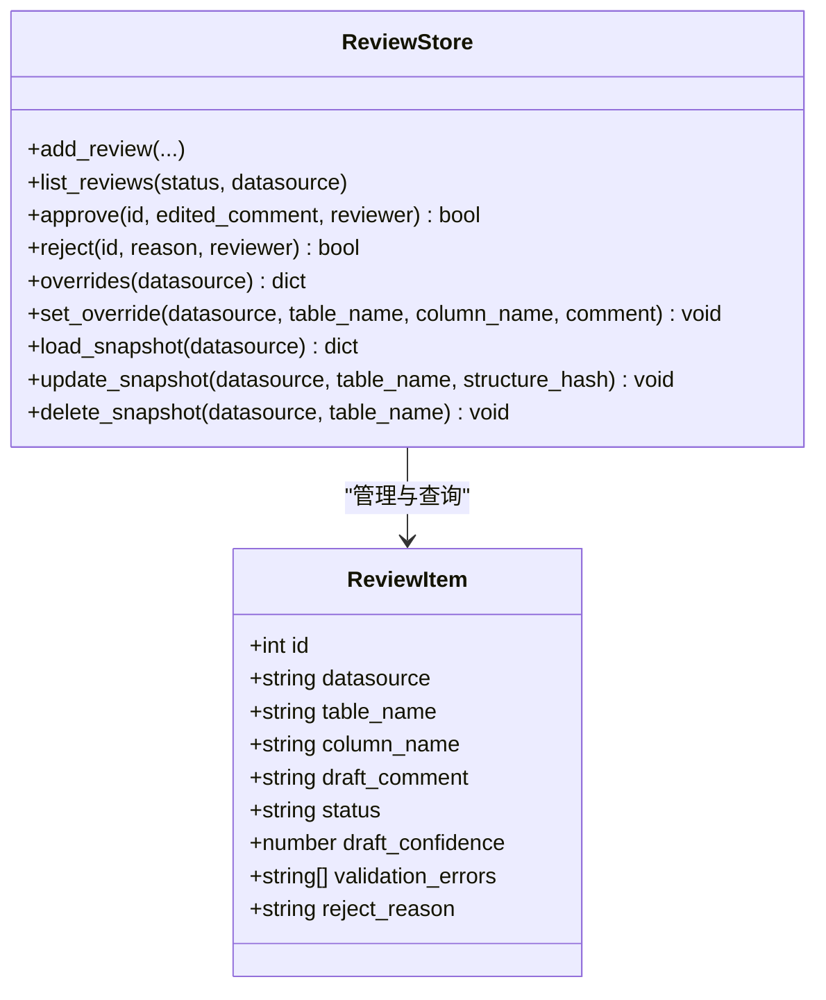
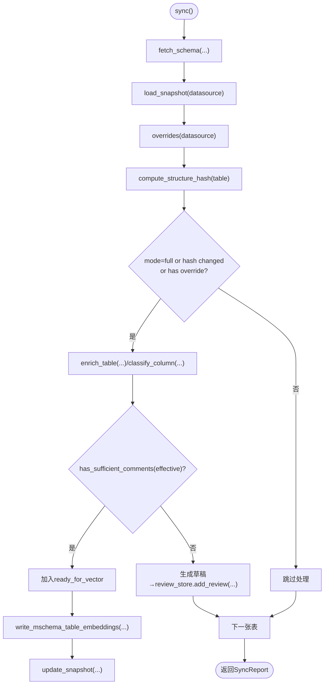
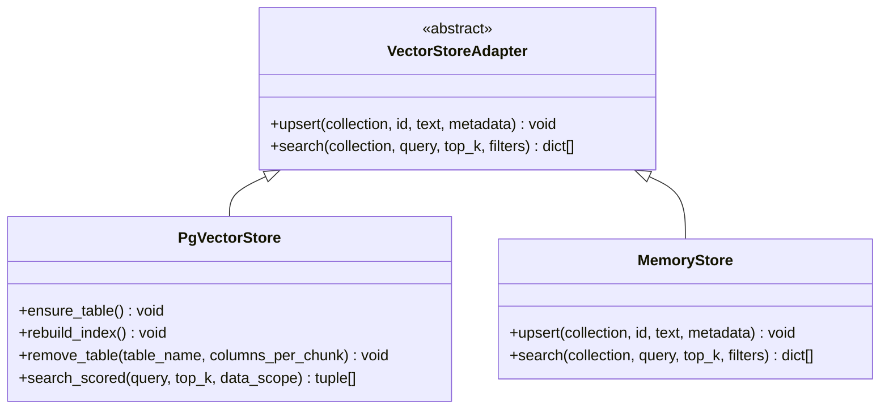
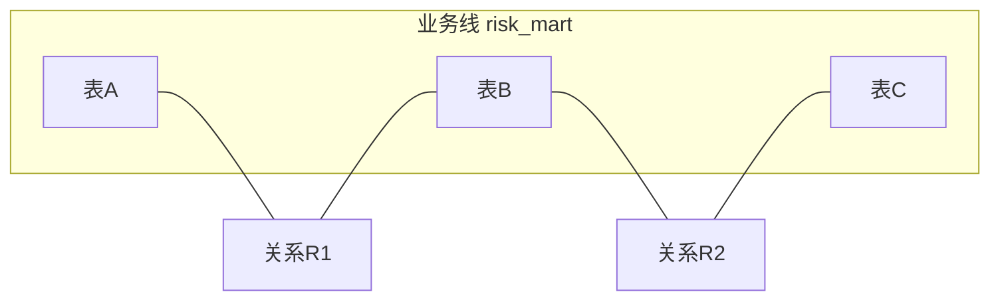
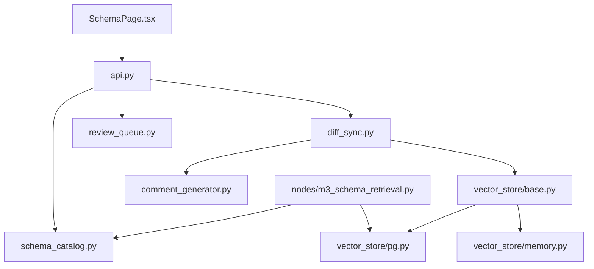

# Schema管理页面

<cite>
**本文引用的文件**   
- [SchemaPage.tsx](file://web/src/pages/SchemaPage.tsx)
- [api.ts](file://web/src/api.ts)
- [api.py](file://nl2sql_agent/api.py)
- [diff_sync.py](file://nl2sql_agent/services/schema_ingest/diff_sync.py)
- [review_queue.py](file://nl2sql_agent/services/schema_ingest/review_queue.py)
- [comment_generator.py](file://nl2sql_agent/services/schema_ingest/comment_generator.py)
- [base.py](file://nl2sql_agent/services/vector_store/base.py)
- [pg.py](file://nl2sql_agent/services/vector_store/pg.py)
- [memory.py](file://nl2sql_agent/services/vector_store/memory.py)
- [schema_catalog.py](file://nl2sql_agent/services/schema_catalog.py)
- [schema_catalog.yaml](file://nl2sql_agent/config/schema_catalog.yaml)
- [m3_schema_retrieval.py](file://nl2sql_agent/nodes/m3_schema_retrieval.py)
- [schema_metrics.py](file://nl2sql_agent/eval/schema_metrics.py)
</cite>

## 目录
1. [简介](#简介)
2. [项目结构](#项目结构)
3. [核心组件](#核心组件)
4. [架构总览](#架构总览)
5. [详细组件分析](#详细组件分析)
6. [依赖关系分析](#依赖关系分析)
7. [性能考量](#性能考量)
8. [故障排查指南](#故障排查指南)
9. [结论](#结论)
10. [附录](#附录)

## 简介
本文件为“Schema管理页面”的完整技术文档，覆盖以下目标：
- 数据库表结构的可视化展示（表信息、字段定义、索引与约束）
- 表注释编辑能力（批量编辑、智能建议、版本管理）
- Schema同步机制（自动检测变更、增量同步、冲突解决）
- 向量存储管理（嵌入生成、更新与检索优化）
- 数据血缘关系展示（表依赖、字段映射、业务线划分）
- Schema质量评估、完整性检查与性能优化建议
- Schema设计规范与数据治理最佳实践

该页面面向数据工程师与业务分析师，提供对多业务线Schema的统一浏览、审核与治理入口。

## 项目结构
前端通过React+Ant Design构建Schema管理页，后端基于FastAPI暴露REST接口，服务层负责Schema抽取、质量校验、LLM辅助注释生成、审核队列与覆盖层管理，向量库用于语义检索与索引。

图表来源
- [SchemaPage.tsx:1-355](file://web/src/pages/SchemaPage.tsx#L1-L355)
- [api.ts:1-50](file://web/src/api.ts#L1-L50)
- [api.py:450-573](file://nl2sql_agent/api.py#L450-L573)
- [diff_sync.py:155-317](file://nl2sql_agent/services/schema_ingest/diff_sync.py#L155-L317)
- [review_queue.py:1-207](file://nl2sql_agent/services/schema_ingest/review_queue.py#L1-L207)
- [comment_generator.py:1-328](file://nl2sql_agent/services/schema_ingest/comment_generator.py#L1-L328)
- [base.py:1-21](file://nl2sql_agent/services/vector_store/base.py#L1-L21)
- [pg.py:1-174](file://nl2sql_agent/services/vector_store/pg.py#L1-L174)
- [memory.py:33-67](file://nl2sql_agent/services/vector_store/memory.py#L33-L67)
- [schema_catalog.py:1-126](file://nl2sql_agent/services/schema_catalog.py#L1-L126)
- [schema_catalog.yaml:1-800](file://nl2sql_agent/config/schema_catalog.yaml#L1-L800)
- [m3_schema_retrieval.py:163-176](file://nl2sql_agent/nodes/m3_schema_retrieval.py#L163-L176)

章节来源
- [SchemaPage.tsx:1-355](file://web/src/pages/SchemaPage.tsx#L1-L355)
- [api.py:450-573](file://nl2sql_agent/api.py#L450-L573)

## 核心组件
- 前端Schema浏览与审核界面：支持按业务线切换、表折叠展开、字段级注释补充、待审核队列操作与重新入库。
- REST API层：提供Schema读取、评论写入、审核审批/驳回、重新入库等接口。
- Schema入库编排：全量/增量同步、质量门禁、LLM草稿生成、审核队列、覆盖层应用、向量索引构建。
- 审核队列与覆盖层：SQLite持久化，记录草稿、最终注释与结构快照，支撑增量同步。
- 向量存储抽象与实现：统一接口，内存与PostgreSQL pgvector两种后端，支持upsert/search与scored检索。
- Schema目录：从YAML加载各业务线表结构，支持共享表与业务线过滤。
- 血缘与检索：基于有效M-Schema构建图关系，结合向量检索进行表级命中排序。

章节来源
- [SchemaPage.tsx:55-175](file://web/src/pages/SchemaPage.tsx#L55-L175)
- [SchemaPage.tsx:179-324](file://web/src/pages/SchemaPage.tsx#L179-L324)
- [api.py:458-573](file://nl2sql_agent/api.py#L458-L573)
- [diff_sync.py:155-317](file://nl2sql_agent/services/schema_ingest/diff_sync.py#L155-L317)
- [review_queue.py:19-207](file://nl2sql_agent/services/schema_ingest/review_queue.py#L19-L207)
- [comment_generator.py:22-54](file://nl2sql_agent/services/schema_ingest/comment_generator.py#L22-L54)
- [base.py:11-21](file://nl2sql_agent/services/vector_store/base.py#L11-L21)
- [pg.py:15-174](file://nl2sql_agent/services/vector_store/pg.py#L15-L174)
- [schema_catalog.py:27-126](file://nl2sql_agent/services/schema_catalog.py#L27-L126)

## 架构总览
下图展示了Schema管理页面的端到端流程：前端请求→后端API→Schema目录/审核队列→入库编排→向量存储→血缘检索。

图表来源
- [SchemaPage.tsx:65-93](file://web/src/pages/SchemaPage.tsx#L65-L93)
- [SchemaPage.tsx:230-236](file://web/src/pages/SchemaPage.tsx#L230-L236)
- [api.ts:15-17](file://web/src/api.ts#L15-L17)
- [api.py:458-573](file://nl2sql_agent/api.py#L458-L573)
- [diff_sync.py:155-317](file://nl2sql_agent/services/schema_ingest/diff_sync.py#L155-L317)
- [review_queue.py:160-207](file://nl2sql_agent/services/schema_ingest/review_queue.py#L160-L207)
- [pg.py:90-113](file://nl2sql_agent/services/vector_store/pg.py#L90-L113)
- [schema_catalog.py:52-62](file://nl2sql_agent/services/schema_catalog.py#L52-L62)

## 详细组件分析

### 表结构浏览与字段注释编辑
- 功能要点
  - 按业务线加载表结构，显示表名、列数、表注释、字段名、类型、有效注释、敏感标记、是否被覆盖。
  - 支持单条或批量编辑字段注释，保存后写入系统覆盖层（不改动数据库DDL）。
  - 提供“重新入库”按钮，将已确认的覆盖层注释应用到schema_catalog与向量索引。
- 关键交互
  - 前端通过GET /api/schema获取结构化数据；POST /api/schema/{table}/{column}/comment写入覆盖层。
  - 审核队列支持“通过/驳回”，通过后写入覆盖层并可在重新入库时生效。
- 数据结构
  - TableInfo包含table_name、comment、columns数组；ColumnInfo包含name、type、comment、eff_comment、overridden、sensitive。

图表来源
- [SchemaPage.tsx:65-93](file://web/src/pages/SchemaPage.tsx#L65-L93)
- [SchemaPage.tsx:112-147](file://web/src/pages/SchemaPage.tsx#L112-L147)
- [api.py:526-541](file://nl2sql_agent/api.py#L526-L541)

章节来源
- [SchemaPage.tsx:55-175](file://web/src/pages/SchemaPage.tsx#L55-L175)
- [api.py:458-541](file://nl2sql_agent/api.py#L458-L541)

### 待审核注释队列与版本管理
- 功能要点
  - 展示LLM生成的候选注释草稿，包括置信度、证据、验证错误。
  - 支持通过（可编辑最终注释）与驳回（必填原因），通过后写入覆盖层。
  - 支持“重新入库”以应用已确认注释到schema_catalog与向量索引。
- 数据结构
  - ReviewItem包含id、datasource、table_name、column_name、draft_comment、status、draft_confidence、validation_errors、reject_reason。
- 版本管理
  - 覆盖层与结构快照分离：覆盖层维护最终注释，快照维护structure_hash用于增量同步。

图表来源
- [SchemaPage.tsx:179-324](file://web/src/pages/SchemaPage.tsx#L179-L324)
- [review_queue.py:19-207](file://nl2sql_agent/services/schema_ingest/review_queue.py#L19-L207)

章节来源
- [SchemaPage.tsx:179-324](file://web/src/pages/SchemaPage.tsx#L179-L324)
- [review_queue.py:19-207](file://nl2sql_agent/services/schema_ingest/review_queue.py#L19-L207)

### Schema同步机制（自动检测、增量同步、冲突解决）
- 自动检测变更
  - 计算structure_hash（表名、注释、主键、唯一键、索引、关系、字段元信息），对比快照判断是否变化。
- 增量同步
  - 仅处理changed_names中的表；未变化表复用上一版本画像与分类结果。
  - 删除的表清理向量库条目与快照。
- 冲突解决
  - 覆盖层优先：effective = apply_override(table, override)，确保人工修正生效。
  - 质量门禁：has_sufficient_comments决定直接入库或进入审核队列。
  - 向量写入失败时回滚快照推进，保证下次增量重试。

图表来源
- [diff_sync.py:51-84](file://nl2sql_agent/services/schema_ingest/diff_sync.py#L51-L84)
- [diff_sync.py:155-317](file://nl2sql_agent/services/schema_ingest/diff_sync.py#L155-L317)
- [comment_generator.py:247-307](file://nl2sql_agent/services/schema_ingest/comment_generator.py#L247-L307)

章节来源
- [diff_sync.py:155-317](file://nl2sql_agent/services/schema_ingest/diff_sync.py#L155-L317)
- [comment_generator.py:22-54](file://nl2sql_agent/services/schema_ingest/comment_generator.py#L22-L54)

### 向量存储管理（嵌入生成、更新与检索优化）
- 统一接口
  - VectorStoreAdapter定义upsert与search方法，屏蔽后端差异。
- 实现
  - PgVectorStore：使用pgvector，余弦距离检索，支持collection过滤business_line。
  - MemoryStore：内存实现，适合测试与快速验证。
- 更新策略
  - 增量写入：仅对ready_for_vector的表构建embedding；删除表清理对应collection条目。
  - 全量重建：rebuild_index优先从effective M-Schema恢复，避免重复计算。
- 检索优化
  - search_scored先按catalog过滤表集合，再执行向量相似度排序，减少无关扫描。

图表来源
- [base.py:11-21](file://nl2sql_agent/services/vector_store/base.py#L11-L21)
- [pg.py:15-174](file://nl2sql_agent/services/vector_store/pg.py#L15-L174)
- [memory.py:33-67](file://nl2sql_agent/services/vector_store/memory.py#L33-L67)

章节来源
- [base.py:11-21](file://nl2sql_agent/services/vector_store/base.py#L11-L21)
- [pg.py:15-174](file://nl2sql_agent/services/vector_store/pg.py#L15-L174)
- [memory.py:33-67](file://nl2sql_agent/services/vector_store/memory.py#L33-L67)

### 数据血缘关系展示（表依赖、字段映射、业务线划分）
- 血缘来源
  - effective M-Schema中relations字段描述表间依赖；catalog按business_line组织表集合。
- 血缘构建
  - m3_schema_retrieval节点从mschema加载relations，构建双向邻接图，限制在available表内。
- 业务线划分
  - schema_catalog.tables_for_scope(data_scope)聚合指定业务线与共享表，供检索与权限控制。

图表来源
- [m3_schema_retrieval.py:163-176](file://nl2sql_agent/nodes/m3_schema_retrieval.py#L163-L176)
- [schema_catalog.py:52-62](file://nl2sql_agent/services/schema_catalog.py#L52-L62)

章节来源
- [m3_schema_retrieval.py:163-176](file://nl2sql_agent/nodes/m3_schema_retrieval.py#L163-L176)
- [schema_catalog.py:27-62](file://nl2sql_agent/services/schema_catalog.py#L27-L62)

### Schema质量评估、完整性检查与性能优化建议
- 质量规则
  - 表注释长度阈值、通用注释黑名单、字段覆盖率阈值、要求所有字段具备有效描述。
- 指标体系
  - 表召回@K、字段召回、连接路径准确率、SQL执行准确率、澄清率、人工修改率、平均LLM成本/表、平均画像耗时/表。
- 优化建议
  - 增量同步优先，减少重复画像与LLM调用。
  - 合理设置columns_per_chunk与batch_size，降低单次输出长度与失败风险。
  - 使用pgvector进行大规模检索，内存模式仅用于测试。

章节来源
- [comment_generator.py:22-54](file://nl2sql_agent/services/schema_ingest/comment_generator.py#L22-L54)
- [schema_metrics.py:15-50](file://nl2sql_agent/eval/schema_metrics.py#L15-L50)
- [diff_sync.py:204-218](file://nl2sql_agent/services/schema_ingest/diff_sync.py#L204-L218)

### Schema设计规范与数据治理最佳实践
- 规范建议
  - 字段命名清晰、类型明确、注释完整且非泛化；敏感字段标注sensitive=true。
  - 表级shared=false默认，跨平台共享需显式声明并按PLATFORM_CODE行级过滤。
- 治理流程
  - LLM草稿→人工审核→覆盖层生效→重新入库→向量索引更新。
  - 定期运行质量评估，监控召回与执行准确率，持续优化提示词与规则。

章节来源
- [schema_catalog.yaml:1-800](file://nl2sql_agent/config/schema_catalog.yaml#L1-L800)
- [review_queue.py:122-179](file://nl2sql_agent/services/schema_ingest/review_queue.py#L122-L179)

## 依赖关系分析
- 前端依赖后端REST接口，后端依赖Schema目录、审核队列、入库编排与向量存储。
- 向量存储抽象解耦具体实现，PgVectorStore与MemoryStore遵循同一接口。
- 血缘与检索依赖effective M-Schema与catalog，确保一致性。

图表来源
- [SchemaPage.tsx:1-355](file://web/src/pages/SchemaPage.tsx#L1-L355)
- [api.py:450-573](file://nl2sql_agent/api.py#L450-L573)
- [diff_sync.py:155-317](file://nl2sql_agent/services/schema_ingest/diff_sync.py#L155-L317)
- [schema_catalog.py:1-126](file://nl2sql_agent/services/schema_catalog.py#L1-L126)
- [base.py:1-21](file://nl2sql_agent/services/vector_store/base.py#L1-L21)
- [pg.py:1-174](file://nl2sql_agent/services/vector_store/pg.py#L1-L174)
- [memory.py:33-67](file://nl2sql_agent/services/vector_store/memory.py#L33-L67)
- [m3_schema_retrieval.py:163-176](file://nl2sql_agent/nodes/m3_schema_retrieval.py#L163-L176)

章节来源
- [api.py:450-573](file://nl2sql_agent/api.py#L450-L573)
- [diff_sync.py:155-317](file://nl2sql_agent/services/schema_ingest/diff_sync.py#L155-L317)

## 性能考量
- 增量同步避免全量重算，利用structure_hash与快照精准定位变更表。
- 向量检索采用pgvector的余弦距离与metadata过滤，提升命中率与速度。
- 大表字段分批生成注释，降低LLM输出长度与失败概率。
- 内存模式仅用于测试，生产建议使用pgvector。

[本节为通用指导，不直接分析具体文件]

## 故障排查指南
- 常见问题
  - 向量写入失败：检查pg连接、embedding维度配置与schema_embeddings表结构。
  - 增量未生效：确认structure_hash是否变化、覆盖层是否写入、快照是否更新。
  - 审核队列无数据：检查LLM草稿生成是否成功、quality_check阈值是否过高。
- 调试步骤
  - 查看api.py日志与异常堆栈；检查review_queue.db中schema_comment_review与schema_metadata_override表。
  - 验证schema_catalog.yaml的m_schema_path与snapshot_id是否与最新一致。
  - 使用pg工具检查schema_embeddings表的collection与business_line过滤条件。

章节来源
- [api.py:526-573](file://nl2sql_agent/api.py#L526-L573)
- [review_queue.py:19-207](file://nl2sql_agent/services/schema_ingest/review_queue.py#L19-L207)
- [pg.py:69-80](file://nl2sql_agent/services/vector_store/pg.py#L69-L80)

## 结论
Schema管理页面提供了完整的表结构浏览、注释编辑、审核治理与向量检索能力。通过增量同步与质量门禁，系统在保障数据一致性的同时提升了效率与准确性。建议持续优化质量规则与提示词，结合指标评估驱动迭代。

[本节为总结性内容，不直接分析具体文件]

## 附录
- API参考
  - GET /api/schema?business_line=...：获取表结构与字段注释
  - POST /api/schema/{table}/{column}/comment：写入字段注释覆盖层
  - GET /api/schema/review?datasource=...&status=pending：获取待审核队列
  - POST /api/schema/review/{id}/approve：通过审核
  - POST /api/schema/review/{id}/reject：驳回审核
  - POST /api/schema/review/reingest：重新入库并更新索引

章节来源
- [api.py:458-573](file://nl2sql_agent/api.py#L458-L573)