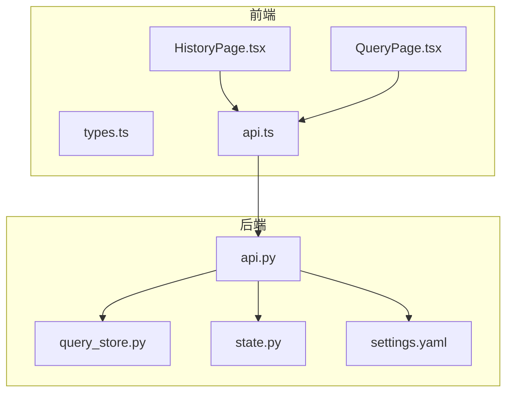
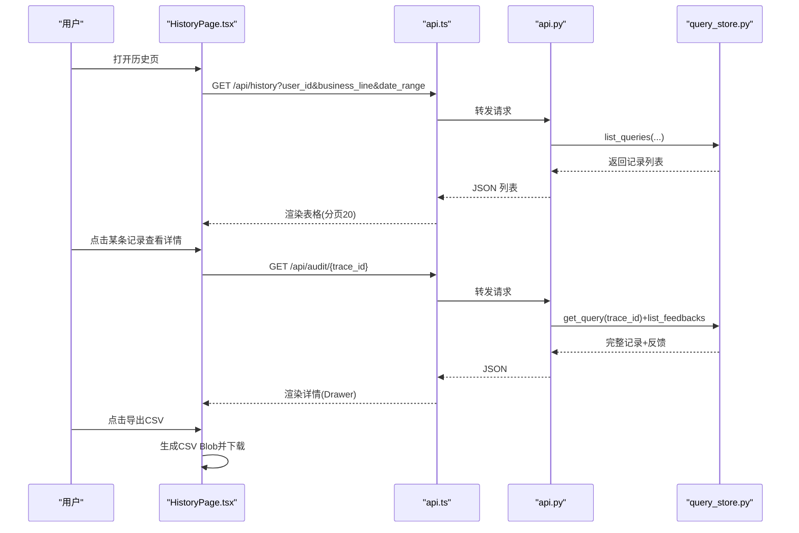
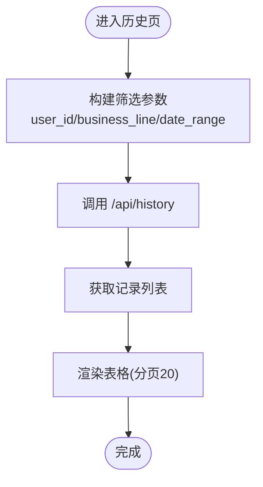
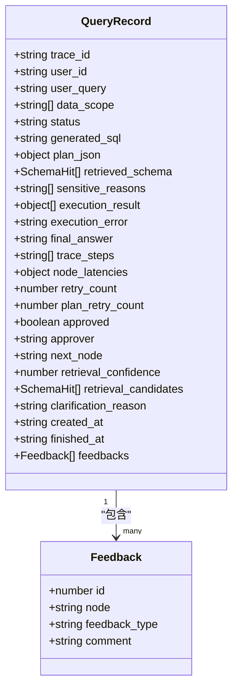
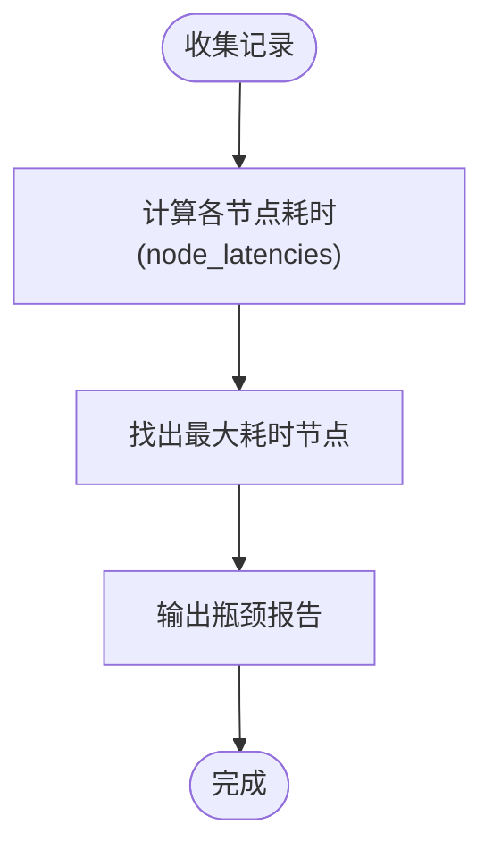
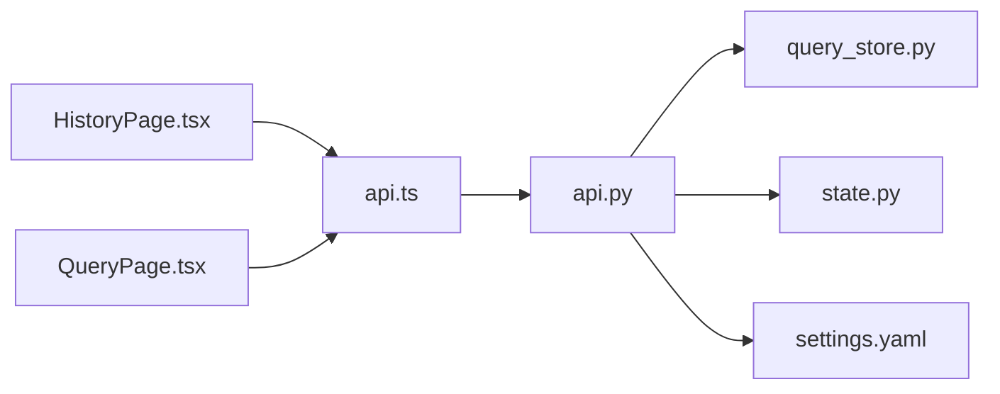

# 历史审计页面

<cite>
**本文引用的文件**   
- [HistoryPage.tsx](file://web/src/pages/HistoryPage.tsx)
- [QueryPage.tsx](file://web/src/pages/QueryPage.tsx)
- [types.ts](file://web/src/types.ts)
- [api.ts](file://web/src/api.ts)
- [api.py](file://nl2sql_agent/api.py)
- [query_store.py](file://nl2sql_agent/services/query_store.py)
- [state.py](file://nl2sql_agent/state.py)
- [settings.yaml](file://nl2sql_agent/config/settings.yaml)
</cite>

## 目录
1. [简介](#简介)
2. [项目结构](#项目结构)
3. [核心组件](#核心组件)
4. [架构总览](#架构总览)
5. [详细组件分析](#详细组件分析)
6. [依赖关系分析](#依赖关系分析)
7. [性能考量](#性能考量)
8. [故障排查指南](#故障排查指南)
9. [结论](#结论)
10. [附录](#附录)

## 简介
本章节面向“历史与审计”页面的使用者与维护者，系统性说明查询历史记录的管理能力、详情查看、导出、性能分析与高级筛选等。该页面用于：
- 列表展示查询记录，支持按用户、业务线（数据域）、时间范围筛选与分页浏览
- 查看单条记录的完整执行轨迹、各节点耗时与错误信息
- 批量导出审计记录为 CSV
- 结合后端提供的接口实现权限控制、隐私保护与合规性要求
- 提供性能监控指标与告警配置建议

## 项目结构
历史与审计功能由前端页面与后端 API + 持久化存储组成：
- 前端页面：HistoryPage.tsx 负责列表、筛选、导出与详情抽屉；QueryPage.tsx 提供步骤卡片与状态恢复逻辑；types.ts 定义前后端共享的数据模型；api.ts 封装 HTTP/WebSocket 调用
- 后端 API：api.py 暴露 /api/history、/api/audit/{trace_id} 等 REST 接口，并处理审批与恢复流程
- 持久化：query_store.py 基于 SQLite 存储查询记录与反馈，提供列表、详情、待审批队列等能力
- 状态与配置：state.py 定义全局状态字段；settings.yaml 定义执行参数与行级过滤开关

图表来源
- [HistoryPage.tsx:1-179](file://web/src/pages/HistoryPage.tsx#L1-L179)
- [QueryPage.tsx:1-574](file://web/src/pages/QueryPage.tsx#L1-L574)
- [types.ts:1-72](file://web/src/types.ts#L1-L72)
- [api.ts:1-50](file://web/src/api.ts#L1-L50)
- [api.py:1-573](file://nl2sql_agent/api.py#L1-L573)
- [query_store.py:1-214](file://nl2sql_agent/services/query_store.py#L1-L214)
- [state.py:1-146](file://nl2sql_agent/state.py#L1-L146)
- [settings.yaml:1-30](file://nl2sql_agent/config/settings.yaml#L1-L30)

章节来源
- [HistoryPage.tsx:1-179](file://web/src/pages/HistoryPage.tsx#L1-L179)
- [api.py:356-379](file://nl2sql_agent/api.py#L356-L379)
- [query_store.py:146-193](file://nl2sql_agent/services/query_store.py#L146-L193)

## 核心组件
- 历史列表与筛选：HistoryPage 通过 GET /api/history 获取记录，支持 user_id、business_line、start_date/end_date 筛选，默认 limit=200，前端分页 pageSize=20
- 审计详情：GET /api/audit/{trace_id} 返回完整记录及 feedbacks，包含 node_latencies、trace_steps、execution_result、execution_error 等
- 导出：前端将当前列表导出为 CSV，文件名含时间戳
- 步骤展示：复用 QueryPage 的 stepsFromState 与 StepCard，展示 Pipeline 各节点状态与耗时
- 权限与合规：state.py 定义 row_level_filters，settings.yaml 控制行级过滤开关；敏感判定与人工确认在 pipeline 中体现

章节来源
- [HistoryPage.tsx:52-92](file://web/src/pages/HistoryPage.tsx#L52-L92)
- [HistoryPage.tsx:96-178](file://web/src/pages/HistoryPage.tsx#L96-L178)
- [api.py:356-379](file://nl2sql_agent/api.py#L356-L379)
- [query_store.py:146-193](file://nl2sql_agent/services/query_store.py#L146-L193)
- [state.py:136-146](file://nl2sql_agent/state.py#L136-L146)

## 架构总览
历史与审计的核心交互如下：
- 前端发起筛选请求到 /api/history，后端根据条件查询 SQLite 并返回记录列表
- 点击某条记录打开详情 Drawer，前端调用 /api/audit/{trace_id} 拉取完整 trace 与反馈
- 详情中展示各节点耗时、Pipeline 过程、最终 SQL、执行结果与错误信息
- 导出按钮触发前端生成 CSV Blob 并下载

图表来源
- [HistoryPage.tsx:52-92](file://web/src/pages/HistoryPage.tsx#L52-L92)
- [HistoryPage.tsx:96-178](file://web/src/pages/HistoryPage.tsx#L96-L178)
- [api.py:356-379](file://nl2sql_agent/api.py#L356-L379)
- [query_store.py:146-193](file://nl2sql_agent/services/query_store.py#L146-L193)

## 详细组件分析

### 历史列表与搜索筛选
- 筛选维度：
  - 用户ID：user_id
  - 系统（数据域）：business_line（data_scope 模糊匹配）
  - 时间范围：start_date、end_date（精确到秒）
- 列表字段：created_at、user_id、data_scope、user_query、status、retry_count、plan_retry_count、execution_result、approved/approver、generated_sql
- 分页：前端 pageSize=20，后端 limit=200（可调整）
- 排序：按 created_at DESC

图表来源
- [HistoryPage.tsx:52-92](file://web/src/pages/HistoryPage.tsx#L52-L92)
- [api.py:356-364](file://nl2sql_agent/api.py#L356-L364)
- [query_store.py:146-172](file://nl2sql_agent/services/query_store.py#L146-L172)

章节来源
- [HistoryPage.tsx:52-92](file://web/src/pages/HistoryPage.tsx#L52-L92)
- [api.py:356-364](file://nl2sql_agent/api.py#L356-L364)
- [query_store.py:146-172](file://nl2sql_agent/services/query_store.py#L146-L172)

### 审计详情查看
- 详情接口：GET /api/audit/{trace_id} 返回完整记录与 feedbacks
- 关键信息：
  - 基本信息：trace_id、user_id、data_scope、status、created_at、finished_at
  - 执行相关：generated_sql、plan_json、retrieved_schema、execution_result、execution_error、final_answer
  - 追踪信息：trace_steps、node_latencies、retry_count、plan_retry_count
  - 审批信息：approved、approver、next_node
  - 反馈：feedbacks（id、node、feedback_type、comment）
- 展示方式：Descriptions 展示基础信息；Tag 展示各节点耗时；StepCard 展示 Pipeline 过程

图表来源
- [types.ts:9-35](file://web/src/types.ts#L9-L35)
- [api.py:372-378](file://nl2sql_agent/api.py#L372-L378)
- [query_store.py:195-214](file://nl2sql_agent/services/query_store.py#L195-L214)

章节来源
- [HistoryPage.tsx:67-178](file://web/src/pages/HistoryPage.tsx#L67-L178)
- [api.py:372-378](file://nl2sql_agent/api.py#L372-L378)
- [types.ts:9-35](file://web/src/types.ts#L9-L35)

### 审计日志导出（CSV）
- 导出格式：CSV，包含 trace_id、user_id、user_query、data_scope、status、retry_count、plan_retry_count、result_rows、approved、approver、created_at、finished_at、generated_sql
- 编码：UTF-8 BOM，兼容 Excel
- 文件名：nl2sql_audit_YYYYMMDD_HHmmss.csv
- 限制：仅导出当前列表数据，无后端分页导出接口

章节来源
- [HistoryPage.tsx:23-42](file://web/src/pages/HistoryPage.tsx#L23-L42)

### 查询性能分析
- 节点耗时：node_latencies 记录每个节点的毫秒数，前端以 Tag 展示
- 成功率统计：可通过 status 分布计算 done/blocked/error/rejected 比例
- 平均响应时间：可基于 created_at/finished_at 或 node_latencies 汇总
- 瓶颈节点识别：比较 node_latencies 最大值，定位慢节点

章节来源
- [HistoryPage.tsx:146-153](file://web/src/pages/HistoryPage.tsx#L146-L153)
- [types.ts:9-35](file://web/src/types.ts#L9-L35)

### 高级筛选功能
- 时间范围：start_date 与 end_date，精确到秒，支持跨天查询
- 用户维度：user_id 精确匹配
- 数据域：business_line 模糊匹配 data_scope（如 risk_mart/dw/core）
- 状态筛选：前端未直接提供，但后端支持按 status 扩展（可在 query_store.list_queries 增加参数）

章节来源
- [HistoryPage.tsx:52-65](file://web/src/pages/HistoryPage.tsx#L52-L65)
- [query_store.py:146-172](file://nl2sql_agent/services/query_store.py#L146-L172)

### 数据权限控制、隐私保护与合规性
- 行级权限：state.py 定义 row_level_filters，settings.yaml 控制启用与列名
- 静态校验：m8_static_validation 在 SQL 生成后注入 WHERE 条件，确保只读与权限隔离
- 敏感判定：sensitive_check 节点标记 is_sensitive 与 sensitive_reasons，必要时进入 human_review
- 隐私保护：导出 CSV 不包含敏感字段（如 sensitive_reasons），执行错误信息需脱敏展示

章节来源
- [state.py:136-146](file://nl2sql_agent/state.py#L136-L146)
- [settings.yaml:24-30](file://nl2sql_agent/config/settings.yaml#L24-L30)
- [api.py:101-132](file://nl2sql_agent/api.py#L101-L132)

## 依赖关系分析
- 前端依赖：
  - HistoryPage.tsx 依赖 api.ts 进行 HTTP 请求
  - types.ts 定义 QueryRecord、PipelineEvent 等类型
  - QueryPage.tsx 提供步骤卡片与状态恢复逻辑
- 后端依赖：
  - api.py 依赖 query_store.py 进行数据存取
  - state.py 定义状态结构，供 _state_to_dict 序列化
  - settings.yaml 提供执行参数与行级过滤配置

图表来源
- [HistoryPage.tsx:1-179](file://web/src/pages/HistoryPage.tsx#L1-L179)
- [QueryPage.tsx:1-574](file://web/src/pages/QueryPage.tsx#L1-L574)
- [api.ts:1-50](file://web/src/api.ts#L1-L50)
- [api.py:1-573](file://nl2sql_agent/api.py#L1-L573)
- [query_store.py:1-214](file://nl2sql_agent/services/query_store.py#L1-L214)
- [state.py:1-146](file://nl2sql_agent/state.py#L1-L146)
- [settings.yaml:1-30](file://nl2sql_agent/config/settings.yaml#L1-L30)

章节来源
- [api.py:1-573](file://nl2sql_agent/api.py#L1-L573)
- [query_store.py:1-214](file://nl2sql_agent/services/query_store.py#L1-L214)

## 性能考量
- 列表查询：limit=200，前端分页20，避免一次性加载过多数据
- 详情查询：按 trace_id 主键查询，O(1) 复杂度
- 导出性能：前端内存生成 CSV，大数据量时注意内存占用
- 节点耗时：node_latencies 可用于性能分析，建议定期统计平均耗时与 P95/P99
- 超时控制：settings.yaml 中 execution.timeout_seconds 控制查询超时

章节来源
- [HistoryPage.tsx:119-126](file://web/src/pages/HistoryPage.tsx#L119-L126)
- [query_store.py:146-172](file://nl2sql_agent/services/query_store.py#L146-L172)
- [settings.yaml:18-23](file://nl2sql_agent/config/settings.yaml#L18-L23)

## 故障排查指南
- 列表为空：检查筛选参数是否正确，确认数据库中有记录
- 详情缺失：确认 trace_id 存在，检查 /api/audit/{trace_id} 是否返回 404
- 导出失败：检查浏览器是否允许下载，确认 CSV 生成逻辑正常
- 性能问题：查看 node_latencies 定位慢节点，检查 execution.timeout_seconds
- 权限问题：检查 settings.yaml 中 row_level_filter.enabled 与 row_level_filters 注入

章节来源
- [api.py:356-379](file://nl2sql_agent/api.py#L356-L379)
- [query_store.py:141-193](file://nl2sql_agent/services/query_store.py#L141-L193)
- [settings.yaml:24-30](file://nl2sql_agent/config/settings.yaml#L24-L30)

## 结论
历史与审计页面提供了完整的查询记录管理、详情查看、导出与性能分析能力。通过前后端协作，实现了高效的数据检索与可视化展示。建议后续增强：
- 后端分页导出接口，支持大数据量导出
- 增加状态筛选与更多维度筛选
- 完善性能监控与告警机制

## 附录
- 接口定义：
  - GET /api/history：查询历史记录
  - GET /api/audit/{trace_id}：查询审计详情
  - POST /api/query：非流式提交查询
  - WebSocket /ws/query：流式推送查询事件
- 数据模型：QueryRecord、PipelineEvent、Feedback
- 配置项：settings.yaml 中的执行参数与行级过滤

章节来源
- [api.py:234-379](file://nl2sql_agent/api.py#L234-L379)
- [types.ts:9-54](file://web/src/types.ts#L9-L54)
- [settings.yaml:1-30](file://nl2sql_agent/config/settings.yaml#L1-L30)