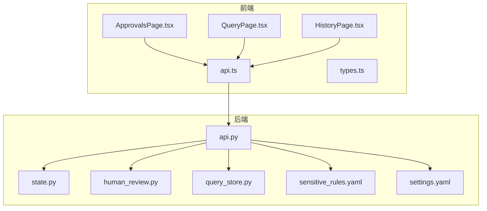
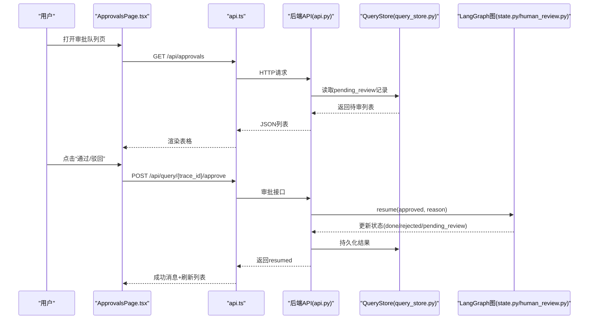
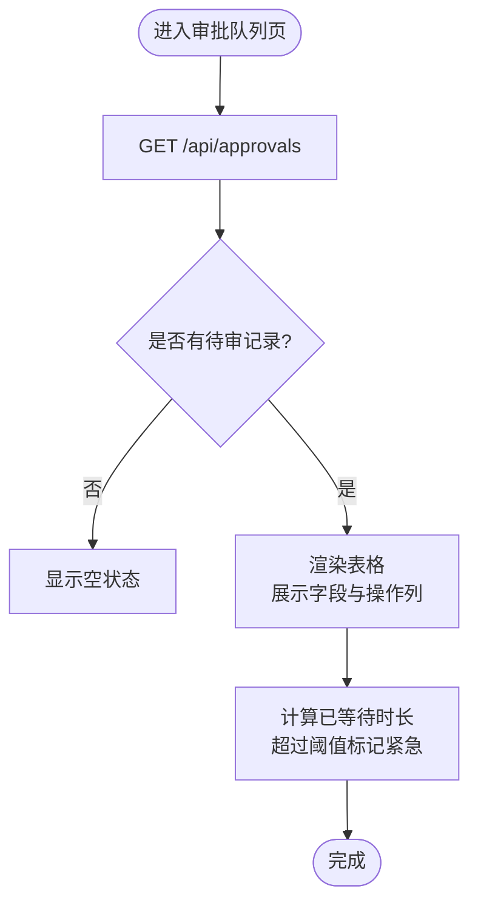
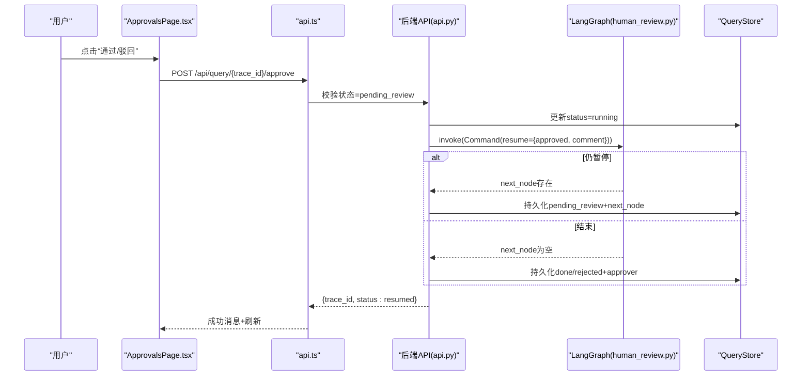
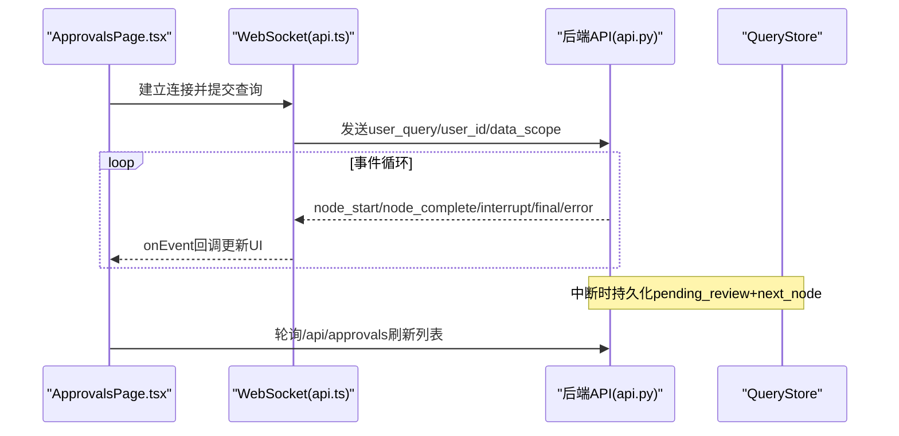
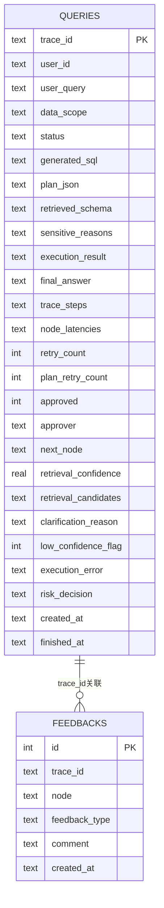
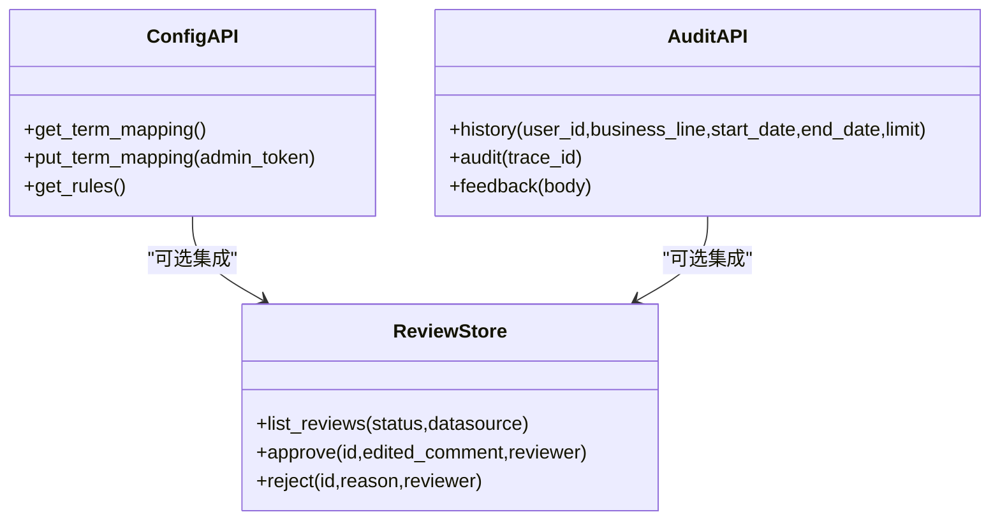
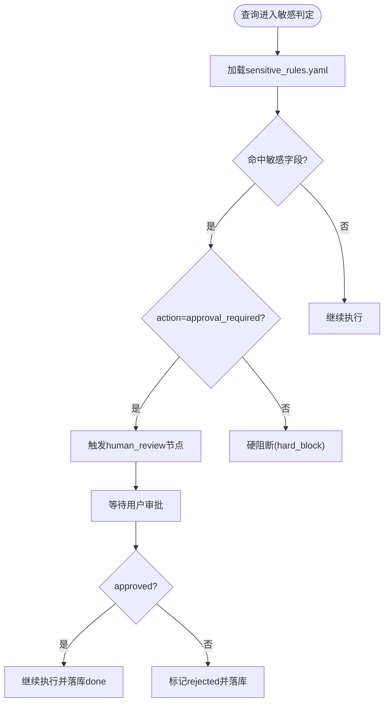
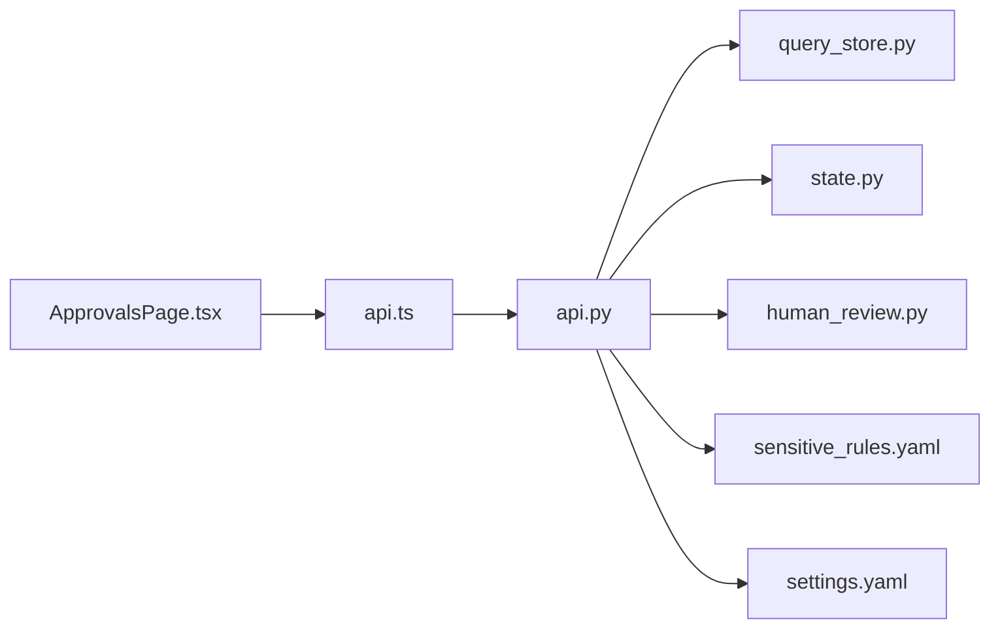

# 审批管理页面

<cite>
**本文引用的文件**   
- [ApprovalsPage.tsx](file://web/src/pages/ApprovalsPage.tsx)
- [api.ts](file://web/src/api.ts)
- [types.ts](file://web/src/types.ts)
- [QueryPage.tsx](file://web/src/pages/QueryPage.tsx)
- [HistoryPage.tsx](file://web/src/pages/HistoryPage.tsx)
- [api.py](file://nl2sql_agent/api.py)
- [state.py](file://nl2sql_agent/state.py)
- [human_review.py](file://nl2sql_agent/nodes/human_review.py)
- [query_store.py](file://nl2sql_agent/services/query_store.py)
- [sensitive_rules.yaml](file://nl2sql_agent/config/sensitive_rules.yaml)
- [settings.yaml](file://nl2sql_agent/config/settings.yaml)
</cite>

## 目录
1. [简介](#简介)
2. [项目结构](#项目结构)
3. [核心组件](#核心组件)
4. [架构总览](#架构总览)
5. [详细组件分析](#详细组件分析)
6. [依赖关系分析](#依赖关系分析)
7. [性能考虑](#性能考虑)
8. [故障排查指南](#故障排查指南)
9. [结论](#结论)
10. [附录](#附录)

## 简介
本文件为“审批管理页面”的完整技术文档，面向产品、研发与风控人员。内容覆盖：
- 待办事项列表的展示逻辑（筛选、排序、分页）
- 审批操作接口（批准、拒绝、备注）的实现与调用流程
- 审批状态的实时更新机制（轮询刷新与WebSocket事件）
- 审批队列数据结构（trace_id、用户信息、敏感原因、审批历史等）
- 批量操作能力（多选审批与批量确认）的设计建议
- 权限控制、审计日志与用户反馈机制
- 审批规则配置与自定义审批流程扩展指南

## 项目结构
前端审批相关页面位于 web/src/pages，后端API与状态持久化位于 nl2sql_agent。关键文件职责如下：
- ApprovalsPage.tsx：审批队列页，展示待审记录、触发审批弹窗、详情抽屉
- api.ts：通用请求封装与WebSocket提交查询
- types.ts：前后端共享类型（QueryRecord、PipelineEvent、节点顺序）
- QueryPage.tsx：步骤卡片与从记录恢复步骤渲染
- HistoryPage.tsx：历史与审计页，支持导出CSV
- api.py：REST/WebSocket API、审批恢复、事件桥接、配置接口
- state.py：全局状态模型（含敏感判定、人工审批字段）
- human_review.py：人工确认节点（interrupt/resume）
- query_store.py：SQLite持久化（查询记录、反馈、待审列表）
- sensitive_rules.yaml / settings.yaml：敏感规则与运行参数

**图表来源** 
- [ApprovalsPage.tsx:1-223](file://web/src/pages/ApprovalsPage.tsx#L1-L223)
- [api.ts:1-50](file://web/src/api.ts#L1-L50)
- [types.ts:1-72](file://web/src/types.ts#L1-L72)
- [QueryPage.tsx:1-200](file://web/src/pages/QueryPage.tsx#L1-L200)
- [HistoryPage.tsx:1-179](file://web/src/pages/HistoryPage.tsx#L1-L179)
- [api.py:1-573](file://nl2sql_agent/api.py#L1-L573)
- [state.py:1-146](file://nl2sql_agent/state.py#L1-L146)
- [human_review.py:1-32](file://nl2sql_agent/nodes/human_review.py#L1-L32)
- [query_store.py:1-214](file://nl2sql_agent/services/query_store.py#L1-L214)
- [sensitive_rules.yaml:1-24](file://nl2sql_agent/config/sensitive_rules.yaml#L1-L24)
- [settings.yaml:1-30](file://nl2sql_agent/config/settings.yaml#L1-L30)

**章节来源**
- [ApprovalsPage.tsx:1-223](file://web/src/pages/ApprovalsPage.tsx#L1-L223)
- [api.ts:1-50](file://web/src/api.ts#L1-L50)
- [types.ts:1-72](file://web/src/types.ts#L1-L72)
- [QueryPage.tsx:1-200](file://web/src/pages/QueryPage.tsx#L1-L200)
- [HistoryPage.tsx:1-179](file://web/src/pages/HistoryPage.tsx#L1-L179)
- [api.py:1-573](file://nl2sql_agent/api.py#L1-L573)
- [state.py:1-146](file://nl2sql_agent/state.py#L1-L146)
- [human_review.py:1-32](file://nl2sql_agent/nodes/human_review.py#L1-L32)
- [query_store.py:1-214](file://nl2sql_agent/services/query_store.py#L1-L214)
- [sensitive_rules.yaml:1-24](file://nl2sql_agent/config/sensitive_rules.yaml#L1-L24)
- [settings.yaml:1-30](file://nl2sql_agent/config/settings.yaml#L1-L30)

## 核心组件
- 审批队列页（ApprovalsPage.tsx）
  - 定时轮询获取待审列表（每10秒刷新一次），无服务端分页，前端未实现筛选与排序
  - 点击“通过/驳回”弹出Modal，驳回必填原因；通过后自动刷新并更新详情
  - 详情抽屉复用 QueryPage 的步骤渲染，展示 pipeline 过程与状态
- 历史与审计页（HistoryPage.tsx）
  - 支持按用户ID、业务线、时间范围筛选，分页由Table内置分页器处理
  - 支持导出CSV，便于审计归档
- WebSocket与REST（api.ts + api.py）
  - REST提供查询状态、审批、历史、审计、反馈、配置等接口
  - WebSocket用于流式推送pipeline事件，支持断线重连与状态恢复

**章节来源**
- [ApprovalsPage.tsx:1-223](file://web/src/pages/ApprovalsPage.tsx#L1-L223)
- [HistoryPage.tsx:1-179](file://web/src/pages/HistoryPage.tsx#L1-L179)
- [api.ts:1-50](file://web/src/api.ts#L1-L50)
- [api.py:1-573](file://nl2sql_agent/api.py#L1-L573)

## 架构总览
审批管理涉及前端页面、REST/WebSocket API、LangGraph图执行、SQLite持久化与规则配置。整体数据流如下：

**图表来源** 
- [ApprovalsPage.tsx:42-87](file://web/src/pages/ApprovalsPage.tsx#L42-L87)
- [api.ts:1-50](file://web/src/api.ts#L1-L50)
- [api.py:280-314](file://nl2sql_agent/api.py#L280-L314)
- [query_store.py:174-180](file://nl2sql_agent/services/query_store.py#L174-L180)
- [state.py:123-129](file://nl2sql_agent/state.py#L123-L129)
- [human_review.py:15-31](file://nl2sql_agent/nodes/human_review.py#L15-L31)

## 详细组件分析

### 待办事项列表展示逻辑
- 数据来源：/api/approvals 返回 status="pending_review" 的记录，按 created_at 升序排列
- 展示字段：提问人、问题、命中敏感规则、系统、提交时间、已等待时长、操作按钮
- 筛选与排序：当前未实现前端筛选与排序；后端仅按创建时间排序
- 分页：前端使用 Table 且关闭分页（pagination=false），适合待审量较小的场景
- 紧急标记：超过阈值（如10分钟）显示红色标签与警告图标

**图表来源** 
- [ApprovalsPage.tsx:42-51](file://web/src/pages/ApprovalsPage.tsx#L42-L51)
- [ApprovalsPage.tsx:89-141](file://web/src/pages/ApprovalsPage.tsx#L89-L141)
- [api.py:367-369](file://nl2sql_agent/api.py#L367-L369)
- [query_store.py:174-180](file://nl2sql_agent/services/query_store.py#L174-L180)

**章节来源**
- [ApprovalsPage.tsx:42-141](file://web/src/pages/ApprovalsPage.tsx#L42-L141)
- [api.py:367-369](file://nl2sql_agent/api.py#L367-L369)
- [query_store.py:174-180](file://nl2sql_agent/services/query_store.py#L174-L180)

### 审批操作接口（批准、拒绝、备注）
- 接口路径：POST /api/query/{trace_id}/approve
- 请求体：{ approved: boolean, reason: string, approver: string }
- 行为：
  - 校验当前状态必须为 pending_review
  - 先标记为 running，避免前端误判
  - 通过 LangGraph 的 Command(resume=...) 恢复执行
  - 若继续暂停则保持 pending_review，否则终态为 done 或 rejected
  - 记录 approver 与 finished_at
- 前端交互：
  - 驳回必填原因，通过后提示“查询将自动继续执行”
  - 成功后刷新列表，并在详情抽屉中延迟拉取最新状态

**图表来源** 
- [ApprovalsPage.tsx:59-87](file://web/src/pages/ApprovalsPage.tsx#L59-L87)
- [api.py:280-314](file://nl2sql_agent/api.py#L280-L314)
- [human_review.py:15-31](file://nl2sql_agent/nodes/human_review.py#L15-L31)
- [query_store.py:122-133](file://nl2sql_agent/services/query_store.py#L122-L133)

**章节来源**
- [ApprovalsPage.tsx:59-87](file://web/src/pages/ApprovalsPage.tsx#L59-L87)
- [api.py:280-314](file://nl2sql_agent/api.py#L280-L314)
- [human_review.py:15-31](file://nl2sql_agent/nodes/human_review.py#L15-L31)
- [query_store.py:122-133](file://nl2sql_agent/services/query_store.py#L122-L133)

### 审批状态的实时更新机制
- 轮询刷新：ApprovalsPage 每10秒调用 /api/approvals 刷新列表
- 详情更新：审批后延迟2秒拉取 /api/query/{trace_id} 更新详情抽屉
- WebSocket事件：submitQuery 建立 ws 连接，接收 trace/node_start/node_complete/interrupt/final/error/done 等事件
- 断线重连：后端根据 trace_id 恢复状态（pending_review/done/blocked），推送 restore 或 final/interrupt

**图表来源** 
- [api.ts:31-49](file://web/src/api.ts#L31-L49)
- [api.py:161-210](file://nl2sql_agent/api.py#L161-L210)
- [ApprovalsPage.tsx:42-51](file://web/src/pages/ApprovalsPage.tsx#L42-L51)

**章节来源**
- [api.ts:31-49](file://web/src/api.ts#L31-L49)
- [api.py:161-210](file://nl2sql_agent/api.py#L161-L210)
- [ApprovalsPage.tsx:42-51](file://web/src/pages/ApprovalsPage.tsx#L42-L51)

### 审批队列的数据结构
- 核心字段（QueryRecord）：
  - trace_id：唯一追踪ID
  - user_id：用户标识
  - user_query：原始问题
  - data_scope：可访问的业务线
  - status：running/done/pending_review/error/rejected/blocked
  - generated_sql：生成的SQL
  - plan_json：查询计划
  - retrieved_schema：命中的Schema
  - sensitive_reasons：敏感原因列表
  - execution_result：执行结果
  - execution_error：执行错误
  - final_answer：最终答案
  - trace_steps：执行步骤
  - node_latencies：各节点耗时
  - retry_count/plan_retry_count：重试计数
  - approved/approver：审批结果与审批人
  - next_node：暂停节点（human_review/clarify_*）
  - retrieval_confidence/candidates：检索置信度与候选
  - clarification_reason：澄清原因
  - created_at/finished_at：时间戳
  - feedbacks：用户反馈列表
- 持久化表：queries（主记录）、feedbacks（反馈）

**图表来源** 
- [types.ts:9-35](file://web/src/types.ts#L9-L35)
- [query_store.py:31-91](file://nl2sql_agent/services/query_store.py#L31-L91)

**章节来源**
- [types.ts:9-35](file://web/src/types.ts#L9-L35)
- [query_store.py:31-91](file://nl2sql_agent/services/query_store.py#L31-L91)

### 批量操作功能（设计与建议）
- 现状：ApprovalsPage 未实现多选与批量确认，仅提供单条操作的“通过/驳回”按钮
- 建议实现：
  - 在表格列添加 Checkbox，维护 selectedTraceIds 集合
  - 顶部工具栏增加“批量通过/批量驳回”按钮
  - 批量驳回需输入统一原因（或允许逐条编辑）
  - 调用后端新增批量接口（如 POST /api/approvals/batch-approve），或在前端循环调用现有接口
  - 失败重试与部分成功提示，保证幂等性

[本节为概念性设计，不直接分析具体文件]

### 权限控制、审计日志与用户反馈
- 权限控制：
  - 术语映射配置接口需要 X-Admin-Token 头校验（_admin_ok）
  - 行级过滤可通过 state.row_level_filters 注入（settings.yaml 中启用）
- 审计日志：
  - HistoryPage 支持按用户、业务线、时间范围筛选，导出CSV
  - 审计详情包含 trace_id、状态、重试次数、结果行数、审批信息与节点耗时
- 用户反馈：
  - 提供 /api/feedback 接口记录反馈（node、feedback_type、comment）
  - 审计详情中展示反馈列表

**图表来源** 
- [api.py:396-447](file://nl2sql_agent/api.py#L396-L447)
- [api.py:356-391](file://nl2sql_agent/api.py#L356-L391)
- [HistoryPage.tsx:1-179](file://web/src/pages/HistoryPage.tsx#L1-L179)

**章节来源**
- [api.py:396-447](file://nl2sql_agent/api.py#L396-L447)
- [api.py:356-391](file://nl2sql_agent/api.py#L356-L391)
- [HistoryPage.tsx:1-179](file://web/src/pages/HistoryPage.tsx#L1-L179)

### 审批规则配置与自定义审批流程扩展
- 敏感规则（sensitive_rules.yaml）：
  - sensitive_fields：敏感字段与关键词匹配
  - explain_scan：扫描行数阈值与动作（hard_block 或 approval_required）
  - aggregation_trigger/export_trigger：汇总/导出触发开关
- 运行参数（settings.yaml）：
  - execution.read_only/limit/timeout_seconds/explain_row_threshold
  - row_level_filter.enabled/column 控制行级过滤
- 自定义流程扩展：
  - 在 graph 中添加新节点，并通过 interrupt_before 挂载
  - 使用 Command(resume=...) 传递用户决策，更新 state 字段
  - 在 /api/query/{trace_id}/resume 中支持通用恢复

**图表来源** 
- [sensitive_rules.yaml:1-24](file://nl2sql_agent/config/sensitive_rules.yaml#L1-L24)
- [settings.yaml:18-30](file://nl2sql_agent/config/settings.yaml#L18-L30)
- [human_review.py:15-31](file://nl2sql_agent/nodes/human_review.py#L15-L31)
- [api.py:322-353](file://nl2sql_agent/api.py#L322-L353)

**章节来源**
- [sensitive_rules.yaml:1-24](file://nl2sql_agent/config/sensitive_rules.yaml#L1-L24)
- [settings.yaml:18-30](file://nl2sql_agent/config/settings.yaml#L18-L30)
- [human_review.py:15-31](file://nl2sql_agent/nodes/human_review.py#L15-L31)
- [api.py:322-353](file://nl2sql_agent/api.py#L322-L353)

## 依赖关系分析
- 前端依赖：
  - ApprovalsPage.tsx 依赖 api.ts 的请求封装与 types.ts 的类型定义
  - QueryPage.tsx 提供 stepsFromState 与 StepCard 供审批详情复用
- 后端依赖：
  - api.py 依赖 query_store.py（持久化）、state.py（状态模型）、human_review.py（人工确认节点）
  - 规则配置依赖 sensitive_rules.yaml 与 settings.yaml
- 数据流依赖：
  - 审批状态变更通过 _persist 写入 queries 表
  - 反馈通过 feedbacks 表关联 trace_id

**图表来源** 
- [ApprovalsPage.tsx:1-223](file://web/src/pages/ApprovalsPage.tsx#L1-L223)
- [api.ts:1-50](file://web/src/api.ts#L1-L50)
- [api.py:1-573](file://nl2sql_agent/api.py#L1-L573)
- [query_store.py:1-214](file://nl2sql_agent/services/query_store.py#L1-L214)
- [state.py:1-146](file://nl2sql_agent/state.py#L1-L146)
- [human_review.py:1-32](file://nl2sql_agent/nodes/human_review.py#L1-L32)
- [sensitive_rules.yaml:1-24](file://nl2sql_agent/config/sensitive_rules.yaml#L1-L24)
- [settings.yaml:1-30](file://nl2sql_agent/config/settings.yaml#L1-L30)

**章节来源**
- [ApprovalsPage.tsx:1-223](file://web/src/pages/ApprovalsPage.tsx#L1-L223)
- [api.ts:1-50](file://web/src/api.ts#L1-L50)
- [api.py:1-573](file://nl2sql_agent/api.py#L1-L573)
- [query_store.py:1-214](file://nl2sql_agent/services/query_store.py#L1-L214)
- [state.py:1-146](file://nl2sql_agent/state.py#L1-L146)
- [human_review.py:1-32](file://nl2sql_agent/nodes/human_review.py#L1-L32)
- [sensitive_rules.yaml:1-24](file://nl2sql_agent/config/sensitive_rules.yaml#L1-L24)
- [settings.yaml:1-30](file://nl2sql_agent/config/settings.yaml#L1-L30)

## 性能考虑
- 轮询频率：默认10秒刷新，可根据待审量调整
- 数据库锁：query_store 使用线程锁保护并发写，避免竞争
- 事件桥接：EventStream 使用 asyncio.Queue 与 call_soon_threadsafe 桥接同步线程与异步事件循环
- 大结果集：execution.limit 限制未聚合查询行数，explain_row_threshold 拦截高成本查询
- 内存占用：向量存储与缓存策略影响内存，需监控峰值

[本节为一般性指导，不直接分析具体文件]

## 故障排查指南
- 常见错误：
  - 状态不可审批：非 pending_review 状态调用 approve 会返回400
  - trace不存在：查询或审批时trace_id无效返回404
  - WebSocket断开：前端需实现重连逻辑，后端支持按trace_id恢复
- 调试建议：
  - 查看节点耗时（node_latencies）定位慢节点
  - 检查 feedbacks 表收集用户反馈
  - 启用日志输出（后端print）跟踪审批恢复流程

**章节来源**
- [api.py:280-314](file://nl2sql_agent/api.py#L280-L314)
- [api.py:356-391](file://nl2sql_agent/api.py#L356-L391)
- [query_store.py:195-214](file://nl2sql_agent/services/query_store.py#L195-L214)

## 结论
审批管理页面实现了从前端展示到后端执行的完整闭环，支持敏感查询的人工确认、状态实时更新与审计反馈。当前待审列表未实现筛选与分页，建议后续增强批量操作与高级筛选能力。通过规则配置与自定义流程扩展，可灵活适配不同业务场景的风控需求。

[本节为总结性内容，不直接分析具体文件]

## 附录
- 扩展点：
  - 新增审批节点：在 graph 中注册新节点，通过 interrupt_before 挂载
  - 自定义恢复逻辑：在 /api/query/{trace_id}/resume 中处理特定 resume 数据
  - 权限扩展：通过 row_level_filters 注入行级权限条件
- 配置文件位置：
  - 敏感规则：nl2sql_agent/config/sensitive_rules.yaml
  - 运行参数：nl2sql_agent/config/settings.yaml
  - 术语映射：nl2sql_agent/config/term_mapping/{business_line}.yaml

[本节为补充信息，不直接分析具体文件]