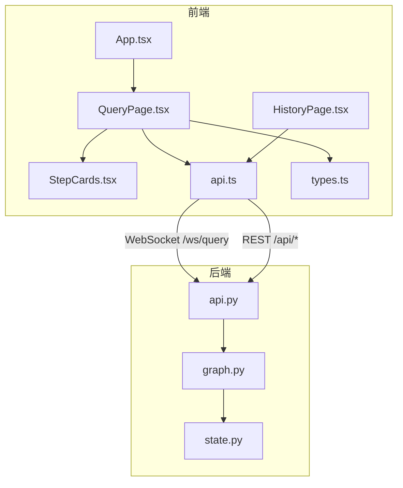
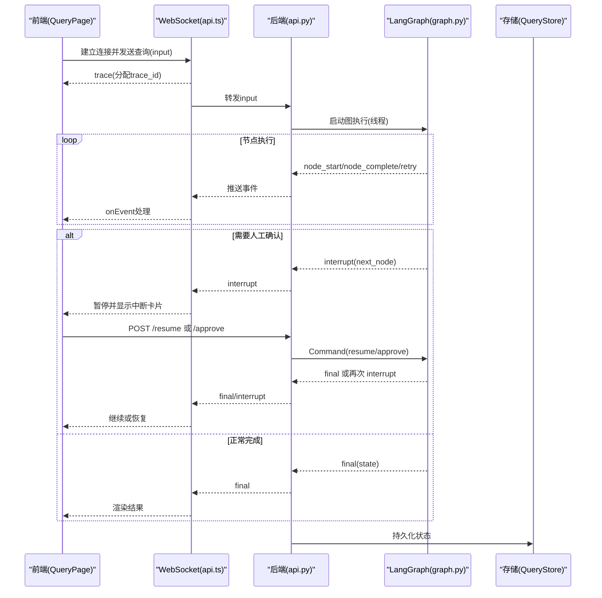
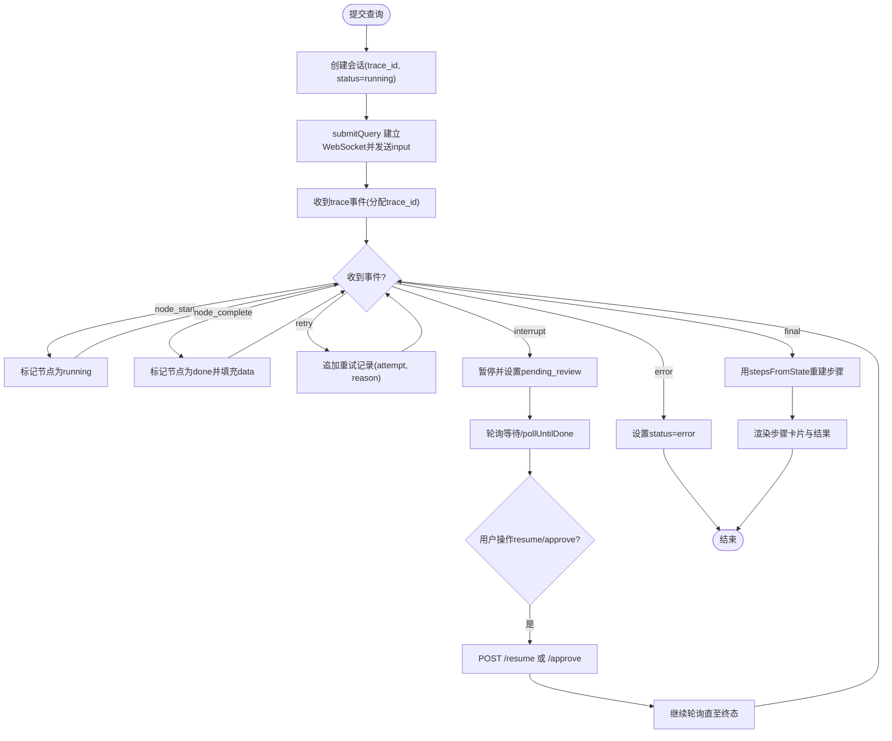
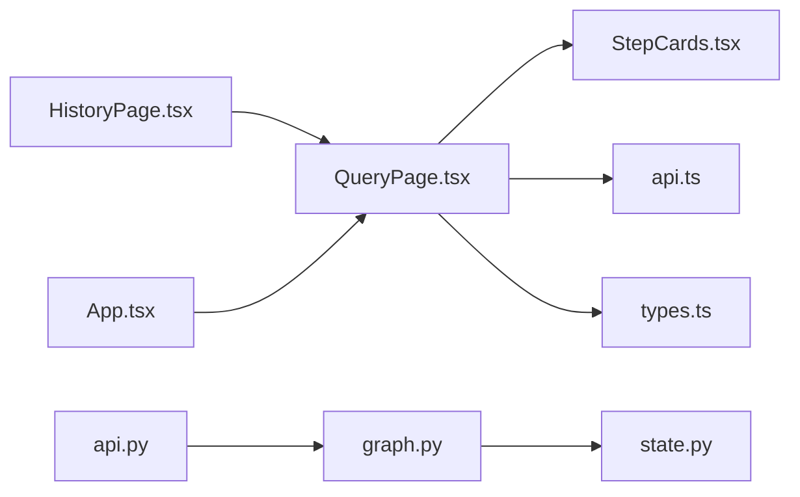

# 数据问答页面

<cite>
**本文引用的文件**   
- [QueryPage.tsx](file://web/src/pages/QueryPage.tsx)
- [StepCards.tsx](file://web/src/components/StepCards.tsx)
- [api.ts](file://web/src/api.ts)
- [types.ts](file://web/src/types.ts)
- [App.tsx](file://web/src/App.tsx)
- [HistoryPage.tsx](file://web/src/pages/HistoryPage.tsx)
- [api.py](file://nl2sql_agent/api.py)
- [graph.py](file://nl2sql_agent/graph.py)
- [state.py](file://nl2sql_agent/state.py)
</cite>

## 目录
1. [简介](#简介)
2. [项目结构](#项目结构)
3. [核心组件](#核心组件)
4. [架构总览](#架构总览)
5. [详细组件分析](#详细组件分析)
6. [依赖关系分析](#依赖关系分析)
7. [性能考量](#性能考量)
8. [故障排查指南](#故障排查指南)
9. [结论](#结论)
10. [附录](#附录)

## 简介
本文件为“数据问答”页面的完整技术文档，面向前端与后端开发者及运维人员。内容覆盖：
- 查询输入处理、实时事件流展示与结果可视化
- 会话管理机制（多会话支持、状态同步、历史记录加载）
- 步骤卡片组件实现（时间澄清、Schema检索、复杂度判断、SQL生成、敏感检查、执行结果等节点渲染）
- WebSocket 事件处理机制（trace、node_start、node_complete、retry、interrupt、final、error 等）
- 用户交互流程（提交、中断恢复、轮询等待、错误处理）
- 界面布局设计、响应式适配与用户体验优化策略
- 自定义样式选项与扩展开发指南

## 项目结构
数据问答功能由前端 React 页面与后端 FastAPI + LangGraph 编排共同构成。前端通过 WebSocket 接收实时事件，REST API 用于历史与审批；后端基于 LangGraph 构建 11 个节点的有向图，按规则路由并持久化状态。

图表来源
- [App.tsx:1-58](file://web/src/App.tsx#L1-L58)
- [QueryPage.tsx:1-574](file://web/src/pages/QueryPage.tsx#L1-L574)
- [StepCards.tsx:1-347](file://web/src/components/StepCards.tsx#L1-L347)
- [api.ts:1-50](file://web/src/api.ts#L1-L50)
- [types.ts:1-72](file://web/src/types.ts#L1-L72)
- [api.py:1-573](file://nl2sql_agent/api.py#L1-L573)
- [graph.py:1-313](file://nl2sql_agent/graph.py#L1-L313)
- [state.py:1-146](file://nl2sql_agent/state.py#L1-L146)

章节来源
- [App.tsx:1-58](file://web/src/App.tsx#L1-L58)
- [QueryPage.tsx:1-574](file://web/src/pages/QueryPage.tsx#L1-L574)
- [api.ts:1-50](file://web/src/api.ts#L1-L50)
- [types.ts:1-72](file://web/src/types.ts#L1-L72)
- [api.py:1-573](file://nl2sql_agent/api.py#L1-L573)
- [graph.py:1-313](file://nl2sql_agent/graph.py#L1-L313)
- [state.py:1-146](file://nl2sql_agent/state.py#L1-L146)

## 核心组件
- QueryPage：主查询页，负责会话管理、事件处理、历史加载、轮询与恢复、步骤卡片渲染。
- StepCards：步骤卡片组件集合，包含状态徽标、SQL高亮、Schema检索摘要、计划卡片、SQL预览、结果表格、重试时间线、答案摘要等。
- api：统一请求封装与 WebSocket 连接管理，提供 submitQuery、apiGet、apiPost。
- types：前后端共享类型定义，包括 PipelineEvent、QueryRecord、PIPELINE_NODES 等。
- 后端 api.py：FastAPI 路由，WebSocket 事件桥接、REST 接口（查询、状态、审批、历史、审计、反馈、配置）。
- graph.py：LangGraph 编排，定义 11 个节点与路由逻辑，追踪延迟与步骤顺序，推送 node_start/node_complete/retry/interrupt/final/error/done。
- state.py：NL2SQLState 模型定义，贯穿各模块的状态字段。

章节来源
- [QueryPage.tsx:1-574](file://web/src/pages/QueryPage.tsx#L1-L574)
- [StepCards.tsx:1-347](file://web/src/components/StepCards.tsx#L1-L347)
- [api.ts:1-50](file://web/src/api.ts#L1-L50)
- [types.ts:1-72](file://web/src/types.ts#L1-L72)
- [api.py:1-573](file://nl2sql_agent/api.py#L1-L573)
- [graph.py:1-313](file://nl2sql_agent/graph.py#L1-L313)
- [state.py:1-146](file://nl2sql_agent/state.py#L1-L146)

## 架构总览
数据问答的整体交互流程如下：
- 前端通过 WebSocket 建立连接，发送 user_query、user_id、data_scope、trace_id。
- 后端在独立线程中运行 LangGraph 图，逐节点执行并通过 EventStream 将事件推送到 WebSocket。
- 前端根据事件更新会话状态与步骤卡片，必要时发起 REST 轮询或 resume 恢复。
- 最终 final 事件携带完整 state，前端将其转换为 steps 并渲染结果。

图表来源
- [api.ts:31-49](file://web/src/api.ts#L31-L49)
- [api.py:161-221](file://nl2sql_agent/api.py#L161-L221)
- [graph.py:174-312](file://nl2sql_agent/graph.py#L174-L312)

章节来源
- [api.ts:1-50](file://web/src/api.ts#L1-L50)
- [api.py:1-573](file://nl2sql_agent/api.py#L1-L573)
- [graph.py:1-313](file://nl2sql_agent/graph.py#L1-L313)

## 详细组件分析

### 查询输入处理与会话管理
- 输入处理：用户在 QueryPage 的输入框提交自然语言问题，选择 data_scope（业务线），调用 submitQuery 建立 WebSocket 连接并发送 input。
- 会话管理：每个 trace_id 对应一个 Session，维护 status、steps、trace_steps、node_latencies、created_at。多会话并存，activeTrace 控制当前活跃会话。
- 历史加载：页面初始化时拉取最近 50 条记录，点击历史项加载详情并断线重连恢复。
- 状态同步：handleEvent 根据事件类型更新步骤状态（running/done/interrupt/error），final 事件后使用 stepsFromState 重建步骤。
- 轮询等待：当状态为 pending_review 时，每 1.5 秒轮询 /api/query/{trace_id}，直到 done/error 或新的 interrupt。

图表来源
- [QueryPage.tsx:291-408](file://web/src/pages/QueryPage.tsx#L291-L408)
- [api.ts:31-49](file://web/src/api.ts#L31-L49)

章节来源
- [QueryPage.tsx:1-574](file://web/src/pages/QueryPage.tsx#L1-L574)
- [api.ts:1-50](file://web/src/api.ts#L1-L50)

### 实时事件流展示与结果可视化
- 事件类型：trace、node_start、node_complete、retry、interrupt、final、error、done、ping、restore。
- 展示逻辑：
  - node_start：将对应节点状态置为 running。
  - node_complete：将节点状态置为 done，填充 data。
  - retry：追加重试记录，保留 attempt 与 reason。
  - interrupt：暂停到 human_review / clarify_candidates / clarify_low_confidence，状态切换为 pending_review。
  - final：从 e.data 重建 steps，更新 trace_steps 与 node_latencies。
  - error：设置 status 为 error。
- 结果可视化：
  - SchemaRetrievalCard：展示命中表与列信息。
  - PlanCard：目标表、过滤条件、关联逻辑、指标口径、分组、置信度，支持反馈。
  - SqlCard：SQL 高亮、复制、反馈。
  - ResultTable：动态列、分页、滚动。
  - AnswerCard：最终解释文本。

章节来源
- [QueryPage.tsx:291-333](file://web/src/pages/QueryPage.tsx#L291-L333)
- [StepCards.tsx:84-347](file://web/src/components/StepCards.tsx#L84-L347)
- [types.ts:37-54](file://web/src/types.ts#L37-L54)

### 步骤卡片组件实现与节点渲染逻辑
- StepStatusTag：根据 status 显示不同徽标（执行中/完成/等待审批/失败/等待）。
- StepCard：根据 node 类型渲染不同内容：
  - clarify_time_range：需补充时间范围或无需澄清。
  - clarify_candidates：候选表列表，用户选择后 resume。
  - clarify_low_confidence：低置信提示，用户决定继续或不继续。
  - schema_retrieval：SchemaRetrievalCard。
  - complexity_check：简单路径或复杂路径（走计划）。
  - plan_generation：PlanCard。
  - plan_validation：校验错误或通过。
  - sql_generation/static_validation：SqlCard。
  - sensitive_check：命中敏感规则需人工确认。
  - human_review：等待审批。
  - sandbox_execution：ResultTable 或错误。
  - result_interpretation：AnswerCard。
- RetryTimeline：折叠展示重试过程。

章节来源
- [StepCards.tsx:32-347](file://web/src/components/StepCards.tsx#L32-L347)
- [QueryPage.tsx:96-263](file://web/src/pages/QueryPage.tsx#L96-L263)

### WebSocket 事件处理机制
- 前端：
  - submitQuery 建立 ws:// 或 wss:// 连接，发送 JSON input，onmessage 解析 PipelineEvent 并回调 onEvent。
  - handleEvent 根据 event 类型更新会话状态。
- 后端：
  - _ws_query_handler 接收消息，分配 trace_id，断线重连恢复（pending_review 直接返回 interrupt 并关闭连接；done/blocked/rejected 返回 final 并关闭；其他返回 restore 并关闭）。
  - EventStream 桥接线程与 asyncio，_run_query 在独立线程执行图，sink.emit 推送事件。
  - 事件类型：node_start、node_complete、retry、interrupt、final、error、done、ping。

章节来源
- [api.ts:31-49](file://web/src/api.ts#L31-L49)
- [QueryPage.tsx:291-333](file://web/src/pages/QueryPage.tsx#L291-L333)
- [api.py:54-221](file://nl2sql_agent/api.py#L54-L221)

### 用户交互流程
- 查询提交：输入自然语言问题，选择 data_scope，点击“提问”或回车提交。
- 中断恢复：遇到 human_review / clarify_candidates / clarify_low_confidence 时，前端显示中断卡片，用户操作后调用 /api/query/{trace_id}/resume 或 /api/query/{trace_id}/approve。
- 轮询等待：当状态为 pending_review 时，每 1.5 秒轮询 /api/query/{trace_id}，直到终态或新中断。
- 错误处理：error 事件设置 status=error，前端显示错误提示；网络异常时捕获并忽略非法帧。

章节来源
- [QueryPage.tsx:335-408](file://web/src/pages/QueryPage.tsx#L335-L408)
- [api.py:280-353](file://nl2sql_agent/api.py#L280-L353)

### 界面布局设计与响应式适配
- 三栏布局：左侧历史会话列表、中间查询与步骤卡片、右侧元信息与耗时。
- 响应式：使用 Ant Design Layout 与 Flexbox，自适应高度与滚动。
- 用户体验：
  - 整体加载指示与当前运行节点标签。
  - 步骤卡片折叠与时间线展示。
  - SQL 高亮与一键复制。
  - 反馈弹窗收集用户意见。

章节来源
- [QueryPage.tsx:412-573](file://web/src/pages/QueryPage.tsx#L412-L573)
- [StepCards.tsx:1-347](file://web/src/components/StepCards.tsx#L1-L347)

### 自定义样式与扩展开发指南
- 样式定制：
  - 步骤卡片颜色与图标可通过 StepStatusTag 扩展。
  - SQL 高亮关键字可调整 SQL_KEYWORDS 正则。
  - 布局间距与背景色可在 QueryPage 的 style 中修改。
- 扩展节点：
  - 在 PIPELINE_NODES 中添加新节点与标题。
  - 在 StepCard 的 switch(node) 中添加渲染逻辑。
  - 在后端 graph.py 中添加节点与路由。
  - 在 types.ts 中扩展 PipelineEvent 与 QueryRecord。

章节来源
- [types.ts:57-71](file://web/src/types.ts#L57-L71)
- [StepCards.tsx:62-80](file://web/src/components/StepCards.tsx#L62-L80)
- [graph.py:174-312](file://nl2sql_agent/graph.py#L174-L312)

## 依赖关系分析
前端依赖：
- QueryPage 依赖 StepCards、api、types。
- HistoryPage 复用 QueryPage 的 stepsFromState 与 StepCard。
- App 作为根组件管理页面路由。

后端依赖：
- api.py 依赖 graph.py、state.py、QueryStore。
- graph.py 依赖 nodes 模块与 state.py，编译 LangGraph 图。
- state.py 定义 NL2SQLState 与各子模型。

图表来源
- [QueryPage.tsx:1-574](file://web/src/pages/QueryPage.tsx#L1-L574)
- [StepCards.tsx:1-347](file://web/src/components/StepCards.tsx#L1-L347)
- [api.ts:1-50](file://web/src/api.ts#L1-L50)
- [types.ts:1-72](file://web/src/types.ts#L1-L72)
- [HistoryPage.tsx:1-179](file://web/src/pages/HistoryPage.tsx#L1-L179)
- [App.tsx:1-58](file://web/src/App.tsx#L1-L58)
- [api.py:1-573](file://nl2sql_agent/api.py#L1-L573)
- [graph.py:1-313](file://nl2sql_agent/graph.py#L1-L313)
- [state.py:1-146](file://nl2sql_agent/state.py#L1-L146)

章节来源
- [QueryPage.tsx:1-574](file://web/src/pages/QueryPage.tsx#L1-L574)
- [api.py:1-573](file://nl2sql_agent/api.py#L1-L573)
- [graph.py:1-313](file://nl2sql_agent/graph.py#L1-L313)

## 性能考量
- 事件节流：后端 _event_data 截断 execution_result 前 20 行，避免刷屏。
- 轮询间隔：前端 pollUntilDone 使用 1.5 秒间隔，平衡实时性与负载。
- 节点追踪：graph.py 记录 node_latencies 与 trace_steps，便于性能分析。
- 并发执行：后端在独立线程执行图，避免阻塞 WebSocket 事件循环。
- 内存管理：EventStream 使用队列，onclose/onerror 清理连接。

章节来源
- [graph.py:60-86](file://nl2sql_agent/graph.py#L60-L86)
- [QueryPage.tsx:369-392](file://web/src/pages/QueryPage.tsx#L369-L392)
- [api.py:54-66](file://nl2sql_agent/api.py#L54-L66)

## 故障排查指南
- 连接失败：检查 WebSocket 协议（ws/wss）与主机地址，查看浏览器控制台错误。
- 事件丢失：确认后端 EventStream 是否超时 ping，检查 onmessage 解析异常。
- 中断卡住：检查 next_node 是否正确，确认 /resume 或 /approve 调用成功。
- 历史加载为空：验证 /api/history 与 /api/audit/{trace_id} 接口返回。
- 步骤未渲染：确认 PIPELINE_NODES 与 StepCard 的 node 匹配，检查 stepsFromState 转换。

章节来源
- [api.ts:31-49](file://web/src/api.ts#L31-L49)
- [api.py:161-221](file://nl2sql_agent/api.py#L161-L221)
- [QueryPage.tsx:291-408](file://web/src/pages/QueryPage.tsx#L291-L408)

## 结论
数据问答页面通过前后端协作实现了自然语言到 SQL 的智能查询流程，具备实时事件流、多会话管理、中断恢复与结果可视化能力。系统采用 LangGraph 编排节点，结合 WebSocket 与 REST API，提供了良好的用户体验与可扩展性。建议在生产环境中关注性能监控、错误日志与用户反馈闭环。

## 附录
- 关键类型定义参考：PipelineEvent、QueryRecord、PIPELINE_NODES。
- 节点流程图参考：graph.py 中的 build_graph 与路由函数。
- 状态模型参考：state.py 中的 NL2SQLState。

章节来源
- [types.ts:1-72](file://web/src/types.ts#L1-L72)
- [graph.py:174-312](file://nl2sql_agent/graph.py#L174-L312)
- [state.py:83-146](file://nl2sql_agent/state.py#L83-L146)