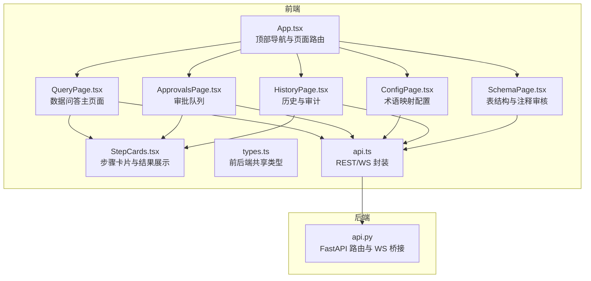
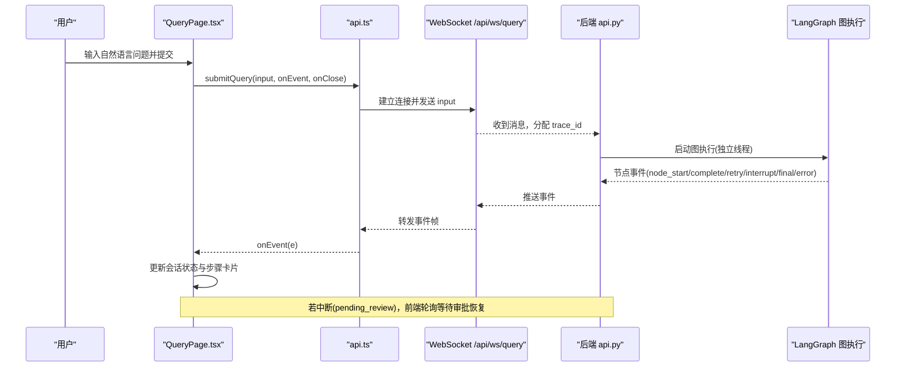
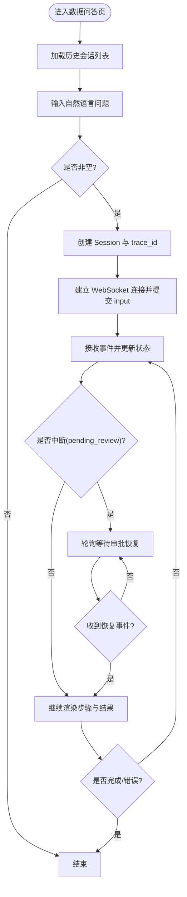
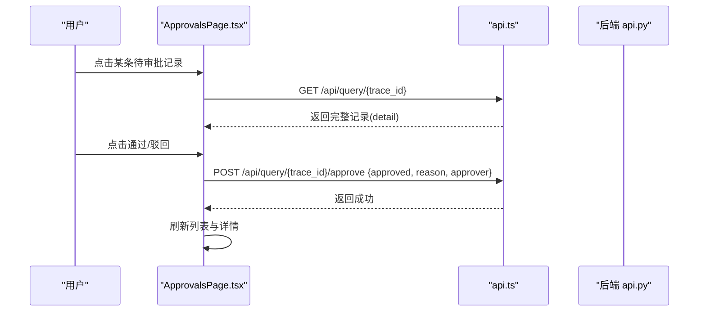
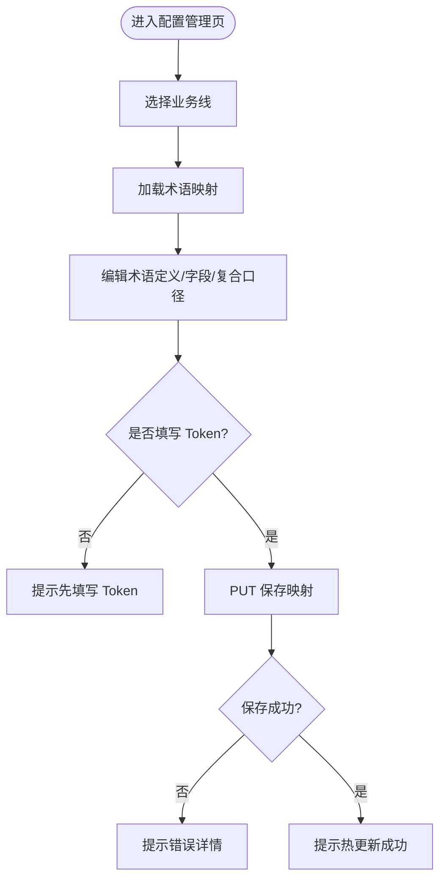
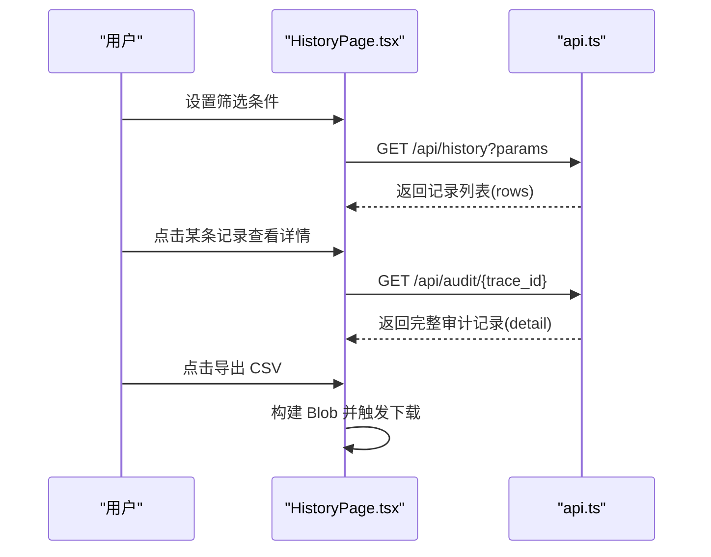
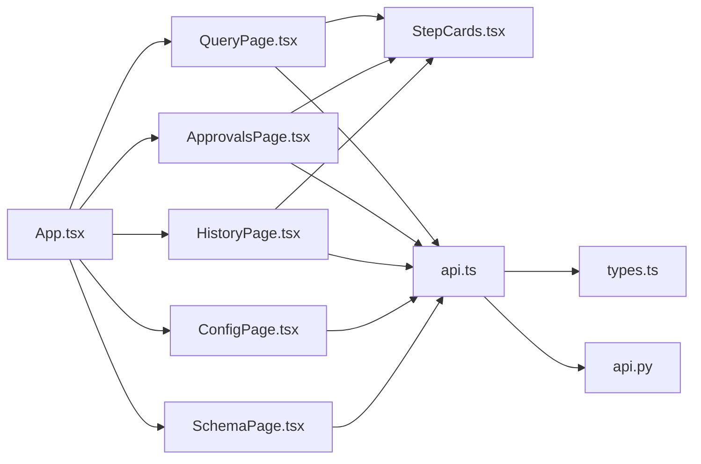

# 核心页面组件

<cite>
**本文引用的文件**   
- [QueryPage.tsx](file://web/src/pages/QueryPage.tsx)
- [ApprovalsPage.tsx](file://web/src/pages/ApprovalsPage.tsx)
- [ConfigPage.tsx](file://web/src/pages/ConfigPage.tsx)
- [HistoryPage.tsx](file://web/src/pages/HistoryPage.tsx)
- [SchemaPage.tsx](file://web/src/pages/SchemaPage.tsx)
- [StepCards.tsx](file://web/src/components/StepCards.tsx)
- [types.ts](file://web/src/types.ts)
- [api.ts](file://web/src/api.ts)
- [App.tsx](file://web/src/App.tsx)
- [api.py](file://nl2sql_agent/api.py)
- [NL2SQL.md](file://NL2SQL.md)
</cite>

## 目录
1. [简介](#简介)
2. [项目结构](#项目结构)
3. [核心组件](#核心组件)
4. [架构总览](#架构总览)
5. [详细组件分析](#详细组件分析)
6. [依赖关系分析](#依赖关系分析)
7. [性能考量](#性能考量)
8. [故障排查指南](#故障排查指南)
9. [结论](#结论)
10. [附录](#附录)

## 简介
本文件面向 NL2SQL 前端核心页面组件，系统性梳理数据问答、审批管理、配置管理、历史审计与 Schema 管理五大页面的功能设计、用户交互流程、状态管理与数据流处理。文档同时覆盖组件复用模式、表单处理模式、错误处理策略、界面定制选项、响应式设计与可访问性支持，帮助读者快速理解并高效使用各页面。

## 项目结构
前端采用 React + Ant Design 的单页应用，路由通过顶部菜单切换页面；核心页面位于 pages 目录，通用展示卡片在 components 目录；类型定义与 API 封装集中在 types.ts 与 api.ts；后端 FastAPI 提供 REST 与 WebSocket 接口，支撑实时事件推送与断线重连恢复。

**图表来源** 
- [App.tsx:1-58](file://web/src/App.tsx#L1-L58)
- [QueryPage.tsx:1-574](file://web/src/pages/QueryPage.tsx#L1-L574)
- [ApprovalsPage.tsx:1-223](file://web/src/pages/ApprovalsPage.tsx#L1-L223)
- [ConfigPage.tsx:1-136](file://web/src/pages/ConfigPage.tsx#L1-L136)
- [HistoryPage.tsx:1-179](file://web/src/pages/HistoryPage.tsx#L1-L179)
- [SchemaPage.tsx:1-355](file://web/src/pages/SchemaPage.tsx#L1-L355)
- [StepCards.tsx:1-347](file://web/src/components/StepCards.tsx#L1-L347)
- [types.ts:1-72](file://web/src/types.ts#L1-L72)
- [api.ts:1-50](file://web/src/api.ts#L1-L50)
- [api.py:1-200](file://nl2sql_agent/api.py#L1-L200)

**章节来源**
- [App.tsx:1-58](file://web/src/App.tsx#L1-L58)
- [NL2SQL.md:1-76](file://NL2SQL.md#L1-L76)

## 核心组件
- 步骤卡片与可视化：统一渲染 pipeline 各节点状态与内容（如 Schema 检索、计划生成、SQL 预览、结果表格、重试时间线等），并在需要时提供反馈入口。
- 类型与事件模型：前后端共享 QueryRecord、PipelineEvent、PIPELINE_NODES 等类型，确保状态一致性与渲染一致性。
- API 封装：统一的 GET/POST 请求与 WebSocket 提交查询，支持断线重连与事件回调。

**章节来源**
- [StepCards.tsx:1-347](file://web/src/components/StepCards.tsx#L1-L347)
- [types.ts:1-72](file://web/src/types.ts#L1-L72)
- [api.ts:1-50](file://web/src/api.ts#L1-L50)

## 架构总览
前端通过 WebSocket 接收后端 LangGraph 执行过程中的节点事件，实时更新页面状态；REST 接口用于查询历史、审批、配置与 Schema 操作。后端将图执行线程的事件通过 EventStream 桥接到异步队列，再由 WebSocket 推送给前端，实现“边执行边展示”的实时体验。

**图表来源** 
- [QueryPage.tsx:267-408](file://web/src/pages/QueryPage.tsx#L267-L408)
- [api.ts:31-49](file://web/src/api.ts#L31-L49)
- [api.py:161-200](file://nl2sql_agent/api.py#L161-L200)

## 详细组件分析

### 数据问答页(QueryPage)
- 功能概述
  - 左侧历史会话列表，点击可恢复或查看；中间为当前会话的主视图，包含业务线(data_scope)选择、自然语言输入框、运行中提示与各步骤卡片；右侧元信息与耗时面板。
  - 支持实时事件驱动的状态更新，包括 node_start/node_complete/retry/interrupt/final/error 等事件。
  - 对 pending_review 状态的会话进行轮询，等待人工审批后自动恢复。
- 关键交互流程
  - 提交查询：创建 Session，调用 submitQuery 建立 WS，按事件更新 steps 与整体状态。
  - 历史恢复：从 /api/history 拉取记录，必要时通过 /api/query/{trace_id} 获取完整状态，重建 Session。
  - 中断恢复：当 next_node 指向 human_review/clarify_candidates/clarify_low_confidence 时，渲染对应 StepCard 并提供 resume 操作。
- 状态管理
  - sessions: 多会话数组，activeTrace 决定当前显示。
  - stepsFromState：根据最终 state(record/final.data) 反推各步骤状态，保证断线重连后可正确渲染。
  - handleEvent：集中处理各类事件，维护 steps、trace_steps、node_latencies 等。
- 数据流与可视化
  - 步骤卡片复用 StepCards 中的 SchemaRetrievalCard、PlanCard、SqlCard、ResultTable、RetryTimeline、AnswerCard 等。
  - 元信息面板展示 trace_id、状态、执行步骤序列与各节点耗时。
- 错误处理与用户反馈
  - 失败状态以 Tag 与文案提示；敏感规则命中进入人工确认；低置信度与候选歧义提供继续/不继续或选择候选表的交互。
  - 反馈机制：PlanCard/SqlCard 内置“这个不对”按钮，提交反馈到 /api/feedback。

**图表来源** 
- [QueryPage.tsx:267-408](file://web/src/pages/QueryPage.tsx#L267-L408)
- [api.ts:31-49](file://web/src/api.ts#L31-L49)

**章节来源**
- [QueryPage.tsx:1-574](file://web/src/pages/QueryPage.tsx#L1-L574)
- [StepCards.tsx:1-347](file://web/src/components/StepCards.tsx#L1-L347)
- [types.ts:1-72](file://web/src/types.ts#L1-L72)
- [api.ts:1-50](file://web/src/api.ts#L1-L50)

### 审批管理页(ApprovalsPage)
- 功能概述
  - 展示待审批的敏感查询列表，支持查看详情、通过/驳回操作；驳回需填写原因作为反馈闭环输入。
  - 列表每 10 秒刷新一次，紧急项超过 10 分钟高亮标记。
- 关键交互流程
  - 打开详情：调用 /api/query/{trace_id} 获取完整记录，使用复用 StepCard 渲染 Pipeline 过程。
  - 审批操作：POST /api/query/{trace_id}/approve，通过后自动继续执行，驳回则记录原因并刷新列表。
- 状态管理
  - items: 待审批记录数组；detail: 当前查看的完整记录；target: 当前操作的记录；loading: 操作加载态。
- 用户反馈与错误处理
  - 驳回必填原因校验；操作成功/失败通过 message 提示；成功后延迟刷新详情以反映最新状态。

**图表来源** 
- [ApprovalsPage.tsx:34-87](file://web/src/pages/ApprovalsPage.tsx#L34-L87)
- [api.ts:15-17](file://web/src/api.ts#L15-L17)

**章节来源**
- [ApprovalsPage.tsx:1-223](file://web/src/pages/ApprovalsPage.tsx#L1-L223)
- [StepCards.tsx:1-347](file://web/src/components/StepCards.tsx#L1-L347)

### 配置管理页(ConfigPage)
- 功能概述
  - 术语映射编辑：按业务线(_global/weiyedai/zidong/weilai)切换，编辑术语的定义、解析字段、复合口径等，保存时携带 X-Admin-Token 头进行鉴权。
  - 保存后热更新，无需重启服务。
- 关键交互流程
  - 加载映射：GET /api/config/term-mapping?business_line={line}
  - 保存映射：PUT /api/config/term-mapping?business_line={line}，Header 含 X-Admin-Token
- 状态管理
  - line: 当前业务线；mapping: 术语映射对象；adminToken: 管理 Token（本地缓存）
- 验证与错误处理
  - 未填写 Token 时提示先填写；保存失败时解析后端 detail 并提示 HTTP 状态码。

**图表来源** 
- [ConfigPage.tsx:23-55](file://web/src/pages/ConfigPage.tsx#L23-L55)

**章节来源**
- [ConfigPage.tsx:1-136](file://web/src/pages/ConfigPage.tsx#L1-L136)

### 历史审计页(HistoryPage)
- 功能概述
  - 查询记录浏览：支持按用户 ID、系统(data_scope)、时间范围筛选；分页展示；导出 CSV。
  - 详情查看：Drawer 内展示完整审计信息，包括各节点耗时、Pipeline 过程、用户反馈。
- 关键交互流程
  - 加载列表：GET /api/history?user_id&business_line&start_date&end_date
  - 打开详情：GET /api/audit/{trace_id}
  - 导出 CSV：前端构建 Blob 并触发下载
- 状态管理
  - rows: 记录列表；userId/businessLine/range: 筛选条件；detail/open: 详情与抽屉开关
- 用户反馈与错误处理
  - 无数据时显示空文本；导出禁用态控制；详情加载失败回退到原始记录。

**图表来源** 
- [HistoryPage.tsx:44-71](file://web/src/pages/HistoryPage.tsx#L44-L71)
- [HistoryPage.tsx:23-42](file://web/src/pages/HistoryPage.tsx#L23-L42)

**章节来源**
- [HistoryPage.tsx:1-179](file://web/src/pages/HistoryPage.tsx#L1-L179)
- [StepCards.tsx:1-347](file://web/src/components/StepCards.tsx#L1-L347)

### Schema 管理页(SchemaPage)
- 功能概述
  - 表结构浏览：按业务线展示表与字段，支持补充/修改注释（写入系统覆盖层，不改数据库 DDL）。
  - 待审核注释队列：LLM 生成的候选注释，人工确认后生效；支持重新入库以应用已确认注释。
- 关键交互流程
  - 浏览：GET /api/schema?business_line={line}
  - 保存注释：POST /api/schema/{table}/{column?}/comment?business_line={line}
  - 审核队列：GET /api/schema/review?datasource={line}&status=pending
  - 通过/驳回：POST /api/schema/review/{id}/approve|reject
  - 重新入库：POST /api/schema/review/reingest
- 状态管理
  - SchemaBrowse: tables/loading/editTarget/editText
  - ReviewQueue: items/target/mode/refreshing
- 用户反馈与错误处理
  - 无表时提示先运行 ingest_schema.py；驳回必填原因；操作成功通过 message 提示。

```mermaid
classDiagram
class SchemaBrowse {
+tables : TableInfo[]
+loading : boolean
+editTarget : object
+editText : string
+load()
+openEdit(table, column, current)
+saveComment()
}
class ReviewQueue {
+items : ReviewItem[]
+target : ReviewItem
+mode : "approve"|"reject"
+refreshing : boolean
+load()
+openApprove(r)
+openReject(r)
+submit()
+reingest()
}
class ColumnInfo {
+name : string
+type : string
+comment : string
+eff_comment : string
+overridden : boolean
+sensitive : boolean
}
class TableInfo {
+table_name : string
+comment : string
+columns : ColumnInfo[]
}
class ReviewItem {
+id : number
+datasource : string
+table_name : string
+column_name : string|null
+draft_comment : string
+status : string
+draft_confidence : number
+validation_errors : string[]
+reject_reason : string
}
SchemaBrowse --> TableInfo : "展示"
SchemaBrowse --> ColumnInfo : "编辑注释"
ReviewQueue --> ReviewItem : "审核队列"
```

**图表来源** 
- [SchemaPage.tsx:55-175](file://web/src/pages/SchemaPage.tsx#L55-L175)
- [SchemaPage.tsx:179-324](file://web/src/pages/SchemaPage.tsx#L179-L324)

**章节来源**
- [SchemaPage.tsx:1-355](file://web/src/pages/SchemaPage.tsx#L1-L355)

## 依赖关系分析
- 页面与组件依赖
  - QueryPage/ApprovalsPage/HistoryPage 均复用 StepCards 中的步骤卡片与结果展示组件，保证一致的视觉与交互体验。
  - 所有页面通过 api.ts 统一发起 REST 请求与 WebSocket 连接。
- 前后端契约
  - types.ts 定义 QueryRecord、PipelineEvent、PIPELINE_NODES，与后端 api.py 的 _state_to_dict 输出对齐，确保状态序列化与还原一致。
- 路由与布局
  - App.tsx 通过 Menu 切换页面，ErrorBoundary 包裹页面组件以提升健壮性。

**图表来源** 
- [App.tsx:1-58](file://web/src/App.tsx#L1-L58)
- [api.ts:1-50](file://web/src/api.ts#L1-L50)
- [types.ts:1-72](file://web/src/types.ts#L1-L72)
- [api.py:1-200](file://nl2sql_agent/api.py#L1-L200)

**章节来源**
- [App.tsx:1-58](file://web/src/App.tsx#L1-L58)
- [api.ts:1-50](file://web/src/api.ts#L1-L50)
- [types.ts:1-72](file://web/src/types.ts#L1-L72)

## 性能考量
- 实时事件推送：WebSocket 流式推送避免频繁轮询，降低网络开销与 CPU 占用。
- 断线重连：后端支持带 trace_id 的重连恢复，前端在 pending_review 状态下轮询，平衡实时性与资源消耗。
- 列表刷新策略：审批队列每 10 秒刷新一次，历史页按需加载，避免全量刷新。
- 渲染优化：步骤卡片按需渲染，仅显示有数据的步骤；表格分页限制行数，提升大结果集展示性能。

[本节为通用指导，不直接分析具体文件]

## 故障排查指南
- WebSocket 连接失败
  - 检查浏览器控制台网络面板，确认 ws/wss 协议与主机名正确；确认后端 /api/ws/query 路由可用。
- 事件缺失或状态不同步
  - 检查 handleEvent 分支是否覆盖所有事件类型；确认后端 _run_query 是否正确 emit 事件。
- 审批卡住
  - 确认 /api/query/{trace_id}/approve 调用成功；检查后端是否更新 approved/approver 并推进状态。
- 配置保存失败
  - 检查 X-Admin-Token 是否正确传递；查看后端返回的 detail 信息定位权限或参数错误。
- Schema 无数据
  - 确认已运行 ingest_schema.py 导入表结构；检查 /api/schema 返回是否为空。

**章节来源**
- [QueryPage.tsx:291-333](file://web/src/pages/QueryPage.tsx#L291-L333)
- [api.py:134-157](file://nl2sql_agent/api.py#L134-L157)
- [ConfigPage.tsx:38-55](file://web/src/pages/ConfigPage.tsx#L38-L55)
- [SchemaPage.tsx:65-76](file://web/src/pages/SchemaPage.tsx#L65-L76)

## 结论
五大核心页面围绕 NL2SQL 智能体的“问数—计划—生成—校验—执行—解释”流水线，构建了完整的用户交互与运维管理能力。通过统一的步骤卡片与类型契约，实现了跨页面的一致体验与可靠的状态同步。建议在生产环境中加强监控告警与日志追踪，持续优化提示词与规则配置，提升准确率与用户体验。

[本节为总结性内容，不直接分析具体文件]

## 附录
- 界面定制选项
  - 主题与样式：Ant Design 默认主题，可通过 CSS 变量或主题配置调整颜色与间距。
  - 响应式设计：Layout.Sider 与 Content 自适应高度，表格启用横向滚动与分页，适配移动端与小屏设备。
  - 可访问性：按钮与输入框具备语义化标签，Tag 与 Icon 辅助说明状态；建议增加键盘导航与屏幕阅读器支持。
- 组件复用模式
  - StepCards 提供通用步骤卡片与结果展示，减少重复代码，提升一致性。
- 表单处理模式
  - 受控组件(value/onChange)为主，结合 message 提示与 Modal 确认，保证操作安全。
- 错误处理策略
  - 前端捕获异常并提示；后端返回 detail 字段便于前端精准提示；关键路径增加重试与降级逻辑。

[本节为通用指导，不直接分析具体文件]