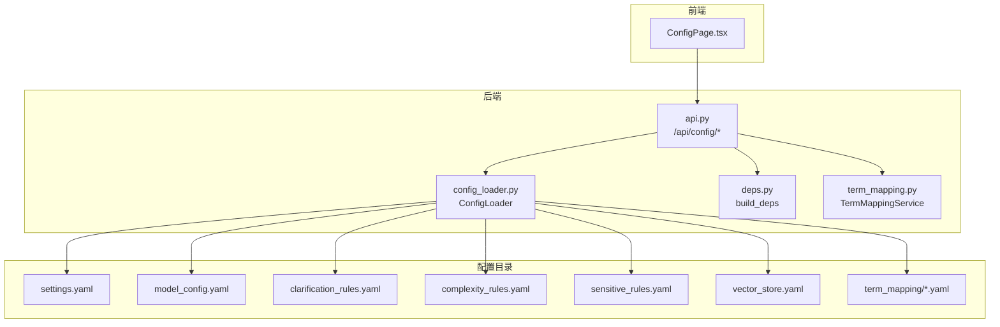
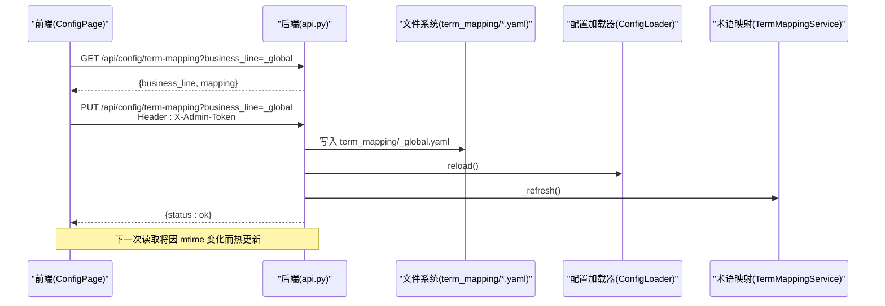
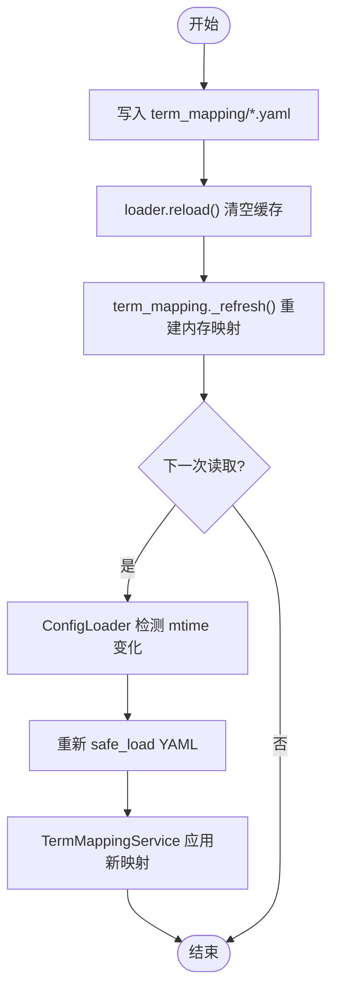
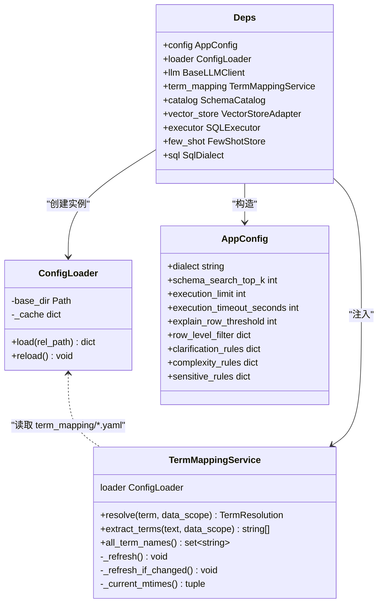

# 配置管理页面

<cite>
**本文引用的文件**   
- [api.py](file://nl2sql_agent/api.py)
- [ConfigPage.tsx](file://web/src/pages/ConfigPage.tsx)
- [config_loader.py](file://nl2sql_agent/services/config_loader.py)
- [deps.py](file://nl2sql_agent/services/deps.py)
- [term_mapping.py](file://nl2sql_agent/services/term_mapping.py)
- [settings.yaml](file://nl2sql_agent/config/settings.yaml)
- [model_config.yaml](file://nl2sql_agent/config/model_config.yaml)
- [clarification_rules.yaml](file://nl2sql_agent/config/clarification_rules.yaml)
- [complexity_rules.yaml](file://nl2sql_agent/config/complexity_rules.yaml)
- [sensitive_rules.yaml](file://nl2sql_agent/config/sensitive_rules.yaml)
- [vector_store.yaml](file://nl2sql_agent/config/vector_store.yaml)
</cite>

## 目录
1. [简介](#简介)
2. [项目结构](#项目结构)
3. [核心组件](#核心组件)
4. [架构总览](#架构总览)
5. [详细组件分析](#详细组件分析)
6. [依赖关系分析](#依赖关系分析)
7. [性能考量](#性能考量)
8. [故障排查指南](#故障排查指南)
9. [结论](#结论)
10. [附录](#附录)

## 简介
本文件为“配置管理页面”的完整技术文档，聚焦系统配置的在线编辑能力与热更新机制。当前实现覆盖：
- 术语映射（term_mapping）的在线编辑、保存与热更新
- 规则类配置（澄清、复杂度、敏感、运行参数 settings）的统一读取
- 模型与向量存储相关配置（embedding/provider/dimension、pgvector/backend）
- 权限控制（管理 Token）、操作反馈与审计联动（历史与审计页）

说明：
- 当前前端仅实现了“术语映射”的在线编辑界面；其他 YAML 配置以只读方式通过 API 暴露，供前端扩展或外部工具使用。
- 热更新基于 mtime 缓存失效与内存级刷新，无需重启服务。

## 项目结构
配置管理涉及前后端协作与多份 YAML 配置文件：
- 前端：React + Ant Design 的 ConfigPage 提供术语映射编辑 UI
- 后端：FastAPI 路由暴露 /api/config/* 接口，读写 term_mapping 与只读 rules/settings
- 配置加载器：ConfigLoader 提供带 mtime 缓存的 YAML 读取与 reload
- 依赖装配：build_deps 组装 AppConfig、TermMappingService、SchemaCatalog、VectorStore、Executor 等
- 配置项：settings.yaml、model_config.yaml、clarification_rules.yaml、complexity_rules.yaml、sensitive_rules.yaml、vector_store.yaml

**图表来源** 
- [ConfigPage.tsx](file://web/src/pages/ConfigPage.tsx)
- [api.py](file://nl2sql_agent/api.py)
- [config_loader.py](file://nl2sql_agent/services/config_loader.py)
- [deps.py](file://nl2sql_agent/services/deps.py)
- [term_mapping.py](file://nl2sql_agent/services/term_mapping.py)
- [settings.yaml](file://nl2sql_agent/config/settings.yaml)
- [model_config.yaml](file://nl2sql_agent/config/model_config.yaml)
- [clarification_rules.yaml](file://nl2sql_agent/config/clarification_rules.yaml)
- [complexity_rules.yaml](file://nl2sql_agent/config/complexity_rules.yaml)
- [sensitive_rules.yaml](file://nl2sql_agent/config/sensitive_rules.yaml)
- [vector_store.yaml](file://nl2sql_agent/config/vector_store.yaml)

**章节来源**
- [ConfigPage.tsx](file://web/src/pages/ConfigPage.tsx)
- [api.py](file://nl2sql_agent/api.py)
- [config_loader.py](file://nl2sql_agent/services/config_loader.py)
- [deps.py](file://nl2sql_agent/services/deps.py)
- [term_mapping.py](file://nl2sql_agent/services/term_mapping.py)
- [settings.yaml](file://nl2sql_agent/config/settings.yaml)
- [model_config.yaml](file://nl2sql_agent/config/model_config.yaml)
- [clarification_rules.yaml](file://nl2sql_agent/config/clarification_rules.yaml)
- [complexity_rules.yaml](file://nl2sql_agent/config/complexity_rules.yaml)
- [sensitive_rules.yaml](file://nl2sql_agent/config/sensitive_rules.yaml)
- [vector_store.yaml](file://nl2sql_agent/config/vector_store.yaml)

## 核心组件
- 配置加载器（ConfigLoader）
  - 职责：按相对路径读取 YAML，维护 mtime 缓存；支持 reload 清空缓存触发下次读取重载
  - 关键点：mtime_ns 比对，毫秒级变更检测；safe_load 防注入
- 依赖装配（build_deps）
  - 职责：从 settings.yaml 解析运行参数；加载规则 YAML；构建 TermMappingService、SchemaCatalog、VectorStore、SQLExecutor
  - 关键点：数据库连接 URL 优先级（settings > .env > 兼容字段）；向量后端选择（memory/pgvector）
- 术语映射服务（TermMappingService）
  - 职责：按业务线命名空间 + 全局加载 term_mapping/*.yaml；支持 mtime 热更新；术语解析与抽取
  - 关键点：_refresh_if_changed 自动刷新；resolve/extract_terms 支持别名匹配
- 前端配置页（ConfigPage.tsx）
  - 职责：展示术语映射表格，支持编辑保存；携带 X-Admin-Token 鉴权
  - 关键点：保存后提示“热更新”，实际由后端清理 loader 缓存并刷新 term_mapping

**章节来源**
- [config_loader.py](file://nl2sql_agent/services/config_loader.py)
- [deps.py](file://nl2sql_agent/services/deps.py)
- [term_mapping.py](file://nl2sql_agent/services/term_mapping.py)
- [ConfigPage.tsx](file://web/src/pages/ConfigPage.tsx)

## 架构总览
配置管理的端到端流程如下：
- 前端发起 GET /api/config/term-mapping?business_line=... 获取术语映射
- 前端编辑后 PUT /api/config/term-mapping?business_line=... 提交 JSON 数据
- 后端校验管理 Token，写入 term_mapping/{business_line}.yaml
- 后端调用 loader.reload() 与 term_mapping._refresh() 实现热更新
- 后续读取时，ConfigLoader 检测到 mtime 变化，重新加载 YAML

**图表来源** 
- [api.py](file://nl2sql_agent/api.py)
- [config_loader.py](file://nl2sql_agent/services/config_loader.py)
- [term_mapping.py](file://nl2sql_agent/services/term_mapping.py)
- [ConfigPage.tsx](file://web/src/pages/ConfigPage.tsx)

## 详细组件分析

### 配置分类与读取
- 基础配置（settings.yaml）
  - 包含 SQL 方言、Top-K、执行限制（limit/timeout/explain_row_threshold）、行级过滤开关等
  - 被 build_deps 解析为 AppConfig，影响执行器与查询行为
- 模型配置（model_config.yaml）
  - embedding.provider/model/model_path/dimension；nodes 节点专用模型
  - 用于向量嵌入与部分离线任务模型选择
- 安全规则（sensitive_rules.yaml）
  - 敏感字段关键词、扫描阈值与动作（hard_block/approval_required）、金额聚合/导出触发
- 复杂度规则（complexity_rules.yaml）
  - 保守策略、多表阈值、复合指标触发、多步聚合关键词
- 澄清规则（clarification_rules.yaml）
  - 时间范围缺失拦截、检索置信度判定、候选差距、补充权重等
- 向量存储（vector_store.yaml）
  - backend=memory/pgvector；pgvector.url 环境变量注入

这些规则与参数在运行时由 deps.build_deps 统一加载，TermMappingService 与 SchemaCatalog 也通过 ConfigLoader 按需读取。

**章节来源**
- [settings.yaml](file://nl2sql_agent/config/settings.yaml)
- [model_config.yaml](file://nl2sql_agent/config/model_config.yaml)
- [sensitive_rules.yaml](file://nl2sql_agent/config/sensitive_rules.yaml)
- [complexity_rules.yaml](file://nl2sql_agent/config/complexity_rules.yaml)
- [clarification_rules.yaml](file://nl2sql_agent/config/clarification_rules.yaml)
- [vector_store.yaml](file://nl2sql_agent/config/vector_store.yaml)
- [deps.py](file://nl2sql_agent/services/deps.py)

### 配置验证机制
- 格式校验
  - 所有 YAML 通过 yaml.safe_load 解析，避免任意代码执行风险
- 必填项检查
  - 当前未对 settings/rules 做显式 Pydantic 校验；建议后续引入 schema 校验增强健壮性
- 数据类型验证
  - 数值型字段（如 limit、timeout_seconds、explain_row_threshold）在 build_deps 中通过 int() 转换，异常将抛出错误
- 权限校验
  - 术语映射写操作需 Header X-ADMIN-TOKEN 与环境变量 ADMIN_TOKEN 一致，否则返回 403

**章节来源**
- [api.py](file://nl2sql_agent/api.py)
- [deps.py](file://nl2sql_agent/services/deps.py)
- [config_loader.py](file://nl2sql_agent/services/config_loader.py)

### 配置热更新机制
- 文件级热更新
  - ConfigLoader 基于 mtime_ns 缓存；reload() 清空缓存后，下次 load() 自动重载
- 内存级热更新
  - TermMappingService._refresh() 重建命名空间映射；_refresh_if_changed() 在每次查询前比较 mtime 元组
- 生效时机
  - 术语映射：保存后立即 reload + _refresh()，后续读取即生效
  - 规则/设置：下次读取该 YAML 时生效（例如依赖首次访问或显式 reload）

**图表来源** 
- [api.py](file://nl2sql_agent/api.py)
- [config_loader.py](file://nl2sql_agent/services/config_loader.py)
- [term_mapping.py](file://nl2sql_agent/services/term_mapping.py)

**章节来源**
- [config_loader.py](file://nl2sql_agent/services/config_loader.py)
- [term_mapping.py](file://nl2sql_agent/services/term_mapping.py)
- [api.py](file://nl2sql_agent/api.py)

### 配置导入导出功能
- 导入
  - 当前通过前端编辑并提交 JSON，后端序列化为 YAML 落盘（PUT /api/config/term-mapping）
  - 尚未提供批量导入与模板下载入口；可基于现有接口扩展
- 导出
  - 规则与设置可通过 GET /api/config/rules 一次性拉取多个 YAML 内容
  - 术语映射通过 GET /api/config/term-mapping 拉取指定业务线映射

**章节来源**
- [api.py](file://nl2sql_agent/api.py)
- [ConfigPage.tsx](file://web/src/pages/ConfigPage.tsx)

### 配置权限控制、变更审计与操作日志
- 权限控制
  - 术语映射写操作要求 X-Admin-Token 与 ADMIN_TOKEN 一致，否则拒绝
- 变更审计
  - 历史与审计页（HistoryPage）记录查询与审批轨迹；配置修改不直接写入审计表，但可通过文件版本管理（git）追踪
- 操作日志
  - 后端未集中记录配置修改日志；建议在 API 层增加审计写入（trace_id、操作人、差异）

**章节来源**
- [api.py](file://nl2sql_agent/api.py)
- [ConfigPage.tsx](file://web/src/pages/ConfigPage.tsx)

### 最佳实践
- 将可调参数全部放入 YAML，禁止硬编码
- 使用 settings.execution.limit/timeout/explain_row_threshold 保护执行链路
- 谨慎调整 sensitive_rules.explain_scan.threshold，避免绕过人工审批
- 更换 embedding.model 时需同步 dimension，并评估召回率与准确率
- 术语映射按业务线隔离，避免跨域同名冲突

[本节为通用指导，不直接分析具体文件]

## 依赖关系分析

**图表来源** 
- [config_loader.py](file://nl2sql_agent/services/config_loader.py)
- [term_mapping.py](file://nl2sql_agent/services/term_mapping.py)
- [deps.py](file://nl2sql_agent/services/deps.py)

**章节来源**
- [config_loader.py](file://nl2sql_agent/services/config_loader.py)
- [term_mapping.py](file://nl2sql_agent/services/term_mapping.py)
- [deps.py](file://nl2sql_agent/services/deps.py)

## 性能考量
- 配置读取
  - ConfigLoader 使用 mtime_ns 缓存，避免频繁 IO；reload() 仅在写操作后调用
- 术语映射
  - _refresh_if_changed() 仅在 resolve/extract_terms/all_term_names 前检查，减少不必要刷新
- 向量存储
  - memory 后端重启重建；pgvector 持久化但需要额外数据库资源
- 执行保护
  - execution.limit/timeout/explain_row_threshold 防止长尾与全表扫描

[本节为通用指导，不直接分析具体文件]

## 故障排查指南
- 保存失败（403）
  - 检查 X-Admin-Token 是否与 ADMIN_TOKEN 一致
- 热更新未生效
  - 确认是否调用了 loader.reload() 与 term_mapping._refresh()
  - 检查 term_mapping/*.yaml 的 mtime 是否变化
- 类型错误（int 转换失败）
  - 检查 settings.execution.* 是否为数字字符串
- 向量后端报错
  - pgvector 模式需设置 PGVECTOR_URL；memory 模式无需额外配置
- 规则未生效
  - 确认依赖是否已重新加载（首次访问或显式 reload）

**章节来源**
- [api.py](file://nl2sql_agent/api.py)
- [deps.py](file://nl2sql_agent/services/deps.py)
- [config_loader.py](file://nl2sql_agent/services/config_loader.py)
- [term_mapping.py](file://nl2sql_agent/services/term_mapping.py)

## 结论
当前配置管理能力以“术语映射”为核心，具备在线编辑、权限校验与热更新闭环；其他规则与运行参数以只读形式暴露，便于前端扩展或外部集成。建议后续增强：
- 对 settings/rules 引入结构化校验（Pydantic）
- 增加配置变更审计与差异对比
- 提供批量导入/模板下载与版本回滚能力

[本节为总结性内容，不直接分析具体文件]

## 附录
- 关键 API
  - GET /api/config/term-mapping?business_line={line}
  - PUT /api/config/term-mapping?business_line={line}（Header: X-Admin-Token）
  - GET /api/config/rules（返回 clarification_rules/complexity_rules/sensitive_rules/settings）

**章节来源**
- [api.py](file://nl2sql_agent/api.py)