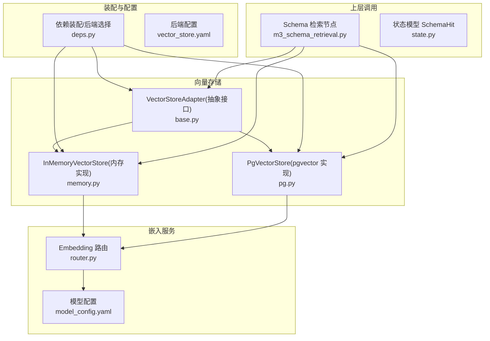
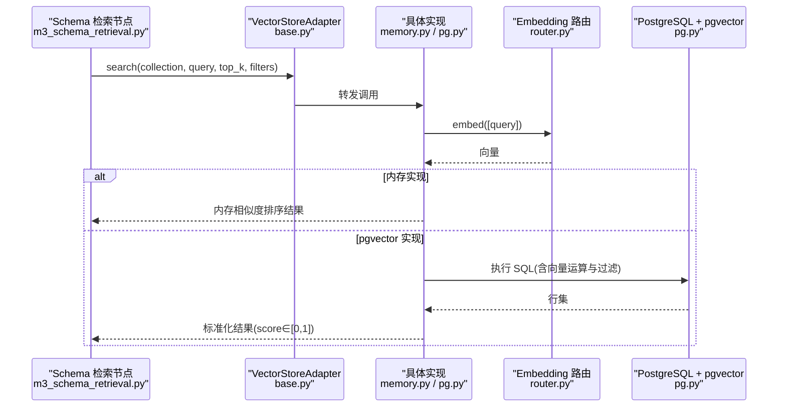
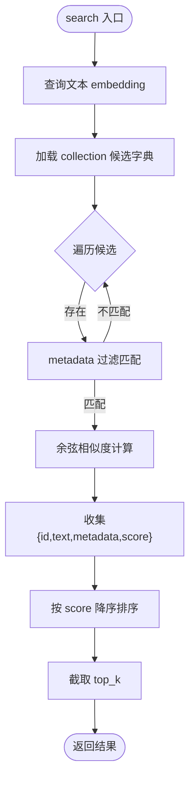
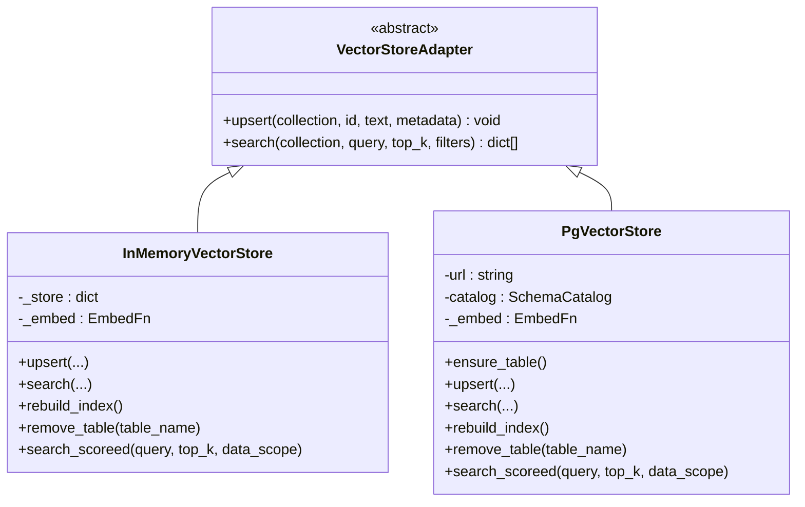
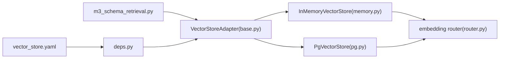

# 向量存储实现

<cite>
**本文引用的文件**   
- [base.py](file://nl2sql_agent/services/vector_store/base.py)
- [memory.py](file://nl2sql_agent/services/vector_store/memory.py)
- [pg.py](file://nl2sql_agent/services/vector_store/pg.py)
- [deps.py](file://nl2sql_agent/services/deps.py)
- [vector_store.yaml](file://nl2sql_agent/config/vector_store.yaml)
- [router.py](file://nl2sql_agent/services/embedding/router.py)
- [model_config.yaml](file://nl2sql_agent/config/model_config.yaml)
- [m3_schema_retrieval.py](file://nl2sql_agent/nodes/m3_schema_retrieval.py)
- [test_vector_store.py](file://nl2sql_agent/tests/test_vector_store.py)
- [state.py](file://nl2sql_agent/state.py)
</cite>

## 目录
1. [简介](#简介)
2. [项目结构](#项目结构)
3. [核心组件](#核心组件)
4. [架构总览](#架构总览)
5. [详细组件分析](#详细组件分析)
6. [依赖关系分析](#依赖关系分析)
7. [性能与扩展性](#性能与扩展性)
8. [故障排查指南](#故障排查指南)
9. [结论](#结论)
10. [附录：选型与迁移指南](#附录选型与迁移指南)

## 简介
本文件面向向量存储子系统，系统性阐述抽象接口、内存实现与 PostgreSQL（pgvector）实现的差异与适用场景，覆盖数据模型、索引策略、查询优化、CRUD 与批量处理、事务管理、连接池配置、错误处理与重试机制，并提供选型决策与迁移方案，帮助开发者在不同后端之间做出合理技术选择。

## 项目结构
向量存储相关代码位于 services/vector_store 包内，包含统一抽象接口与两种具体实现；依赖 embedding 路由提供统一的向量化能力；通过 deps 装配器按配置动态选择后端；检索节点 m3_schema_retrieval 使用向量存储进行混合召回。

图表来源
- [base.py:11-21](file://nl2sql_agent/services/vector_store/base.py#L11-L21)
- [memory.py:18-56](file://nl2sql_agent/services/vector_store/memory.py#L18-L56)
- [pg.py:15-65](file://nl2sql_agent/services/vector_store/pg.py#L15-L65)
- [deps.py:86-104](file://nl2sql_agent/services/deps.py#L86-L104)
- [vector_store.yaml:1-6](file://nl2sql_agent/config/vector_store.yaml#L1-L6)
- [router.py:34-61](file://nl2sql_agent/services/embedding/router.py#L34-L61)
- [model_config.yaml:1-16](file://nl2sql_agent/config/model_config.yaml#L1-L16)
- [m3_schema_retrieval.py:62-73](file://nl2sql_agent/nodes/m3_schema_retrieval.py#L62-L73)
- [state.py:14-21](file://nl2sql_agent/state.py#L14-L21)

章节来源
- [base.py:11-21](file://nl2sql_agent/services/vector_store/base.py#L11-L21)
- [memory.py:18-56](file://nl2sql_agent/services/vector_store/memory.py#L18-L56)
- [pg.py:15-65](file://nl2sql_agent/services/vector_store/pg.py#L15-L65)
- [deps.py:86-104](file://nl2sql_agent/services/deps.py#L86-L104)
- [vector_store.yaml:1-6](file://nl2sql_agent/config/vector_store.yaml#L1-L6)
- [router.py:34-61](file://nl2sql_agent/services/embedding/router.py#L34-L61)
- [model_config.yaml:1-16](file://nl2sql_agent/config/model_config.yaml#L1-L16)
- [m3_schema_retrieval.py:62-73](file://nl2sql_agent/nodes/m3_schema_retrieval.py#L62-L73)
- [state.py:14-21](file://nl2sql_agent/state.py#L14-L21)

## 核心组件
- VectorStoreAdapter：定义 upsert 与 search 两个抽象方法，屏蔽后端差异，返回标准化结果集。
- InMemoryVectorStore：基于内存字典的向量存储，使用余弦相似度评分，支持 collection 隔离与 metadata 过滤。
- PgVectorStore：基于 PostgreSQL + pgvector 的持久化实现，使用向量类型与 <=> 算子进行余弦距离检索。
- Embedding 路由：统一对外暴露 embed(texts) -> list[list[float]]，支持本地模型与测试 fake 模式。
- 依赖装配：根据 vector_store.yaml 显式选择后端，注入 catalog 与可选 embed 函数。

章节来源
- [base.py:11-21](file://nl2sql_agent/services/vector_store/base.py#L11-L21)
- [memory.py:18-56](file://nl2sql_agent/services/vector_store/memory.py#L18-L56)
- [pg.py:15-65](file://nl2sql_agent/services/vector_store/pg.py#L15-L65)
- [router.py:34-61](file://nl2sql_agent/services/embedding/router.py#L34-L61)
- [deps.py:86-104](file://nl2sql_agent/services/deps.py#L86-L104)

## 架构总览
下图展示从上层检索节点到向量存储后端的完整调用链，包括 embedding 生成、过滤条件传递与结果归一化。

图表来源
- [m3_schema_retrieval.py:62-73](file://nl2sql_agent/nodes/m3_schema_retrieval.py#L62-L73)
- [base.py:11-21](file://nl2sql_agent/services/vector_store/base.py#L11-L21)
- [memory.py:39-49](file://nl2sql_agent/services/vector_store/memory.py#L39-L49)
- [pg.py:46-65](file://nl2sql_agent/services/vector_store/pg.py#L46-L65)
- [router.py:34-61](file://nl2sql_agent/services/embedding/router.py#L34-L61)

## 详细组件分析

### 抽象接口 VectorStoreAdapter
- 职责：定义 upsert(idempotent) 与 search(filters-aware) 的统一契约。
- 设计要点：
  - 将 embedding 计算下沉至实现内部，调用方仅关心文本与元数据。
  - search 返回标准化结构，score 范围限定在 [0,1]，便于上层融合评分。
- 复杂度：接口本身无复杂度；实际复杂度由实现决定。

章节来源
- [base.py:11-21](file://nl2sql_agent/services/vector_store/base.py#L11-L21)

### 内存实现 InMemoryVectorStore
- 数据结构：
  - _store: dict[collection][id] = {embedding, text, metadata}
  - 集合常量：COLLECTION_TABLE/COLLECTION_COLUMN/COLLECTION_RELATION
- 关键方法：
  - upsert：对文本进行 embedding，写入内存字典。
  - search：对查询文本 embedding 后遍历候选，应用 metadata 过滤，计算余弦相似度并排序。
  - rebuild_index：清空内存并重建索引，适用于 embedding 模型切换。
  - remove_table：删除表级、字段级、关系级条目，用于增量同步清理。
  - search_scored：结合 catalog 的 data_scope 过滤，返回 (SchemaHit, score)。
- 复杂度：
  - upsert：O(d)，d 为向量维度。
  - search：O(N·d)，N 为候选数量；top_k 截断。
- 限制：
  - 重启丢失；不适合大规模数据与高并发写。
  - 过滤为全量扫描，未建立二级索引。

图表来源
- [memory.py:39-49](file://nl2sql_agent/services/vector_store/memory.py#L39-L49)

章节来源
- [memory.py:18-56](file://nl2sql_agent/services/vector_store/memory.py#L18-L56)
- [memory.py:109-114](file://nl2sql_agent/services/vector_store/memory.py#L109-L114)
- [memory.py:86-95](file://nl2sql_agent/services/vector_store/memory.py#L86-L95)
- [memory.py:115-139](file://nl2sql_agent/services/vector_store/memory.py#L115-L139)

### pgvector 实现 PgVectorStore
- 表结构设计：
  - schema_embeddings(collection TEXT, id TEXT, text TEXT, metadata TEXT, embedding vector(D), PRIMARY KEY(collection,id))
  - dimension D 来自 model_config.embedding.dimension（默认 384）。
- 关键方法：
  - ensure_table：DDL 建表，幂等。
  - upsert：INSERT ... ON CONFLICT DO UPDATE，保证幂等更新。
  - search：WHERE collection=... AND metadata::jsonb->>'business_line'=... ORDER BY embedding <=> ... LIMIT top_k。
  - rebuild_index：先清空三集合，再按 catalog 或 mschema 源重建。
  - remove_table：删除表级、字段级、关系级条目。
  - search_scored：按 data_scope 过滤表名集合，执行向量检索并映射回 SchemaHit。
- 索引与查询优化建议：
  - 当前实现未创建额外索引；建议在 (collection, business_line) 上建立复合索引以加速过滤。
  - 可考虑为 embedding 列添加 IVFFlat/HNSW 索引以提升 kNN 性能（需评估维度与数据规模）。
- 事务与连接：
  - 每次 upsert/search 使用 with 上下文管理连接与游标，自动 commit/关闭。
  - 未实现连接池；生产环境建议引入连接池（如 psycopg Pool 或外部连接池管理器）。

图表来源
- [base.py:11-21](file://nl2sql_agent/services/vector_store/base.py#L11-L21)
- [memory.py:18-56](file://nl2sql_agent/services/vector_store/memory.py#L18-L56)
- [pg.py:15-65](file://nl2sql_agent/services/vector_store/pg.py#L15-L65)

章节来源
- [pg.py:69-79](file://nl2sql_agent/services/vector_store/pg.py#L69-L79)
- [pg.py:32-44](file://nl2sql_agent/services/vector_store/pg.py#L32-L44)
- [pg.py:46-65](file://nl2sql_agent/services/vector_store/pg.py#L46-L65)
- [pg.py:81-118](file://nl2sql_agent/services/vector_store/pg.py#L81-L118)
- [pg.py:120-136](file://nl2sql_agent/services/vector_store/pg.py#L120-L136)
- [pg.py:139-173](file://nl2sql_agent/services/vector_store/pg.py#L139-L173)

### 嵌入路由 Embedding Router
- 功能：根据 model_config.yaml 的 embedding.provider 选择实现。
- provider=local：使用 sentence-transformers，支持 model_path 与 model 名下载；失败时抛出明确异常提示。
- provider=fake：确定性词袋向量，用于测试。
- 维度：dimension 字段被 PgVectorStore.ensure_table 读取用于建表。

章节来源
- [router.py:34-61](file://nl2sql_agent/services/embedding/router.py#L34-L61)
- [model_config.yaml:1-16](file://nl2sql_agent/config/model_config.yaml#L1-L16)

### 依赖装配与后端选择
- build_vector_store：读取 vector_store.yaml，若 backend=pgvector 则要求 pgvector.url 非空，否则抛错；否则返回内存实现。
- build_deps：组装 Deps，包含 vector_store、executor、llm 等；支持注入自定义 embed 函数（测试用）。

章节来源
- [deps.py:86-104](file://nl2sql_agent/services/deps.py#L86-L104)
- [deps.py:107-177](file://nl2sql_agent/services/deps.py#L107-L177)
- [vector_store.yaml:1-6](file://nl2sql_agent/config/vector_store.yaml#L1-L6)

### 检索节点集成
- m3_schema_retrieval：混合检索流程，分别调用 search_scored（表级）与 search（字段级/关系级），并按业务线 data_scope 过滤。
- 评分融合：表级与字段级分数加权合并，关系向量用于受约束补表。

章节来源
- [m3_schema_retrieval.py:62-73](file://nl2sql_agent/nodes/m3_schema_retrieval.py#L62-L73)
- [m3_schema_retrieval.py:86-117](file://nl2sql_agent/nodes/m3_schema_retrieval.py#L86-L117)
- [state.py:14-21](file://nl2sql_agent/state.py#L14-L21)

## 依赖关系分析
- 耦合关系：
  - 上层检索节点仅依赖 VectorStoreAdapter 接口，解耦具体实现。
  - 两种实现均依赖 embedding router，避免硬编码模型细节。
  - 装配层集中控制后端选择与参数注入。
- 外部依赖：
  - psycopg（延迟导入）用于 pgvector 实现。
  - sentence-transformers（延迟导入）用于本地 embedding。

图表来源
- [m3_schema_retrieval.py:62-73](file://nl2sql_agent/nodes/m3_schema_retrieval.py#L62-L73)
- [base.py:11-21](file://nl2sql_agent/services/vector_store/base.py#L11-L21)
- [memory.py:18-56](file://nl2sql_agent/services/vector_store/memory.py#L18-L56)
- [pg.py:15-65](file://nl2sql_agent/services/vector_store/pg.py#L15-L65)
- [router.py:34-61](file://nl2sql_agent/services/embedding/router.py#L34-L61)
- [deps.py:86-104](file://nl2sql_agent/services/deps.py#L86-L104)
- [vector_store.yaml:1-6](file://nl2sql_agent/config/vector_store.yaml#L1-L6)

章节来源
- [deps.py:86-104](file://nl2sql_agent/services/deps.py#L86-L104)
- [vector_store.yaml:1-6](file://nl2sql_agent/config/vector_store.yaml#L1-L6)

## 性能与扩展性
- 内存实现：
  - 优点：零依赖、低延迟、适合开发与测试、快速验证。
  - 缺点：无持久化、无索引、线性扫描 O(N·d)、重启丢失。
  - 适用：小规模数据、单进程、临时实验。
- pgvector 实现：
  - 优点：持久化、可扩展、支持复杂过滤与排序、可与数据库生态集成。
  - 缺点：需要数据库运维、连接开销、索引构建成本。
  - 优化建议：
    - 为 (collection, business_line) 建立复合索引。
    - 针对高维向量启用 IVFFlat/HNSW 索引（权衡 recall 与构建时间）。
    - 批量 upsert 减少往返；必要时引入连接池。
- 扩展性：
  - 通过 VectorStoreAdapter 新增新后端（如 Redis、Milvus）成本低。
  - embedding 路由支持多 provider，便于替换模型或接入 API。

[本节为通用指导，不直接分析具体文件]

## 故障排查指南
- 常见错误与定位：
  - embedding 模型加载失败：检查 model_config.embedding.provider 与 model_path；设置 HF_ENDPOINT 或使用 fake 模式。
  - pgvector 连接失败：确认 PGVECTOR_URL 环境变量与网络连通性；确保已安装 psycopg。
  - 维度不一致：确保 model_config.embedding.dimension 与数据库 vector(D) 一致。
  - 过滤无效：检查 metadata 中 business_line 是否匹配；pg 实现使用 jsonb->>'business_line'。
- 调试手段：
  - 使用 test_vector_store.py 中的 fake_embedding 验证接口行为。
  - 通过 rebuild_index 重建索引，排除脏数据影响。
  - 打印 search 返回的 score 分布，评估阈值与 top_k 设置。

章节来源
- [router.py:45-53](file://nl2sql_agent/services/embedding/router.py#L45-L53)
- [pg.py:25-28](file://nl2sql_agent/services/vector_store/pg.py#L25-L28)
- [pg.py:69-79](file://nl2sql_agent/services/vector_store/pg.py#L69-L79)
- [test_vector_store.py:12-24](file://nl2sql_agent/tests/test_vector_store.py#L12-L24)

## 结论
本项目通过抽象接口与装配层实现了向量存储的后端无关性，内存实现适合开发测试，pgvector 实现适合生产持久化与扩展。结合 embedding 路由与检索节点的混合策略，可在不同场景下取得良好召回与性能平衡。建议在生产环境优先采用 pgvector，并结合索引与连接池优化吞吐与延迟。

[本节为总结性内容，不直接分析具体文件]

## 附录：选型与迁移指南

### 选型决策
- 选择内存实现的条件：
  - 数据量小、无需持久化、快速迭代与测试。
  - 单机单进程部署，无跨进程共享需求。
- 选择 pgvector 实现的条件：
  - 需要持久化、水平扩展、与数据库生态集成。
  - 有明确的过滤维度（如 business_line）与高并发检索需求。

章节来源
- [deps.py:86-104](file://nl2sql_agent/services/deps.py#L86-L104)
- [vector_store.yaml:1-6](file://nl2sql_agent/config/vector_store.yaml#L1-L6)

### 迁移方案（内存 → pgvector）
- 步骤：
  1. 修改 vector_store.yaml 的 backend 为 pgvector，并设置 pgvector.url。
  2. 运行 ensure_table 建表（幂等）。
  3. 调用 rebuild_index 重建索引（优先从 catalog/mschema 恢复）。
  4. 验证 search 与 search_scored 结果一致性。
- 注意事项：
  - 确保 embedding 维度与数据库一致。
  - 如需批量导入，可封装批量 upsert 以减少往返。
  - 生产环境建议引入连接池与监控。

章节来源
- [pg.py:69-79](file://nl2sql_agent/services/vector_store/pg.py#L69-L79)
- [pg.py:81-118](file://nl2sql_agent/services/vector_store/pg.py#L81-L118)
- [deps.py:86-104](file://nl2sql_agent/services/deps.py#L86-L104)

### CRUD 与批量处理
- upsert：幂等写入，支持更新已有记录。
- search：支持 filters（如 business_line），返回标准化结果。
- 批量处理：
  - 内存实现：循环 upsert，注意内存占用。
  - pgvector 实现：可封装批量插入（分批提交），减少连接开销。
- 事务管理：
  - 当前实现每操作一次事务（with 上下文自动 commit）。
  - 批量场景建议外层事务包裹，提升一致性。

章节来源
- [memory.py:31-37](file://nl2sql_agent/services/vector_store/memory.py#L31-L37)
- [pg.py:32-44](file://nl2sql_agent/services/vector_store/pg.py#L32-L44)
- [pg.py:46-65](file://nl2sql_agent/services/vector_store/pg.py#L46-L65)

### 连接池与重试机制
- 连接池：
  - 当前未内置连接池；生产建议使用 psycopg Pool 或外部连接池管理器。
- 重试机制：
  - 当前未实现重试；可在调用层封装重试逻辑（指数退避）。
- 错误处理：
  - embedding 加载失败抛出明确异常。
  - pg 连接失败需捕获并重试或降级。

章节来源
- [pg.py:25-28](file://nl2sql_agent/services/vector_store/pg.py#L25-L28)
- [router.py:45-53](file://nl2sql_agent/services/embedding/router.py#L45-L53)