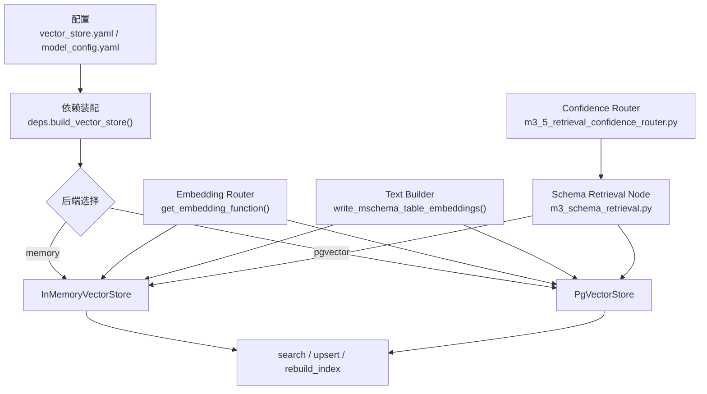
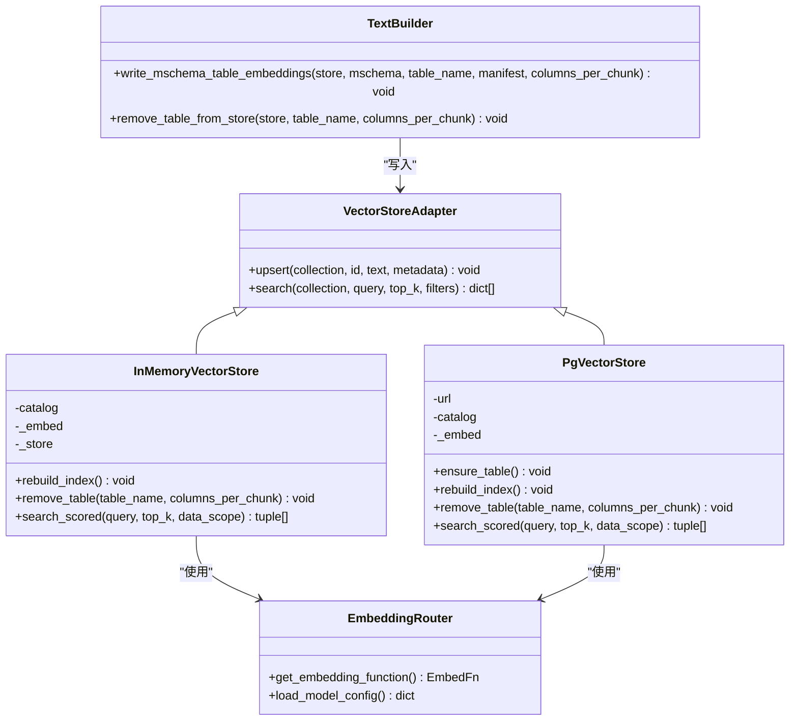
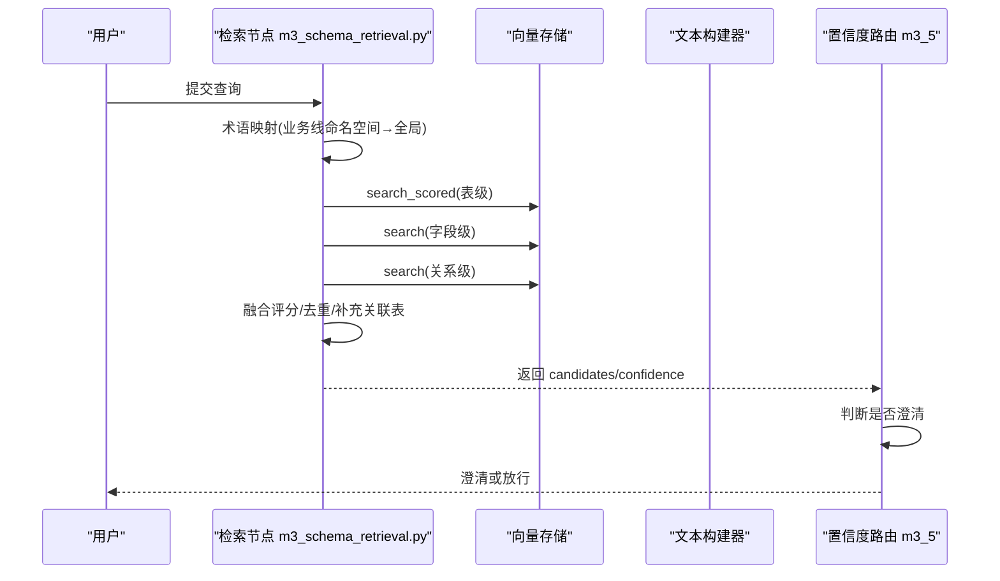
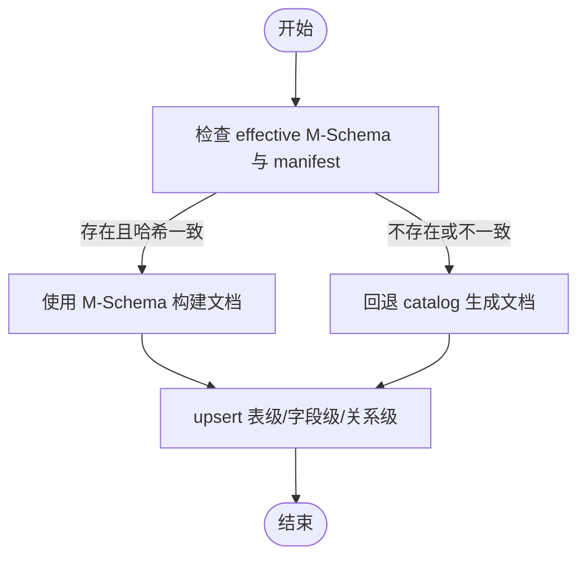
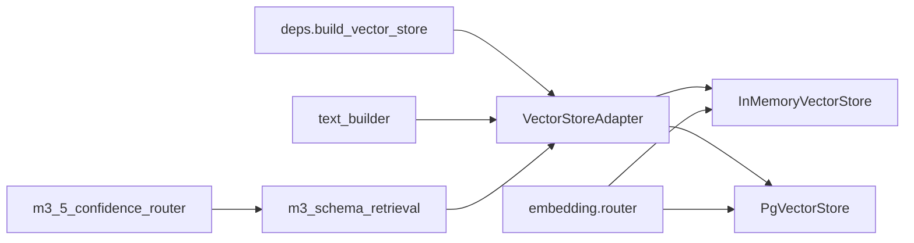

# 向量检索系统

<cite>
**本文引用的文件**   
- [vector_store.yaml](file://nl2sql_agent/config/vector_store.yaml)
- [model_config.yaml](file://nl2sql_agent/config/model_config.yaml)
- [base.py](file://nl2sql_agent/services/vector_store/base.py)
- [memory.py](file://nl2sql_agent/services/vector_store/memory.py)
- [pg.py](file://nl2sql_agent/services/vector_store/pg.py)
- [router.py](file://nl2sql_agent/services/embedding/router.py)
- [deps.py](file://nl2sql_agent/services/deps.py)
- [text_builder.py](file://nl2sql_agent/services/schema_ingest/text_builder.py)
- [m3_schema_retrieval.py](file://nl2sql_agent/nodes/m3_schema_retrieval.py)
- [m3_5_retrieval_confidence_router.py](file://nl2sql_agent/nodes/m3_5_retrieval_confidence_router.py)
- [state.py](file://nl2sql_agent/state.py)
- [test_vector_store.py](file://nl2sql_agent/tests/test_vector_store.py)
</cite>

## 目录
1. [简介](#简介)
2. [项目结构](#项目结构)
3. [核心组件](#核心组件)
4. [架构总览](#架构总览)
5. [详细组件分析](#详细组件分析)
6. [依赖关系分析](#依赖关系分析)
7. [性能与索引优化](#性能与索引优化)
8. [故障排查指南](#故障排查指南)
9. [结论](#结论)
10. [附录：配置与基准建议](#附录配置与基准建议)

## 简介
本文件系统性地文档化 NL2SQL 项目中的向量检索子系统，覆盖存储架构（内存与 pgvector）、文本向量化流程、相似度计算与索引策略、检索置信度评估、候选表选择策略、数据生命周期管理（增量更新/版本控制/迁移）、配置项说明、性能调优与扩容指导，以及维护工具与故障排查方法。内容兼顾初学者理解与专家级优化需求。

## 项目结构
向量检索相关代码主要分布在以下模块：
- 配置层：vector_store.yaml、model_config.yaml
- 适配层：services/vector_store/*（统一接口 + 内存/Postgres 实现）
- 嵌入路由：services/embedding/router.py（模型加载与 provider 切换）
- 依赖装配：services/deps.py（按配置构建后端实例）
- 文本构建：services/schema_ingest/text_builder.py（M-Schema 到向量文档）
- 检索节点：nodes/m3_schema_retrieval.py（混合检索与融合评分）
- 置信度路由：nodes/m3_5_retrieval_confidence_router.py（阈值与澄清）
- 状态定义：state.py（SchemaHit、NL2SQLState）
- 测试用例：tests/test_vector_store.py（后端切换、行为验证）

**图表来源** 
- [deps.py:86-104](file://nl2sql_agent/services/deps.py#L86-L104)
- [router.py:34-61](file://nl2sql_agent/services/embedding/router.py#L34-L61)
- [memory.py:18-49](file://nl2sql_agent/services/vector_store/memory.py#L18-L49)
- [pg.py:15-65](file://nl2sql_agent/services/vector_store/pg.py#L15-L65)
- [text_builder.py:83-151](file://nl2sql_agent/services/schema_ingest/text_builder.py#L83-L151)
- [m3_schema_retrieval.py:166-249](file://nl2sql_agent/nodes/m3_schema_retrieval.py#L166-L249)
- [m3_5_retrieval_confidence_router.py:26-37](file://nl2sql_agent/nodes/m3_5_retrieval_confidence_router.py#L26-L37)

**章节来源**
- [vector_store.yaml:1-6](file://nl2sql_agent/config/vector_store.yaml#L1-L6)
- [model_config.yaml:1-16](file://nl2sql_agent/config/model_config.yaml#L1-L16)
- [deps.py:86-104](file://nl2sql_agent/services/deps.py#L86-L104)

## 核心组件
- 统一接口 VectorStoreAdapter：定义 upsert/search 抽象，屏蔽后端差异。
- InMemoryVectorStore：进程内字典存储，余弦相似度计算，适合开发/测试与轻量场景。
- PgVectorStore：基于 PostgreSQL + pgvector 扩展，持久化存储，支持 SQL 过滤与排序。
- Embedding Router：统一 embed(texts) -> list[list[float]]，支持 local/fake 两种 provider。
- Text Builder：从 effective M-Schema 生成表级/字段级/关系级向量文档，并写入 store。
- Schema Retrieval Node：术语映射 + 表级/字段级向量混合召回，关系向量补充关联表。
- Confidence Router：基于检索置信度与候选差距阈值进行澄清或放行。

**章节来源**
- [base.py:11-21](file://nl2sql_agent/services/vector_store/base.py#L11-L21)
- [memory.py:18-49](file://nl2sql_agent/services/vector_store/memory.py#L18-L49)
- [pg.py:15-65](file://nl2sql_agent/services/vector_store/pg.py#L15-L65)
- [router.py:34-61](file://nl2sql_agent/services/embedding/router.py#L34-L61)
- [text_builder.py:83-151](file://nl2sql_agent/services/schema_ingest/text_builder.py#L83-L151)
- [m3_schema_retrieval.py:166-249](file://nl2sql_agent/nodes/m3_schema_retrieval.py#L166-L249)
- [m3_5_retrieval_confidence_router.py:26-37](file://nl2sql_agent/nodes/m3_5_retrieval_confidence_router.py#L26-L37)

## 架构总览
向量检索子系统采用“适配器模式”解耦存储后端，通过配置显式选择 memory 或 pgvector；嵌入过程由 router 提供统一函数；文本构建以 effective M-Schema 为输入，产出三类集合的向量文档；检索节点将术语映射与向量召回融合，并由置信度路由决定是否需要用户澄清。

**图表来源** 
- [base.py:11-21](file://nl2sql_agent/services/vector_store/base.py#L11-L21)
- [memory.py:18-140](file://nl2sql_agent/services/vector_store/memory.py#L18-L140)
- [pg.py:15-174](file://nl2sql_agent/services/vector_store/pg.py#L15-L174)
- [router.py:23-61](file://nl2sql_agent/services/embedding/router.py#L23-L61)
- [text_builder.py:83-160](file://nl2sql_agent/services/schema_ingest/text_builder.py#L83-L160)

## 详细组件分析

### 向量存储后端对比与选择策略
- 内存存储（InMemoryVectorStore）
  - 优点：零依赖、启动快、便于开发与测试；支持 filters 与余弦相似度。
  - 缺点：重启丢失、无外部索引加速、不适合大规模持久化。
  - 适用：本地调试、CI/CD、小规模实验。
- pgvector 存储（PgVectorStore）
  - 优点：持久化、可扩展、支持 SQL 过滤与排序；可结合数据库索引优化。
  - 缺点：需要部署 Postgres + pgvector；建表维度需匹配模型输出。
  - 适用：生产环境、多租户隔离、跨进程共享。

选择策略：
- 通过 config/vector_store.yaml 的 backend 字段显式选择。
- 若选择 pgvector，必须提供 pgvector.url（支持环境变量展开）。
- 默认 fallback 为 memory，保证最小可用。

**章节来源**
- [vector_store.yaml:1-6](file://nl2sql_agent/config/vector_store.yaml#L1-L6)
- [deps.py:86-104](file://nl2sql_agent/services/deps.py#L86-L104)
- [test_vector_store.py:44-67](file://nl2sql_agent/tests/test_vector_store.py#L44-L67)

### 文本向量化与嵌入模型配置
- 统一嵌入函数：get_embedding_function() 返回 embed(texts) -> list[list[float]]。
- Provider 类型：
  - local：使用 sentence-transformers，支持 model_path 或 model 名；自动归一化。
  - fake：确定性词袋向量，用于测试，不依赖外部模型。
- 配置项：
  - embedding.provider：local 或 fake
  - embedding.model：模型名称（HuggingFace）
  - embedding.model_path：本地模型路径（相对项目根解析）
  - embedding.dimension：向量维度（用于 pgvector 建表）

批量处理与缓存：
- embed 内部调用模型 encode 批量编码，返回浮点矩阵。
- _load_local_model 使用 lru_cache 缓存模型实例，避免重复加载。

**章节来源**
- [router.py:34-61](file://nl2sql_agent/services/embedding/router.py#L34-L61)
- [router.py:23-31](file://nl2sql_agent/services/embedding/router.py#L23-L31)
- [model_config.yaml:1-16](file://nl2sql_agent/config/model_config.yaml#L1-L16)

### 相似度计算与索引策略
- 内存存储：自定义余弦相似度 _cosine(a,b)，对候选逐项计算后排序取 top_k。
- pgvector 存储：使用 <=> 运算符计算向量距离，并通过 1 - (embedding <=> %s::vector)/2 转换为 [0,1] 分数。
- 索引优化：
  - pgvector 可通过创建 ivfflat/hnsw 索引提升检索性能（需在数据库侧配置）。
  - ensure_table 根据 embedding.dimension 动态创建 schema_embeddings 表。

**章节来源**
- [memory.py:14-49](file://nl2sql_agent/services/vector_store/memory.py#L14-L49)
- [pg.py:46-65](file://nl2sql_agent/services/vector_store/pg.py#L46-L65)
- [pg.py:69-79](file://nl2sql_agent/services/vector_store/pg.py#L69-L79)

### 检索流程与候选表选择
- 混合检索：
  - 术语映射优先：按 data_scope 精确命中主表。
  - 表级+字段级向量召回：分别检索并按权重融合（table_weight/column_weight）。
  - 关系向量补充：仅扩展与已召回主表直接相连且可见的关系表。
- 置信度评估：
  - 术语命中 → confidence=1.0；多候选 → 进入候选澄清。
  - 向量命中 → confidence=top_score；若低于阈值 → 低置信澄清。
- 候选表选择：
  - 候选差距 candidate_gap_threshold 决定哪些候选进入澄清。
  - 字段相关性加成：查询剩余词与字段名/注释重叠次数加权。

**图表来源** 
- [m3_schema_retrieval.py:166-249](file://nl2sql_agent/nodes/m3_schema_retrieval.py#L166-L249)
- [m3_5_retrieval_confidence_router.py:26-37](file://nl2sql_agent/nodes/m3_5_retrieval_confidence_router.py#L26-L37)

**章节来源**
- [m3_schema_retrieval.py:86-118](file://nl2sql_agent/nodes/m3_schema_retrieval.py#L86-L118)
- [m3_schema_retrieval.py:120-144](file://nl2sql_agent/nodes/m3_schema_retrieval.py#L120-L144)
- [m3_schema_retrieval.py:146-164](file://nl2sql_agent/nodes/m3_schema_retrieval.py#L146-L164)
- [m3_5_retrieval_confidence_router.py:18-37](file://nl2sql_agent/nodes/m3_5_retrieval_confidence_router.py#L18-L37)

### 向量数据生命周期管理
- 增量更新：
  - write_mschema_table_embeddings 先删除旧条目再写入新条目，确保一致性。
  - remove_table_from_store 清理表级/字段级/关系级向量。
- 版本控制：
  - effective M-Schema 与 manifest.json 的 semantic_hash 校验，防止不一致重建。
  - common_metadata 包含 snapshot_id、semantic_hash、table_semantic_hash 等追踪字段。
- 数据迁移：
  - rebuild_index 全量重建，优先从 effective M-Schema 恢复；否则回退 catalog 生成。
  - pgvector 端 ensure_table 按 dimension 动态建表。

**图表来源** 
- [text_builder.py:16-32](file://nl2sql_agent/services/schema_ingest/text_builder.py#L16-L32)
- [text_builder.py:83-151](file://nl2sql_agent/services/schema_ingest/text_builder.py#L83-L151)
- [pg.py:81-118](file://nl2sql_agent/services/vector_store/pg.py#L81-L118)
- [memory.py:109-114](file://nl2sql_agent/services/vector_store/memory.py#L109-L114)

**章节来源**
- [text_builder.py:83-160](file://nl2sql_agent/services/schema_ingest/text_builder.py#L83-L160)
- [pg.py:69-118](file://nl2sql_agent/services/vector_store/pg.py#L69-L118)
- [memory.py:86-114](file://nl2sql_agent/services/vector_store/memory.py#L86-L114)

### 检索置信度评估算法与候选表选择策略
- 置信度来源：
  - 术语精确命中 → 1.0
  - 向量检索 → top_score 作为置信度
- 候选澄清条件：
  - 多个候选且差距小于 candidate_gap_threshold → clarify_candidates
  - 置信度低于 confidence_threshold → clarify_low_confidence
- 用户交互：
  - 通过 interrupt 机制暂停流程，等待用户选择或确认。

**章节来源**
- [m3_5_retrieval_confidence_router.py:18-37](file://nl2sql_agent/nodes/m3_5_retrieval_confidence_router.py#L18-L37)
- [m3_5_retrieval_confidence_router.py:40-92](file://nl2sql_agent/nodes/m3_5_retrieval_confidence_router.py#L40-L92)
- [m3_5_retrieval_confidence_router.py:95-127](file://nl2sql_agent/nodes/m3_5_retrieval_confidence_router.py#L95-L127)

## 依赖关系分析
- deps.build_vector_store 读取 vector_store.yaml 选择后端。
- embedding.router.get_embedding_function 被两个存储实现共同使用。
- text_builder.write_mschema_table_embeddings 依赖 VectorStoreAdapter 接口写入。
- m3_schema_retrieval 依赖 vector_store.search/search_scored 进行召回。
- m3_5_retrieval_confidence_router 依赖 state.retrieval_candidates/confidence 做决策。

**图表来源** 
- [deps.py:86-104](file://nl2sql_agent/services/deps.py#L86-L104)
- [router.py:34-61](file://nl2sql_agent/services/embedding/router.py#L34-L61)
- [text_builder.py:83-151](file://nl2sql_agent/services/schema_ingest/text_builder.py#L83-L151)
- [m3_schema_retrieval.py:166-249](file://nl2sql_agent/nodes/m3_schema_retrieval.py#L166-L249)
- [m3_5_retrieval_confidence_router.py:26-37](file://nl2sql_agent/nodes/m3_5_retrieval_confidence_router.py#L26-L37)

**章节来源**
- [deps.py:86-104](file://nl2sql_agent/services/deps.py#L86-L104)
- [router.py:34-61](file://nl2sql_agent/services/embedding/router.py#L34-L61)
- [text_builder.py:83-151](file://nl2sql_agent/services/schema_ingest/text_builder.py#L83-L151)
- [m3_schema_retrieval.py:166-249](file://nl2sql_agent/nodes/m3_schema_retrieval.py#L166-L249)
- [m3_5_retrieval_confidence_router.py:26-37](file://nl2sql_agent/nodes/m3_5_retrieval_confidence_router.py#L26-L37)

## 性能与索引优化
- 内存存储：
  - 适合小规模数据；top_k 控制结果集大小。
  - 无外部索引，复杂度 O(N)。
- pgvector 存储：
  - 建议使用 ivfflat/hnsw 索引（需在数据库侧创建），显著提升大规模检索性能。
  - 确保 embedding.dimension 与模型输出一致，避免建表失败。
- 批量处理：
  - embedding.encode 支持批量编码，减少模型调用开销。
- 过滤与排序：
  - pgvector 利用 SQL WHERE + ORDER BY 下推过滤与排序，减少 Python 层处理。

[本节为通用性能建议，不直接分析具体文件]

## 故障排查指南
- 后端切换失败：
  - 检查 vector_store.yaml 的 backend 与 pgvector.url 配置。
  - 环境变量 PGVECTOR_URL 是否正确展开。
- 模型加载失败：
  - 检查 model_config.yaml 的 provider/model/model_path。
  - 网络问题可设置 HF_ENDPOINT 或使用离线模型。
- 检索结果为空：
  - 确认有效 M-Schema 与 manifest.json 是否存在且语义哈希一致。
  - 检查 data_scope 权限过滤是否过严。
- 置信度过低：
  - 调整 clarification_rules 中的 thresholds。
  - 检查文本构建质量（字段注释、样例值等）。

**章节来源**
- [deps.py:96-104](file://nl2sql_agent/services/deps.py#L96-L104)
- [router.py:45-53](file://nl2sql_agent/services/embedding/router.py#L45-L53)
- [text_builder.py:16-32](file://nl2sql_agent/services/schema_ingest/text_builder.py#L16-L32)
- [m3_5_retrieval_confidence_router.py:18-37](file://nl2sql_agent/nodes/m3_5_retrieval_confidence_router.py#L18-L37)

## 结论
本向量检索系统通过统一的适配器接口与可配置的嵌入路由，实现了内存与 pgvector 双后端无缝切换；结合 effective M-Schema 的文本构建与混合检索策略，提供了高可用的 Schema 召回能力；置信度路由与用户澄清机制提升了交互体验与准确率。在生产环境中，建议启用 pgvector 并配合数据库索引优化，同时完善 M-Schema 元数据以提升检索质量。

[本节为总结性内容，不直接分析具体文件]

## 附录：配置与基准建议
- 关键配置项：
  - vector_store.yaml：backend、pgvector.url
  - model_config.yaml：embedding.provider、model、model_path、dimension
  - settings.yaml：schema_search_top_k、execution.limit、row_level_filter
- 基准测试建议：
  - 不同 top_k 下的延迟与召回率曲线。
  - 内存 vs pgvector 在相同数据规模下的吞吐对比。
  - 不同 embedding 模型（维度/精度）对检索效果的影响。
- 扩容指导：
  - 数据量增长时优先切换到 pgvector，并创建合适索引。
  - 增加 embedding 模型的批处理大小以提升吞吐量。
  - 使用 effective M-Schema 的版本化管理，避免全量重建。

**章节来源**
- [vector_store.yaml:1-6](file://nl2sql_agent/config/vector_store.yaml#L1-L6)
- [model_config.yaml:1-16](file://nl2sql_agent/config/model_config.yaml#L1-L16)
- [deps.py:133-143](file://nl2sql_agent/services/deps.py#L133-L143)
- [test_vector_store.py:12-24](file://nl2sql_agent/tests/test_vector_store.py#L12-L24)