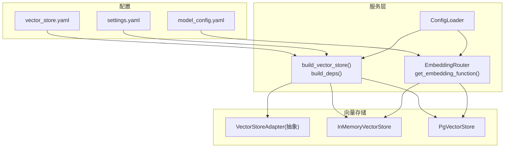
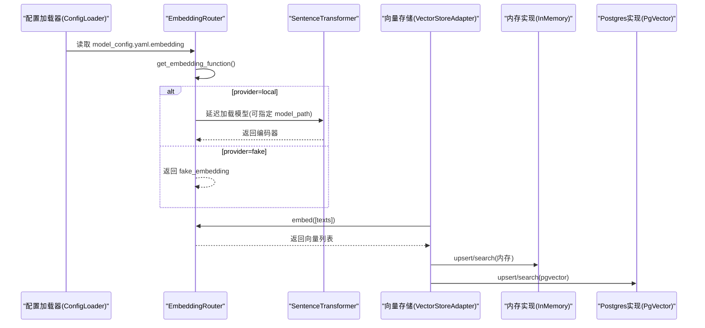
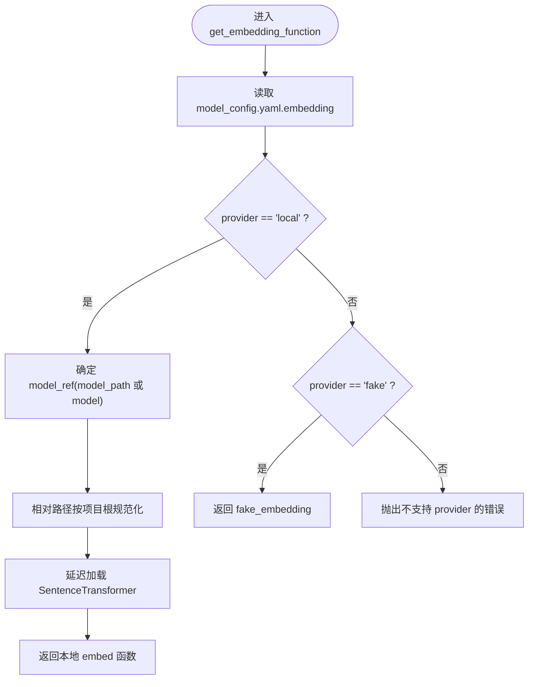
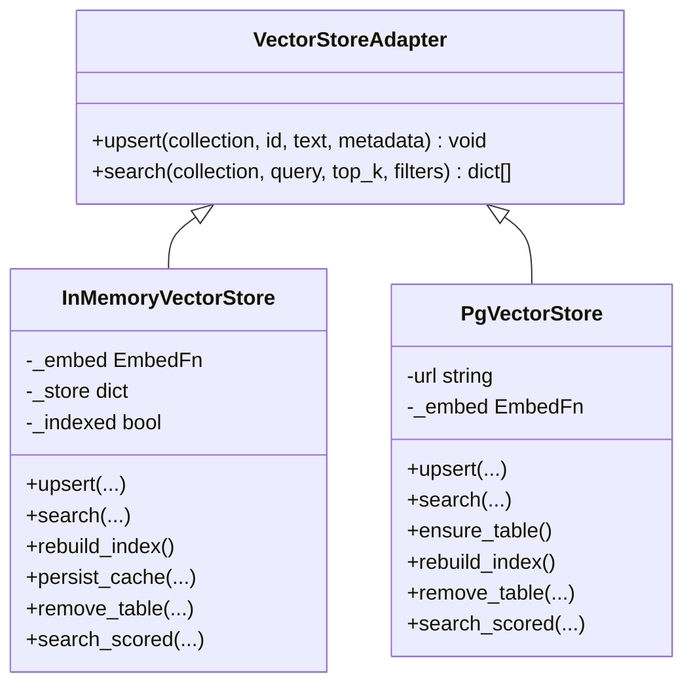
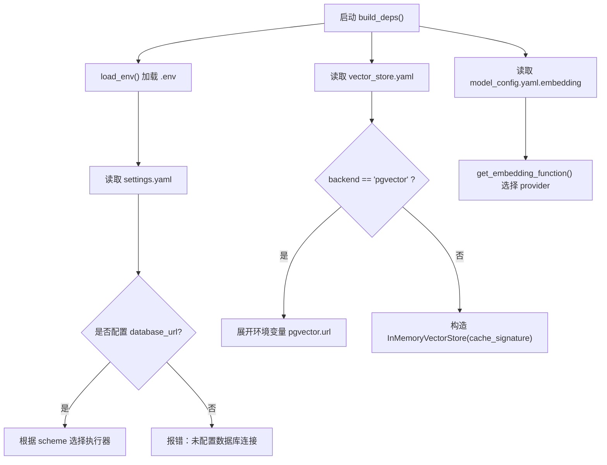
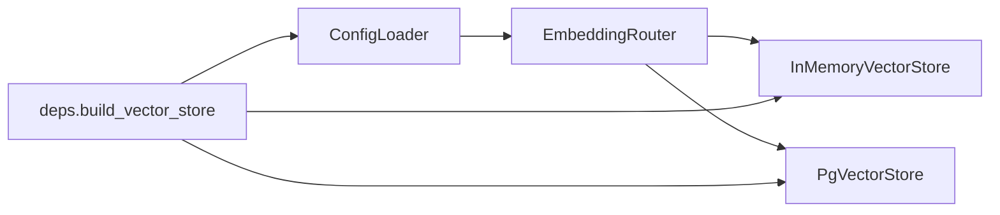

# 嵌入模型配置

<cite>
**本文引用的文件**   
- [model_config.yaml](file://nl2sql_agent/config/model_config.yaml)
- [vector_store.yaml](file://nl2sql_agent/config/vector_store.yaml)
- [settings.yaml](file://nl2sql_agent/config/settings.yaml)
- [router.py](file://nl2sql_agent/services/embedding/router.py)
- [config_loader.py](file://nl2sql_agent/services/config_loader.py)
- [deps.py](file://nl2sql_agent/services/deps.py)
- [base.py](file://nl2sql_agent/services/vector_store/base.py)
- [memory.py](file://nl2sql_agent/services/vector_store/memory.py)
- [pg.py](file://nl2sql_agent/services/vector_store/pg.py)
</cite>

## 目录
1. [简介](#简介)
2. [项目结构](#项目结构)
3. [核心组件](#核心组件)
4. [架构总览](#架构总览)
5. [详细组件分析](#详细组件分析)
6. [依赖关系分析](#依赖关系分析)
7. [性能考虑](#性能考虑)
8. [故障排查指南](#故障排查指南)
9. [结论](#结论)
10. [附录](#附录)

## 简介
本文件面向“嵌入模型配置”的完整说明，覆盖 EmbeddingRouter 的路由机制与模型选择策略、支持的嵌入模型类型与配置项、文本向量化流程（预处理、批量优化、缓存）、YAML 配置格式与环境变量管理、动态切换机制、质量评估指标与基准测试建议、模型更新与版本管理、故障转移策略，以及常见问题排查与性能调优。目标是帮助用户正确配置与管理嵌入模型，获得最佳检索效果。

## 项目结构
与嵌入相关的代码与配置集中在以下位置：
- 配置层：model_config.yaml、vector_store.yaml、settings.yaml
- 适配层：services/embedding/router.py（EmbeddingRouter）
- 配置加载：services/config_loader.py（ConfigLoader）
- 依赖装配：services/deps.py（构建向量存储后端与 embedding 函数）
- 向量存储接口与实现：services/vector_store/base.py、memory.py、pg.py

**图表来源** 
- [model_config.yaml:1-16](file://nl2sql_agent/config/model_config.yaml#L1-L16)
- [vector_store.yaml:1-6](file://nl2sql_agent/config/vector_store.yaml#L1-L6)
- [settings.yaml:1-30](file://nl2sql_agent/config/settings.yaml#L1-L30)
- [router.py:1-81](file://nl2sql_agent/services/embedding/router.py#L1-L81)
- [config_loader.py:1-36](file://nl2sql_agent/services/config_loader.py#L1-L36)
- [deps.py:87-108](file://nl2sql_agent/services/deps.py#L87-L108)
- [base.py:1-21](file://nl2sql_agent/services/vector_store/base.py#L1-L21)
- [memory.py:1-192](file://nl2sql_agent/services/vector_store/memory.py#L1-L192)
- [pg.py:1-174](file://nl2sql_agent/services/vector_store/pg.py#L1-L174)

**章节来源**
- [model_config.yaml:1-16](file://nl2sql_agent/config/model_config.yaml#L1-L16)
- [vector_store.yaml:1-6](file://nl2sql_agent/config/vector_store.yaml#L1-L6)
- [settings.yaml:1-30](file://nl2sql_agent/config/settings.yaml#L1-L30)
- [router.py:1-81](file://nl2sql_agent/services/embedding/router.py#L1-L81)
- [config_loader.py:1-36](file://nl2sql_agent/services/config_loader.py#L1-L36)
- [deps.py:87-108](file://nl2sql_agent/services/deps.py#L87-L108)
- [base.py:1-21](file://nl2sql_agent/services/vector_store/base.py#L1-L21)
- [memory.py:1-192](file://nl2sql_agent/services/vector_store/memory.py#L1-L192)
- [pg.py:1-174](file://nl2sql_agent/services/vector_store/pg.py#L1-L174)

## 核心组件
- EmbeddingRouter（router.py）
  - 提供统一的 embed(texts) -> list[list[float]] 接口
  - 支持 provider=local（本地 sentence-transformers）与 provider=fake（确定性词袋向量，仅测试）
  - 通过 ConfigLoader 读取 model_config.yaml 的 embedding 段
  - 本地模型加载使用延迟导入与 LRU 缓存，避免重复初始化开销
- VectorStoreAdapter（base.py）
  - 定义 upsert/search 统一接口，屏蔽内存/Postgres 差异
- InMemoryVectorStore（memory.py）
  - 内存实现，余弦相似度检索；内置 schema 索引与向量缓存持久化
- PgVectorStore（pg.py）
  - Postgres + pgvector 实现；自动建表并依据 dimension 创建 vector 列
- ConfigLoader（config_loader.py）
  - YAML 配置加载器，基于 mtime 的热更新，毫秒级比对，无需重启
- Deps（deps.py）
  - 组装应用依赖，显式选择向量存储后端，注入 embedding 函数

**章节来源**
- [router.py:1-81](file://nl2sql_agent/services/embedding/router.py#L1-L81)
- [base.py:1-21](file://nl2sql_agent/services/vector_store/base.py#L1-L21)
- [memory.py:1-192](file://nl2sql_agent/services/vector_store/memory.py#L1-L192)
- [pg.py:1-174](file://nl2sql_agent/services/vector_store/pg.py#L1-L174)
- [config_loader.py:1-36](file://nl2sql_agent/services/config_loader.py#L1-L36)
- [deps.py:87-108](file://nl2sql_agent/services/deps.py#L87-L108)

## 架构总览
下图展示了从配置到向量化的端到端流程：配置驱动路由选择、模型加载、文本编码、向量写入与检索。

**图表来源** 
- [router.py:23-61](file://nl2sql_agent/services/embedding/router.py#L23-L61)
- [memory.py:35-53](file://nl2sql_agent/services/vector_store/memory.py#L35-L53)
- [pg.py:32-65](file://nl2sql_agent/services/vector_store/pg.py#L32-L65)

## 详细组件分析

### EmbeddingRouter 路由机制与模型选择
- 路由逻辑
  - 读取 embedding.provider，默认 local
  - local：优先使用 model_path（相对路径按项目根解析），否则回退到 model 名从 HuggingFace 下载
  - fake：返回确定性词袋向量，用于测试
  - 其他值抛出异常
- 模型加载
  - 延迟导入 SentenceTransformer，减少启动开销
  - 使用 lru_cache 缓存模型实例，避免重复加载
- 错误处理
  - 加载失败时给出明确提示：镜像设置、离线缓存或切换到 fake

**图表来源** 
- [router.py:34-61](file://nl2sql_agent/services/embedding/router.py#L34-L61)

**章节来源**
- [router.py:1-81](file://nl2sql_agent/services/embedding/router.py#L1-L81)

### 文本向量化过程（预处理、批量优化、缓存）
- 预处理
  - local：调用模型 encode，启用 normalize_embeddings=True，输出归一化向量
  - fake：对文本去空格、小写化，提取二元组哈希到固定桶，再归一化
- 批量优化
  - 以 texts 列表一次性编码，减少模型调用开销
- 缓存策略
  - 内存向量存储：维护 _store 字典，支持 _ensure_indexed 懒加载与 persist_cache 原子持久化
  - 缓存签名：embedding_signature 来自 embedding_cfg 的 JSON 序列化，确保模型维度/参数变化后重建
  - 语义哈希：manifest.semantic_hash 用于检测 M-Schema 变更

**图表来源** 
- [base.py:11-21](file://nl2sql_agent/services/vector_store/base.py#L11-L21)
- [memory.py:21-192](file://nl2sql_agent/services/vector_store/memory.py#L21-L192)
- [pg.py:15-174](file://nl2sql_agent/services/vector_store/pg.py#L15-L174)

**章节来源**
- [memory.py:35-192](file://nl2sql_agent/services/vector_store/memory.py#L35-L192)
- [pg.py:32-174](file://nl2sql_agent/services/vector_store/pg.py#L32-L174)

### 配置格式与环境变量管理
- model_config.yaml（embedding 段）
  - provider：local 或 fake
  - model：模型名称（HuggingFace 标识）
  - model_path：本地已下载模型目录（相对项目根解析）
  - dimension：向量维度（供 pgvector 建表使用）
- vector_store.yaml
  - backend：memory 或 pgvector
  - pgvector.url：支持环境变量占位符 ${PGVECTOR_URL}
- settings.yaml
  - schema_search_top_k：向量兜底 Top-K
  - execution.*：执行限制与超时等
- 环境变量
  - .env 在项目根加载，不覆盖系统环境变量
  - PGVECTOR_URL：pgvector 连接串
  - DATABASE_URL / PG_DATABASE_URL：数据库连接（影响执行器选择）
  - HF_ENDPOINT：HuggingFace 镜像地址（本地模型下载失败时使用）

**图表来源** 
- [deps.py:110-181](file://nl2sql_agent/services/deps.py#L110-L181)
- [vector_store.yaml:1-6](file://nl2sql_agent/config/vector_store.yaml#L1-L6)
- [settings.yaml:1-30](file://nl2sql_agent/config/settings.yaml#L1-L30)
- [router.py:34-61](file://nl2sql_agent/services/embedding/router.py#L34-L61)

**章节来源**
- [model_config.yaml:1-16](file://nl2sql_agent/config/model_config.yaml#L1-L16)
- [vector_store.yaml:1-6](file://nl2sql_agent/config/vector_store.yaml#L1-L6)
- [settings.yaml:1-30](file://nl2sql_agent/config/settings.yaml#L1-L30)
- [deps.py:32-38](file://nl2sql_agent/services/deps.py#L32-L38)
- [deps.py:87-108](file://nl2sql_agent/services/deps.py#L87-L108)

### 动态切换机制
- 配置热更新
  - ConfigLoader 基于 mtime 缓存，修改 YAML 后下一次读取即生效
- 模型切换
  - 修改 model_config.yaml.embedding 后，需重建向量索引（rebuild_index），以确保新维度与特征一致
- 后端切换
  - 修改 vector_store.yaml.backend，重启或重新构建依赖即可切换内存/Postgres

**章节来源**
- [config_loader.py:14-36](file://nl2sql_agent/services/config_loader.py#L14-L36)
- [memory.py:161-166](file://nl2sql_agent/services/vector_store/memory.py#L161-L166)
- [pg.py:81-113](file://nl2sql_agent/services/vector_store/pg.py#L81-L113)

### 模型更新、版本管理与故障转移
- 模型更新
  - 更换 model 或 model_path 后，必须调用 rebuild_index 重建向量索引
- 版本管理
  - 使用 embedding_signature（embedding_cfg 的 JSON 序列化）与 semantic_hash（M-Schema 语义哈希）控制缓存失效
- 故障转移
  - 本地模型加载失败时，可设置 HF_ENDPOINT 指向镜像，或切换到 provider=fake 进行验证

**章节来源**
- [memory.py:116-133](file://nl2sql_agent/services/vector_store/memory.py#L116-L133)
- [router.py:45-53](file://nl2sql_agent/services/embedding/router.py#L45-L53)

### 嵌入质量评估指标、基准测试与调优参数
- 质量指标
  - 相似度分数范围 [0,1]，采用余弦相似度（内存）或等价距离转换（pgvector）
  - Top-K：schema_search_top_k 控制召回数量
- 基准测试建议
  - 对比不同模型的 recall@K、NDCG@K、平均查询延迟、吞吐
  - 在真实查询集上评估检索准确率与下游 SQL 生成成功率
- 调优参数
  - dimension：与模型匹配，影响 pgvector 建表与存储
  - normalize_embeddings：开启以提升相似度稳定性
  - cache_signature：确保模型变更后重建索引

[本节为通用指导，不直接分析具体文件]

## 依赖关系分析
- EmbeddingRouter 依赖 ConfigLoader 读取 model_config.yaml
- VectorStore 实现依赖 EmbeddingRouter 提供的 embed 函数
- deps.py 负责组装后端选择与依赖注入

**图表来源** 
- [router.py:23-61](file://nl2sql_agent/services/embedding/router.py#L23-L61)
- [deps.py:87-108](file://nl2sql_agent/services/deps.py#L87-L108)

**章节来源**
- [router.py:1-81](file://nl2sql_agent/services/embedding/router.py#L1-L81)
- [deps.py:87-108](file://nl2sql_agent/services/deps.py#L87-L108)

## 性能考虑
- 模型加载
  - 延迟导入与 lru_cache 避免重复初始化
- 批量编码
  - 一次 encode 多个文本，降低模型调用开销
- 索引与缓存
  - 内存实现使用 _store 与 persist_cache 原子保存，减少重复计算
  - pgvector 利用数据库索引与向量运算加速检索
- 过滤与 Top-K
  - 合理设置 schema_search_top_k，平衡召回与延迟

[本节为通用指导，不直接分析具体文件]

## 故障排查指南
- 本地模型加载失败
  - 检查网络与 HF_ENDPOINT 镜像设置
  - 确认 model_path 存在且可读
  - 临时切换 provider=fake 验证链路
- 向量维度不一致
  - 确保 dimension 与模型输出一致
  - 切换模型后调用 rebuild_index
- pgvector 连接失败
  - 校验 PGVECTOR_URL 环境变量与网络连通性
  - 确认 schema_embeddings 表已创建且维度匹配
- 配置未生效
  - 确认 ConfigLoader 的 mtime 缓存已刷新（修改 YAML 后下次读取即生效）

**章节来源**
- [router.py:45-53](file://nl2sql_agent/services/embedding/router.py#L45-L53)
- [pg.py:69-80](file://nl2sql_agent/services/vector_store/pg.py#L69-L80)
- [config_loader.py:14-36](file://nl2sql_agent/services/config_loader.py#L14-L36)

## 结论
通过 EmbeddingRouter 的统一路由与 ConfigLoader 的热更新能力，系统实现了灵活的嵌入模型配置与动态切换。结合内存与 pgvector 两种向量存储实现，既满足开发测试的快速迭代，也支撑生产环境的高性能检索。遵循本文的配置与调优建议，可有效提升检索质量与系统稳定性。

[本节为总结，不直接分析具体文件]

## 附录
- 关键配置键说明
  - model_config.yaml.embedding.provider：local/fake
  - model_config.yaml.embedding.model：模型名
  - model_config.yaml.embedding.model_path：本地模型目录
  - model_config.yaml.embedding.dimension：向量维度
  - vector_store.yaml.backend：memory/pgvector
  - vector_store.yaml.pgvector.url：pgvector 连接串（支持环境变量）
  - settings.yaml.schema_search_top_k：Top-K
- 环境变量
  - HF_ENDPOINT：HuggingFace 镜像
  - PGVECTOR_URL：pgvector 连接串
  - DATABASE_URL / PG_DATABASE_URL：数据库连接

[本节为补充信息，不直接分析具体文件]