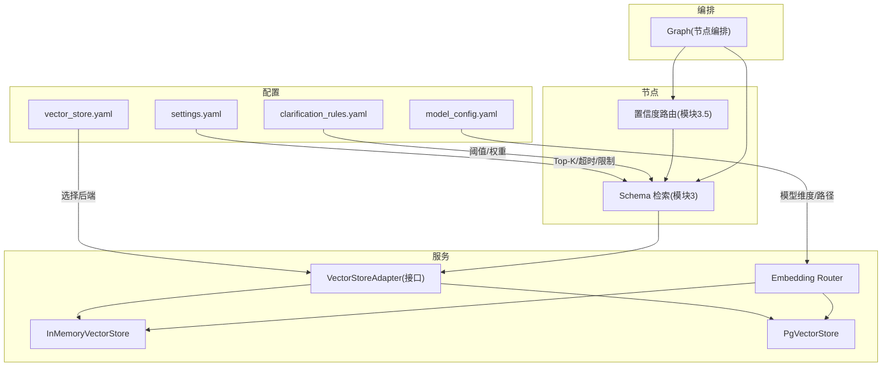
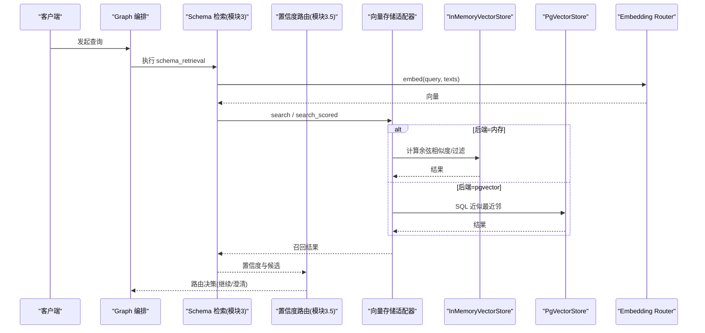
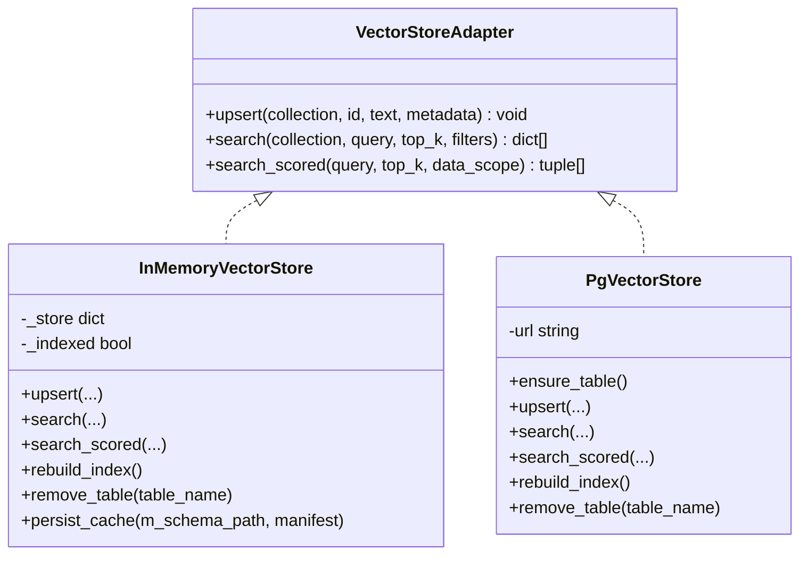
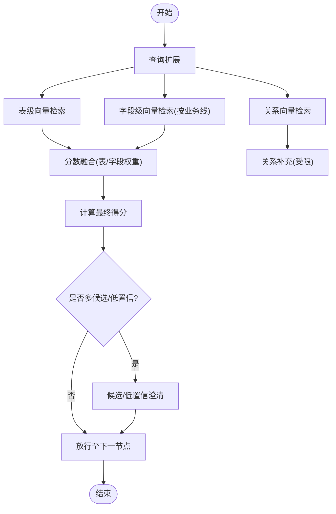
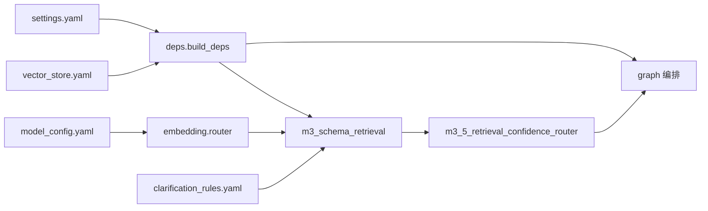

# 性能优化与监控

<cite>
**本文引用的文件**   
- [vector_store.yaml](file://nl2sql_agent/config/vector_store.yaml)
- [model_config.yaml](file://nl2sql_agent/config/model_config.yaml)
- [settings.yaml](file://nl2sql_agent/config/settings.yaml)
- [clarification_rules.yaml](file://nl2sql_agent/config/clarification_rules.yaml)
- [base.py](file://nl2sql_agent/services/vector_store/base.py)
- [memory.py](file://nl2sql_agent/services/vector_store/memory.py)
- [pg.py](file://nl2sql_agent/services/vector_store/pg.py)
- [router.py](file://nl2sql_agent/services/embedding/router.py)
- [deps.py](file://nl2sql_agent/services/deps.py)
- [m3_schema_retrieval.py](file://nl2sql_agent/nodes/m3_schema_retrieval.py)
- [m3_5_retrieval_confidence_router.py](file://nl2sql_agent/nodes/m3_5_retrieval_confidence_router.py)
- [graph.py](file://nl2sql_agent/graph.py)
- [test_vector_store.py](file://nl2sql_agent/tests/test_vector_store.py)
- [run_eval.py](file://nl2sql_agent/eval/run_eval.py)
- [schema_metrics.py](file://nl2sql_agent/eval/schema_metrics.py)
- [config_loader.py](file://nl2sql_agent/services/config_loader.py)
</cite>

## 目录
1. [引言](#引言)
2. [项目结构](#项目结构)
3. [核心组件](#核心组件)
4. [架构总览](#架构总览)
5. [详细组件分析](#详细组件分析)
6. [依赖关系分析](#依赖关系分析)
7. [性能考量](#性能考量)
8. [故障排查指南](#故障排查指南)
9. [结论](#结论)
10. [附录](#附录)

## 引言
本文件面向向量检索系统的性能优化与监控，围绕索引参数、查询计划、内存管理、嵌入模型批处理、缓存策略、并发控制、监控指标、瓶颈识别、水平扩展、容量规划、测试框架与基准、生产监控告警与故障恢复等主题，提供可操作的指导。文档基于仓库中的向量存储实现（内存与 pgvector）、嵌入路由、检索节点与配置体系进行系统化梳理，帮助运维人员有效监控和优化系统表现。

## 项目结构
与向量检索相关的代码主要分布在 services/vector_store、services/embedding、nodes 以及 config 目录中：
- 配置层：vector_store.yaml、model_config.yaml、settings.yaml、clarification_rules.yaml
- 接口与实现：VectorStoreAdapter 抽象接口、InMemoryVectorStore、PgVectorStore
- 嵌入适配：embedding router（本地模型或 fake）
- 检索流程：模块 3（混合检索）、模块 3.5（置信度路由）
- 装配与依赖：deps 构建器选择后端并注入 embedding
- 图编排：graph 将各节点串联为执行流

**图表来源** 
- [vector_store.yaml:1-6](file://nl2sql_agent/config/vector_store.yaml#L1-L6)
- [model_config.yaml:1-18](file://nl2sql_agent/config/model_config.yaml#L1-L18)
- [settings.yaml:1-30](file://nl2sql_agent/config/settings.yaml#L1-L30)
- [clarification_rules.yaml:1-62](file://nl2sql_agent/config/clarification_rules.yaml#L1-L62)
- [base.py:1-21](file://nl2sql_agent/services/vector_store/base.py#L1-L21)
- [memory.py:1-197](file://nl2sql_agent/services/vector_store/memory.py#L1-L197)
- [pg.py:1-174](file://nl2sql_agent/services/vector_store/pg.py#L1-L174)
- [router.py:1-81](file://nl2sql_agent/services/embedding/router.py#L1-L81)
- [m3_schema_retrieval.py:1-331](file://nl2sql_agent/nodes/m3_schema_retrieval.py#L1-L331)
- [m3_5_retrieval_confidence_router.py:1-127](file://nl2sql_agent/nodes/m3_5_retrieval_confidence_router.py#L1-L127)
- [graph.py:185-198](file://nl2sql_agent/graph.py#L185-L198)

**章节来源**
- [vector_store.yaml:1-6](file://nl2sql_agent/config/vector_store.yaml#L1-L6)
- [model_config.yaml:1-18](file://nl2sql_agent/config/model_config.yaml#L1-L18)
- [settings.yaml:1-30](file://nl2sql_agent/config/settings.yaml#L1-L30)
- [clarification_rules.yaml:1-62](file://nl2sql_agent/config/clarification_rules.yaml#L1-L62)
- [base.py:1-21](file://nl2sql_agent/services/vector_store/base.py#L1-L21)
- [memory.py:1-197](file://nl2sql_agent/services/vector_store/memory.py#L1-L197)
- [pg.py:1-174](file://nl2sql_agent/services/vector_store/pg.py#L1-L174)
- [router.py:1-81](file://nl2sql_agent/services/embedding/router.py#L1-L81)
- [m3_schema_retrieval.py:1-331](file://nl2sql_agent/nodes/m3_schema_retrieval.py#L1-L331)
- [m3_5_retrieval_confidence_router.py:1-127](file://nl2sql_agent/nodes/m3_5_retrieval_confidence_router.py#L1-L127)
- [graph.py:185-198](file://nl2sql_agent/graph.py#L185-L198)

## 核心组件
- 向量存储适配器：统一 upsert/search/search_scored 接口，屏蔽内存与 pgvector 差异
- 内存实现：真 embedding + 余弦相似度；支持缓存持久化、增量重建、按业务线过滤
- pgvector 实现：Postgres + pgvector 扩展；通过 SQL 的 <=> 算子做近似最近邻检索
- 嵌入路由：按 provider(local/fake)加载模型，返回统一的 embed(texts) 函数
- 检索节点：混合检索（表级+字段级+关系补充），融合评分与候选澄清
- 依赖装配：根据 vector_store.yaml 显式选择后端，注入 catalog 与 embedding

关键要点
- 后端切换由配置驱动，避免环境变量隐式行为
- 内存实现具备语义哈希与模型签名校验的缓存机制，重启后可复用
- pgvector 实现通过 ensure_table/rebuild_index 完成建表与全量入库
- 检索阶段严格按 data_scope 过滤，确保权限隔离

**章节来源**
- [base.py:1-21](file://nl2sql_agent/services/vector_store/base.py#L1-L21)
- [memory.py:1-197](file://nl2sql_agent/services/vector_store/memory.py#L1-L197)
- [pg.py:1-174](file://nl2sql_agent/services/vector_store/pg.py#L1-L174)
- [router.py:1-81](file://nl2sql_agent/services/embedding/router.py#L1-L81)
- [deps.py:87-111](file://nl2sql_agent/services/deps.py#L87-L111)
- [m3_schema_retrieval.py:1-331](file://nl2sql_agent/nodes/m3_schema_retrieval.py#L1-L331)

## 架构总览
下图展示从请求进入 Graph，到 Schema 检索、置信度路由、再到后续节点的调用链，以及向量存储与嵌入路由的交互。

**图表来源** 
- [graph.py:185-198](file://nl2sql_agent/graph.py#L185-L198)
- [m3_schema_retrieval.py:1-331](file://nl2sql_agent/nodes/m3_schema_retrieval.py#L1-L331)
- [m3_5_retrieval_confidence_router.py:1-127](file://nl2sql_agent/nodes/m3_5_retrieval_confidence_router.py#L1-L127)
- [base.py:1-21](file://nl2sql_agent/services/vector_store/base.py#L1-L21)
- [memory.py:1-197](file://nl2sql_agent/services/vector_store/memory.py#L1-L197)
- [pg.py:1-174](file://nl2sql_agent/services/vector_store/pg.py#L1-L174)
- [router.py:1-81](file://nl2sql_agent/services/embedding/router.py#L1-L81)

## 详细组件分析

### 向量存储适配器与实现
- 接口定义：upsert、search、search_scored（后者在内存与 pgvector 中用于 schema 层检索）
- 内存实现：
  - 使用 _embed_texts 批量生成向量，余弦相似度排序
  - 支持 _ensure_indexed 懒加载索引，persist_cache 原子写入缓存
  - remove_table/rebuild_index 支持增量清理与全量重建
- pgvector 实现：
  - ensure_table 依据 model_config.embedding.dimension 创建 vector 列
  - search 使用 embedding <=> query 做近似最近邻，LIMIT top_k
  - rebuild_index 优先从 M-Schema 源批量写入，否则遍历 catalog

**图表来源** 
- [base.py:1-21](file://nl2sql_agent/services/vector_store/base.py#L1-L21)
- [memory.py:1-197](file://nl2sql_agent/services/vector_store/memory.py#L1-L197)
- [pg.py:1-174](file://nl2sql_agent/services/vector_store/pg.py#L1-L174)

**章节来源**
- [base.py:1-21](file://nl2sql_agent/services/vector_store/base.py#L1-L21)
- [memory.py:1-197](file://nl2sql_agent/services/vector_store/memory.py#L1-L197)
- [pg.py:1-174](file://nl2sql_agent/services/vector_store/pg.py#L1-L174)

### 嵌入路由与批处理优化
- provider=local：加载 sentence-transformers，encode 时传入 texts 列表，开启 normalize_embeddings=True
- provider=fake：确定性词袋向量，仅测试用
- dimension 来自 model_config.embedding.dimension，需与 pgvector 建表一致

优化建议
- 批大小：根据 GPU/CPU 资源调整 batch_size，避免 OOM
- 模型预热：启动时预加载模型，减少首次延迟
- 缓存签名：内存实现以 embedding_signature 作为缓存失效键，避免模型切换导致脏读

**章节来源**
- [router.py:1-81](file://nl2sql_agent/services/embedding/router.py#L1-L81)
- [model_config.yaml:1-18](file://nl2sql_agent/config/model_config.yaml#L1-L18)

### 检索流程与混合评分
- 表级向量：search_scored 直接对表文档打分
- 字段级向量：按 business_line 分别检索，按 id 去重取最高分
- 关系向量：仅补充与主候选直接相连的表，限制扩散范围
- 融合权重：table_vector_weight/column_vector_weight，字段型查询提高 column 权重
- 候选澄清：当 Top-2 差距小于 candidate_gap_threshold 或 confidence 低于阈值时触发

**图表来源** 
- [m3_schema_retrieval.py:1-331](file://nl2sql_agent/nodes/m3_schema_retrieval.py#L1-L331)
- [clarification_rules.yaml:1-62](file://nl2sql_agent/config/clarification_rules.yaml#L1-L62)

**章节来源**
- [m3_schema_retrieval.py:1-331](file://nl2sql_agent/nodes/m3_schema_retrieval.py#L1-L331)
- [clarification_rules.yaml:1-62](file://nl2sql_agent/config/clarification_rules.yaml#L1-L62)

### 依赖装配与后端选择
- build_vector_store 读取 vector_store.yaml 的 backend 字段
- backend=pgvector：要求 pgvector.url（支持环境变量展开）
- backend=memory：默认实现，结合 embedding 配置生成 cache_signature
- build_deps 组装 Deps，包含 vector_store、catalog、executor、llm 等

**章节来源**
- [deps.py:87-111](file://nl2sql_agent/services/deps.py#L87-L111)
- [deps.py:113-184](file://nl2sql_agent/services/deps.py#L113-L184)
- [vector_store.yaml:1-6](file://nl2sql_agent/config/vector_store.yaml#L1-L6)

## 依赖关系分析
- 配置驱动：settings.yaml 控制 schema_search_top_k、execution 限制；clarification_rules.yaml 控制检索阈值与权重
- 运行时装配：deps 根据配置选择后端，注入 catalog 与 embedding
- 节点编排：graph 将检索与路由节点串接，形成完整链路

**图表来源** 
- [settings.yaml:1-30](file://nl2sql_agent/config/settings.yaml#L1-L30)
- [vector_store.yaml:1-6](file://nl2sql_agent/config/vector_store.yaml#L1-L6)
- [model_config.yaml:1-18](file://nl2sql_agent/config/model_config.yaml#L1-L18)
- [clarification_rules.yaml:1-62](file://nl2sql_agent/config/clarification_rules.yaml#L1-L62)
- [deps.py:113-184](file://nl2sql_agent/services/deps.py#L113-L184)
- [graph.py:185-198](file://nl2sql_agent/graph.py#L185-L198)

**章节来源**
- [settings.yaml:1-30](file://nl2sql_agent/config/settings.yaml#L1-L30)
- [vector_store.yaml:1-6](file://nl2sql_agent/config/vector_store.yaml#L1-L6)
- [model_config.yaml:1-18](file://nl2sql_agent/config/model_config.yaml#L1-L18)
- [clarification_rules.yaml:1-62](file://nl2sql_agent/config/clarification_rules.yaml#L1-L62)
- [deps.py:113-184](file://nl2sql_agent/services/deps.py#L113-L184)
- [graph.py:185-198](file://nl2sql_agent/graph.py#L185-L198)

## 性能考量

### 索引参数优化
- pgvector 建表维度：dimension 必须与 model_config.embedding.dimension 一致
- 近似最近邻：SQL 中使用 embedding <=> query 排序，LIMIT top_k；可通过数据库侧 HNSW/IVFFlat 索引进一步优化（需在数据库层配置）
- 内存实现：无外部索引，依赖内存扫描与余弦相似度排序；数据量大时考虑迁移到 pgvector

调优建议
- 合理设置 schema_search_top_k（settings.yaml），平衡召回率与延迟
- 字段级检索 top_k*3 再合并去重，避免漏召回但会增加开销，可按场景下调

**章节来源**
- [pg.py:69-80](file://nl2sql_agent/services/vector_store/pg.py#L69-L80)
- [pg.py:46-65](file://nl2sql_agent/services/vector_store/pg.py#L46-L65)
- [memory.py:43-53](file://nl2sql_agent/services/vector_store/memory.py#L43-L53)
- [settings.yaml:6-8](file://nl2sql_agent/config/settings.yaml#L6-L8)

### 查询计划分析与内存管理
- 内存实现：_store 字典承载所有向量条目；_ensure_indexed 懒加载；persist_cache 原子写入
- pgvector：每次 upsert/search 建立连接并 commit；search 通过 LIMIT 控制返回规模
- 内存峰值：取决于文本数量与向量维度；大模型高维向量会显著增加内存占用

优化建议
- 使用 pgvector 替代内存实现以释放进程内存压力
- 控制 batch 大小，避免一次性编码过多文本
- 定期 rebuild_index 清理无效条目（如 remove_table）

**章节来源**
- [memory.py:69-120](file://nl2sql_agent/services/vector_store/memory.py#L69-L120)
- [memory.py:166-171](file://nl2sql_agent/services/vector_store/memory.py#L166-L171)
- [pg.py:32-44](file://nl2sql_agent/services/vector_store/pg.py#L32-L44)
- [pg.py:46-65](file://nl2sql_agent/services/vector_store/pg.py#L46-L65)

### 嵌入模型的批处理优化
- 统一 embed(texts) 接口，支持批量 encode
- 本地模型预热：启动时加载模型，减少冷启动延迟
- 模型切换：通过 cache_signature 使内存缓存失效，避免脏数据

**章节来源**
- [router.py:34-58](file://nl2sql_agent/services/embedding/router.py#L34-L58)
- [memory.py:107-110](file://nl2sql_agent/services/vector_store/memory.py#L107-L110)

### 缓存策略
- 内存实现：semantic_hash + embedding_signature 双重校验，保证重启后缓存可用
- 原子写入：临时文件 .json.tmp 再 replace，避免部分写入
- 增量同步：prepare_incremental 恢复上一快照，只重算变化表

**章节来源**
- [memory.py:105-138](file://nl2sql_agent/services/vector_store/memory.py#L105-L138)
- [memory.py:139-142](file://nl2sql_agent/services/vector_store/memory.py#L139-L142)

### 并发控制
- 当前实现未内置连接池与并发锁；pg 连接在 with 块内创建与提交
- 建议在生产环境引入连接池（如 psycopg 的连接池）与限流器，避免 DB 过载

**章节来源**
- [pg.py:25-28](file://nl2sql_agent/services/vector_store/pg.py#L25-L28)
- [pg.py:32-44](file://nl2sql_agent/services/vector_store/pg.py#L32-L44)

### 监控指标
- 响应时间：Graph 节点耗时（前端 QueryPage 显示 node_latencies）
- 吞吐量：单位时间内检索/执行请求数
- 内存使用率：进程 RSS/GC 情况（内存实现尤为关注）
- 错误率：执行超时、DB 连接失败、模型加载异常等

采集建议
- 在 Graph 节点入口/出口埋点记录耗时
- 对 embedding.encode、向量检索、SQL 执行分别统计 P50/P95/P99
- 监控 pgvector 连接数与慢查询

**章节来源**
- [graph.py:185-198](file://nl2sql_agent/graph.py#L185-L198)

### 瓶颈识别与 Profiling
- 热点定位：优先检查 embedding.encode 与向量检索（内存扫描或 SQL 近似最近邻）
- 工具建议：cProfile/py-spy 定位 CPU 热点；memory_profiler 观察内存增长
- 数据库侧：启用 pg_stat_statements 分析慢查询

**章节来源**
- [memory.py:43-53](file://nl2sql_agent/services/vector_store/memory.py#L43-L53)
- [pg.py:46-65](file://nl2sql_agent/services/vector_store/pg.py#L46-L65)

### 水平扩展策略
- 分片：按 business_line 或 table_name 哈希分片，跨多个 pgvector 实例
- 负载均衡：API 网关层按请求路由到不同后端实例
- 读写分离：写端负责 upsert/rebuild_index，读端走只读副本

**章节来源**
- [pg.py:46-65](file://nl2sql_agent/services/vector_store/pg.py#L46-L65)

### 容量规划与扩容指导
- 向量维度：384（model_config.embedding.dimension）
- 单条记录大小：text + metadata + vector(384*4B≈1.5KB)
- 预估内存：条目数 × (向量大小 + 文本与元数据)
- 扩容方向：提升 pgvector 实例规格、增加连接池、优化索引

**章节来源**
- [model_config.yaml:9](file://nl2sql_agent/config/model_config.yaml#L9)
- [pg.py:74-79](file://nl2sql_agent/services/vector_store/pg.py#L74-L79)

### 性能测试框架与基准
- 回归评估：run_eval 读取 regression_set.yaml，自动处理澄清分支，断言期望路径
- 指标汇总：schema_metrics 输出 recall、join 准确率、执行正确率、澄清率、成本等
- 向量存储测试：test_vector_store 验证 upsert/search、filters、后端切换、重建索引

压测方法
- 构造高并发查询集，覆盖字段型/主题型查询
- 逐步增大并发与 batch 大小，观察 P95 延迟与错误率
- 对比内存与 pgvector 在不同数据规模下的表现

**章节来源**
- [run_eval.py:1-111](file://nl2sql_agent/eval/run_eval.py#L1-111)
- [schema_metrics.py:48-60](file://nl2sql_agent/eval/schema_metrics.py#L48-L60)
- [test_vector_store.py:1-68](file://nl2sql_agent/tests/test_vector_store.py#L1-L68)

### 生产监控告警与故障恢复
- 告警项：响应时间超阈、错误率上升、内存使用率过高、pg 连接耗尽
- 恢复策略：自动重试（限次）、熔断降级（回退简单路径）、快速重建索引
- 配置热更新：ConfigLoader 基于 mtime 热重载规则，无需重启

**章节来源**
- [config_loader.py:1-35](file://nl2sql_agent/services/config_loader.py#L1-L35)

## 故障排查指南
常见问题
- 后端切换失败：backend=pgvector 但未提供 url → 检查 vector_store.yaml 与环境变量
- 模型加载失败：本地模型不可达或离线缓存缺失 → 检查 HF_ENDPOINT 或 model_path
- 检索结果为空：filters 不匹配或索引未构建 → 确认 data_scope 与 _ensure_indexed
- 重建索引后数据不一致：缓存签名不匹配 → 检查 embedding_signature 与 semantic_hash

排查步骤
- 查看 deps.build_vector_store 日志与异常信息
- 验证 model_config.embedding.provider 与 dimension
- 检查 memory.py 的缓存路径与持久化文件
- 使用 test_vector_store 用例复现问题

**章节来源**
- [deps.py:97-111](file://nl2sql_agent/services/deps.py#L97-L111)
- [router.py:45-53](file://nl2sql_agent/services/embedding/router.py#L45-L53)
- [memory.py:105-138](file://nl2sql_agent/services/vector_store/memory.py#L105-L138)
- [test_vector_store.py:44-68](file://nl2sql_agent/tests/test_vector_store.py#L44-L68)

## 结论
本系统通过统一的向量存储接口与灵活的嵌入路由，实现了内存与 pgvector 双后端切换，配合混合检索与置信度路由，兼顾召回质量与用户体验。性能优化应聚焦于索引维度一致性、批处理与缓存策略、数据库连接与索引优化，并通过完善的测试与监控保障稳定性。生产环境建议采用 pgvector 与连接池、分片与负载均衡，结合容量规划与告警策略，持续提升检索性能与可用性。

## 附录
- 配置清单：settings.yaml、vector_store.yaml、model_config.yaml、clarification_rules.yaml
- 关键节点：m3_schema_retrieval、m3_5_retrieval_confidence_router
- 测试与评估：test_vector_store、run_eval、schema_metrics