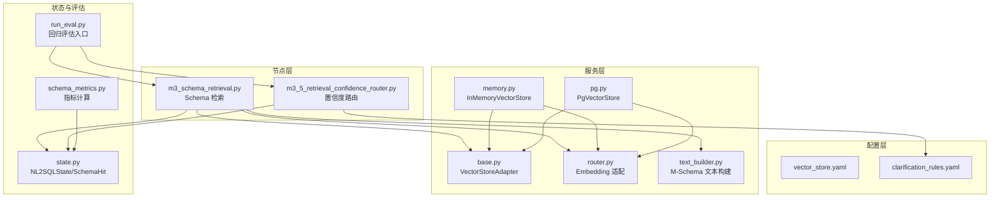
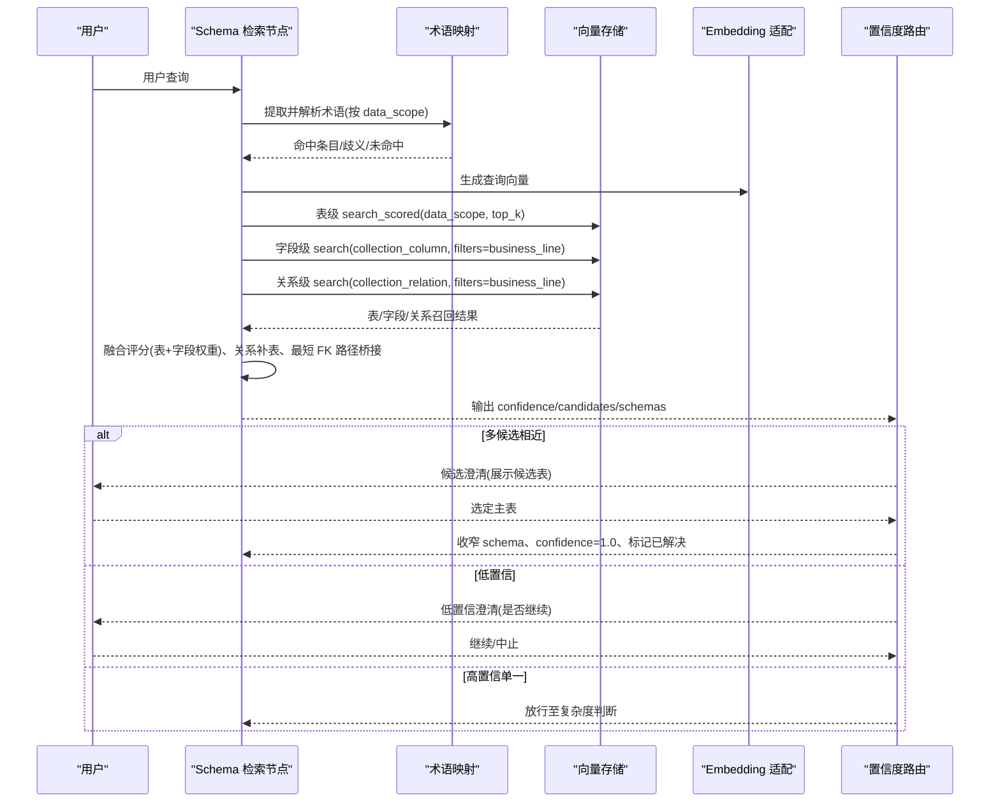
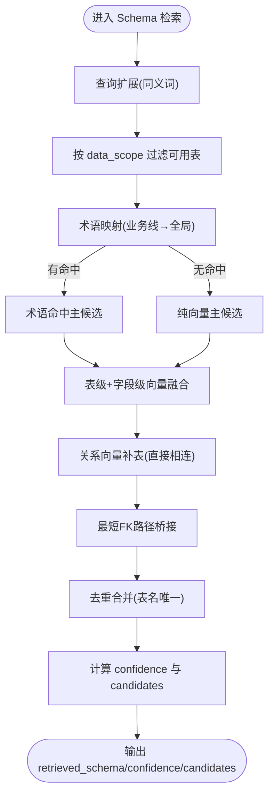
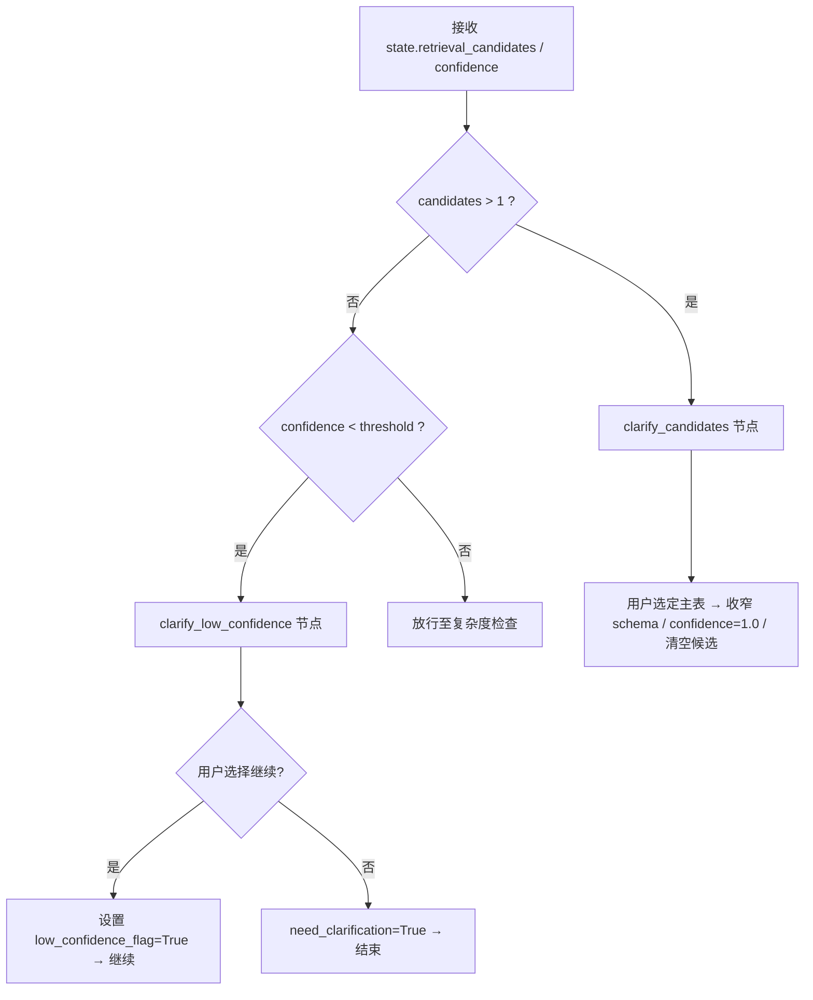
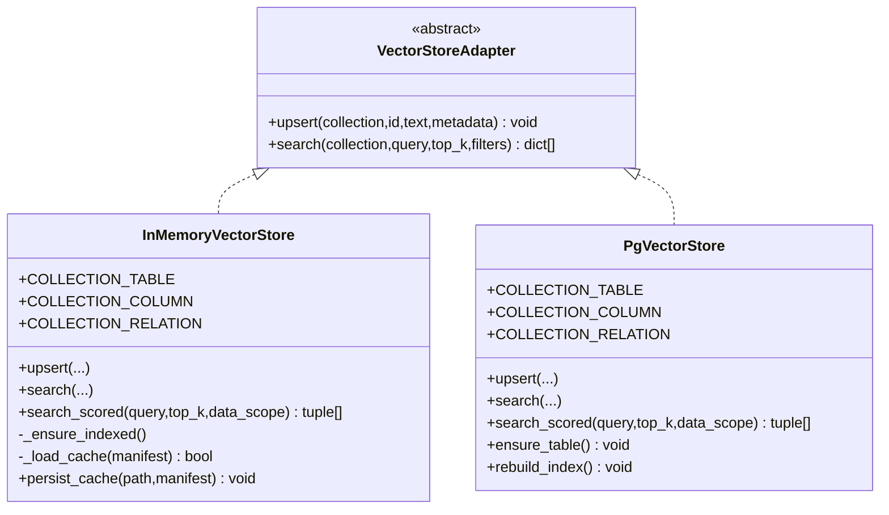
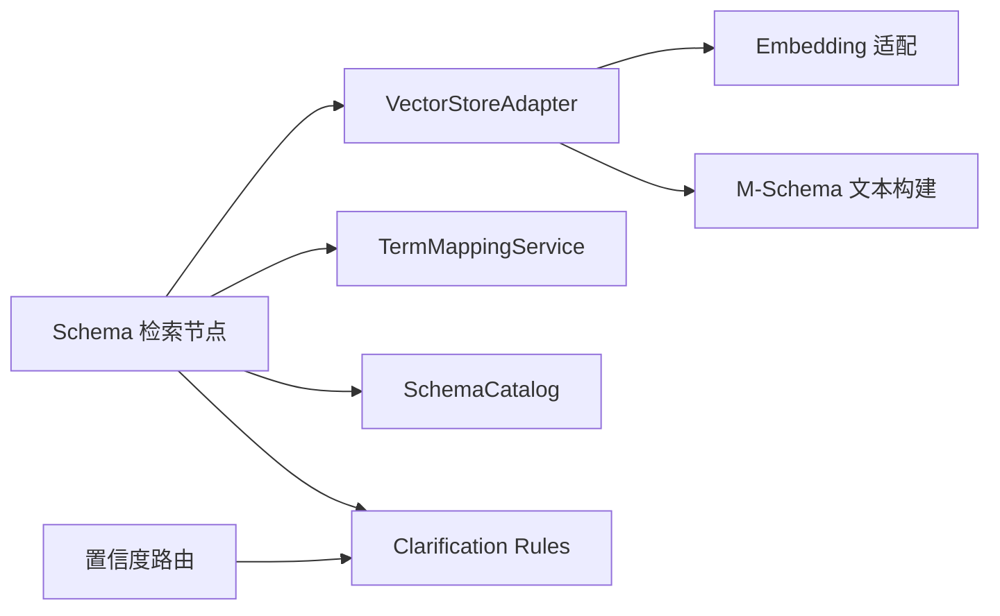

# 检索算法与优化

<cite>
**本文引用的文件**   
- [m3_schema_retrieval.py](file://nl2sql_agent/nodes/m3_schema_retrieval.py)
- [m3_5_retrieval_confidence_router.py](file://nl2sql_agent/nodes/m3_5_retrieval_confidence_router.py)
- [base.py](file://nl2sql_agent/services/vector_store/base.py)
- [memory.py](file://nl2sql_agent/services/vector_store/memory.py)
- [pg.py](file://nl2sql_agent/services/vector_store/pg.py)
- [router.py](file://nl2sql_agent/services/embedding/router.py)
- [vector_store.yaml](file://nl2sql_agent/config/vector_store.yaml)
- [clarification_rules.yaml](file://nl2sql_agent/config/clarification_rules.yaml)
- [state.py](file://nl2sql_agent/state.py)
- [text_builder.py](file://nl2sql_agent/services/schema_ingest/text_builder.py)
- [deps.py](file://nl2sql_agent/services/deps.py)
- [schema_metrics.py](file://nl2sql_agent/eval/schema_metrics.py)
- [run_eval.py](file://nl2sql_agent/eval/run_eval.py)
- [test_retrieval_confidence.py](file://nl2sql_agent/tests/test_retrieval_confidence.py)
</cite>

## 目录
1. [简介](#简介)
2. [项目结构](#项目结构)
3. [核心组件](#核心组件)
4. [架构总览](#架构总览)
5. [详细组件分析](#详细组件分析)
6. [依赖关系分析](#依赖关系分析)
7. [性能考量](#性能考量)
8. [故障排查指南](#故障排查指南)
9. [结论](#结论)
10. [附录](#附录)

## 简介
本文件面向 NL2SQL 项目的“语义检索与优化”主题，系统性梳理从文本预处理、向量召回、相似度计算、置信度评估、候选澄清到结果去重合并排序的完整流程。同时给出索引构建与缓存策略、近似最近邻（ANN）扩展建议、查询分析与监控方法、质量评估指标与 A/B 测试框架，以及调试与性能分析方法，帮助读者快速理解并持续优化检索效果。

## 项目结构
检索相关代码主要分布在以下模块：
- 节点层：Schema 检索与置信度路由
- 服务层：向量存储抽象与实现、Embedding 适配、M-Schema 文本构建
- 配置层：向量后端选择、澄清规则、模型配置
- 状态与评估：全局状态定义、回归评估入口与指标计算

图表来源 
- [m3_schema_retrieval.py:1-331](file://nl2sql_agent/nodes/m3_schema_retrieval.py#L1-L331)
- [m3_5_retrieval_confidence_router.py:1-127](file://nl2sql_agent/nodes/m3_5_retrieval_confidence_router.py#L1-L127)
- [base.py:1-21](file://nl2sql_agent/services/vector_store/base.py#L1-L21)
- [memory.py:1-192](file://nl2sql_agent/services/vector_store/memory.py#L1-L192)
- [pg.py:1-174](file://nl2sql_agent/services/vector_store/pg.py#L1-L174)
- [router.py:1-81](file://nl2sql_agent/services/embedding/router.py#L1-L81)
- [vector_store.yaml:1-6](file://nl2sql_agent/config/vector_store.yaml#L1-L6)
- [clarification_rules.yaml:1-62](file://nl2sql_agent/config/clarification_rules.yaml#L1-L62)
- [state.py:1-146](file://nl2sql_agent/state.py#L1-L146)
- [text_builder.py:1-180](file://nl2sql_agent/services/schema_ingest/text_builder.py#L1-L180)
- [schema_metrics.py:1-61](file://nl2sql_agent/eval/schema_metrics.py#L1-L61)
- [run_eval.py:1-111](file://nl2sql_agent/eval/run_eval.py#L1-L111)

章节来源
- [m3_schema_retrieval.py:1-331](file://nl2sql_agent/nodes/m3_schema_retrieval.py#L1-L331)
- [m3_5_retrieval_confidence_router.py:1-127](file://nl2sql_agent/nodes/m3_5_retrieval_confidence_router.py#L1-L127)
- [base.py:1-21](file://nl2sql_agent/services/vector_store/base.py#L1-L21)
- [memory.py:1-192](file://nl2sql_agent/services/vector_store/memory.py#L1-L192)
- [pg.py:1-174](file://nl2sql_agent/services/vector_store/pg.py#L1-L174)
- [router.py:1-81](file://nl2sql_agent/services/embedding/router.py#L1-L81)
- [vector_store.yaml:1-6](file://nl2sql_agent/config/vector_store.yaml#L1-L6)
- [clarification_rules.yaml:1-62](file://nl2sql_agent/config/clarification_rules.yaml#L1-L62)
- [state.py:1-146](file://nl2sql_agent/state.py#L1-L146)
- [text_builder.py:1-180](file://nl2sql_agent/services/schema_ingest/text_builder.py#L1-L180)
- [schema_metrics.py:1-61](file://nl2sql_agent/eval/schema_metrics.py#L1-L61)
- [run_eval.py:1-111](file://nl2sql_agent/eval/run_eval.py#L1-L111)

## 核心组件
- Schema 检索节点：混合检索（术语映射 + 表级/字段级向量融合 + 关系向量补表），输出 retrieved_schema、retrieval_confidence、retrieval_candidates、main_table_count。
- 置信度路由：基于阈值与候选差距判定是否触发候选澄清或低置信澄清，保障下游复杂度判断与执行路径正确。
- 向量存储抽象与实现：统一接口 VectorStoreAdapter；内存实现使用余弦相似度，PG 实现通过 pgvector 距离转换得分；两者均支持按业务线过滤与 top_k 返回。
- Embedding 适配层：本地 sentence-transformers 或 fake 词袋向量，支持模型切换与维度配置。
- M-Schema 文本构建：将有效 M-Schema 转换为表级、字段级、关系级文档，写入向量库，支持增量重建与缓存。
- 配置与依赖装配：显式选择向量后端、加载澄清规则与模型配置，注入 LLM、执行器、目录等依赖。

章节来源
- [m3_schema_retrieval.py:1-331](file://nl2sql_agent/nodes/m3_schema_retrieval.py#L1-L331)
- [m3_5_retrieval_confidence_router.py:1-127](file://nl2sql_agent/nodes/m3_5_retrieval_confidence_router.py#L1-L127)
- [base.py:1-21](file://nl2sql_agent/services/vector_store/base.py#L1-L21)
- [memory.py:1-192](file://nl2sql_agent/services/vector_store/memory.py#L1-L192)
- [pg.py:1-174](file://nl2sql_agent/services/vector_store/pg.py#L1-L174)
- [router.py:1-81](file://nl2sql_agent/services/embedding/router.py#L1-L81)
- [text_builder.py:1-180](file://nl2sql_agent/services/schema_ingest/text_builder.py#L1-L180)
- [deps.py:1-181](file://nl2sql_agent/services/deps.py#L1-L181)

## 架构总览
下图展示一次用户查询在检索阶段的端到端流程：文本预处理 → 术语映射 → 混合向量召回 → 置信度路由 → 候选澄清/放行。

图表来源 
- [m3_schema_retrieval.py:97-128](file://nl2sql_agent/nodes/m3_schema_retrieval.py#L97-L128)
- [m3_schema_retrieval.py:230-331](file://nl2sql_agent/nodes/m3_schema_retrieval.py#L230-L331)
- [m3_5_retrieval_confidence_router.py:26-37](file://nl2sql_agent/nodes/m3_5_retrieval_confidence_router.py#L26-L37)
- [memory.py:167-192](file://nl2sql_agent/services/vector_store/memory.py#L167-L192)
- [pg.py:139-173](file://nl2sql_agent/services/vector_store/pg.py#L139-L173)
- [router.py:34-61](file://nl2sql_agent/services/embedding/router.py#L34-L61)

## 详细组件分析

### Schema 检索节点（混合检索与置信度）
- 术语映射优先：按 data_scope 限定命名空间，精确命中直接作为主候选，歧义或未命中交由向量兜底。
- 混合向量召回：并行召回表级与字段级，按配置权重融合；关系向量仅用于受约束补表（与主候选直接相连）。
- 最短 FK 路径桥接：在语义候选之间寻找最小跳数桥接表，避免无关扩散。
- 置信度与候选：术语精确命中 confidence=1.0；否则以最高分作为 confidence；候选集由“与 Top 分数差值小于阈值”决定。
- 去重与合并：按表名去重，保留向量补充的关联表，确保权限过滤（data_scope）贯穿始终。

图表来源 
- [m3_schema_retrieval.py:64-71](file://nl2sql_agent/nodes/m3_schema_retrieval.py#L64-L71)
- [m3_schema_retrieval.py:97-128](file://nl2sql_agent/nodes/m3_schema_retrieval.py#L97-L128)
- [m3_schema_retrieval.py:131-154](file://nl2sql_agent/nodes/m3_schema_retrieval.py#L131-L154)
- [m3_schema_retrieval.py:157-207](file://nl2sql_agent/nodes/m3_schema_retrieval.py#L157-L207)
- [m3_schema_retrieval.py:230-331](file://nl2sql_agent/nodes/m3_schema_retrieval.py#L230-L331)

章节来源
- [m3_schema_retrieval.py:1-331](file://nl2sql_agent/nodes/m3_schema_retrieval.py#L1-L331)

### 置信度路由（候选澄清与低置信处理）
- 阈值读取：confidence_threshold、candidate_gap_threshold、candidate_gap_ratio 来自 clarification_rules.yaml。
- 决策逻辑：
  - 若 retrieval_candidates 数量 > 1 → 候选澄清
  - 若 retrieval_confidence < confidence_threshold → 低置信澄清
  - 否则放行至复杂度判断
- 交互与回写：候选澄清后，选定主表并保留向量补充的关联表，confidence 拉高为 1.0，清空候选并标记 retrieval_resolved，避免重复触发。

图表来源 
- [m3_5_retrieval_confidence_router.py:18-37](file://nl2sql_agent/nodes/m3_5_retrieval_confidence_router.py#L18-L37)
- [m3_5_retrieval_confidence_router.py:40-92](file://nl2sql_agent/nodes/m3_5_retrieval_confidence_router.py#L40-L92)
- [m3_5_retrieval_confidence_router.py:95-121](file://nl2sql_agent/nodes/m3_5_retrieval_confidence_router.py#L95-L121)
- [clarification_rules.yaml:27-62](file://nl2sql_agent/config/clarification_rules.yaml#L27-L62)

章节来源
- [m3_5_retrieval_confidence_router.py:1-127](file://nl2sql_agent/nodes/m3_5_retrieval_confidence_router.py#L1-L127)
- [clarification_rules.yaml:1-62](file://nl2sql_agent/config/clarification_rules.yaml#L1-L62)

### 向量存储与相似度计算
- 接口抽象：VectorStoreAdapter 定义 upsert/search，所有实现需返回 score ∈ [0,1]。
- 内存实现：
  - 余弦相似度：cos(a,b)=Σ(ai·bi)，score=max(0, cos)。
  - search_scored：按 data_scope 过滤表集合，返回 (SchemaHit, score) 列表。
  - 缓存机制：基于 manifest 的 semantic_hash 与 embedding_signature 原子持久化，重启可复用。
- PG 实现：
  - 使用 pgvector 的 <=> 距离算子，score = 1 - (embedding <=> query)/2，等价于归一化余弦相似度。
  - search_scored：对数据域内表名集合进行 IN 过滤，再按距离排序取 top_k。

图表来源 
- [base.py:11-21](file://nl2sql_agent/services/vector_store/base.py#L11-L21)
- [memory.py:21-54](file://nl2sql_agent/services/vector_store/memory.py#L21-L54)
- [memory.py:167-192](file://nl2sql_agent/services/vector_store/memory.py#L167-L192)
- [pg.py:15-65](file://nl2sql_agent/services/vector_store/pg.py#L15-L65)
- [pg.py:139-173](file://nl2sql_agent/services/vector_store/pg.py#L139-L173)

章节来源
- [base.py:1-21](file://nl2sql_agent/services/vector_store/base.py#L1-21)
- [memory.py:1-192](file://nl2sql_agent/services/vector_store/memory.py#L1-192)
- [pg.py:1-174](file://nl2sql_agent/services/vector_store/pg.py#1-174)

### Embedding 适配层
- provider 选择：local 使用 sentence-transformers，fake 使用确定性二元组哈希词袋向量。
- 模型加载：支持 model_path 优先（本地离线模型），否则按 model 名下载；失败时抛出明确错误提示。
- 输出：embed(texts) -> list[list[float]]，默认 normalize_embeddings=True，便于余弦相似度计算。

章节来源
- [router.py:1-81](file://nl2sql_agent/services/embedding/router.py#L1-L81)

### M-Schema 文本构建与索引
- 输入：effective M-Schema 与 manifest.json，校验 semantic_hash 一致性。
- 输出：
  - 表级文档：包含表名、说明、数据量估计、主键、外键关系、核心字段、全部字段。
  - 字段级文档：按角色/类别分组分块，包含类型、角色、PK/UNIQUE/NULLABLE、注释、样例。
  - 关系级文档：source/target 表与列、关系类型。
- 写入：调用 store.upsert 分别写入三集合；删除旧条目后再写入，保证幂等。

章节来源
- [text_builder.py:1-180](file://nl2sql_agent/services/schema_ingest/text_builder.py#L1-L180)

### 配置与依赖装配
- 向量后端：vector_store.yaml 显式选择 memory/pgvector；pgvector 需要 url。
- 澄清规则：clarification_rules.yaml 提供 confidence_threshold、gap 阈值、融合权重、关系扩展参数等。
- 依赖装配：build_deps 组装 AppConfig/Deps，加载 settings.yaml、clarification_rules.yaml、complexity_rules.yaml、sensitive_rules.yaml，并初始化 term_mapping、catalog、llm、executor、vector_store。

章节来源
- [vector_store.yaml:1-6](file://nl2sql_agent/config/vector_store.yaml#L1-L6)
- [clarification_rules.yaml:1-62](file://nl2sql_agent/config/clarification_rules.yaml#L1-L62)
- [deps.py:1-181](file://nl2sql_agent/services/deps.py#L1-L181)

### 状态模型
- SchemaHit：表名、列定义、业务术语。
- NL2SQLState：包含检索结果、置信度、候选、复杂度、计划、SQL 生成、敏感判定、执行结果、追踪字段等。

章节来源
- [state.py:1-146](file://nl2sql_agent/state.py#L1-L146)

## 依赖关系分析
- 节点与服务耦合：m3_schema_retrieval 依赖 deps.vector_store、deps.term_mapping、deps.catalog、deps.config；m3_5 依赖 deps.config.clarification_rules。
- 向量存储解耦：通过 VectorStoreAdapter 抽象，替换内存/PG 实现不影响上层逻辑。
- 配置热更新：ConfigLoader 基于 mtime 缓存，修改 YAML 无需重启即可生效。

图表来源 
- [m3_schema_retrieval.py:230-331](file://nl2sql_agent/nodes/m3_schema_retrieval.py#L230-L331)
- [m3_5_retrieval_confidence_router.py:18-37](file://nl2sql_agent/nodes/m3_5_retrieval_confidence_router.py#L18-L37)
- [deps.py:87-107](file://nl2sql_agent/services/deps.py#L87-L107)

章节来源
- [deps.py:1-181](file://nl2sql_agent/services/deps.py#L1-L181)

## 性能考量
- 相似度计算：
  - 内存实现：余弦相似度 O(d)，d 为向量维度；top_k 排序 O(n log n)。
  - PG 实现：利用 pgvector 的 <=> 算子与索引加速，score 转换线性时间。
- 索引与缓存：
  - 内存实现：基于 manifest 的 vector-cache.json 原子持久化，重启复用；模型签名变化自动失效。
  - PG 实现：rebuild_index 全量重建；remove_table 增量清理。
- 召回策略：
  - 表级 search_scored 先按 data_scope 过滤，减少候选规模。
  - 字段级/关系级 top_k*3 召回，后续按阈值与相关性筛选，降低噪声。
- 可扩展性（ANN 建议）：
  - HNSW：适合高维向量、低延迟召回，可在内存实现中引入（如 hnswlib），或通过 PG 的 IVFFlat/HNSW 索引。
  - IVF：适合大规模数据集，先聚类再局部搜索，平衡精度与速度。
  - 当前仓库未内置 ANN 索引，建议在向量库层扩展（PG 启用 pgvector 索引，或在内存实现中集成 hnswlib）。

[本节为通用性能讨论，不直接分析具体文件]

## 故障排查指南
- 向量库连接与建表：
  - PG 实现 ensure_table 创建 schema_embeddings 表，维度来自 model_config.embedding.dimension。
  - 若 backend=pgvector 但未配置 url，build_vector_store 会抛出运行时错误。
- 模型加载失败：
  - local provider 加载 sentence-transformers 失败时，提示检查 HF_ENDPOINT 或 model_path。
- 缓存不一致：
  - 内存实现的 _load_cache 比较 semantic_hash 与 embedding_signature，不一致则重建。
- 澄清流程异常：
  - 候选澄清无效选择时，返回 need_clarification 与提示语；低置信中止时返回 need_clarification。
- 回归评估：
  - run_eval 自动处理 clarify_candidates/clarify_low_confidence 的 resume，确保用例能走到断言。

章节来源
- [pg.py:69-80](file://nl2sql_agent/services/vector_store/pg.py#L69-L80)
- [deps.py:96-107](file://nl2sql_agent/services/deps.py#L96-L107)
- [router.py:45-61](file://nl2sql_agent/services/embedding/router.py#L45-L61)
- [memory.py:100-132](file://nl2sql_agent/services/vector_store/memory.py#L100-L132)
- [m3_5_retrieval_confidence_router.py:40-92](file://nl2sql_agent/nodes/m3_5_retrieval_confidence_router.py#L40-L92)
- [run_eval.py:18-47](file://nl2sql_agent/eval/run_eval.py#L18-L47)

## 结论
本系统通过“术语映射 + 混合向量召回 + 关系补表 + 置信度路由”的组合，实现了高可用的 Schema 检索与澄清机制。内存与 PG 两种向量存储实现保证了灵活性与扩展性；M-Schema 文本构建确保了索引质量与可维护性。结合清晰的配置体系与回归评估框架，可在生产环境中持续优化检索质量与性能。未来可通过引入 HNSW/IVF 等 ANN 索引进一步提升大规模场景下的召回效率。

[本节为总结性内容，不直接分析具体文件]

## 附录

### 检索质量评估指标与 A/B 测试
- 指标：
  - table_recall_at_k：Top-k 表召回率
  - column_recall：字段召回率
  - join_path_accuracy：Join 路径准确率
  - sql_execution_accuracy：SQL 执行正确率
  - clarification_rate：澄清触发率
  - human_modification_rate：人工修改率
  - avg_profile_seconds_per_table：每表平均 profiling 耗时
  - avg_llm_cost_per_table：每表平均 LLM 成本
- A/B 测试框架：
  - 使用 regression_set.yaml 定义用例，run_eval 驱动图执行，自动处理澄清分支，断言期望路径与结果。
  - 对比 legacy/xiyan 两套快照的指标差异，定位回归问题。

章节来源
- [schema_metrics.py:1-61](file://nl2sql_agent/eval/schema_metrics.py#L1-L61)
- [run_eval.py:1-111](file://nl2sql_agent/eval/run_eval.py#L1-L111)

### 验收测试要点（检索置信度）
- 新指标不被模块 2 拦截，走检索与 3.5 路由
- 多相近候选触发候选澄清
- 选定候选后回到模块 3，不再重复触发
- 低置信继续强制计划路径与人工确认
- 高置信单一候选直接放行
- 缺时间范围仍在模块 2 拦截

章节来源
- [test_retrieval_confidence.py:1-159](file://nl2sql_agent/tests/test_retrieval_confidence.py#L1-L159)

### 关键配置项速查
- vector_store.yaml：backend、pgvector.url
- clarification_rules.yaml：confidence_threshold、candidate_gap_threshold、candidate_gap_ratio、supplement_top_n、supplement_threshold、field_relevance_weight、table/column 向量权重、relation_expand_top_n、relation_threshold、max_join_path_hops、field_query_markers、query_expansions

章节来源
- [vector_store.yaml:1-6](file://nl2sql_agent/config/vector_store.yaml#L1-L6)
- [clarification_rules.yaml:1-62](file://nl2sql_agent/config/clarification_rules.yaml#L1-L62)