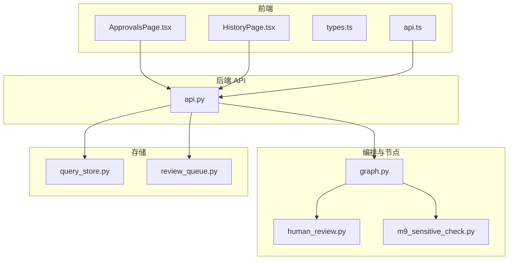
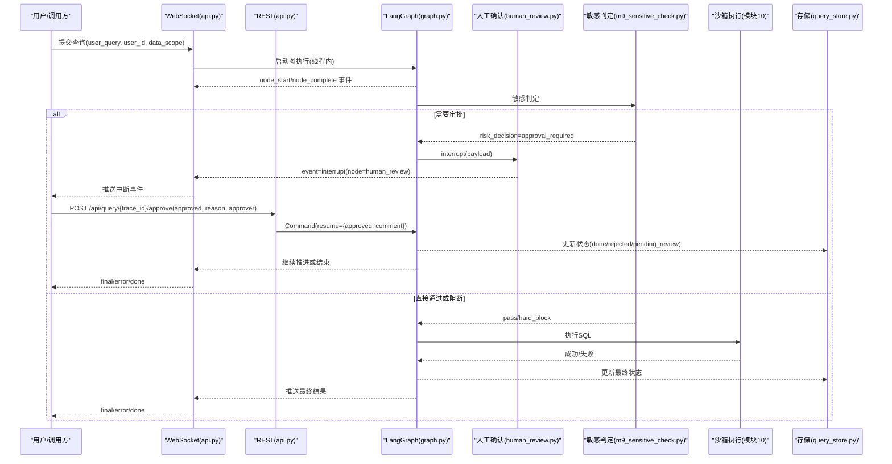
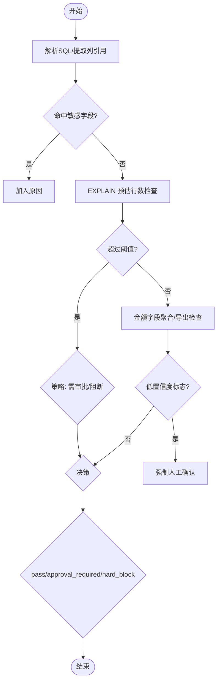
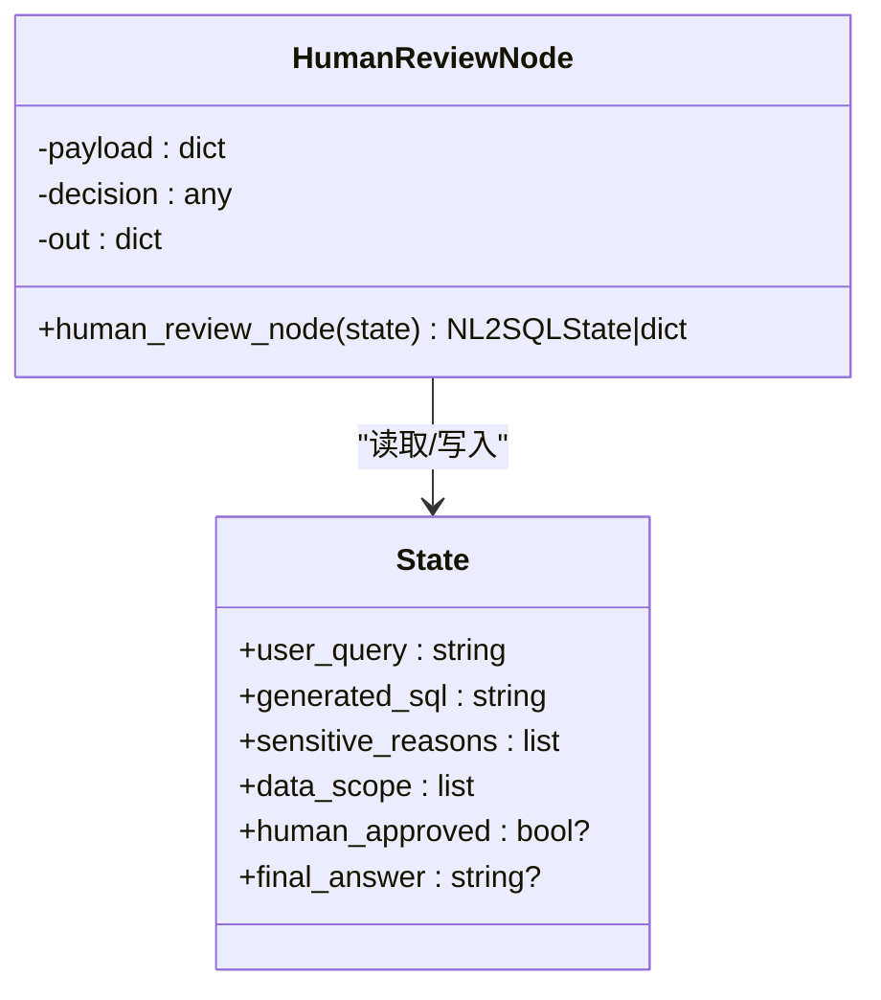
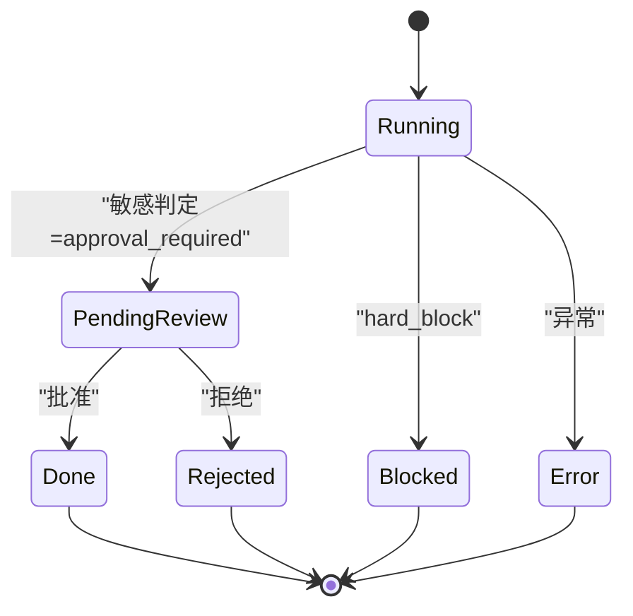
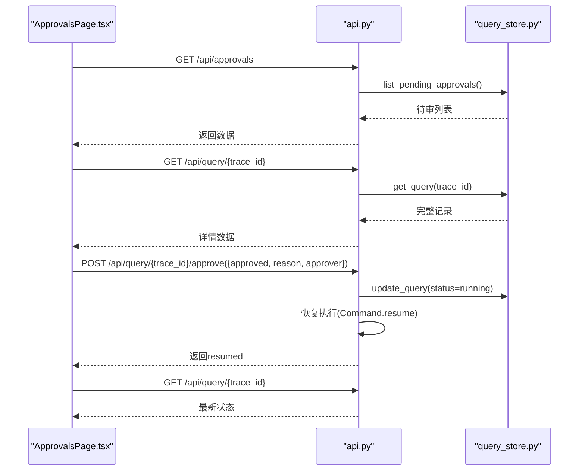
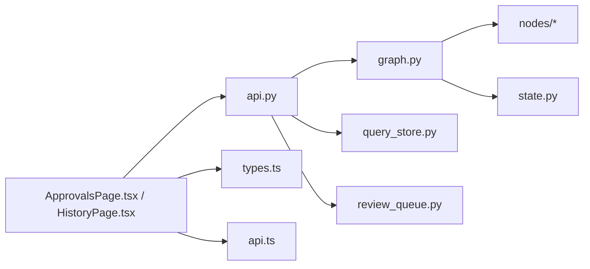

# 人工审批流程

<cite>
**本文引用的文件**   
- [api.py](file://nl2sql_agent/api.py)
- [graph.py](file://nl2sql_agent/graph.py)
- [human_review.py](file://nl2sql_agent/nodes/human_review.py)
- [m9_sensitive_check.py](file://nl2sql_agent/nodes/m9_sensitive_check.py)
- [state.py](file://nl2sql_agent/state.py)
- [query_store.py](file://nl2sql_agent/services/query_store.py)
- [review_queue.py](file://nl2sql_agent/services/schema_ingest/review_queue.py)
- [ApprovalsPage.tsx](file://web/src/pages/ApprovalsPage.tsx)
- [HistoryPage.tsx](file://web/src/pages/HistoryPage.tsx)
- [types.ts](file://web/src/types.ts)
- [api.ts](file://web/src/api.ts)
</cite>

## 目录
1. [简介](#简介)
2. [项目结构](#项目结构)
3. [核心组件](#核心组件)
4. [架构总览](#架构总览)
5. [详细组件分析](#详细组件分析)
6. [依赖关系分析](#依赖关系分析)
7. [性能与效率优化](#性能与效率优化)
8. [故障排查指南](#故障排查指南)
9. [监控与告警配置](#监控与告警配置)
10. [结论](#结论)

## 简介
本文件面向“NL2SQL”系统中的人工审批流程，系统性说明审批触发条件、队列管理、状态流转、前端交互、API 接口、存储结构与审计合规、以及与自动执行的集成方式。文档同时给出流程图、时序图与类图，帮助非技术读者也能理解整体设计，并为运维与研发提供排障与优化建议。

## 项目结构
围绕人工审批的关键代码分布在后端 API、LangGraph 编排、节点实现、持久化存储以及前端页面中：
- 后端 API：负责查询提交、状态查询、审批恢复、历史与审计、反馈等 REST 接口；WebSocket 推送事件流。
- LangGraph 编排：定义 11 个模块的节点与路由，包含敏感判定与人工确认节点，支持中断与恢复。
- 节点实现：敏感判定（规则驱动）与人工确认（基于 interrupt）。
- 存储层：SQLite 存储查询记录、反馈、审核队列与覆盖层、结构快照。
- 前端：审批队列页、历史与审计页、类型定义与通用 API 封装。

图表来源 
- [api.py:1-573](file://nl2sql_agent/api.py#L1-L573)
- [graph.py:1-313](file://nl2sql_agent/graph.py#L1-L313)
- [human_review.py:1-32](file://nl2sql_agent/nodes/human_review.py#L1-L32)
- [m9_sensitive_check.py:1-106](file://nl2sql_agent/nodes/m9_sensitive_check.py#L1-L106)
- [query_store.py:1-214](file://nl2sql_agent/services/query_store.py#L1-L214)
- [review_queue.py:1-207](file://nl2sql_agent/services/schema_ingest/review_queue.py#L1-L207)
- [ApprovalsPage.tsx:1-223](file://web/src/pages/ApprovalsPage.tsx#L1-L223)
- [HistoryPage.tsx:1-179](file://web/src/pages/HistoryPage.tsx#L1-L179)
- [types.ts:1-72](file://web/src/types.ts#L1-L72)
- [api.ts:1-50](file://web/src/api.ts#L1-L50)

章节来源
- [api.py:1-573](file://nl2sql_agent/api.py#L1-L573)
- [graph.py:1-313](file://nl2sql_agent/graph.py#L1-L313)
- [ApprovalsPage.tsx:1-223](file://web/src/pages/ApprovalsPage.tsx#L1-L223)
- [HistoryPage.tsx:1-179](file://web/src/pages/HistoryPage.tsx#L1-L179)

## 核心组件
- 敏感判定节点：根据规则输出三态决策 pass / approval_required / hard_block，决定是否需要人工审批或直接阻断。
- 人工确认节点：通过 interrupt 暂停流程，等待前端或外部系统返回审批结果，再恢复执行。
- 审批队列与持久化：使用 SQLite 存储待审批列表、历史记录、审计日志与反馈。
- 前端审批界面：展示待审队列、详情抽屉、操作按钮（通过/驳回），并轮询刷新。
- API 层：REST 接口提供提交、查询、审批、恢复、历史与审计、反馈等能力；WebSocket 推送事件流。

章节来源
- [m9_sensitive_check.py:1-106](file://nl2sql_agent/nodes/m9_sensitive_check.py#L1-L106)
- [human_review.py:1-32](file://nl2sql_agent/nodes/human_review.py#L1-L32)
- [query_store.py:1-214](file://nl2sql_agent/services/query_store.py#L1-L214)
- [ApprovalsPage.tsx:1-223](file://web/src/pages/ApprovalsPage.tsx#L1-L223)
- [api.py:1-573](file://nl2sql_agent/api.py#L1-L573)

## 架构总览
下图展示了从用户提问到人工审批与自动执行的完整链路，包括中断与恢复机制。

图表来源 
- [api.py:134-314](file://nl2sql_agent/api.py#L134-L314)
- [graph.py:174-313](file://nl2sql_agent/graph.py#L174-L313)
- [human_review.py:15-32](file://nl2sql_agent/nodes/human_review.py#L15-L32)
- [m9_sensitive_check.py:19-106](file://nl2sql_agent/nodes/m9_sensitive_check.py#L19-L106)
- [query_store.py:97-181](file://nl2sql_agent/services/query_store.py#L97-L181)

## 详细组件分析

### 敏感判定与审批触发条件
- 触发条件由规则驱动：
  - 命中敏感字段（如身份证、手机号等）或查询文本关键词。
  - EXPLAIN 预估扫描行数超过阈值，可配置为需审批或直接阻断。
  - 涉及金额字段的聚合或导出。
  - 低置信度查询强制进入人工确认。
- 输出三态决策：
  - pass：直接进入执行。
  - approval_required：进入人工确认。
  - hard_block：直接阻断，不进入审批。

图表来源 
- [m9_sensitive_check.py:19-106](file://nl2sql_agent/nodes/m9_sensitive_check.py#L19-L106)

章节来源
- [m9_sensitive_check.py:19-106](file://nl2sql_agent/nodes/m9_sensitive_check.py#L19-L106)

### 人工确认节点与中断恢复
- 节点职责：
  - 构造 payload（用户问题、生成 SQL、敏感原因、数据范围）。
  - 使用 interrupt 暂停流程，等待外部输入。
  - 恢复时读取 decision 中的 approved 与 comment，写入 human_approved，若拒绝则设置 final_answer。
- 恢复机制：
  - 通过 Command(resume={...}) 将审批结果注入图状态，继续执行或终止。

图表来源 
- [human_review.py:15-32](file://nl2sql_agent/nodes/human_review.py#L15-L32)
- [state.py:83-146](file://nl2sql_agent/state.py#L83-L146)

章节来源
- [human_review.py:15-32](file://nl2sql_agent/nodes/human_review.py#L15-L32)
- [state.py:83-146](file://nl2sql_agent/state.py#L83-L146)

### 审批队列管理与状态流转
- 状态机：
  - running：执行中。
  - pending_review：等待人工审批。
  - done：完成。
  - rejected：被拒绝。
  - blocked：被安全策略阻断。
  - error：异常。
- 队列管理：
  - 当敏感判定为 approval_required 时，图在 human_review 节点中断，状态写为 pending_review，next_node 标记暂停位置。
  - 前端轮询 /api/approvals 获取待审列表。
  - 审批后通过 /api/query/{trace_id}/approve 恢复执行，状态更新为 done 或 rejected。

图表来源 
- [graph.py:264-279](file://nl2sql_agent/graph.py#L264-L279)
- [api.py:280-314](file://nl2sql_agent/api.py#L280-L314)
- [query_store.py:174-181](file://nl2sql_agent/services/query_store.py#L174-L181)

章节来源
- [graph.py:264-279](file://nl2sql_agent/graph.py#L264-L279)
- [api.py:280-314](file://nl2sql_agent/api.py#L280-L314)
- [query_store.py:174-181](file://nl2sql_agent/services/query_store.py#L174-L181)

### 审批界面交互
- 待审队列：
  - 每 10 秒轮询 /api/approvals，展示用户、问题、敏感规则命中、系统、提交时间、已等待时长。
  - 超过 10 分钟标记紧急。
- 详情抽屉：
  - 点击问题打开详情，展示完整 pipeline 过程、各步骤状态与耗时。
- 操作按钮：
  - 通过：直接恢复执行。
  - 驳回：必填原因，作为反馈闭环输入。
- 状态同步：
  - 通过后自动刷新列表与详情，显示最终状态。

图表来源 
- [ApprovalsPage.tsx:42-87](file://web/src/pages/ApprovalsPage.tsx#L42-L87)
- [api.py:280-314](file://nl2sql_agent/api.py#L280-L314)
- [query_store.py:174-181](file://nl2sql_agent/services/query_store.py#L174-L181)

章节来源
- [ApprovalsPage.tsx:42-87](file://web/src/pages/ApprovalsPage.tsx#L42-L87)
- [api.py:280-314](file://nl2sql_agent/api.py#L280-L314)

### 审批 API 接口
- 提交查询（非流式）：POST /api/query
  - 请求体：user_query, user_id, data_scope, conversation_history, trace_id
  - 响应：trace_id 与状态（可能为 running 或最终状态）
- 查询状态：GET /api/query/{trace_id}
  - 返回完整记录（含 status、approved、approver、next_node 等）
- 审批：POST /api/query/{trace_id}/approve
  - 请求体：approved(bool), reason(str), approver(str)
  - 行为：校验状态为 pending_review，先标记 running，再恢复执行，更新状态为 done 或 rejected
- 通用恢复：POST /api/query/{trace_id}/resume
  - 用于其他中断节点的恢复（如候选澄清、低置信澄清）
- 历史与审计：
  - GET /api/history：支持按用户、业务线、时间范围过滤
  - GET /api/audit/{trace_id}：返回记录及反馈列表
- 反馈：POST /api/feedback
  - 记录反馈类型与评论

章节来源
- [api.py:234-391](file://nl2sql_agent/api.py#L234-L391)

### 存储结构与审计合规
- 查询记录表（queries）：
  - 主键 trace_id，包含用户信息、问题、数据范围、状态、生成的 SQL、计划、检索结果、敏感原因、执行结果、最终答案、追踪步骤、节点耗时、重试次数、审批信息与时间戳。
- 反馈表（feedbacks）：
  - 记录 trace_id、节点、反馈类型、评论与创建时间。
- 审核队列与覆盖层（schema_ingest.db）：
  - schema_comment_review：待审核草稿注释、证据、验证错误、结构哈希、审核人、时间、拒绝原因。
  - schema_metadata_override：审核通过的最终注释覆盖层。
  - schema_snapshot：结构快照，用于增量同步 diff。
- 审计与合规：
  - 历史页支持导出 CSV，包含关键审计字段。
  - 审计详情展示各节点耗时、Pipeline 过程与用户反馈。

章节来源
- [query_store.py:31-91](file://nl2sql_agent/services/query_store.py#L31-L91)
- [query_store.py:195-214](file://nl2sql_agent/services/query_store.py#L195-L214)
- [review_queue.py:19-60](file://nl2sql_agent/services/schema_ingest/review_queue.py#L19-L60)
- [HistoryPage.tsx:23-42](file://web/src/pages/HistoryPage.tsx#L23-L42)

### 与自动执行的集成
- 审批通过：
  - 恢复执行后进入沙箱执行（模块10），成功后进入结果解释（模块11），最终状态为 done。
- 拒绝处理：
  - 设置 final_answer 为“查询未获人工审批，已停止执行”，状态为 rejected。
- 错误处理：
  - 执行失败或空结果会回退至 SQL 生成（模块7）进行重试，达到上限后结束。
  - 异常事件通过 WebSocket 推送 error 事件，并更新状态为 error。

章节来源
- [graph.py:274-291](file://nl2sql_agent/graph.py#L274-L291)
- [human_review.py:24-31](file://nl2sql_agent/nodes/human_review.py#L24-L31)
- [api.py:134-157](file://nl2sql_agent/api.py#L134-L157)

### 配置选项、自定义规则与批量审批
- 配置项：
  - 敏感规则（sensitive_rules.yaml）：敏感字段列表、EXPLAIN 阈值与策略、金额字段关键词、聚合/导出触发开关。
  - 术语映射（term_mapping/*.yaml）：业务术语映射，支持热更新。
  - 复杂度规则（complexity_rules.yaml）、澄清规则（clarification_rules.yaml）、设置（settings.yaml）。
- 自定义规则：
  - 通过 API 获取/更新规则与术语映射，无需修改代码。
- 批量审批：
  - 当前实现为单条审批；可在前端扩展批量选择与循环调用 /api/query/{trace_id}/approve。

章节来源
- [api.py:396-447](file://nl2sql_agent/api.py#L396-L447)
- [m9_sensitive_check.py:21-88](file://nl2sql_agent/nodes/m9_sensitive_check.py#L21-L88)

## 依赖关系分析
- 组件耦合：
  - api.py 依赖 graph.py 构建与执行图，依赖 query_store.py 持久化，依赖 review_queue.py 管理审核队列。
  - graph.py 依赖 nodes 模块（human_review、m9_sensitive_check 等）与 state.py 状态模型。
  - 前端 ApprovalsPage.tsx 与 HistoryPage.tsx 依赖 types.ts 与 api.ts 封装。
- 外部依赖：
  - LangGraph 用于图编排与 checkpoint。
  - SQLite 用于本地持久化。
  - FastAPI 提供 HTTP/WebSocket 服务。

图表来源 
- [api.py:1-573](file://nl2sql_agent/api.py#L1-L573)
- [graph.py:1-313](file://nl2sql_agent/graph.py#L1-L313)
- [query_store.py:1-214](file://nl2sql_agent/services/query_store.py#L1-L214)
- [review_queue.py:1-207](file://nl2sql_agent/services/schema_ingest/review_queue.py#L1-L207)
- [ApprovalsPage.tsx:1-223](file://web/src/pages/ApprovalsPage.tsx#L1-L223)
- [HistoryPage.tsx:1-179](file://web/src/pages/HistoryPage.tsx#L1-L179)
- [types.ts:1-72](file://web/src/types.ts#L1-L72)
- [api.ts:1-50](file://web/src/api.ts#L1-L50)

章节来源
- [api.py:1-573](file://nl2sql_agent/api.py#L1-L573)
- [graph.py:1-313](file://nl2sql_agent/graph.py#L1-L313)

## 性能与效率优化
- 事件推送优化：
  - 使用 EventStream 桥接线程与 asyncio，避免阻塞。
  - execution_result 截断前 20 行，减少前端渲染压力。
- 重试与限流：
  - SQL 生成与执行有最大重试次数，避免无限循环。
  - 计划校验失败仅在模块5b内部重试，限制次数。
- 存储优化：
  - SQLite 加锁保证并发安全，JSON 序列化统一处理 Decimal/日期。
- 前端优化：
  - 轮询间隔 10 秒，紧急标记 10 分钟，减少频繁请求。
  - 详情抽屉复用 StepCard，提升渲染效率。

章节来源
- [api.py:54-66](file://nl2sql_agent/api.py#L54-L66)
- [graph.py:60-69](file://nl2sql_agent/graph.py#L60-L69)
- [query_store.py:18-25](file://nl2sql_agent/services/query_store.py#L18-L25)
- [ApprovalsPage.tsx:32-51](file://web/src/pages/ApprovalsPage.tsx#L32-L51)

## 故障排查指南
- 常见问题：
  - 审批无响应：检查状态是否为 pending_review，确认 /api/query/{trace_id}/approve 调用成功。
  - 执行失败：查看 execution_error 与节点耗时，定位失败模块。
  - 规则误判：检查 sensitive_rules.yaml 配置，调整阈值与关键词。
- 调试方法：
  - 使用历史与审计页查看 Pipeline 过程与反馈。
  - 通过 WebSocket 事件观察节点执行顺序与中断点。
  - 检查 SQLite 数据库记录，确认状态更新与审计日志。

章节来源
- [HistoryPage.tsx:67-179](file://web/src/pages/HistoryPage.tsx#L67-L179)
- [api.py:134-157](file://nl2sql_agent/api.py#L134-L157)
- [m9_sensitive_check.py:21-88](file://nl2sql_agent/nodes/m9_sensitive_check.py#L21-L88)

## 监控与告警配置
- 指标采集：
  - 节点耗时（node_latencies）、重试次数（retry_count、plan_retry_count）、执行结果行数。
  - 审批通过率、平均等待时间、紧急任务比例。
- 告警规则：
  - pending_review 超过阈值（如 10 分钟）触发告警。
  - 执行失败率超过阈值触发告警。
  - 敏感规则命中率异常升高触发告警。
- 监控工具：
  - 结合日志系统与监控系统（如 Prometheus/Grafana）采集指标。
  - 前端轮询频率与错误提示作为辅助监控手段。

[本节为通用指导，不直接分析具体文件]

## 结论
本系统通过规则驱动的敏感判定与 LangGraph 的中断恢复机制，实现了灵活可控的人工审批流程。前后端协作良好，API 接口清晰，存储结构完善，支持审计与合规需求。通过合理的配置与监控，可有效提升审批效率与系统稳定性。建议在生产环境中加强监控告警与性能调优，确保审批流程高效可靠。