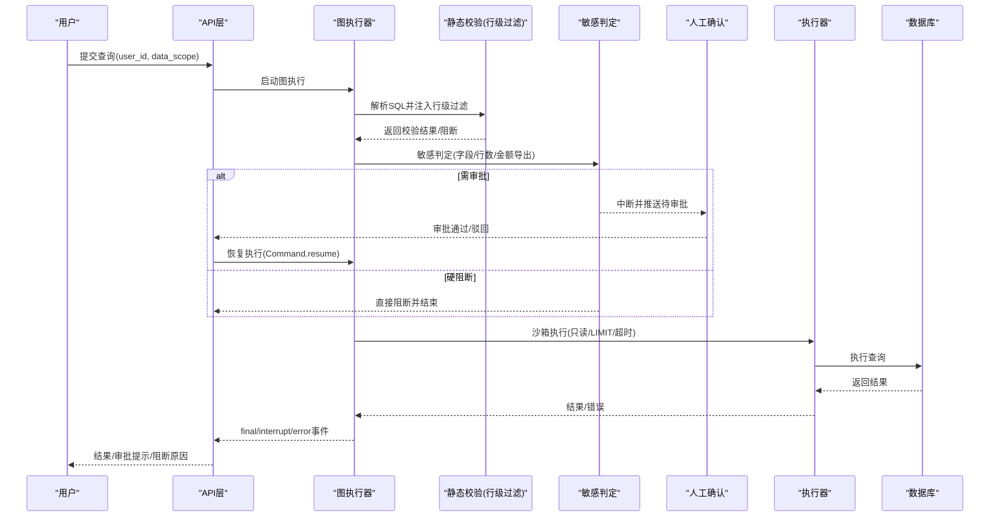
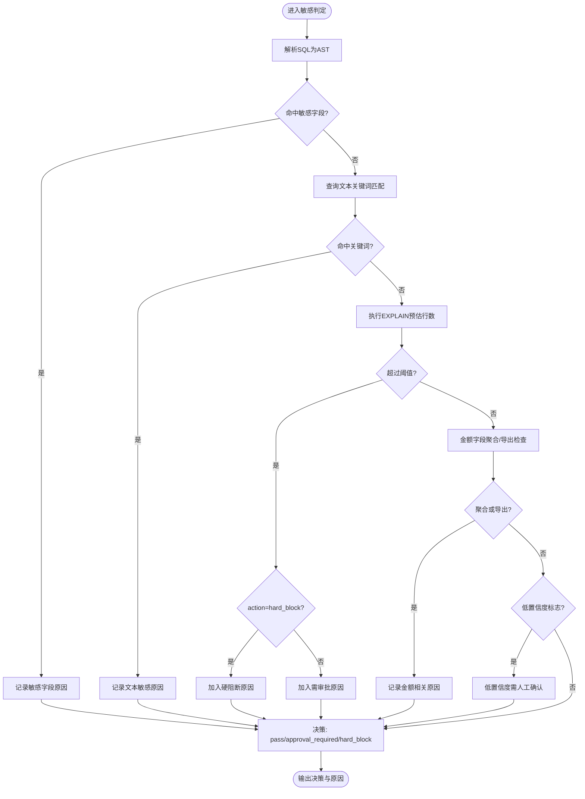
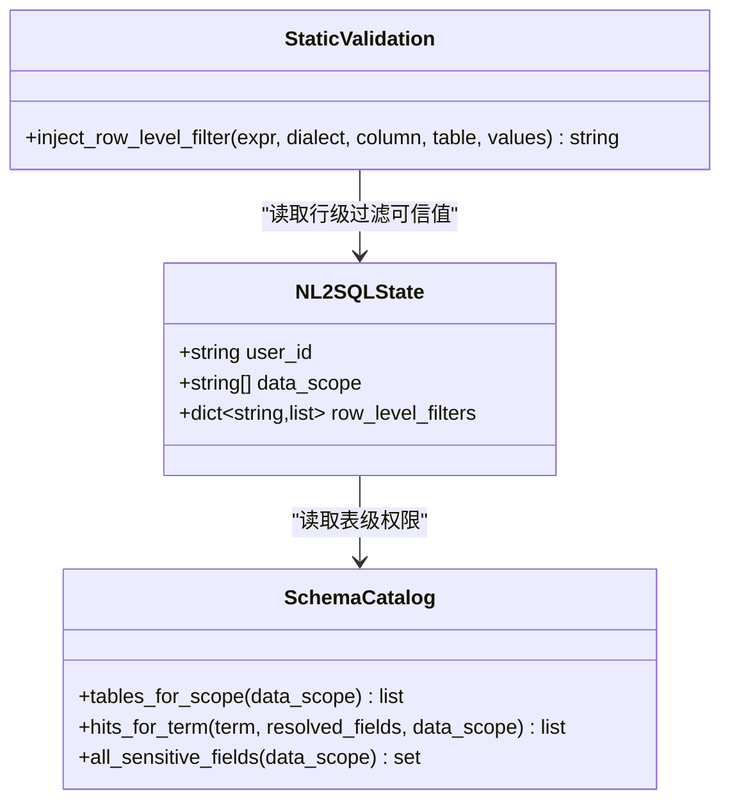
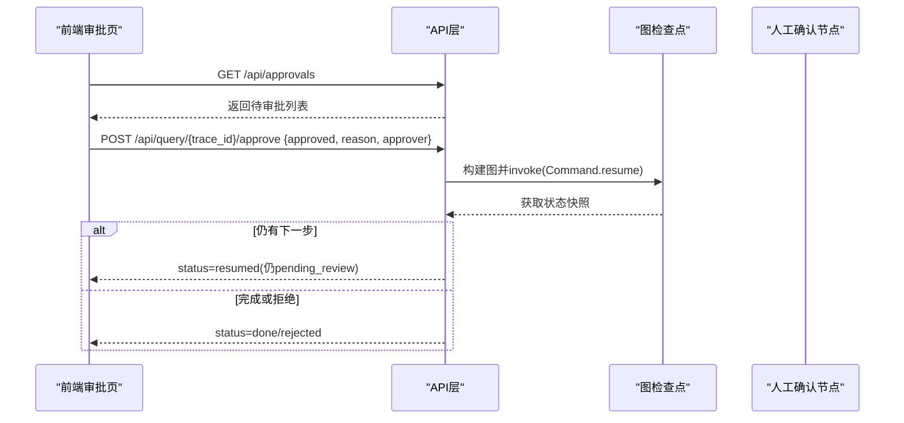
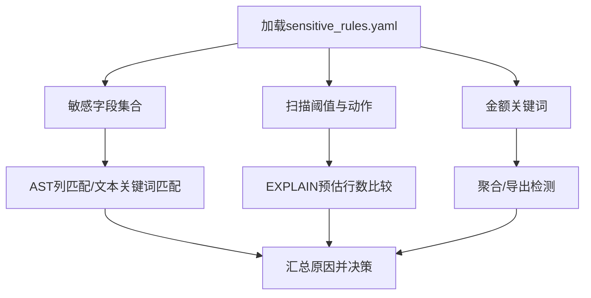
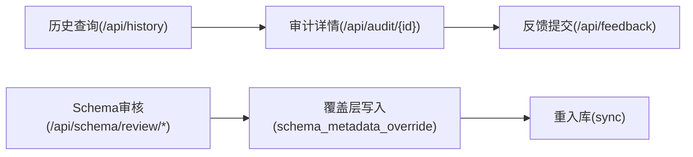
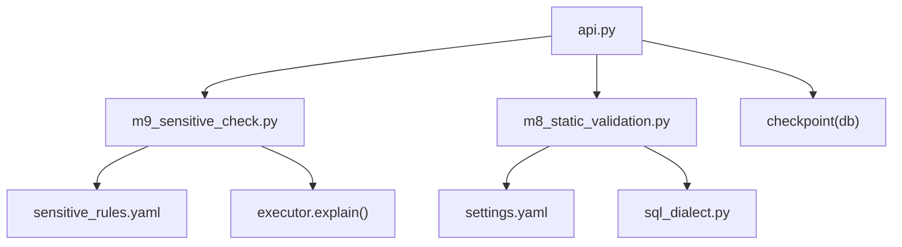

# 安全控制

<cite>
**本文引用的文件**   
- [sensitive_rules.yaml](file://nl2sql_agent/config/sensitive_rules.yaml)
- [settings.yaml](file://nl2sql_agent/config/settings.yaml)
- [m9_sensitive_check.py](file://nl2sql_agent/nodes/m9_sensitive_check.py)
- [human_review.py](file://nl2sql_agent/nodes/human_review.py)
- [m8_static_validation.py](file://nl2sql_agent/nodes/m8_static_validation.py)
- [sql_dialect.py](file://nl2sql_agent/services/sql_dialect.py)
- [state.py](file://nl2sql_agent/state.py)
- [api.py](file://nl2sql_agent/api.py)
- [review_queue.py](file://nl2sql_agent/services/schema_ingest/review_queue.py)
- [schema_catalog.py](file://nl2sql_agent/services/schema_catalog.py)
- [ApprovalsPage.tsx](file://web/src/pages/ApprovalsPage.tsx)
- [HistoryPage.tsx](file://web/src/pages/HistoryPage.tsx)
- [types.ts](file://web/src/types.ts)
- [test_architecture_hardening.py](file://nl2sql_agent/tests/test_architecture_hardening.py)
</cite>

## 目录
1. [引言](#引言)
2. [项目结构](#项目结构)
3. [核心组件](#核心组件)
4. [架构总览](#架构总览)
5. [详细组件分析](#详细组件分析)
6. [依赖关系分析](#依赖关系分析)
7. [性能考量](#性能考量)
8. [故障排查指南](#故障排查指南)
9. [结论](#结论)
10. [附录：配置与最佳实践](#附录配置与最佳实践)

## 引言
本文件面向安全控制系统，系统性阐述敏感操作检测、风险等级分类与阻断策略；用户身份管理与数据范围控制（行级权限过滤与业务线隔离）；人工审批流程（队列管理、审计日志、状态跟踪）；敏感规则配置（身份证/手机号等敏感字段识别、扫描行数阈值、金额汇总导出保护）；以及安全最佳实践、常见威胁防护与安全配置示例。内容覆盖从基础概念到高级配置的完整知识体系，帮助风控与运维人员快速落地并持续优化。

## 项目结构
安全相关能力贯穿“生成—校验—判定—审批—执行”全链路，关键位置如下：
- 规则与配置：敏感规则、运行参数、复杂度规则等集中管理
- 节点层：静态校验注入行级权限、敏感判定三态决策、人工确认中断恢复
- 服务层：SQL方言工具提供列提取、聚合/导出判断、行级过滤注入
- API层：查询提交、审批、历史与审计、配置热更新
- 前端：审批队列、历史审计、配置管理界面

```mermaid
graph TB
subgraph "配置"
SR["sensitive_rules.yaml"]
ST["settings.yaml"]
end
subgraph "节点"
M8["m8_static_validation.py"]
M9["m9_sensitive_check.py"]
HR["human_review.py"]
end
subgraph "服务"
SQLD["sql_dialect.py"]
SCAT["schema_catalog.py"]
RQ["review_queue.py"]
end
subgraph "API"
API["api.py"]
end
subgraph "前端"
AP["ApprovalsPage.tsx"]
HP["HistoryPage.tsx"]
TP["types.ts"]
end
SR --> M9
ST --> M8
M8 --> SQLD
M9 --> SQLD
M9 --> HR
API --> HR
API --> M9
SCAT --> M8
RQ --> API
AP --> API
HP --> API
TP --> AP
```

**图表来源** 
- [sensitive_rules.yaml:1-24](file://nl2sql_agent/config/sensitive_rules.yaml#L1-L24)
- [settings.yaml:1-30](file://nl2sql_agent/config/settings.yaml#L1-L30)
- [m8_static_validation.py:119-143](file://nl2sql_agent/nodes/m8_static_validation.py#L119-L143)
- [m9_sensitive_check.py:1-106](file://nl2sql_agent/nodes/m9_sensitive_check.py#L1-L106)
- [human_review.py:1-32](file://nl2sql_agent/nodes/human_review.py#L1-L32)
- [sql_dialect.py:51-83](file://nl2sql_agent/services/sql_dialect.py#L51-L83)
- [schema_catalog.py:52-94](file://nl2sql_agent/services/schema_catalog.py#L52-L94)
- [review_queue.py:1-207](file://nl2sql_agent/services/schema_ingest/review_queue.py#L1-L207)
- [api.py:280-314](file://nl2sql_agent/api.py#L280-L314)
- [ApprovalsPage.tsx:1-223](file://web/src/pages/ApprovalsPage.tsx#L1-L223)
- [HistoryPage.tsx:44-126](file://web/src/pages/HistoryPage.tsx#L44-L126)
- [types.ts:1-72](file://web/src/types.ts#L1-L72)

**章节来源**
- [sensitive_rules.yaml:1-24](file://nl2sql_agent/config/sensitive_rules.yaml#L1-L24)
- [settings.yaml:1-30](file://nl2sql_agent/config/settings.yaml#L1-L30)
- [m9_sensitive_check.py:1-106](file://nl2sql_agent/nodes/m9_sensitive_check.py#L1-L106)
- [human_review.py:1-32](file://nl2sql_agent/nodes/human_review.py#L1-L32)
- [m8_static_validation.py:119-143](file://nl2sql_agent/nodes/m8_static_validation.py#L119-L143)
- [sql_dialect.py:51-83](file://nl2sql_agent/services/sql_dialect.py#L51-L83)
- [schema_catalog.py:52-94](file://nl2sql_agent/services/schema_catalog.py#L52-L94)
- [review_queue.py:1-207](file://nl2sql_agent/services/schema_ingest/review_queue.py#L1-L207)
- [api.py:280-314](file://nl2sql_agent/api.py#L280-L314)
- [ApprovalsPage.tsx:1-223](file://web/src/pages/ApprovalsPage.tsx#L1-L223)
- [HistoryPage.tsx:44-126](file://web/src/pages/HistoryPage.tsx#L44-L126)
- [types.ts:1-72](file://web/src/types.ts#L1-L72)

## 核心组件
- 敏感判定节点（模块9）：基于配置化的敏感规则进行三态决策（通过/需审批/硬阻断），输出原因与阻断信息
- 静态校验节点（模块8）：在生成SQL后做AST级校验，强制注入行级权限过滤条件，拦截危险操作
- 人工确认节点：通过中断机制暂停流程，将敏感查询推给人审，支持恢复继续或拒绝终止
- SQL方言工具：提供列提取、聚合/导出判断、行级过滤注入等能力
- 配置中心：敏感规则、运行参数、术语映射等可热更新
- API与持久化：查询生命周期、审批流、历史与审计、反馈闭环
- 审核队列：Schema注释审核与覆盖层，保障语义准确性

**章节来源**
- [m9_sensitive_check.py:1-106](file://nl2sql_agent/nodes/m9_sensitive_check.py#L1-L106)
- [m8_static_validation.py:119-143](file://nl2sql_agent/nodes/m8_static_validation.py#L119-L143)
- [human_review.py:1-32](file://nl2sql_agent/nodes/human_review.py#L1-L32)
- [sql_dialect.py:51-83](file://nl2sql_agent/services/sql_dialect.py#L51-L83)
- [api.py:280-314](file://nl2sql_agent/api.py#L280-L314)
- [review_queue.py:1-207](file://nl2sql_agent/services/schema_ingest/review_queue.py#L1-L207)

## 架构总览
下图展示从用户提问到结果解释的完整安全控制路径，重点标注敏感判定、行级权限注入与人工审批环节。



**图表来源** 
- [api.py:134-157](file://nl2sql_agent/api.py#L134-L157)
- [m8_static_validation.py:119-143](file://nl2sql_agent/nodes/m8_static_validation.py#L119-L143)
- [m9_sensitive_check.py:1-106](file://nl2sql_agent/nodes/m9_sensitive_check.py#L1-L106)
- [human_review.py:1-32](file://nl2sql_agent/nodes/human_review.py#L1-L32)

## 详细组件分析

### 敏感判定（模块9）
- 功能要点
  - 规则驱动：敏感字段列表、扫描行数阈值、金额字段关键词、聚合/导出开关
  - 三态决策：pass / approval_required / hard_block
  - 兜底策略：低置信度查询强制进入人工确认
- 实现要点
  - 解析SQL AST，提取列引用并与敏感字段匹配
  - 调用执行器EXPLAIN预估行数，按action决定阻断或审批
  - 根据金额关键字识别字段，检查是否参与聚合或出现在SELECT投影中
- 输出字段
  - risk_decision、is_sensitive、sensitive_reasons、blocked_reason、final_answer



**图表来源** 
- [m9_sensitive_check.py:1-106](file://nl2sql_agent/nodes/m9_sensitive_check.py#L1-L106)
- [sensitive_rules.yaml:1-24](file://nl2sql_agent/config/sensitive_rules.yaml#L1-L24)

**章节来源**
- [m9_sensitive_check.py:1-106](file://nl2sql_agent/nodes/m9_sensitive_check.py#L1-L106)
- [sensitive_rules.yaml:1-24](file://nl2sql_agent/config/sensitive_rules.yaml#L1-L24)

### 行级权限过滤与业务线隔离
- 业务线隔离
  - 通过data_scope限定表级可见范围，共享表对所有用户可见，非共享表按业务线过滤
- 行级权限注入
  - 启用row_level_filter时，服务端必须注入可信值（如PLATFORM_CODE），否则直接阻断
  - 对JOIN中的多表分别按别名注入IN条件，避免误判字段归属
- 安全边界
  - data_scope仅用于系统/表权限，绝不作为行级过滤取值来源



**图表来源** 
- [state.py:135-141](file://nl2sql_agent/state.py#L135-L141)
- [schema_catalog.py:52-94](file://nl2sql_agent/services/schema_catalog.py#L52-L94)
- [m8_static_validation.py:119-143](file://nl2sql_agent/nodes/m8_static_validation.py#L119-L143)
- [sql_dialect.py:80-83](file://nl2sql_agent/services/sql_dialect.py#L80-L83)

**章节来源**
- [state.py:135-141](file://nl2sql_agent/state.py#L135-L141)
- [schema_catalog.py:52-94](file://nl2sql_agent/services/schema_catalog.py#L52-L94)
- [m8_static_validation.py:119-143](file://nl2sql_agent/nodes/m8_static_validation.py#L119-L143)
- [sql_dialect.py:80-83](file://nl2sql_agent/services/sql_dialect.py#L80-L83)

### 人工审批流程设计
- 中断与恢复
  - 敏感判定触发approval_required时，流程中断至human_review节点
  - 前端调用审批接口，后端使用Command.resume恢复执行
- 队列与状态
  - 待审批记录持久化，支持轮询刷新与紧急标记
  - 审批通过后继续执行，驳回则终止并记录原因
- 审计与追踪
  - 每个trace_id对应完整状态快照，支持历史与审计查看



**图表来源** 
- [api.py:280-314](file://nl2sql_agent/api.py#L280-L314)
- [human_review.py:1-32](file://nl2sql_agent/nodes/human_review.py#L1-L32)
- [ApprovalsPage.tsx:1-223](file://web/src/pages/ApprovalsPage.tsx#L1-L223)

**章节来源**
- [api.py:280-314](file://nl2sql_agent/api.py#L280-L314)
- [human_review.py:1-32](file://nl2sql_agent/nodes/human_review.py#L1-L32)
- [ApprovalsPage.tsx:1-223](file://web/src/pages/ApprovalsPage.tsx#L1-L223)

### 敏感规则配置方式
- 敏感字段识别
  - 基于字段名与关键词匹配，支持未检出列引用时的文本兜底
- 扫描行数阈值
  - explain_scan.threshold与action控制硬阻断或审批
  - settings.yaml中execution.explain_row_threshold作为硬上限
- 金额汇总导出保护
  - amount_field_keywords识别金额字段
  - aggregation_trigger/export_trigger开关控制聚合与导出触发



**图表来源** 
- [sensitive_rules.yaml:1-24](file://nl2sql_agent/config/sensitive_rules.yaml#L1-L24)
- [settings.yaml:18-23](file://nl2sql_agent/config/settings.yaml#L18-L23)
- [m9_sensitive_check.py:52-83](file://nl2sql_agent/nodes/m9_sensitive_check.py#L52-L83)

**章节来源**
- [sensitive_rules.yaml:1-24](file://nl2sql_agent/config/sensitive_rules.yaml#L1-L24)
- [settings.yaml:18-23](file://nl2sql_agent/config/settings.yaml#L18-L23)
- [m9_sensitive_check.py:52-83](file://nl2sql_agent/nodes/m9_sensitive_check.py#L52-L83)

### 审计日志与合规性检查
- 审计接口
  - /api/history按用户/业务线/时间范围筛选
  - /api/audit/{trace_id}返回完整轨迹与反馈
- 反馈闭环
  - /api/feedback记录plan_wrong/sql_wrong等类型，辅助术语映射与规则优化
- 审核队列
  - schema_comment_review与schema_metadata_override确保注释准确，影响语义检索与生成



**图表来源** 
- [api.py:356-391](file://nl2sql_agent/api.py#L356-L391)
- [review_queue.py:1-207](file://nl2sql_agent/services/schema_ingest/review_queue.py#L1-L207)
- [HistoryPage.tsx:44-126](file://web/src/pages/HistoryPage.tsx#L44-L126)

**章节来源**
- [api.py:356-391](file://nl2sql_agent/api.py#L356-L391)
- [review_queue.py:1-207](file://nl2sql_agent/services/schema_ingest/review_queue.py#L1-L207)
- [HistoryPage.tsx:44-126](file://web/src/pages/HistoryPage.tsx#L44-L126)

## 依赖关系分析
- 节点与服务耦合
  - m9_sensitive_check依赖deps.config.sensitive_rules与deps.executor.explain
  - m8_static_validation依赖deps.config.row_level_filter与deps.sql工具方法
- 外部依赖
  - sqlglot用于AST解析与SQL重写
  - SQLite用于检查点与审核队列持久化
- 潜在循环依赖
  - 通过依赖注入与单例checkpointer避免循环



**图表来源** 
- [m9_sensitive_check.py:1-106](file://nl2sql_agent/nodes/m9_sensitive_check.py#L1-L106)
- [m8_static_validation.py:119-143](file://nl2sql_agent/nodes/m8_static_validation.py#L119-L143)
- [api.py:134-157](file://nl2sql_agent/api.py#L134-L157)

**章节来源**
- [m9_sensitive_check.py:1-106](file://nl2sql_agent/nodes/m9_sensitive_check.py#L1-L106)
- [m8_static_validation.py:119-143](file://nl2sql_agent/nodes/m8_static_validation.py#L119-L143)
- [api.py:134-157](file://nl2sql_agent/api.py#L134-L157)

## 性能考量
- 只读事务与LIMIT限制，降低大查询风险
- EXPLAIN前置检查，避免高成本执行
- 超时熔断，防止长尾查询阻塞
- 向量检索Top-K与术语映射优先，减少LLM调用与延迟
- 检查点持久化，支持断线恢复与并发审批

[本节为通用指导，不直接分析具体文件]

## 故障排查指南
- 常见问题定位
  - 行级过滤未生效：检查row_level_filter.enabled与row_level_filters可信值注入
  - 敏感判定误报/漏报：核对sensitive_rules.yaml字段与关键词、金额关键字
  - 审批无法恢复：确认checkpointer一致性与trace_id正确
- 调试建议
  - 查看sensitive_reasons与blocked_reason定位触发原因
  - 使用/api/audit/{trace_id}获取完整轨迹与反馈
  - 通过测试用例验证行级过滤与硬阻断行为

**章节来源**
- [test_architecture_hardening.py:62-92](file://nl2sql_agent/tests/test_architecture_hardening.py#L62-L92)
- [api.py:372-391](file://nl2sql_agent/api.py#L372-L391)

## 结论
本安全控制系统以“规则驱动+AST校验+行级过滤+人工审批”为核心，形成从敏感识别到阻断与审批的闭环。通过可配置规则与强类型计划，兼顾灵活性与安全性；借助审计与反馈机制，持续优化术语映射与规则策略。建议在生产环境严格启用行级过滤与只读执行，合理设置扫描阈值与金额保护，完善审批与审计流程，确保合规与可控。

[本节为总结性内容，不直接分析具体文件]

## 附录：配置与最佳实践
- 敏感规则配置示例
  - 敏感字段：IDNUM、NAME及关键词
  - 扫描阈值：threshold与action（hard_block或approval_required）
  - 金额保护：amount_field_keywords与aggregation/export开关
- 运行参数建议
  - execution.read_only=true、limit=1000、timeout_seconds=30
  - execution.explain_row_threshold与sensitive_rules.explain_scan.threshold保持一致
- 行级权限最佳实践
  - 启用row_level_filter并注入可信值，禁止复用data_scope作为字段值
  - JOIN场景下按别名注入IN条件，避免误判
- 常见威胁防护
  - 防大查询：EXPLAIN阈值与只读限制
  - 防数据泄露：敏感字段与金额导出保护
  - 防越权访问：行级过滤与业务线隔离
- 安全配置示例
  - 参考sensitive_rules.yaml与settings.yaml键值说明
  - 通过/api/config/rules获取当前规则快照

**章节来源**
- [sensitive_rules.yaml:1-24](file://nl2sql_agent/config/sensitive_rules.yaml#L1-L24)
- [settings.yaml:18-30](file://nl2sql_agent/config/settings.yaml#L18-L30)
- [m8_static_validation.py:119-143](file://nl2sql_agent/nodes/m8_static_validation.py#L119-L143)
- [api.py:436-447](file://nl2sql_agent/api.py#L436-L447)