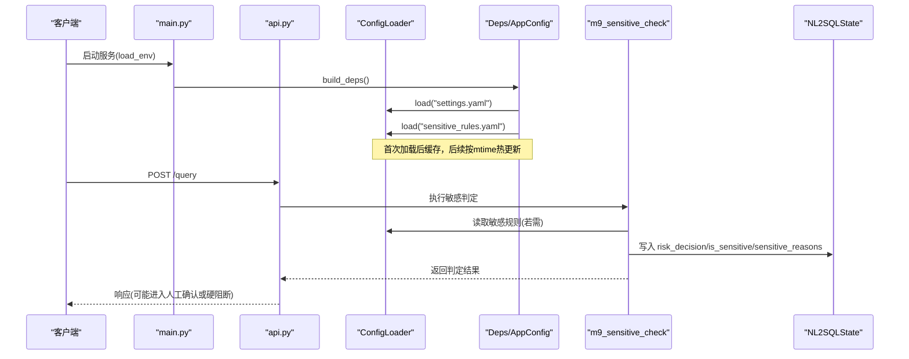
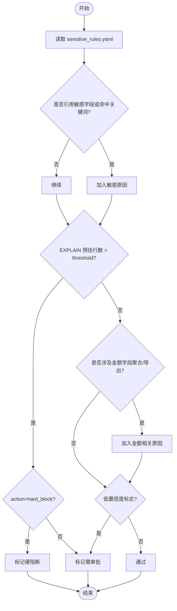
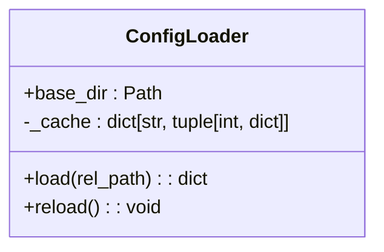
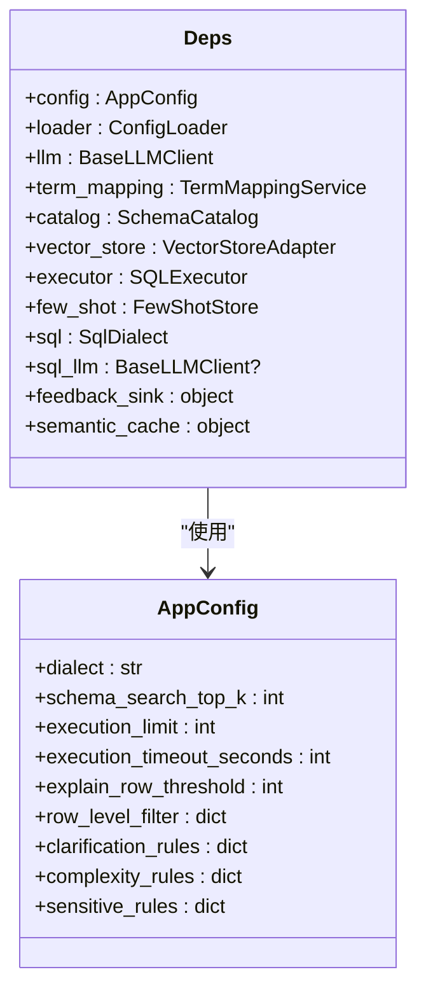
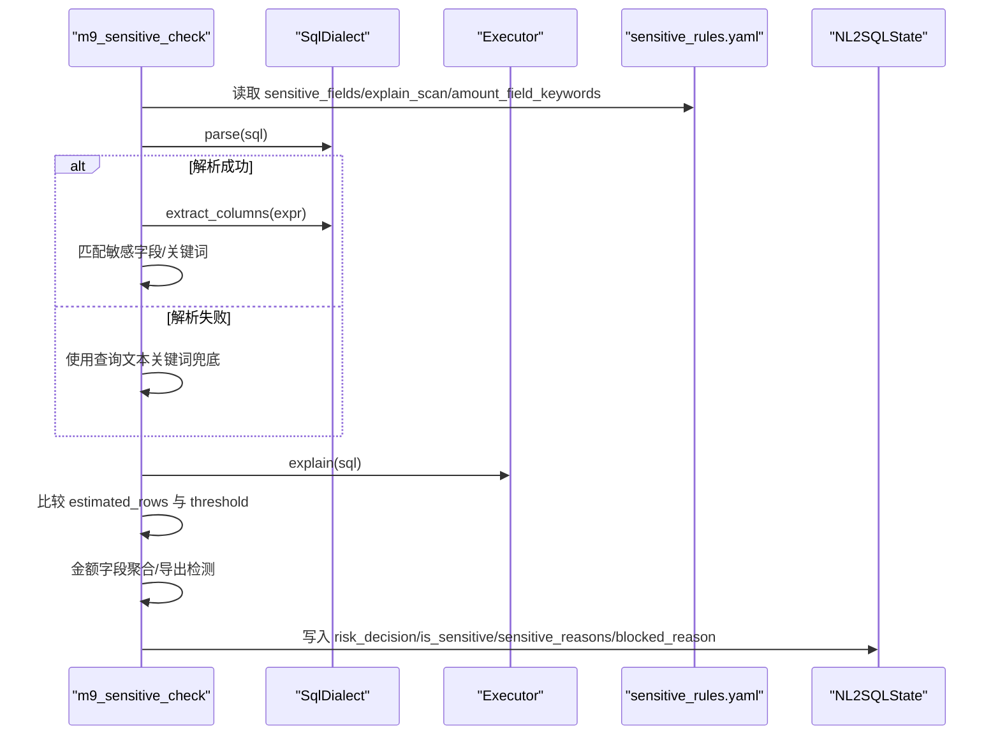
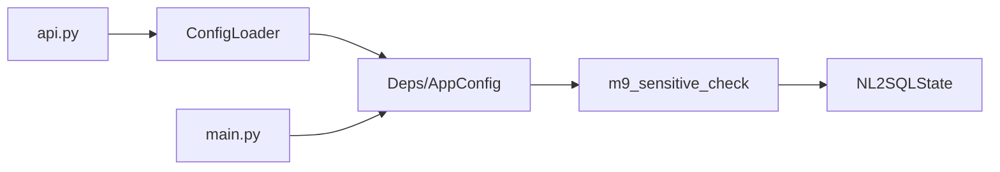

# 安全配置管理

<cite>
**本文引用的文件**   
- [sensitive_rules.yaml](file://nl2sql_agent/config/sensitive_rules.yaml)
- [settings.yaml](file://nl2sql_agent/config/settings.yaml)
- [config_loader.py](file://nl2sql_agent/services/config_loader.py)
- [deps.py](file://nl2sql_agent/services/deps.py)
- [m9_sensitive_check.py](file://nl2sql_agent/nodes/m9_sensitive_check.py)
- [state.py](file://nl2sql_agent/state.py)
- [api.py](file://nl2sql_agent/api.py)
- [main.py](file://nl2sql_agent/main.py)
</cite>

## 目录
1. [简介](#简介)
2. [项目结构](#项目结构)
3. [核心组件](#核心组件)
4. [架构总览](#架构总览)
5. [详细组件分析](#详细组件分析)
6. [依赖关系分析](#依赖关系分析)
7. [性能考量](#性能考量)
8. [故障排查指南](#故障排查指南)
9. [结论](#结论)
10. [附录](#附录)

## 简介
本文件面向“安全配置管理系统”，聚焦敏感规则与运行参数的配置体系，覆盖以下目标：
- 深入解释敏感规则配置文件结构与关键项：sensitive_fields、explain_scan阈值、amount_field_keywords等。
- 说明 settings.yaml 中的安全相关配置项：默认权限、审计开关与安全策略启用选项。
- 文档化配置热更新机制：运行时加载、校验与生效策略。
- 说明不同环境下的配置管理差异（开发、测试、生产）。
- 解释配置继承与覆盖机制（全局、项目、环境特定）。
- 提供最佳实践、模板与迁移指南。
- 给出配置验证工具、配置审计与合规性检查方法。

## 项目结构
与安全和配置相关的核心位置如下：
- 配置目录 nl2sql_agent/config/
  - sensitive_rules.yaml：敏感判定规则（模块9）
  - settings.yaml：运行参数（执行限制、只读、行级过滤等）
- 服务层 services/
  - config_loader.py：YAML 配置加载器（本地缓存 + mtime 热更新）
  - deps.py：依赖装配与配置聚合（AppConfig/Deps），统一读取 settings.yaml 与各规则
- 节点 nodes/
  - m9_sensitive_check.py：敏感判定逻辑，依据 sensitive_rules.yaml 进行三态决策
- 状态 state.py：NL2SQLState 定义风险决策字段与敏感原因
- API api.py：暴露 /config/rules 接口用于查看当前规则；支持 reload 触发热更新
- 入口 main.py：应用启动时加载 .env 并构建图

```mermaid
graph TB
subgraph "配置"
SR["sensitive_rules.yaml"]
ST["settings.yaml"]
end
subgraph "服务层"
CL["ConfigLoader<br/>mtime热更新"]
DEPS["Deps/AppConfig<br/>配置聚合"]
end
subgraph "节点"
M9["m9_sensitive_check.py<br/>敏感判定"]
end
subgraph "状态"
STATE["NL2SQLState<br/>risk_decision/is_sensitive"]
end
subgraph "API"
API["api.py<br/>/config/rules, reload"]
end
subgraph "入口"
MAIN["main.py<br/>load_env()"]
end
SR --> CL
ST --> CL
CL --> DEPS
DEPS --> M9
M9 --> STATE
API --> CL
MAIN --> DEPS
```

图表来源
- [sensitive_rules.yaml:1-24](file://nl2sql_agent/config/sensitive_rules.yaml#L1-L24)
- [settings.yaml:1-30](file://nl2sql_agent/config/settings.yaml#L1-L30)
- [config_loader.py:14-36](file://nl2sql_agent/services/config_loader.py#L14-L36)
- [deps.py:113-184](file://nl2sql_agent/services/deps.py#L113-L184)
- [m9_sensitive_check.py:19-106](file://nl2sql_agent/nodes/m9_sensitive_check.py#L19-L106)
- [state.py:123-128](file://nl2sql_agent/state.py#L123-L128)
- [api.py:436-447](file://nl2sql_agent/api.py#L436-L447)
- [main.py:29](file://nl2sql_agent/main.py#L29)

章节来源
- [sensitive_rules.yaml:1-24](file://nl2sql_agent/config/sensitive_rules.yaml#L1-L24)
- [settings.yaml:1-30](file://nl2sql_agent/config/settings.yaml#L1-L30)
- [config_loader.py:14-36](file://nl2sql_agent/services/config_loader.py#L14-L36)
- [deps.py:113-184](file://nl2sql_agent/services/deps.py#L113-L184)
- [m9_sensitive_check.py:19-106](file://nl2sql_agent/nodes/m9_sensitive_check.py#L19-L106)
- [state.py:123-128](file://nl2sql_agent/state.py#L123-L128)
- [api.py:436-447](file://nl2sql_agent/api.py#L436-L447)
- [main.py:29](file://nl2sql_agent/main.py#L29)

## 核心组件
- ConfigLoader：基于路径的 YAML 加载器，内部维护内存缓存，按文件 mtime 变化自动重载，避免重启服务。
- Deps/AppConfig：集中装配所有配置，包括 dialect、执行限制、行级过滤、各类规则（含敏感规则）。
- m9_sensitive_check：敏感判定节点，读取 sensitive_rules.yaml，结合 SQL 解析、EXPLAIN 预估行数、金额字段关键词等，输出三态决策 pass/approval_required/hard_block。
- NL2SQLState：承载敏感判定结果（risk_decision、is_sensitive、sensitive_reasons、blocked_reason）等。
- API：提供 /config/rules 获取当前规则，以及 reload 触发配置热更新。

章节来源
- [config_loader.py:14-36](file://nl2sql_agent/services/config_loader.py#L14-L36)
- [deps.py:40-64](file://nl2sql_agent/services/deps.py#L40-L64)
- [m9_sensitive_check.py:19-106](file://nl2sql_agent/nodes/m9_sensitive_check.py#L19-L106)
- [state.py:123-128](file://nl2sql_agent/state.py#L123-L128)
- [api.py:436-447](file://nl2sql_agent/api.py#L436-L447)

## 架构总览
下图展示从请求到敏感判定的完整流程，以及配置如何被加载和生效。



图表来源
- [main.py:29](file://nl2sql_agent/main.py#L29)
- [deps.py:113-184](file://nl2sql_agent/services/deps.py#L113-L184)
- [config_loader.py:14-36](file://nl2sql_agent/services/config_loader.py#L14-L36)
- [m9_sensitive_check.py:19-106](file://nl2sql_agent/nodes/m9_sensitive_check.py#L19-L106)
- [state.py:123-128](file://nl2sql_agent/state.py#L123-L128)

## 详细组件分析

### 敏感规则配置（sensitive_rules.yaml）
- sensitive_fields：定义敏感字段列表，包含 name 与 keywords。当 SQL 引用这些字段或查询文本命中关键词时触发敏感判定。
- explain_scan：扫描量硬安全边界，threshold 为 EXPLAIN 预估行数阈值，action 决定是 hard_block 还是 approval_required。
- amount_field_keywords：金额类字段的识别关键字，用于检测涉及金额的汇总或导出。
- aggregation_trigger/export_trigger：分别控制金额字段参与聚合与导出的触发开关。



图表来源
- [sensitive_rules.yaml:1-24](file://nl2sql_agent/config/sensitive_rules.yaml#L1-L24)
- [m9_sensitive_check.py:19-106](file://nl2sql_agent/nodes/m9_sensitive_check.py#L19-L106)

章节来源
- [sensitive_rules.yaml:1-24](file://nl2sql_agent/config/sensitive_rules.yaml#L1-L24)
- [m9_sensitive_check.py:19-106](file://nl2sql_agent/nodes/m9_sensitive_check.py#L19-L106)

### 运行参数（settings.yaml）
- execution.read_only：事务级只读，防止写操作。
- execution.limit：未聚合查询强制 LIMIT，限制返回行数。
- execution.timeout_seconds：查询超时时间。
- execution.explain_row_threshold：执行前 EXPLAIN 预估行数超过该值直接拒绝（与敏感规则的 explain_scan.threshold 协同）。
- row_level_filter.enabled/column：行级过滤开关与列名，由鉴权层注入可信数据范围。

章节来源
- [settings.yaml:1-30](file://nl2sql_agent/config/settings.yaml#L1-L30)

### 配置加载与热更新（ConfigLoader）
- 基于 Path.mtime_ns 比对实现毫秒级变更检测，无需监听文件系统事件。
- 内存缓存 dict[str, tuple[int, dict]]，键为相对路径，值为 (mtime, data)。
- reload() 清空缓存，使下一次读取重新加载最新内容。



图表来源
- [config_loader.py:14-36](file://nl2sql_agent/services/config_loader.py#L14-L36)

章节来源
- [config_loader.py:14-36](file://nl2sql_agent/services/config_loader.py#L14-L36)

### 依赖装配与配置聚合（deps.py）
- AppConfig：集中保存 dialect、schema_search_top_k、execution_limit、execution_timeout_seconds、explain_row_threshold、row_level_filter、clarification_rules、complexity_rules、sensitive_rules。
- Deps：装配 LLM、TermMapping、SchemaCatalog、VectorStore、Executor、FewShot、SqlDialect 等。
- build_deps：读取 settings.yaml，合并环境变量（DATABASE_URL、PG_DATABASE_URL/pg_database_url），构造各规则对象。



图表来源
- [deps.py:40-71](file://nl2sql_agent/services/deps.py#L40-L71)
- [deps.py:113-184](file://nl2sql_agent/services/deps.py#L113-L184)

章节来源
- [deps.py:40-71](file://nl2sql_agent/services/deps.py#L40-L71)
- [deps.py:113-184](file://nl2sql_agent/services/deps.py#L113-L184)

### 敏感判定节点（m9_sensitive_check.py）
- 规则1：命中敏感字段列表（name/keywords），优先解析 SQL 提取列引用，否则回退到查询文本关键词匹配。
- 规则2：EXPLAIN 预估行数超过阈值，根据 action 决定 hard_block 或 approval_required。
- 规则3：金额字段关键词识别，结合 aggregation_trigger/export_trigger 判断是否触发。
- 低置信度查询：即便其它规则未命中，也强制进入人工确认。
- 输出：risk_decision（pass/approval_required/hard_block）、is_sensitive、sensitive_reasons、blocked_reason（硬阻断时）。



图表来源
- [m9_sensitive_check.py:19-106](file://nl2sql_agent/nodes/m9_sensitive_check.py#L19-L106)
- [sensitive_rules.yaml:1-24](file://nl2sql_agent/config/sensitive_rules.yaml#L1-L24)

章节来源
- [m9_sensitive_check.py:19-106](file://nl2sql_agent/nodes/m9_sensitive_check.py#L19-L106)

### 状态模型（state.py）
- risk_decision：三态决策 pass/approval_required/hard_block。
- is_sensitive：兼容前端布尔标识。
- sensitive_reasons：敏感原因列表。
- blocked_reason：硬阻断原因（不进入重试）。

章节来源
- [state.py:123-128](file://nl2sql_agent/state.py#L123-L128)

### API 与热更新（api.py）
- /config/rules：读取 CONFIG_DIR 下 rules/settings 等 YAML 并返回当前配置快照。
- reload：调用 loader.reload() 清空缓存，随后刷新 term_mapping，实现无重启热更新。

章节来源
- [api.py:436-447](file://nl2sql_agent/api.py#L436-L447)

### 入口与环境变量（main.py）
- 启动时 load_env() 加载项目根目录 .env（如 ANTHROPIC_API_KEY、ANTHROPIC_MODEL、NL2SQL_DEMO 等）。
- 根据环境变量选择测试模式或真实依赖装配。

章节来源
- [main.py:29](file://nl2sql_agent/main.py#L29)

## 依赖关系分析
- 配置加载依赖：ConfigLoader 被 Deps 与 API 使用，负责统一读取 YAML。
- 敏感判定依赖：m9_sensitive_check 依赖 Deps.config.sensitive_rules、SqlDialect、Executor。
- 状态传播：敏感判定结果写入 NL2SQLState，供上游 API 与下游执行链路使用。
- 环境变量优先级：build_deps 中 database_url 优先于 .env 的 DATABASE_URL，再兼容旧字段。



图表来源
- [config_loader.py:14-36](file://nl2sql_agent/services/config_loader.py#L14-L36)
- [deps.py:113-184](file://nl2sql_agent/services/deps.py#L113-L184)
- [m9_sensitive_check.py:19-106](file://nl2sql_agent/nodes/m9_sensitive_check.py#L19-L106)
- [state.py:123-128](file://nl2sql_agent/state.py#L123-L128)
- [api.py:436-447](file://nl2sql_agent/api.py#L436-L447)
- [main.py:29](file://nl2sql_agent/main.py#L29)

章节来源
- [config_loader.py:14-36](file://nl2sql_agent/services/config_loader.py#L14-L36)
- [deps.py:113-184](file://nl2sql_agent/services/deps.py#L113-L184)
- [m9_sensitive_check.py:19-106](file://nl2sql_agent/nodes/m9_sensitive_check.py#L19-L106)
- [state.py:123-128](file://nl2sql_agent/state.py#L123-L128)
- [api.py:436-447](file://nl2sql_agent/api.py#L436-L447)
- [main.py:29](file://nl2sql_agent/main.py#L29)

## 性能考量
- 配置加载采用内存缓存与 mtime 比对，避免频繁 IO 与进程重启开销。
- 敏感判定在 SQL 解析失败时回退到文本关键词匹配，降低异常路径成本。
- EXPLAIN 调用可能失败（基础设施问题），节点内静默跳过，交由后续模块处理。
- 行级过滤默认关闭，按需开启以减少额外过滤开销。

[本节为通用指导，不直接分析具体文件]

## 故障排查指南
- 配置不存在：ConfigLoader.load 抛出 FileNotFoundError，检查配置文件路径与权限。
- 数据库连接缺失：build_deps 在未配置 database_url 且无 .env 的 DATABASE_URL 时抛出 RuntimeError，确保至少一个有效连接字符串。
- 敏感判定误报/漏报：核对 sensitive_fields.keywords、amount_field_keywords 与 EXPLAIN 阈值；必要时调整 action 或阈值。
- 热更新未生效：调用 API reload 后确认 loader._cache 已清空；检查文件 mtime 是否更新。

章节来源
- [config_loader.py:22-32](file://nl2sql_agent/services/config_loader.py#L22-L32)
- [deps.py:163-170](file://nl2sql_agent/services/deps.py#L163-L170)
- [m9_sensitive_check.py:52-67](file://nl2sql_agent/nodes/m9_sensitive_check.py#L52-L67)
- [api.py:430-433](file://nl2sql_agent/api.py#L430-L433)

## 结论
本系统通过集中化的 YAML 配置与 mtime 热更新机制，实现了灵活、可观测、可运维的安全配置管理。敏感规则与运行参数解耦清晰，敏感判定节点具备多策略组合能力，状态模型保证决策透明。建议在生产环境中严格管控敏感字段与阈值，配合审计与合规检查，确保数据安全与业务可用性平衡。

[本节为总结，不直接分析具体文件]

## 附录

### 配置热更新机制
- 运行时加载：ConfigLoader 在首次读取时缓存数据，后续每次读取先比对 mtime，变化则重新加载。
- 配置验证：API /config/rules 可用于查看当前配置快照；reload 接口触发缓存清理。
- 生效策略：敏感规则与 settings 修改后立即生效（下次读取时），无需重启服务。

章节来源
- [config_loader.py:14-36](file://nl2sql_agent/services/config_loader.py#L14-L36)
- [api.py:436-447](file://nl2sql_agent/api.py#L436-L447)

### 不同环境的配置管理
- 开发环境：可通过设置 NL2SQL_DEMO=1 使用 FakeLLM 与 InMemoryExecutor，便于演示与调试。
- 测试环境：通过 testing.build_test_deps 注入测试依赖，隔离外部服务。
- 生产环境：必须配置有效的 database_url 与必要的 LLM 凭据；建议关闭 demo 模式，启用严格的敏感规则与阈值。

章节来源
- [main.py:73-78](file://nl2sql_agent/main.py#L73-L78)
- [deps.py:113-184](file://nl2sql_agent/services/deps.py#L113-L184)

### 配置继承与覆盖机制
- 全局配置：settings.yaml 提供默认值（如 execution.*、row_level_filter）。
- 项目配置：sensitive_rules.yaml 等规则文件在项目 config 目录下，覆盖默认行为。
- 环境特定：通过 .env 的环境变量（如 DATABASE_URL、PG_DATABASE_URL/pg_database_url）覆盖 settings.yaml 中的连接配置。
- 优先级：database_url(settings) > .env 的 DATABASE_URL > PG_DATABASE_URL/pg_database_url(settings)。

章节来源
- [settings.yaml:1-30](file://nl2sql_agent/config/settings.yaml#L1-L30)
- [deps.py:125-138](file://nl2sql_agent/services/deps.py#L125-L138)

### 安全配置最佳实践
- 最小权限原则：保持 execution.read_only=true，限制 limit 与 timeout。
- 敏感字段白名单：仅将确认为敏感的字段加入 sensitive_fields，减少误报。
- 阈值调优：根据业务数据规模合理设置 explain_scan.threshold，避免过度拦截或放行。
- 金额字段保护：启用 aggregation_trigger/export_trigger，防止敏感金额数据泄露。
- 行级过滤：在鉴权层注入 row_level_filters，确保数据隔离。

[本节为通用指导，不直接分析具体文件]

### 配置模板与迁移指南
- 模板建议：
  - settings.yaml：保留 dialect、schema_search_top_k、database_url、execution.*、row_level_filter。
  - sensitive_rules.yaml：明确 sensitive_fields、explain_scan.threshold/action、amount_field_keywords、aggregation_trigger/export_trigger。
- 迁移步骤：
  - 备份现有配置与规则。
  - 逐步引入新的敏感字段与阈值，观察敏感判定结果。
  - 通过 API /config/rules 验证配置生效。
  - 在生产环境灰度发布，监控误报率与拦截率。

[本节为通用指导，不直接分析具体文件]

### 配置验证工具、审计与合规性检查
- 配置验证：
  - 使用 /config/rules 获取当前配置快照，对比期望值。
  - 在 CI 中校验敏感字段与阈值的合理性（例如阈值非负、action 合法）。
- 配置审计：
  - 记录敏感判定结果（risk_decision、sensitive_reasons、blocked_reason）到日志或监控系统。
  - 定期审查敏感字段与金额关键词的准确性。
- 合规性检查：
  - 确保 execution.read_only=true，limit/timeout 符合安全基线。
  - 行级过滤启用并与鉴权策略一致。
  - 对敏感规则变更进行审批与版本化管理。

[本节为通用指导，不直接分析具体文件]