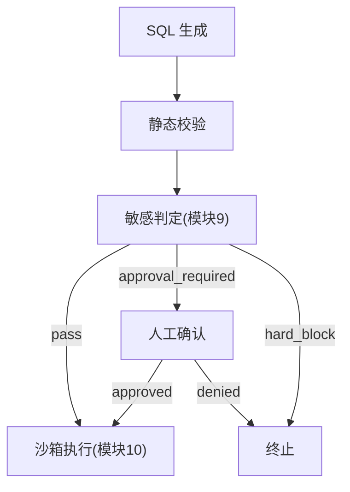
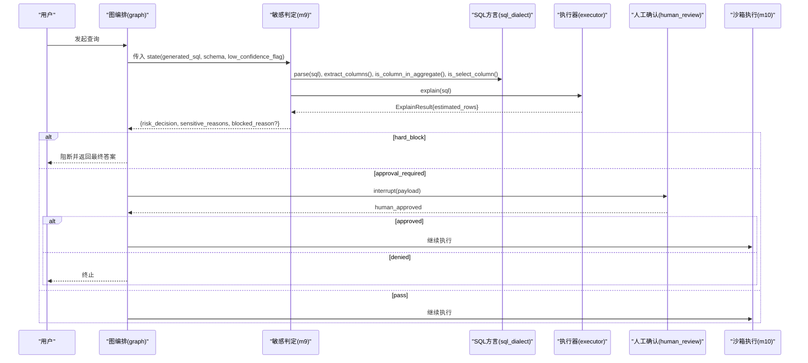
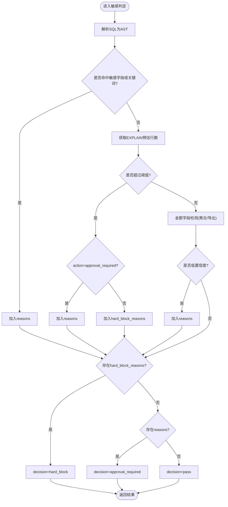
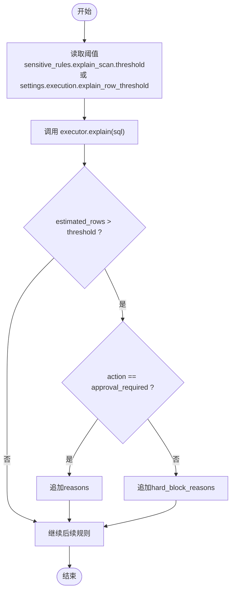
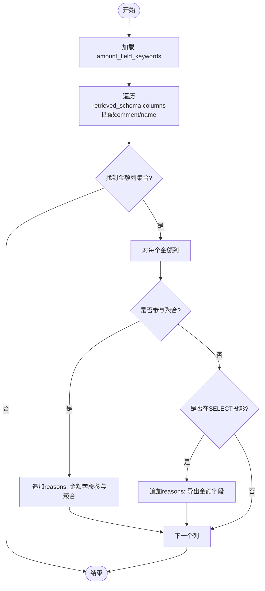
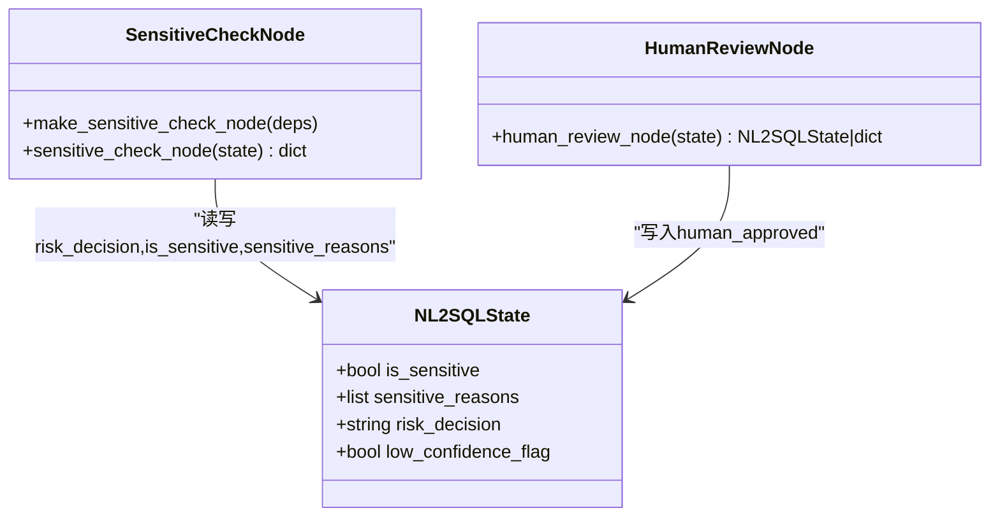
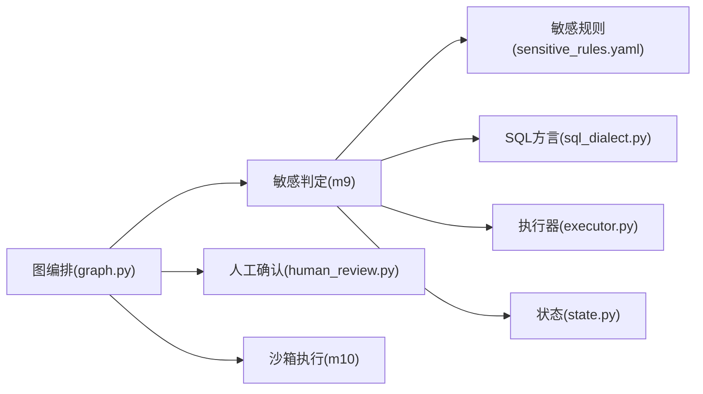

# 敏感操作检测

<cite>
**本文引用的文件**   
- [m9_sensitive_check.py](file://nl2sql_agent/nodes/m9_sensitive_check.py)
- [sensitive_rules.yaml](file://nl2sql_agent/config/sensitive_rules.yaml)
- [settings.yaml](file://nl2sql_agent/config/settings.yaml)
- [sql_dialect.py](file://nl2sql_agent/services/sql_dialect.py)
- [executor.py](file://nl2sql_agent/services/executor.py)
- [human_review.py](file://nl2sql_agent/nodes/human_review.py)
- [state.py](file://nl2sql_agent/state.py)
- [graph.py](file://nl2sql_agent/graph.py)
- [config_loader.py](file://nl2sql_agent/services/config_loader.py)
- [api.py](file://nl2sql_agent/api.py)
</cite>

## 目录
1. [简介](#简介)
2. [项目结构](#项目结构)
3. [核心组件](#核心组件)
4. [架构总览](#架构总览)
5. [详细组件分析](#详细组件分析)
6. [依赖关系分析](#依赖关系分析)
7. [性能考量](#性能考量)
8. [故障排查指南](#故障排查指南)
9. [结论](#结论)
10. [附录](#附录)

## 简介
本文件面向“敏感操作检测”机制，系统性说明三类风险判定规则与三态决策（pass/approval_required/hard_block）的实现逻辑、触发条件与配置方式：
- 敏感字段识别：基于字段名匹配、关键词匹配与语义识别（注释关键字）
- EXPLAIN 预估行数阈值控制：扫描行数预估、性能影响评估与阈值配置
- 金额字段汇总导出保护：聚合函数识别、SELECT 列提取与业务语义判断

同时提供完整配置示例、自定义扩展方法与最佳实践，并给出常见敏感查询场景的识别案例与防护策略。

## 项目结构
敏感操作检测位于“模块 9”，在图编排中处于 SQL 生成与静态校验之后、执行之前；若命中可审批风险则进入“人工确认”，硬阻断风险直接结束流程。

**图表来源** 
- [graph.py:185-198](file://nl2sql_agent/graph.py#L185-L198)
- [m9_sensitive_check.py:1-106](file://nl2sql_agent/nodes/m9_sensitive_check.py#L1-L106)
- [human_review.py:1-32](file://nl2sql_agent/nodes/human_review.py#L1-L32)

**章节来源**
- [graph.py:185-198](file://nl2sql_agent/graph.py#L185-L198)

## 核心组件
- 敏感判定节点：读取敏感规则、解析 SQL AST、调用执行器 EXPLAIN、结合 Schema 信息判定风险，输出三态决策与原因。
- 敏感规则配置：集中定义敏感字段、EXPLAIN 阈值与动作、金额关键词与开关。
- SQL 方言封装：AST 解析、列抽取、聚合/投影检测、行级权限注入等。
- 执行器与 EXPLAIN：返回预估行数，供阈值比较。
- 人工确认节点：中断流程，等待审批结果。
- 全局状态：承载 risk_decision、is_sensitive、sensitive_reasons 等字段。

**章节来源**
- [m9_sensitive_check.py:1-106](file://nl2sql_agent/nodes/m9_sensitive_check.py#L1-L106)
- [sensitive_rules.yaml:1-24](file://nl2sql_agent/config/sensitive_rules.yaml#L1-L24)
- [sql_dialect.py:1-111](file://nl2sql_agent/services/sql_dialect.py#L1-L111)
- [executor.py:1-50](file://nl2sql_agent/services/executor.py#L1-L50)
- [human_review.py:1-32](file://nl2sql_agent/nodes/human_review.py#L1-L32)
- [state.py:123-128](file://nl2sql_agent/state.py#L123-L128)

## 架构总览
敏感判定由“模块 9”统一收敛三类规则，依据配置决定三态决策；通过“模块 10”再次进行执行前 EXPLAIN 守门，形成双重保障。

**图表来源** 
- [m9_sensitive_check.py:19-106](file://nl2sql_agent/nodes/m9_sensitive_check.py#L19-L106)
- [sql_dialect.py:16-77](file://nl2sql_agent/services/sql_dialect.py#L16-L77)
- [executor.py:18-50](file://nl2sql_agent/services/executor.py#L18-L50)
- [human_review.py:15-31](file://nl2sql_agent/nodes/human_review.py#L15-L31)
- [graph.py:260-270](file://nl2sql_agent/graph.py#L260-L270)

## 详细组件分析

### 敏感判定节点（模块 9）
- 输入：state.generated_sql、state.retrieved_schema、state.low_confidence_flag、state.clarified_query/user_query
- 处理：
  - 解析 SQL 为 AST
  - 规则 1：敏感字段识别（字段名匹配 + 文本关键词兜底）
  - 规则 2：EXPLAIN 预估行数阈值控制（action 可配）
  - 规则 3：金额字段汇总/导出保护（按 Schema 注释/名称关键词识别）
  - 低置信度兜底：强制进入人工确认
- 输出：risk_decision（pass/approval_required/hard_block）、is_sensitive、sensitive_reasons、blocked_reason（仅 hard_block）

**图表来源** 
- [m9_sensitive_check.py:19-106](file://nl2sql_agent/nodes/m9_sensitive_check.py#L19-L106)

**章节来源**
- [m9_sensitive_check.py:19-106](file://nl2sql_agent/nodes/m9_sensitive_check.py#L19-L106)

### 敏感字段识别（字段名/关键词/语义）
- 字段名匹配：从 AST 提取所有列引用，与配置的敏感字段 name 集合比对
- 关键词匹配：当未检出列引用时，回退到 clarified_query/user_query 文本匹配 keywords
- 语义识别：金额字段通过 Schema 列注释与名称中的关键词识别（如“金额/本金/余额/amount/principal”）

实现要点：
- 使用 sqlglot AST 遍历 Column 节点，避免正则误判
- 金额字段检测结合 retrieved_schema 的 columns.comment 与 name

**章节来源**
- [m9_sensitive_check.py:32-51](file://nl2sql_agent/nodes/m9_sensitive_check.py#L32-L51)
- [m9_sensitive_check.py:69-82](file://nl2sql_agent/nodes/m9_sensitive_check.py#L69-L82)
- [sql_dialect.py:51-77](file://nl2sql_agent/services/sql_dialect.py#L51-L77)
- [sensitive_rules.yaml:5-7](file://nl2sql_agent/config/sensitive_rules.yaml#L5-L7)
- [sensitive_rules.yaml:17](file://nl2sql_agent/config/sensitive_rules.yaml#L17)

### EXPLAIN 预估行数阈值控制
- 工作原理：调用 executor.explain(sql) 得到 EstimateResult.estimated_rows，与阈值比较
- 阈值来源：优先读取 sensitive_rules.explain_scan.threshold，否则回退 settings.execution.explain_row_threshold
- 行为策略：根据 action 决定进入 approval_required 或直接 hard_block
- 失败容错：EXPLAIN 异常视为基础设施问题，静默跳过，交由模块 10 守门

**图表来源** 
- [m9_sensitive_check.py:52-67](file://nl2sql_agent/nodes/m9_sensitive_check.py#L52-L67)
- [executor.py:18-50](file://nl2sql_agent/services/executor.py#L18-L50)
- [settings.yaml:18-23](file://nl2sql_agent/config/settings.yaml#L18-L23)
- [sensitive_rules.yaml:12-14](file://nl2sql_agent/config/sensitive_rules.yaml#L12-L14)

**章节来源**
- [m9_sensitive_check.py:52-67](file://nl2sql_agent/nodes/m9_sensitive_check.py#L52-L67)
- [executor.py:18-50](file://nl2sql_agent/services/executor.py#L18-L50)
- [settings.yaml:18-23](file://nl2sql_agent/config/settings.yaml#L18-L23)
- [sensitive_rules.yaml:12-14](file://nl2sql_agent/config/sensitive_rules.yaml#L12-L14)

### 金额字段汇总导出保护
- 金额字段识别：从 retrieved_schema.columns 中，按 amount_field_keywords 匹配 comment/name
- 聚合检测：is_column_in_aggregate(expr, col) 判断列是否出现在 SUM/AVG/COUNT 等 AggFunc 参数中
- 导出检测：is_select_column(expr, None, col) 判断列是否出现在 SELECT 投影中
- 开关控制：aggregation_trigger.enabled / export_trigger.enabled

**图表来源** 
- [m9_sensitive_check.py:69-82](file://nl2sql_agent/nodes/m9_sensitive_check.py#L69-L82)
- [sql_dialect.py:61-77](file://nl2sql_agent/services/sql_dialect.py#L61-L77)
- [sensitive_rules.yaml:17-23](file://nl2sql_agent/config/sensitive_rules.yaml#L17-L23)

**章节来源**
- [m9_sensitive_check.py:69-82](file://nl2sql_agent/nodes/m9_sensitive_check.py#L69-L82)
- [sql_dialect.py:61-77](file://nl2sql_agent/services/sql_dialect.py#L61-L77)
- [sensitive_rules.yaml:17-23](file://nl2sql_agent/config/sensitive_rules.yaml#L17-L23)

### 三态决策机制（pass/approval_required/hard_block）
- 优先级：hard_block_reasons 存在即 hard_block；否则 reasons 存在即 approval_required；否则 pass
- 输出字段：risk_decision、is_sensitive、sensitive_reasons；hard_block 时附加 blocked_reason 与 final_answer
- 低置信度兜底：low_confidence_flag 为真时强制进入 approval_required

**图表来源** 
- [state.py:123-128](file://nl2sql_agent/state.py#L123-L128)
- [m9_sensitive_check.py:88-103](file://nl2sql_agent/nodes/m9_sensitive_check.py#L88-L103)
- [human_review.py:15-31](file://nl2sql_agent/nodes/human_review.py#L15-L31)

**章节来源**
- [m9_sensitive_check.py:88-103](file://nl2sql_agent/nodes/m9_sensitive_check.py#L88-L103)
- [state.py:123-128](file://nl2sql_agent/state.py#L123-L128)
- [human_review.py:15-31](file://nl2sql_agent/nodes/human_review.py#L15-L31)

## 依赖关系分析
- 模块 9 依赖：
  - deps.config.sensitive_rules：敏感规则配置
  - deps.sql：SQL 方言封装（AST 解析与列/聚合/投影检测）
  - deps.executor：执行器（EXPLAIN 预估行数）
  - state：全局状态（generated_sql、schema、low_confidence_flag）
- 图编排依赖：
  - graph 将 sensitive_check 与 human_review、sandbox_execution 串联，按 decision 路由

**图表来源** 
- [m9_sensitive_check.py:19-106](file://nl2sql_agent/nodes/m9_sensitive_check.py#L19-L106)
- [graph.py:185-198](file://nl2sql_agent/graph.py#L185-L198)

**章节来源**
- [m9_sensitive_check.py:19-106](file://nl2sql_agent/nodes/m9_sensitive_check.py#L19-L106)
- [graph.py:185-198](file://nl2sql_agent/graph.py#L185-L198)

## 性能考量
- EXPLAIN 开销：每次敏感判定都会调用 executor.explain(sql)，需确保执行环境可用；失败时静默跳过，由模块 10 二次守门
- 阈值设置：explain_row_threshold 过大可能放行高风险查询，过小可能导致频繁阻断；建议结合业务数据规模与 SLA 调优
- 金额关键词：过多关键词会增加 Schema 匹配成本，建议精简且覆盖主要业务术语
- 低置信度兜底：在检索置信度低时强制人工确认，增加交互但降低误执行风险

[本节为通用指导，不直接分析具体文件]

## 故障排查指南
- EXPLAIN 失败：检查数据库连接与只读事务配置；确认 executor 实现支持 EXPLAIN FORMAT=JSON
- 误报/漏报：
  - 调整 sensitive_fields.keywords 与 amount_field_keywords
  - 检查 Schema 注释是否包含金额关键词
  - 调整 explain_scan.threshold 与 action
- 流程卡住：确认 human_review 的 interrupt 恢复路径是否正确传入 approved 标志
- 配置热更新：修改 YAML 后无需重启服务，ConfigLoader 基于 mtime 自动重载

**章节来源**
- [m9_sensitive_check.py:52-67](file://nl2sql_agent/nodes/m9_sensitive_check.py#L52-L67)
- [config_loader.py:14-36](file://nl2sql_agent/services/config_loader.py#L14-L36)
- [api.py:436-447](file://nl2sql_agent/api.py#L436-L447)

## 结论
敏感操作检测以“配置驱动 + AST 结构判定 + EXPLAIN 预估”为核心，兼顾安全性与灵活性。通过三态决策与人工确认机制，既能在高风险场景下硬阻断，又能在可控范围内允许审批后放行。建议持续优化阈值与关键词，并结合业务语义完善 Schema 注释，提升检测准确率与用户体验。

[本节为总结性内容，不直接分析具体文件]

## 附录

### 敏感规则配置示例与扩展方法
- 敏感字段：name 精确匹配 + keywords 文本兜底
- EXPLAIN 阈值：threshold 与 action 组合控制策略
- 金额关键词：amount_field_keywords 列表，配合 aggregation_trigger/export_trigger 开关
- 扩展建议：
  - 新增敏感字段：在 sensitive_fields 中添加 name/keywords
  - 新增金额关键词：在 amount_field_keywords 追加术语
  - 调整阈值：修改 explain_scan.threshold 或 settings.execution.explain_row_threshold
  - 关闭某项检测：将对应 enabled 设为 false

**章节来源**
- [sensitive_rules.yaml:1-24](file://nl2sql_agent/config/sensitive_rules.yaml#L1-L24)
- [settings.yaml:18-23](file://nl2sql_agent/config/settings.yaml#L18-L23)

### 常见敏感查询场景与防护策略
- 身份证/姓名查询：命中 sensitive_fields.name 或 keywords → approval_required 或 hard_block（取决于 action）
- 大表全量扫描：EXPLAIN 预估行数超阈值 → hard_block 或 approval_required
- 金额聚合/导出：SUM/AVG/COUNT 或 SELECT 投影含金额列 → approval_required
- 低置信度检索：low_confidence_flag 为真 → approval_required

**章节来源**
- [m9_sensitive_check.py:32-86](file://nl2sql_agent/nodes/m9_sensitive_check.py#L32-L86)
- [state.py:123-128](file://nl2sql_agent/state.py#L123-L128)