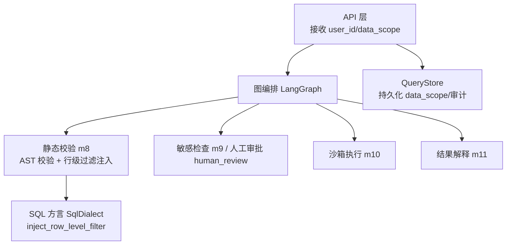
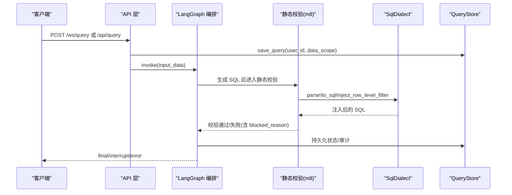
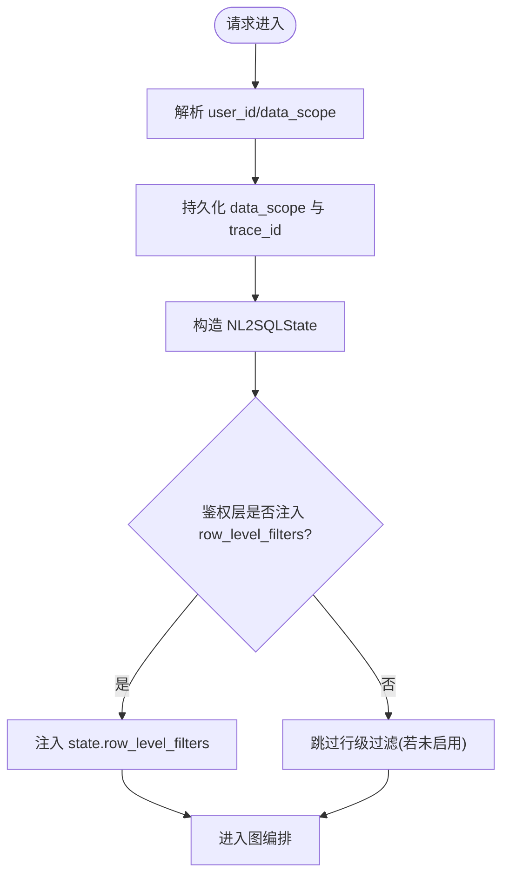
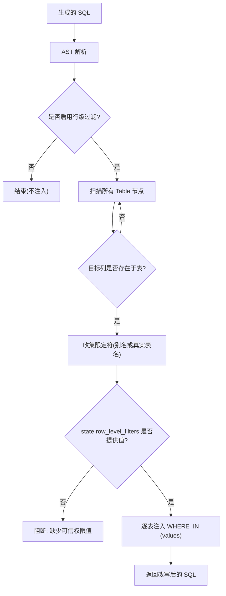
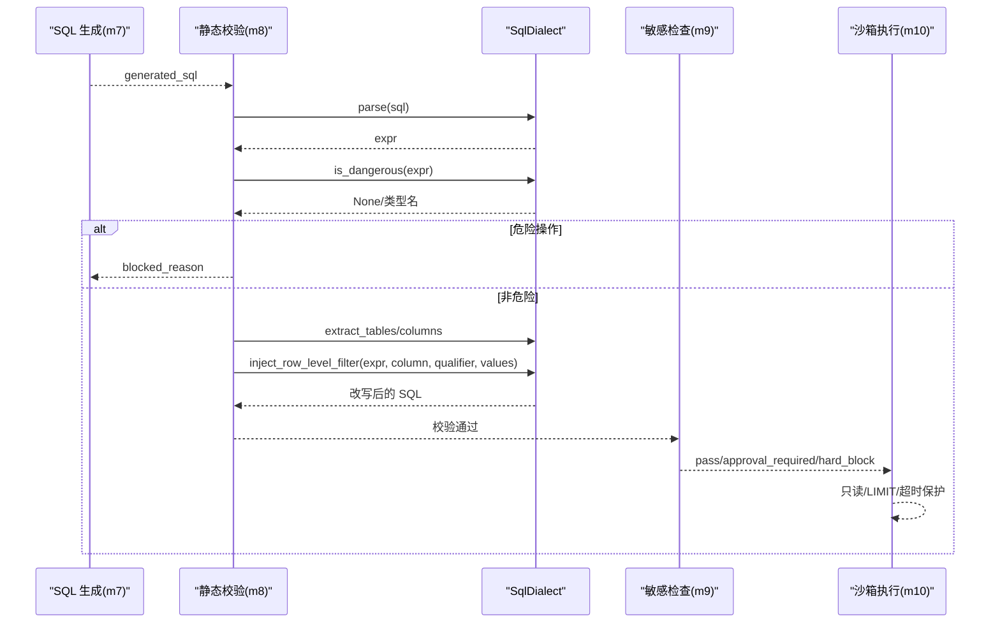
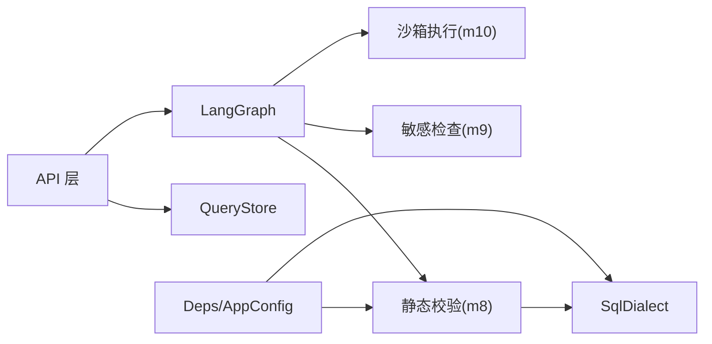

# 权限控制系统

<cite>
**本文引用的文件**   
- [state.py](file://nl2sql_agent/state.py)
- [api.py](file://nl2sql_agent/api.py)
- [graph.py](file://nl2sql_agent/graph.py)
- [m8_static_validation.py](file://nl2sql_agent/nodes/m8_static_validation.py)
- [sql_dialect.py](file://nl2sql_agent/services/sql_dialect.py)
- [deps.py](file://nl2sql_agent/services/deps.py)
- [settings.yaml](file://nl2sql_agent/config/settings.yaml)
- [query_store.py](file://nl2sql_agent/services/query_store.py)
- [test_architecture_hardening.py](file://nl2sql_agent/tests/test_architecture_hardening.py)
- [test_nodes.py](file://nl2sql_agent/tests/test_nodes.py)
- [test_routing.py](file://nl2sql_agent/tests/test_routing.py)
</cite>

## 目录
1. [简介](#简介)
2. [项目结构](#项目结构)
3. [核心组件](#核心组件)
4. [架构总览](#架构总览)
5. [详细组件分析](#详细组件分析)
6. [依赖关系分析](#依赖关系分析)
7. [性能考量](#性能考量)
8. [故障排查指南](#故障排查指南)
9. [结论](#结论)
10. [附录](#附录)

## 简介
本文件面向权限控制系统，围绕用户身份管理、数据范围控制、权限验证流程、多租户隔离策略与审计合规进行系统化说明。系统通过“系统级/业务线隔离 + 行级权限注入”的双层机制，确保查询在生成 SQL 前后均受到严格约束：data_scope 仅用于系统与表级访问控制，row_level_filters 由服务端鉴权层可信注入，并在静态校验阶段强制改写 SQL，防止越权访问。

## 项目结构
权限相关能力分布在以下模块：
- 状态定义：NL2SQLState 中承载 user_id、data_scope、row_level_filters 等身份与权限字段
- API 层：接收并持久化 data_scope，构建执行输入
- 图编排：LangGraph 节点路由，串联校验、敏感审批与执行
- 静态校验：基于 AST 的 SQL 合法性、危险操作拦截、字段幻觉检查与行级过滤注入
- SQL 方言封装：AST 解析、危险检测、列抽取、行级过滤注入、LIMIT 强制
- 配置：settings.yaml 中的 row_level_filter 开关与列名
- 存储：QueryStore 记录 data_scope、审批与审计信息

图表来源
- [api.py:184-196](file://nl2sql_agent/api.py#L184-L196)
- [graph.py:174-312](file://nl2sql_agent/graph.py#L174-L312)
- [m8_static_validation.py:119-148](file://nl2sql_agent/nodes/m8_static_validation.py#L119-L148)
- [sql_dialect.py:80-93](file://nl2sql_agent/services/sql_dialect.py#L80-L93)
- [query_store.py:99-124](file://nl2sql_agent/services/query_store.py#L99-L124)

章节来源
- [state.py:135-141](file://nl2sql_agent/state.py#L135-L141)
- [api.py:184-196](file://nl2sql_agent/api.py#L184-L196)
- [graph.py:174-312](file://nl2sql_agent/graph.py#L174-L312)
- [m8_static_validation.py:119-148](file://nl2sql_agent/nodes/m8_static_validation.py#L119-L148)
- [sql_dialect.py:80-93](file://nl2sql_agent/services/sql_dialect.py#L80-L93)
- [settings.yaml:24-30](file://nl2sql_agent/config/settings.yaml#L24-L30)
- [query_store.py:99-124](file://nl2sql_agent/services/query_store.py#L99-L124)

## 核心组件
- 身份与上下文
  - user_id：当前用户标识
  - data_scope：系统/业务线命名空间（如 risk_mart/dw/core），仅用于表级可见性
  - row_level_filters：服务端可信注入的行级过滤条件字典，例如 {"PLATFORM_CODE": ["XXD","ZJ"]}
- 配置项
  - row_level_filter.enabled：是否启用行级过滤
  - row_level_filter.column：用于行级过滤的列名（默认 business_line，示例配置为 PLATFORM_CODE）
- 校验与注入
  - 静态校验节点负责：语法/方言校验、危险操作拦截、字段幻觉检查、data_scope 泄露防护、行级过滤注入
  - SQL 方言封装提供 inject_row_level_filter，按表别名安全追加 WHERE 条件

章节来源
- [state.py:135-141](file://nl2sql_agent/state.py#L135-L141)
- [deps.py:40-51](file://nl2sql_agent/services/deps.py#L40-L51)
- [settings.yaml:24-30](file://nl2sql_agent/config/settings.yaml#L24-L30)
- [m8_static_validation.py:119-148](file://nl2sql_agent/nodes/m8_static_validation.py#L119-L148)
- [sql_dialect.py:80-93](file://nl2sql_agent/services/sql_dialect.py#L80-L93)

## 架构总览
下图展示从请求到执行的权限控制关键路径：API 接收身份与 data_scope，进入图编排；静态校验阶段根据配置与 state.row_level_filters 注入行级过滤；敏感检查可能触发人工审批；最终执行前再次受限于只读与 LIMIT。

图表来源
- [api.py:184-196](file://nl2sql_agent/api.py#L184-L196)
- [graph.py:250-272](file://nl2sql_agent/graph.py#L250-L272)
- [m8_static_validation.py:119-148](file://nl2sql_agent/nodes/m8_static_validation.py#L119-L148)
- [sql_dialect.py:80-93](file://nl2sql_agent/services/sql_dialect.py#L80-L93)
- [query_store.py:99-124](file://nl2sql_agent/services/query_store.py#L99-L124)

## 详细组件分析

### 用户身份与上下文管理
- 入口注入
  - WebSocket/REST 接口将 user_id、data_scope、conversation_history、trace_id 组装为 input_data
  - QueryStore 持久化 data_scope 与 trace_id，便于历史与审计
- 状态字段
  - NL2SQLState.user_id：用户标识
  - NL2SQLState.data_scope：系统/业务线列表，下游只读
  - NL2SQLState.row_level_filters：独立可信行级权限，不得由 API 直接传入，应由服务端鉴权层注入

图表来源
- [api.py:184-196](file://nl2sql_agent/api.py#L184-L196)
- [state.py:135-141](file://nl2sql_agent/state.py#L135-L141)
- [query_store.py:99-124](file://nl2sql_agent/services/query_store.py#L99-L124)

章节来源
- [api.py:184-196](file://nl2sql_agent/api.py#L184-L196)
- [state.py:135-141](file://nl2sql_agent/state.py#L135-L141)
- [query_store.py:99-124](file://nl2sql_agent/services/query_store.py#L99-L124)

### 数据范围控制实现
- 业务线隔离（系统级）
  - data_scope 作为系统命名空间，影响 Schema 检索与表可见性
  - 测试覆盖：risk_mart 用户可检索 dwd_ar_loan_info，dw 用户不可见
- 部门数据过滤（行级）
  - 通过 row_level_filter.column 指定列（如 PLATFORM_CODE）
  - 静态校验阶段对实际引用且包含该列的表分别按别名注入 IN(...) 条件
  - 若启用但未提供可信值，则阻断查询并返回 blocked_reason
- 行级权限应用
  - 使用 sqlglot AST 注入 WHERE 条件，避免字符串拼接风险
  - 支持 JOIN 场景下多表别名的分别注入

图表来源
- [m8_static_validation.py:119-148](file://nl2sql_agent/nodes/m8_static_validation.py#L119-L148)
- [sql_dialect.py:80-93](file://nl2sql_agent/services/sql_dialect.py#L80-L93)
- [settings.yaml:24-30](file://nl2sql_agent/config/settings.yaml#L24-L30)

章节来源
- [test_routing.py:106-114](file://nl2sql_agent/tests/test_routing.py#L106-L114)
- [m8_static_validation.py:119-148](file://nl2sql_agent/nodes/m8_static_validation.py#L119-L148)
- [sql_dialect.py:80-93](file://nl2sql_agent/services/sql_dialect.py#L80-L93)
- [settings.yaml:24-30](file://nl2sql_agent/config/settings.yaml#L24-L30)

### 权限验证流程
- 查询前检查
  - 语法与方言合法性
  - 危险操作拦截（非 SELECT 类语句直接 blocked）
  - 字段幻觉检查（引用列必须存在于检索到的 schema）
  - data_scope 泄露防护（禁止把系统命名空间误作字面量写入 SQL）
- 动态 SQL 改写
  - 基于 AST 的 inject_row_level_filter，按表别名安全追加 WHERE
- 数据访问控制
  - 执行器限制：只读事务、LIMIT、超时、EXPLAIN 行数阈值拒绝

图表来源
- [m8_static_validation.py:1-118](file://nl2sql_agent/nodes/m8_static_validation.py#L1-L118)
- [sql_dialect.py:22-38](file://nl2sql_agent/services/sql_dialect.py#L22-L38)
- [sql_dialect.py:80-93](file://nl2sql_agent/services/sql_dialect.py#L80-L93)
- [graph.py:250-272](file://nl2sql_agent/graph.py#L250-L272)

章节来源
- [m8_static_validation.py:1-118](file://nl2sql_agent/nodes/m8_static_validation.py#L1-L118)
- [sql_dialect.py:22-38](file://nl2sql_agent/services/sql_dialect.py#L22-L38)
- [sql_dialect.py:80-93](file://nl2sql_agent/services/sql_dialect.py#L80-L93)
- [graph.py:250-272](file://nl2sql_agent/graph.py#L250-L272)

### data_scope 字段设计与使用
- 设计原则
  - data_scope 表示系统/业务线命名空间，仅用于表级可见性与检索范围
  - 严禁将 data_scope 的值作为表内字段的业务值出现在 SQL 中
- 传递方式
  - API 接收 data_scope，持久化至 QueryStore，并注入 NL2SQLState
- 作用域限制
  - 静态校验阶段检测 literal 值泄露，命中即要求重新生成 SQL
  - 行级过滤必须来自 state.row_level_filters，与 data_scope 解耦

章节来源
- [state.py:135-141](file://nl2sql_agent/state.py#L135-L141)
- [api.py:184-196](file://nl2sql_agent/api.py#L184-L196)
- [m8_static_validation.py:57-72](file://nl2sql_agent/nodes/m8_static_validation.py#L57-L72)
- [test_architecture_hardening.py:77-91](file://nl2sql_agent/tests/test_architecture_hardening.py#L77-L91)

### 多租户架构下的权限隔离策略
- 数据隔离级别
  - 系统级隔离：data_scope 决定可检索的表集合（如 risk_mart vs dw）
  - 行级隔离：row_level_filters 针对平台/部门维度过滤具体行
- 共享数据访问控制
  - 术语映射支持 global 业务线，跨系统共享口径
  - 行级过滤仅在目标表存在对应列时生效，避免误注入

章节来源
- [test_routing.py:106-114](file://nl2sql_agent/tests/test_routing.py#L106-L114)
- [m8_static_validation.py:119-148](file://nl2sql_agent/nodes/m8_static_validation.py#L119-L148)
- [term_mapping/_global.yaml:1-42](file://nl2sql_agent/config/term_mapping/_global.yaml#L1-L42)

### 权限配置最佳实践
- 启用行级过滤
  - settings.yaml 中设置 row_level_filter.enabled=true 与正确的 column
- 服务端鉴权层注入
  - 在调用图之前，向 state.row_level_filters 注入可信值（如 PLATFORM_CODE）
- 最小权限原则
  - data_scope 仅包含必要系统/业务线
  - row_level_filters 仅包含用户有权访问的取值集合
- 审计与回滚
  - 利用 QueryStore 记录 data_scope、审批与反馈，配合前端历史/审计页

章节来源
- [settings.yaml:24-30](file://nl2sql_agent/config/settings.yaml#L24-L30)
- [query_store.py:99-124](file://nl2sql_agent/services/query_store.py#L99-L124)

### 常见权限场景的实现方案
- 跨平台数据隔离
  - 通过 row_level_filter.column=PLATFORM_CODE，注入用户所属平台编码集合
- 部门数据过滤
  - 以 department_code 为列名，注入部门维度过滤
- 行级权限与 JOIN
  - 静态校验会遍历所有表别名，分别注入 WHERE 条件，保证 JOIN 一致性

章节来源
- [test_nodes.py:276-302](file://nl2sql_agent/tests/test_nodes.py#L276-L302)
- [m8_static_validation.py:119-148](file://nl2sql_agent/nodes/m8_static_validation.py#L119-L148)

### 性能优化建议
- 行级过滤仅在必要时启用，避免不必要的 AST 重写
- 合理设置 execution.limit 与 timeout_seconds，减少大结果集与长耗时查询
- 使用 EXPLAIN 预估行数阈值拒绝高风险查询
- 向量检索 top_k 与缓存策略（预留扩展点）

章节来源
- [settings.yaml:18-23](file://nl2sql_agent/config/settings.yaml#L18-L23)
- [sql_dialect.py:96-111](file://nl2sql_agent/services/sql_dialect.py#L96-L111)

### 权限审计与合规性检查
- 审计字段
  - data_scope、risk_decision、approved、approver、trace_steps、node_latencies
- 历史与审批
  - /api/history 支持按 user_id、business_line、时间范围筛选
  - /api/approvals 获取待审批队列
- 反馈闭环
  - /api/feedback 记录 plan_wrong/sql_wrong/other 反馈

章节来源
- [query_store.py:146-180](file://nl2sql_agent/services/query_store.py#L146-L180)
- [api.py:356-391](file://nl2sql_agent/api.py#L356-L391)

## 依赖关系分析
- 组件耦合
  - API 依赖 QueryStore 与 LangGraph
  - 图编排依赖各节点（m8、m9、m10 等）
  - 静态校验依赖 SqlDialect 与配置 AppConfig
- 外部依赖
  - sqlglot 用于 AST 解析与改写
  - SQLite 用于本地审计与历史存储

图表来源
- [api.py:184-196](file://nl2sql_agent/api.py#L184-L196)
- [graph.py:174-312](file://nl2sql_agent/graph.py#L174-L312)
- [m8_static_validation.py:119-148](file://nl2sql_agent/nodes/m8_static_validation.py#L119-L148)
- [sql_dialect.py:80-93](file://nl2sql_agent/services/sql_dialect.py#L80-L93)
- [deps.py:110-181](file://nl2sql_agent/services/deps.py#L110-L181)

章节来源
- [deps.py:110-181](file://nl2sql_agent/services/deps.py#L110-L181)
- [graph.py:174-312](file://nl2sql_agent/graph.py#L174-L312)

## 性能考量
- 行级过滤的 AST 重写开销与 JOIN 表数量成正比，建议按需启用
- 执行器侧只读事务、LIMIT、超时与 EXPLAIN 阈值可有效降低资源消耗
- 向量检索 top_k 与语义缓存可作为后续扩展点提升检索效率

[本节为通用指导，不直接分析具体文件]

## 故障排查指南
- 常见问题
  - 行级过滤已启用但无可信值：静态校验阻断，blocked_reason 提示缺失权限值
  - data_scope 误用为字面量：静态校验报错并要求重新生成 SQL
  - 危险操作被拦截：blocked_reason 显示具体命令类型
- 定位步骤
  - 查看 QueryStore 的 data_scope、risk_decision、next_node 与 trace_steps
  - 检查 settings.yaml 的 row_level_filter 配置
  - 确认服务端鉴权层是否正确注入 state.row_level_filters

章节来源
- [m8_static_validation.py:119-148](file://nl2sql_agent/nodes/m8_static_validation.py#L119-L148)
- [m8_static_validation.py:48-55](file://nl2sql_agent/nodes/m8_static_validation.py#L48-L55)
- [query_store.py:146-180](file://nl2sql_agent/services/query_store.py#L146-L180)
- [settings.yaml:24-30](file://nl2sql_agent/config/settings.yaml#L24-L30)

## 结论
本权限控制系统以“系统级隔离 + 行级过滤”为核心，结合 AST 驱动的静态校验与只读执行保护，形成端到端的安全保障。通过清晰的 data_scope 与 row_level_filters 职责分离、严格的校验与审计机制，满足多租户与合规需求。建议在生产环境启用行级过滤、最小化 data_scope，并结合审计与反馈闭环持续优化。

[本节为总结，不直接分析具体文件]

## 附录
- 术语映射与跨系统共享
  - _global.yaml 提供跨业务线的术语映射，支持全局口径统一
- 前端历史与审计
  - HistoryPage 支持按 user_id、business_line、时间范围筛选，并加载审计详情

章节来源
- [term_mapping/_global.yaml:1-42](file://nl2sql_agent/config/term_mapping/_global.yaml#L1-L42)
- [HistoryPage.tsx:44-71](file://web/src/pages/HistoryPage.tsx#L44-L71)