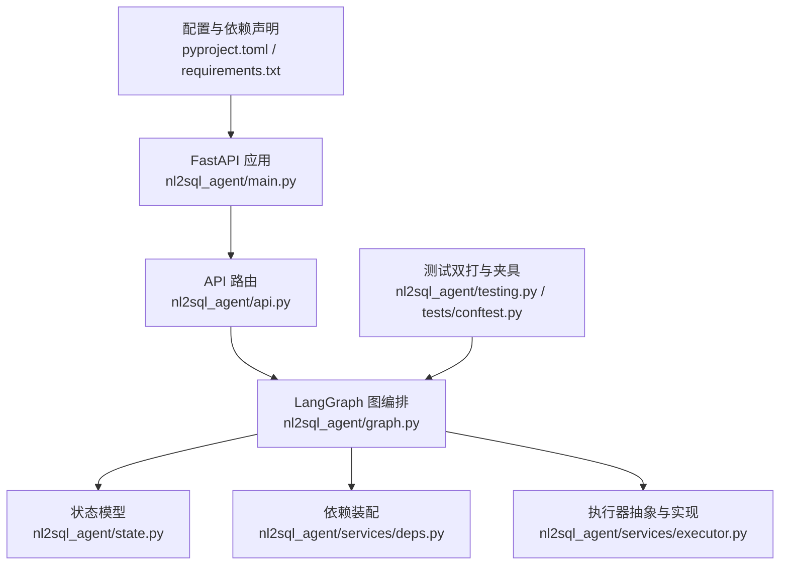
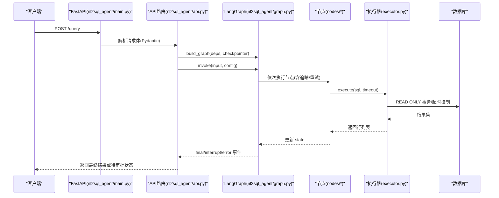
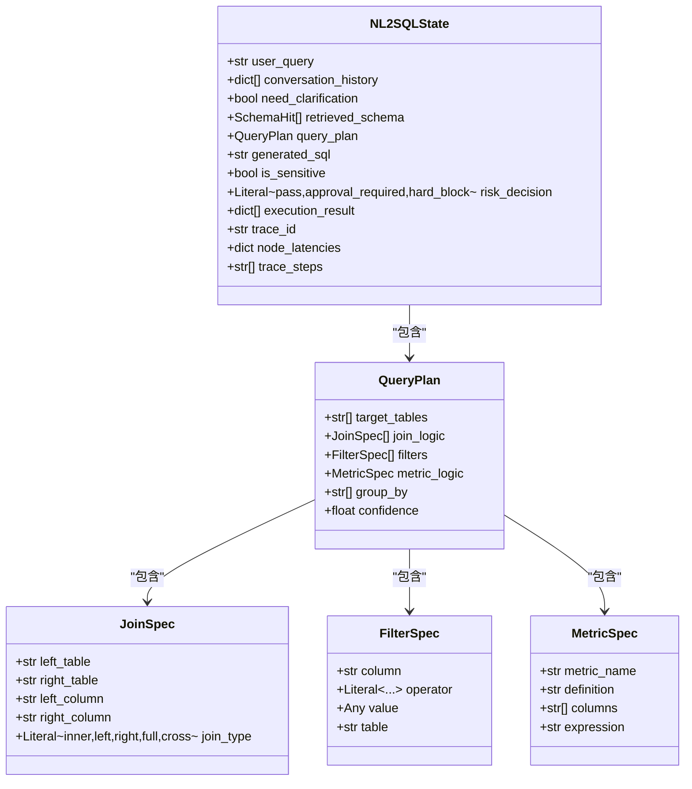
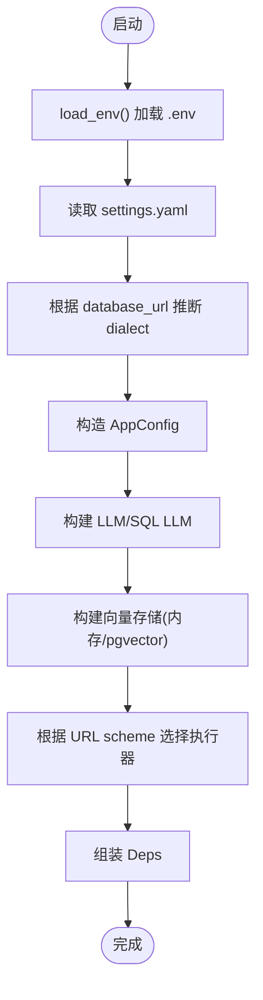
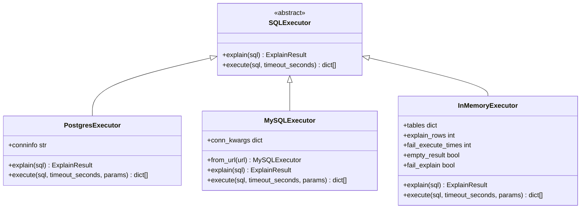
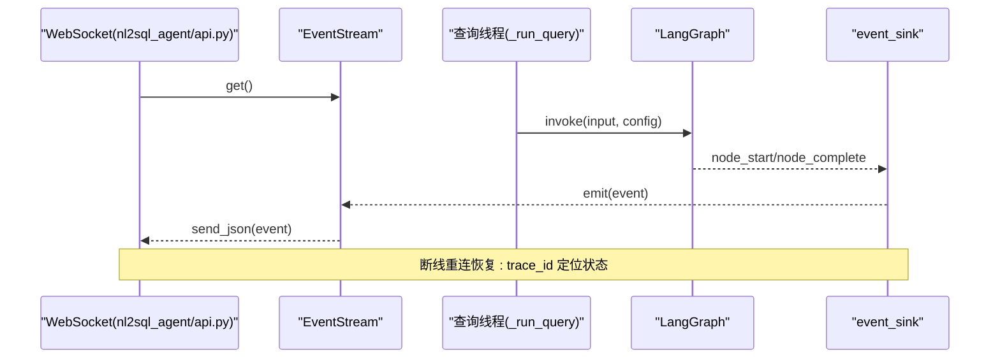
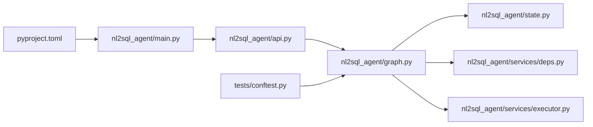

# 代码规范

<cite>
**本文引用的文件**   
- [pyproject.toml](file://pyproject.toml)
- [requirements.txt](file://requirements.txt)
- [main.py](file://main.py)
- [nl2sql_agent/main.py](file://nl2sql_agent/main.py)
- [nl2sql_agent/api.py](file://nl2sql_agent/api.py)
- [nl2sql_agent/graph.py](file://nl2sql_agent/graph.py)
- [nl2sql_agent/state.py](file://nl2sql_agent/state.py)
- [nl2sql_agent/services/deps.py](file://nl2sql_agent/services/deps.py)
- [nl2sql_agent/services/executor.py](file://nl2sql_agent/services/executor.py)
- [nl2sql_agent/testing.py](file://nl2sql_agent/testing.py)
- [nl2sql_agent/tests/conftest.py](file://nl2sql_agent/tests/conftest.py)
- [scripts/review_schema_comments.py](file://scripts/review_schema_comments.py)
</cite>

## 目录
1. [简介](#简介)
2. [项目结构](#项目结构)
3. [核心组件](#核心组件)
4. [架构总览](#架构总览)
5. [详细组件分析](#详细组件分析)
6. [依赖关系分析](#依赖关系分析)
7. [性能考量](#性能考量)
8. [故障排查指南](#故障排查指南)
9. [结论](#结论)
10. [附录](#附录)

## 简介
本规范面向 NL2SQL 项目的 Python 代码风格与工程实践，覆盖 PEP8 遵循、命名约定、文件组织、类型注解（Pydantic、数据类、泛型）、注释与文档字符串、错误处理与日志、代码审查流程（PR 模板、检查清单、自动化检查工具）以及重构与设计模式指导。本文所有规则均基于仓库现有实现归纳提炼，确保可落地、可执行、可度量。

## 项目结构
- 包名与入口
  - 应用主入口位于 nl2sql_agent/main.py，提供 FastAPI 服务与 HTTP 路由；根目录 main.py 仅用于演示。
  - API 层集中在 nl2sql_agent/api.py，统一暴露 REST/WebSocket 接口。
  - 图编排与节点在 nl2sql_agent/graph.py 与各 nodes/* 模块中。
  - 状态模型集中定义于 nl2sql_agent/state.py。
  - 依赖装配与配置加载在 nl2sql_agent/services/deps.py。
  - 执行器抽象与具体实现在 nl2sql_agent/services/executor.py。
  - 测试双打与夹具在 nl2sql_agent/testing.py 与 nl2sql_agent/tests/conftest.py。
- 配置文件
  - pyproject.toml 管理依赖、构建与 pytest 配置；requirements.txt 为兼容清单。
- 脚本与 SQL
  - scripts 下包含运维与审核脚本；sql 目录存放示例建表语句。

**图表来源** 
- [nl2sql_agent/main.py:1-152](file://nl2sql_agent/main.py#L1-L152)
- [nl2sql_agent/api.py:1-573](file://nl2sql_agent/api.py#L1-L573)
- [nl2sql_agent/graph.py:1-313](file://nl2sql_agent/graph.py#L1-L313)
- [nl2sql_agent/state.py:1-146](file://nl2sql_agent/state.py#L1-L146)
- [nl2sql_agent/services/deps.py:1-181](file://nl2sql_agent/services/deps.py#L1-L181)
- [nl2sql_agent/services/executor.py:1-205](file://nl2sql_agent/services/executor.py#L1-L205)
- [nl2sql_agent/testing.py:1-187](file://nl2sql_agent/testing.py#L1-L187)
- [nl2sql_agent/tests/conftest.py:1-76](file://nl2sql_agent/tests/conftest.py#L1-L76)
- [pyproject.toml:1-44](file://pyproject.toml#L1-L44)
- [requirements.txt:1-15](file://requirements.txt#L1-L15)

**章节来源**
- [nl2sql_agent/main.py:1-152](file://nl2sql_agent/main.py#L1-L152)
- [nl2sql_agent/api.py:1-573](file://nl2sql_agent/api.py#L1-L573)
- [nl2sql_agent/graph.py:1-313](file://nl2sql_agent/graph.py#L1-L313)
- [nl2sql_agent/state.py:1-146](file://nl2sql_agent/state.py#L1-L146)
- [nl2sql_agent/services/deps.py:1-181](file://nl2sql_agent/services/deps.py#L1-L181)
- [nl2sql_agent/services/executor.py:1-205](file://nl2sql_agent/services/executor.py#L1-L205)
- [nl2sql_agent/testing.py:1-187](file://nl2sql_agent/testing.py#L1-L187)
- [nl2sql_agent/tests/conftest.py:1-76](file://nl2sql_agent/tests/conftest.py#L1-L76)
- [pyproject.toml:1-44](file://pyproject.toml#L1-L44)
- [requirements.txt:1-15](file://requirements.txt#L1-L15)

## 核心组件
- 状态模型（Pydantic v2）
  - 使用 BaseModel 与 ConfigDict(extra="forbid") 严格约束字段，避免任意键扩展。
  - 使用 Literal、Field(min_length/ge/le)、field_validator 等做输入校验与规范化。
  - 典型：QueryPlan、JoinSpec、FilterSpec、MetricSpec、NL2SQLState。
- 依赖装配（dataclass）
  - AppConfig、Deps 以 dataclass 组织配置与服务实例，便于测试替换。
  - build_deps 从 settings.yaml/.env 读取并组装 LLM、向量库、执行器等。
- 执行器抽象（ABC + dataclass）
  - SQLExecutor 抽象 explain/execute；PostgresExecutor、MySQLExecutor、InMemoryExecutor 分别实现。
- 图编排（LangGraph）
  - StateGraph(NL2SQLState) 定义节点与条件边，支持中断与重试回路。
  - _traced/_retry_route 统一埋点与事件推送。
- API 层（FastAPI）
  - REST + WebSocket 双通道；EventStream 桥接线程与协程队列。
  - Pydantic 请求体校验；HTTPException 统一错误码。

**章节来源**
- [nl2sql_agent/state.py:1-146](file://nl2sql_agent/state.py#L1-L146)
- [nl2sql_agent/services/deps.py:1-181](file://nl2sql_agent/services/deps.py#L1-L181)
- [nl2sql_agent/services/executor.py:1-205](file://nl2sql_agent/services/executor.py#L1-L205)
- [nl2sql_agent/graph.py:1-313](file://nl2sql_agent/graph.py#L1-L313)
- [nl2sql_agent/api.py:1-573](file://nl2sql_agent/api.py#L1-L573)

## 架构总览
下图展示从 HTTP 到 LangGraph 节点再到数据库执行的调用链，以及事件流回推前端的机制。

**图表来源** 
- [nl2sql_agent/main.py:83-120](file://nl2sql_agent/main.py#L83-L120)
- [nl2sql_agent/api.py:134-157](file://nl2sql_agent/api.py#L134-L157)
- [nl2sql_agent/graph.py:174-313](file://nl2sql_agent/graph.py#L174-L313)
- [nl2sql_agent/services/executor.py:71-81](file://nl2sql_agent/services/executor.py#L71-L81)

## 详细组件分析

### 状态模型与类型注解规范
- 使用 Pydantic v2 的 BaseModel 作为唯一数据契约，禁止额外字段（extra="forbid"）。
- 使用 Field 描述默认值、最小长度、取值范围；使用 field_validator 做归一化。
- 使用 Literal 限定枚举式字段（如 join_type、risk_decision）。
- 复杂结构拆分为小模型（JoinSpec、FilterSpec、MetricSpec），提高可读性与复用性。
- 全局状态 NL2SQLState 聚合各阶段产出，供节点间传递与持久化。

**图表来源** 
- [nl2sql_agent/state.py:1-146](file://nl2sql_agent/state.py#L1-L146)

**章节来源**
- [nl2sql_agent/state.py:1-146](file://nl2sql_agent/state.py#L1-L146)

### 依赖装配与配置加载
- AppConfig 与 Deps 采用 dataclass，清晰表达配置项与服务依赖。
- build_deps 按优先级读取 settings.yaml、环境变量、URL scheme，动态选择执行器与向量存储后端。
- load_env 安全加载 .env，不覆盖已存在的环境变量。
- 测试环境通过 build_test_deps 注入 FakeLLM、InMemoryExecutor、InMemoryVectorStore。

**图表来源** 
- [nl2sql_agent/services/deps.py:32-181](file://nl2sql_agent/services/deps.py#L32-L181)

**章节来源**
- [nl2sql_agent/services/deps.py:1-181](file://nl2sql_agent/services/deps.py#L1-L181)
- [nl2sql_agent/testing.py:148-187](file://nl2sql_agent/testing.py#L148-L187)

### 执行器与只读安全
- SQLExecutor 抽象 define explain/execute；PostgresExecutor 使用 READ ONLY 事务与 statement_timeout；MySQLExecutor 使用 START TRANSACTION READ ONLY 与 MAX_EXECUTION_TIME。
- InMemoryExecutor 用于测试，支持模拟失败、空结果与 EXPLAIN 失败。
- estimate_max_rows 保守估计扫描行数，辅助敏感判定与风险决策。

**图表来源** 
- [nl2sql_agent/services/executor.py:1-205](file://nl2sql_agent/services/executor.py#L1-L205)

**章节来源**
- [nl2sql_agent/services/executor.py:1-205](file://nl2sql_agent/services/executor.py#L1-L205)

### 图编排与事件流
- StateGraph 定义 11 个节点与多条条件边，支持 interrupt 人工确认与澄清。
- _traced 包装节点，记录延迟与步骤，并通过 event_sink 推送 node_start/node_complete。
- _retry_route 包装重试路由，推送 retry 事件（attempt + reason）。
- API 层 EventStream 将同步线程事件投递至 asyncio.Queue，WebSocket 消费。

**图表来源** 
- [nl2sql_agent/api.py:54-66](file://nl2sql_agent/api.py#L54-L66)
- [nl2sql_agent/api.py:134-157](file://nl2sql_agent/api.py#L134-L157)
- [nl2sql_agent/graph.py:72-126](file://nl2sql_agent/graph.py#L72-L126)

**章节来源**
- [nl2sql_agent/api.py:1-573](file://nl2sql_agent/api.py#L1-L573)
- [nl2sql_agent/graph.py:1-313](file://nl2sql_agent/graph.py#L1-L313)

### 注释与文档字符串规范
- 模块级文档字符串说明职责、接口与运行方式（如 nl2sql_agent/main.py、api.py、graph.py）。
- 函数/方法级文档字符串说明参数、返回值与副作用（如 build_deps、_run_query、make_entry_node）。
- 复杂逻辑需附简要注释解释边界与异常路径（如 _retry_route、estimate_max_rows）。
- 建议：每个新增模块必须包含模块级 docstring；公共 API 必须包含参数与返回值的说明。

**章节来源**
- [nl2sql_agent/main.py:1-10](file://nl2sql_agent/main.py#L1-L10)
- [nl2sql_agent/api.py:1-9](file://nl2sql_agent/api.py#L1-L9)
- [nl2sql_agent/graph.py:1-18](file://nl2sql_agent/graph.py#L1-L18)
- [nl2sql_agent/services/deps.py:1-6](file://nl2sql_agent/services/deps.py#L1-L6)
- [nl2sql_agent/nodes/m1_entry.py:1-5](file://nl2sql_agent/nodes/m1_entry.py#L1-L5)

### 错误处理与日志记录规范
- 异常类型
  - 业务校验失败使用 ValueError（如 m1_entry 对必填字段校验）。
  - 外部依赖缺失或配置错误使用 RuntimeError（如 deps 未配置数据库连接）。
  - HTTP 层使用 HTTPException 返回标准状态码与消息。
- 日志级别
  - 关键路径使用 print(f"[approve] ...", flush=True) 进行快速调试输出（临时方案，生产建议接入结构化日志）。
  - 事件推送失败应被吞掉且不影响流程（try/except pass 保护 sink）。
- 错误信息格式
  - 统一包含 trace_id，便于链路追踪。
  - 执行失败时记录 execution_error 与 status="error"。

**章节来源**
- [nl2sql_agent/nodes/m1_entry.py:14-27](file://nl2sql_agent/nodes/m1_entry.py#L14-L27)
- [nl2sql_agent/services/deps.py:160-167](file://nl2sql_agent/services/deps.py#L160-L167)
- [nl2sql_agent/api.py:266-271](file://nl2sql_agent/api.py#L266-L271)
- [nl2sql_agent/api.py:152-154](file://nl2sql_agent/api.py#L152-L154)
- [nl2sql_agent/graph.py:72-85](file://nl2sql_agent/graph.py#L72-L85)

### 代码审查流程
- PR 模板（建议）
  - 变更摘要、影响范围、依赖变化（pyproject.toml/requirements.txt）、测试覆盖、回滚策略。
- 检查清单
  - 是否新增 Pydantic 字段并补充 validator？
  - 是否引入新的外部依赖并更新依赖清单？
  - 是否增加必要的模块/函数文档字符串？
  - 是否覆盖异常分支与重试边界？
  - 是否通过 pytest 与本地 lint？
- 自动化检查工具（建议）
  - 静态检查：ruff/flake8、mypy（启用 strict 模式）、pydantic 类型检查。
  - 单元测试：pytest（conftest 隔离配置与数据）。
  - 提交钩子：pre-commit 集成 ruff、mypy、pytest。

[本节为通用流程建议，不直接分析具体文件]

### 重构与设计模式指导
- 单一职责
  - 状态模型、依赖装配、执行器、图编排、API 层职责清晰分离。
- 依赖注入
  - 通过 Deps 注入 LLM、执行器、向量库，便于测试替换与热插拔。
- 工厂与策略
  - build_executor_from_url 按 URL scheme 选择执行器；build_vector_store 按配置选择后端。
- 观察者/事件驱动
  - event_sink 与 EventStream 解耦图执行与前端推送。
- 重试与熔断
  - _retry_route 封装重试逻辑，限制最大次数，避免无限循环。

**章节来源**
- [nl2sql_agent/services/deps.py:73-108](file://nl2sql_agent/services/deps.py#L73-L108)
- [nl2sql_agent/graph.py:106-126](file://nl2sql_agent/graph.py#L106-L126)
- [nl2sql_agent/api.py:54-66](file://nl2sql_agent/api.py#L54-L66)

## 依赖关系分析
- 运行时依赖
  - langgraph、langgraph-checkpoint、pydantic、fastapi、uvicorn、sqlglot、anthropic/openai、PyYAML、python-dotenv、psycopg/pymysql、sentence-transformers、modelscope。
- 构建与测试
  - hatchling、pytest；uv 索引指向清华源。
- 包内依赖
  - api → graph → nodes/* → services/* → state；deps 负责装配。

**图表来源** 
- [pyproject.toml:1-44](file://pyproject.toml#L1-L44)
- [requirements.txt:1-15](file://requirements.txt#L1-L15)
- [nl2sql_agent/main.py:1-152](file://nl2sql_agent/main.py#L1-L152)
- [nl2sql_agent/api.py:1-573](file://nl2sql_agent/api.py#L1-L573)
- [nl2sql_agent/graph.py:1-313](file://nl2sql_agent/graph.py#L1-L313)
- [nl2sql_agent/state.py:1-146](file://nl2sql_agent/state.py#L1-L146)
- [nl2sql_agent/services/deps.py:1-181](file://nl2sql_agent/services/deps.py#L1-L181)
- [nl2sql_agent/services/executor.py:1-205](file://nl2sql_agent/services/executor.py#L1-L205)
- [nl2sql_agent/tests/conftest.py:1-76](file://nl2sql_agent/tests/conftest.py#L1-L76)

**章节来源**
- [pyproject.toml:1-44](file://pyproject.toml#L1-L44)
- [requirements.txt:1-15](file://requirements.txt#L1-L15)

## 性能考量
- 事件序列化与截断
  - _event_data 对 execution_result 截断前 20 条，减少网络与前端渲染压力。
- 节点追踪
  - _traced 记录 node_latencies 与 trace_steps，便于瓶颈定位。
- 执行超时与只读
  - Postgres/MySQL 执行器强制只读与超时，防止长尾查询拖垮服务。
- 向量存储缓存
  - InMemoryVectorStore 支持 cache_signature 避免重复 embedding。

[本节为通用性能建议，结合仓库实现归纳]

## 故障排查指南
- 常见问题
  - 未配置数据库连接：build_deps 抛出 RuntimeError，检查 DATABASE_URL/settings.yaml。
  - 权限不足：user_id/data_scope 缺失导致 ValueError，检查入口节点校验。
  - 执行失败：execution_error 非空，查看 trace_id 对应状态与日志。
  - 事件丢失：event_sink 抛错会被忽略，检查 WebSocket 连接与 EventStream 队列。
- 诊断步骤
  - 通过 /thread/{trace_id} 获取当前状态快照。
  - 通过 /history 与 /audit/{trace_id} 查看历史与反馈。
  - 使用 conftest 隔离配置与数据，复现实验场景。

**章节来源**
- [nl2sql_agent/services/deps.py:160-167](file://nl2sql_agent/services/deps.py#L160-L167)
- [nl2sql_agent/nodes/m1_entry.py:14-27](file://nl2sql_agent/nodes/m1_entry.py#L14-L27)
- [nl2sql_agent/api.py:142-146](file://nl2sql_agent/api.py#L142-L146)
- [nl2sql_agent/tests/conftest.py:46-56](file://nl2sql_agent/tests/conftest.py#L46-L56)

## 结论
本项目在类型安全、依赖注入、事件驱动与只读执行方面具备良好工程基础。建议持续完善文档字符串、结构化日志与自动化检查，强化测试覆盖率与回归基线，确保可扩展性与稳定性。

[本节为总结性内容，不直接分析具体文件]

## 附录
- 命名约定
  - 类名：大驼峰（如 NL2SQLState、PostgresExecutor）。
  - 函数/方法：小写下划线（如 build_deps、make_entry_node）。
  - 变量：小写下划线（如 trace_id、data_scope）。
  - 常量：全大写（如 PROJECT_ROOT、CONFIG_DIR）。
- 文件组织
  - 按功能分层：nodes、services、config、tests；入口与路由集中管理。
- 类型注解
  - 优先使用 typing 与 Pydantic 标注；避免 Any 滥用；必要时使用 Optional/Union。
- 注释与文档
  - 模块级 docstring 说明职责与用法；函数级 docstring 说明参数、返回与异常。
- 代码审查
  - 使用 PR 模板与检查清单；引入 ruff/mypy/pytest 自动化检查。
- 错误处理
  - 明确异常类型与错误码；统一 trace_id 与结构化错误信息。
- 重构指导
  - 保持单一职责、依赖注入、工厂/策略模式、观察者模式与重试边界。

[本节为通用规范汇总，不直接分析具体文件]