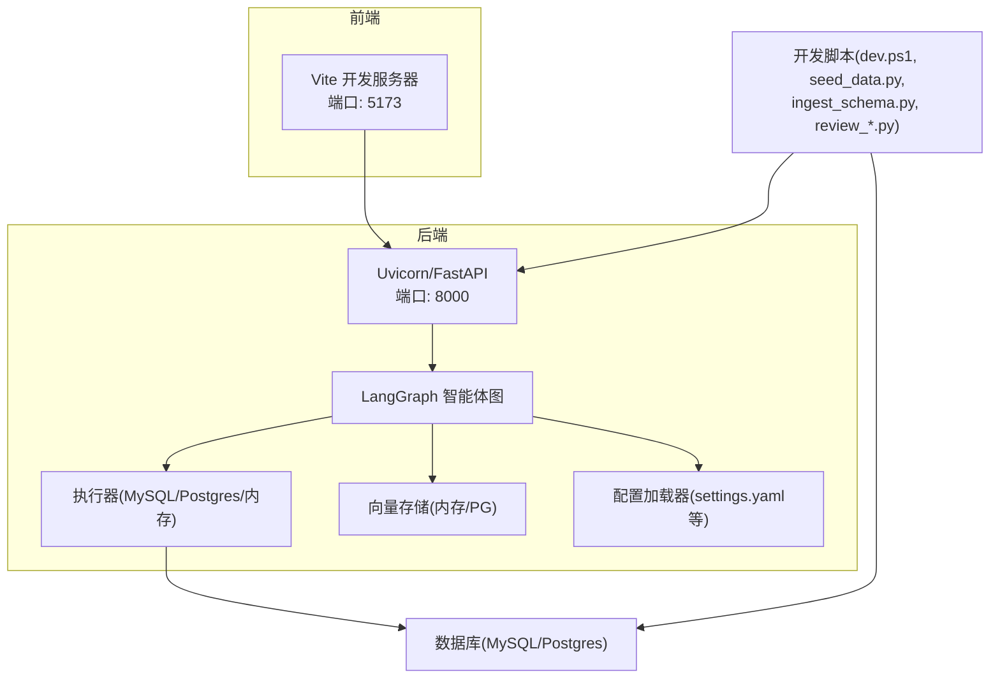
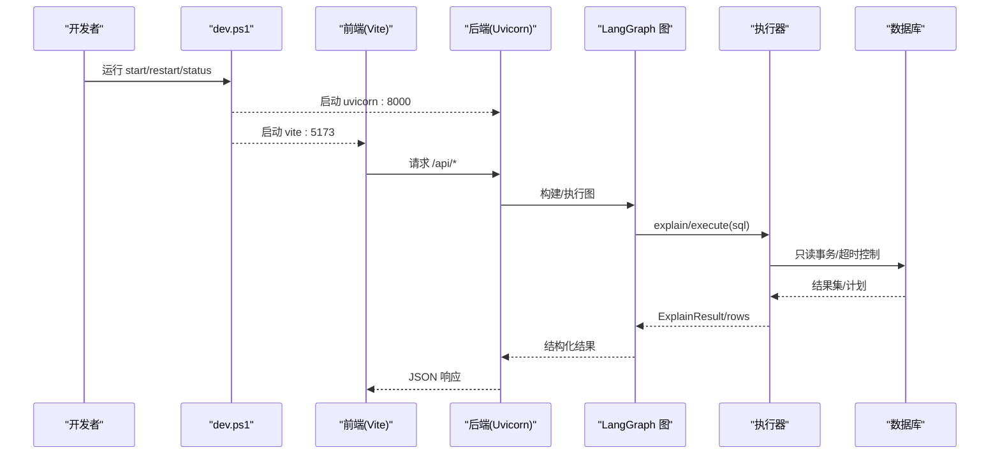
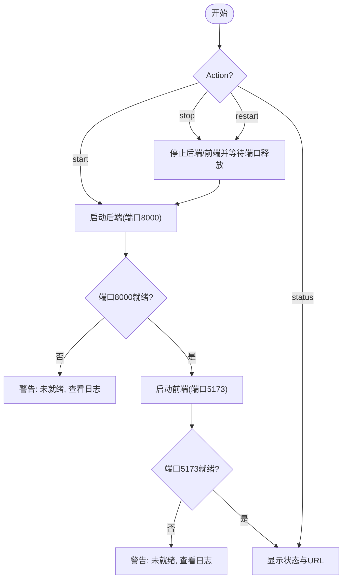
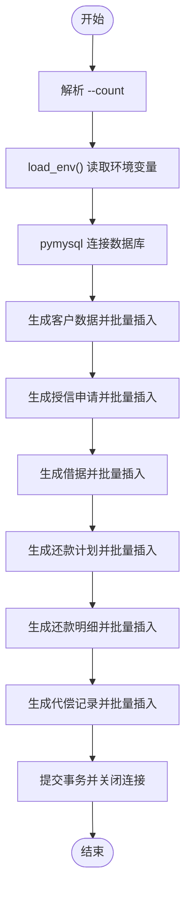
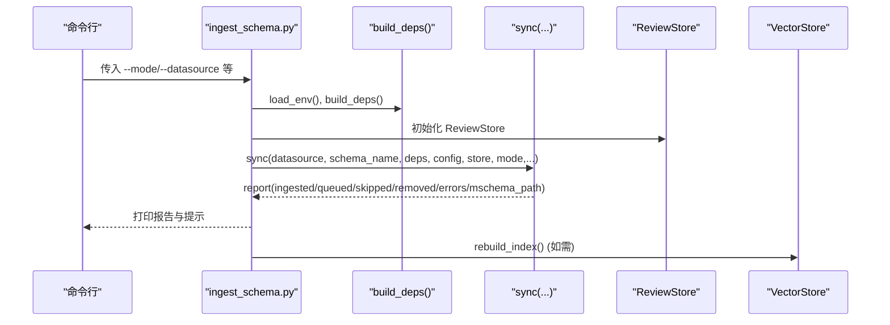
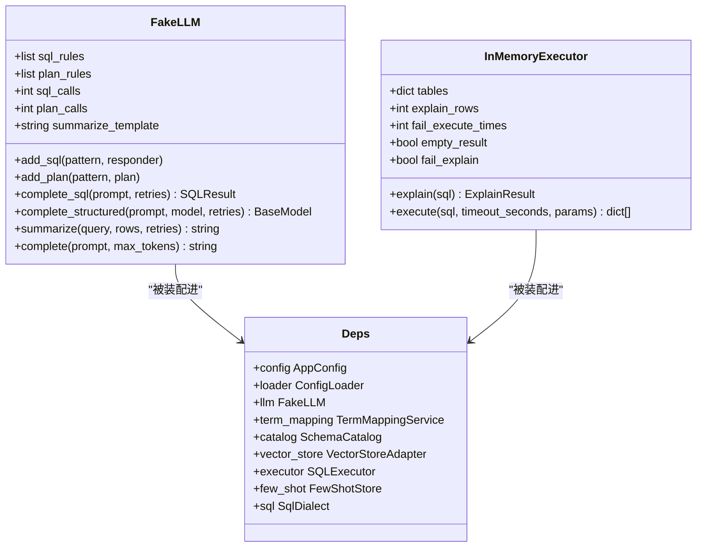
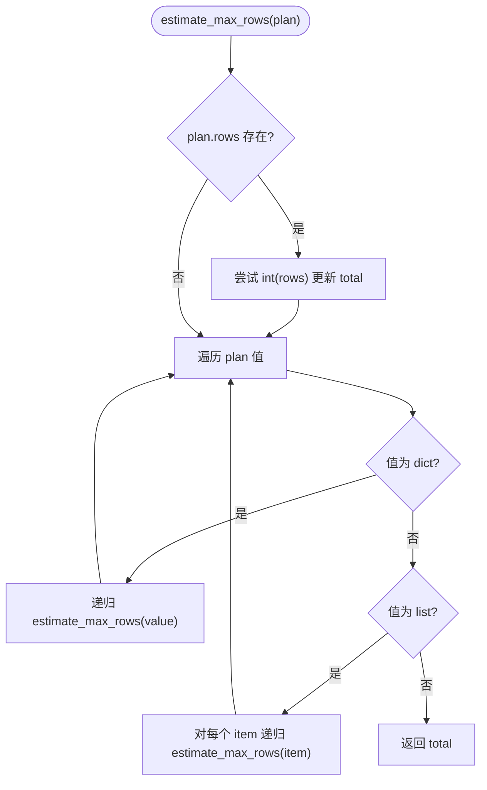
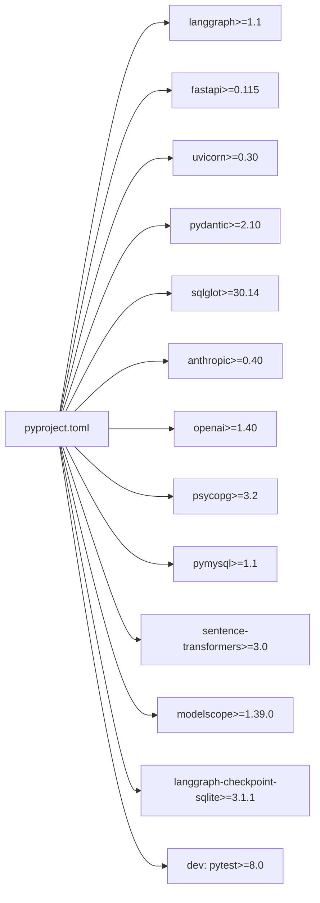

# 开发工具

<cite>
**本文引用的文件**   
- [scripts/dev.ps1](file://scripts/dev.ps1)
- [restart.bat](file://restart.bat)
- [scripts/seed_data.py](file://scripts/seed_data.py)
- [scripts/import_schema_from_db.py](file://scripts/import_schema_from_db.py)
- [scripts/ingest_schema.py](file://scripts/ingest_schema.py)
- [scripts/review_schema_comments.py](file://scripts/review_schema_comments.py)
- [nl2sql_agent/testing.py](file://nl2sql_agent/testing.py)
- [nl2sql_agent/tests/conftest.py](file://nl2sql_agent/tests/conftest.py)
- [nl2sql_agent/services/executor.py](file://nl2sql_agent/services/executor.py)
- [pyproject.toml](file://pyproject.toml)
- [main.py](file://main.py)
</cite>

## 目录
1. [简介](#简介)
2. [项目结构](#项目结构)
3. [核心组件](#核心组件)
4. [架构总览](#架构总览)
5. [详细组件分析](#详细组件分析)
6. [依赖关系分析](#依赖关系分析)
7. [性能与优化建议](#性能与优化建议)
8. [故障排查指南](#故障排查指南)
9. [结论](#结论)
10. [附录：常用命令速查](#附录常用命令速查)

## 简介
本文件面向开发者，系统化说明 NL2SQL 项目的开发工具链与高效实践，包括：
- 开发脚本使用：一键启停、重启、状态查看（dev.ps1）
- 种子数据生成：快速构造业务样例数据（seed_data.py）
- Schema 导入工具：从数据库导入并构建向量索引（ingest_schema.py），以及旧版兼容入口（import_schema_from_db.py）
- 测试框架：FakeLLM 模拟、InMemoryExecutor 测试、断言方法与夹具（conftest.py）
- 调试技巧：日志定位、断点调试、性能分析
- 代码质量：静态检查、覆盖率、依赖扫描
- 热重载与快速迭代：前后端分离下的本地开发流程
- 常用命令与快捷方式
- 故障排查与诊断方法

## 项目结构
本项目采用前后端分离与模块化服务设计：
- 后端 FastAPI + Uvicorn 提供 API，LangGraph 驱动智能体节点
- 前端 Vite + React 提供交互界面
- 脚本层提供开发期工具（启动、数据、Schema 同步、审核）
- 测试层基于 pytest，使用隔离配置与双打（FakeLLM、InMemoryExecutor）

图表来源
- [scripts/dev.ps1:1-134](file://scripts/dev.ps1#L1-L134)
- [pyproject.toml:1-44](file://pyproject.toml#L1-L44)

章节来源
- [scripts/dev.ps1:1-134](file://scripts/dev.ps1#L1-L134)
- [pyproject.toml:1-44](file://pyproject.toml#L1-L44)

## 核心组件
- 开发环境管理脚本 dev.ps1：统一启动/停止/重启/状态查询，自动等待端口监听与释放，输出日志到 logs 目录
- 种子数据脚本 seed_data.py：按业务表结构生成约千行真实感数据，支持重复运行且避免主键冲突
- Schema 导入工具 ingest_schema.py：全量/增量模式，生成 M-Schema，投影 schema_catalog.yaml，构建向量索引；review 队列用于人工审核注释
- 旧版导入 import_schema_from_db.py：已弃用，提示改用 ingest_schema.py
- 测试基础设施 testing.py：FakeLLM、InMemoryExecutor、build_test_deps 装配 Deps
- 测试夹具 conftest.py：隔离配置目录、注入 deps/graph 夹具
- 执行器 executor.py：PostgresExecutor、MySQLExecutor、InMemoryExecutor 及 EXPLAIN 行数估算

章节来源
- [scripts/dev.ps1:1-134](file://scripts/dev.ps1#L1-L134)
- [scripts/seed_data.py:1-271](file://scripts/seed_data.py#L1-L271)
- [scripts/ingest_schema.py:1-67](file://scripts/ingest_schema.py#L1-L67)
- [scripts/import_schema_from_db.py:1-44](file://scripts/import_schema_from_db.py#L1-L44)
- [nl2sql_agent/testing.py:1-187](file://nl2sql_agent/testing.py#L1-L187)
- [nl2sql_agent/tests/conftest.py:1-76](file://nl2sql_agent/tests/conftest.py#L1-L76)
- [nl2sql_agent/services/executor.py:1-205](file://nl2sql_agent/services/executor.py#L1-L205)

## 架构总览
下图展示开发期关键调用链：dev.ps1 启动后端与前端，前端通过 HTTP 访问后端 API；后端由 LangGraph 编排节点，调用执行器访问数据库，并使用向量存储进行检索。

图表来源
- [scripts/dev.ps1:56-88](file://scripts/dev.ps1#L56-L88)
- [nl2sql_agent/services/executor.py:148-158](file://nl2sql_agent/services/executor.py#L148-L158)

## 详细组件分析

### 开发脚本 dev.ps1（一键启停/重启/状态）
- 功能要点
  - 参数化 Action：start/stop/restart/status
  - 端口管理：后端 8000、前端 5173，自动检测占用与释放
  - 进程启动：uv run uvicorn 启动后端；npm run dev 启动前端
  - 日志输出：logs/backend.log、backend.err.log、frontend.log、frontend.err.log
  - 健康检查：Wait-PortUp/Wait-PortFree 确保端口就绪或释放
- 使用方式
  - 启动：powershell -File scripts/dev.ps1 start
  - 停止：powershell -File scripts/dev.ps1 stop
  - 重启：powershell -File scripts/dev.ps1 restart
  - 状态：powershell -File scripts/dev.ps1 status
  - 双击入口：项目根目录 restart.bat

图表来源
- [scripts/dev.ps1:14-17](file://scripts/dev.ps1#L14-L17)
- [scripts/dev.ps1:56-88](file://scripts/dev.ps1#L56-L88)
- [scripts/dev.ps1:90-109](file://scripts/dev.ps1#L90-L109)

章节来源
- [scripts/dev.ps1:1-134](file://scripts/dev.ps1#L1-L134)
- [restart.bat:1-10](file://restart.bat#L1-L10)

### 种子数据生成 seed_data.py
- 目标：向 6 张业务表插入约 1000 条合成数据，覆盖 2025-03 ~ 2026-08 时间范围，便于按月查询
- 特性
  - 可重复运行：LOAN_NO/CUST_ID 带时间戳前缀，避免冲突
  - 字段生成：姓名、证件号、手机号、日期、金额、平台等
  - 关联逻辑：客户 → 授信申请/借据；借据 → 还款计划/明细；逾期借据 → 代偿
- 使用方法
  - uv run python scripts/seed_data.py [--count 1000]
  - 依赖 DATABASE_URL 环境变量解析连接信息

图表来源
- [scripts/seed_data.py:66-70](file://scripts/seed_data.py#L66-L70)
- [scripts/seed_data.py:72-77](file://scripts/seed_data.py#L72-L77)
- [scripts/seed_data.py:89-266](file://scripts/seed_data.py#L89-L266)

章节来源
- [scripts/seed_data.py:1-271](file://scripts/seed_data.py#L1-L271)

### Schema 导入工具
- ingest_schema.py（推荐）
  - 模式：full/incremental
  - 行为：先生成扩展版 M-Schema，再投影 schema_catalog.yaml；对注释不足条目进入审核队列
  - 参数：--mode、--datasource、--schema-name、--business-line、--review-db
  - 输出：入库数量、待审核数、跳过数、删除数、错误列表、M-Schema 路径与快照 ID
- import_schema_from_db.py（已弃用）
  - 直接查询 INFORMATION_SCHEMA，标注敏感字段，写入 schema_catalog.yaml，重建 embedding 索引
  - 提示改用 ingest_schema.py --mode full

图表来源
- [scripts/ingest_schema.py:31-54](file://scripts/ingest_schema.py#L31-L54)
- [scripts/import_schema_from_db.py:27-39](file://scripts/import_schema_from_db.py#L27-L39)

章节来源
- [scripts/ingest_schema.py:1-67](file://scripts/ingest_schema.py#L1-L67)
- [scripts/import_schema_from_db.py:1-44](file://scripts/import_schema_from_db.py#L1-L44)

### 测试框架与断言
- FakeLLM
  - 按 prompt 正则匹配返回 SQLResult 或结构化 plan
  - 支持 summarize、complete_structured、complete_sql
  - 默认规则基于 dwd_ar_loan_info 表，便于验收测试
- InMemoryExecutor
  - 按 SQL 中第一张表名返回预置 FAKE_TABLES
  - 支持 explain_rows、fail_execute_times、empty_result、fail_explain 等开关
- 夹具与隔离
  - conftest.py 创建隔离配置目录，覆盖 schema_catalog.yaml，注入 deps 与 graph 夹具
  - build_test_deps 装配 Deps，包含 TermMappingService、SchemaCatalog、InMemoryVectorStore(fake_embedding)、FewShotStore、SqlDialect

图表来源
- [nl2sql_agent/testing.py:26-66](file://nl2sql_agent/testing.py#L26-L66)
- [nl2sql_agent/testing.py:78-85](file://nl2sql_agent/testing.py#L78-L85)
- [nl2sql_agent/testing.py:148-187](file://nl2sql_agent/testing.py#L148-L187)
- [nl2sql_agent/services/executor.py:161-205](file://nl2sql_agent/services/executor.py#L161-L205)

章节来源
- [nl2sql_agent/testing.py:1-187](file://nl2sql_agent/testing.py#L1-L187)
- [nl2sql_agent/tests/conftest.py:1-76](file://nl2sql_agent/tests/conftest.py#L1-L76)
- [nl2sql_agent/services/executor.py:1-205](file://nl2sql_agent/services/executor.py#L1-L205)

### 执行器与 EXPLAIN 行数估算
- PostgresExecutor：只读账号 + READ ONLY 事务 + statement_timeout
- MySQLExecutor：START TRANSACTION READ ONLY + MAX_EXECUTION_TIME + EXPLAIN FORMAT=JSON
- InMemoryExecutor：测试/演示用，按表返回预置行，支持模拟失败与空结果
- estimate_max_rows：递归遍历 EXPLAIN JSON 计划，取最大 rows 估值

图表来源
- [nl2sql_agent/services/executor.py:31-50](file://nl2sql_agent/services/executor.py#L31-L50)

章节来源
- [nl2sql_agent/services/executor.py:53-158](file://nl2sql_agent/services/executor.py#L53-L158)
- [nl2sql_agent/services/executor.py:161-205](file://nl2sql_agent/services/executor.py#L161-L205)

## 依赖关系分析
- 运行时依赖：FastAPI、Uvicorn、Pydantic、SQLGlot、Anthropic/OpenAI、psycopg/pymysql、sentence-transformers、modelscope、langgraph-checkpoint-sqlite
- 开发依赖：pytest（可选 dev 组）
- 包管理与索引：hatchling、uv 索引指向清华源

图表来源
- [pyproject.toml:1-44](file://pyproject.toml#L1-L44)

章节来源
- [pyproject.toml:1-44](file://pyproject.toml#L1-L44)

## 性能与优化建议
- 执行器层面
  - 使用只读事务与语句级超时，避免长查询阻塞
  - 利用 EXPLAIN 预估行数，结合阈值拒绝高风险查询
- 向量检索
  - 测试阶段使用确定性 fake_embedding，避免下载模型，提升可复现性
- 数据生成
  - 批量插入减少网络往返，合理设置 count 平衡数据规模与导入耗时
- 前端开发
  - Vite 热重载即时生效，缩短反馈周期

[本节为通用指导，不直接分析具体文件]

## 故障排查指南
- 端口占用与启动失败
  - 使用 dev.ps1 status 查看端口占用情况
  - 若启动后未监听端口，查看 logs/backend.log 与 logs/frontend.err.log
- 数据库连接问题
  - 确认 DATABASE_URL 格式正确（MySQL/Postgres）
  - 检查用户权限与网络连通性
- Schema 导入异常
  - 使用 ingest_schema.py 的 report.errors 输出定位错误
  - 审核队列：review_schema_comments.py list/show/approve/reject
- 测试失败
  - 检查 conftest.py 隔离配置是否生效
  - 调整 InMemoryExecutor 的 explain_rows/fail_execute_times 以验证边界场景
- 性能瓶颈
  - 关注 EXPLAIN 预估行数与 MAX_EXECUTION_TIME/timeout_seconds
  - 评估向量库重建频率与样本大小

章节来源
- [scripts/dev.ps1:90-109](file://scripts/dev.ps1#L90-L109)
- [scripts/ingest_schema.py:51-63](file://scripts/ingest_schema.py#L51-L63)
- [scripts/review_schema_comments.py:35-92](file://scripts/review_schema_comments.py#L35-L92)
- [nl2sql_agent/tests/conftest.py:46-56](file://nl2sql_agent/tests/conftest.py#L46-L56)
- [nl2sql_agent/services/executor.py:137-158](file://nl2sql_agent/services/executor.py#L137-L158)

## 结论
通过 dev.ps1、seed_data.py、ingest_schema.py 与完善的测试基础设施，开发者可在本地快速搭建端到端环境，完成数据准备、Schema 同步、接口联调与回归测试。遵循只读执行、超时控制与 EXPLAIN 预估策略，可有效保障系统稳定性与安全性。配合 pytest 隔离夹具与 FakeLLM/InMemoryExecutor，可实现高内聚、低耦合的可测架构。

[本节为总结性内容，不直接分析具体文件]

## 附录：常用命令速查
- 启动/停止/重启/状态
  - powershell -File scripts/dev.ps1 start
  - powershell -File scripts/dev.ps1 stop
  - powershell -File scripts/dev.ps1 restart
  - powershell -File scripts/dev.ps1 status
  - 双击入口：restart.bat
- 种子数据
  - uv run python scripts/seed_data.py [--count 1000]
- Schema 导入
  - uv run python scripts/ingest_schema.py --mode full --datasource nl2sql
  - uv run python scripts/ingest_schema.py --mode incremental --datasource nl2sql
  - 旧版（已弃用）：uv run python scripts/import_schema_from_db.py
- 审核注释
  - uv run python scripts/review_schema_comments.py list --status pending
  - uv run python scripts/review_schema_comments.py show --id <id>
  - uv run python scripts/review_schema_comments.py approve --id <id> [--edit "..."]
  - uv run python scripts/review_schema_comments.py reject --id <id> --reason "..."
- 运行测试
  - uv run pytest nl2sql_agent/tests -q

章节来源
- [scripts/dev.ps1:14-17](file://scripts/dev.ps1#L14-L17)
- [scripts/seed_data.py:66-69](file://scripts/seed_data.py#L66-L69)
- [scripts/ingest_schema.py:31-38](file://scripts/ingest_schema.py#L31-L38)
- [scripts/import_schema_from_db.py:27-34](file://scripts/import_schema_from_db.py#L27-L34)
- [scripts/review_schema_comments.py:35-56](file://scripts/review_schema_comments.py#L35-L56)
- [pyproject.toml:41-44](file://pyproject.toml#L41-L44)