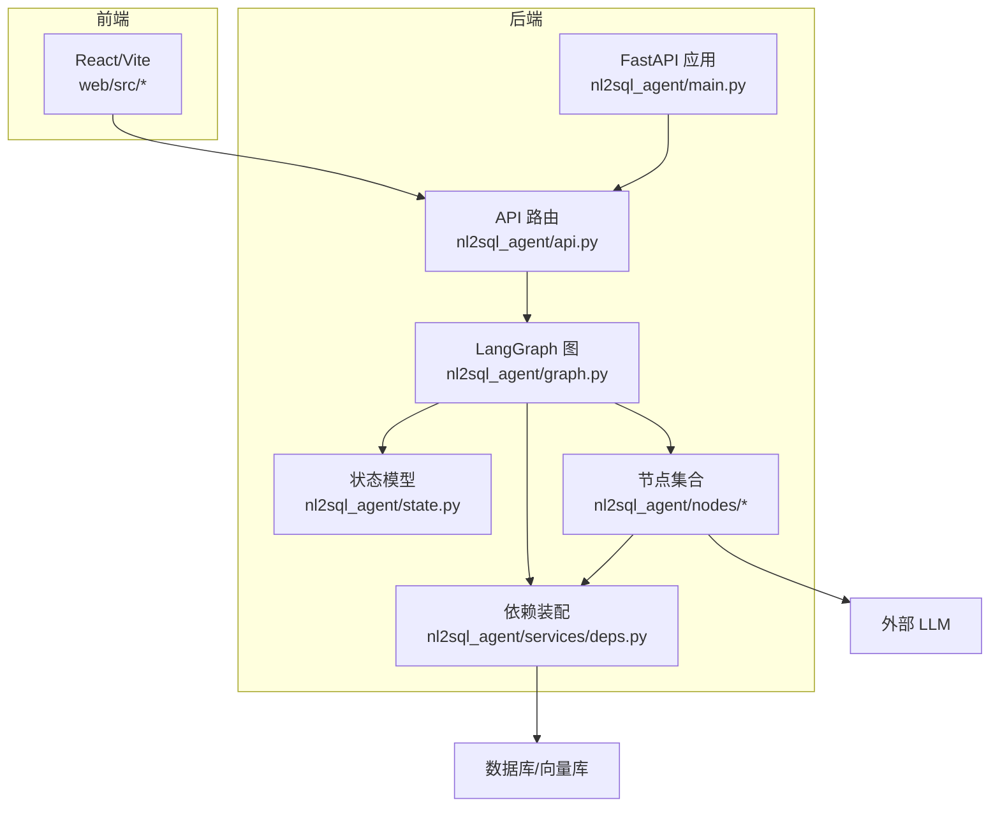
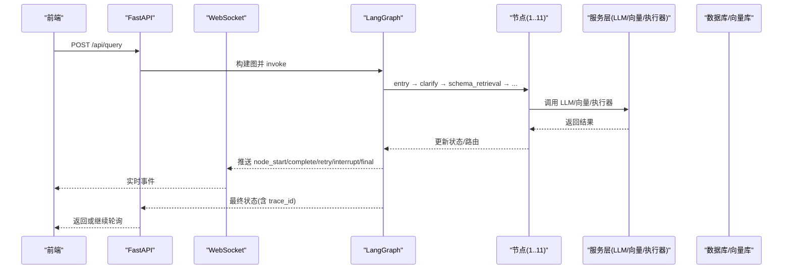
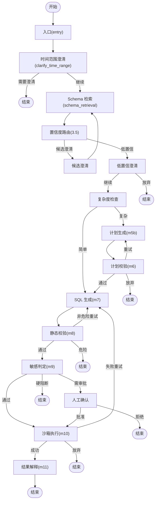
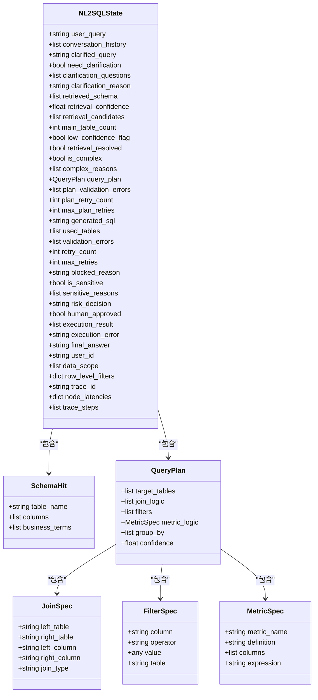
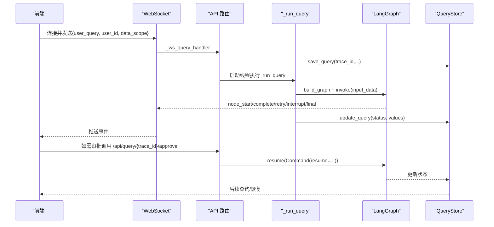
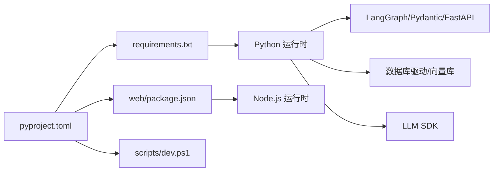

# 开发指南

<cite>
**本文引用的文件**   
- [pyproject.toml](file://pyproject.toml)
- [requirements.txt](file://requirements.txt)
- [main.py](file://main.py)
- [nl2sql_agent/main.py](file://nl2sql_agent/main.py)
- [nl2sql_agent/api.py](file://nl2sql_agent/api.py)
- [nl2sql_agent/graph.py](file://nl2sql_agent/graph.py)
- [nl2sql_agent/state.py](file://nl2sql_agent/state.py)
- [nl2sql_agent/services/deps.py](file://nl2sql_agent/services/deps.py)
- [nl2sql_agent/nodes/m1_entry.py](file://nl2sql_agent/nodes/m1_entry.py)
- [nl2sql_agent/nodes/m7_sql_generation.py](file://nl2sql_agent/nodes/m7_sql_generation.py)
- [web/package.json](file://web/package.json)
- [scripts/dev.ps1](file://scripts/dev.ps1)
- [.gitignore](file://.gitignore)
- [NL2SQL.md](file://NL2SQL.md)
</cite>

## 目录
1. [简介](#简介)
2. [项目结构](#项目结构)
3. [核心组件](#核心组件)
4. [架构总览](#架构总览)
5. [详细组件分析](#详细组件分析)
6. [依赖关系分析](#依赖关系分析)
7. [性能与可观测性](#性能与可观测性)
8. [开发与调试环境搭建](#开发与调试环境搭建)
9. [代码规范与最佳实践](#代码规范与最佳实践)
10. [扩展开发指南](#扩展开发指南)
11. [版本管理与发布规范](#版本管理与发布规范)
12. [常见问题与故障排查](#常见问题与故障排查)
13. [结论](#结论)

## 简介
本指南面向 NL2SQL 智能体项目的开发者，覆盖从环境搭建、模块职责、架构设计到扩展开发、版本管理、自动化脚本与效率技巧的全流程。项目基于 LangGraph 编排多节点工作流，结合 LLM、向量检索、静态校验与沙箱执行，提供自然语言转 SQL 的端到端能力，并内置人工确认、权限控制与审计追踪等生产级特性。

## 项目结构
- nl2sql_agent: Python 后端核心包
  - nodes: 工作流节点（m1~m11）
  - services: 服务层（配置加载、LLM、向量存储、执行器、术语映射、Schema 目录等）
  - graph.py: LangGraph 图构建与路由
  - state.py: 全局状态模型定义
  - main.py / api.py: FastAPI 入口与 API/WS 路由
- web: React + Vite 前端
- scripts: 开发辅助脚本（Windows PowerShell）
- sql: 示例表结构 SQL
- 根目录: 项目元数据与依赖声明

**图表来源** 
- [nl2sql_agent/main.py:1-152](file://nl2sql_agent/main.py#L1-L152)
- [nl2sql_agent/api.py:1-573](file://nl2sql_agent/api.py#L1-L573)
- [nl2sql_agent/graph.py:1-313](file://nl2sql_agent/graph.py#L1-L313)
- [nl2sql_agent/state.py:1-146](file://nl2sql_agent/state.py#L1-L146)
- [nl2sql_agent/services/deps.py:1-178](file://nl2sql_agent/services/deps.py#L1-L178)

**章节来源**
- [pyproject.toml:1-44](file://pyproject.toml#L1-L44)
- [requirements.txt:1-15](file://requirements.txt#L1-L15)
- [web/package.json:1-26](file://web/package.json#L1-L26)

## 核心组件
- 状态模型 NL2SQLState: 定义查询生命周期中的全部字段，包括用户输入、检索结果、计划、SQL、校验错误、敏感判定、执行结果、权限与追踪信息。
- 依赖装配 Deps/AppConfig: 集中读取配置、初始化 LLM、向量存储、执行器、术语映射、SQL 方言等。
- 工作流图 build_graph: 将 11 个节点按规则连接，定义两条重试回路边界，支持中断恢复与事件推送。
- API 层: REST + WebSocket，统一处理查询提交、审批、历史、审计、反馈与配置管理。
- 节点实现: 如 m1_entry（入口校验）、m7_sql_generation（SQL 生成）等。

**章节来源**
- [nl2sql_agent/state.py:1-146](file://nl2sql_agent/state.py#L1-L146)
- [nl2sql_agent/services/deps.py:1-178](file://nl2sql_agent/services/deps.py#L1-L178)
- [nl2sql_agent/graph.py:1-313](file://nl2sql_agent/graph.py#L1-L313)
- [nl2sql_agent/api.py:1-573](file://nl2sql_agent/api.py#L1-L573)
- [nl2sql_agent/nodes/m1_entry.py:1-28](file://nl2sql_agent/nodes/m1_entry.py#L1-L28)
- [nl2sql_agent/nodes/m7_sql_generation.py:1-113](file://nl2sql_agent/nodes/m7_sql_generation.py#L1-L113)

## 架构总览
系统采用“前端 + FastAPI + LangGraph 编排”的分层架构：
- 前端通过 REST/WS 与后端交互；
- FastAPI 负责请求接入、鉴权、持久化与事件桥接；
- LangGraph 驱动 11 个节点的顺序与条件分支，支持中断恢复；
- 各节点调用服务层（LLM、向量库、执行器、术语映射、Schema 目录）完成具体任务；
- 所有运行态状态通过 Checkpointer 持久化，支持断线重连与恢复。

**图表来源** 
- [nl2sql_agent/api.py:134-211](file://nl2sql_agent/api.py#L134-L211)
- [nl2sql_agent/graph.py:174-312](file://nl2sql_agent/graph.py#L174-L312)
- [nl2sql_agent/main.py:83-146](file://nl2sql_agent/main.py#L83-L146)

## 详细组件分析

### 工作流图与路由
- 入口节点 entry 校验 user_id/data_scope/user_query，生成 trace_id。
- 澄清节点 clarify_time_range 判断是否需要补充时间范围等信息。
- Schema 检索后进入置信度路由，必要时进行候选/低置信澄清。
- 复杂度检查决定简单路径或直接生成 SQL，复杂路径走计划生成与校验。
- SQL 生成后进行静态校验（语法/危险操作/字段幻觉），失败回退至 SQL 生成（上限）。
- 敏感判定可能触发人工确认，拒绝则结束，通过则沙箱执行。
- 执行成功进入结果解释，失败回退至 SQL 生成（上限）。

**图表来源** 
- [nl2sql_agent/graph.py:174-312](file://nl2sql_agent/graph.py#L174-L312)

**章节来源**
- [nl2sql_agent/graph.py:1-313](file://nl2sql_agent/graph.py#L1-L313)
- [NL2SQL.md:28-66](file://NL2SQL.md#L28-L66)

### 状态模型 NL2SQLState
- 关键字段涵盖用户输入、澄清、检索、计划、SQL、校验、敏感、执行、权限与追踪。
- 使用 Pydantic 强类型约束，确保序列化与 checkpoint 兼容。

**图表来源** 
- [nl2sql_agent/state.py:14-146](file://nl2sql_agent/state.py#L14-L146)

**章节来源**
- [nl2sql_agent/state.py:1-146](file://nl2sql_agent/state.py#L1-L146)

### API 与事件流
- REST 接口：/api/query、/api/query/{trace_id}、/api/query/{trace_id}/approve、/api/history、/api/audit/{trace_id}、/api/feedback 等。
- WebSocket：/ws/query 流式推送 node_start/complete/retry/interrupt/final/error/done。
- 事件桥接 EventStream：线程内 emit → asyncio 队列 → WS 发送。
- 持久化：QueryStore 保存查询历史、审计、反馈与审核队列。

**图表来源** 
- [nl2sql_agent/api.py:134-211](file://nl2sql_agent/api.py#L134-L211)
- [nl2sql_agent/api.py:280-353](file://nl2sql_agent/api.py#L280-L353)

**章节来源**
- [nl2sql_agent/api.py:1-573](file://nl2sql_agent/api.py#L1-L573)

### 依赖装配与配置
- AppConfig: dialect、top_k、执行限制、超时、行级过滤、各类规则。
- Deps: 聚合 loader、llm/sql_llm、term_mapping、catalog、vector_store、executor、few_shot、sql。
- build_deps: 从 settings.yaml/.env 读取数据库 URL、方言、规则，选择向量存储后端（内存/pgvector），构造执行器。

**章节来源**
- [nl2sql_agent/services/deps.py:1-178](file://nl2sql_agent/services/deps.py#L1-L178)

### 关键节点实现要点
- m1_entry: 校验必填字段，规范化 user_query，生成 trace_id。
- m7_sql_generation: 根据是否有计划构建不同 prompt，调用 SQL 专用模型或主模型，输出 SQL 与 used_tables，清理上一轮错误。

**章节来源**
- [nl2sql_agent/nodes/m1_entry.py:1-28](file://nl2sql_agent/nodes/m1_entry.py#L1-L28)
- [nl2sql_agent/nodes/m7_sql_generation.py:1-113](file://nl2sql_agent/nodes/m7_sql_generation.py#L1-L113)

## 依赖关系分析
- 后端依赖：langgraph、pydantic、sqlglot、anthropic/openai、fastapi/uvicorn、sentence-transformers、modelscope、sqlite checkpoint、数据库驱动等。
- 前端依赖：React、Ant Design、Vite、TypeScript。
- 构建系统：hatchling，测试：pytest。

**图表来源** 
- [pyproject.toml:1-44](file://pyproject.toml#L1-L44)
- [requirements.txt:1-15](file://requirements.txt#L1-L15)
- [web/package.json:1-26](file://web/package.json#L1-L26)

**章节来源**
- [pyproject.toml:1-44](file://pyproject.toml#L1-L44)
- [requirements.txt:1-15](file://requirements.txt#L1-L15)
- [web/package.json:1-26](file://web/package.json#L1-L26)

## 性能与可观测性
- 节点延迟与步骤追踪：每个节点包装 _traced，记录 node_latencies 与 trace_steps。
- 事件推送：node_start/complete/retry/interrupt/final/error/done，便于前端实时展示与调试。
- Checkpoint：SQLite 持久化状态，支持断线重连与恢复。
- 执行限制：LIMIT、EXPLAIN 阈值、超时熔断，避免大扫描与长时间阻塞。

**章节来源**
- [nl2sql_agent/graph.py:88-126](file://nl2sql_agent/graph.py#L88-L126)
- [nl2sql_agent/api.py:54-66](file://nl2sql_agent/api.py#L54-L66)
- [nl2sql_agent/api.py:134-157](file://nl2sql_agent/api.py#L134-L157)

## 开发与调试环境搭建
- Python 环境
  - 要求 Python >= 3.11，推荐使用 uv 或 venv。
  - 安装依赖：pyproject.toml 与 requirements.txt 中声明。
  - 环境变量：.env 中设置 ANTHROPIC_API_KEY、ANTHROPIC_MODEL、DATABASE_URL 等。
- 前端环境
  - Node.js + npm，进入 web 目录执行 dev/build/preview。
- IDE 与调试
  - 推荐 VS Code，启用 Python 与 TypeScript 插件。
  - 后端调试：直接运行 nl2sql_agent/main.py 或使用 uvicorn。
  - 前端调试：vite dev，浏览器打开 http://localhost:5173。
- 一键启停
  - Windows 使用 scripts/dev.ps1 start/stop/restart/status。
  - 日志输出到 logs/backend.log、logs/frontend.log 等。

**章节来源**
- [pyproject.toml:1-44](file://pyproject.toml#L1-L44)
- [requirements.txt:1-15](file://requirements.txt#L1-L15)
- [scripts/dev.ps1:1-134](file://scripts/dev.ps1#L1-L134)
- [web/package.json:1-26](file://web/package.json#L1-L26)
- [.gitignore:1-26](file://.gitignore#L1-L26)

## 代码规范与最佳实践
- 命名约定
  - 模块与函数使用小写下划线，类名使用帕斯卡命名。
  - 节点文件以 mX_前缀标识阶段（如 m1_entry.py、m7_sql_generation.py）。
- 文件组织
  - nodes 下按阶段拆分，services 下按功能拆分，config 下 YAML 配置。
  - 状态模型集中在 state.py，依赖装配在 deps.py。
- 注释规范
  - 模块级 docstring 说明职责与用法；关键逻辑添加行内注释。
  - 对外 API 提供清晰参数与返回值说明。
- 代码审查流程
  - 提交前运行 pytest；变更涉及节点或路由需补充测试用例。
  - 评审关注：状态字段一致性、重试边界、安全校验、错误处理。

[本节为通用指导，不直接分析具体文件]

## 扩展开发指南
- 自定义节点开发
  - 在 nodes 目录下新增 mXX_xxx.py，实现 make_xxx_node(deps) 工厂函数，返回接受 NL2SQLState 的节点函数。
  - 在 graph.py 中注册节点与边，定义路由与重试边界。
- 插件开发
  - 通过 Deps 注入扩展点（feedback_sink、semantic_cache），在节点中按需消费。
- API 扩展
  - 在 api.py 中添加新的 Router 路由，遵循现有事件与持久化模式。
- 系统集成
  - 通过 build_executor_from_url 支持新数据库类型；通过 build_vector_store 切换向量后端。
  - 调整 AppConfig 与 settings.yaml 以适配新行为。

**章节来源**
- [nl2sql_agent/graph.py:174-312](file://nl2sql_agent/graph.py#L174-L312)
- [nl2sql_agent/services/deps.py:72-104](file://nl2sql_agent/services/deps.py#L72-L104)
- [nl2sql_agent/api.py:394-447](file://nl2sql_agent/api.py#L394-L447)

## 版本管理与发布规范
- 版本管理
  - pyproject.toml 中维护 name/version/description 与 requires-python。
  - 依赖版本使用 >= 指定最低版本，保持兼容性。
- 分支策略
  - 建议主干分支稳定，功能分支按 feature/fix/hotfix 划分。
  - 提交信息遵循语义化版本规范。
- 发布规范
  - 打包使用 hatchling，wheel 目标指向 nl2sql_agent。
  - 发布前运行完整测试与 lint，更新 changelog。

**章节来源**
- [pyproject.toml:1-44](file://pyproject.toml#L1-L44)

## 常见问题与故障排查
- 端口占用
  - 使用 scripts/dev.ps1 status 查看端口占用；stop 后等待端口释放再 restart。
- 数据库连接失败
  - 检查 .env 或 settings.yaml 中 DATABASE_URL；确认驱动已安装。
- LLM 调用失败
  - 检查 ANTHROPIC_API_KEY/ANTHROPIC_MODEL；确认网络可达。
- 向量库未配置
  - vector_store.yaml 中 backend=pgvector 时需设置 pgvector.url。
- 执行超时或大扫描
  - 调整 execution_timeout_seconds 与 explain_row_threshold；检查 SQL 是否命中索引。
- 前端无法连接后端
  - 确认 CORS 配置允许 localhost:5173；检查后端 /docs 是否正常。

**章节来源**
- [scripts/dev.ps1:1-134](file://scripts/dev.ps1#L1-L134)
- [nl2sql_agent/services/deps.py:107-178](file://nl2sql_agent/services/deps.py#L107-L178)
- [nl2sql_agent/main.py:48-55](file://nl2sql_agent/main.py#L48-L55)

## 结论
本指南系统化梳理了 NL2SQL 智能体的架构、模块职责、开发环境与扩展方法。通过严格的狀態模型、清晰的图路由与完善的事件追踪，项目在准确性、安全性与可观测性方面具备生产可用性。建议开发者遵循本文规范，逐步扩展节点与服务，持续优化检索与校验链路，提升整体准确率与稳定性。