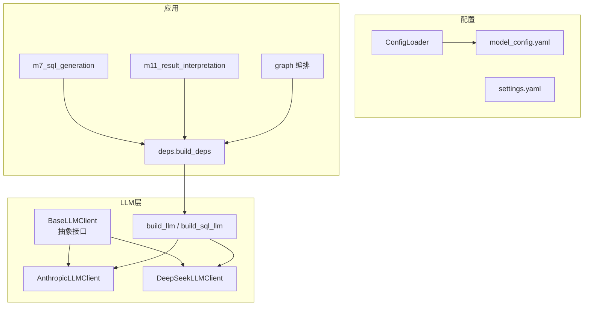
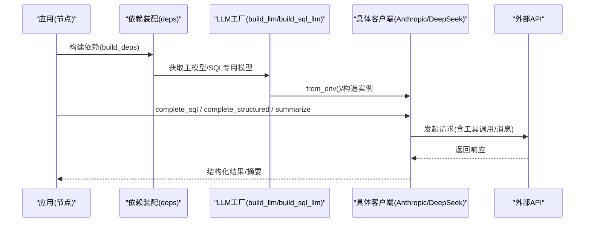
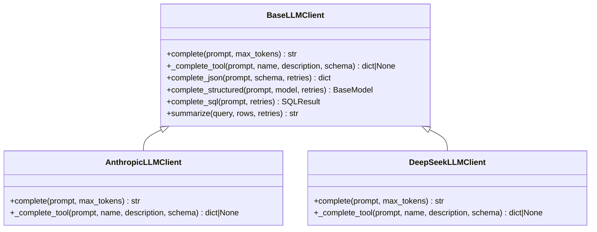
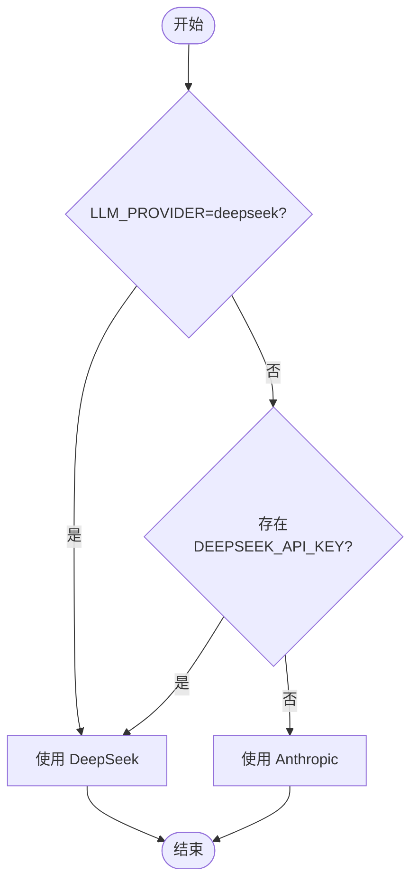
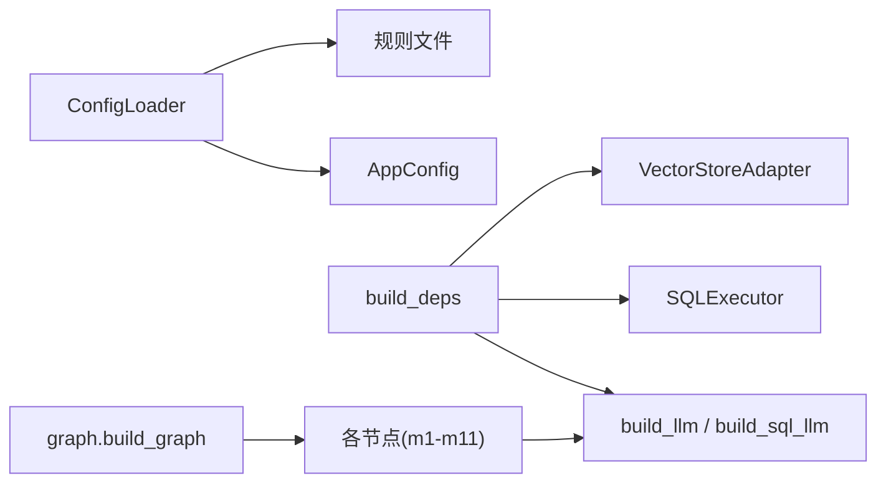

# LLM Provider插件

<cite>
**本文引用的文件**   
- [nl2sql_agent/services/llm.py](file://nl2sql_agent/services/llm.py)
- [nl2sql_agent/config/model_config.yaml](file://nl2sql_agent/config/model_config.yaml)
- [nl2sql_agent/services/config_loader.py](file://nl2sql_agent/services/config_loader.py)
- [nl2sql_agent/tests/test_llm.py](file://nl2sql_agent/tests/test_llm.py)
- [nl2sql_agent/testing.py](file://nl2sql_agent/testing.py)
- [nl2sql_agent/services/deps.py](file://nl2sql_agent/services/deps.py)
- [nl2sql_agent/nodes/m7_sql_generation.py](file://nl2sql_agent/nodes/m7_sql_generation.py)
- [nl2sql_agent/nodes/m11_result_interpretation.py](file://nl2sql_agent/nodes/m11_result_interpretation.py)
- [nl2sql_agent/graph.py](file://nl2sql_agent/graph.py)
- [nl2sql_agent/config/settings.yaml](file://nl2sql_agent/config/settings.yaml)
</cite>

## 目录
1. [简介](#简介)
2. [项目结构](#项目结构)
3. [核心组件](#核心组件)
4. [架构总览](#架构总览)
5. [详细组件分析](#详细组件分析)
6. [依赖关系分析](#依赖关系分析)
7. [性能与监控](#性能与监控)
8. [故障排查指南](#故障排查指南)
9. [结论](#结论)
10. [附录](#附录)

## 简介
本文件面向“LLM Provider插件”开发，系统性说明抽象接口、多模型支持机制、Prompt工程实践、主流服务集成方式以及性能监控与错误处理策略。代码层面以 BaseLLMClient 抽象类为核心，提供 complete_sql、complete_structured、summarize 等统一能力；通过环境变量与配置文件实现动态切换与按节点选择模型；在 SQL 生成与结果解释等关键节点中落地使用。

## 项目结构
围绕 LLM Provider 的关键位置如下：
- 抽象与实现：nl2sql_agent/services/llm.py
- 配置加载：nl2sql_agent/services/config_loader.py、nl2sql_agent/config/model_config.yaml
- 依赖装配：nl2sql_agent/services/deps.py
- 节点调用：nl2sql_agent/nodes/m7_sql_generation.py、nl2sql_agent/nodes/m11_result_interpretation.py
- 测试与双打：nl2sql_agent/tests/test_llm.py、nl2sql_agent/testing.py
- 流程编排与重试：nl2sql_agent/graph.py
- 运行参数：nl2sql_agent/config/settings.yaml

图表来源
- [nl2sql_agent/services/llm.py:70-160](file://nl2sql_agent/services/llm.py#L70-L160)
- [nl2sql_agent/services/deps.py:113-184](file://nl2sql_agent/services/deps.py#L113-L184)
- [nl2sql_agent/nodes/m7_sql_generation.py:94-113](file://nl2sql_agent/nodes/m7_sql_generation.py#L94-L113)
- [nl2sql_agent/nodes/m11_result_interpretation.py:25-39](file://nl2sql_agent/nodes/m11_result_interpretation.py#L25-L39)
- [nl2sql_agent/graph.py:174-313](file://nl2sql_agent/graph.py#L174-L313)

章节来源
- [nl2sql_agent/services/llm.py:1-328](file://nl2sql_agent/services/llm.py#L1-L328)
- [nl2sql_agent/services/config_loader.py:1-36](file://nl2sql_agent/services/config_loader.py#L1-L36)
- [nl2sql_agent/config/model_config.yaml:1-18](file://nl2sql_agent/config/model_config.yaml#L1-L18)
- [nl2sql_agent/services/deps.py:1-184](file://nl2sql_agent/services/deps.py#L1-L184)
- [nl2sql_agent/nodes/m7_sql_generation.py:1-113](file://nl2sql_agent/nodes/m7_sql_generation.py#L1-L113)
- [nl2sql_agent/nodes/m11_result_interpretation.py:1-39](file://nl2sql_agent/nodes/m11_result_interpretation.py#L1-L39)
- [nl2sql_agent/graph.py:1-313](file://nl2sql_agent/graph.py#L1-L313)
- [nl2sql_agent/config/settings.yaml:1-30](file://nl2sql_agent/config/settings.yaml#L1-L30)

## 核心组件
- BaseLLMClient 抽象类
  - 定义统一接口：complete（纯文本）、_complete_tool（工具调用结构化输出）
  - 提供通用方法：complete_json、complete_structured、complete_sql、summarize
  - 结构化输出优先走 function calling，失败回退到纯文本解析并带重试
- 具体实现
  - AnthropicLLMClient：基于 Messages API，支持 tool_use
  - DeepSeekLLMClient：OpenAI 兼容接口，thinking 模式不支持 tool_choice，统一走纯文本路径
- 工厂与路由
  - build_llm：按环境变量选择 provider（deepseek 优先或默认 anthropic）
  - build_sql_llm：可选的 SQL 专用模型（独立端点或同 provider 的不同 model）
  - get_model_for_node：按 nodes.<node_key> 配置为离线任务选便宜模型

章节来源
- [nl2sql_agent/services/llm.py:70-160](file://nl2sql_agent/services/llm.py#L70-L160)
- [nl2sql_agent/services/llm.py:162-243](file://nl2sql_agent/services/llm.py#L162-L243)
- [nl2sql_agent/services/llm.py:254-328](file://nl2sql_agent/services/llm.py#L254-L328)

## 架构总览
下图展示从应用层到 LLM Provider 的调用链路与配置注入方式。

图表来源
- [nl2sql_agent/services/deps.py:113-184](file://nl2sql_agent/services/deps.py#L113-L184)
- [nl2sql_agent/services/llm.py:280-328](file://nl2sql_agent/services/llm.py#L280-L328)
- [nl2sql_agent/nodes/m7_sql_generation.py:94-113](file://nl2sql_agent/nodes/m7_sql_generation.py#L94-L113)
- [nl2sql_agent/nodes/m11_result_interpretation.py:25-39](file://nl2sql_agent/nodes/m11_result_interpretation.py#L25-L39)

## 详细组件分析

### BaseLLMClient 抽象类与实现
- 抽象接口
  - complete(prompt, max_tokens) → str
  - _complete_tool(prompt, name, description, schema) → dict|None
- 通用方法
  - complete_json：优先 function calling，失败回退到纯文本 + extract_json，校验必填字段与“回显schema”问题，支持 retries
  - complete_structured：将 JSON 转为 Pydantic 实例
  - complete_sql：强制输出 {sql, used_tables} 的结构化结果
  - summarize：对查询结果进行中文摘要，限制行数避免过长
- 具体客户端
  - AnthropicLLMClient：messages.create，tool_use 提取 input
  - DeepSeekLLMClient：chat.completions.create，thinking 模式不支持 tool_choice，直接走纯文本路径

图表来源
- [nl2sql_agent/services/llm.py:70-160](file://nl2sql_agent/services/llm.py#L70-L160)
- [nl2sql_agent/services/llm.py:162-243](file://nl2sql_agent/services/llm.py#L162-L243)

章节来源
- [nl2sql_agent/services/llm.py:70-160](file://nl2sql_agent/services/llm.py#L70-L160)
- [nl2sql_agent/services/llm.py:162-243](file://nl2sql_agent/services/llm.py#L162-L243)

### 多模型支持与动态切换
- 选择规则
  - LLM_PROVIDER=deepseek → DeepSeek；否则若存在 DEEPSEEK_API_KEY → DeepSeek；否则 Anthropic
  - 所有 model 名从环境变量读取，禁止硬编码
- 工厂函数
  - build_llm：主模型（计划生成、结果解释等思考类任务）
  - build_sql_llm：SQL 专用模型（可指向任意 OpenAI 兼容端点，如千问/DashScope），未配置则回退主模型
- 节点级模型选择
  - get_model_for_node：读取 config/model_config.yaml 的 nodes.<node_key>，为离线任务分配更便宜的模型

图表来源
- [nl2sql_agent/services/llm.py:275-283](file://nl2sql_agent/services/llm.py#L275-L283)
- [nl2sql_agent/services/llm.py:285-328](file://nl2sql_agent/services/llm.py#L285-L328)
- [nl2sql_agent/config/model_config.yaml:13-18](file://nl2sql_agent/config/model_config.yaml#L13-L18)

章节来源
- [nl2sql_agent/services/llm.py:275-328](file://nl2sql_agent/services/llm.py#L275-L328)
- [nl2sql_agent/config/model_config.yaml:1-18](file://nl2sql_agent/config/model_config.yaml#L1-L18)

### Prompt 工程最佳实践
- 提示词模板
  - SQL 生成：明确只允许 SELECT、仅使用检索到的表与字段、同时输出 used_tables 并与实际引用一致
  - 结构化输出：强调“只输出一个 JSON 对象”，禁止 markdown 代码块与解释，限定必填字段
  - 结果摘要：要求简洁中文摘要，保留关键数字与单位，不编造数据
- 参数调优
  - max_tokens：控制输出长度（如 summarize 限制 500）
  - retries：结构化输出失败时的重试次数
- 结果解析
  - extract_json：容忍前后废话与 markdown 代码块，严格匹配第一个完整 JSON 对象
  - 校验“回显 schema”问题：当模型输出包含 schema 结构特征但缺失目标字段时视为无效并重试

章节来源
- [nl2sql_agent/nodes/m7_sql_generation.py:31-91](file://nl2sql_agent/nodes/m7_sql_generation.py#L31-L91)
- [nl2sql_agent/services/llm.py:37-68](file://nl2sql_agent/services/llm.py#L37-L68)
- [nl2sql_agent/services/llm.py:82-129](file://nl2sql_agent/services/llm.py#L82-L129)
- [nl2sql_agent/nodes/m11_result_interpretation.py:14-22](file://nl2sql_agent/nodes/m11_result_interpretation.py#L14-L22)

### 主流 LLM 服务集成示例
- Anthropic
  - 通过 messages.create 发送 user 消息，支持 tool_use 结构化输出
  - 环境变量：ANTHROPIC_API_KEY、ANTHROPIC_MODEL
- DeepSeek（OpenAI 兼容）
  - 通过 chat.completions.create 发送消息，thinking 模式不支持 tool_choice，统一走纯文本路径
  - 环境变量：DEEPSEEK_API_KEY、DEEPSEEK_MODEL、DEEPSEEK_BASE_URL（可覆盖默认端点）
- 本地模型部署
  - 可通过 build_sql_llm 指定 SQL 专用端点（如千问/DashScope 的 OpenAI 兼容接口）
  - 也可通过 get_model_for_node 为特定节点配置低成本模型

章节来源
- [nl2sql_agent/services/llm.py:162-203](file://nl2sql_agent/services/llm.py#L162-L203)
- [nl2sql_agent/services/llm.py:205-243](file://nl2sql_agent/services/llm.py#L205-L243)
- [nl2sql_agent/services/llm.py:285-328](file://nl2sql_agent/services/llm.py#L285-L328)

### 节点中的 LLM 使用
- SQL 生成（模块7）
  - 根据是否有查询计划构建不同 prompt
  - 优先使用 deps.sql_llm，未配置则回退 deps.llm
  - 调用 complete_sql 得到 SQL 与 used_tables
- 结果解释（模块11）
  - 调用 deps.llm.summarize 生成自然语言摘要
  - 若 LLM 不可用或结果为空，降级为确定性摘要

章节来源
- [nl2sql_agent/nodes/m7_sql_generation.py:94-113](file://nl2sql_agent/nodes/m7_sql_generation.py#L94-L113)
- [nl2sql_agent/nodes/m11_result_interpretation.py:25-39](file://nl2sql_agent/nodes/m11_result_interpretation.py#L25-L39)

### 测试与双打（FakeLLM）
- FakeLLM：用于单元测试与回归测试，按 prompt 正则匹配返回脚本化的 SQL/计划
- 测试用例覆盖：provider 选择、DeepSeek 客户端、结构化输出解析、extract_json 鲁棒性

章节来源
- [nl2sql_agent/testing.py:26-66](file://nl2sql_agent/testing.py#L26-L66)
- [nl2sql_agent/tests/test_llm.py:1-166](file://nl2sql_agent/tests/test_llm.py#L1-L166)

## 依赖关系分析
- 配置加载
  - ConfigLoader：YAML 热更新（mtime 比对），避免重启服务
- 依赖装配
  - build_deps：加载 settings.yaml 与规则文件，构建 AppConfig、TermMappingService、SchemaCatalog、SqlDialect、VectorStore、Executor、FewShotStore
  - 注入 llm 与 sql_llm：默认通过 build_llm/build_sql_llm 获取
- 流程编排
  - graph：LangGraph 状态图，定义节点与路由，封装事件推送与延迟统计

图表来源
- [nl2sql_agent/services/config_loader.py:14-36](file://nl2sql_agent/services/config_loader.py#L14-L36)
- [nl2sql_agent/services/deps.py:113-184](file://nl2sql_agent/services/deps.py#L113-L184)
- [nl2sql_agent/graph.py:174-313](file://nl2sql_agent/graph.py#L174-L313)

章节来源
- [nl2sql_agent/services/config_loader.py:1-36](file://nl2sql_agent/services/config_loader.py#L1-L36)
- [nl2sql_agent/services/deps.py:1-184](file://nl2sql_agent/services/deps.py#L1-L184)
- [nl2sql_agent/graph.py:1-313](file://nl2sql_agent/graph.py#L1-L313)

## 性能与监控
- 节点延迟追踪
  - graph._traced：记录每个节点的耗时，写入 state.node_latencies，并通过 event_sink 推送 node_start/node_complete
- 重试与回退
  - graph._retry_route：在 retry 分支推送 attempt 与 reason，便于前端展示与诊断
- 执行保护
  - settings.execution：read_only、limit、timeout_seconds、explain_row_threshold，防止长尾与危险操作
- 向量存储缓存
  - InMemoryVectorStore：基于 cache_signature 区分不同 embedding 配置，减少重复计算

章节来源
- [nl2sql_agent/graph.py:88-126](file://nl2sql_agent/graph.py#L88-L126)
- [nl2sql_agent/config/settings.yaml:18-23](file://nl2sql_agent/config/settings.yaml#L18-L23)

## 故障排查指南
- 常见错误
  - EnvConfigError：缺少必要环境变量（如 DEEPSEEK_API_KEY、DEEPSEEK_MODEL、ANTHROPIC_MODEL）
  - ValueError：LLM 输出无 JSON 或不完整；结构化输出多次解析失败
- 定位步骤
  - 检查环境变量是否设置正确
  - 查看节点日志与 event_sink 事件（node_start/node_complete/retry）
  - 确认 model_config.yaml 的 nodes.<node_key> 配置是否生效
  - 验证 extract_json 是否能从模型输出中提取有效 JSON
- 降级策略
  - m11 结果解释：LLM 异常时回退确定性摘要
  - complete_json：function calling 失败时回退纯文本解析并重试

章节来源
- [nl2sql_agent/services/llm.py:27-28](file://nl2sql_agent/services/llm.py#L27-L28)
- [nl2sql_agent/services/llm.py:37-68](file://nl2sql_agent/services/llm.py#L37-L68)
- [nl2sql_agent/services/llm.py:82-129](file://nl2sql_agent/services/llm.py#L82-L129)
- [nl2sql_agent/nodes/m11_result_interpretation.py:25-39](file://nl2sql_agent/nodes/m11_result_interpretation.py#L25-L39)

## 结论
本项目通过 BaseLLMClient 抽象出统一的 LLM 调用接口，结合环境变量与 YAML 配置实现了灵活的 provider 选择与节点级模型定制。结构化输出采用“工具调用优先 + 纯文本兜底 + 重试校验”的策略，提升了稳定性。在 SQL 生成与结果解释等关键节点中，Prompt 工程强调约束与可解析性，配合 graph 的事件追踪与重试机制，形成完整的可观测性与容错体系。

## 附录
- 环境变量清单
  - 主模型：LLM_PROVIDER、DEEPSEEK_API_KEY、DEEPSEEK_MODEL、DEEPSEEK_BASE_URL、ANTHROPIC_API_KEY、ANTHROPIC_MODEL
  - SQL 专用模型：SQL_MODEL、SQL_API_KEY、SQL_BASE_URL、DEEPSEEK_SQL_MODEL、ANTHROPIC_SQL_MODEL
- 配置项
  - model_config.yaml：embedding 与 nodes.<node_key>.model
  - settings.yaml：dialect、database_url、execution.*、row_level_filter

章节来源
- [nl2sql_agent/services/llm.py:275-328](file://nl2sql_agent/services/llm.py#L275-L328)
- [nl2sql_agent/config/model_config.yaml:1-18](file://nl2sql_agent/config/model_config.yaml#L1-L18)
- [nl2sql_agent/config/settings.yaml:1-30](file://nl2sql_agent/config/settings.yaml#L1-L30)