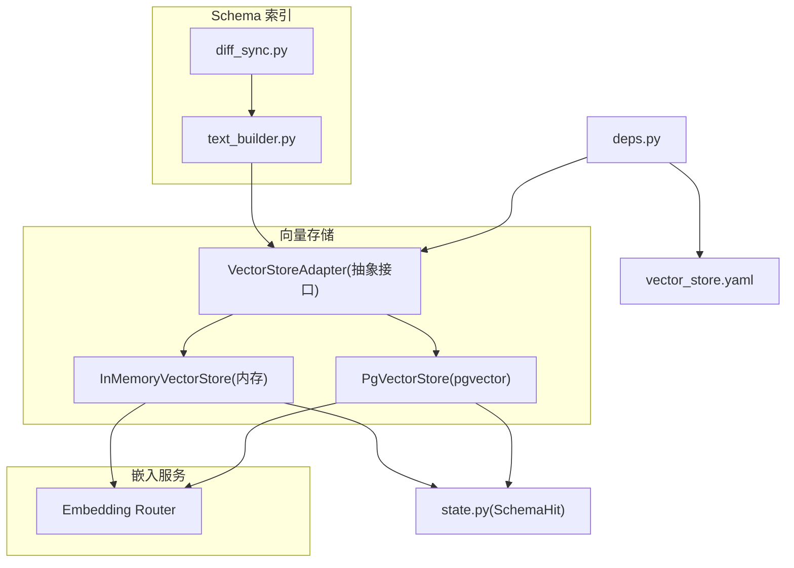
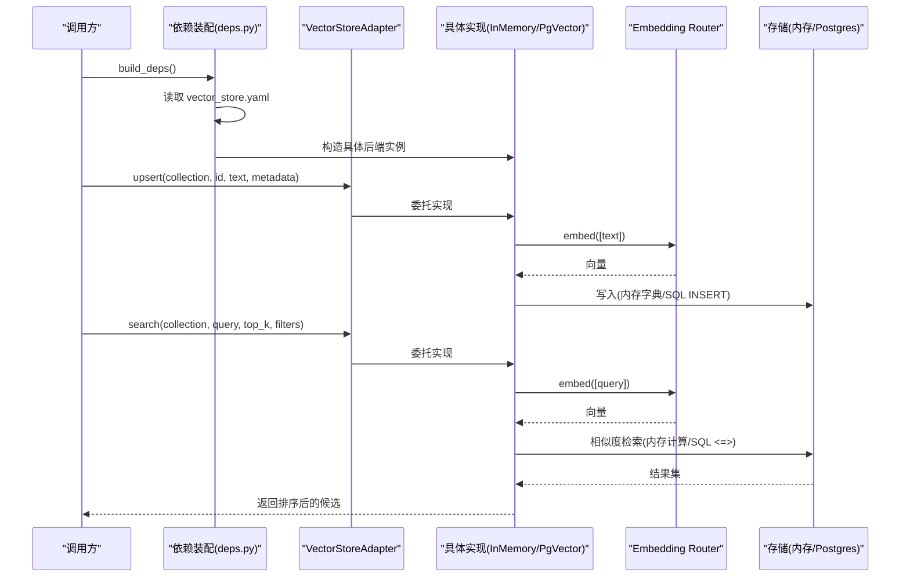
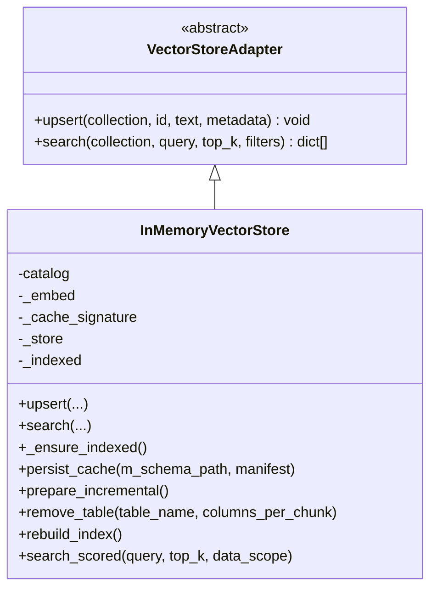
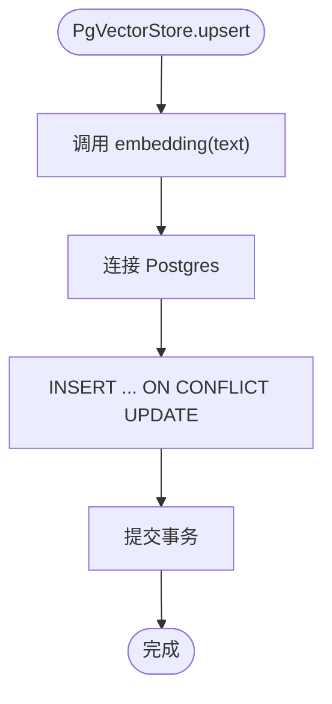
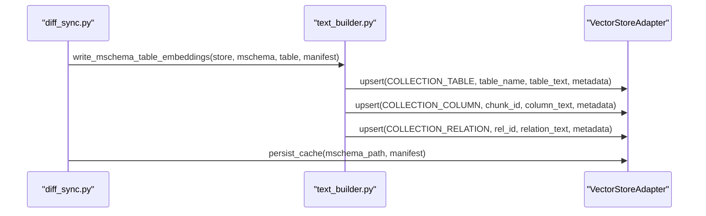
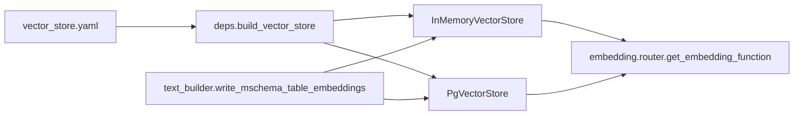

# 向量存储插件

<cite>
**本文引用的文件**
- [base.py](file://nl2sql_agent/services/vector_store/base.py)
- [memory.py](file://nl2sql_agent/services/vector_store/memory.py)
- [pg.py](file://nl2sql_agent/services/vector_store/pg.py)
- [deps.py](file://nl2sql_agent/services/deps.py)
- [vector_store.yaml](file://nl2sql_agent/config/vector_store.yaml)
- [model_config.yaml](file://nl2sql_agent/config/model_config.yaml)
- [router.py](file://nl2sql_agent/services/embedding/router.py)
- [text_builder.py](file://nl2sql_agent/services/schema_ingest/text_builder.py)
- [diff_sync.py](file://nl2sql_agent/services/schema_ingest/diff_sync.py)
- [state.py](file://nl2sql_agent/state.py)
- [test_vector_store.py](file://nl2sql_agent/tests/test_vector_store.py)
</cite>

## 目录
1. [简介](#简介)
2. [项目结构](#项目结构)
3. [核心组件](#核心组件)
4. [架构总览](#架构总览)
5. [详细组件分析](#详细组件分析)
6. [依赖关系分析](#依赖关系分析)
7. [性能与索引优化](#性能与索引优化)
8. [故障排查指南](#故障排查指南)
9. [结论](#结论)
10. [附录：新后端集成示例](#附录新后端集成示例)

## 简介
本文件面向“向量存储插件”的开发与使用，系统性说明统一抽象接口 VectorStoreAdapter、内存与 pgvector 两种后端的实现差异、索引构建与查询流程、配置与装配方式，以及监控指标与故障恢复机制。文档同时提供新增存储后端的集成步骤与最佳实践，帮助读者快速扩展新的向量存储后端并保证与现有系统无缝对接。

## 项目结构
向量存储相关代码位于 services/vector_store 包内，包含统一接口与两个具体实现；嵌入生成由 services/embedding/router.py 提供；索引构建与增量同步由 services/schema_ingest 下的 text_builder.py 与 diff_sync.py 负责；后端选择通过 config/vector_store.yaml 显式配置；依赖装配在 services/deps.py 中完成。

图表来源
- [base.py:11-21](file://nl2sql_agent/services/vector_store/base.py#L11-L21)
- [memory.py:21-53](file://nl2sql_agent/services/vector_store/memory.py#L21-L53)
- [pg.py:15-65](file://nl2sql_agent/services/vector_store/pg.py#L15-L65)
- [router.py:34-61](file://nl2sql_agent/services/embedding/router.py#L34-L61)
- [text_builder.py:103-172](file://nl2sql_agent/services/schema_ingest/text_builder.py#L103-L172)
- [diff_sync.py:296-316](file://nl2sql_agent/services/schema_ingest/diff_sync.py#L296-L316)
- [deps.py:87-111](file://nl2sql_agent/services/deps.py#L87-L111)
- [state.py:14-20](file://nl2sql_agent/state.py#L14-L20)

章节来源
- [deps.py:87-111](file://nl2sql_agent/services/deps.py#L87-L111)
- [vector_store.yaml:1-6](file://nl2sql_agent/config/vector_store.yaml#L1-L6)

## 核心组件
- VectorStoreAdapter：定义统一的 upsert、search 方法，屏蔽不同后端差异。
- InMemoryVectorStore：基于内存字典的向量存储，支持余弦相似度检索、过滤、缓存持久化与重建索引。
- PgVectorStore：基于 PostgreSQL + pgvector 的向量存储，支持 upsert、SQL 语义检索、建表与重建索引。
- Embedding Router：统一 embedding 函数入口，支持本地模型与测试 fake 模式。
- Schema 索引构建：text_builder.py 将 M-Schema 转换为表级/字段级/关系级文本并写入向量存储；diff_sync.py 负责增量同步与快照持久化。

章节来源
- [base.py:11-21](file://nl2sql_agent/services/vector_store/base.py#L11-L21)
- [memory.py:21-53](file://nl2sql_agent/services/vector_store/memory.py#L21-L53)
- [pg.py:15-65](file://nl2sql_agent/services/vector_store/pg.py#L15-L65)
- [router.py:34-61](file://nl2sql_agent/services/embedding/router.py#L34-L61)
- [text_builder.py:103-172](file://nl2sql_agent/services/schema_ingest/text_builder.py#L103-L172)
- [diff_sync.py:296-316](file://nl2sql_agent/services/schema_ingest/diff_sync.py#L296-L316)

## 架构总览
向量存储插件采用“适配器+可插拔后端”的设计：上层通过 VectorStoreAdapter 调用 upsert/search，底层根据 vector_store.yaml 的 backend 配置动态选择 InMemoryVectorStore 或 PgVectorStore。嵌入生成由 embedding router 统一提供，确保不同后端共享一致的向量维度与归一化策略。Schema 索引构建模块将结构化元数据转化为文本描述，批量写入向量存储，并通过 diff_sync 实现增量更新与失败重试。

图表来源
- [deps.py:87-111](file://nl2sql_agent/services/deps.py#L87-L111)
- [base.py:11-21](file://nl2sql_agent/services/vector_store/base.py#L11-L21)
- [memory.py:35-53](file://nl2sql_agent/services/vector_store/memory.py#L35-L53)
- [pg.py:32-65](file://nl2sql_agent/services/vector_store/pg.py#L32-L65)
- [router.py:34-61](file://nl2sql_agent/services/embedding/router.py#L34-L61)

## 详细组件分析

### VectorStoreAdapter 抽象接口
- upsert(collection, id, text, metadata)：写入一条记录，embedding 由内部统一 embedding 函数生成。
- search(collection, query, top_k, filters)：语义相似度检索，返回按分数降序的前 top_k 条结果，score ∈ [0,1]。

章节来源
- [base.py:11-21](file://nl2sql_agent/services/vector_store/base.py#L11-L21)

### InMemoryVectorStore（内存存储）
- 数据结构：collection -> {id: {embedding, text, metadata}}。
- upsert：对文本进行 embedding，存入内存字典。
- search：对查询文本 embedding，遍历候选项应用过滤器，计算余弦相似度并排序返回。
- 索引管理：_ensure_indexed 懒加载，优先从 effective M-Schema 构建；支持缓存持久化与重启恢复；rebuild_index 全量重建；remove_table 清理单表相关条目。
- schema 层方法：search_scored 用于模块 3/3.5 的业务线范围检索。

图表来源
- [base.py:11-21](file://nl2sql_agent/services/vector_store/base.py#L11-L21)
- [memory.py:21-53](file://nl2sql_agent/services/vector_store/memory.py#L21-L53)
- [memory.py:69-100](file://nl2sql_agent/services/vector_store/memory.py#L69-L100)
- [memory.py:121-138](file://nl2sql_agent/services/vector_store/memory.py#L121-L138)
- [memory.py:139-171](file://nl2sql_agent/services/vector_store/memory.py#L139-L171)
- [memory.py:172-197](file://nl2sql_agent/services/vector_store/memory.py#L172-L197)

章节来源
- [memory.py:21-53](file://nl2sql_agent/services/vector_store/memory.py#L21-L53)
- [memory.py:69-100](file://nl2sql_agent/services/vector_store/memory.py#L69-L100)
- [memory.py:121-138](file://nl2sql_agent/services/vector_store/memory.py#L121-L138)
- [memory.py:139-171](file://nl2sql_agent/services/vector_store/memory.py#L139-L171)
- [memory.py:172-197](file://nl2sql_agent/services/vector_store/memory.py#L172-L197)

### PgVectorStore（pgvector 存储）
- 连接与建表：延迟导入 psycopg，自动创建 schema_embeddings 表，维度来自 model_config.yaml 的 embedding.dimension。
- upsert：embedding 后以 ON CONFLICT 更新，metadata 以 JSON 存储。
- search：使用 pgvector 的 <=> 算子进行余弦距离检索，结合 business_line 过滤，返回 score。
- rebuild_index：清空目标 collection 后从 effective M-Schema 重建；remove_table 删除表级/字段级/关系级条目。
- search_scored：按 catalog 提供的表名列表进行 SQL 检索并映射为 SchemaHit。

图表来源
- [pg.py:32-44](file://nl2sql_agent/services/vector_store/pg.py#L32-L44)
- [pg.py:69-79](file://nl2sql_agent/services/vector_store/pg.py#L69-L79)
- [model_config.yaml:1-18](file://nl2sql_agent/config/model_config.yaml#L1-L18)

章节来源
- [pg.py:15-65](file://nl2sql_agent/services/vector_store/pg.py#L15-L65)
- [pg.py:69-118](file://nl2sql_agent/services/vector_store/pg.py#L69-L118)
- [pg.py:139-174](file://nl2sql_agent/services/vector_store/pg.py#L139-L174)

### 嵌入生成路由（Embedding Router）
- provider=local：使用 sentence-transformers，支持本地路径或远程下载；输出归一化向量。
- provider=fake：确定性词袋向量，仅测试用。
- dimension：由 model_config.yaml 的 embedding.dimension 指定，pgvector 建表时据此创建 vector(dim)。

章节来源
- [router.py:34-61](file://nl2sql_agent/services/embedding/router.py#L34-L61)
- [model_config.yaml:1-18](file://nl2sql_agent/config/model_config.yaml#L1-L18)

### Schema 索引构建与增量同步
- text_builder.py：从 effective M-Schema 构建表级/字段级/关系级文本，写入对应 collection；支持按列分组分块写入。
- diff_sync.py：增量同步时逐表写入向量，失败记录错误并继续；成功后持久化缓存；维护 snapshot_id 与 semantic_hash 保证一致性。

图表来源
- [text_builder.py:103-172](file://nl2sql_agent/services/schema_ingest/text_builder.py#L103-L172)
- [diff_sync.py:296-316](file://nl2sql_agent/services/schema_ingest/diff_sync.py#L296-L316)

章节来源
- [text_builder.py:103-172](file://nl2sql_agent/services/schema_ingest/text_builder.py#L103-L172)
- [diff_sync.py:296-316](file://nl2sql_agent/services/schema_ingest/diff_sync.py#L296-L316)

### 状态与检索结果
- SchemaHit：表示一次 Schema 检索命中，包含表名、列定义与业务术语。
- search_scored：返回 (SchemaHit, score) 列表，供模块 3/3.5 判定置信度与候选。

章节来源
- [state.py:14-20](file://nl2sql_agent/state.py#L14-L20)
- [memory.py:172-197](file://nl2sql_agent/services/vector_store/memory.py#L172-L197)
- [pg.py:139-174](file://nl2sql_agent/services/vector_store/pg.py#L139-L174)

## 依赖关系分析
- 后端选择：deps.py 中的 build_vector_store 读取 vector_store.yaml 的 backend，选择 InMemoryVectorStore 或 PgVectorStore。
- 嵌入依赖：两个后端均依赖 embedding router 提供的统一 embed 函数。
- Schema 依赖：索引构建依赖 catalog 的 effective M-Schema 与 manifest，确保语义哈希一致。

图表来源
- [deps.py:87-111](file://nl2sql_agent/services/deps.py#L87-L111)
- [vector_store.yaml:1-6](file://nl2sql_agent/config/vector_store.yaml#L1-L6)
- [router.py:34-61](file://nl2sql_agent/services/embedding/router.py#L34-L61)
- [text_builder.py:103-172](file://nl2sql_agent/services/schema_ingest/text_builder.py#L103-L172)

章节来源
- [deps.py:87-111](file://nl2sql_agent/services/deps.py#L87-L111)
- [vector_store.yaml:1-6](file://nl2sql_agent/config/vector_store.yaml#L1-L6)

## 性能与索引优化
- 索引算法选择
  - 内存存储：当前使用线性扫描 + 余弦相似度，适合小规模数据与开发调试；可通过预计算与缓存提升性能。
  - pgvector：利用数据库原生向量索引（如 IVFFlat/HNSW），在高并发与大体量下具备更好吞吐与延迟表现。
- 参数调优
  - embedding.dimension：需与模型输出维度一致，避免类型不匹配导致建表失败或检索异常。
  - columns_per_chunk：控制字段级分块大小，平衡写入批处理效率与查询粒度。
  - top_k：限制返回数量，减少网络与序列化开销。
- 查询性能优化
  - 使用 business_line 等元数据进行精确过滤，缩小候选集。
  - 在 pgvector 中启用合适的索引类型与参数（如 lists、probes），依据数据分布与查询负载调整。
  - 对高频查询进行结果缓存（可在上层实现）。
- 重建与增量
  - rebuild_index：在模型切换或大规模变更时触发全量重建。
  - prepare_incremental/remove_table：增量同步前恢复快照，仅重算变化表，降低开销。

章节来源
- [memory.py:69-100](file://nl2sql_agent/services/vector_store/memory.py#L69-L100)
- [pg.py:69-79](file://nl2sql_agent/services/vector_store/pg.py#L69-L79)
- [model_config.yaml:1-18](file://nl2sql_agent/config/model_config.yaml#L1-L18)
- [text_builder.py:103-172](file://nl2sql_agent/services/schema_ingest/text_builder.py#L103-L172)

## 故障排查指南
- 常见错误
  - 未配置 pgvector.url：当 backend=pgvector 但未提供 url 时会抛出运行时错误。
  - 嵌入模型加载失败：本地模型不可用或未缓存时需检查 HF_ENDPOINT 或 model_path。
  - 向量维度不一致：model_config.yaml 的 dimension 与模型输出不一致会导致建表失败或检索异常。
- 恢复机制
  - 增量同步失败：diff_sync.py 记录错误并继续后续表写入，完成后尝试持久化缓存；下次同步可重试失败项。
  - 内存缓存失效：若 semantic_hash 或 embedding_signature 不一致，将丢弃旧缓存并重建。
- 诊断建议
  - 查看 vector_store.yaml 的 backend 与 pgvector.url 是否正确。
  - 确认 model_config.yaml 的 embedding.provider 与 dimension 设置。
  - 检查有效 M-Schema 与 manifest 的 semantic_hash 是否一致。

章节来源
- [deps.py:97-111](file://nl2sql_agent/services/deps.py#L97-L111)
- [router.py:45-61](file://nl2sql_agent/services/embedding/router.py#L45-L61)
- [diff_sync.py:296-316](file://nl2sql_agent/services/schema_ingest/diff_sync.py#L296-L316)
- [memory.py:105-119](file://nl2sql_agent/services/vector_store/memory.py#L105-L119)

## 结论
向量存储插件通过统一的 VectorStoreAdapter 抽象接口屏蔽了不同后端的差异，配合 embedding router 与 schema 索引构建模块，实现了可扩展、可配置的语义检索能力。内存存储适用于开发与调试，pgvector 适用于生产环境的高并发与大数据量场景。通过合理的索引参数调优、增量同步与故障恢复机制，系统能够在保证性能的同时维持高可用性。

## 附录：新后端集成示例
- 连接配置
  - 在 vector_store.yaml 中添加新的 backend 选项，并在 deps.py 的 build_vector_store 中增加分支逻辑，读取相应配置（如 URL、认证信息等）。
- 数据迁移
  - 实现 ensure_table 或等效的初始化方法，根据 embedding.dimension 创建必要的表结构与索引。
  - 提供 rebuild_index 方法，从 effective M-Schema 重建所有集合。
- 批量操作
  - 实现 upsert 的批量版本（如批量插入/更新），减少网络往返与事务开销。
  - 实现 remove_table 以支持增量同步时的表级清理。
- 监控指标与故障恢复
  - 暴露关键指标：upsert 成功/失败计数、search 耗时与命中率、连接池状态、错误率。
  - 实现幂等写入与重试机制，确保增量同步的健壮性；在失败时记录上下文信息以便定位问题。
- 测试验证
  - 参考 test_vector_store.py 的断言方式，覆盖 upsert/search/filters/rebuild_index/backend_switch 等用例。
  - 使用 fake_embedding 进行无模型依赖的单元测试。

章节来源
- [deps.py:87-111](file://nl2sql_agent/services/deps.py#L87-L111)
- [pg.py:69-79](file://nl2sql_agent/services/vector_store/pg.py#L69-L79)
- [text_builder.py:103-172](file://nl2sql_agent/services/schema_ingest/text_builder.py#L103-L172)
- [test_vector_store.py:12-68](file://nl2sql_agent/tests/test_vector_store.py#L12-L68)