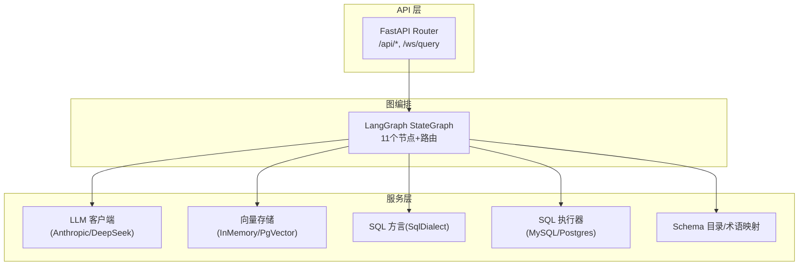
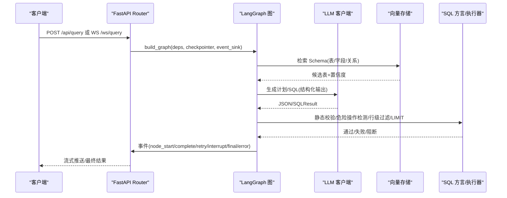
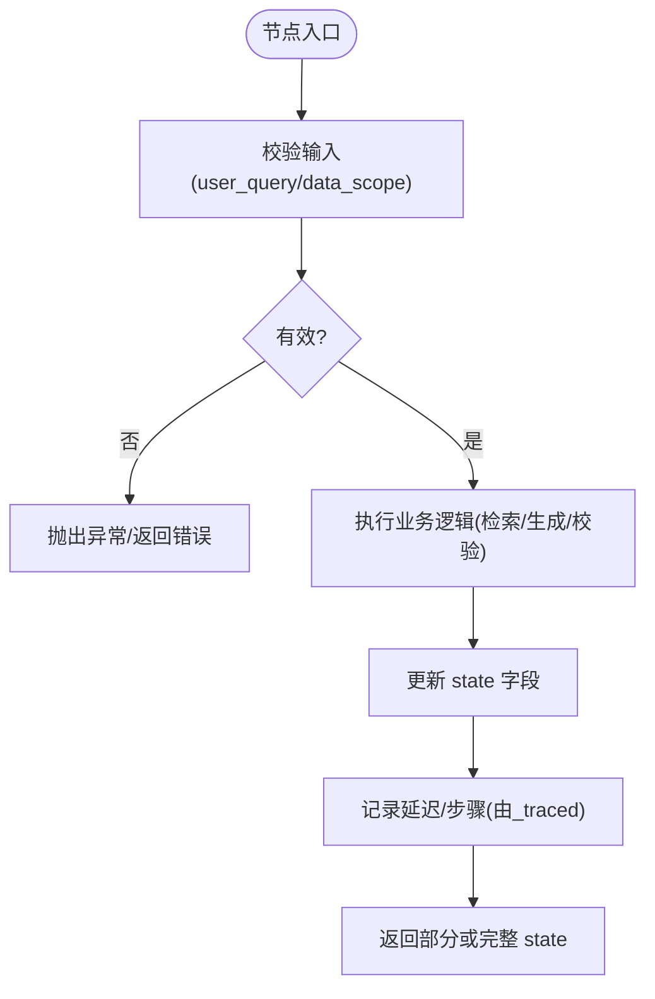
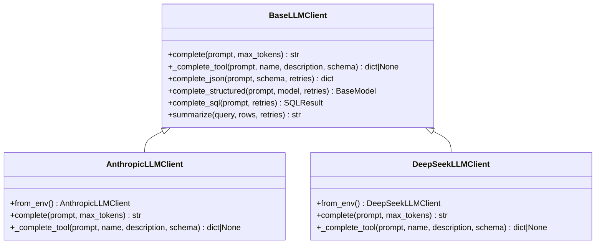
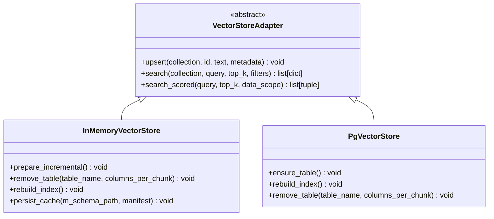
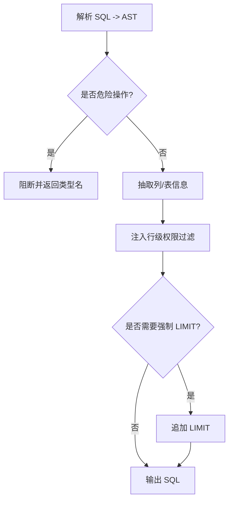
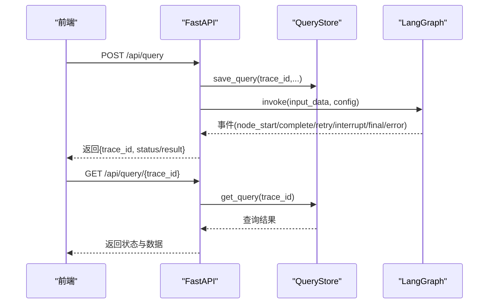
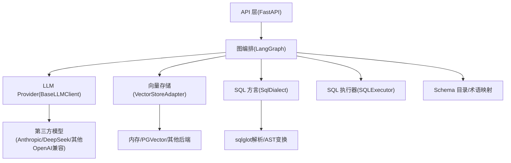
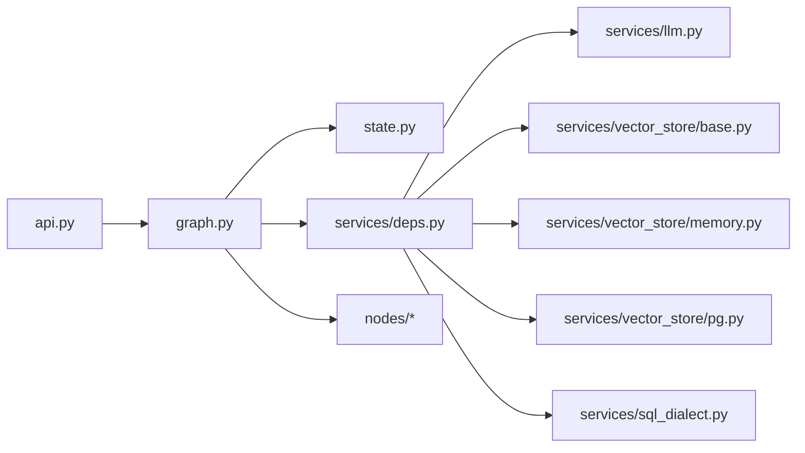
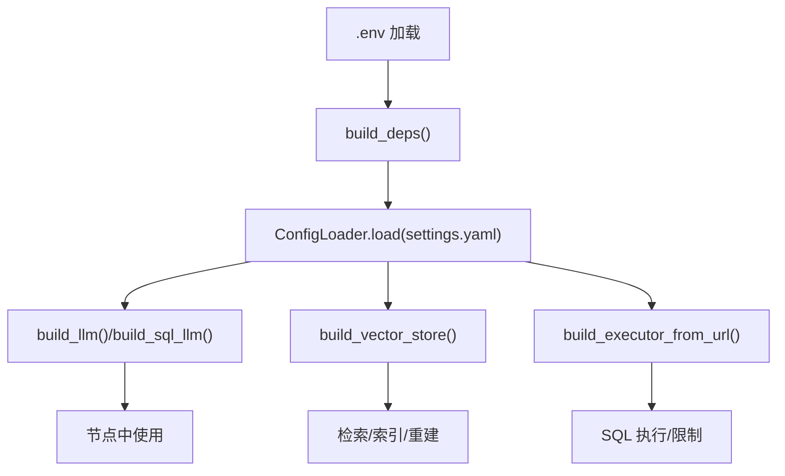

# 扩展开发

<cite>
**本文引用的文件**   
- [api.py](file://nl2sql_agent/api.py)
- [graph.py](file://nl2sql_agent/graph.py)
- [state.py](file://nl2sql_agent/state.py)
- [deps.py](file://nl2sql_agent/services/deps.py)
- [llm.py](file://nl2sql_agent/services/llm.py)
- [base.py](file://nl2sql_agent/services/vector_store/base.py)
- [memory.py](file://nl2sql_agent/services/vector_store/memory.py)
- [pg.py](file://nl2sql_agent/services/vector_store/pg.py)
- [sql_dialect.py](file://nl2sql_agent/services/sql_dialect.py)
- [m1_entry.py](file://nl2sql_agent/nodes/m1_entry.py)
- [m3_schema_retrieval.py](file://nl2sql_agent/nodes/m3_schema_retrieval.py)
- [config_loader.py](file://nl2sql_agent/services/config_loader.py)
- [testing.py](file://nl2sql_agent/testing.py)
</cite>

## 目录
1. [简介](#简介)
2. [项目结构](#项目结构)
3. [核心组件](#核心组件)
4. [架构总览](#架构总览)
5. [详细组件分析](#详细组件分析)
6. [依赖关系分析](#依赖关系分析)
7. [性能考虑](#性能考虑)
8. [故障排查指南](#故障排查指南)
9. [结论](#结论)
10. [附录：插件注册与配置管理](#附录插件注册与配置管理)

## 简介
本指南面向希望为 NL2SQL 系统扩展开发的工程师，覆盖以下主题：
- 自定义节点开发流程（继承约定、状态处理、错误处理、测试方法）
- LLM Provider 插件开发（BaseLLMClient 接口实现、多模型支持、故障转移机制）
- Vector Store 插件开发（向量存储接口实现、索引优化、查询性能调优）
- SQL Dialect 扩展开发（方言适配、语法转换、功能映射）
- API 扩展方法（REST API 添加、WebSocket 事件扩展、中间件开发）
- 插件注册与配置管理机制
- 完整开发示例与最佳实践

## 项目结构
本项目采用“图编排 + 服务层 + 插件化”的架构。核心由 LangGraph 驱动的有向无环图（DAG）组织各模块节点；服务层提供 LLM、向量检索、SQL 执行、方言适配等能力；API 层暴露 REST 与 WebSocket 接口，并负责持久化与审批流。

**图示来源** 
- [api.py:1-120](file://nl2sql_agent/api.py#L1-L120)
- [graph.py:174-313](file://nl2sql_agent/graph.py#L174-L313)
- [deps.py:113-184](file://nl2sql_agent/services/deps.py#L113-L184)

**章节来源**
- [api.py:1-120](file://nl2sql_agent/api.py#L1-L120)
- [graph.py:174-313](file://nl2sql_agent/graph.py#L174-L313)
- [deps.py:113-184](file://nl2sql_agent/services/deps.py#L113-L184)

## 核心组件
- 全局状态 NL2SQLState：定义所有节点共享的状态字段，包括用户问题、检索结果、计划、SQL、敏感判定、执行结果、追踪信息等。
- 图编排 graph：将 11 个业务节点按规则连接，包含澄清、复杂度判断、计划生成与校验、SQL 生成与静态校验、敏感检查、人工确认、沙箱执行与结果解释。
- 依赖装配 Deps：集中加载配置、构建 LLM/SQL 执行器/向量存储/方言/术语映射等，支持测试注入 FakeLLM 与内存执行器。
- LLM 客户端 BaseLLMClient：统一抽象 complete/complete_json/complete_structured/complete_sql，内置结构化输出重试与工具调用优先策略。
- 向量存储 VectorStoreAdapter：统一 upsert/search/search_scored 接口，InMemory 与 PgVector 两种实现。
- SQL 方言 SqlDialect：基于 sqlglot 的解析、AST 危险操作检测、列抽取、行级权限注入、LIMIT 强制等。

**章节来源**
- [state.py:83-146](file://nl2sql_agent/state.py#L83-L146)
- [graph.py:174-313](file://nl2sql_agent/graph.py#L174-L313)
- [deps.py:54-71](file://nl2sql_agent/services/deps.py#L54-L71)
- [llm.py:70-160](file://nl2sql_agent/services/llm.py#L70-L160)
- [base.py:11-21](file://nl2sql_agent/services/vector_store/base.py#L11-L21)
- [sql_dialect.py:12-111](file://nl2sql_agent/services/sql_dialect.py#L12-L111)

## 架构总览
下图展示从 API 到图执行、再到服务层的整体数据流与事件推送机制。

**图示来源** 
- [api.py:134-210](file://nl2sql_agent/api.py#L134-L210)
- [graph.py:174-313](file://nl2sql_agent/graph.py#L174-L313)
- [llm.py:280-328](file://nl2sql_agent/services/llm.py#L280-L328)
- [base.py:11-21](file://nl2sql_agent/services/vector_store/base.py#L11-L21)
- [sql_dialect.py:79-111](file://nl2sql_agent/services/sql_dialect.py#L79-L111)

## 详细组件分析

### 自定义节点开发指南
- 节点签名与返回
  - 节点函数接收 NL2SQLState，返回 NL2SQLState 或部分字段字典（增量更新）。
  - 入口节点 m1_entry 演示了基础校验与 trace_id 初始化。
- 状态处理
  - 使用 state 字段传递上下文，如 user_query、data_scope、retrieved_schema、plan、generated_sql、risk_decision 等。
  - 节点可追加 node_latencies 与 trace_steps（由 _traced 包装自动写入）。
- 错误处理
  - 节点内抛出异常会被图捕获，API 层会推送 error 事件并落库。
  - 对于需要重试的路径，通过路由函数返回 retry/give_up/pass/blocked 等控制。
- 测试方法
  - 使用 testing.build_test_deps 注入 FakeLLM 与 InMemoryExecutor，避免外部依赖。
  - 在 conftest 中设置测试隔离配置目录，确保断言稳定。

**图示来源** 
- [m1_entry.py:14-28](file://nl2sql_agent/nodes/m1_entry.py#L14-L28)
- [graph.py:88-104](file://nl2sql_agent/graph.py#L88-L104)
- [testing.py:148-187](file://nl2sql_agent/testing.py#L148-L187)

**章节来源**
- [m1_entry.py:14-28](file://nl2sql_agent/nodes/m1_entry.py#L14-L28)
- [state.py:83-146](file://nl2sql_agent/state.py#L83-L146)
- [graph.py:88-104](file://nl2sql_agent/graph.py#L88-L104)
- [testing.py:148-187](file://nl2sql_agent/testing.py#L148-L187)

### LLM Provider 插件开发
- 接口规范
  - 实现 BaseLLMClient 的 complete 与 _complete_tool。
  - 可使用 complete_json/complete_structured/complete_sql 进行结构化输出与 SQL 生成。
- 多模型支持
  - AnthropicLLMClient 与 DeepSeekLLMClient 分别实现 Messages API 与 OpenAI 兼容接口。
  - build_llm/build_sql_llm 根据环境变量选择主模型与 SQL 专用模型。
- 故障转移机制
  - complete_json 优先走工具调用，失败回退纯文本解析，多次重试后抛错。
  - get_model_for_node 可按节点配置切换更便宜的模型。

**图示来源** 
- [llm.py:70-160](file://nl2sql_agent/services/llm.py#L70-L160)
- [llm.py:162-243](file://nl2sql_agent/services/llm.py#L162-L243)
- [llm.py:280-328](file://nl2sql_agent/services/llm.py#L280-L328)

**章节来源**
- [llm.py:70-160](file://nl2sql_agent/services/llm.py#L70-L160)
- [llm.py:162-243](file://nl2sql_agent/services/llm.py#L162-L243)
- [llm.py:280-328](file://nl2sql_agent/services/llm.py#L280-L328)

### Vector Store 插件开发
- 接口规范
  - 实现 VectorStoreAdapter 的 upsert/search，以及可选 search_scored（模块 3 用）。
- 实现差异
  - InMemoryVectorStore：内存缓存 + 余弦相似度，支持缓存快照与增量重建。
  - PgVectorStore：pgvector 向量类型，SQL 检索，支持维度自适应建表。
- 索引优化与查询调优
  - 表级/字段级/关系级三类集合，混合检索融合评分。
  - 按 data_scope 过滤，避免越权召回；关系补充与最短 FK 路径桥接提升召回质量。
  - 缓存签名与语义哈希保证重启后复用一致性。

**图示来源** 
- [base.py:11-21](file://nl2sql_agent/services/vector_store/base.py#L11-L21)
- [memory.py:21-197](file://nl2sql_agent/services/vector_store/memory.py#L21-L197)
- [pg.py:15-174](file://nl2sql_agent/services/vector_store/pg.py#L15-L174)

**章节来源**
- [base.py:11-21](file://nl2sql_agent/services/vector_store/base.py#L11-L21)
- [memory.py:21-197](file://nl2sql_agent/services/vector_store/memory.py#L21-L197)
- [pg.py:15-174](file://nl2sql_agent/services/vector_store/pg.py#L15-L174)
- [m3_schema_retrieval.py:97-155](file://nl2sql_agent/nodes/m3_schema_retrieval.py#L97-L155)

### SQL Dialect 扩展开发
- 方言适配
  - 通过构造参数指定 dialect（postgres/mysql），解析与生成 SQL 时传入对应方言。
- AST 安全与功能映射
  - is_dangerous 基于 AST 识别非 SELECT 类命令，拦截 DROP/DELETE/UPDATE/TRUNCATE/INSERT/ALTER。
  - inject_row_level_filter 在 WHERE 追加行级权限条件，不依赖 LLM。
  - enforce_limit 强制 LIMIT，防止大结果集拖垮数据库。
- 列抽取与聚合检测
  - extract_columns/is_select_column/is_column_in_aggregate 用于字段幻觉校验与敏感判定。

**图示来源** 
- [sql_dialect.py:25-38](file://nl2sql_agent/services/sql_dialect.py#L25-L38)
- [sql_dialect.py:79-111](file://nl2sql_agent/services/sql_dialect.py#L79-L111)

**章节来源**
- [sql_dialect.py:12-111](file://nl2sql_agent/services/sql_dialect.py#L12-L111)

### API 扩展方法
- REST API
  - 新增端点：在 router 下定义 Pydantic 请求模型与 @router.post/get 处理器。
  - 审批/恢复：/query/{trace_id}/approve 与 /resume 支持中断恢复与人工审批。
  - 历史/审计/反馈：/history、/audit/{trace_id}、/feedback。
- WebSocket 事件
  - /ws/query 流式推送 node_start/complete/retry/interrupt/final/error/done/ping。
  - EventStream 桥接同步线程与异步事件循环，支持断线重连与 trace_id 恢复。
- 中间件开发
  - 可在 API 层增加鉴权、限流、日志等中间件；事件推送失败不影响流程执行。

**图示来源** 
- [api.py:234-264](file://nl2sql_agent/api.py#L234-L264)
- [api.py:266-272](file://nl2sql_agent/api.py#L266-L272)
- [api.py:134-210](file://nl2sql_agent/api.py#L134-L210)

**章节来源**
- [api.py:234-264](file://nl2sql_agent/api.py#L234-L264)
- [api.py:266-272](file://nl2sql_agent/api.py#L266-L272)
- [api.py:134-210](file://nl2sql_agent/api.py#L134-L210)

### 概念性概览
下图为概念化的插件扩展点位置，便于理解如何在现有架构中插入新能力。

[此图为概念性示意，不直接映射具体源码文件]

## 依赖关系分析
- 组件耦合与内聚
  - graph 高度内聚于节点路由与重试边界；deps 集中装配依赖，降低耦合。
  - llm/vectore_store/sql_dialect 均为独立插件，通过接口解耦。
- 外部依赖
  - FastAPI、LangGraph、sqlglot、psycopg、anthropic/openai SDK。
- 潜在循环依赖
  - 当前未发现循环导入；节点与服务层通过 deps 注入，避免硬编码引用。

**图示来源** 
- [api.py:1-120](file://nl2sql_agent/api.py#L1-120)
- [graph.py:174-313](file://nl2sql_agent/graph.py#L174-L313)
- [deps.py:113-184](file://nl2sql_agent/services/deps.py#L113-L184)

**章节来源**
- [api.py:1-120](file://nl2sql_agent/api.py#L1-120)
- [graph.py:174-313](file://nl2sql_agent/graph.py#L174-L313)
- [deps.py:113-184](file://nl2sql_agent/services/deps.py#L113-L184)

## 性能考虑
- 向量检索
  - 使用 search_scored 按 data_scope 预过滤，减少无关召回；关系补充与最短路径桥接提高准确率。
  - InMemory 缓存签名与语义哈希保障重启后复用，避免重复 embedding。
- LLM 调用
  - 结构化输出优先工具调用，失败回退纯文本解析，减少无效重试。
  - 节点级模型切换（get_model_for_node）可降低离线任务成本。
- SQL 执行
  - 强制 LIMIT 与行级权限注入，避免全表扫描与大结果集。
  - 静态校验在生成阶段拦截危险操作，降低运行时风险。
- 事件推送
  - EventStream 使用 call_soon_threadsafe 跨线程安全入队，避免阻塞。

[本节为通用指导，无需特定文件引用]

## 故障排查指南
- 常见问题定位
  - 结构化输出失败：检查 complete_json 的重试与提取逻辑，确认 schema 必填字段。
  - 向量检索为空：确认 vector_store.yaml 配置与 embedding 维度一致，必要时 rebuild_index。
  - SQL 被阻断：查看 blocked_reason 与 is_dangerous 返回类型，修正为非危险操作。
  - 审批/恢复失败：确认 trace_id 存在且状态为 pending_review，再调用 approve/resume。
- 调试建议
  - 启用 tracing：node_latencies 与 trace_steps 帮助定位瓶颈。
  - 使用 FakeLLM 与 InMemoryExecutor 快速复现问题。

**章节来源**
- [llm.py:82-129](file://nl2sql_agent/services/llm.py#L82-L129)
- [memory.py:166-171](file://nl2sql_agent/services/vector_store/memory.py#L166-L171)
- [sql_dialect.py:25-38](file://nl2sql_agent/services/sql_dialect.py#L25-L38)
- [api.py:280-354](file://nl2sql_agent/api.py#L280-L354)
- [graph.py:88-104](file://nl2sql_agent/graph.py#L88-L104)

## 结论
本扩展开发指南围绕“插件化 + 图编排 + 强约束”的设计思想，提供了从节点、LLM、向量存储、SQL 方言到 API 的全链路扩展方案。通过统一的接口与配置热更新机制，开发者可以低成本地替换与增强能力，同时保持系统的稳定性与可观测性。

[本节为总结，无需特定文件引用]

## 附录：插件注册与配置管理
- 插件注册
  - LLM：通过 build_llm/build_sql_llm 按环境变量选择；get_model_for_node 按节点配置切换。
  - 向量存储：build_vector_store 读取 vector_store.yaml 选择 backend（memory/pgvector）。
  - SQL 执行器：build_executor_from_url 按 URL scheme 选择 MySQL/Postgres。
- 配置管理
  - ConfigLoader 提供本地缓存与 mtime 热更新；API 层提供 term-mapping/rules 的读写接口。
  - settings.yaml 与 .env 共同决定数据库连接、方言、执行限制等。

**图示来源** 
- [deps.py:113-184](file://nl2sql_agent/services/deps.py#L113-L184)
- [config_loader.py:14-36](file://nl2sql_agent/services/config_loader.py#L14-L36)
- [api.py:396-448](file://nl2sql_agent/api.py#L396-L448)

**章节来源**
- [deps.py:113-184](file://nl2sql_agent/services/deps.py#L113-L184)
- [config_loader.py:14-36](file://nl2sql_agent/services/config_loader.py#L14-L36)
- [api.py:396-448](file://nl2sql_agent/api.py#L396-L448)