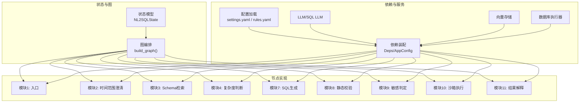
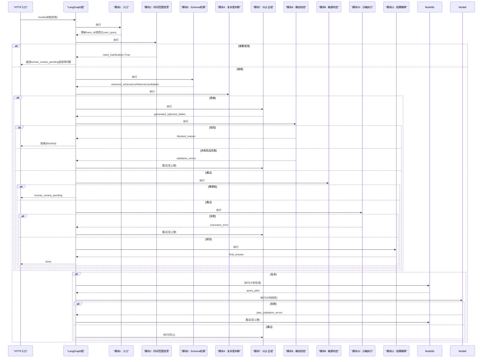
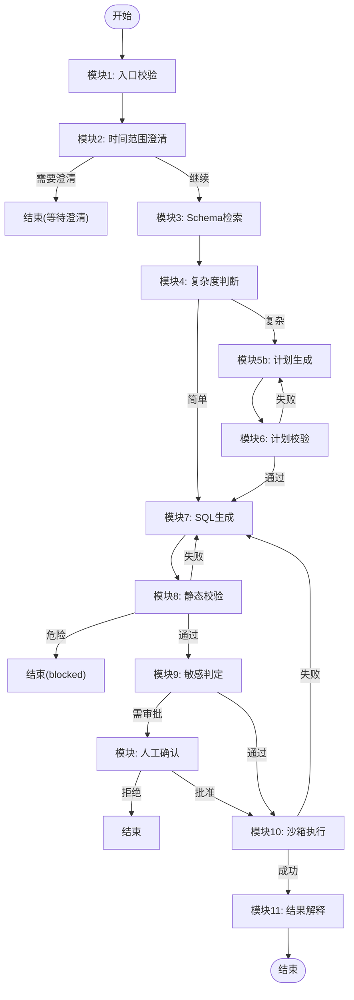
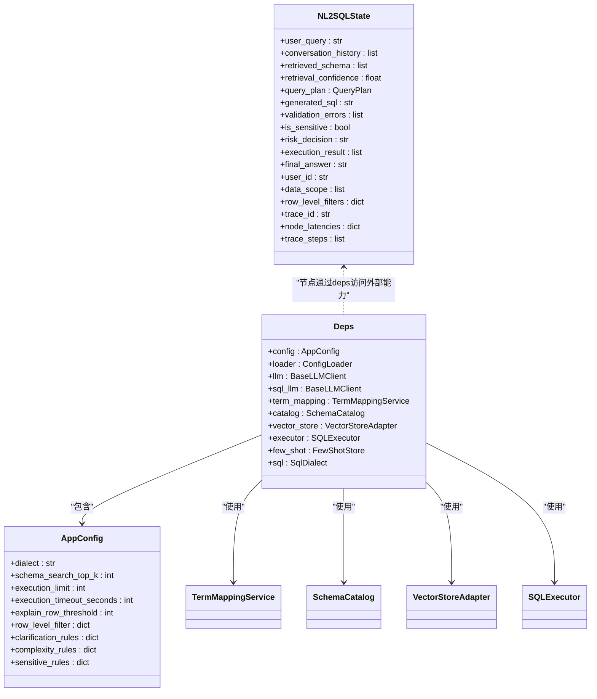

# 自定义节点开发

<cite>
**本文引用的文件**   
- [graph.py](file://nl2sql_agent/graph.py)
- [state.py](file://nl2sql_agent/state.py)
- [main.py](file://nl2sql_agent/main.py)
- [m1_entry.py](file://nl2sql_agent/nodes/m1_entry.py)
- [m2_clarify_time_range.py](file://nl2sql_agent/nodes/m2_clarify_time_range.py)
- [m3_schema_retrieval.py](file://nl2sql_agent/nodes/m3_schema_retrieval.py)
- [m4_complexity_check.py](file://nl2sql_agent/nodes/m4_complexity_check.py)
- [m7_sql_generation.py](file://nl2sql_agent/nodes/m7_sql_generation.py)
- [deps.py](file://nl2sql_agent/services/deps.py)
- [testing.py](file://nl2sql_agent/testing.py)
- [settings.yaml](file://nl2sql_agent/config/settings.yaml)
- [clarification_rules.yaml](file://nl2sql_agent/config/clarification_rules.yaml)
- [complexity_rules.yaml](file://nl2sql_agent/config/complexity_rules.yaml)
- [test_nodes.py](file://nl2sql_agent/tests/test_nodes.py)
</cite>

## 目录
1. [简介](#简介)
2. [项目结构](#项目结构)
3. [核心组件](#核心组件)
4. [架构总览](#架构总览)
5. [详细组件分析](#详细组件分析)
6. [依赖关系分析](#依赖关系分析)
7. [性能考量](#性能考量)
8. [故障排查指南](#故障排查指南)
9. [结论](#结论)
10. [附录](#附录)

## 简介
本文件面向“自定义节点开发”，围绕 LangGraph 编排的 NL2SQL Agent，系统阐述：
- 节点架构与状态处理（Node 基类约定、输入输出定义）
- 节点注册机制（路由配置、条件分支、错误处理策略）
- 最佳实践（状态设计、错误恢复、性能优化）
- 完整示例（从简单节点到复杂业务逻辑节点）
- 测试方法与调试技巧

## 项目结构
本项目采用“图驱动”的模块化架构。核心由以下部分组成：
- 状态模型：集中定义全局状态字段与类型约束
- 图编排：使用 LangGraph 的 StateGraph 构建节点与边，定义路由与重试回路
- 节点实现：每个模块一个节点，遵循统一的 make_xxx_node(deps) 工厂模式
- 依赖装配：统一加载配置、LLM、向量存储、执行器等外部能力
- 服务入口：FastAPI 暴露 /query、/approve、/thread 等接口

图表来源
- [graph.py:174-312](file://nl2sql_agent/graph.py#L174-L312)
- [state.py:83-146](file://nl2sql_agent/state.py#L83-L146)
- [deps.py:113-184](file://nl2sql_agent/services/deps.py#L113-L184)

章节来源
- [graph.py:1-313](file://nl2sql_agent/graph.py#L1-L313)
- [state.py:1-146](file://nl2sql_agent/state.py#L1-L146)
- [deps.py:1-184](file://nl2sql_agent/services/deps.py#L1-L184)

## 核心组件
- 状态模型 NL2SQLState：集中承载查询上下文、权限、检索结果、计划、SQL、校验、敏感判定、执行结果、追踪信息等。所有节点通过读写该状态进行协作。
- 图编排 build_graph：注册节点、添加边与条件边、定义重试与中断点、编译为可执行图。
- 依赖装配 Deps/AppConfig：统一加载配置、注入 LLM/向量存储/执行器等，供节点按需使用。
- 节点工厂模式：每个节点以 make_xxx_node(deps) 返回函数式节点，签名一致，便于图编排与测试替换。

章节来源
- [state.py:83-146](file://nl2sql_agent/state.py#L83-L146)
- [graph.py:174-312](file://nl2sql_agent/graph.py#L174-L312)
- [deps.py:40-67](file://nl2sql_agent/services/deps.py#L40-L67)

## 架构总览
LangGraph 图的关键流程与边界：
- 模块1→2→3→4
  - 简单路径：4→7
  - 复杂路径：4→5b→6→(失败回5b至上限)→7
- 模块7→8→9→10→11
  - 8失败(非危险)回7至上限；危险直接结束
  - 9审批通过后进入10；硬风险直接结束
  - 10失败回7至上限；成功进入11

图表来源
- [graph.py:174-312](file://nl2sql_agent/graph.py#L174-L312)

章节来源
- [graph.py:1-313](file://nl2sql_agent/graph.py#L1-L313)

## 详细组件分析

### 节点架构与状态处理
- 节点签名约定：make_xxx_node(deps) 返回一个函数，接收 NL2SQLState，返回 NL2SQLState | dict。返回 dict 时，键名对应 state 字段，用于增量更新。
- 状态读写原则：
  - 只写当前节点关心的字段，避免覆盖上游数据
  - 对必填字段做前置校验（如 user_id、data_scope、user_query）
  - 将追踪信息写入 node_latencies、trace_steps，便于链路观测
- 事件与追踪：图层 _traced 包装节点，自动记录开始/完成事件与耗时，并通过 event_sink 推送前端。

章节来源
- [m1_entry.py:14-27](file://nl2sql_agent/nodes/m1_entry.py#L14-L27)
- [graph.py:88-103](file://nl2sql_agent/graph.py#L88-L103)
- [state.py:83-146](file://nl2sql_agent/state.py#L83-L146)

### 节点注册与路由配置
- 节点注册：在 build_graph 中通过 g.add_node(name, wrapped_fn) 注册，_traced 包装后具备追踪能力。
- 路由配置：
  - 无条件边：g.add_edge(src, dst)
  - 条件边：g.add_conditional_edges(node, route_fn, mapping)，route_fn 返回目标节点名
  - 重试包装：_retry_route 包装路由，在触发重试时推送 retry 事件
- 中断点：interrupt_before 指定人工确认或候选澄清等节点暂停，等待外部恢复。

章节来源
- [graph.py:174-312](file://nl2sql_agent/graph.py#L174-L312)

### 错误处理策略
- 危险操作拦截：静态校验发现非 SELECT 操作，设置 blocked_reason 并直接结束，不进入重试。
- 可重试错误：
  - 计划校验失败：在模块5b内部循环，最多 max_plan_retries 次
  - 静态校验失败：回退到 SQL 生成，最多 max_retries 次
  - 执行失败：回退到 SQL 生成，最多 max_retries 次
- 事件上报：每次重试通过 _emit 推送 retry 事件，包含 attempt 与 reason。

章节来源
- [graph.py:146-170](file://nl2sql_agent/graph.py#L146-L170)
- [graph.py:106-126](file://nl2sql_agent/graph.py#L106-L126)

### 节点开发最佳实践
- 状态设计
  - 明确读写边界，避免污染其他模块字段
  - 使用 Pydantic 字段约束保证数据结构稳定
  - 对可选字段提供默认值，降低空值分支复杂度
- 错误恢复
  - 区分“可重试”和“不可重试”错误
  - 在最近的节点消化错误，避免整条链路推倒重来
  - 利用 state.retry_count/max_retries 控制重试上限
- 性能优化
  - 减少不必要的 LLM 调用（如确定性规则优先）
  - 向量检索按 data_scope 过滤，避免无关表召回
  - 结果截断与序列化优化（execution_result 前20行）

章节来源
- [state.py:83-146](file://nl2sql_agent/state.py#L83-L146)
- [graph.py:60-70](file://nl2sql_agent/graph.py#L60-L70)

### 完整节点开发示例

#### 简单节点：模块1 入口
- 职责：校验 user_id/data_scope/user_query，生成 trace_id，规范化用户提问
- 输入：NL2SQLState（含 user_id、data_scope、user_query）
- 输出：dict 更新 user_query、trace_id
- 关键点：严格校验必填字段，避免下游权限与审计失效

章节来源
- [m1_entry.py:14-27](file://nl2sql_agent/nodes/m1_entry.py#L14-L27)

#### 条件分支节点：模块2 时间范围澄清
- 职责：基于规则检测是否缺少时间范围，必要时返回澄清问题
- 输入：NL2SQLState（含 conversation_history、clarified_query）
- 输出：need_clarification、clarification_questions、clarification_reason
- 关键点：结合历史消息避免重复追问；灵敏度阈值控制触发频率

章节来源
- [m2_clarify_time_range.py:34-61](file://nl2sql_agent/nodes/m2_clarify_time_range.py#L34-L61)
- [clarification_rules.yaml:10-25](file://nl2sql_agent/config/clarification_rules.yaml#L10-L25)

#### 复杂节点：模块3 Schema 检索
- 职责：混合检索（术语映射 + 表级/字段级向量 + 关系补充），计算置信度与候选集
- 输入：NL2SQLState（user_query、data_scope）
- 输出：retrieved_schema、retrieval_confidence、retrieval_candidates、main_table_count
- 关键点：
  - 多业务线并行检索并按文档ID去重保留最高分
  - 关系向量仅补充与主候选直接关联的表
  - 字段相关加成提升语义相关表的优先级
  - 严格按 data_scope 过滤，无权限表绝不进入结果

章节来源
- [m3_schema_retrieval.py:230-331](file://nl2sql_agent/nodes/m3_schema_retrieval.py#L230-L331)
- [clarification_rules.yaml:27-62](file://nl2sql_agent/config/clarification_rules.yaml#L27-L62)

#### 路由节点：模块4 复杂度判断
- 职责：基于确定性规则判断是否走计划路径
- 输入：NL2SQLState（retrieved_schema、main_table_count、low_confidence_flag）
- 输出：is_complex、complex_reasons
- 关键点：保守策略，任一信号即判复杂；低置信度强制走计划路径

章节来源
- [m4_complexity_check.py:17-52](file://nl2sql_agent/nodes/m4_complexity_check.py#L17-L52)
- [complexity_rules.yaml:1-17](file://nl2sql_agent/config/complexity_rules.yaml#L1-L17)

#### 生成节点：模块7 SQL 生成
- 职责：根据计划或自然语言生成 SQL，同时输出 used_tables
- 输入：NL2SQLState（query_plan 或 user_query、retrieved_schema）
- 输出：generated_sql、used_tables、清空上一轮校验错误
- 关键点：
  - 有计划则按 QueryPlan 构建 prompt；否则按自然语言+few-shot
  - 禁止模型臆造字段或写操作
  - 重试反馈包含上一次失败原因，引导修复而非规避

章节来源
- [m7_sql_generation.py:94-112](file://nl2sql_agent/nodes/m7_sql_generation.py#L94-L112)

### 概念总览
下图展示节点间的数据流与控制流，强调状态传递与路由决策。

[此图为概念流程图，不直接映射具体源码文件]

## 依赖关系分析
- 节点对外部能力的依赖通过 Deps 注入，包括：
  - LLM/SQL LLM：用于计划生成、SQL 生成、结果解释
  - TermMappingService：术语解析与扩展
  - SchemaCatalog：表结构与列元数据
  - VectorStoreAdapter：向量检索（内存或 pgvector）
  - SQLExecutor：数据库执行（MySQL/Postgres）
- 配置加载：settings.yaml、clarification_rules.yaml、complexity_rules.yaml 等决定行为阈值与开关

图表来源
- [deps.py:40-67](file://nl2sql_agent/services/deps.py#L40-L67)
- [state.py:83-146](file://nl2sql_agent/state.py#L83-L146)

章节来源
- [deps.py:113-184](file://nl2sql_agent/services/deps.py#L113-L184)
- [settings.yaml:1-30](file://nl2sql_agent/config/settings.yaml#L1-L30)

## 性能考量
- 向量检索优化：
  - 多业务线并行检索并按文档ID去重，保留最高分
  - 关系向量仅补充与主候选直接关联的表，避免扩散
  - 字段相关加成提升语义相关表的优先级
- LLM 调用优化：
  - 确定性规则优先（如复杂度判断、时间范围检查）
  - SQL 专用模型可选，未配置回退主模型
- 执行限制：
  - 只读事务、LIMIT 限制、超时控制、EXPLAIN 预估行数拒绝
- 前端友好：
  - execution_result 截断前20行，避免刷屏

章节来源
- [m3_schema_retrieval.py:73-128](file://nl2sql_agent/nodes/m3_schema_retrieval.py#L73-L128)
- [settings.yaml:18-30](file://nl2sql_agent/config/settings.yaml#L18-L30)
- [graph.py:60-70](file://nl2sql_agent/graph.py#L60-L70)

## 故障排查指南
- 常见错误定位：
  - 危险操作被拦截：检查 static_validation 的 blocked_reason
  - 字段幻觉：查看 validation_errors 中的字段名
  - used_tables 不一致：AST 解析与实际引用对比
  - 行级过滤未生效：确认 row_level_filters 注入与 enabled 开关
- 调试技巧：
  - 使用 _traced 输出的 node_latencies 与 trace_steps 定位慢节点
  - 通过 /thread/{id} 查看中间状态快照
  - 单元测试覆盖关键分支（参考 test_nodes.py）

章节来源
- [test_nodes.py:265-378](file://nl2sql_agent/tests/test_nodes.py#L265-L378)
- [graph.py:88-103](file://nl2sql_agent/graph.py#L88-L103)
- [main.py:142-145](file://nl2sql_agent/main.py#L142-L145)

## 结论
本项目的自定义节点开发遵循“状态驱动、图编排、依赖注入”的设计范式。通过统一的节点工厂模式、严格的类型约束、清晰的路由与重试策略，实现了高内聚、低耦合的可扩展架构。开发者只需关注节点自身逻辑，即可无缝融入整体流程。

## 附录

### 节点开发模板（步骤）
1. 定义节点函数：make_xxx_node(deps) 返回函数式节点
2. 读取 state 必要字段，做前置校验
3. 调用 deps 提供的能力（LLM、向量、执行器等）
4. 返回 dict 增量更新 state 字段
5. 在 graph.py 中注册节点与路由
6. 编写单元测试覆盖正常与异常路径

章节来源
- [m1_entry.py:14-27](file://nl2sql_agent/nodes/m1_entry.py#L14-L27)
- [graph.py:174-312](file://nl2sql_agent/graph.py#L174-L312)
- [testing.py:148-187](file://nl2sql_agent/testing.py#L148-L187)

### 测试与调试示例
- 使用 FakeLLM 与 InMemoryExecutor 构造测试环境
- 断言节点输出是否符合预期（如 retrieved_schema、validation_errors）
- 模拟异常路径（如危险 SQL、字段幻觉、执行失败）

章节来源
- [testing.py:26-66](file://nl2sql_agent/testing.py#L26-L66)
- [test_nodes.py:1-450](file://nl2sql_agent/tests/test_nodes.py#L1-L450)