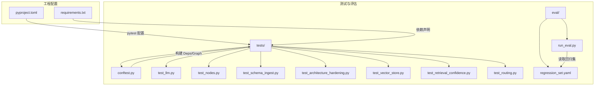
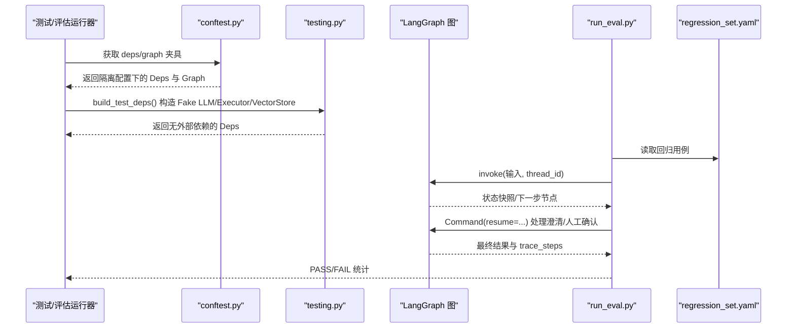
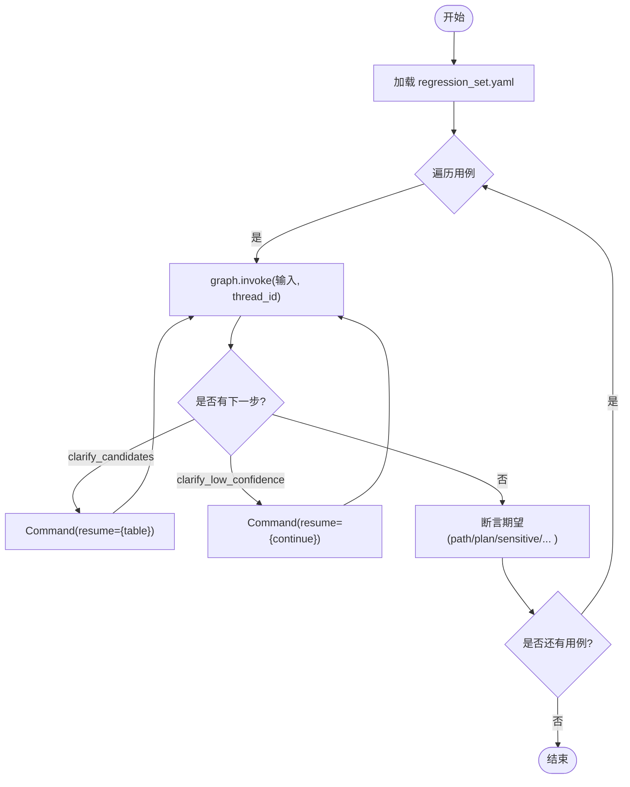
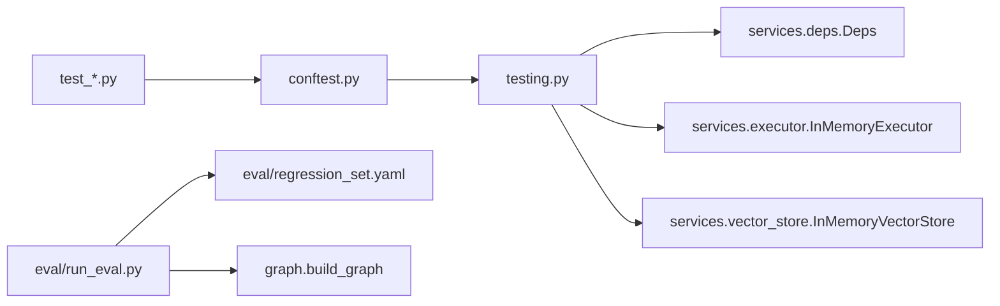

# 测试指南

<cite>
**本文引用的文件**   
- [pyproject.toml](file://pyproject.toml)
- [requirements.txt](file://requirements.txt)
- [nl2sql_agent/tests/conftest.py](file://nl2sql_agent/tests/conftest.py)
- [nl2sql_agent/testing.py](file://nl2sql_agent/testing.py)
- [nl2sql_agent/eval/run_eval.py](file://nl2sql_agent/eval/run_eval.py)
- [nl2sql_agent/eval/regression_set.yaml](file://nl2sql_agent/eval/regression_set.yaml)
- [nl2sql_agent/tests/test_llm.py](file://nl2sql_agent/tests/test_llm.py)
- [nl2sql_agent/tests/test_nodes.py](file://nl2sql_agent/tests/test_nodes.py)
- [nl2sql_agent/tests/test_schema_ingest.py](file://nl2sql_agent/tests/test_schema_ingest.py)
- [nl2sql_agent/tests/test_architecture_hardening.py](file://nl2sql_agent/tests/test_architecture_hardening.py)
- [nl2sql_agent/tests/test_vector_store.py](file://nl2sql_agent/tests/test_vector_store.py)
- [nl2sql_agent/tests/test_retrieval_confidence.py](file://nl2sql_agent/tests/test_retrieval_confidence.py)
- [nl2sql_agent/tests/test_routing.py](file://nl2sql_agent/tests/test_routing.py)
</cite>

## 目录
1. [简介](#简介)
2. [项目结构](#项目结构)
3. [核心组件](#核心组件)
4. [架构总览](#架构总览)
5. [详细组件分析](#详细组件分析)
6. [依赖关系分析](#依赖关系分析)
7. [性能考量](#性能考量)
8. [故障排查指南](#故障排查指南)
9. [结论](#结论)
10. [附录](#附录)

## 简介
本测试指南面向 NL2SQL 项目的开发与维护者，系统阐述单元测试、集成测试与回归评估的编写与实践。内容覆盖 pytest 框架使用、Mock/Fake 双打构造、异步测试方法（如适用）、数据库与外部服务模拟、端到端路由验证、评估框架与回归集、测试数据管理与隔离、覆盖率要求与报告生成、最佳实践与常见问题、以及 CI/CD 集成建议。所有说明均基于仓库现有实现与测试用例，确保可落地执行。

## 项目结构
测试相关代码集中在 nl2sql_agent/tests 与 nl2sql_agent/eval 两个目录：
- tests：按功能模块组织单元测试与验收测试，包含共享夹具 conftest.py 与通用测试工具 testing.py。
- eval：回归评估入口与回归用例集，用于稳定复现关键路径与行为。

图表来源
- [pyproject.toml:41-44](file://pyproject.toml#L41-L44)
- [nl2sql_agent/tests/conftest.py:1-76](file://nl2sql_agent/tests/conftest.py#L1-L76)
- [nl2sql_agent/eval/run_eval.py:1-111](file://nl2sql_agent/eval/run_eval.py#L1-L111)
- [nl2sql_agent/eval/regression_set.yaml:1-31](file://nl2sql_agent/eval/regression_set.yaml#L1-L31)

章节来源
- [pyproject.toml:1-44](file://pyproject.toml#L1-L44)
- [requirements.txt:1-15](file://requirements.txt#L1-L15)
- [nl2sql_agent/tests/conftest.py:1-76](file://nl2sql_agent/tests/conftest.py#L1-L76)
- [nl2sql_agent/eval/run_eval.py:1-111](file://nl2sql_agent/eval/run_eval.py#L1-L111)
- [nl2sql_agent/eval/regression_set.yaml:1-31](file://nl2sql_agent/eval/regression_set.yaml#L1-L31)

## 核心组件
- 测试夹具与图装配
  - conftest.py：会话级隔离配置目录、注入基线 schema_catalog、提供 deps 与 graph 夹具，统一输入构造器 make_input。
  - testing.py：FakeLLM、InMemoryExecutor、InMemoryVectorStore、TermMappingService 等测试双打；build_test_deps 组装无外部依赖的 Deps。
- 回归评估
  - run_eval.py：加载 regression_set.yaml，驱动 LangGraph 图执行，自动处理候选澄清与低置信澄清，断言期望路径与结果。
  - regression_set.yaml：定义用例 id、用户查询、user_id、data_scope 与 expect 断言集合。

章节来源
- [nl2sql_agent/tests/conftest.py:1-76](file://nl2sql_agent/tests/conftest.py#L1-L76)
- [nl2sql_agent/testing.py:1-187](file://nl2sql_agent/testing.py#L1-L187)
- [nl2sql_agent/eval/run_eval.py:1-111](file://nl2sql_agent/eval/run_eval.py#L1-L111)
- [nl2sql_agent/eval/regression_set.yaml:1-31](file://nl2sql_agent/eval/regression_set.yaml#L1-L31)

## 架构总览
下图展示测试与评估如何围绕 LangGraph 图进行编排：测试夹具提供隔离配置与 Fake 依赖，评估脚本驱动图执行并断言路径与结果。

图表来源
- [nl2sql_agent/tests/conftest.py:46-66](file://nl2sql_agent/tests/conftest.py#L46-L66)
- [nl2sql_agent/testing.py:148-187](file://nl2sql_agent/testing.py#L148-L187)
- [nl2sql_agent/eval/run_eval.py:18-86](file://nl2sql_agent/eval/run_eval.py#L18-L86)
- [nl2sql_agent/eval/regression_set.yaml:1-31](file://nl2sql_agent/eval/regression_set.yaml#L1-L31)

## 详细组件分析

### 单元测试：pytest 框架与 Fixture
- 测试发现与选项
  - pyproject.toml 中指定 testpaths 与 addopts，便于快速运行。
- 共享夹具
  - _isolated_config：复制真实配置到临时目录，覆盖 schema_catalog.yaml，避免被脚本改写影响测试。
  - deps：通过 build_test_deps 返回无外部依赖的依赖容器。
  - graph：基于 deps 构建图，默认使用内存检查点。
  - make_input：统一构造 user_query/user_id/data_scope 输入。
- 常用模式
  - monkeypatch 环境变量以切换 LLM provider。
  - 使用 FakeLLM/sql_rules/plan_rules 精确控制 LLM 输出。
  - 使用 InMemoryExecutor/InMemoryVectorStore 替代真实数据库与向量库。

章节来源
- [pyproject.toml:41-44](file://pyproject.toml#L41-L44)
- [nl2sql_agent/tests/conftest.py:46-76](file://nl2sql_agent/tests/conftest.py#L46-L76)
- [nl2sql_agent/testing.py:148-187](file://nl2sql_agent/testing.py#L148-L187)

### Mock 对象与 Fake 双打
- FakeLLM
  - 支持 SQL 规则与计划规则的正则匹配，返回 SQLResult 或 Pydantic 模型实例。
  - 记录调用次数，便于断言重试与分支。
- InMemoryExecutor
  - 以内存表 FAKE_TABLES 作为数据源，支持空结果、错误注入、explain 行数限制等场景。
- InMemoryVectorStore
  - 词袋 embedding，支持 upsert/search/rebuild_index，过滤 business_line 等元数据。
- ReviewStore/FakeSchemaExecutor
  - 在 schema 入库测试中模拟 information_schema 与审核队列，验证质量门禁、增量同步、幽灵清理等。

章节来源
- [nl2sql_agent/testing.py:26-85](file://nl2sql_agent/testing.py#L26-L85)
- [nl2sql_agent/testing.py:78-85](file://nl2sql_agent/testing.py#L78-L85)
- [nl2sql_agent/tests/test_schema_ingest.py:38-75](file://nl2sql_agent/tests/test_schema_ingest.py#L38-L75)

### 异步测试方法
- 当前测试未显式使用 asyncio 异步客户端；如需测试异步 LLM/IO，建议使用 pytest-asyncio，并在 fixture 中注入异步上下文。对于本项目现有实现，优先使用同步 Fake 双打即可保证稳定性与可重复性。

[本节为概念性说明，不直接分析具体文件]

### 集成测试策略
- 数据库测试
  - 通过 FakeSchemaExecutor 模拟 information_schema 与数据取样，验证注释质量、敏感字段脱敏、增量同步与删表清理。
- 外部服务模拟
  - FakeLLM 与 fake_embedding 替代真实 LLM 与向量模型，确保离线可测与确定性。
- 端到端测试
  - test_routing.py 与 test_retrieval_confidence.py 覆盖简单路径、复合口径、字段幻觉重试、系统隔离、敏感暂停与人工确认、执行失败回退等关键流程。

章节来源
- [nl2sql_agent/tests/test_schema_ingest.py:108-159](file://nl2sql_agent/tests/test_schema_ingest.py#L108-L159)
- [nl2sql_agent/tests/test_routing.py:26-115](file://nl2sql_agent/tests/test_routing.py#L26-L115)
- [nl2sql_agent/tests/test_retrieval_confidence.py:44-90](file://nl2sql_agent/tests/test_retrieval_confidence.py#L44-L90)

### 评估框架与回归测试集
- run_eval.py
  - 读取 regression_set.yaml，逐条驱动图执行，自动处理 clarify_candidates/clarify_low_confidence/human_review 等中间态。
  - 断言 path、plan_passed、execution_result_nonempty、sensitive、paused_at 等期望。
- regression_set.yaml
  - 定义三类用例：简单路径、复合口径、敏感金额聚合，覆盖主流程与关键安全点。

图表来源
- [nl2sql_agent/eval/run_eval.py:18-86](file://nl2sql_agent/eval/run_eval.py#L18-L86)
- [nl2sql_agent/eval/regression_set.yaml:1-31](file://nl2sql_agent/eval/regression_set.yaml#L1-L31)

章节来源
- [nl2sql_agent/eval/run_eval.py:1-111](file://nl2sql_agent/eval/run_eval.py#L1-L111)
- [nl2sql_agent/eval/regression_set.yaml:1-31](file://nl2sql_agent/eval/regression_set.yaml#L1-L31)

### 测试数据管理
- 测试数据生成
  - FAKE_TABLES 提供借据表样例行，涵盖正常/逾期、不同平台代码等场景。
  - FakeSchemaExecutor.samples 用于模拟数据取样，配合脱敏逻辑验证。
- Fixture 使用
  - deps/graph 夹具复用，避免重复装配；_isolated_config 保证配置隔离。
- 数据隔离
  - 每个测试会话使用独立临时目录存放配置与产物，避免污染真实环境。

章节来源
- [nl2sql_agent/testing.py:68-85](file://nl2sql_agent/testing.py#L68-L85)
- [nl2sql_agent/tests/test_schema_ingest.py:185-203](file://nl2sql_agent/tests/test_schema_ingest.py#L185-L203)
- [nl2sql_agent/tests/conftest.py:46-56](file://nl2sql_agent/tests/conftest.py#L46-L56)

### 测试覆盖率与报告
- 覆盖率要求
  - 建议在 CI 中启用 pytest-cov，设置最小覆盖率阈值（例如整体≥80%，核心模块≥90%）。
- 报告生成
  - 使用 --cov-report=html --cov-report=term-missing 生成 HTML 与终端差异报告，便于审查缺失分支。
- 执行命令参考
  - pytest --cov=nl2sql_agent --cov-report=html --cov-report=term-missing -q

[本节为通用指导，不直接分析具体文件]

### 最佳实践与常见问题
- 最佳实践
  - 使用 FakeLLM/sql_rules/plan_rules 明确控制 LLM 输出，避免随机性。
  - 用 data_scope 表达系统级权限隔离，确保检索与注入正确。
  - 对危险操作（DROP/DELETE）立即拦截且不进入重试。
  - 对执行失败与字段幻觉采用“退回上一阶段”的最小修复回路。
- 常见问题
  - 配置被脚本改写：通过 _isolated_config 隔离。
  - 向量库不可用：测试中替换为 InMemoryVectorStore，避免阻塞。
  - 低置信/多候选导致循环：通过 Command(resume=...) 明确推进。
  - 别名与行级过滤注入冲突：静态校验需解析别名并限定注入列。

章节来源
- [nl2sql_agent/tests/test_nodes.py:265-378](file://nl2sql_agent/tests/test_nodes.py#L265-L378)
- [nl2sql_agent/tests/test_routing.py:167-215](file://nl2sql_agent/tests/test_routing.py#L167-L215)
- [nl2sql_agent/tests/test_architecture_hardening.py:62-92](file://nl2sql_agent/tests/test_architecture_hardening.py#L62-L92)

### CI/CD 集成建议
- 安装依赖
  - 使用 uv.lock/requirements.txt 锁定版本，确保可重现。
- 运行测试
  - pytest -q 或 pytest --cov=nl2sql_agent -q
- 运行回归
  - python -m nl2sql_agent.eval.run_eval
- 缓存与并行
  - 缓存 .venv 与 pytest cache；将 tests 与 eval 分步执行以提升吞吐。

章节来源
- [pyproject.toml:41-44](file://pyproject.toml#L41-L44)
- [requirements.txt:1-15](file://requirements.txt#L1-L15)
- [nl2sql_agent/eval/run_eval.py:88-111](file://nl2sql_agent/eval/run_eval.py#L88-L111)

## 依赖关系分析
测试与评估对核心服务的依赖如下：
- 测试夹具依赖 ConfigLoader、Deps、Graph、Checkpoint。
- FakeLLM/Executor/VectorStore 解耦外部服务。
- 回归评估依赖 run_eval 与 regression_set.yaml。

图表来源
- [nl2sql_agent/tests/conftest.py:14-16](file://nl2sql_agent/tests/conftest.py#L14-L16)
- [nl2sql_agent/testing.py:148-187](file://nl2sql_agent/testing.py#L148-L187)
- [nl2sql_agent/eval/run_eval.py:14-21](file://nl2sql_agent/eval/run_eval.py#L14-L21)

章节来源
- [nl2sql_agent/tests/conftest.py:1-76](file://nl2sql_agent/tests/conftest.py#L1-L76)
- [nl2sql_agent/testing.py:1-187](file://nl2sql_agent/testing.py#L1-L187)
- [nl2sql_agent/eval/run_eval.py:1-111](file://nl2sql_agent/eval/run_eval.py#L1-L111)

## 性能考量
- 向量索引重建
  - rebuild_index 应幂等且高效，避免全量重算；语义哈希一致时可直接加载缓存。
- 执行限制
  - explain_row_threshold 与 execution_limit 防止大扫描；测试中通过 InMemoryExecutor 参数模拟超限。
- 重试上限
  - plan_retry_count 与 retry_count 有上限，避免死循环；测试覆盖最大重试降级路径。

章节来源
- [nl2sql_agent/tests/test_vector_store.py:36-41](file://nl2sql_agent/tests/test_vector_store.py#L36-L41)
- [nl2sql_agent/tests/test_architecture_hardening.py:104-114](file://nl2sql_agent/tests/test_architecture_hardening.py#L104-L114)
- [nl2sql_agent/tests/test_routing.py:192-206](file://nl2sql_agent/tests/test_routing.py#L192-L206)

## 故障排查指南
- 常见错误定位
  - LLM 解析失败：检查 extract_json 与 complete_structured 的重试逻辑与 schema 定义。
  - 字段幻觉：查看 static_validation 的错误信息，确认别名与列名一致性。
  - 行级过滤注入失败：确认 row_level_filter.enabled 与 data_scope 可信值。
  - 向量写入失败：捕获 vector_write 错误，确保存储可用或回退内存实现。
- 调试技巧
  - 打印 trace_steps 与 result 关键字段，定位卡点节点。
  - 使用 InMemorySaver 持久化 checkpoint，跨进程恢复状态。

章节来源
- [nl2sql_agent/tests/test_llm.py:155-166](file://nl2sql_agent/tests/test_llm.py#L155-L166)
- [nl2sql_agent/tests/test_nodes.py:281-325](file://nl2sql_agent/tests/test_nodes.py#L281-L325)
- [nl2sql_agent/tests/test_architecture_hardening.py:141-156](file://nl2sql_agent/tests/test_architecture_hardening.py#L141-L156)

## 结论
本项目测试体系以 pytest + Fake 双打为核心，结合 LangGraph 图的端到端验证与回归评估，形成从单元到集成的完整闭环。通过隔离配置、内存执行器与向量存储、以及严格的静态校验与敏感控制，确保了测试的可重复性与安全性。建议在 CI 中固化覆盖率与回归集，持续保障质量。

## 附录
- 快速运行
  - pytest -q
  - python -m nl2sql_agent.eval.run_eval
- 覆盖率示例
  - pytest --cov=nl2sql_agent --cov-report=html --cov-report=term-missing -q

[本节为通用指导，不直接分析具体文件]