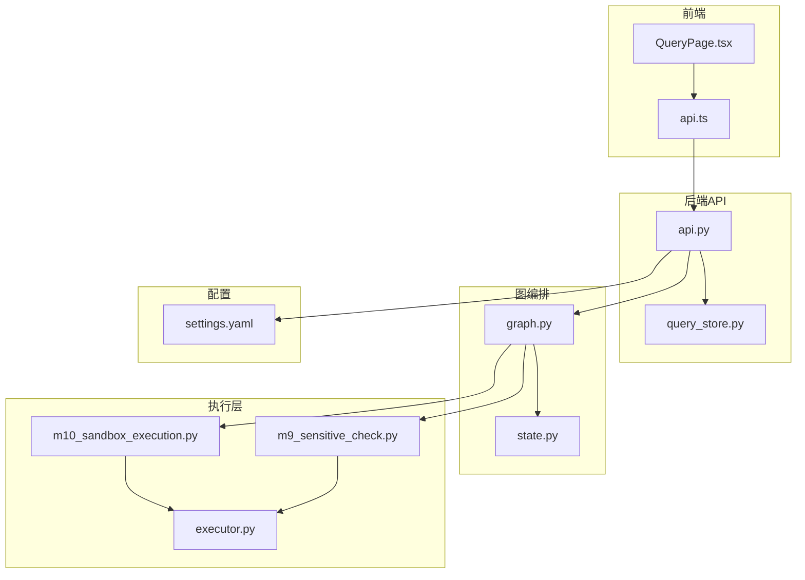
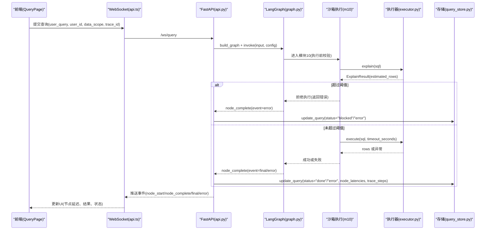
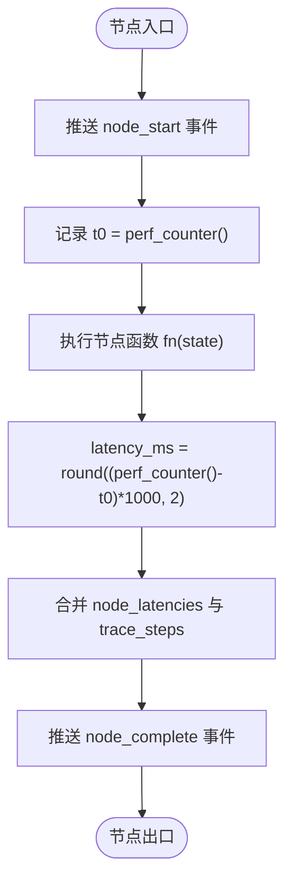
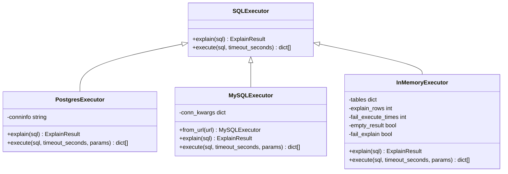
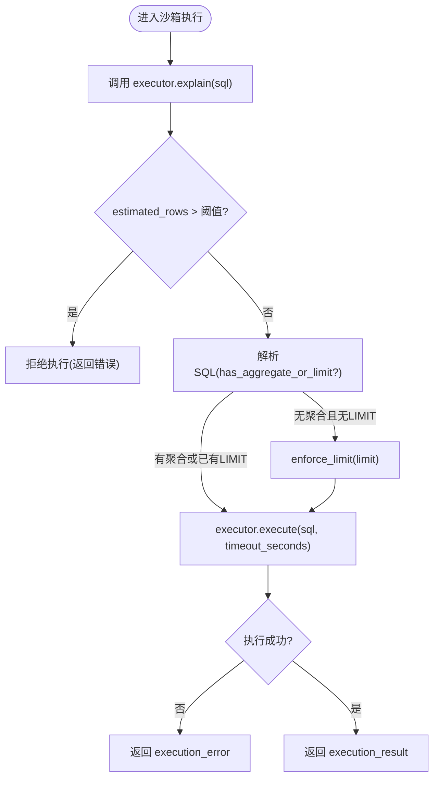
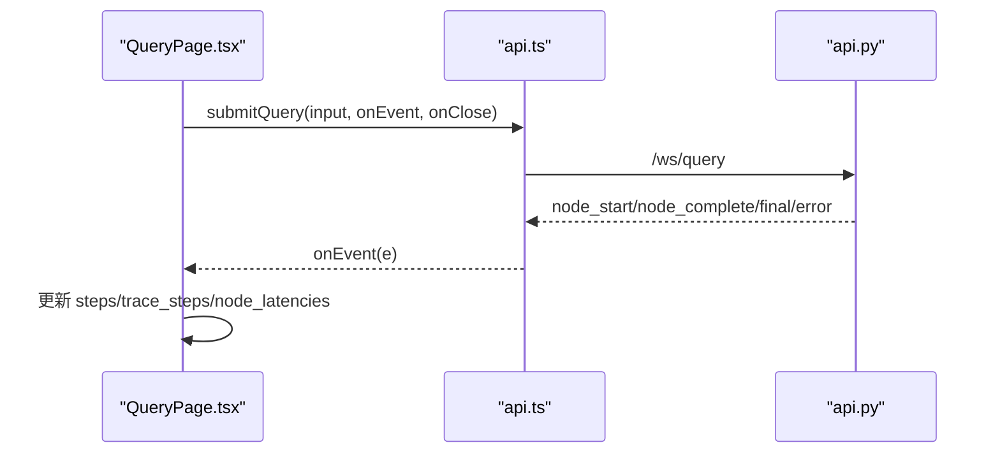
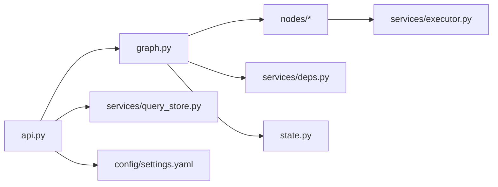

# 性能监控

<cite>
**本文引用的文件**   
- [graph.py](file://nl2sql_agent/graph.py)
- [api.py](file://nl2sql_agent/api.py)
- [state.py](file://nl2sql_agent/state.py)
- [executor.py](file://nl2sql_agent/services/executor.py)
- [deps.py](file://nl2sql_agent/services/deps.py)
- [settings.yaml](file://nl2sql_agent/config/settings.yaml)
- [m10_sandbox_execution.py](file://nl2sql_agent/nodes/m10_sandbox_execution.py)
- [m9_sensitive_check.py](file://nl2sql_agent/nodes/m9_sensitive_check.py)
- [QueryPage.tsx](file://web/src/pages/QueryPage.tsx)
- [api.ts](file://web/src/api.ts)
- [query_store.py](file://nl2sql_agent/services/query_store.py)
</cite>

## 目录
1. [简介](#简介)
2. [项目结构](#项目结构)
3. [核心组件](#核心组件)
4. [架构总览](#架构总览)
5. [详细组件分析](#详细组件分析)
6. [依赖关系分析](#依赖关系分析)
7. [性能指标与计算方法](#性能指标与计算方法)
8. [慢查询检测与告警](#慢查询检测与告警)
9. [执行计划分析与优化建议](#执行计划分析与优化建议)
10. [基准测试与回归检测](#基准测试与回归检测)
11. [监控仪表板与实时查看](#监控仪表板与实时查看)
12. [性能调优最佳实践](#性能调优最佳实践)
13. [故障排查指南](#故障排查指南)
14. [结论](#结论)

## 简介
本文件面向 NL2SQL 系统的性能监控，围绕“执行统计收集、关键指标定义与计算、慢查询检测与告警、执行计划分析、基准与回归、监控仪表板与调优”等主题进行系统化说明。系统通过 LangGraph 编排的节点链路对每次查询进行端到端追踪，并在图层自动采集各节点耗时与步骤顺序；在执行层通过 EXPLAIN 预估行数、只读事务与超时控制保障稳定性；前端提供节点延迟可视化与历史审计能力，便于定位瓶颈与开展性能回归检测。

## 项目结构
- 后端：FastAPI API + LangGraph 图编排（节点封装、事件推送、重试路由）+ SQL 执行器（Postgres/MySQL/内存）+ SQLite 查询存储
- 前端：React + Ant Design，WebSocket 流式事件展示、节点延迟侧边栏、历史与审计页
- 配置：settings.yaml 集中管理执行参数（超时、限制、EXPLAIN 阈值），敏感规则、复杂度规则等

**图表来源** 
- [api.py](file://nl2sql_agent/api.py)
- [graph.py](file://nl2sql_agent/graph.py)
- [executor.py](file://nl2sql_agent/services/executor.py)
- [m10_sandbox_execution.py](file://nl2sql_agent/nodes/m10_sandbox_execution.py)
- [m9_sensitive_check.py](file://nl2sql_agent/nodes/m9_sensitive_check.py)
- [settings.yaml](file://nl2sql_agent/config/settings.yaml)
- [query_store.py](file://nl2sql_agent/services/query_store.py)

**章节来源**
- [api.py](file://nl2sql_agent/api.py)
- [graph.py](file://nl2sql_agent/graph.py)
- [state.py](file://nl2sql_agent/state.py)
- [executor.py](file://nl2sql_agent/services/executor.py)
- [settings.yaml](file://nl2sql_agent/config/settings.yaml)

## 核心组件
- 图编排与追踪：_traced 包装器在每个节点前后记录开始/完成事件，并写入 state.node_latencies 与 state.trace_steps
- 事件桥接：EventStream 将线程内事件推送到 WebSocket 队列，前端实时渲染
- 执行器：PostgresExecutor/MySQLExecutor/InMemoryExecutor，统一接口 explain/execute，支持只读事务与超时
- 状态模型：NL2SQLState 包含 trace_id、node_latencies、trace_steps、execution_error 等字段
- 查询存储：SQLite 持久化 trace_id、status、plan、retrieved_schema、node_latencies、trace_steps 等

**章节来源**
- [graph.py](file://nl2sql_agent/graph.py)
- [api.py](file://nl2sql_agent/api.py)
- [state.py](file://nl2sql_agent/state.py)
- [executor.py](file://nl2sql_agent/services/executor.py)
- [query_store.py](file://nl2sql_agent/services/query_store.py)

## 架构总览
下图展示了从前端到后端、图编排、执行器的完整调用链，以及事件与状态的流转路径。

**图表来源** 
- [api.py](file://nl2sql_agent/api.py)
- [graph.py](file://nl2sql_agent/graph.py)
- [m10_sandbox_execution.py](file://nl2sql_agent/nodes/m10_sandbox_execution.py)
- [executor.py](file://nl2sql_agent/services/executor.py)
- [query_store.py](file://nl2sql_agent/services/query_store.py)

## 详细组件分析

### 图编排与节点追踪
- _traced(name, fn, sink)：在节点执行前后记录 perf_counter 时间戳，计算 latency_ms，合并到 state.node_latencies，追加 name 到 state.trace_steps，并通过 event_sink 推送 node_start/node_complete
- retry 路由：_retry_route 在触发重试时推送 retry 事件，包含 attempt 与 reason
- 构建图：build_graph 将所有节点以 traced 包装，注册 interrupt_before 节点用于人工确认/澄清

**图表来源** 
- [graph.py](file://nl2sql_agent/graph.py)

**章节来源**
- [graph.py](file://nl2sql_agent/graph.py)

### 执行器与 EXPLAIN 预估
- PostgresExecutor：EXPLAIN (FORMAT JSON) 取 Plan Rows；execute 使用 READ ONLY 事务与 statement_timeout
- MySQLExecutor：EXPLAIN FORMAT=JSON 递归取最大 rows；execute 使用 START TRANSACTION READ ONLY 与 MAX_EXECUTION_TIME
- InMemoryExecutor：模拟 EXPLAIN 与 execute 行为，用于测试

**图表来源** 
- [executor.py](file://nl2sql_agent/services/executor.py)

**章节来源**
- [executor.py](file://nl2sql_agent/services/executor.py)

### 沙箱执行与慢查询拦截
- m10_sandbox_execution：执行前 EXPLAIN 守门，超过阈值直接拒绝；未聚合查询强制 LIMIT；执行带超时；失败回退至 SQL 生成节点重试
- m9_sensitive_check：敏感字段匹配与 EXPLAIN 扫描阈值判定，支持 approval_required/hard_block

**图表来源** 
- [m10_sandbox_execution.py](file://nl2sql_agent/nodes/m10_sandbox_execution.py)
- [executor.py](file://nl2sql_agent/services/executor.py)

**章节来源**
- [m10_sandbox_execution.py](file://nl2sql_agent/nodes/m10_sandbox_execution.py)
- [m9_sensitive_check.py](file://nl2sql_agent/nodes/m9_sensitive_check.py)

### 前端实时展示与延迟侧边栏
- QueryPage.tsx：接收 final/error 事件，维护 steps、trace_steps、node_latencies；侧边栏按节点名显示延迟毫秒数
- api.ts：WebSocket 连接与消息处理，提交查询并回调 onEvent

**图表来源** 
- [QueryPage.tsx](file://web/src/pages/QueryPage.tsx)
- [api.ts](file://web/src/api.ts)
- [api.py](file://nl2sql_agent/api.py)

**章节来源**
- [QueryPage.tsx](file://web/src/pages/QueryPage.tsx)
- [api.ts](file://web/src/api.ts)

## 依赖关系分析
- graph.py 依赖 nl2sql_agent.nodes.* 与 services.deps.Deps，负责节点编排与事件推送
- api.py 依赖 graph.py、services.checkpoint、services.query_store，负责请求处理与持久化
- executor.py 提供 SQLExecutor 抽象及具体实现，被 m10_sandbox_execution.py 调用
- settings.yaml 提供执行参数（timeout_seconds、limit、explain_row_threshold）
- state.py 定义 NL2SQLState，承载 trace_id、node_latencies、trace_steps 等

**图表来源** 
- [api.py](file://nl2sql_agent/api.py)
- [graph.py](file://nl2sql_agent/graph.py)
- [executor.py](file://nl2sql_agent/services/executor.py)
- [settings.yaml](file://nl2sql_agent/config/settings.yaml)
- [query_store.py](file://nl2sql_agent/services/query_store.py)
- [state.py](file://nl2sql_agent/state.py)

**章节来源**
- [deps.py](file://nl2sql_agent/services/deps.py)
- [settings.yaml](file://nl2sql_agent/config/settings.yaml)

## 性能指标与计算方法
- 执行时间（节点级）：每个节点由 _traced 记录 latency_ms，保存在 state.node_latencies[node_name]
- 端到端延迟：trace_steps 顺序串联，可汇总所有节点 latency_ms 得到总耗时
- 吞吐量：单位时间内完成的查询数（可通过 /api/history 拉取 finished_at 统计）
- 并发数：同时活跃的 trace_id 数量（需结合外部监控系统）
- 缓存命中率：语义缓存未实现（预留 semantic_cache 扩展点），当前为 0%
- 错误率：execution_error 非空的比例（可从 query_store 中统计 status="error"）
- P95/P99 延迟：基于 node_latencies 或总耗时分位数计算（需在外部工具中聚合）
- 资源消耗：数据库侧 CPU/IO/锁等待需借助数据库监控；应用侧内存/CPU 需外部 APM

说明：
- 节点延迟采集位置：[graph.py:_traced](file://nl2sql_agent/graph.py)
- 状态字段位置：[state.py:NL2SQLState](file://nl2sql_agent/state.py)
- 历史与审计接口：[api.py:/api/history,/api/audit](file://nl2sql_agent/api.py)
- 存储持久化：[query_store.py:save_query/update_query](file://nl2sql_agent/services/query_store.py)

**章节来源**
- [graph.py](file://nl2sql_agent/graph.py)
- [state.py](file://nl2sql_agent/state.py)
- [api.py](file://nl2sql_agent/api.py)
- [query_store.py](file://nl2sql_agent/services/query_store.py)

## 慢查询检测与告警
- 阈值配置：settings.yaml 中 execution.explain_row_threshold 控制 EXPLAIN 预估行数上限；m9_sensitive_check 与 m10_sandbox_execution 均使用该阈值
- 自动拦截策略：
  - 模块9：敏感字段命中或 EXPLAIN 预估超阈 → approval_required/hard_block
  - 模块10：EXPLAIN 超阈 → 直接拒绝执行；未聚合查询强制 LIMIT；执行超时视为 execution_error
- 告警建议：
  - 当 execution_error 频繁出现或 latency_ms 超过阈值（如 P95>2s）时触发告警
  - 结合 /api/history 的 finished_at 与 status 统计错误率与慢查询比例

**章节来源**
- [settings.yaml](file://nl2sql_agent/config/settings.yaml)
- [m9_sensitive_check.py](file://nl2sql_agent/nodes/m9_sensitive_check.py)
- [m10_sandbox_execution.py](file://nl2sql_agent/nodes/m10_sandbox_execution.py)

## 执行计划分析与优化建议
- EXPLAIN 结果解读：
  - Postgres：Plan Rows 作为预估扫描行数
  - MySQL：estimate_max_rows 递归取最大 rows
- 索引使用分析：
  - 通过 schema_ingest 获取 pg_indexes/indexdef（Postgres）或表索引信息（MySQL），结合 EXPLAIN 输出判断是否走索引
- 优化建议：
  - 若 EXPLAIN 预估行数过大，优先增加过滤条件或索引
  - 避免全表扫描与大表 JOIN，必要时拆分查询或使用物化视图
  - 对高频复杂查询建立专用索引或预聚合表

**章节来源**
- [executor.py](file://nl2sql_agent/services/executor.py)

## 基准测试与回归检测
- 基准方法：
  - 构造典型查询集（简单/复杂/敏感/大表），固定输入与数据快照
  - 运行多次，收集 node_latencies 与总耗时，计算 P50/P95/P99
- 压力测试场景：
  - 并发提交不同 trace_id 的查询，观察错误率与延迟分布
  - 逐步提升并发度，找到系统瓶颈（CPU/DB 连接池/网络）
- 回归检测：
  - 对比历史 P95/P99 与错误率，超出阈值即标记回归
  - 结合 /api/history 的 finished_at 与 status 做趋势分析

[本节为方法论说明，不直接分析具体文件]

## 监控仪表板与实时查看
- 实时查看：
  - WebSocket 推送 node_start/node_complete/final/error，前端即时渲染
  - 侧边栏显示 node_latencies[n] 毫秒值
- 历史与审计：
  - /api/history 拉取列表，/api/audit/{trace_id} 获取详情（含 feedbacks）
- 仪表板建议：
  - 展示 P95/P99 延迟曲线、错误率趋势、慢查询 TopN
  - 关联 trace_id 下钻到节点级延迟与 EXPLAIN 结果

**章节来源**
- [QueryPage.tsx](file://web/src/pages/QueryPage.tsx)
- [api.py](file://nl2sql_agent/api.py)

## 性能调优最佳实践
- 执行层：
  - 合理设置 execution.timeout_seconds 与 execution.limit，防止长尾与内存溢出
  - 保持只读事务与 EXPLAIN 阈值，避免危险查询
- 查询层：
  - 优先使用聚合与过滤减少扫描行数
  - 避免无索引的大表 JOIN，必要时引入物化视图
- 观测层：
  - 定期导出 node_latencies 与 trace_steps，分析热点节点
  - 结合数据库监控（慢查询日志、锁等待）定位根因

**章节来源**
- [settings.yaml](file://nl2sql_agent/config/settings.yaml)
- [executor.py](file://nl2sql_agent/services/executor.py)

## 故障排查指南
- 常见问题：
  - EXPLAIN 失败：检查数据库连接与权限（模块9静默跳过，模块10报错退回）
  - 执行超时：增大 timeout_seconds 或优化 SQL
  - 结果为空：检查过滤条件与索引
- 排查步骤：
  - 通过 /api/audit/{trace_id} 查看 trace_steps 与 node_latencies
  - 定位高延迟节点，结合 EXPLAIN 与索引使用情况优化
  - 关注 execution_error 与 blocked_reason 字段

**章节来源**
- [m9_sensitive_check.py](file://nl2sql_agent/nodes/m9_sensitive_check.py)
- [m10_sandbox_execution.py](file://nl2sql_agent/nodes/m10_sandbox_execution.py)
- [api.py](file://nl2sql_agent/api.py)

## 结论
本系统通过图编排与节点追踪实现了细粒度的执行统计收集，结合 EXPLAIN 预估行数与只读事务/超时控制保障了执行安全。前端提供实时延迟展示与历史审计能力，便于快速定位瓶颈与开展回归检测。建议在现有基础上引入语义缓存与外部 APM，完善 P95/P99 与资源消耗监控，持续优化查询与索引策略，提升整体性能与稳定性。