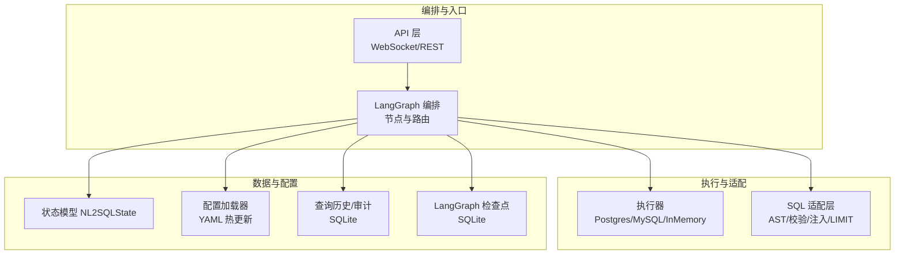
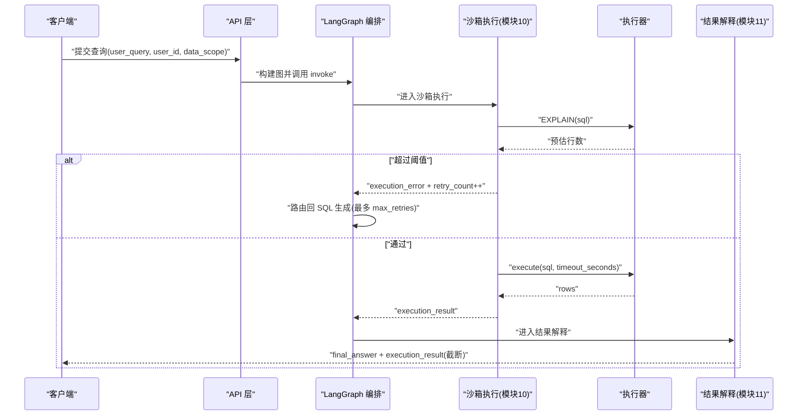
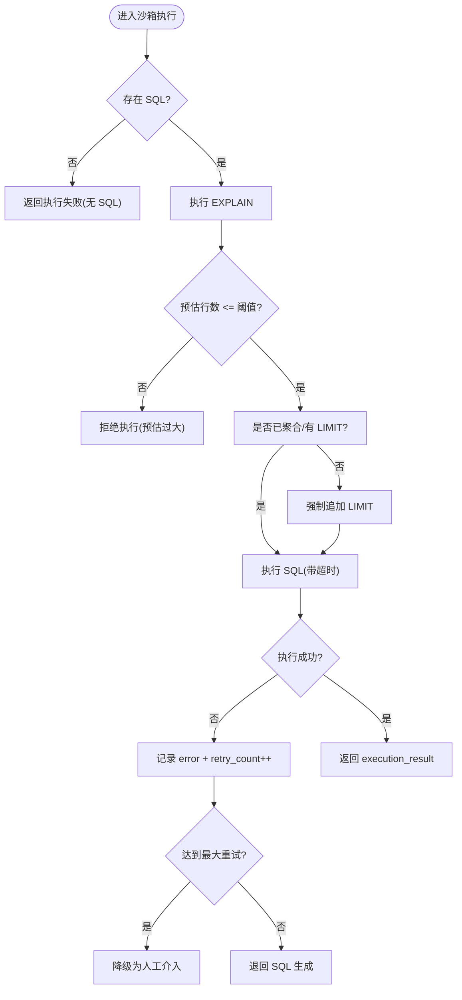
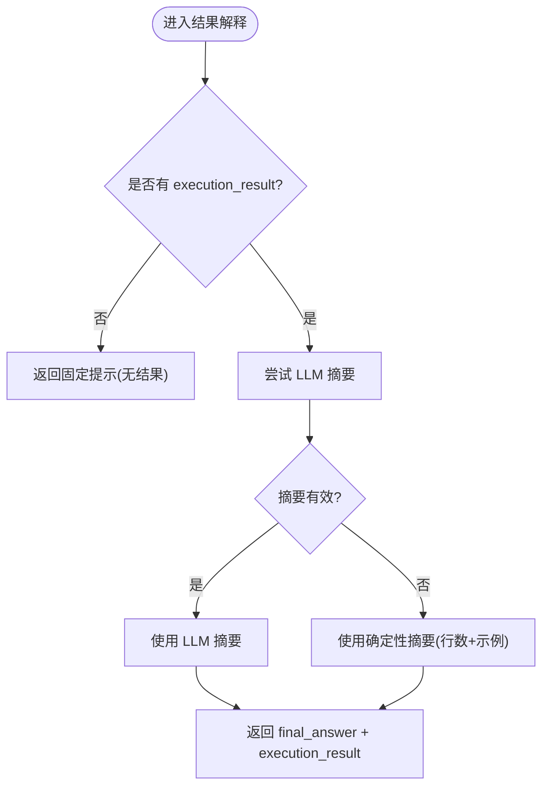
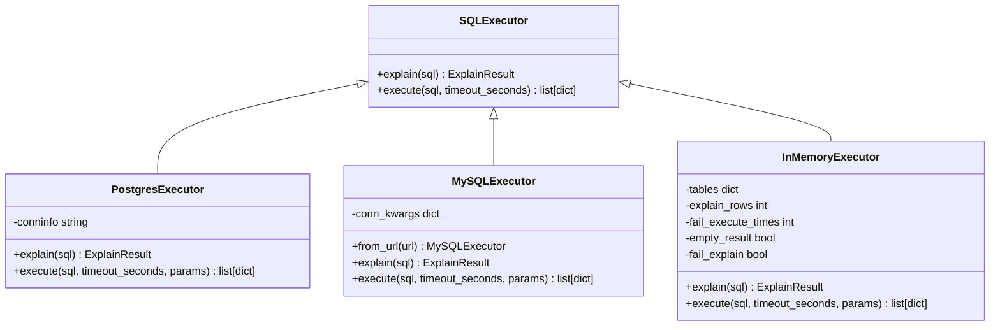
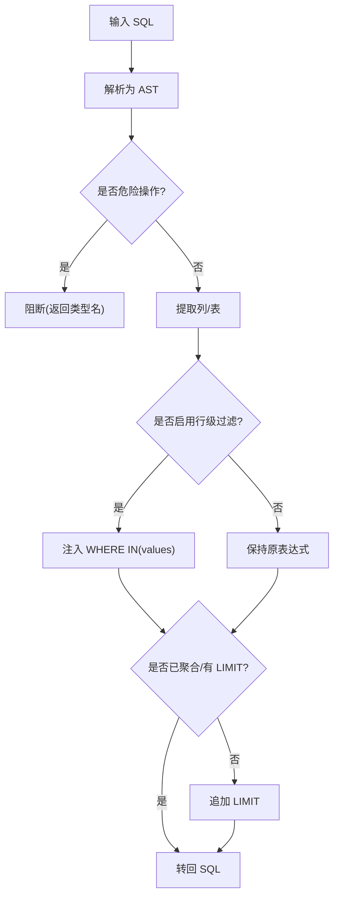
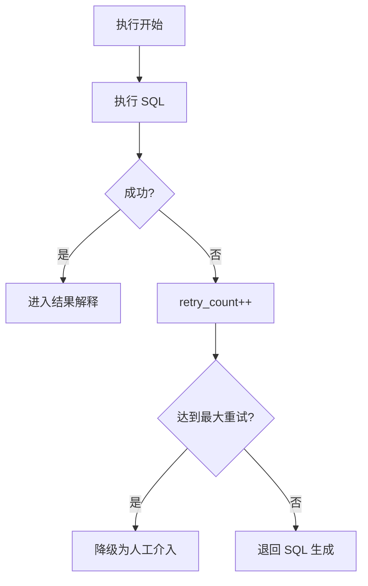
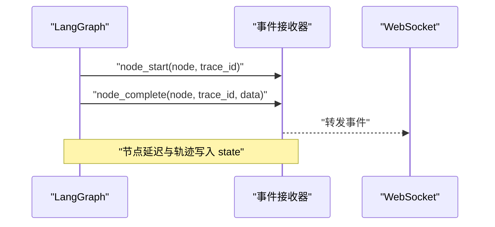
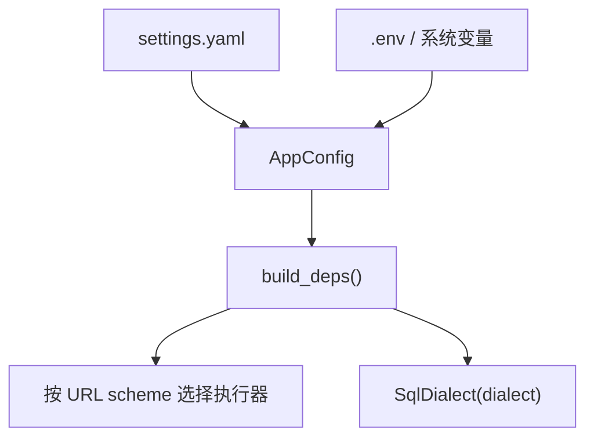
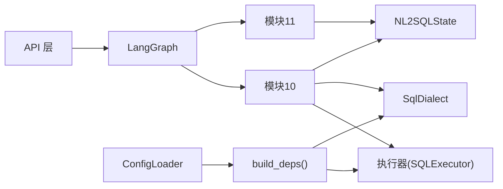

# 执行引擎

<cite>
**本文引用的文件**   
- [m10_sandbox_execution.py](file://nl2sql_agent/nodes/m10_sandbox_execution.py)
- [m11_result_interpretation.py](file://nl2sql_agent/nodes/m11_result_interpretation.py)
- [executor.py](file://nl2sql_agent/services/executor.py)
- [sql_dialect.py](file://nl2sql_agent/services/sql_dialect.py)
- [state.py](file://nl2sql_agent/state.py)
- [graph.py](file://nl2sql_agent/graph.py)
- [api.py](file://nl2sql_agent/api.py)
- [config_loader.py](file://nl2sql_agent/services/config_loader.py)
- [settings.yaml](file://nl2sql_agent/config/settings.yaml)
- [deps.py](file://nl2sql_agent/services/deps.py)
- [checkpoint.py](file://nl2sql_agent/services/checkpoint.py)
- [query_store.py](file://nl2sql_agent/services/query_store.py)
</cite>

## 目录
1. [简介](#简介)
2. [项目结构](#项目结构)
3. [核心组件](#核心组件)
4. [架构总览](#架构总览)
5. [详细组件分析](#详细组件分析)
6. [依赖关系分析](#依赖关系分析)
7. [性能考量](#性能考量)
8. [故障排查指南](#故障排查指南)
9. [结论](#结论)
10. [附录](#附录)

## 简介
本文件为“执行引擎”的完整技术文档，聚焦于沙箱执行环境、结果解释算法、错误处理策略、多数据库方言适配与 SQL 适配层、性能监控与诊断、以及配置与调优建议。目标是让具备不同技术背景的读者都能理解并高效使用该系统。

## 项目结构
执行引擎由“节点编排（LangGraph）+ 执行器 + SQL 适配层 + 状态模型 + 配置加载 + 持久化与事件流”组成：
- 节点编排：定义 11 个模块及路由规则，确保重试边界清晰、错误就近消化。
- 执行器：Postgres/MySQL/内存三种实现，统一只读、超时与 EXPLAIN 能力。
- SQL 适配层：基于 sqlglot 的 AST 解析、危险操作检测、行级权限注入、强制 LIMIT。
- 状态模型：NL2SQLState 贯穿全链路，承载用户输入、计划、SQL、执行结果、追踪信息。
- 配置加载：YAML 热更新，运行时参数集中管理。
- 持久化与事件流：SQLite 检查点与查询历史，WebSocket/REST 事件推送。

图表来源
- [graph.py:174-313](file://nl2sql_agent/graph.py#L174-L313)
- [executor.py:1-205](file://nl2sql_agent/services/executor.py#L1-L205)
- [sql_dialect.py:1-111](file://nl2sql_agent/services/sql_dialect.py#L1-L111)
- [state.py:83-146](file://nl2sql_agent/state.py#L83-L146)
- [config_loader.py:14-36](file://nl2sql_agent/services/config_loader.py#L14-L36)
- [query_store.py:31-96](file://nl2sql_agent/services/query_store.py#L31-L96)
- [checkpoint.py:32-40](file://nl2sql_agent/services/checkpoint.py#L32-L40)

章节来源
- [graph.py:174-313](file://nl2sql_agent/graph.py#L174-L313)
- [api.py:1-573](file://nl2sql_agent/api.py#L1-L573)

## 核心组件
- 沙箱执行节点（模块 10）：执行前 EXPLAIN 预估行数拦截；未聚合查询强制 LIMIT；带超时执行；失败退回 SQL 生成，打满重试后降级人工介入。
- 结果解释节点（模块 11）：优先 LLM 摘要，不可用时确定性兜底；保留原始数据供核对。
- 执行器抽象与实现：统一 explain/execute 接口；Postgres/MySQL 只读事务与超时控制；内存执行器用于测试/离线。
- SQL 适配层：AST 解析、危险操作检测、列抽取、行级权限注入、未聚合强制 LIMIT。
- 状态模型：贯穿全流程的状态字段，含重试计数、阻塞原因、执行结果、追踪步骤等。
- 配置加载：settings.yaml 与规则 YAML 热更新，环境变量覆盖。
- 持久化与事件流：SQLite 检查点恢复中断流程；查询历史与反馈存储；WebSocket/REST 事件推送。

章节来源
- [m10_sandbox_execution.py:1-65](file://nl2sql_agent/nodes/m10_sandbox_execution.py#L1-L65)
- [m11_result_interpretation.py:1-39](file://nl2sql_agent/nodes/m11_result_interpretation.py#L1-L39)
- [executor.py:1-205](file://nl2sql_agent/services/executor.py#L1-L205)
- [sql_dialect.py:1-111](file://nl2sql_agent/services/sql_dialect.py#L1-L111)
- [state.py:83-146](file://nl2sql_agent/state.py#L83-L146)
- [config_loader.py:14-36](file://nl2sql_agent/services/config_loader.py#L14-L36)
- [settings.yaml:1-30](file://nl2sql_agent/config/settings.yaml#L1-L30)
- [query_store.py:31-96](file://nl2sql_agent/services/query_store.py#L31-L96)
- [checkpoint.py:32-40](file://nl2sql_agent/services/checkpoint.py#L32-L40)

## 架构总览
下图展示从请求到执行的端到端流程，包括沙箱执行与结果解释的关键路径。

图表来源
- [graph.py:174-313](file://nl2sql_agent/graph.py#L174-L313)
- [m10_sandbox_execution.py:31-65](file://nl2sql_agent/nodes/m10_sandbox_execution.py#L31-L65)
- [executor.py:53-159](file://nl2sql_agent/services/executor.py#L53-L159)
- [m11_result_interpretation.py:25-39](file://nl2sql_agent/nodes/m11_result_interpretation.py#L25-L39)

## 详细组件分析

### 沙箱执行环境设计（模块 10）
- 只读账号连接：Postgres 使用 READ ONLY 事务；MySQL 使用 START TRANSACTION READ ONLY。
- 资源限制控制：statement_timeout/MAX_EXECUTION_TIME 设置超时；未聚合查询强制 LIMIT。
- 执行前 EXPLAIN 检查：预估扫描行数超过阈值直接拒绝，避免大表扫描。
- 超时熔断机制：执行超时视为 execution_error，触发重试或降级。
- 空结果合法：空结果是业务结果，直接进入结果解释，不退回改写 SQL。
- 重试与降级：执行失败退回 SQL 生成，重试次数打满后输出“请人工介入”。

图表来源
- [m10_sandbox_execution.py:31-65](file://nl2sql_agent/nodes/m10_sandbox_execution.py#L31-L65)
- [executor.py:53-159](file://nl2sql_agent/services/executor.py#L53-L159)
- [sql_dialect.py:96-111](file://nl2sql_agent/services/sql_dialect.py#L96-L111)

章节来源
- [m10_sandbox_execution.py:1-65](file://nl2sql_agent/nodes/m10_sandbox_execution.py#L1-L65)
- [executor.py:53-159](file://nl2sql_agent/services/executor.py#L53-L159)
- [sql_dialect.py:96-111](file://nl2sql_agent/services/sql_dialect.py#L96-L111)

### 结果解释算法（模块 11）
- 自然语言摘要：优先调用 LLM 生成摘要；若 LLM 不可用或返回为空，则使用确定性摘要兜底。
- 表格格式化：最终答案包含简要摘要，同时保留 execution_result 供前端表格展示与核对。
- 数据可视化支持：前端可基于 execution_result 渲染表格/图表；后端提供结构化数据。

图表来源
- [m11_result_interpretation.py:25-39](file://nl2sql_agent/nodes/m11_result_interpretation.py#L25-L39)

章节来源
- [m11_result_interpretation.py:1-39](file://nl2sql_agent/nodes/m11_result_interpretation.py#L1-L39)

### 执行器与多数据库方言支持
- 抽象接口：SQLExecutor 定义 explain/execute 方法。
- PostgresExecutor：只读账号 + READ ONLY 事务 + statement_timeout；EXPLAIN FORMAT JSON。
- MySQLExecutor：START TRANSACTION READ ONLY + MAX_EXECUTION_TIME；EXPLAIN FORMAT=JSON。
- InMemoryExecutor：测试/演示用，支持模拟失败、空结果、自定义 EXPLAIN 行数。
- 方言选择：根据 database_url scheme 自动选择执行器；sqlglot 解析按 dialect 进行。

图表来源
- [executor.py:23-205](file://nl2sql_agent/services/executor.py#L23-L205)

章节来源
- [executor.py:1-205](file://nl2sql_agent/services/executor.py#L1-L205)
- [deps.py:72-84](file://nl2sql_agent/services/deps.py#L72-L84)

### SQL 适配层设计（SqlDialect）
- AST 解析与转换：parse/to_sql 基于 sqlglot，支持多方言。
- 危险操作检测：非 SELECT 类顶层节点或内部命令被识别为危险，阻止执行。
- 列抽取与敏感判定：extract_columns/is_select_column/is_column_in_aggregate。
- 行级权限注入：inject_row_level_filter 在 WHERE 中追加 IN(values)。
- 未聚合强制 LIMIT：has_aggregate_or_limit/enforce_limit。

图表来源
- [sql_dialect.py:22-111](file://nl2sql_agent/services/sql_dialect.py#L22-L111)

章节来源
- [sql_dialect.py:1-111](file://nl2sql_agent/services/sql_dialect.py#L1-L111)

### 错误处理策略
- 执行失败重试：模块 10 报错退回模块 7（SQL 生成），最多 max_retries 次。
- 降级处理：重试打满后输出“请人工介入”，避免死循环。
- 危险 SQL 硬失败：静态校验发现危险操作直接结束，不进入重试。
- 空结果合法：空结果直接进入结果解释，不触发重试。
- 计划校验失败：仅在计划路径内重试，不退回 Schema 检索。

图表来源
- [m10_sandbox_execution.py:20-28](file://nl2sql_agent/nodes/m10_sandbox_execution.py#L20-L28)
- [graph.py:164-170](file://nl2sql_agent/graph.py#L164-L170)

章节来源
- [m10_sandbox_execution.py:1-65](file://nl2sql_agent/nodes/m10_sandbox_execution.py#L1-L65)
- [graph.py:146-170](file://nl2sql_agent/graph.py#L146-L170)

### 性能监控指标与执行统计
- 节点延迟：每个节点记录 node_latencies（毫秒）。
- 执行轨迹：trace_steps 记录节点顺序。
- 事件推送：node_start/node_complete/retry/interrupt/final/error/done 事件通过 WebSocket 推送。
- 结果截断：execution_result 在前端仅展示前 20 行，降低刷屏风险。
- 持久化：查询历史与审计记录保存关键状态与统计。

图表来源
- [graph.py:72-103](file://nl2sql_agent/graph.py#L72-L103)
- [api.py:54-66](file://nl2sql_agent/api.py#L54-L66)

章节来源
- [graph.py:72-103](file://nl2sql_agent/graph.py#L72-L103)
- [api.py:54-66](file://nl2sql_agent/api.py#L54-L66)
- [query_store.py:31-96](file://nl2sql_agent/services/query_store.py#L31-L96)

### 执行环境的配置选项与资源调优
- settings.yaml 关键项：
  - dialect：mysql/postgres
  - execution.limit：未聚合查询强制 LIMIT
  - execution.timeout_seconds：查询超时
  - execution.explain_row_threshold：EXPLAIN 预估行数阈值
  - row_level_filter.enabled/column：行级过滤开关与列名
- 环境变量覆盖：DATABASE_URL、PG_DATABASE_URL 等
- 配置热更新：ConfigLoader 基于 mtime 自动重载

图表来源
- [settings.yaml:1-30](file://nl2sql_agent/config/settings.yaml#L1-L30)
- [deps.py:107-178](file://nl2sql_agent/services/deps.py#L107-L178)
- [config_loader.py:14-36](file://nl2sql_agent/services/config_loader.py#L14-L36)

章节来源
- [settings.yaml:1-30](file://nl2sql_agent/config/settings.yaml#L1-L30)
- [deps.py:107-178](file://nl2sql_agent/services/deps.py#L107-L178)
- [config_loader.py:14-36](file://nl2sql_agent/services/config_loader.py#L14-L36)

## 依赖关系分析
- 节点依赖：模块 10/11 依赖 deps.executor、deps.sql、deps.config。
- 执行器依赖：PostgresExecutor 依赖 psycopg；MySQLExecutor 依赖 pymysql；InMemoryExecutor 依赖 sqlglot。
- 状态依赖：NL2SQLState 被 graph、api、store 共同使用。
- 配置依赖：ConfigLoader 读取 settings.yaml 与各规则 YAML。

图表来源
- [graph.py:174-313](file://nl2sql_agent/graph.py#L174-L313)
- [executor.py:23-205](file://nl2sql_agent/services/executor.py#L23-L205)
- [sql_dialect.py:12-111](file://nl2sql_agent/services/sql_dialect.py#L12-L111)
- [state.py:83-146](file://nl2sql_agent/state.py#L83-L146)
- [deps.py:107-178](file://nl2sql_agent/services/deps.py#L107-L178)
- [config_loader.py:14-36](file://nl2sql_agent/services/config_loader.py#L14-L36)

章节来源
- [graph.py:174-313](file://nl2sql_agent/graph.py#L174-L313)
- [deps.py:107-178](file://nl2sql_agent/services/deps.py#L107-L178)

## 性能考量
- EXPLAIN 预估行数阈值：合理设置 explain_row_threshold，避免大表扫描。
- 超时熔断：timeout_seconds 需结合数据库负载与查询复杂度调整。
- LIMIT 默认值：execution.limit 应平衡结果完整性与传输开销。
- 节点延迟监控：关注 node_latencies 热点节点，优化 LLM 调用或 SQL 生成。
- 结果截断：execution_result 仅前 20 行，减少网络与前端渲染压力。
- 向量存储后端：pgvector 适合大规模语义检索，内存模式适合开发/小规模。

[本节为通用指导，无需特定文件引用]

## 故障排查指南
- 执行失败重试：查看 execution_error 与 retry_count；确认是否达到 max_retries。
- 危险 SQL 拦截：blocked_reason 非空表示被静态校验阻断，检查 SQL 生成逻辑。
- 计划校验失败：plan_validation_errors 非空时，仅在计划路径重试，不退回 Schema 检索。
- 空结果合法：execution_result 为空但无 error，直接进入结果解释。
- 超时问题：检查 timeout_seconds 与数据库 MAX_EXECUTION_TIME/statement_timeout。
- 配置热更新：修改 settings.yaml 后无需重启，下一次读取即生效。
- 检查点恢复：服务重启后可通过 SQLite 检查点恢复中断流程（human_review/clarify_*）。

章节来源
- [m10_sandbox_execution.py:20-28](file://nl2sql_agent/nodes/m10_sandbox_execution.py#L20-L28)
- [graph.py:146-170](file://nl2sql_agent/graph.py#L146-L170)
- [query_store.py:31-96](file://nl2sql_agent/services/query_store.py#L31-L96)
- [checkpoint.py:32-40](file://nl2sql_agent/services/checkpoint.py#L32-L40)

## 结论
执行引擎以 LangGraph 编排为核心，结合只读执行器、AST 驱动的 SQL 适配层与严格的重试/降级策略，实现了安全、可控、可观测的自然语言到 SQL 的执行闭环。通过配置化与热更新、完善的监控与持久化，系统在稳定性、性能与可维护性上均具备生产可用性。

[本节为总结，无需特定文件引用]

## 附录
- 术语映射与规则：term_mapping/*.yaml、clarification_rules.yaml、complexity_rules.yaml、sensitive_rules.yaml
- 评估与回归：eval/regression_set.yaml、run_eval.py
- 前端交互：web/src/pages/QueryPage.tsx、ApprovalsPage.tsx 等

[本节为补充说明，无需特定文件引用]