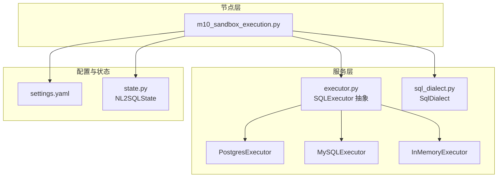
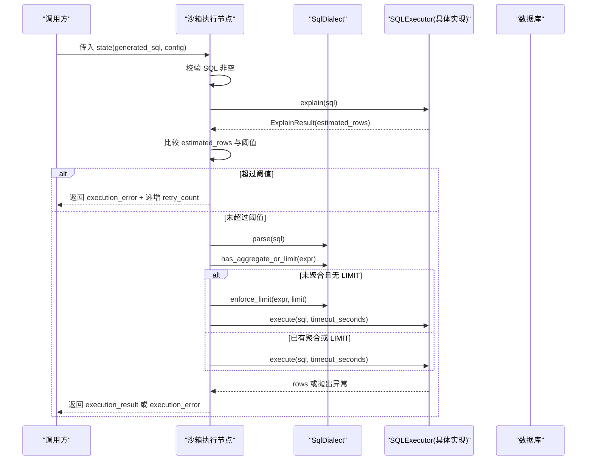
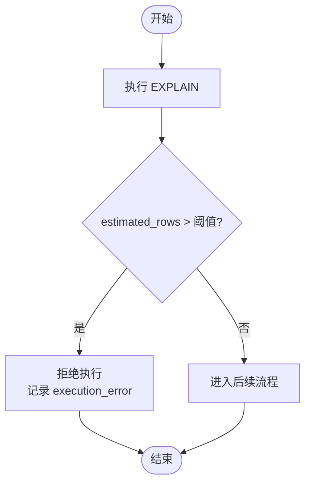
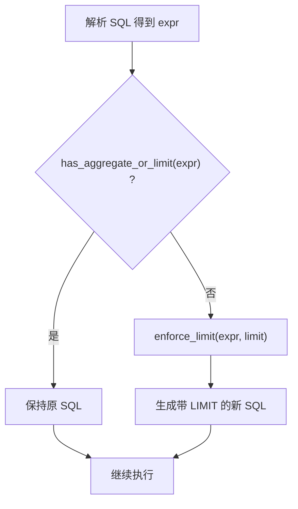
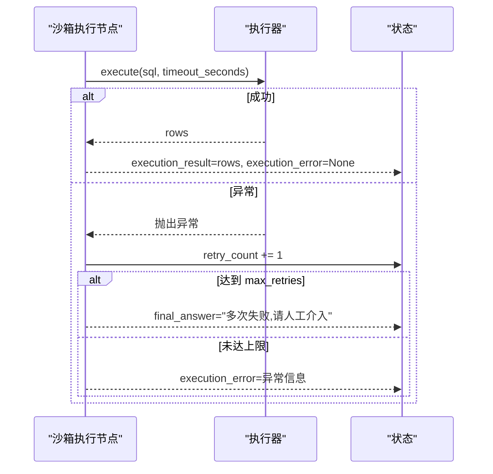
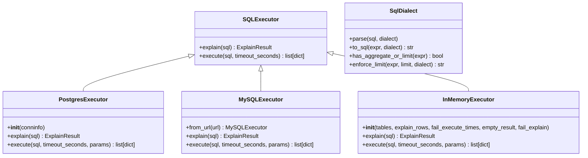

# 沙箱执行环境

<cite>
**本文引用的文件**   
- [m10_sandbox_execution.py](file://nl2sql_agent/nodes/m10_sandbox_execution.py)
- [executor.py](file://nl2sql_agent/services/executor.py)
- [sql_dialect.py](file://nl2sql_agent/services/sql_dialect.py)
- [settings.yaml](file://nl2sql_agent/config/settings.yaml)
- [state.py](file://nl2sql_agent/state.py)
- [test_routing.py](file://nl2sql_agent/tests/test_routing.py)
- [test_mysql_executor.py](file://nl2sql_agent/tests/test_mysql_executor.py)
</cite>

## 目录
1. [简介](#简介)
2. [项目结构](#项目结构)
3. [核心组件](#核心组件)
4. [架构总览](#架构总览)
5. [详细组件分析](#详细组件分析)
6. [依赖关系分析](#依赖关系分析)
7. [性能考量与调优](#性能考量与调优)
8. [故障排查指南](#故障排查指南)
9. [结论](#结论)

## 简介
本文件为“沙箱执行环境”的完整技术文档，聚焦以下目标：
- 只读账号连接机制：PostgresExecutor 的 READ ONLY 事务与 statement_timeout 设置；MySQLExecutor 的只读事务与 MAX_EXECUTION_TIME。
- 执行前 EXPLAIN 检查：预估扫描行数阈值、性能保护策略与拒绝执行条件。
- 未聚合查询强制 LIMIT：SQL 解析、聚合函数检测、LIMIT 注入逻辑与可配置 limit 值。
- 超时熔断机制：执行超时配置、超时异常处理与重试策略。
- 隔离设计、资源限制与安全性保障。
- 配置参数说明、性能调优建议与故障排查指南。

## 项目结构
沙箱执行相关代码主要分布在节点层与服务层：
- 节点层：m10_sandbox_execution.py 负责编排执行流程（EXPLAIN 守门、强制 LIMIT、带超时执行、错误回退）。
- 服务层：executor.py 提供 SQLExecutor 抽象及 PostgresExecutor/MySQLExecutor/InMemoryExecutor 实现；sql_dialect.py 提供 SQL 解析、AST 分析与强制 LIMIT 注入。
- 配置层：settings.yaml 集中定义执行相关参数（方言、只读、limit、超时、EXPLAIN 阈值等）。
- 状态层：state.py 定义 NL2SQLState 中的重试计数、执行结果与错误字段。

图表来源
- [m10_sandbox_execution.py:1-65](file://nl2sql_agent/nodes/m10_sandbox_execution.py#L1-L65)
- [executor.py:1-205](file://nl2sql_agent/services/executor.py#L1-L205)
- [sql_dialect.py:1-111](file://nl2sql_agent/services/sql_dialect.py#L1-L111)
- [settings.yaml:1-30](file://nl2sql_agent/config/settings.yaml#L1-L30)
- [state.py:1-146](file://nl2sql_agent/state.py#L1-L146)

章节来源
- [m10_sandbox_execution.py:1-65](file://nl2sql_agent/nodes/m10_sandbox_execution.py#L1-L65)
- [executor.py:1-205](file://nl2sql_agent/services/executor.py#L1-L205)
- [sql_dialect.py:1-111](file://nl2sql_agent/services/sql_dialect.py#L1-L111)
- [settings.yaml:1-30](file://nl2sql_agent/config/settings.yaml#L1-L30)
- [state.py:1-146](file://nl2sql_agent/state.py#L1-L146)

## 核心组件
- 沙箱执行节点（m10_sandbox_execution.py）
  - 入口：make_sandbox_execution_node(deps) 返回节点函数。
  - 流程：校验 SQL -> EXPLAIN 预估行数 -> 未聚合强制 LIMIT -> 执行（带超时）-> 返回结果或错误。
  - 错误处理：统一通过 _exec_fail(state, msg) 累计 retry_count，达到 max_retries 后输出 final_answer 降级提示。
- 执行器抽象与实现（executor.py）
  - SQLExecutor：抽象 explain/execute。
  - PostgresExecutor：READ ONLY 事务 + statement_timeout。
  - MySQLExecutor：START TRANSACTION READ ONLY + MAX_EXECUTION_TIME。
  - InMemoryExecutor：测试用，支持模拟失败、空结果、固定 EXPLAIN 行数。
- SQL 方言工具（sql_dialect.py）
  - parse/to_sql：基于 sqlglot 的解析与序列化。
  - has_aggregate_or_limit：检测是否已包含 GROUP BY/DISTINCT/AggFunc/LIMIT。
  - enforce_limit：在 AST 上追加 LIMIT 并生成 SQL。
- 配置（settings.yaml）
  - dialect、execution.read_only、execution.limit、execution.timeout_seconds、execution.explain_row_threshold。
- 状态（state.py）
  - retry_count、max_retries、execution_result、execution_error、final_answer 等字段用于控制重试与降级。

章节来源
- [m10_sandbox_execution.py:1-65](file://nl2sql_agent/nodes/m10_sandbox_execution.py#L1-L65)
- [executor.py:1-205](file://nl2sql_agent/services/executor.py#L1-L205)
- [sql_dialect.py:1-111](file://nl2sql_agent/services/sql_dialect.py#L1-L111)
- [settings.yaml:1-30](file://nl2sql_agent/config/settings.yaml#L1-L30)
- [state.py:1-146](file://nl2sql_agent/state.py#L1-L146)

## 架构总览
沙箱执行环境以“节点编排 + 执行器抽象 + SQL 解析工具”的分层架构实现安全可控的执行。

图表来源
- [m10_sandbox_execution.py:31-64](file://nl2sql_agent/nodes/m10_sandbox_execution.py#L31-L64)
- [executor.py:53-81](file://nl2sql_agent/services/executor.py#L53-L81)
- [sql_dialect.py:96-111](file://nl2sql_agent/services/sql_dialect.py#L96-L111)

## 详细组件分析

### 只读账号连接机制（PostgresExecutor 与 MySQLExecutor）
- PostgresExecutor
  - 连接：使用 psycopg 连接 conninfo。
  - 事务：BEGIN TRANSACTION READ ONLY 确保只读语义。
  - 超时：SET LOCAL statement_timeout = {timeout_seconds * 1000} 毫秒，由数据库层强制中断。
  - 执行：读取列描述，fetchall 转为 dict 列表返回。
- MySQLExecutor
  - 连接：pymysql 连接，支持 from_url 解析 URL。
  - 事务：START TRANSACTION READ ONLY 保证只读。
  - 超时：SET SESSION MAX_EXECUTION_TIME = {timeout_seconds * 1000} 毫秒。
  - 执行：DictCursor 直接返回行字典列表。
- 设计要点
  - 双保险：即使账号具备写权限，事务级只读也能阻止写操作。
  - 超时下沉到数据库层，避免应用侧轮询与资源占用。

章节来源
- [executor.py:53-81](file://nl2sql_agent/services/executor.py#L53-L81)
- [executor.py:83-159](file://nl2sql_agent/services/executor.py#L83-L159)

### 执行前 EXPLAIN 检查与性能保护
- 原理
  - 节点调用 deps.executor.explain(sql) 获取 EstimateResult。
  - 对比 est.estimated_rows 与 deps.config.explain_row_threshold。
  - 超过阈值直接拒绝执行，返回 execution_error 并递增 retry_count。
- 估算策略
  - Postgres：从 EXPLAIN (FORMAT JSON) 的 Plan Rows 取值。
  - MySQL：从 EXPLAIN FORMAT=JSON 递归取最大 rows，保守估计避免低估风险。
- 保护策略
  - 阈值默认 1,000,000（可配置），防止全表扫描或大结果集导致系统抖动。
  - 若 EXPLAIN 失败（如基础设施不可用），视为基础设施问题，由上层捕获并回退。

图表来源
- [m10_sandbox_execution.py:37-47](file://nl2sql_agent/nodes/m10_sandbox_execution.py#L37-L47)
- [executor.py:65-70](file://nl2sql_agent/services/executor.py#L65-L70)
- [executor.py:137-147](file://nl2sql_agent/services/executor.py#L137-L147)

章节来源
- [m10_sandbox_execution.py:37-47](file://nl2sql_agent/nodes/m10_sandbox_execution.py#L37-L47)
- [executor.py:31-50](file://nl2sql_agent/services/executor.py#L31-L50)
- [executor.py:65-70](file://nl2sql_agent/services/executor.py#L65-L70)
- [executor.py:137-147](file://nl2sql_agent/services/executor.py#L137-L147)

### 未聚合查询强制 LIMIT 机制
- 触发条件
  - 解析 SQL 得到 AST 表达式 expr。
  - 若不存在 LIMIT/GROUP BY/DISTINCT/聚合函数，则判定为“未聚合查询”。
- 注入逻辑
  - 使用 SqlDialect.enforce_limit(expr, limit, dialect) 在 AST 上追加 LIMIT 并生成新 SQL。
- 可配置 limit
  - 来自 settings.execution.limit，默认 1000。
- 目的
  - 防止无界结果集导致内存溢出或网络传输阻塞。

图表来源
- [sql_dialect.py:96-111](file://nl2sql_agent/services/sql_dialect.py#L96-L111)
- [m10_sandbox_execution.py:49-53](file://nl2sql_agent/nodes/m10_sandbox_execution.py#L49-L53)

章节来源
- [sql_dialect.py:96-111](file://nl2sql_agent/services/sql_dialect.py#L96-L111)
- [m10_sandbox_execution.py:49-53](file://nl2sql_agent/nodes/m10_sandbox_execution.py#L49-L53)

### 超时熔断与重试策略
- 超时配置
  - execution.timeout_seconds：默认 30 秒。
  - Postgres：statement_timeout（毫秒）。
  - MySQL：MAX_EXECUTION_TIME（毫秒）。
- 异常处理
  - 执行阶段抛出的异常被捕获，转换为 execution_error 并递增 retry_count。
  - 空结果是合法业务结果，不视为错误。
- 重试策略
  - 每次失败 retry_count += 1，当 retry_count >= max_retries（默认 3）时，输出 final_answer 降级提示“请人工介入”。
  - 退回模块：执行报错退回 SQL 生成（模块 7），而非计划生成（模块 5b），避免误改计划。

图表来源
- [m10_sandbox_execution.py:54-62](file://nl2sql_agent/nodes/m10_sandbox_execution.py#L54-L62)
- [state.py:118-133](file://nl2sql_agent/state.py#L118-L133)
- [test_routing.py:192-205](file://nl2sql_agent/tests/test_routing.py#L192-L205)

章节来源
- [m10_sandbox_execution.py:54-62](file://nl2sql_agent/nodes/m10_sandbox_execution.py#L54-L62)
- [state.py:118-133](file://nl2sql_agent/state.py#L118-L133)
- [test_routing.py:192-205](file://nl2sql_agent/tests/test_routing.py#L192-L205)

### 隔离设计与安全性保障
- 只读约束
  - Postgres：READ ONLY 事务；MySQL：START TRANSACTION READ ONLY。
  - 即使账号有写权限，事务级只读也能阻止写操作。
- 超时熔断
  - 数据库层超时（statement_timeout/MAX_EXECUTION_TIME）确保长时间查询被中断。
- 结果集限制
  - 未聚合查询强制 LIMIT，防止大结果集。
- 危险操作拦截
  - 上游静态校验（非 SELECT/DDL）会被拦截，不进入执行阶段。
- 资源隔离
  - 执行器独立连接池/会话，避免跨请求污染。
  - 测试执行器（InMemoryExecutor）支持模拟失败与空结果，便于验证边界场景。

章节来源
- [executor.py:53-81](file://nl2sql_agent/services/executor.py#L53-L81)
- [executor.py:83-159](file://nl2sql_agent/services/executor.py#L83-L159)
- [sql_dialect.py:22-38](file://nl2sql_agent/services/sql_dialect.py#L22-L38)

## 依赖关系分析
- 节点依赖
  - m10_sandbox_execution.py 依赖 executor.py（SQLExecutor 接口）、sql_dialect.py（AST 解析与 LIMIT 注入）、settings.yaml（配置）、state.py（状态字段）。
- 执行器依赖
  - PostgresExecutor 依赖 psycopg；MySQLExecutor 依赖 pymysql；InMemoryExecutor 依赖 sqlglot。
- 配置依赖
  - settings.yaml 中 execution.* 字段驱动节点行为。

图表来源
- [executor.py:23-205](file://nl2sql_agent/services/executor.py#L23-L205)
- [sql_dialect.py:12-111](file://nl2sql_agent/services/sql_dialect.py#L12-L111)

章节来源
- [executor.py:23-205](file://nl2sql_agent/services/executor.py#L23-L205)
- [sql_dialect.py:12-111](file://nl2sql_agent/services/sql_dialect.py#L12-L111)

## 性能考量与调优
- EXPLAIN 阈值
  - 根据数据规模与 SLA 调整 execution.explain_row_threshold，避免过大扫描。
- 超时时间
  - 根据查询复杂度与数据库响应能力调整 execution.timeout_seconds。
- LIMIT 大小
  - 根据前端展示需求与下游消费能力调整 execution.limit。
- 连接与并发
  - 合理设置连接池大小与超时，避免连接耗尽。
- 索引与统计信息
  - 确保数据库统计信息更新及时，提升 EXPLAIN 准确性。
- 测试与压测
  - 使用 InMemoryExecutor 模拟极端场景（失败、空结果、高预估行数）验证鲁棒性。

[本节为通用指导，不直接分析具体文件]

## 故障排查指南
- EXPLAIN 失败
  - 现象：节点返回 execution_error 包含“EXPLAIN 失败”。
  - 排查：确认数据库连通性、权限与统计信息；检查 SQL 语法。
- 预估行数超限
  - 现象：节点返回 execution_error 包含“超过阈值,拒绝执行”。
  - 排查：优化 SQL（增加过滤条件、索引）；适当提高阈值（谨慎）。
- 执行超时
  - 现象：节点返回 execution_error 包含“执行报错”，可能因超时。
  - 排查：检查慢查询日志；优化 SQL；调整 timeout_seconds。
- 始终失败并重试打满
  - 现象：最终输出 final_answer 包含“请人工介入”。
  - 排查：查看最近一次 execution_error；定位 SQL 或数据问题。
- 空结果
  - 现象：execution_result 为空数组，execution_error 为 None。
  - 处理：属于合法业务结果，直接进入结果解释。

章节来源
- [m10_sandbox_execution.py:37-62](file://nl2sql_agent/nodes/m10_sandbox_execution.py#L37-L62)
- [test_routing.py:192-205](file://nl2sql_agent/tests/test_routing.py#L192-L205)

## 结论
沙箱执行环境通过“只读事务 + 数据库层超时 + EXPLAIN 预估行数阈值 + 强制 LIMIT”的多重防护，构建了安全、稳定、可观测的执行通道。其分层架构清晰、配置集中、状态可控，既满足生产环境的稳定性要求，又便于测试与调试。建议在生产环境中结合数据规模与 SLA 精细调优阈值与超时，并持续监控慢查询与失败率，确保系统长期健康运行。