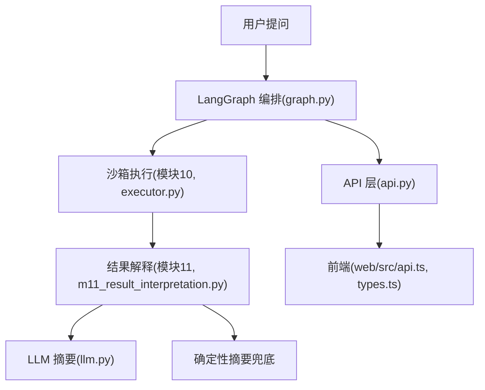
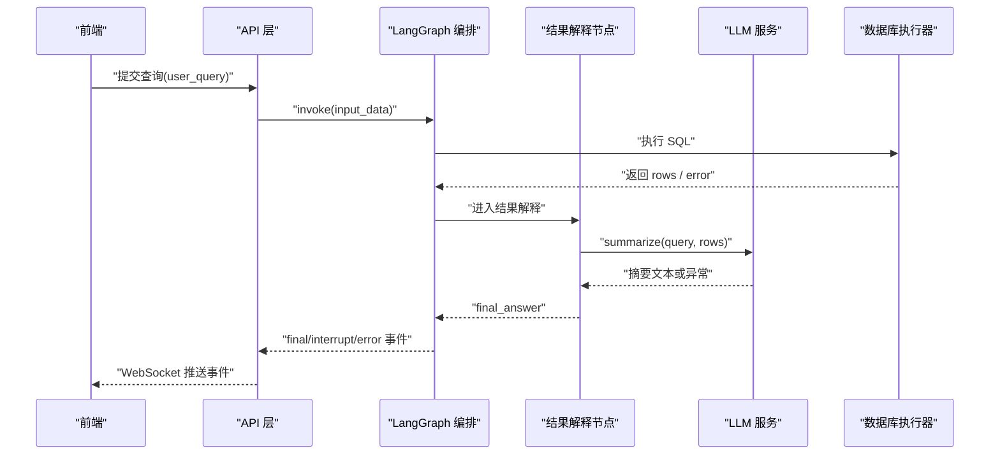
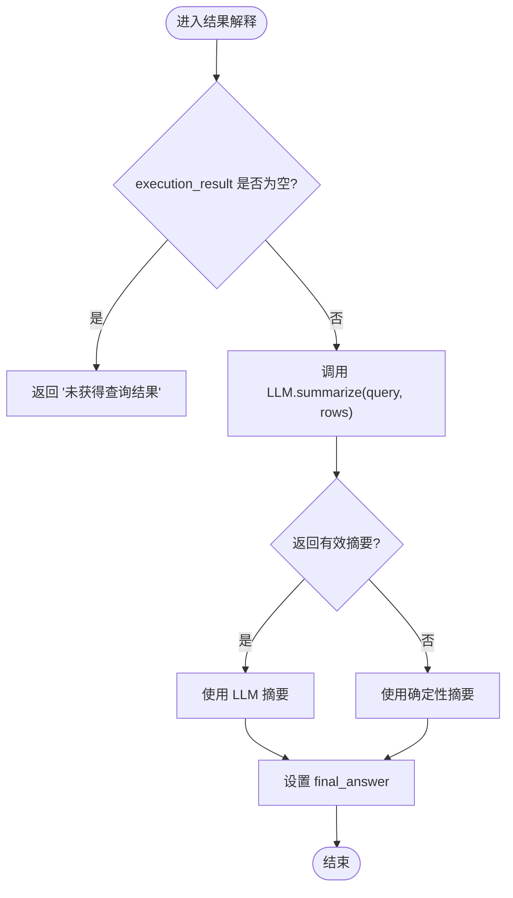
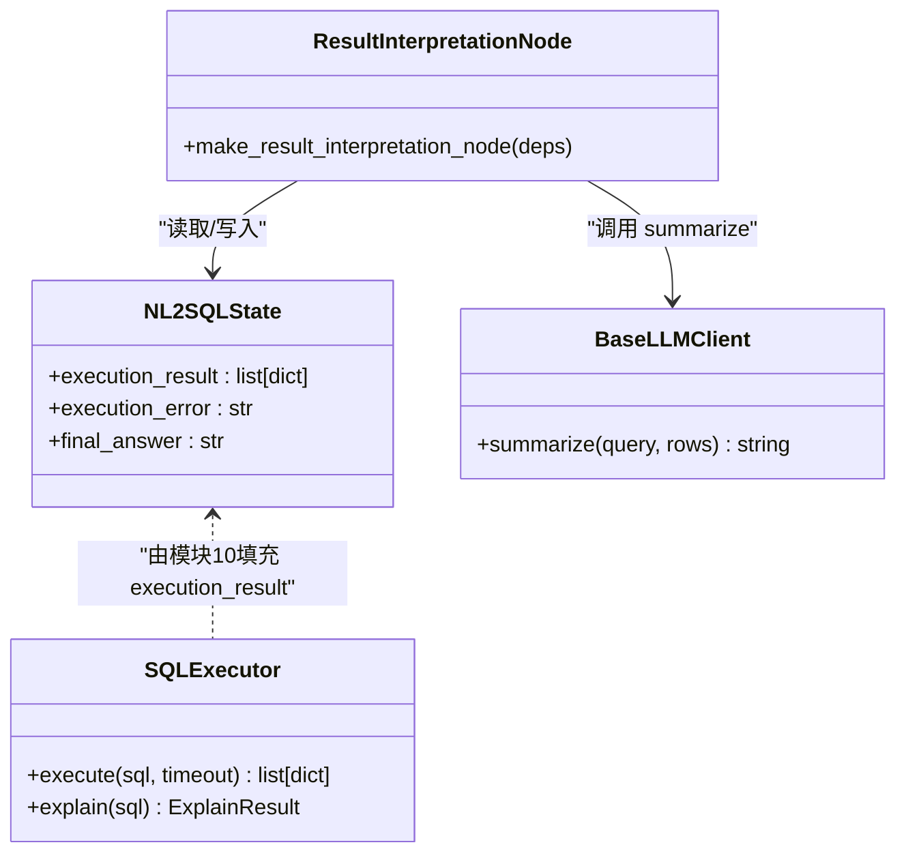

# 结果解释算法

<cite>
**本文引用的文件**   
- [m11_result_interpretation.py](file://nl2sql_agent/nodes/m11_result_interpretation.py)
- [state.py](file://nl2sql_agent/state.py)
- [api.py](file://nl2sql_agent/api.py)
- [graph.py](file://nl2sql_agent/graph.py)
- [llm.py](file://nl2sql_agent/services/llm.py)
- [deps.py](file://nl2sql_agent/services/deps.py)
- [executor.py](file://nl2sql_agent/services/executor.py)
- [types.ts](file://web/src/types.ts)
- [api.ts](file://web/src/api.ts)
- [settings.yaml](file://nl2sql_agent/config/settings.yaml)
</cite>

## 目录
1. [引言](#引言)
2. [项目结构](#项目结构)
3. [核心组件](#核心组件)
4. [架构总览](#架构总览)
5. [详细组件分析](#详细组件分析)
6. [依赖关系分析](#依赖关系分析)
7. [性能考虑](#性能考虑)
8. [故障排查指南](#故障排查指南)
9. [结论](#结论)
10. [附录](#附录)

## 引言
本文件面向“结果解释算法”的完整文档，聚焦于将结构化查询结果转换为自然语言摘要的机制，涵盖数据模式识别、关键信息提取与语义转换逻辑；同时说明表格格式化处理（对齐、列宽优化、分页与响应式）、数据可视化支持（图表类型选择、颜色方案、交互）、空结果处理策略（业务空结果 vs 错误空结果、友好提示与后续建议）、多格式输出（JSON、CSV、Excel）、数据脱敏与敏感信息过滤、结果缓存机制、性能优化技巧以及前端集成示例。

## 项目结构
结果解释位于 LangGraph 编排的第 11 个节点，上游为沙箱执行（模块 10），下游直接结束。该节点通过 LLM 生成摘要，并在 LLM 不可用时回退到确定性摘要。事件与状态在 API 层进行持久化与流式推送，前端通过 WebSocket 接收中间事件与最终结果。

**图示来源** 
- [graph.py:174-313](file://nl2sql_agent/graph.py#L174-L313)
- [m11_result_interpretation.py:25-39](file://nl2sql_agent/nodes/m11_result_interpretation.py#L25-L39)
- [llm.py:151-159](file://nl2sql_agent/services/llm.py#L151-L159)
- [api.py:134-157](file://nl2sql_agent/api.py#L134-L157)
- [api.ts:31-49](file://web/src/api.ts#L31-L49)
- [types.ts:37-54](file://web/src/types.ts#L37-L54)

**章节来源**
- [graph.py:174-313](file://nl2sql_agent/graph.py#L174-L313)
- [m11_result_interpretation.py:1-39](file://nl2sql_agent/nodes/m11_result_interpretation.py#L1-L39)
- [api.py:134-157](file://nl2sql_agent/api.py#L134-L157)
- [types.ts:37-54](file://web/src/types.ts#L37-L54)
- [api.ts:31-49](file://web/src/api.ts#L31-L49)

## 核心组件
- 结果解释节点：负责调用 LLM 生成摘要，失败时回退到确定性摘要，并写入 final_answer。
- LLM 抽象层：提供 summarize 方法，构造提示词并调用具体模型实现。
- 状态模型：NL2SQLState 包含 execution_result、execution_error、final_answer 等字段，贯穿全链路。
- API 层：负责事件桥接、状态持久化、断线重连恢复、非流式查询接口。
- 执行器：PostgresExecutor / MySQLExecutor / InMemoryExecutor，提供 execute/explain 能力。
- 前端类型与 API：定义 PipelineEvent、QueryRecord 等类型，封装 WebSocket 提交与事件回调。

**章节来源**
- [m11_result_interpretation.py:14-39](file://nl2sql_agent/nodes/m11_result_interpretation.py#L14-L39)
- [llm.py:151-159](file://nl2sql_agent/services/llm.py#L151-L159)
- [state.py:83-146](file://nl2sql_agent/state.py#L83-L146)
- [api.py:54-157](file://nl2sql_agent/api.py#L54-L157)
- [executor.py:53-159](file://nl2sql_agent/services/executor.py#L53-L159)
- [types.ts:9-54](file://web/src/types.ts#L9-L54)
- [api.ts:31-49](file://web/src/api.ts#L31-L49)

## 架构总览
结果解释处于执行后的最后一步，其输入是执行结果 rows，输出是 natural language 摘要。整体流程如下：

**图示来源** 
- [graph.py:281-294](file://nl2sql_agent/graph.py#L281-L294)
- [m11_result_interpretation.py:25-39](file://nl2sql_agent/nodes/m11_result_interpretation.py#L25-L39)
- [llm.py:151-159](file://nl2sql_agent/services/llm.py#L151-L159)
- [api.py:134-157](file://nl2sql_agent/api.py#L134-L157)

## 详细组件分析

### 结果解释节点（模块 11）
- 功能要点：
  - 读取 state.execution_result，若为空则返回“未获得查询结果”。
  - 尝试调用 deps.llm.summarize 生成摘要；若返回空或抛出异常，则使用确定性摘要。
  - 确定性摘要会给出行数与少量样例，引导用户查看数据表格核对。
- 数据结构：
  - 输入：user_query、rows（list[dict]）。
  - 输出：final_answer（字符串）。
- 错误处理：
  - LLM 不可用或返回空时，自动降级为确定性摘要，保证用户体验。
- 与状态的关系：
  - 写入 NL2SQLState.final_answer，供前端展示与持久化。

**图示来源** 
- [m11_result_interpretation.py:25-39](file://nl2sql_agent/nodes/m11_result_interpretation.py#L25-L39)
- [llm.py:151-159](file://nl2sql_agent/services/llm.py#L151-L159)

**章节来源**
- [m11_result_interpretation.py:14-39](file://nl2sql_agent/nodes/m11_result_interpretation.py#L14-L39)
- [state.py:130-134](file://nl2sql_agent/state.py#L130-L134)

### LLM 摘要接口
- summarize 方法：
  - 构造提示词，包含用户查询与前 N 行结果（默认前 50 行）。
  - 调用具体 provider 的 complete 接口，返回中文摘要。
- Provider 选择：
  - 根据环境变量选择 DeepSeek 或 Anthropic。
  - 支持 SQL 专用模型配置（可选）。
- 结构化输出：
  - 其他节点使用 complete_json / complete_structured / complete_sql，但结果解释仅使用 summarize。

**章节来源**
- [llm.py:151-159](file://nl2sql_agent/services/llm.py#L151-L159)
- [llm.py:280-283](file://nl2sql_agent/services/llm.py#L280-L283)
- [deps.py:152-153](file://nl2sql_agent/services/deps.py#L152-L153)

### 状态模型（NL2SQLState）
- 关键字段：
  - execution_result: Optional[list[dict]]
  - execution_error: Optional[str]
  - final_answer: Optional[str]
- 作用：
  - 贯穿各节点，承载执行结果与最终答案。
  - 供 API 层序列化与持久化。

**章节来源**
- [state.py:130-134](file://nl2sql_agent/state.py#L130-L134)

### API 层与事件桥接
- EventStream：线程到 asyncio 的事件队列桥接，确保图执行线程可安全推送事件。
- _run_query：同步执行图，按结果推送 final/interrupt/error/done，并持久化状态。
- 断线重连：基于 trace_id 恢复当前阶段，避免重复执行。
- 非流式接口：POST /api/query 返回运行中或最终结果。

**章节来源**
- [api.py:54-157](file://nl2sql_agent/api.py#L54-L157)
- [api.py:234-263](file://nl2sql_agent/api.py#L234-L263)

### 执行器（模块 10）
- PostgresExecutor：READ ONLY 事务 + statement_timeout。
- MySQLExecutor：READ ONLY 事务 + MAX_EXECUTION_TIME + EXPLAIN FORMAT=JSON。
- InMemoryExecutor：测试/演示用，支持模拟失败、空结果、EXPLAIN 失败等。

**章节来源**
- [executor.py:53-159](file://nl2sql_agent/services/executor.py#L53-L159)

### 前端集成
- types.ts：定义 PipelineEvent、QueryRecord 等类型，与后端对齐。
- api.ts：封装 submitQuery，建立 WebSocket 连接，发送 user_query，接收事件回调。

**章节来源**
- [types.ts:9-54](file://web/src/types.ts#L9-L54)
- [api.ts:31-49](file://web/src/api.ts#L31-L49)

## 依赖关系分析
结果解释节点的依赖链：
- 依赖 Deps.llm（LLM 客户端）
- 依赖 NL2SQLState（状态）
- 上游依赖模块 10（执行器）
- 下游无（直接结束）

**图示来源** 
- [m11_result_interpretation.py:25-39](file://nl2sql_agent/nodes/m11_result_interpretation.py#L25-L39)
- [state.py:130-134](file://nl2sql_agent/state.py#L130-L134)
- [llm.py:151-159](file://nl2sql_agent/services/llm.py#L151-L159)
- [executor.py:23-29](file://nl2sql_agent/services/executor.py#L23-L29)

**章节来源**
- [graph.py:281-294](file://nl2sql_agent/graph.py#L281-L294)
- [deps.py:152-153](file://nl2sql_agent/services/deps.py#L152-L153)

## 性能考虑
- 事件数据截断：graph._event_data 对 execution_result 限制前 20 行，避免刷屏。
- 超时控制：执行器层面设置超时（MySQL MAX_EXECUTION_TIME、Postgres statement_timeout）。
- 重试回路：执行失败退回 SQL 生成（上限 max_retries），计划校验失败退回计划生成（上限 max_plan_retries）。
- 向量存储与模型选择：按需选择轻量模型用于离线任务，减少成本。

**章节来源**
- [graph.py:60-69](file://nl2sql_agent/graph.py#L60-L69)
- [executor.py:71-80](file://nl2sql_agent/services/executor.py#L71-L80)
- [executor.py:148-158](file://nl2sql_agent/services/executor.py#L148-L158)
- [graph.py:138-170](file://nl2sql_agent/graph.py#L138-L170)

## 故障排查指南
- LLM 不可用或返回空：
  - 现象：final_answer 为空或触发确定性摘要。
  - 排查：检查 LLM 环境变量与网络连通性；确认 summarize 提示词是否过长。
- 执行报错：
  - 现象：execution_error 非空，可能触发重试。
  - 排查：检查 SQL 语法、权限、超时设置；查看 EXPLAIN 预估行数。
- 空结果：
  - 业务空结果：rows 为空列表，确定性摘要会提示“未返回结果”。
  - 错误空结果：execution_error 非空，需优先处理错误。
- 前端事件丢失：
  - 现象：WebSocket 断开后无恢复。
  - 排查：确认 trace_id 是否正确；检查 API 层的 restore 逻辑。

**章节来源**
- [m11_result_interpretation.py:14-22](file://nl2sql_agent/nodes/m11_result_interpretation.py#L14-L22)
- [api.py:161-180](file://nl2sql_agent/api.py#L161-L180)
- [executor.py:187-198](file://nl2sql_agent/services/executor.py#L187-L198)

## 结论
结果解释算法以 LLM 为核心，结合确定性摘要兜底，确保在任何情况下都能为用户提供可读的自然语言摘要。配合 API 层的流式事件与持久化、前端类型与 WebSocket 集成，形成完整的端到端体验。性能方面通过事件截断、超时控制与重试回路保障稳定性与效率。

## 附录

### 表格格式化处理建议
- 数据对齐：
  - 数值列右对齐，文本列左对齐，日期列居中。
- 列宽优化：
  - 自适应列宽，超长内容折叠显示并提供悬停预览。
- 分页显示：
  - 默认每页 20 条，支持跳转与批量加载。
- 响应式布局：
  - 移动端隐藏次要列，提供横向滚动与固定首列。

### 数据可视化支持
- 图表类型选择：
  - 时间序列折线图、分类柱状图、占比饼图、散点图等。
- 颜色方案配置：
  - 统一色板，区分正负值与类别，支持高对比度模式。
- 交互功能：
  - 筛选、排序、钻取、导出、缩放与工具提示。

### 空结果处理策略
- 业务空结果：
  - 提示“未找到匹配记录”，建议调整查询条件或扩大范围。
- 错误空结果：
  - 提示“执行失败”，给出错误原因与修复建议（如权限、超时、SQL 语法）。

### 多格式输出支持
- JSON：
  - 保留原始结构与元数据，便于程序消费。
- CSV：
  - 扁平化输出，适合 Excel 导入与分析。
- Excel：
  - 带样式与公式，支持冻结首行与自动筛选。

### 数据脱敏与敏感信息过滤
- 规则来源：
  - sensitive_rules.yaml 定义敏感字段与脱敏策略。
- 处理方式：
  - 掩码、哈希、替换、区间化等。
- 执行时机：
  - 在执行器返回后、结果解释前进行脱敏。

### 结果缓存机制
- 语义缓存：
  - 基于 query 与 schema 指纹缓存 LLM 摘要，命中则直接返回。
- 执行缓存：
  - 相同 SQL 与参数缓存执行结果，缩短响应时间。

### 性能优化技巧
- 限制结果集大小：
  - settings.yaml 中的 execution.limit 控制最大行数。
- 异步与并发：
  - 事件推送与图执行分离，避免阻塞。
- 模型选择：
  - 简单任务使用轻量模型，复杂任务使用强模型。

### 前端集成示例
- 提交查询：
  - 使用 submitQuery 建立 WebSocket，监听 node_start/node_complete/final 等事件。
- 展示结果：
  - 解析 final_answer 与 execution_result，渲染摘要与表格。
- 错误处理：
  - 捕获 error 事件，展示友好提示与重试按钮。

**章节来源**
- [settings.yaml:18-22](file://nl2sql_agent/config/settings.yaml#L18-L22)
- [api.ts:31-49](file://web/src/api.ts#L31-L49)
- [types.ts:37-54](file://web/src/types.ts#L37-L54)