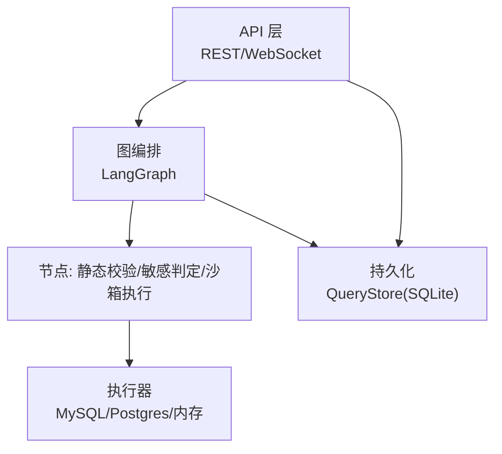
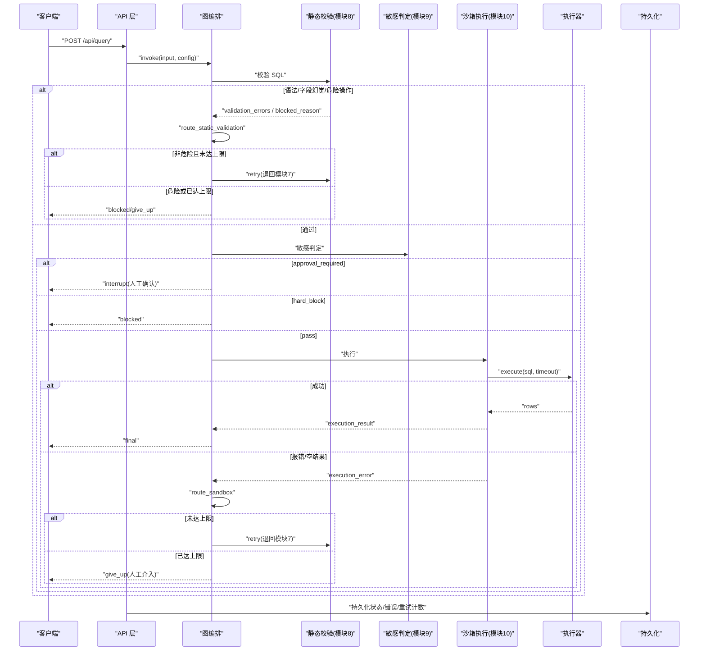
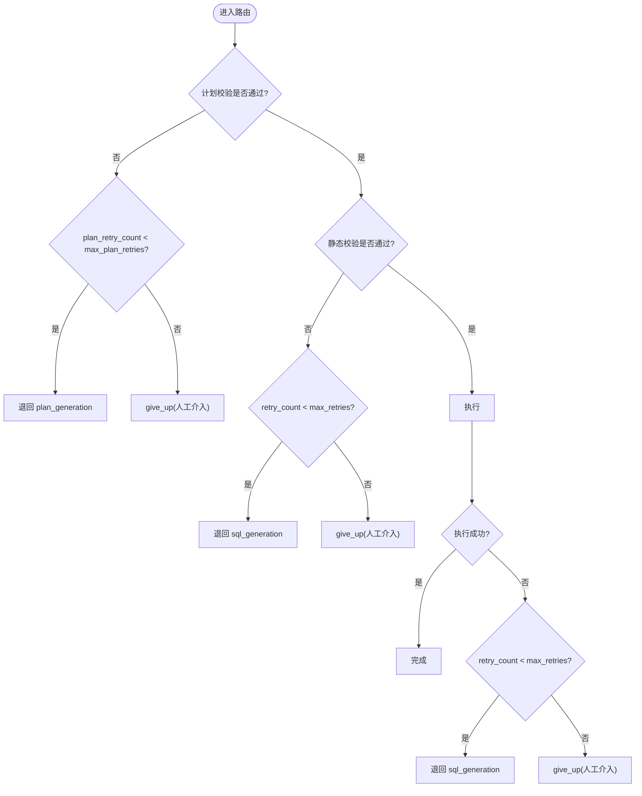
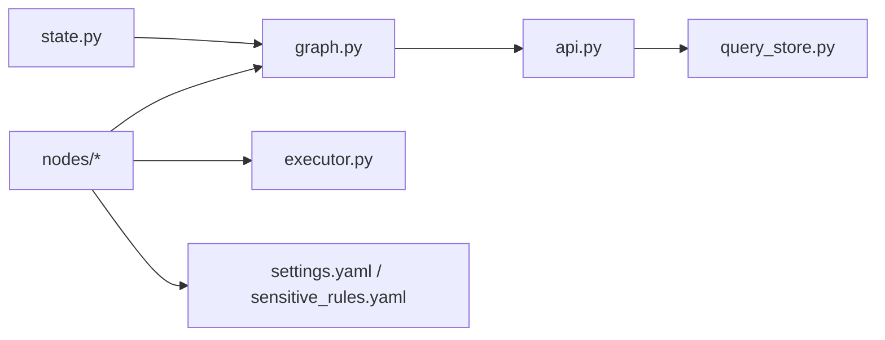

# 错误处理机制

<cite>
**本文引用的文件**   
- [nl2sql_agent/main.py](file://nl2sql_agent/main.py)
- [nl2sql_agent/api.py](file://nl2sql_agent/api.py)
- [nl2sql_agent/graph.py](file://nl2sql_agent/graph.py)
- [nl2sql_agent/state.py](file://nl2sql_agent/state.py)
- [nl2sql_agent/services/executor.py](file://nl2sql_agent/services/executor.py)
- [nl2sql_agent/nodes/m8_static_validation.py](file://nl2sql_agent/nodes/m8_static_validation.py)
- [nl2sql_agent/nodes/m9_sensitive_check.py](file://nl2sql_agent/nodes/m9_sensitive_check.py)
- [nl2sql_agent/nodes/m10_sandbox_execution.py](file://nl2sql_agent/nodes/m10_sandbox_execution.py)
- [nl2sql_agent/nodes/human_review.py](file://nl2sql_agent/nodes/human_review.py)
- [nl2sql_agent/services/query_store.py](file://nl2sql_agent/services/query_store.py)
- [nl2sql_agent/config/settings.yaml](file://nl2sql_agent/config/settings.yaml)
- [nl2sql_agent/config/sensitive_rules.yaml](file://nl2sql_agent/config/sensitive_rules.yaml)
- [nl2sql_agent/tests/test_routing.py](file://nl2sql_agent/tests/test_routing.py)
</cite>

## 目录
1. [简介](#简介)
2. [项目结构](#项目结构)
3. [核心组件](#核心组件)
4. [架构总览](#架构总览)
5. [详细组件分析](#详细组件分析)
6. [依赖关系分析](#依赖关系分析)
7. [性能与重试策略](#性能与重试策略)
8. [故障排查指南](#故障排查指南)
9. [结论](#结论)
10. [附录：监控指标与告警建议](#附录监控指标与告警建议)

## 简介
本文件系统化阐述 NL2SQL Agent 的错误处理机制，覆盖执行失败的重试与降级、错误分类体系、人工介入触发条件、日志记录规范、恢复策略（SQL 改写重试、查询计划回退、执行环境切换）以及监控指标与告警建议。目标是帮助开发者与运维人员快速定位问题、合理配置阈值与规则，并保障系统在异常场景下的稳定性与可观测性。

## 项目结构
错误处理贯穿“入口 → 编排图 → 节点 → 执行器 → 持久化”全链路：
- 入口层：REST/WebSocket 接收请求，启动图执行，统一事件桥接与状态落库。
- 编排层：LangGraph 定义节点与路由，集中管理两条重试回路（计划校验回路、静态校验/执行回路）。
- 节点层：各模块负责具体错误捕获、分类与恢复动作（如 SQL 生成重试、计划回退、执行失败降级）。
- 执行层：只读事务、超时控制、EXPLAIN 预估行数拦截，提供 MySQL/Postgres/内存执行器。
- 持久化层：SQLite 存储查询历史、审计、反馈与审批队列，支撑断线重连与回溯。

**图表来源** 
- [nl2sql_agent/api.py](file://nl2sql_agent/api.py)
- [nl2sql_agent/graph.py](file://nl2sql_agent/graph.py)
- [nl2sql_agent/services/executor.py](file://nl2sql_agent/services/executor.py)
- [nl2sql_agent/services/query_store.py](file://nl2sql_agent/services/query_store.py)

**章节来源**
- [nl2sql_agent/main.py:83-120](file://nl2sql_agent/main.py#L83-L120)
- [nl2sql_agent/api.py:134-157](file://nl2sql_agent/api.py#L134-L157)
- [nl2sql_agent/graph.py:174-312](file://nl2sql_agent/graph.py#L174-L312)

## 核心组件
- 状态模型：集中定义重试计数、最大重试次数、阻塞原因、执行错误、风险决策等字段，作为错误处理的唯一事实源。
- 图编排：定义两条重试回路边界与路由函数，确保错误在离它最近的节点被消化，避免整条链路推倒重来。
- 执行器：只读事务 + 超时控制 + EXPLAIN 预估行数拦截；支持模拟失败用于测试。
- 持久化：记录 trace_id、状态、错误信息、重试计数、审批与反馈，支撑断线重连与审计。

**章节来源**
- [nl2sql_agent/state.py:83-146](file://nl2sql_agent/state.py#L83-L146)
- [nl2sql_agent/graph.py:106-170](file://nl2sql_agent/graph.py#L106-L170)
- [nl2sql_agent/services/executor.py:53-159](file://nl2sql_agent/services/executor.py#L53-L159)
- [nl2sql_agent/services/query_store.py:31-96](file://nl2sql_agent/services/query_store.py#L31-L96)

## 架构总览
下图展示错误处理的关键路径与重试/降级点：

**图表来源** 
- [nl2sql_agent/graph.py:237-294](file://nl2sql_agent/graph.py#L237-L294)
- [nl2sql_agent/nodes/m8_static_validation.py:22-56](file://nl2sql_agent/nodes/m8_static_validation.py#L22-L56)
- [nl2sql_agent/nodes/m9_sensitive_check.py:19-106](file://nl2sql_agent/nodes/m9_sensitive_check.py#L19-L106)
- [nl2sql_agent/nodes/m10_sandbox_execution.py:20-65](file://nl2sql_agent/nodes/m10_sandbox_execution.py#L20-L65)
- [nl2sql_agent/services/executor.py:148-159](file://nl2sql_agent/services/executor.py#L148-L159)
- [nl2sql_agent/api.py:134-157](file://nl2sql_agent/api.py#L134-L157)

## 详细组件分析

### 错误分类体系与处理方式
- 语法错误（模块8）
  - 检测方式：基于 sqlglot AST 解析失败即视为语法错误。
  - 处理：累积 validation_errors，退回模块7重试；达到 max_retries 后输出“请人工介入”。
- 权限错误（模块8/9）
  - data_scope 误入 WHERE 值：AST 字面量匹配拦截，要求重新生成。
  - 行级过滤缺失：若启用 row_level_filter 但未注入可信值，直接 blocked 并阻断执行。
- 超时错误（模块10）
  - 执行器设置会话级超时（MySQL MAX_EXECUTION_TIME / Postgres statement_timeout），超时视为 execution_error。
  - 处理：退回模块7重试；打满上限后降级为“人工介入”。
- 数据错误（模块10）
  - EXPLAIN 预估扫描行数超过阈值：拒绝执行，返回 execution_error。
  - 空结果：合法业务结果，直接进入结果解释，不触发 SQL 放宽重试。
- 危险操作（模块8）
  - DROP/DELETE/UPDATE/TRUNCATE 等命中即硬失败，设置 blocked_reason，不进入重试，直接结束。

**章节来源**
- [nl2sql_agent/nodes/m8_static_validation.py:42-56](file://nl2sql_agent/nodes/m8_static_validation.py#L42-L56)
- [nl2sql_agent/nodes/m8_static_validation.py:57-73](file://nl2sql_agent/nodes/m8_static_validation.py#L57-L73)
- [nl2sql_agent/nodes/m8_static_validation.py:121-148](file://nl2sql_agent/nodes/m8_static_validation.py#L121-L148)
- [nl2sql_agent/nodes/m10_sandbox_execution.py:37-47](file://nl2sql_agent/nodes/m10_sandbox_execution.py#L37-L47)
- [nl2sql_agent/nodes/m10_sandbox_execution.py:54-62](file://nl2sql_agent/nodes/m10_sandbox_execution.py#L54-L62)
- [nl2sql_agent/services/executor.py:148-159](file://nl2sql_agent/services/executor.py#L148-L159)

### 重试机制与降级策略
- 计划校验回路（模块5b↔6）
  - 触发：plan_validation_errors 非空。
  - 限制：max_plan_retries=2，超出则 give_up 并提示人工介入。
  - 不变式：仅在计划路径内打转，不退回模块3。
- 静态校验/执行回路（模块7↔8↔10）
  - 触发：validation_errors 或 execution_error。
  - 限制：max_retries=3，超出则 give_up 并提示人工介入。
  - 不变式：执行报错仅退回模块7，不退回模块5b。
- 指数退避策略
  - 当前实现未内置指数退避；建议在 _retry_route 中按 attempt 计算 sleep 时间，或在 API 层对重试间隔进行控制。
- 最终降级
  - 两类回路均在上限处输出 final_answer 提示“人工介入”，避免死循环。

**图表来源** 
- [nl2sql_agent/graph.py:138-170](file://nl2sql_agent/graph.py#L138-L170)
- [nl2sql_agent/state.py:111-122](file://nl2sql_agent/state.py#L111-L122)

**章节来源**
- [nl2sql_agent/graph.py:237-294](file://nl2sql_agent/graph.py#L237-L294)
- [nl2sql_agent/tests/test_routing.py:167-214](file://nl2sql_agent/tests/test_routing.py#L167-L214)

### 人工介入触发条件
- 多次重试失败：计划校验或执行/静态校验达到上限，输出“人工介入”。
- 敏感操作拒绝：敏感判定为 approval_required 时中断流程，等待 human_review 批准。
- 资源超限：EXPLAIN 预估扫描行数超过阈值，hard_block 直接阻断。
- 行级权限不完整：启用 row_level_filter 但未注入可信值，blocked 阻断。

**章节来源**
- [nl2sql_agent/nodes/m9_sensitive_check.py:84-106](file://nl2sql_agent/nodes/m9_sensitive_check.py#L84-L106)
- [nl2sql_agent/nodes/m10_sandbox_execution.py:43-47](file://nl2sql_agent/nodes/m10_sandbox_execution.py#L43-L47)
- [nl2sql_agent/nodes/m8_static_validation.py:134-148](file://nl2sql_agent/nodes/m8_static_validation.py#L134-L148)
- [nl2sql_agent/nodes/human_review.py:15-32](file://nl2sql_agent/nodes/human_review.py#L15-L32)

### 错误日志记录规范
- 上下文信息：trace_id、node_latencies、trace_steps、retrieval_confidence、sensitive_reasons、execution_error、retry_count、plan_retry_count 等字段统一序列化落库。
- 堆栈跟踪：API 层在 approve/resume 异常时打印 traceback；WS 层 error 事件携带 message。
- 用户友好消息：final_answer 使用简洁可读的中文提示，避免暴露内部细节。
- 事件流：node_start/node_complete/retry/interrupt/final/error/done 事件经 EventStream 推送前端，便于实时诊断。

**章节来源**
- [nl2sql_agent/api.py:68-132](file://nl2sql_agent/api.py#L68-L132)
- [nl2sql_agent/api.py:152-157](file://nl2sql_agent/api.py#L152-L157)
- [nl2sql_agent/graph.py:88-103](file://nl2sql_agent/graph.py#L88-L103)
- [nl2sql_agent/services/query_store.py:97-140](file://nl2sql_agent/services/query_store.py#L97-L140)

### 错误恢复策略
- SQL 改写重试（模块8）
  - 针对语法错误、字段幻觉、data_scope 误用等，累积 errors 并退回模块7重试。
- 查询计划回退（模块5b↔6）
  - 计划校验失败在 5b↔6 内打转，最多 max_plan_retries 次，不退回模块3。
- 执行环境切换
  - 通过 DATABASE_URL 自动选择执行器（MySQL/Postgres），可在部署层面切换执行环境以规避单点问题。

**章节来源**
- [nl2sql_agent/nodes/m8_static_validation.py:42-86](file://nl2sql_agent/nodes/m8_static_validation.py#L42-L86)
- [nl2sql_agent/graph.py:237-248](file://nl2sql_agent/graph.py#L237-L248)
- [nl2sql_agent/config/settings.yaml:9-16](file://nl2sql_agent/config/settings.yaml#L9-L16)

## 依赖关系分析
- 模块耦合
  - graph.py 依赖 state.py 定义的状态字段与 nodes/* 节点实现。
  - api.py 依赖 graph.py、query_store.py、services/executor.py。
  - m8/m9/m10 节点依赖 deps.config 与 deps.executor/sql 服务。
- 外部依赖
  - sqlglot 用于 AST 解析与改写。
  - psycopg/pymysql 用于数据库连接。
- 潜在循环依赖
  - 无直接循环；节点间通过 state 字段通信，路由函数集中定义。

**图表来源** 
- [nl2sql_agent/state.py:83-146](file://nl2sql_agent/state.py#L83-L146)
- [nl2sql_agent/graph.py:174-312](file://nl2sql_agent/graph.py#L174-L312)
- [nl2sql_agent/api.py:134-157](file://nl2sql_agent/api.py#L134-L157)
- [nl2sql_agent/services/query_store.py:31-96](file://nl2sql_agent/services/query_store.py#L31-L96)
- [nl2sql_agent/services/executor.py:53-159](file://nl2sql_agent/services/executor.py#L53-L159)
- [nl2sql_agent/config/settings.yaml:1-30](file://nl2sql_agent/config/settings.yaml#L1-L30)
- [nl2sql_agent/config/sensitive_rules.yaml:1-24](file://nl2sql_agent/config/sensitive_rules.yaml#L1-L24)

**章节来源**
- [nl2sql_agent/graph.py:174-312](file://nl2sql_agent/graph.py#L174-L312)
- [nl2sql_agent/api.py:134-157](file://nl2sql_agent/api.py#L134-L157)

## 性能与重试策略
- 节点延迟追踪：_traced 包装每个节点，记录 node_latencies 与 trace_steps，便于瓶颈定位。
- 事件推送隔离：_emit 捕获异常不影响主流程；EventStream 线程安全桥接 WS。
- 重试上限保护：max_retries/max_plan_retries 防止无限重试；建议结合指数退避降低瞬时压力。
- 执行超时与只读：MySQL MAX_EXECUTION_TIME、Postgres statement_timeout 与 READ ONLY 事务保障系统稳定。

**章节来源**
- [nl2sql_agent/graph.py:88-103](file://nl2sql_agent/graph.py#L88-L103)
- [nl2sql_agent/api.py:54-66](file://nl2sql_agent/api.py#L54-L66)
- [nl2sql_agent/services/executor.py:71-81](file://nl2sql_agent/services/executor.py#L71-L81)
- [nl2sql_agent/services/executor.py:148-159](file://nl2sql_agent/services/executor.py#L148-L159)

## 故障排查指南
- 常见问题定位
  - 语法错误：查看 validation_errors 列表，检查 dialect 与 SQL 片段。
  - 字段幻觉：检查 retrieved_schema 与 used_tables 一致性。
  - 危险操作：blocked_reason 显示具体操作类型（如 Drop）。
  - 执行超时：execution_error 包含超时信息；调整 timeout_seconds。
  - 资源超限：explain_row_threshold 阈值过低导致拒绝执行。
- 断线重连
  - 使用 trace_id 重连 WS，服务端根据 status 恢复 pending_review/done/blocked/rejected 状态。
- 审批与恢复
  - 调用 /approve 或 /resume 恢复 interrupt 的流程，注意状态必须为 pending_review。

**章节来源**
- [nl2sql_agent/nodes/m8_static_validation.py:22-56](file://nl2sql_agent/nodes/m8_static_validation.py#L22-L56)
- [nl2sql_agent/api.py:161-211](file://nl2sql_agent/api.py#L161-L211)
- [nl2sql_agent/api.py:280-354](file://nl2sql_agent/api.py#L280-L354)

## 结论
该错误处理机制通过明确的错误分类、受控的重试回路、严格的安全拦截与完善的事件/持久化记录，实现了高可用与可观测性。建议在生产环境中引入指数退避、细化监控指标与告警规则，进一步提升鲁棒性与可维护性。

## 附录：监控指标与告警建议
- 指标采集
  - 节点延迟：node_latencies 聚合 P50/P95/P99。
  - 重试率：retry_count/plan_retry_count 分布与趋势。
  - 错误率：execution_error/validation_errors 分类统计。
  - 阻塞率：blocked_reason 分布（Drop/Delete/Update/Truncate/行级权限缺失）。
  - 敏感通过率：risk_decision 分布（pass/approval_required/hard_block）。
- 告警规则
  - 执行错误率突增（如 >5%）持续 5 分钟。
  - 阻塞率突增（如 >2%）持续 5 分钟。
  - 平均节点延迟超过阈值（如 P95 > 2s）。
  - 人工审批积压（pending_review 数量 > N）。
- 诊断工具
  - 使用 /audit/{trace_id} 获取完整 trace 与反馈。
  - 使用 /history 筛选用户/业务线/时间范围的历史记录。
  - 前端 WS 事件流观察 retry/interrupt/error 序列。

[本节为通用指导，不直接分析具体文件]