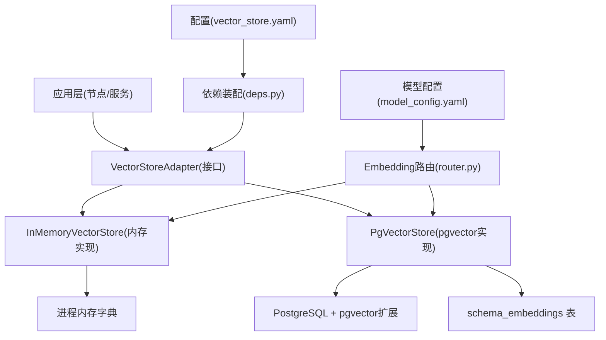
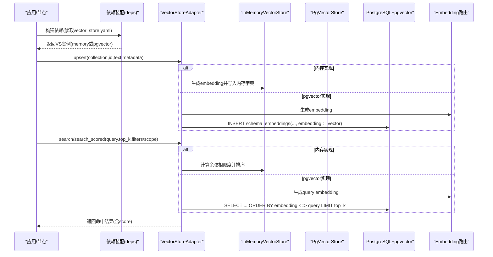
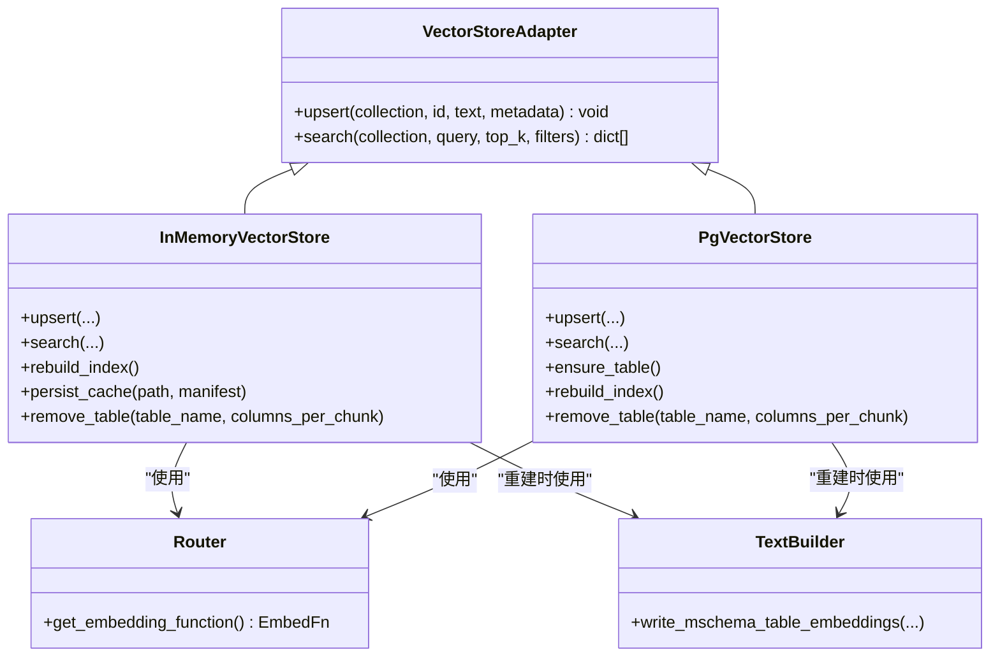

# 向量存储表

<cite>
**本文引用的文件**   
- [pg.py](file://nl2sql_agent/services/vector_store/pg.py)
- [memory.py](file://nl2sql_agent/services/vector_store/memory.py)
- [base.py](file://nl2sql_agent/services/vector_store/base.py)
- [deps.py](file://nl2sql_agent/services/deps.py)
- [vector_store.yaml](file://nl2sql_agent/config/vector_store.yaml)
- [model_config.yaml](file://nl2sql_agent/config/model_config.yaml)
- [router.py](file://nl2sql_agent/services/embedding/router.py)
- [text_builder.py](file://nl2sql_agent/services/schema_ingest/text_builder.py)
- [state.py](file://nl2sql_agent/state.py)
- [test_vector_store.py](file://nl2sql_agent/tests/test_vector_store.py)
</cite>

## 目录
1. [简介](#简介)
2. [项目结构](#项目结构)
3. [核心组件](#核心组件)
4. [架构总览](#架构总览)
5. [详细组件分析](#详细组件分析)
6. [依赖关系分析](#依赖关系分析)
7. [性能与索引策略](#性能与索引策略)
8. [存储空间管理](#存储空间管理)
9. [导入导出与批量操作](#导入导出与批量操作)
10. [监控指标与可观测性](#监控指标与可观测性)
11. [故障排查指南](#故障排查指南)
12. [结论与建议](#结论与建议)

## 简介
本文件面向AI工程师与系统管理员，系统化阐述本项目中基于 pgvector 的向量存储表设计与实现。内容涵盖：
- 向量表结构设计（列、维度、数据类型）
- 相似度检索与距离函数选择
- 索引策略与参数调优（当前默认无索引；提供扩展建议）
- 存储容量规划、压缩与清理策略
- 数据导入/导出与批量写入方法
- 监控指标与运维要点
- 性能基准思路与优化建议

## 项目结构
向量存储相关代码集中在 services/vector_store 包内，通过统一接口 VectorStoreAdapter 抽象后端，支持内存与 pgvector 两种实现。配置由 vector_store.yaml 显式选择后端，模型维度由 model_config.yaml 的 embedding.dimension 决定。

图表来源 
- [deps.py:87-107](file://nl2sql_agent/services/deps.py#L87-L107)
- [vector_store.yaml:1-6](file://nl2sql_agent/config/vector_store.yaml#L1-L6)
- [model_config.yaml:1-15](file://nl2sql_agent/config/model_config.yaml#L1-L15)
- [router.py:34-61](file://nl2sql_agent/services/embedding/router.py#L34-L61)
- [base.py:11-21](file://nl2sql_agent/services/vector_store/base.py#L11-L21)
- [memory.py:21-53](file://nl2sql_agent/services/vector_store/memory.py#L21-L53)
- [pg.py:15-44](file://nl2sql_agent/services/vector_store/pg.py#L15-L44)

章节来源
- [deps.py:87-107](file://nl2sql_agent/services/deps.py#L87-L107)
- [vector_store.yaml:1-6](file://nl2sql_agent/config/vector_store.yaml#L1-L6)
- [model_config.yaml:1-15](file://nl2sql_agent/config/model_config.yaml#L1-L15)
- [router.py:34-61](file://nl2sql_agent/services/embedding/router.py#L34-L61)
- [base.py:11-21](file://nl2sql_agent/services/vector_store/base.py#L11-L21)

## 核心组件
- 统一接口 VectorStoreAdapter：定义 upsert 与 search 两个核心方法，屏蔽后端差异。
- InMemoryVectorStore：进程内字典存储，使用余弦相似度计算，适合开发测试与快速验证。
- PgVectorStore：基于 PostgreSQL 与 pgvector 扩展，使用 <=> 算子进行余弦距离检索，支持持久化与大规模数据。
- Embedding 路由：根据 model_config.yaml 选择本地或 fake 嵌入模型，返回归一化向量。

章节来源
- [base.py:11-21](file://nl2sql_agent/services/vector_store/base.py#L11-L21)
- [memory.py:21-53](file://nl2sql_agent/services/vector_store/memory.py#L21-L53)
- [pg.py:15-44](file://nl2sql_agent/services/vector_store/pg.py#L15-L44)
- [router.py:34-61](file://nl2sql_agent/services/embedding/router.py#L34-L61)

## 架构总览
下图展示从应用调用到向量检索的完整流程，包括后端选择、建表、写入与查询路径。

图表来源 
- [deps.py:87-107](file://nl2sql_agent/services/deps.py#L87-L107)
- [memory.py:35-53](file://nl2sql_agent/services/vector_store/memory.py#L35-L53)
- [pg.py:32-65](file://nl2sql_agent/services/vector_store/pg.py#L32-L65)
- [router.py:34-61](file://nl2sql_agent/services/embedding/router.py#L34-L61)

## 详细组件分析

### 向量表结构与数据类型
- 表名：schema_embeddings
- 字段说明：
  - collection: TEXT，区分“表级/字段级/关系级”集合
  - id: TEXT，主键组合(collection, id)唯一标识
  - text: TEXT，用于检索的文本文档
  - metadata: TEXT(JSON)，业务元数据（如 business_line、table_name、snapshot_id 等）
  - embedding: vector(DIM)，pgvector 向量类型，DIM 来自模型配置的 dimension
- 主键：PRIMARY KEY (collection, id)

维度来源与建表逻辑：
- 维度取自 model_config.yaml 的 embedding.dimension（默认 384）
- PgVectorStore.ensure_table 动态创建表，确保 PG 端向量列维度一致

章节来源
- [pg.py:69-79](file://nl2sql_agent/services/vector_store/pg.py#L69-L79)
- [model_config.yaml:1-15](file://nl2sql_agent/config/model_config.yaml#L1-L15)

### 相似度搜索与距离函数
- 内存实现：使用余弦相似度（向量点积且已归一化），分数范围[0,1]
- pgvector 实现：使用 <=> 算子（余弦距离），在 SQL 中将距离转换为 score = 1 - distance / 2，再限制为 max(0.0, score)
- 过滤条件：
  - 内存：按 metadata 精确匹配 filters
  - pgvector：示例中使用 metadata::jsonb->>'business_line' 做行级过滤

章节来源
- [memory.py:43-53](file://nl2sql_agent/services/vector_store/memory.py#L43-L53)
- [pg.py:46-65](file://nl2sql_agent/services/vector_store/pg.py#L46-L65)

### 索引策略与参数调优
- 当前实现未创建任何 pgvector 索引（无 IVFFlat/HNSW 索引）
- 查询使用全表扫描 + 排序（ORDER BY embedding <=> query LIMIT k）
- 扩展建议（供后续演进参考）：
  - IVFFlat：适合离线重建、高吞吐写入场景；需设置 lists 与 nprobes
  - HNSW：适合在线低延迟检索；需设置 m、ef_construction、ef_search
  - 注意：引入索引会增加写入开销与内存占用，需结合 QPS、延迟目标与数据规模权衡

章节来源
- [pg.py:46-65](file://nl2sql_agent/services/vector_store/pg.py#L46-L65)

### 数据写入与重建
- upsert：对每条记录生成 embedding 后写入（内存字典或 PG 表）
- rebuild_index：
  - 内存：清空缓存并重新构建（支持从 effective M-Schema 恢复）
  - pgvector：删除三集合（表级/字段级/关系级）后重建
- 增量同步：
  - 通过 write_mschema_table_embeddings 仅重算发生变化的表
  - 内存实现支持 persist_cache 原子保存快照，重启时校验语义哈希与模型签名后复用

章节来源
- [memory.py:161-191](file://nl2sql_agent/services/vector_store/memory.py#L161-L191)
- [pg.py:81-118](file://nl2sql_agent/services/vector_store/pg.py#L81-L118)
- [text_builder.py:103-136](file://nl2sql_agent/services/schema_ingest/text_builder.py#L103-L136)

### Schema 层检索（模块3）
- search_scored：按 data_scope 过滤候选表，返回 [(SchemaHit, score)]
- 内存实现：遍历 catalog 表列表并在内存中计算相似度
- pgvector 实现：SQL 限定 id = ANY(names) 并按 embedding <=> query 排序

章节来源
- [memory.py:167-191](file://nl2sql_agent/services/vector_store/memory.py#L167-L191)
- [pg.py:139-173](file://nl2sql_agent/services/vector_store/pg.py#L139-L173)
- [state.py:14-20](file://nl2sql_agent/state.py#L14-L20)

## 依赖关系分析
- deps.build_vector_store 根据 vector_store.yaml 的 backend 选择 InMemory 或 PgVector
- PgVectorStore 依赖 psycopg 连接 PG，依赖 router.get_embedding_function 生成向量
- InMemoryVectorStore 依赖 router.get_embedding_function 与 schema_ingest.text_builder 进行重建

图表来源 
- [base.py:11-21](file://nl2sql_agent/services/vector_store/base.py#L11-L21)
- [memory.py:21-53](file://nl2sql_agent/services/vector_store/memory.py#L21-L53)
- [pg.py:15-44](file://nl2sql_agent/services/vector_store/pg.py#L15-L44)
- [router.py:34-61](file://nl2sql_agent/services/embedding/router.py#L34-L61)
- [text_builder.py:103-136](file://nl2sql_agent/services/schema_ingest/text_builder.py#L103-L136)

章节来源
- [deps.py:87-107](file://nl2sql_agent/services/deps.py#L87-L107)
- [vector_store.yaml:1-6](file://nl2sql_agent/config/vector_store.yaml#L1-L6)

## 性能与索引策略
- 当前查询复杂度：O(N) 全表扫描 + 排序（pgvector 未建索引）
- 距离函数：
  - 内存：余弦相似度（向量已归一化）
  - pgvector：<=> 余弦距离，score = 1 - distance / 2
- 调优方向（建议）：
  - 引入 HNSW：降低查询延迟，提升 Top-K 召回效率；需评估 ef_search 与 m 对内存的影响
  - 引入 IVFFlat：适合批处理与离线重建；lists/nprobes 影响召回率与速度
  - 控制 top_k 与过滤条件以减少排序成本
  - 合理拆分 collection，避免单集合过大导致扫描耗时上升

章节来源
- [pg.py:46-65](file://nl2sql_agent/services/vector_store/pg.py#L46-L65)
- [memory.py:43-53](file://nl2sql_agent/services/vector_store/memory.py#L43-L53)

## 存储空间管理
- 表大小估算：
  - 每行包含 text、metadata(JSON)、embedding(vector(DIM))
  - 向量存储约 DIM * 4 字节（float32），加上文本与 JSON 开销
- 压缩策略（建议）：
  - 对 metadata 与 text 进行去重与精简
  - 考虑向量量化（如 PQ/SQ8）以降低存储与带宽（需在数据库侧或外部库支持）
- 定期清理：
  - remove_table：删除指定表的表级/字段级/关系级条目
  - rebuild_index：全量重建前清理旧数据
- 容量规划：
  - 预估 N × (text_len + json_len + DIM×4) 的峰值
  - 预留索引空间（HNSW/IVFFlat）与 WAL/TOAST 开销

章节来源
- [pg.py:69-79](file://nl2sql_agent/services/vector_store/pg.py#L69-L79)
- [pg.py:120-135](file://nl2sql_agent/services/vector_store/pg.py#L120-L135)
- [memory.py:138-147](file://nl2sql_agent/services/vector_store/memory.py#L138-L147)

## 导入导出与批量操作
- 导入：
  - 通过 write_mschema_table_embeddings 将 effective M-Schema 转为向量文档并 upsert
  - 支持 columns_per_chunk 分块写入，便于增量与重试
- 导出：
  - 内存实现：persist_cache 将 collections 原子写入 vector-cache.json，重启后可恢复
  - pgvector：直接 SELECT 表数据导出（JSON/CSV）
- 批量写入：
  - 建议在应用层分批提交事务，减少锁竞争与网络往返
  - 对于 pgvector，可使用 COPY 或批量 INSERT（需自行封装）

章节来源
- [text_builder.py:103-136](file://nl2sql_agent/services/schema_ingest/text_builder.py#L103-L136)
- [memory.py:116-133](file://nl2sql_agent/services/vector_store/memory.py#L116-L133)
- [pg.py:32-44](file://nl2sql_agent/services/vector_store/pg.py#L32-L44)

## 监控指标与可观测性
- 关键指标建议：
  - 写入延迟与吞吐（upsert 耗时、每秒写入条数）
  - 查询延迟与吞吐（search/search_scored 耗时、Top-K 命中率）
  - 向量维度与表行数（DIM、N）
  - 内存占用（内存实现）、PG 表大小与索引大小（pgvector）
  - 失败率与重试次数（重建/写入异常）
- 可观测性：
  - 在 deps 与节点层记录 node_latencies 与 trace_steps
  - 对 PG 执行 EXPLAIN ANALYZE 观察查询计划与扫描方式

章节来源
- [state.py:142-146](file://nl2sql_agent/state.py#L142-L146)
- [deps.py:110-181](file://nl2sql_agent/services/deps.py#L110-L181)

## 故障排查指南
- 常见问题与定位：
  - 维度不一致：确保 model_config.embedding.dimension 与 PG 表 vector(DIM) 一致
  - 连接失败：检查 vector_store.yaml.pgvector.url 环境变量是否生效
  - 重建失败：确认 effective M-Schema 可用，write_mschema_table_embeddings 能正常 upsert
  - 查询结果为空：检查 filters/business_line 是否正确；pgvector 中 metadata 是否为 JSONB 兼容
- 诊断步骤：
  - 查看 rebuild_index 日志与错误堆栈
  - 对 PG 执行 SELECT count(*) FROM schema_embeddings WHERE collection IN (...)
  - 使用 EXPLAIN ANALYZE 观察查询计划

章节来源
- [pg.py:69-79](file://nl2sql_agent/services/vector_store/pg.py#L69-L79)
- [deps.py:96-107](file://nl2sql_agent/services/deps.py#L96-L107)
- [test_vector_store.py:44-67](file://nl2sql_agent/tests/test_vector_store.py#L44-L67)

## 结论与建议
- 当前实现以简洁为主，未引入 pgvector 索引，适合开发与小规模验证
- 生产环境建议：
  - 引入 HNSW 或 IVFFlat 索引，依据延迟与吞吐目标调参
  - 完善监控与告警，覆盖写入/查询延迟、失败率与资源占用
  - 建立容量规划与定期清理机制，保障长期稳定运行
- 若需更高性能与更大规模，可进一步评估向量量化、分区与冷热分层策略