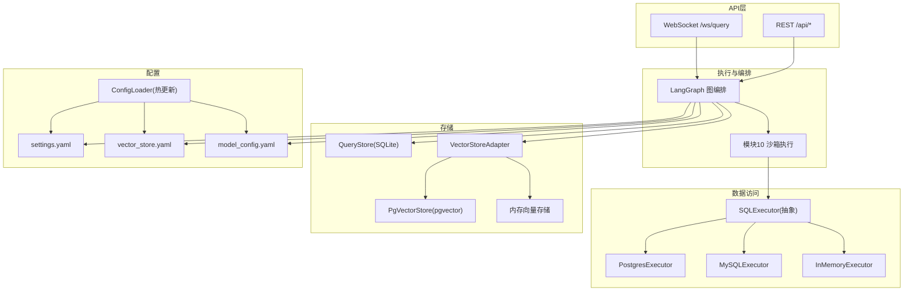
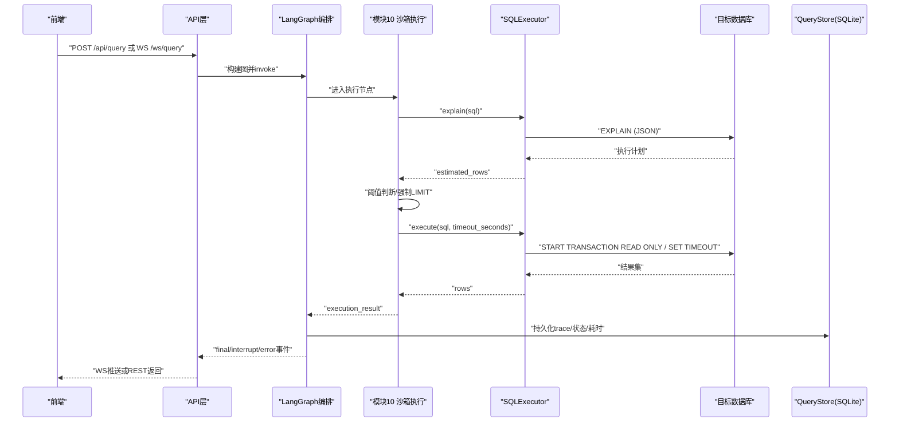
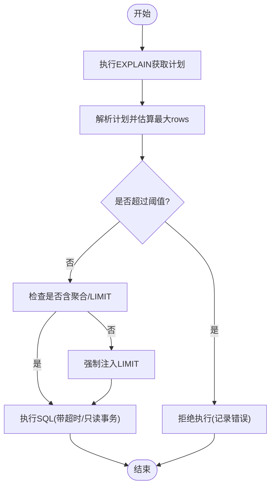
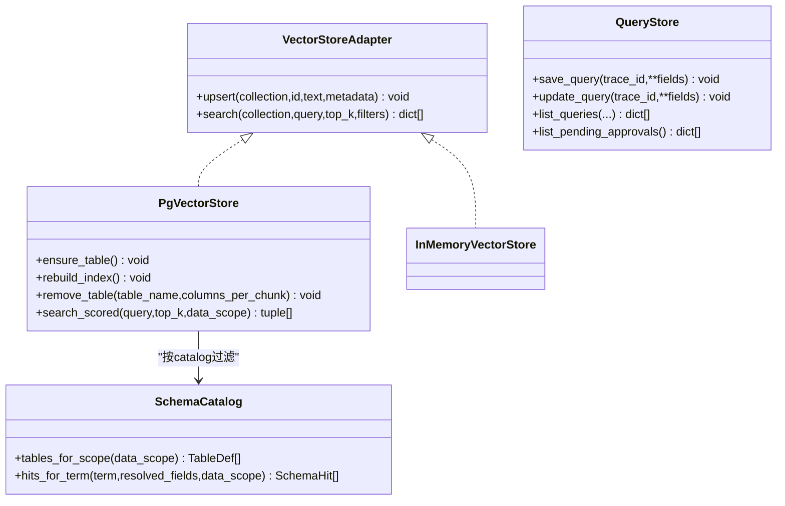
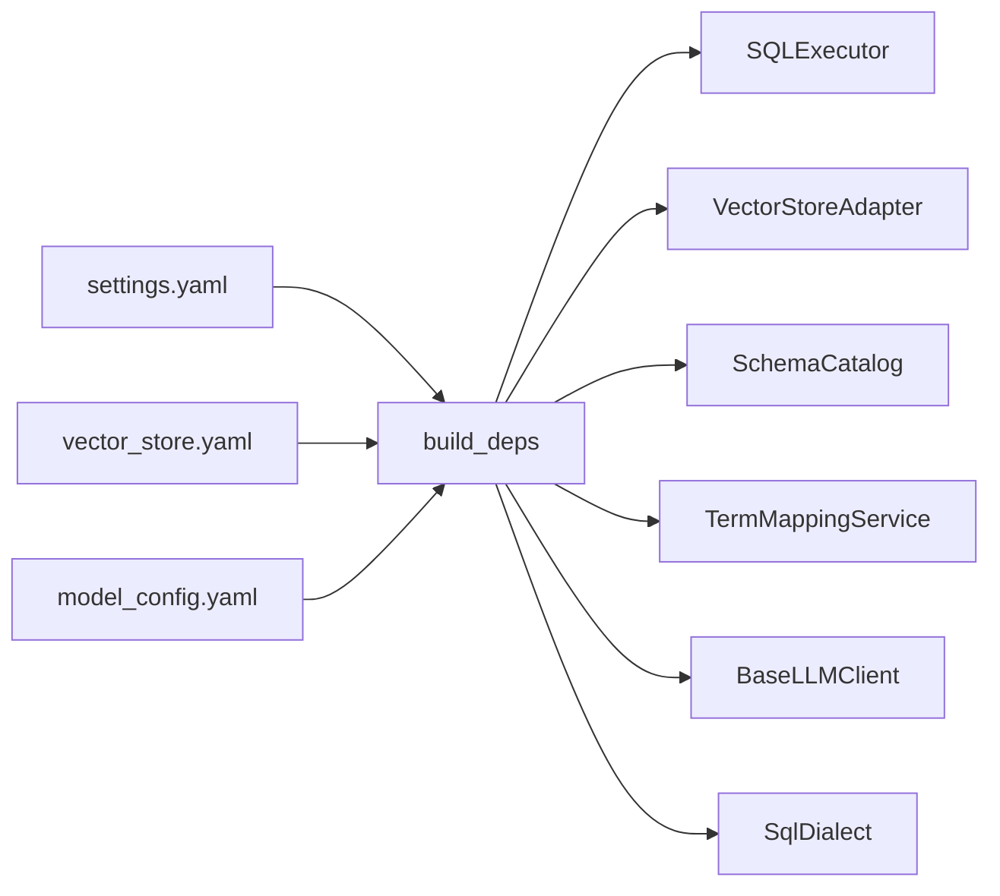

# 性能优化

<cite>
**本文引用的文件**   
- [executor.py](file://nl2sql_agent/services/executor.py)
- [deps.py](file://nl2sql_agent/services/deps.py)
- [settings.yaml](file://nl2sql_agent/config/settings.yaml)
- [vector_store.yaml](file://nl2sql_agent/config/vector_store.yaml)
- [model_config.yaml](file://nl2sql_agent/config/model_config.yaml)
- [config_loader.py](file://nl2sql_agent/services/config_loader.py)
- [query_store.py](file://nl2sql_agent/services/query_store.py)
- [api.py](file://nl2sql_agent/api.py)
- [base.py](file://nl2sql_agent/services/vector_store/base.py)
- [pg.py](file://nl2sql_agent/services/vector_store/pg.py)
- [schema_catalog.py](file://nl2sql_agent/services/schema_catalog.py)
- [m10_sandbox_execution.py](file://nl2sql_agent/nodes/m10_sandbox_execution.py)
- [profiler.py](file://nl2sql_agent/services/schema_ingest/profiler.py)
</cite>

## 目录
1. [简介](#简介)
2. [项目结构](#项目结构)
3. [核心组件](#核心组件)
4. [架构总览](#架构总览)
5. [详细组件分析](#详细组件分析)
6. [依赖关系分析](#依赖关系分析)
7. [性能考量与调优建议](#性能考量与调优建议)
8. [故障排查指南](#故障排查指南)
9. [结论](#结论)
10. [附录](#附录)

## 简介
本文件面向开发者与DBA，围绕NL2SQL系统的数据库性能优化提供系统化指导。内容涵盖：
- SQL执行计划分析与查询优化技术（EXPLAIN、预估行数阈值、只读事务、超时控制）
- 索引优化策略与查询重写技巧（结合系统内置的强制LIMIT与聚合保护）
- 连接池配置与资源限制（连接参数、超时、只读事务）
- 缓存策略（查询历史/审计存储、Schema目录缓存、向量检索缓存与更新机制）
- 分库分表方案（水平拆分策略、路由规则、负载均衡）
- 性能监控指标（慢查询日志、资源使用率、吞吐量与节点耗时）
- 性能调优工具与诊断方法（EXPLAIN、采样画像、评估指标）

## 项目结构
本项目将“执行器”“依赖装配”“配置加载”“向量存储”“查询历史存储”等能力解耦，便于在不同数据库方言下复用并扩展。关键路径包括：
- 执行器层：PostgresExecutor / MySQLExecutor / InMemoryExecutor
- 依赖装配：build_deps/build_executor_from_url/build_vector_store
- 配置中心：settings.yaml、vector_store.yaml、model_config.yaml、ConfigLoader热更新
- 向量存储：VectorStoreAdapter接口 + PgVectorStore实现（pgvector）与内存实现
- 查询历史：SQLite持久化（QueryStore），用于审计、审批、历史页
- API层：WebSocket流式事件 + REST接口，统一编排执行流程与状态落库

图表来源
- [api.py](file://nl2sql_agent/api.py)
- [m10_sandbox_execution.py](file://nl2sql_agent/nodes/m10_sandbox_execution.py)
- [executor.py](file://nl2sql_agent/services/executor.py)
- [query_store.py](file://nl2sql_agent/services/query_store.py)
- [base.py](file://nl2sql_agent/services/vector_store/base.py)
- [pg.py](file://nl2sql_agent/services/vector_store/pg.py)
- [settings.yaml](file://nl2sql_agent/config/settings.yaml)
- [vector_store.yaml](file://nl2sql_agent/config/vector_store.yaml)
- [model_config.yaml](file://nl2sql_agent/config/model_config.yaml)
- [config_loader.py](file://nl2sql_agent/services/config_loader.py)

章节来源
- [api.py](file://nl2sql_agent/api.py)
- [m10_sandbox_execution.py](file://nl2sql_agent/nodes/m10_sandbox_execution.py)
- [executor.py](file://nl2sql_agent/services/executor.py)
- [query_store.py](file://nl2sql_agent/services/query_store.py)
- [base.py](file://nl2sql_agent/services/vector_store/base.py)
- [pg.py](file://nl2sql_agent/services/vector_store/pg.py)
- [settings.yaml](file://nl2sql_agent/config/settings.yaml)
- [vector_store.yaml](file://nl2sql_agent/config/vector_store.yaml)
- [model_config.yaml](file://nl2sql_agent/config/model_config.yaml)
- [config_loader.py](file://nl2sql_agent/services/config_loader.py)

## 核心组件
- SQL执行器族
  - PostgresExecutor：READ ONLY事务 + statement_timeout，EXPLAIN JSON提取Plan Rows
  - MySQLExecutor：START TRANSACTION READ ONLY + MAX_EXECUTION_TIME，EXPLAIN FORMAT=JSON递归估算最大rows
  - InMemoryExecutor：测试/演示用，支持模拟失败与空结果
- 依赖装配
  - build_executor_from_url：按URL scheme自动选择执行器
  - build_vector_store：显式读取vector_store.yaml选择后端（memory/pgvector）
  - build_deps：组装AppConfig、TermMapping、Catalog、LLM、SQLDialect、向量存储、执行器等
- 配置加载
  - ConfigLoader：基于mtime的本地缓存+热更新，毫秒级生效
- 向量存储
  - VectorStoreAdapter：统一upsert/search接口
  - PgVectorStore：pgvector余弦距离检索，支持全量重建、按业务线过滤、scored检索
- 查询历史存储
  - QueryStore：SQLite持久化trace、状态、节点耗时、反馈等，线程安全写入

章节来源
- [executor.py](file://nl2sql_agent/services/executor.py)
- [deps.py](file://nl2sql_agent/services/deps.py)
- [config_loader.py](file://nl2sql_agent/services/config_loader.py)
- [base.py](file://nl2sql_agent/services/vector_store/base.py)
- [pg.py](file://nl2sql_agent/services/vector_store/pg.py)
- [query_store.py](file://nl2sql_agent/services/query_store.py)

## 架构总览
下图展示一次查询从前端到数据库执行的完整链路，包含执行前守卫（EXPLAIN阈值）、只读事务、超时控制、结果落库与事件推送。

图表来源
- [api.py](file://nl2sql_agent/api.py)
- [m10_sandbox_execution.py](file://nl2sql_agent/nodes/m10_sandbox_execution.py)
- [executor.py](file://nl2sql_agent/services/executor.py)
- [query_store.py](file://nl2sql_agent/services/query_store.py)

## 详细组件分析

### 执行器与执行计划分析
- EXPLAIN解析与预估行数
  - PostgreSQL：直接取Plan Rows
  - MySQL：递归遍历EXPLAIN JSON，取各节点rows最大值作为保守估计
- 执行保护
  - 只读事务：PostgreSQL BEGIN TRANSACTION READ ONLY；MySQL START TRANSACTION READ ONLY
  - 超时控制：PostgreSQL SET LOCAL statement_timeout；MySQL SET SESSION MAX_EXECUTION_TIME
  - 未聚合查询强制LIMIT：由SQLDialect注入limit，避免全表扫描
- 阈值拒绝
  - 当estimated_rows超过配置的explain_row_threshold时直接拒绝执行

图表来源
- [executor.py](file://nl2sql_agent/services/executor.py)
- [m10_sandbox_execution.py](file://nl2sql_agent/nodes/m10_sandbox_execution.py)

章节来源
- [executor.py](file://nl2sql_agent/services/executor.py)
- [m10_sandbox_execution.py](file://nl2sql_agent/nodes/m10_sandbox_execution.py)

### 连接池与资源限制
- 连接参数
  - MySQLExecutor：connect_timeout、autocommit、charset等通过conn_kwargs传入pymysql
  - PostgresExecutor：通过conninfo连接psycopg
- 超时与只读
  - 会话级超时设置，确保长查询被及时中断
  - 事务级只读保证不写库，降低风险
- 连接数管理
  - 当前实现为每次execute新建连接上下文；如需高并发可引入连接池（如pymysql.pooling、psycopg pool）并在deps中集中管理

章节来源
- [executor.py](file://nl2sql_agent/services/executor.py)
- [deps.py](file://nl2sql_agent/services/deps.py)

### 缓存策略
- 查询历史/审计缓存
  - QueryStore以SQLite持久化trace、状态、节点耗时、反馈等，供历史页、审计页、审批队列使用
- Schema目录缓存
  - SchemaCatalog从schema_catalog.yaml加载并按data_scope过滤，配合ConfigLoader mtime热更新
- 向量缓存
  - VectorStoreAdapter统一接口；PgVectorStore使用pgvector进行语义检索，支持rebuild_index与remove_table
  - 内存实现适合开发/测试，重启后重建

图表来源
- [base.py](file://nl2sql_agent/services/vector_store/base.py)
- [pg.py](file://nl2sql_agent/services/vector_store/pg.py)
- [schema_catalog.py](file://nl2sql_agent/services/schema_catalog.py)
- [query_store.py](file://nl2sql_agent/services/query_store.py)

章节来源
- [query_store.py](file://nl2sql_agent/services/query_store.py)
- [schema_catalog.py](file://nl2sql_agent/services/schema_catalog.py)
- [base.py](file://nl2sql_agent/services/vector_store/base.py)
- [pg.py](file://nl2sql_agent/services/vector_store/pg.py)

### 分库分表方案
- 水平拆分策略
  - 通过业务线（business_line）与data_scope进行逻辑隔离；共享表（shared=true）跨平台可见，行级权限由row_level_filter注入（如PLATFORM_CODE）
- 路由规则
  - 依赖build_executor_from_url根据URL scheme选择执行器；向量后端由vector_store.yaml显式配置
- 负载均衡
  - 当前为单实例执行器；生产环境可通过多进程/多实例部署，结合外部负载均衡器分发请求

章节来源
- [schema_catalog.py](file://nl2sql_agent/services/schema_catalog.py)
- [deps.py](file://nl2sql_agent/services/deps.py)
- [settings.yaml](file://nl2sql_agent/config/settings.yaml)

### 性能监控指标
- 节点耗时与追踪
  - node_latencies与trace_steps在状态中记录，API层持久化至QueryStore
- 执行错误与拒绝原因
  - execution_error、blocked_reason、plan_validation_errors等字段用于定位问题
- 评估指标
  - schema_metrics统计table_recall_at_k、column_recall、join_path_accuracy、sql_execution_accuracy、clarification_rate、human_modification_rate、avg_profile_seconds_per_table、avg_llm_cost_per_table

章节来源
- [state.py](file://nl2sql_agent/state.py)
- [api.py](file://nl2sql_agent/api.py)
- [query_store.py](file://nl2sql_agent/services/query_store.py)
- [schema_metrics.py](file://nl2sql_agent/eval/schema_metrics.py)

## 依赖关系分析
- 配置驱动
  - settings.yaml决定dialect、执行限制、超时、阈值等
  - vector_store.yaml决定向量后端（memory/pgvector）
  - model_config.yaml决定embedding维度与模型路径
- 依赖装配
  - build_deps串联ConfigLoader、SchemaCatalog、TermMapping、LLM、SQLDialect、VectorStore、Executor
  - build_executor_from_url按URL scheme选择执行器
  - build_vector_store按backend选择PgVectorStore或内存实现

图表来源
- [deps.py](file://nl2sql_agent/services/deps.py)
- [settings.yaml](file://nl2sql_agent/config/settings.yaml)
- [vector_store.yaml](file://nl2sql_agent/config/vector_store.yaml)
- [model_config.yaml](file://nl2sql_agent/config/model_config.yaml)

章节来源
- [deps.py](file://nl2sql_agent/services/deps.py)
- [settings.yaml](file://nl2sql_agent/config/settings.yaml)
- [vector_store.yaml](file://nl2sql_agent/config/vector_store.yaml)
- [model_config.yaml](file://nl2sql_agent/config/model_config.yaml)

## 性能考量与调优建议
- SQL执行计划与索引优化
  - 优先依据EXPLAIN输出识别全表扫描与低效连接；为高频过滤列、JOIN键、排序列建立合适索引
  - 对大表避免SELECT *，仅选择必要列；尽量使用覆盖索引减少回表
  - 针对MySQL，关注EXPLAIN JSON中各节点的rows与type；针对PostgreSQL，关注Plan Rows与Seq Scan/Index Scan
- 查询重写技巧
  - 避免不必要的子查询与复杂Join；必要时拆分为多次简单查询
  - 使用合适的聚合与GROUP BY，避免在大结果集上二次计算
  - 利用系统强制LIMIT保护未聚合查询，防止意外全表扫描
- 连接池与资源限制
  - 在高并发场景引入连接池，合理设置max_connections、idle_timeout、connect_timeout
  - 保持只读事务与超时设置，避免长尾查询拖垮系统
- 缓存策略
  - 启用Schema目录缓存与向量检索缓存，减少重复计算与网络开销
  - 定期rebuild_index，保证向量索引与最新Schema一致
- 监控与诊断
  - 开启慢查询日志（数据库侧），结合node_latencies与trace_steps定位瓶颈
  - 使用profiler采样画像，辅助理解字段分布与敏感信息处理
  - 通过评估指标持续跟踪召回率、准确率与成本

[本节为通用指导，不直接分析具体文件]

## 故障排查指南
- 执行失败与超时
  - 检查execution_error与blocked_reason；确认EXPLAIN阈值与timeout_seconds配置
  - 查看数据库端慢查询日志与执行计划，确认是否存在锁或资源争用
- 向量检索异常
  - 确认vector_store.yaml的backend与pgvector.url配置正确
  - 若使用pgvector，检查schema_embeddings表结构与索引；必要时调用rebuild_index
- 配置未生效
  - 确认ConfigLoader已热更新；必要时调用loader.reload()刷新缓存
- 历史与审计缺失
  - 检查QueryStore SQLite文件是否可写；确认trace_id是否正确传递

章节来源
- [executor.py](file://nl2sql_agent/services/executor.py)
- [deps.py](file://nl2sql_agent/services/deps.py)
- [query_store.py](file://nl2sql_agent/services/query_store.py)
- [pg.py](file://nl2sql_agent/services/vector_store/pg.py)
- [config_loader.py](file://nl2sql_agent/services/config_loader.py)

## 结论
本系统通过“执行器抽象+依赖装配+配置驱动”的架构，实现了安全的只读执行、严格的执行前守卫、灵活的向量检索与完善的审计追踪。在生产环境中，建议结合数据库慢查询日志、节点耗时与评估指标，持续优化索引与查询，完善连接池与缓存策略，保障高可用与高性能。

[本节为总结性内容，不直接分析具体文件]

## 附录
- 关键配置项说明
  - settings.yaml：dialect、schema_search_top_k、database_url、execution.read_only/limit/timeout_seconds/explain_row_threshold、row_level_filter
  - vector_store.yaml：backend（memory/pgvector）、pgvector.url
  - model_config.yaml：embedding.provider/model/model_path/dimension
- 常用命令与脚本
  - 导入Schema与重跑入库：scripts/import_schema_from_db.py、scripts/ingest_schema.py
  - 审核与评论：review_schema_comments.py
- 评估与画像
  - eval/schema_metrics.py：统计召回率、准确率、澄清率、人工修改率、每表画像耗时与LLM成本
  - services/schema_ingest/profiler.py：受预算约束的字段画像与分类

章节来源
- [settings.yaml](file://nl2sql_agent/config/settings.yaml)
- [vector_store.yaml](file://nl2sql_agent/config/vector_store.yaml)
- [model_config.yaml](file://nl2sql_agent/config/model_config.yaml)
- [schema_metrics.py](file://nl2sql_agent/eval/schema_metrics.py)
- [profiler.py](file://nl2sql_agent/services/schema_ingest/profiler.py)